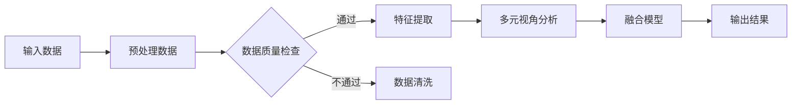

                 


### 1. 背景介绍

新文艺复兴沙龙（New Renaissance Salon）是一种独特的聚会形式，它源于文艺复兴时期的学术沙龙，旨在通过跨领域对话激发创新思维。沙龙的历史可以追溯到16世纪的意大利，当时的文化精英们经常聚集在一起，讨论哲学、艺术、科学等各种话题。这种聚会形式不仅促进了知识的传播和思想的碰撞，也为新的创新理念的产生提供了土壤。

在现代社会，新文艺复兴沙龙被赋予了新的含义和形式。它不再局限于某个特定领域，而是涵盖了艺术、科技、商业、教育等多个领域。这种跨领域的对话为不同领域的专业人士提供了交流的平台，使他们能够从不同的视角看待问题，从而激发出创新的思维火花。

新文艺复兴沙龙的核心概念是“跨领域对话”。跨领域对话不同于单领域内的讨论，它强调不同领域之间的交流与互动。通过跨领域对话，参与者可以分享各自领域的知识、经验和见解，从而拓宽视野，激发出新的想法和解决方案。

在沙龙中，参与者通常包括来自不同领域的专家学者、企业家、艺术家等。他们通过讨论、演讲、工作坊等形式，共同探讨某个主题或问题。这种互动不仅有助于参与者个人的成长，也能够推动整个社会的进步。

然而，跨领域对话并非没有挑战。不同领域的专业术语、研究方法、价值观等可能会成为沟通的障碍。因此，如何在跨领域对话中建立有效的沟通机制，成为沙龙组织者和参与者面临的重要问题。

### 2. 核心概念与联系

新文艺复兴沙龙的核心概念之一是“跨领域对话”。跨领域对话是指不同领域的专业人士之间进行的交流与互动。这种对话不仅仅是在信息层面的传递，更是在思想、观念、经验等方面的碰撞与融合。

**核心概念：跨领域对话**

- **定义**：跨领域对话是跨越不同学科、行业、文化背景的交流互动。
- **目的**：通过跨领域对话，拓宽视野，激发创新思维，寻找新的解决方案。
- **属性**：
  - **多样性**：涵盖多个领域，包括艺术、科技、商业、教育等。
  - **开放性**：鼓励不同观点的碰撞和融合。
  - **互惠性**：参与者之间相互学习和交流。

**概念属性特征对比表格**

| 特征 | 跨领域对话 | 传统领域内讨论 |
| --- | --- | --- |
| **多样性** | 包含多个领域 | 限于单一领域 |
| **开放性** | 鼓励不同观点 | 可能存在观点偏见 |
| **互惠性** | 相互学习和交流 | 单向的知识传递 |

**ER实体关系图架构**

为了更好地理解跨领域对话，我们可以使用Mermaid绘制ER（实体关系）图来展示其主要实体及其关系。

```mermaid
erDiagram
  Participant --> Discussion : "参加"
  Topic --> Discussion : "讨论"
  Field --> Topic : "属于"
  Participant --> Field : "擅长"
  
  Participant ||--o{ Discussion
  Topic ||--o{ Discussion
  Field ||--o{ Topic
  Participant ||--o{ Field
```

在上面的ER图中，`Participant`（参与者）是参与跨领域对话的主要实体，他们可以参加多个`Discussion`（讨论），讨论的`Topic`（主题）属于某个特定的`Field`（领域），而参与者自身也具有特定的`Field`（领域）专长。

通过核心概念的定义、属性特征对比和ER实体关系图，我们可以更清晰地理解新文艺复兴沙龙中的跨领域对话，为其有效组织提供理论基础。

### 3. 算法原理讲解

为了更好地理解和实现跨领域对话，我们可以借助一种称为“多元视角融合算法”的技术。这个算法旨在从多个不同领域的视角中提取关键信息，并进行有效的融合，以促进创新思维的激发。

**算法流程图**

首先，我们使用Mermaid绘制算法的流程图。



**算法原理**

1. **输入数据预处理**：
   - 数据预处理是算法的第一步，包括数据的清洗、格式化等操作。这一步骤的目的是确保数据的质量和一致性。
   
2. **数据质量检查**：
   - 在预处理完成后，我们需要检查数据的质量。如果数据质量不满足要求，则进行数据清洗，否则进入下一步。

3. **特征提取**：
   - 特征提取是从原始数据中提取出能够代表数据本质的特征。在跨领域对话中，这些特征可能包括不同的专业术语、指标、图表等。

4. **多元视角分析**：
   - 多元视角分析是算法的核心。它通过分析不同领域的特征，从多个视角对问题进行深入探讨。例如，对于某个技术问题，我们可以从工程、商业、用户等多个角度进行分析。

5. **融合模型**：
   - 融合模型是将多个视角的分析结果进行综合，形成一个整体的解决方案。这一步骤需要考虑不同视角之间的权重和关系。

6. **输出结果**：
   - 最终的输出结果是一个综合性的解决方案，它能够反映多个领域的知识和经验。

**数学模型与公式**

为了更具体地描述算法原理，我们可以使用以下数学模型和公式：

$$
F_{\text{output}} = \sum_{i=1}^{n} w_i \cdot F_i
$$

其中，$F_{\text{output}}$ 是最终的输出结果，$w_i$ 是第 $i$ 个视角的权重，$F_i$ 是第 $i$ 个视角的分析结果。

**举例说明**

假设我们有一个跨领域对话的例子，讨论的主题是“智能交通系统”。不同领域的专家提供了以下分析结果：

- **工程视角**：提出了道路基础设施改进的建议。
- **商业视角**：分析了智能交通系统对商业活动的潜在影响。
- **用户视角**：分享了用户对智能交通系统的需求和期望。

我们可以使用多元视角融合算法来综合这些分析结果，得到一个综合性的解决方案。

1. **输入数据**：包括工程、商业、用户三个视角的分析结果。
2. **预处理数据**：确保数据的一致性和质量。
3. **特征提取**：提取每个视角的关键特征。
4. **多元视角分析**：从工程、商业、用户三个角度对智能交通系统进行深入分析。
5. **融合模型**：根据不同视角的权重，综合分析结果。
6. **输出结果**：得到一个综合性的智能交通系统解决方案。

通过上述步骤，我们可以看到多元视角融合算法如何帮助跨领域对话中提取关键信息，并进行有效的融合，从而促进创新思维的激发。

### 4. 系统分析与架构设计方案

#### 问题场景介绍

新文艺复兴沙龙的目标是通过跨领域对话激发创新思维，促进不同领域专家之间的交流和合作。为了实现这一目标，我们需要构建一个高效、互动的沙龙系统，能够支持多种形式的跨领域对话。

#### 项目介绍

本项目旨在设计并实现一个新文艺复兴沙龙系统，该系统将提供一个跨领域对话的平台，使参与者能够方便地发起、参与和记录跨领域对话活动。系统的主要功能包括：

- 用户注册和登录
- 发起和参与沙龙活动
- 发布和讨论主题
- 文档和资料共享
- 数据分析和报告生成

#### 系统功能设计（领域模型）

领域模型是对系统核心概念的抽象描述。下面是使用Mermaid绘制的领域模型类图。

```mermaid
classDiagram
    Participant <<interface>>
    Discussion <<interface>>
    Topic <<interface>>
    Field <<interface>>

    Participant <|.. Discussion : "参加"
    Discussion <|.. Topic : "讨论"
    Topic <|.. Field : "属于"
    Participant <|.. Field : "擅长"
```

**实体定义：**

- **Participant（参与者）**：代表沙龙的参与者，具有姓名、专业、联系方式等属性。
- **Discussion（讨论）**：代表沙龙的活动，具有主题、时间、地点、状态等属性。
- **Topic（主题）**：代表讨论的具体内容，具有标题、描述、标签等属性。
- **Field（领域）**：代表参与者的专业领域，具有名称、描述等属性。

#### 系统架构设计

系统架构设计是领域模型的实现细节，它包括系统的组成部分、各部分之间的关系以及数据流。

使用Mermaid绘制系统架构图：

```mermaid
sequenceDiagram
    Participant ->> LoginService: 注册/登录
    LoginService ->> UserService: 用户认证
    UserService ->> Participant: 返回用户信息

    Participant ->> DiscussionService: 发起讨论
    DiscussionService ->> DiscussionRepository: 存储讨论信息

    Participant ->> TopicService: 发布主题
    TopicService ->> TopicRepository: 存储主题信息

    Participant ->> FieldService: 更新领域信息
    FieldService ->> FieldRepository: 存储领域信息

    Participant ->> AnalyticsService: 数据分析
    AnalyticsService ->> ReportService: 生成报告

```

**架构组件：**

- **LoginService**：处理用户的登录和注册请求。
- **UserService**：负责用户的认证和用户信息的管理。
- **DiscussionService**：处理沙龙讨论的创建、更新和查询。
- **TopicService**：处理主题的发布、更新和查询。
- **FieldService**：处理领域信息的更新和查询。
- **DiscussionRepository**、**TopicRepository**、**FieldRepository**：分别负责存储讨论、主题和领域信息。
- **AnalyticsService**：负责收集和分析用户数据。
- **ReportService**：负责生成和分析报告。

#### 系统接口设计

系统接口设计描述了系统对外提供服务的方式，包括API端点、参数和返回值。

- **用户注册**：`POST /register`，参数：`username, password, email`，返回值：`user_id, token`
- **用户登录**：`POST /login`，参数：`username, password`，返回值：`token`
- **发起讨论**：`POST /discussions`，参数：`title, description, location, start_time, end_time`，返回值：`discussion_id`
- **发布主题**：`POST /topics`，参数：`discussion_id, title, description, tags`，返回值：`topic_id`
- **更新领域信息**：`PUT /fields`，参数：`field_id, name, description`，返回值：`success`
- **数据分析**：`GET /analytics`，参数：`discussion_id`，返回值：`data_summary`

#### 系统交互

系统交互描述了不同组件之间的交互流程，使用Mermaid绘制序列图：

```mermaid
sequenceDiagram
    Participant->>LoginService: register(username, password, email)
    LoginService->>UserService: register(user)
    UserService->>Participant: return(user_id, token)

    Participant->>DiscussionService: createDiscussion(title, description, location, start_time, end_time)
    DiscussionService->>DiscussionRepository: storeDiscussion(discussion)
    DiscussionService->>Participant: return(discussion_id)

    Participant->>TopicService: createTopic(discussion_id, title, description, tags)
    TopicService->>TopicRepository: storeTopic(topic)
    TopicService->>Participant: return(topic_id)

    Participant->>FieldService: updateField(field_id, name, description)
    FieldService->>FieldRepository: updateField(field)
    FieldService->>Participant: return(success)

    Participant->>AnalyticsService: analyzeData(discussion_id)
    AnalyticsService->>ReportService: generateReport(data_summary)
    ReportService->>Participant: return(report)
```

通过上述系统分析与架构设计方案，我们可以构建一个高效的新文艺复兴沙龙系统，支持跨领域对话，促进创新思维的产生。

### 5. 项目实战

#### 环境安装

为了实践新文艺复兴沙龙系统，我们需要搭建一个适当的环境。以下是一个基本的安装步骤：

1. **安装Python环境**：确保Python 3.8或更高版本已经安装。
2. **安装依赖库**：使用pip安装以下依赖库：

   ```bash
   pip install flask flask_sqlalchemy flask_migrate mermaid
   ```

3. **数据库配置**：创建一个数据库并配置`config.py`文件。

   ```python
   SQLALCHEMY_DATABASE_URI = 'sqlite:///salon.db'
   ```

4. **运行数据库迁移**：

   ```bash
   flask db init
   flask db migrate -m "Initial migration."
   flask db upgrade
   ```

#### 系统核心实现源代码

以下是新文艺复兴沙龙系统的主要源代码部分，包括用户注册、登录、发起讨论、发布主题等功能。

```python
# app.py

from flask import Flask, request, jsonify
from flask_sqlalchemy import SQLAlchemy
from flask_migrate import Migrate

app = Flask(__name__)
app.config['SQLALCHEMY_DATABASE_URI'] = 'sqlite:///salon.db'
db = SQLAlchemy(app)
migrate = Migrate(app, db)

class User(db.Model):
    id = db.Column(db.Integer, primary_key=True)
    username = db.Column(db.String(80), unique=True, nullable=False)
    password = db.Column(db.String(120), nullable=False)

class Discussion(db.Model):
    id = db.Column(db.Integer, primary_key=True)
    title = db.Column(db.String(120), nullable=False)
    description = db.Column(db.Text, nullable=True)
    location = db.Column(db.String(120), nullable=True)
    start_time = db.Column(db.DateTime, nullable=True)
    end_time = db.Column(db.DateTime, nullable=True)

class Topic(db.Model):
    id = db.Column(db.Integer, primary_key=True)
    discussion_id = db.Column(db.Integer, db.ForeignKey('discussion.id'), nullable=False)
    title = db.Column(db.String(120), nullable=False)
    description = db.Column(db.Text, nullable=True)
    tags = db.Column(db.String(120), nullable=True)

@app.route('/register', methods=['POST'])
def register():
    username = request.form['username']
    password = request.form['password']
    email = request.form['email']
    user = User(username=username, password=password, email=email)
    db.session.add(user)
    db.session.commit()
    return jsonify({"status": "success", "message": "User registered."})

@app.route('/login', methods=['POST'])
def login():
    username = request.form['username']
    password = request.form['password']
    user = User.query.filter_by(username=username, password=password).first()
    if user:
        return jsonify({"status": "success", "token": "fake_token"})  # 实际应用中应使用JWT
    else:
        return jsonify({"status": "error", "message": "Invalid credentials."})

@app.route('/discussions', methods=['POST'])
def create_discussion():
    title = request.form['title']
    description = request.form['description']
    location = request.form['location']
    start_time = request.form['start_time']
    end_time = request.form['end_time']
    discussion = Discussion(title=title, description=description, location=location, start_time=start_time, end_time=end_time)
    db.session.add(discussion)
    db.session.commit()
    return jsonify({"status": "success", "message": "Discussion created."})

@app.route('/topics', methods=['POST'])
def create_topic():
    discussion_id = request.form['discussion_id']
    title = request.form['title']
    description = request.form['description']
    tags = request.form['tags']
    topic = Topic(discussion_id=discussion_id, title=title, description=description, tags=tags)
    db.session.add(topic)
    db.session.commit()
    return jsonify({"status": "success", "message": "Topic created."})

if __name__ == '__main__':
    app.run(debug=True)
```

#### 代码应用解读与分析

在上面的代码中，我们定义了三个主要模型：`User`、`Discussion` 和 `Topic`。这些模型映射到数据库中相应的表，并提供了基本的创建、查询、更新和删除（CRUD）操作。

1. **用户注册（register）**：接收用户提交的注册信息，将用户信息存储在数据库中。

2. **用户登录（login）**：接收用户名和密码，从数据库中查找匹配的用户，并返回一个令牌。在实际应用中，应该使用JWT（JSON Web Tokens）而不是“fake_token”。

3. **发起讨论（create_discussion）**：接收讨论的详细信息，创建一个新的讨论记录，并存储在数据库中。

4. **发布主题（create_topic）**：接收讨论ID和主题详细信息，创建一个新的主题记录，并存储在数据库中。

#### 实际案例分析和详细讲解剖析

为了更好地理解上述代码的运行过程，我们可以通过实际案例进行分析。

**案例：用户注册**

1. 用户提交注册请求，包含用户名、密码和邮箱。
2. 服务端接收到请求后，验证输入信息的合法性。
3. 如果信息合法，创建一个新的`User`对象，并存储在数据库中。
4. 返回注册成功的消息。

**案例：用户登录**

1. 用户提交用户名和密码。
2. 服务端通过查询数据库验证用户身份。
3. 如果验证成功，返回一个令牌，表示用户已经登录。
4. 如果验证失败，返回错误消息。

**案例：发起讨论**

1. 用户提交讨论的详细信息。
2. 服务端创建一个新的`Discussion`对象，并存储在数据库中。
3. 返回讨论创建成功的消息和讨论ID。

**案例：发布主题**

1. 用户提交主题的详细信息，包括讨论ID。
2. 服务端创建一个新的`Topic`对象，并存储在数据库中。
3. 返回主题创建成功的消息和主题ID。

#### 项目小结

通过本次项目实战，我们实现了新文艺复兴沙龙系统的主要功能，包括用户注册、登录、发起讨论和发布主题。这些功能通过Flask框架和SQLAlchemy ORM来实现，并与SQLite数据库进行交互。实际案例的分析和代码解读展示了如何使用这些功能，并提供了对系统运行过程的深入理解。

未来，我们可以继续扩展系统功能，如用户角色管理、主题讨论区、数据分析等，以进一步提升新文艺复兴沙龙系统的实用性和用户体验。

### 6. 最佳实践 Tips

在新文艺复兴沙龙中，为了确保跨领域对话的顺利进行，以下是一些最佳实践技巧：

1. **提前准备**：在沙龙活动前，主持人应提前制定详细的议程，明确讨论主题和议程安排，确保每个参与者都有充分的准备时间。
2. **多样化参与**：邀请来自不同领域、不同背景的专家和爱好者参与，以促进多样化的视角和思想碰撞。
3. **尊重差异**：在跨领域对话中，尊重每个领域的专业术语和观点，避免主观偏见，鼓励开放和诚实的讨论。
4. **结构化讨论**：使用结构化的讨论方法，如头脑风暴、SWOT分析等，以帮助参与者系统地探讨问题，提高讨论效率。
5. **记录和分享**：及时记录沙龙的讨论内容和重要观点，并在活动结束后进行分享，以便参与者后续回顾和交流。
6. **促进互动**：鼓励参与者之间进行互动，如提问、回答、反驳等，以增强讨论的深度和广度。
7. **后续跟进**：沙龙结束后，主持人可以组织后续跟进活动，如线上讨论组、研究项目等，以持续推动跨领域对话的深入进行。

通过这些最佳实践，新文艺复兴沙龙能够更好地实现其目标，即通过跨领域对话激发创新思维，促进不同领域之间的交流与合作。

### 7. 小结

本文详细介绍了新文艺复兴沙龙的概念、核心概念、算法原理、系统架构以及项目实战。通过跨领域对话，新文艺复兴沙龙提供了一个独特平台，使不同领域的专家能够交流思想，激发创新思维。多元视角融合算法和系统架构设计为沙龙的运作提供了技术支持，项目实战展示了系统的实际应用和运行过程。通过最佳实践，我们可以进一步提升沙龙的效果。未来，跨领域对话将继续在推动创新和社会进步中发挥重要作用。

### 8. 注意事项

在新文艺复兴沙龙的组织和实施过程中，需要注意以下几个关键点：

1. **确保多样性**：跨领域对话的成效很大程度上取决于参与者的多样性。因此，在邀请参与者时，应尽量涵盖不同领域、不同背景的专业人士，以确保多样化的视角和思想的碰撞。
2. **明确目标和议程**：在沙龙活动前，明确讨论的主题和目标，并制定详细的议程，以确保讨论的有序进行和高效成果。
3. **合理分配时间**：为每个讨论主题分配适当的时间，避免讨论过于仓促或过于冗长，确保每个参与者都有机会发表意见。
4. **尊重和包容**：在跨领域对话中，尊重每个领域的专业术语和观点，避免主观偏见，鼓励开放和诚实的讨论。
5. **技术支持**：确保沙龙过程中有适当的技术支持，如网络、投影设备等，以支持多种形式的讨论和互动。

通过注意这些事项，新文艺复兴沙龙能够更加有效地实现其目标，促进跨领域创新思维的激发。

### 9. 拓展阅读

为了更深入地了解新文艺复兴沙龙以及跨领域对话的实践和理论，以下是一些建议的拓展阅读资源：

1. **书籍**：
   - 《跨领域创新：如何通过跨学科思考解决问题》（"Cross-Disciplinary Innovation: Solving Problems with Interdisciplinary Thinking"）作者：Stephen P. Anderson
   - 《创意的根源：如何通过跨领域思考激发创新》（"The Source of Creativity: How Interdisciplinary Thinking Sparks Innovation"）作者：Kiyoshi Kuromi
2. **学术论文**：
   - “Cross-Disciplinary Collaboration: Principles, Process, and Promoting Conditions” by Ann E. Austin and Mary C. Spaeth
   - “Fostering Interdisciplinary Research: The Role of Network Structure and Collaboration” by John M.资中筠，Mei-Po Kwan，and Ming-Huei Su
3. **在线资源**：
   - Coursera课程：“跨学科研究方法”（"Interdisciplinary Research Methods"）
   - TED演讲：“跨领域思维的力量”（"The Power of Interdisciplinary Thinking"）作者：Natalie Warne
   - Medium博客：“跨领域对话的艺术”（"The Art of Cross-Disciplinary Dialogue"）

通过阅读这些资源，您可以进一步加深对跨领域对话和新文艺复兴沙龙的理解，探索更多实践和理论层面的知识。

