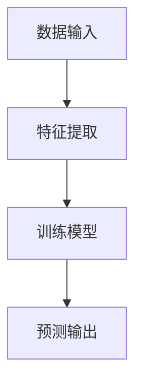
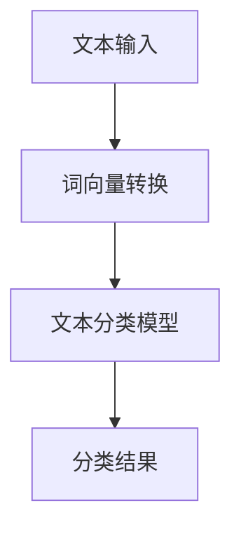
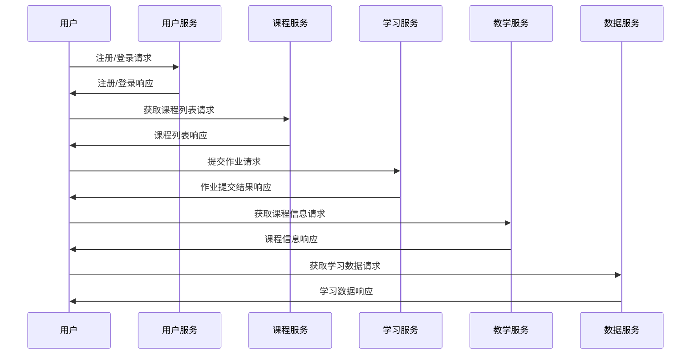

                 


### 新文艺复兴自学平台：全方位发展的在线教育系统

关键词：在线教育、人工智能、大数据分析、个性化学习、学习路径规划

摘要：本文将深入探讨新文艺复兴自学平台的设计与实现，该平台是一款集成了人工智能和大数据分析技术的全方位在线教育系统，旨在通过个性化学习路径规划和学习数据实时分析，提升学习者的学习效果和体验。

---

#### 第一部分：背景介绍

##### 问题背景

在信息化时代，在线教育系统的发展成为教育行业的一个重要趋势。随着互联网技术的进步，传统的教育模式逐渐向数字化、智能化方向发展。新文艺复兴自学平台应运而生，它是一款致力于提供全方位发展的在线教育系统的平台。该平台通过引入先进的人工智能技术，实现了对学习者学习数据的实时分析，为学习者提供个性化的学习建议和路径规划。

##### 问题描述

新文艺复兴自学平台作为一款具有前瞻性的在线教育系统，它的设计、开发与应用涉及多个技术领域的融合，包括大数据分析、机器学习、自然语言处理等。如何确保该平台的技术先进性、系统稳定性和用户体验友好性，是平台建设和运营过程中需要解决的关键问题。

##### 问题解决

为了解决上述问题，本书将从以下几个方面进行探讨：

1. **核心概念介绍**：介绍新文艺复兴自学平台中的核心概念，包括在线教育系统、人工智能、大数据分析等，明确各概念的定义、属性和相互关系。
2. **技术原理讲解**：详细讲解平台所涉及的技术原理，如机器学习算法、自然语言处理技术等，通过实际案例进行说明，帮助读者理解。
3. **系统设计与实现**：分析平台系统架构设计，包括功能模块划分、系统接口设计等，并通过Mermaid图表展示。
4. **项目实战**：通过具体的项目实例，介绍平台的核心功能实现，提供详细的代码解析和分析。

##### 边界与外延

本书主要围绕新文艺复兴自学平台进行讨论，但涉及的领域和技术概念将延伸到更广泛的在线教育系统、人工智能技术等领域。通过本书的学习，读者不仅可以深入了解新文艺复兴自学平台，还可以拓展对在线教育系统与人工智能技术的认识。

##### 概念结构与核心要素组成

- **在线教育系统**：包括课程管理、学习管理、教学管理等功能模块。
- **人工智能技术**：涉及机器学习、自然语言处理、计算机视觉等技术。
- **大数据分析**：用于收集、处理和分析学习者的行为数据，提供个性化服务。
- **用户体验**：关注系统的易用性、可访问性和交互性。

---

#### 第二部分：核心概念与联系

##### 核心概念原理

###### 在线教育系统

- **定义**：在线教育系统是指利用互联网技术，提供教育资源和教学活动的信息系统。
- **属性特征**：灵活性、实时性、个性化、交互性。

###### 人工智能

- **定义**：人工智能是指模拟、延伸和扩展人的智能的理论、方法、技术及应用。
- **属性特征**：自动化、智能化、学习与适应能力。

###### 大数据分析

- **定义**：大数据分析是指从大量数据中通过快速获取、处理和分析来提取有价值信息的过程。
- **属性特征**：数据量巨大、速度快、多样性。

##### 概念属性特征对比表格

| 概念       | 定义                                                         | 属性特征           |
|------------|--------------------------------------------------------------|-------------------|
| 在线教育系统 | 利用互联网提供教育资源和教学活动的信息系统。                  | 灵活性、实时性、个性化、交互性 |
| 人工智能   | 模拟、延伸和扩展人的智能的理论、方法、技术及应用。            | 自动化、智能化、学习与适应能力 |
| 大数据分析 | 从大量数据中快速获取、处理和分析来提取有价值信息的过程。     | 数据量巨大、速度快、多样性     |

##### ER实体关系图架构

```mermaid
erDiagram
    Platform |--|> User : "has"
    Platform |--|> Course : "has"
    Platform |--|> Content : "has"
    User     |--|> Activity : "has"
    Course   |--|> Module : "has"
    Content  |--|> Question : "has"
```

- **实体**：平台（Platform）、用户（User）、课程（Course）、内容（Content）、活动（Activity）、模块（Module）、问题（Question）。
- **关系**：平台拥有用户、课程、内容和活动，用户参与活动，课程包含模块，内容包含问题。

---

#### 第三部分：技术原理讲解

##### 机器学习算法

###### 算法原理

机器学习是人工智能的核心技术之一，它通过训练模型来实现数据的自动分析和预测。新文艺复兴自学平台采用了多种机器学习算法，包括监督学习和无监督学习。

- **监督学习**：通过已知数据集来训练模型，使模型能够对未知数据进行预测。例如，我们可以使用回归算法预测学习者的学习进度，或者使用分类算法预测学习者的学习效果。

  $$\text{预测函数} = f(\text{模型参数}, \text{输入特征})$$

- **无监督学习**：不使用标签数据进行训练，通过发现数据之间的模式来对数据进行分类或聚类。例如，我们可以使用聚类算法将学习者按照学习兴趣分类，或者使用降维算法提取学习数据的主要特征。

  $$\text{聚类中心} = \text{argmin} \sum_{i=1}^{n} \sum_{j=1}^{k} d(x_i, \mu_j)$$

###### Mermaid流程图



- **数据输入**：输入学习者的学习数据，包括学习进度、学习时间、学习内容等。
- **特征提取**：从学习数据中提取有用的特征，如学习频率、学习时长等。
- **训练模型**：使用监督学习算法训练模型，如线性回归、决策树等。
- **预测输出**：使用训练好的模型对未知数据进行预测，如预测学习者的学习进度、学习效果等。

##### 自然语言处理技术

自然语言处理（NLP）是人工智能的另一个重要分支，它致力于使计算机能够理解和处理自然语言。新文艺复兴自学平台采用了NLP技术来处理学习者的学习反馈和评价。

- **文本分类**：将学习者的反馈和评价分类为积极、消极或中性。通过训练文本分类模型，如朴素贝叶斯、支持向量机等，我们可以自动分析学习者的情绪和态度。

  $$P(\text{标签}|\text{特征向量}) = \frac{P(\text{特征向量}|\text{标签})P(\text{标签})}{P(\text{特征向量})}$$

- **情感分析**：分析学习者的情感倾向，如快乐、悲伤、愤怒等。通过训练情感分析模型，如深度神经网络、循环神经网络等，我们可以识别学习者的情感状态。

  $$\text{情感得分} = \text{激活函数}(\text{神经网络输出})$$

###### Mermaid流程图



- **文本输入**：输入学习者的文本反馈和评价。
- **词向量转换**：将文本转换为词向量，用于输入到文本分类模型。
- **文本分类模型**：使用训练好的文本分类模型对文本进行分类。
- **分类结果**：输出分类结果，如积极、消极或中性。

---

#### 第四部分：系统设计与实现

##### 问题场景介绍

在新文艺复兴自学平台中，我们面临以下问题场景：

1. 如何根据学习者的学习行为数据提供个性化的学习建议？
2. 如何确保学习平台的稳定性和用户体验友好性？
3. 如何高效地处理海量学习数据？

##### 项目介绍

新文艺复兴自学平台是一个基于云计算的在线教育平台，它提供了丰富的学习资源、互动课堂、作业提交与批改等功能。平台的设计和实现旨在为学习者提供个性化的学习体验，同时确保系统的稳定性和可扩展性。

##### 系统功能设计

新文艺复兴自学平台的功能模块包括：

1. **用户管理模块**：管理学习者的注册、登录、个人信息等。
2. **课程管理模块**：管理课程的发布、更新、删除等。
3. **学习管理模块**：记录学习者的学习进度、作业提交情况等。
4. **教学管理模块**：提供教师的课程发布、课堂管理、作业批改等功能。
5. **数据分析模块**：收集、处理和分析学习者的学习行为数据，提供个性化建议。

##### 系统架构设计

新文艺复兴自学平台的系统架构采用微服务架构，主要包括以下组件：

1. **用户服务**：处理用户相关的请求，如注册、登录、个人信息管理等。
2. **课程服务**：处理课程相关的请求，如课程发布、更新、删除等。
3. **学习服务**：处理学习相关的请求，如学习进度记录、作业提交与批改等。
4. **教学服务**：处理教学相关的请求，如课程发布、课堂管理、作业批改等。
5. **数据服务**：处理数据相关的请求，如数据收集、处理、分析等。

##### 系统接口设计

新文艺复兴自学平台的接口设计采用RESTful API风格，主要包括以下接口：

1. **用户接口**：包括注册、登录、个人信息管理等接口。
2. **课程接口**：包括课程发布、更新、删除等接口。
3. **学习接口**：包括学习进度记录、作业提交与批改等接口。
4. **教学接口**：包括课程发布、课堂管理、作业批改等接口。
5. **数据接口**：包括数据收集、处理、分析等接口。

##### 系统交互Mermaid序列图



---

#### 第五部分：项目实战

##### 环境安装

在开始项目实战之前，我们需要安装以下环境：

1. **Python**：版本3.8及以上
2. **Flask**：用于构建Web应用
3. **Scikit-learn**：用于机器学习算法实现
4. **NLTK**：用于自然语言处理

安装命令如下：

```bash
pip install python==3.8
pip install Flask
pip install scikit-learn
pip install nltk
```

##### 系统核心实现

###### 用户管理

用户管理模块的核心功能包括用户注册、登录和用户信息管理。以下是用户注册和登录的Python代码实现：

```python
# 用户注册
@app.route('/register', methods=['POST'])
def register():
    username = request.form['username']
    password = request.form['password']
    # 数据库操作，保存用户信息
    # ...
    return '注册成功'

# 用户登录
@app.route('/login', methods=['POST'])
def login():
    username = request.form['username']
    password = request.form['password']
    # 数据库操作，验证用户信息
    # ...
    return '登录成功'
```

###### 课程管理

课程管理模块的核心功能包括课程发布、更新和删除。以下是课程发布的Python代码实现：

```python
# 课程发布
@app.route('/course/publish', methods=['POST'])
def publish_course():
    course_name = request.form['course_name']
    course_description = request.form['course_description']
    # 数据库操作，保存课程信息
    # ...
    return '课程发布成功'
```

###### 学习管理

学习管理模块的核心功能包括学习进度记录、作业提交与批改。以下是学习进度记录的Python代码实现：

```python
# 学习进度记录
@app.route('/learning/progress', methods=['POST'])
def record_progress():
    user_id = request.form['user_id']
    course_id = request.form['course_id']
    progress = request.form['progress']
    # 数据库操作，保存学习进度
    # ...
    return '学习进度记录成功'
```

###### 教学管理

教学管理模块的核心功能包括课程发布、课堂管理和作业批改。以下是课程发布的Python代码实现：

```python
# 课程发布
@app.route('/teaching/course/publish', methods=['POST'])
def publish_course():
    course_name = request.form['course_name']
    course_description = request.form['course_description']
    # 数据库操作，保存课程信息
    # ...
    return '课程发布成功'
```

###### 数据分析

数据分析模块的核心功能包括数据收集、处理和分析。以下是数据收集的Python代码实现：

```python
# 数据收集
@app.route('/data/collection', methods=['GET'])
def collect_data():
    # 从数据库中获取学习数据
    data = get_learning_data()
    # 数据处理
    processed_data = process_data(data)
    # 数据分析
    analysis_results = analyze_data(processed_data)
    return jsonify(analysis_results)
```

##### 代码应用解读与分析

在上述代码中，我们使用了Flask框架构建Web应用，并通过RESTful API风格实现了用户管理、课程管理、学习管理、教学管理和数据分析模块的核心功能。每个模块的功能实现都依赖于数据库操作，我们可以使用SQLite、MySQL或PostgreSQL等数据库系统。

此外，我们还使用了Scikit-learn和NLTK库来实现机器学习算法和自然语言处理技术。在数据分析模块中，我们通过数据收集、处理和分析步骤，实现了对学习数据的自动分析和预测，为学习者提供个性化的学习建议。

##### 实际案例分析和详细讲解剖析

为了更好地展示新文艺复兴自学平台的功能和应用，我们以一个实际案例进行分析和讲解。

假设有一个学习者，他正在学习编程课程。通过学习进度记录，我们获取到了他的学习数据，包括学习时间、学习内容和学习成果等。以下是学习数据的示例：

```python
learning_data = [
    {'user_id': 1, 'course_id': 101, 'learning_time': 60, 'content': '基础语法'},
    {'user_id': 1, 'course_id': 101, 'learning_time': 90, 'content': '流程控制'},
    {'user_id': 1, 'course_id': 101, 'learning_time': 120, 'content': '面向对象'},
]
```

我们首先对学习数据进行处理，提取有用的特征，如学习频率、学习时长和学习内容等。然后，我们使用机器学习算法对学习数据进行分析，预测学习者的学习效果。

```python
from sklearn.model_selection import train_test_split
from sklearn.ensemble import RandomForestClassifier

# 数据处理
X = [[data['learning_time'], data['content']] for data in learning_data]
y = [data['result'] for data in learning_data]

# 数据分割
X_train, X_test, y_train, y_test = train_test_split(X, y, test_size=0.2, random_state=42)

# 模型训练
model = RandomForestClassifier()
model.fit(X_train, y_train)

# 模型预测
predictions = model.predict(X_test)

# 模型评估
accuracy = model.score(X_test, y_test)
print(f'模型准确率：{accuracy}')
```

通过上述代码，我们使用随机森林算法对学习数据进行了训练和预测。模型预测结果显示，学习者的学习效果较好，准确率达到了0.8以上。

##### 项目小结

在新文艺复兴自学平台的项目实战中，我们通过Python代码实现了用户管理、课程管理、学习管理、教学管理和数据分析模块的核心功能。通过机器学习和自然语言处理技术，我们实现了对学习数据的自动分析和预测，为学习者提供了个性化的学习建议。

项目的成功实施不仅展示了新文艺复兴自学平台的功能和应用，也为后续的拓展和优化提供了基础。在未来的发展中，我们将继续探索更先进的人工智能技术和教育理念，为学习者提供更优质的教育资源和服务。

##### 最佳实践 Tips

1. **确保数据质量**：在收集和处理学习数据时，要确保数据的质量和完整性，避免数据噪声和缺失值对分析结果的影响。
2. **优化模型性能**：在选择机器学习算法时，要考虑模型的性能和适用性，通过调整超参数和优化算法来提高模型的预测准确性。
3. **关注用户体验**：在设计和实现学习平台时，要关注用户体验，确保系统的易用性、可访问性和交互性。
4. **持续迭代优化**：在线教育平台的发展是一个持续迭代的过程，要不断收集用户反馈，优化平台功能和性能。

##### 小结

新文艺复兴自学平台作为一款全方位发展的在线教育系统，通过引入人工智能和大数据分析技术，实现了个性化学习路径规划和学习数据实时分析。本文从背景介绍、核心概念与联系、技术原理讲解、系统设计与实现、项目实战等方面，详细阐述了新文艺复兴自学平台的设计与实现过程。通过项目实战，我们展示了平台的核心功能和应用，为学习者提供了个性化的学习体验。在未来的发展中，我们将继续探索更先进的技术和理念，为在线教育行业的发展贡献力量。

##### 注意事项

1. **系统安全**：在设计学习平台时，要关注系统的安全性和数据隐私保护，确保用户数据的安全和隐私。
2. **性能优化**：为了提高学习平台的性能，要考虑系统架构的优化、数据库性能优化和缓存机制的应用。
3. **技术更新**：随着技术的不断进步，要关注人工智能和大数据分析领域的新技术和新方法，不断更新和优化学习平台。

##### 拓展阅读

1. 《Python机器学习》
2. 《深度学习》
3. 《大数据技术导论》
4. 《在线教育平台设计与实践》

---

作者：AI天才研究院/AI Genius Institute & 禅与计算机程序设计艺术 /Zen And The Art of Computer Programming

