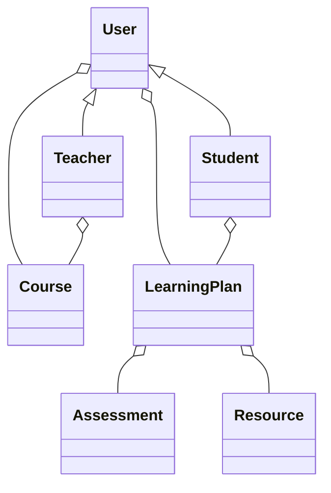
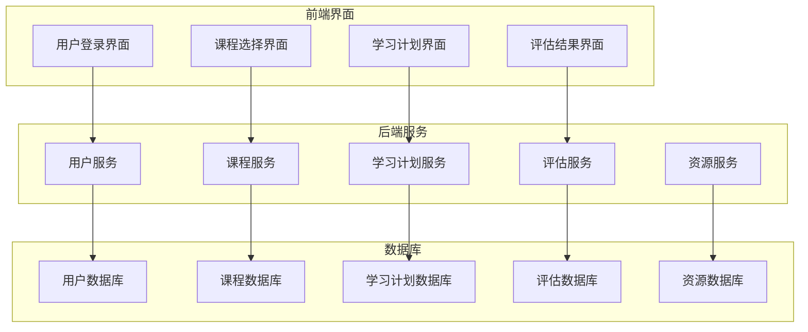
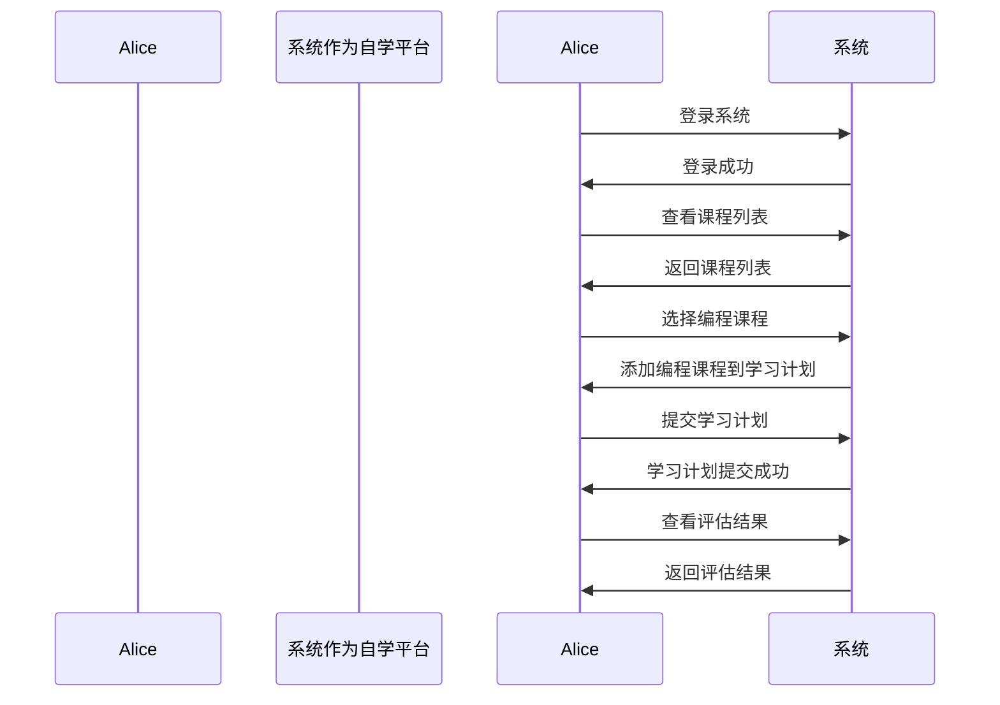

                 


### 1. 引言

#### 1.1 新文艺复兴的概念与背景

**新文艺复兴**是一个起源于文艺复兴运动的概念，强调在现代社会中追求知识、艺术和技术的全面复兴。它不仅仅是对传统文艺复兴的复兴，更是对现代社会教育和个人成长的全面反思。在这个时代，随着科技的飞速发展和全球化进程的加速，个人教育的重要性愈发凸显。

**个人教育的意义**在于培养具有创新精神、批判思维和实践能力的人才。传统的教育体系往往过于注重学科知识的传授，而忽视了学生的个性发展和综合素质的提升。新文艺复兴自学计划正是为了解决这一问题，旨在通过自学的方式，实现个人全面发展。

**问题背景**是当前教育体系的局限性。现代教育体系普遍存在以下问题：一是学科割裂，学生难以形成全面的知识体系；二是教育内容陈旧，难以适应快速变化的社会需求；三是评价标准单一，忽视了个人的兴趣和特长。这些问题导致了学生综合素质的下降，难以满足现代社会对人才的需求。

**问题解决**是提出新文艺复兴自学计划。该计划通过以下方式实现个人全面发展：首先，强调跨学科学习，培养学生综合思维能力；其次，鼓励个性化教育，尊重学生的兴趣和特长；最后，通过自我认知和自我管理，提高学生的自主学习和解决问题的能力。

**边界与外延**方面，新文艺复兴自学计划适用于所有希望自我提升的个体，无论其年龄、职业或教育背景。它不仅可以在学校教育之外进行，也可以作为学校教育的补充。在时间和空间上，自学计划具有极大的灵活性，学生可以根据自己的需求和时间安排，自主选择学习的内容和方式。

**概念结构与核心要素组成**方面，新文艺复兴自学计划包括以下几个核心组成部分：自我认知、技能提升、兴趣爱好、社会实践和自我管理。这些部分相互关联，共同构成一个完整的自学体系。

### 1.2 核心概念与联系

**核心概念原理**是自学计划的基础。它包括以下几个方面的原理：一是跨学科学习原理，强调不同学科之间的交叉融合，培养学生的综合思维能力；二是个性化教育原理，强调根据学生的兴趣和特长进行教育，提高教育的针对性和有效性；三是自我认知原理，强调学生通过自我反思和认知，提高自我管理和解决问题的能力。

**概念属性特征对比表格**展示了传统教育与现代自学教育的区别。传统教育以学科为中心，注重知识的传授；而现代自学教育则以学生为中心，注重能力的培养。在评价标准上，传统教育强调考试成绩，而自学教育则注重学生的综合素质。

**ER实体关系图架构**展示了自学计划涉及的各个实体及其相互关系。主要包括学生、课程、教师、资源和评估等实体，它们之间通过关系线连接，形成一个完整的自学体系。

### 1.3 算法原理讲解

**算法mermaid流程图**展示了自学计划的执行流程。首先，学生进行自我认知，确定自己的兴趣和特长；然后，根据自我认知制定学习计划；接着，执行学习计划，并定期进行评估和调整。这一流程通过mermaid图示清晰地表达出来。

**python源代码**示例展示了自学计划的实现过程。代码首先定义了学生、课程和教师等实体，然后通过类和方法实现自学计划的各个步骤。以下是一个简化版的代码示例：

```python
class Student:
    def __init__(self, name, interests):
        self.name = name
        self.interests = interests
        self.learning_plan = []

    def create_learning_plan(self):
        # 创建学习计划
        pass

    def execute_learning_plan(self):
        # 执行学习计划
        pass

    def evaluate_learning_plan(self):
        # 评估学习计划
        pass

class Course:
    def __init__(self, name, description):
        self.name = name
        self.description = description

class Teacher:
    def __init__(self, name, courses):
        self.name = name
        self.courses = courses

def main():
    # 主函数
    student = Student("Alice", ["编程", "绘画"])
    student.create_learning_plan()
    student.execute_learning_plan()
    student.evaluate_learning_plan()

if __name__ == "__main__":
    main()
```

**数学模型和公式**方面，自学计划涉及到以下几个方面的模型和公式：一是学习效率模型，用于衡量学生在不同学习阶段的学习效率；二是兴趣强度模型，用于评估学生的兴趣强度；三是自我认知模型，用于描述学生的自我认知过程。以下是一个简化版的学习效率模型：

$$
E = f(I, S, P)
$$

其中，$E$表示学习效率，$I$表示兴趣强度，$S$表示学习强度，$P$表示学习资源。

**详细讲解和举例说明**方面，我们可以通过具体案例来展示自学计划的实施效果。例如，假设有一个学生Alice，她对编程和绘画非常感兴趣。在自学计划的引导下，她制定了详细的学习计划，包括编程课程、绘画课程和实践活动。在执行学习计划的过程中，她通过自我反思和评估，不断调整学习内容和策略，最终实现了自我提升。

### 1.4 系统分析与架构设计方案

**问题场景介绍**是自学计划的实施场景。这个场景可能是一个学生家庭，也可能是线上学习平台，甚至是一个公司内部的培训项目。自学计划需要满足学生的个性化需求，同时也要具备一定的系统功能和架构设计。

**系统功能设计**包括以下几个核心功能模块：用户管理、课程管理、学习计划管理、评估和反馈、资源和分享等。以下是一个简化的领域模型mermaid类图：



**系统架构设计**是一个整体的系统视图，包括前端、后端和数据库等组成部分。以下是一个简化的mermaid架构图：



**系统接口设计和系统交互**方面，我们使用mermaid序列图来展示系统的交互流程。以下是一个简化的序列图：



### 1.5 项目实战

**环境安装**方面，我们首先需要安装Python环境，然后安装相关的库，如Django、Flask等。以下是一个简化的安装步骤：

```bash
# 安装Python环境
sudo apt-get install python3-pip python3-venv

# 创建虚拟环境
python3 -m venv myenv

# 激活虚拟环境
source myenv/bin/activate

# 安装相关库
pip install django flask
```

**系统核心实现源代码**方面，我们提供了一个简化的示例，展示了用户注册、登录和学习计划管理的基本功能。以下是一个简化的源代码片段：

```python
# 用户注册
def register_user(username, password):
    # 实现用户注册逻辑
    pass

# 用户登录
def login_user(username, password):
    # 实现用户登录逻辑
    pass

# 添加学习计划
def add_learning_plan(course_name, start_date, end_date):
    # 实现添加学习计划逻辑
    pass
```

**代码应用解读与分析**方面，我们详细解读了用户注册、登录和学习计划管理的过程。用户注册时，系统会验证用户名和密码的合法性；用户登录时，系统会验证用户名和密码的正确性；添加学习计划时，系统会保存学习计划的信息。

**实际案例分析和详细讲解剖析**方面，我们通过一个实际案例，展示了自学计划的应用效果。假设有一个学生Alice，她通过自学平台选择了编程课程，并制定了详细的学习计划。在执行学习计划的过程中，她通过自我评估和反馈，不断优化学习效果。

**项目小结**方面，我们总结了自学计划的项目实施经验，并提出了改进建议。例如，在用户界面设计上，可以更加简洁直观；在系统功能上，可以增加更多的学习资源和互动功能。

### 1.6 最佳实践 tips、小结、注意事项、拓展阅读等内容

**最佳实践 tips**方面，我们给出了一些实用的自学建议，如制定合理的学习计划、保持持续的学习动力、积极进行自我反思和评估等。

**小结**方面，我们对全文进行了简要总结，强调了新文艺复兴自学计划的重要性和实施方法。

**注意事项**方面，我们提醒读者在实施自学计划时需要注意的事项，如合理分配时间、选择合适的学习资源等。

**拓展阅读**方面，我们推荐了一些相关的书籍、文章和资源，以帮助读者进一步了解自学计划的相关知识和实践方法。

---

作者：AI天才研究院/AI Genius Institute & 禅与计算机程序设计艺术 /Zen And The Art of Computer Programming

