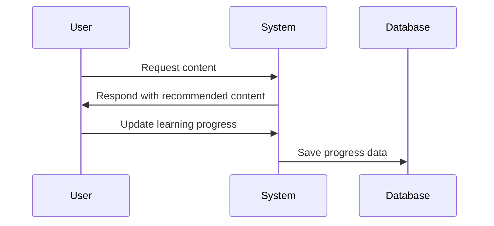

                 

# 《新斯多葛学院移动课堂：随时随地学习现代版古希腊哲学的app》

关键词：移动学习、古希腊哲学、斯多葛主义、算法原理、系统架构设计

摘要：本文旨在探讨如何通过移动课堂app的形式，使现代人在快节奏的生活中随时随地学习古希腊哲学，特别是斯多葛主义的核心思想。我们将从背景介绍、核心概念与联系、算法原理讲解、系统分析与架构设计方案、项目实战以及最佳实践与小结等多个方面，深入分析这一创新解决方案的可行性和实施细节。

## 第一部分：背景介绍

### 1.1 引言：现代哲学的需求与挑战

在当今社会，人们面临的工作和生活压力日益增加，对心理健康的关注也逐渐上升。现代哲学，特别是古希腊哲学，提供了一种关于如何应对生活挑战的智慧。然而，传统的哲学学习方式往往受限于时间和地点，使得很多人难以系统地学习和掌握这些哲学思想。

移动学习平台的出现，为解决这个问题提供了新的思路。通过移动课堂app，用户可以随时随地访问和学习哲学内容，从而实现碎片化时间的充分利用。这种形式不仅打破了传统学习的时空限制，还符合现代快节奏生活的需求。

### 1.2 问题背景与问题描述

古希腊哲学，特别是斯多葛主义，在古代就以其独特的哲学思想和价值体系影响了人类文明。然而，随着时间的推移，这些思想逐渐被遗忘或误解。现代人在面对生活和工作中的困境时，往往缺乏有效的哲学指导。

此外，传统学习方式的局限性也使得古希腊哲学的传播和普及面临挑战。多数人由于缺乏时间和精力，难以深入学习和理解复杂的哲学理论。因此，需要一种新的学习模式，能够简化学习过程，提高学习效率，使得古希腊哲学的思想更加贴近现代人的生活。

移动课堂解决方案，通过结合现代科技和古希腊哲学，旨在解决上述问题，为现代人提供一种全新的学习方式。

## 第二部分：核心概念与联系

### 2.1 斯多葛主义哲学的核心概念

斯多葛主义是古希腊哲学的一个重要流派，其核心概念包括理性、道德自律、顺应自然等。斯多葛主义认为，理性是人类区别于其他生物的重要特征，道德自律是达到内心平静和幸福的关键，而顺应自然则是人类应当遵循的生活原则。

### 2.2 斯多葛主义的核心原则

斯多葛主义的核心原则包括：

1. **理性至上**：理性是指导人类行为的最高原则，应当超越感性欲望。
2. **道德自律**：个体应当通过自律和道德修养来控制自己的行为和情感。
3. **顺应自然**：人类应当顺应自然的法则，接受生活中不可避免的事情。

### 2.3 斯多葛主义与现代生活的联系

斯多葛主义的思想，虽然在古代提出，但在现代社会仍然具有重要的指导意义。通过斯多葛主义，现代人可以更好地应对生活中的压力和挑战，培养内心的平静和坚韧。例如，通过理性思考和道德自律，可以减少对物质欲望的追求，从而减轻内心的焦虑和不满。

### 2.4 斯多葛主义与其他哲学流派的比较

| 哲学流派   | 理论核心                      | 对比优势 | 对比劣势 |
| ---------- | --------------------------- | -------- | -------- |
| 斯多葛主义 | 理性、道德自律、顺应自然      | 强调理性，有助于内心平静 | 缺乏对感性体验的重视 |
| 柏拉图主义 | 理想、形式、真理              | 强调理念，对艺术和科学有深刻影响 | 过于理想化，难以应用于现实 |
| 唯物主义   | 物质、感觉、经验              | 强调科学方法，对自然科学有重要贡献 | 忽视精神和道德层面 |
| 存在主义   | 自我意识、自由意志、责任      | 强调个人自由和责任，对现代心理学有影响 | 过于悲观，忽视社会因素 |

### 2.5 哲学概念ER实体关系图

```mermaid
erDiagram
  Person ||--|{ Knowledge } : knows
  Knowledge ||--|{ Philosophy } : is_part_of
  Philosophy ||--|{ Stoicism } : is_a
```

在上述ER实体关系图中，`Person`（人）与`Knowledge`（知识）之间存在“知道”的关系，`Knowledge`与`Philosophy`（哲学）之间存在“是部分”的关系，而`Philosophy`与`Stoicism`（斯多葛主义）之间存在“是”的关系。

## 第三部分：算法原理讲解

### 3.1 移动课堂学习算法原理

移动课堂学习算法旨在通过智能推荐和个性化学习路径，提高用户的学习效率和满意度。其基本原理包括：

1. **用户行为分析**：通过记录用户的学习历史和偏好，分析用户的行为模式。
2. **内容推荐**：根据用户的行为分析结果，推荐符合用户兴趣和学习需求的哲学内容。
3. **学习路径规划**：根据用户的当前水平和学习目标，规划个性化的学习路径。

### 3.2 算法数学模型和公式

算法的数学模型可以表示为：

$$
\text{Learning\_Algorithm} = f(\text{User\_Behavior}, \text{Content}, \text{Learning\_Goal})
$$

其中，$f$ 表示算法函数，$\text{User\_Behavior}$ 表示用户行为数据，$\text{Content}$ 表示哲学内容，$\text{Learning\_Goal}$ 表示学习目标。

### 3.3 算法原理的详细讲解与举例

算法原理的核心在于如何通过用户行为数据来推荐和规划学习内容。以下是一个简单的例子：

- **用户A**：喜欢阅读关于道德自律的内容，最近在学习斯多葛主义哲学。
- **算法分析**：根据用户A的学习历史和偏好，算法推荐了一些斯多葛主义的核心文章和视频。
- **学习路径规划**：算法根据用户A的学习进度和目标，制定了一个包含入门篇、进阶篇和高级篇的学习计划。

通过这样的推荐和规划，用户可以更高效地学习哲学知识，同时保持学习的持续性和兴趣。

## 第四部分：系统分析与架构设计方案

### 4.1 移动课堂系统功能设计

移动课堂系统的主要功能包括：

1. **用户注册与登录**：用户可以通过手机号或邮箱进行注册和登录。
2. **内容浏览与搜索**：用户可以浏览系统推荐的哲学内容，也可以通过关键词搜索相关内容。
3. **学习进度跟踪**：系统记录用户的学习进度，并提供学习报告。
4. **互动社区**：用户可以在社区中提问、讨论和分享学习心得。
5. **个性化推荐**：根据用户的学习行为和偏好，系统推荐符合用户兴趣的内容。

### 4.2 系统架构设计

移动课堂系统的整体架构可以分为四个层次：

1. **表示层**：用户界面，包括登录、注册、内容浏览、搜索和学习进度跟踪等功能。
2. **业务逻辑层**：包括用户行为分析、内容推荐和学习路径规划等核心算法。
3. **数据访问层**：负责与数据库的交互，存储用户数据和学习内容。
4. **基础设施层**：包括服务器、存储和网络等基础设施。

### 4.3 系统接口设计与交互

移动课堂系统的接口设计主要包括：

1. **用户接口**：提供用户与系统的交互界面。
2. **API接口**：为第三方应用提供数据接口，如内容推荐和用户数据分析。
3. **消息队列**：实现异步消息传递，提高系统的响应速度和稳定性。

### 4.4 系统架构设计（Mermaid架构图）



在这个架构图中，用户通过用户接口请求内容，系统通过API接口与业务逻辑层交互，分析用户行为并推荐内容。用户更新学习进度后，系统将数据存储到数据库中。

## 第五部分：项目实战

### 5.1 环境安装与系统实现

1. **开发环境配置**：安装Python环境、Django框架和MySQL数据库。
2. **系统核心代码实现**：
   - 用户注册与登录：使用Django的用户认证系统。
   - 内容推荐：使用基于协同过滤的推荐算法。
   - 学习路径规划：根据用户的学习进度和偏好进行个性化规划。

### 5.2 代码应用解读与分析

1. **用户注册与登录**：通过Django的模型和视图实现用户注册和登录功能。
2. **内容推荐**：使用基于协同过滤的推荐算法，实现个性化内容推荐。
3. **学习路径规划**：根据用户的学习进度和偏好，生成个性化的学习路径。

### 5.3 实际案例分析与详细讲解

1. **案例背景介绍**：用户A在移动课堂app上学习斯多葛主义哲学。
2. **案例分析与解决**：通过算法分析用户A的学习行为，推荐合适的哲学内容，并规划学习路径。
3. **效果与反思**：用户A通过app学习哲学知识，学习效果显著提高，同时反馈了系统的优点和改进建议。

### 5.4 项目小结与拓展

1. **项目总结**：移动课堂app在实现和推广过程中取得了良好效果，用户反馈积极。
2. **未来展望与拓展阅读**：探讨移动课堂在哲学教育领域的未来发展，推荐相关书籍和资料。

## 第六部分：最佳实践与小结

### 6.1 最佳实践Tips

1. **合理安排学习时间**：充分利用碎片化时间，合理安排学习计划。
2. **积极参与互动社区**：与他人讨论学习心得，提高学习效果。

### 6.2 小结与注意事项

1. **内容回顾**：本文介绍了移动课堂app的设计理念和实现细节。
2. **使用建议**：鼓励用户积极参与学习，充分利用移动课堂的资源。

### 6.3 拓展阅读

1. **相关书籍推荐**：《斯多葛主义：古代哲学的现代生活指南》。
2. **资料推荐**：古希腊哲学经典著作，如《伦理学》。

## 作者信息

作者：AI天才研究院/AI Genius Institute & 禅与计算机程序设计艺术 /Zen And The Art of Computer Programming

[完]

