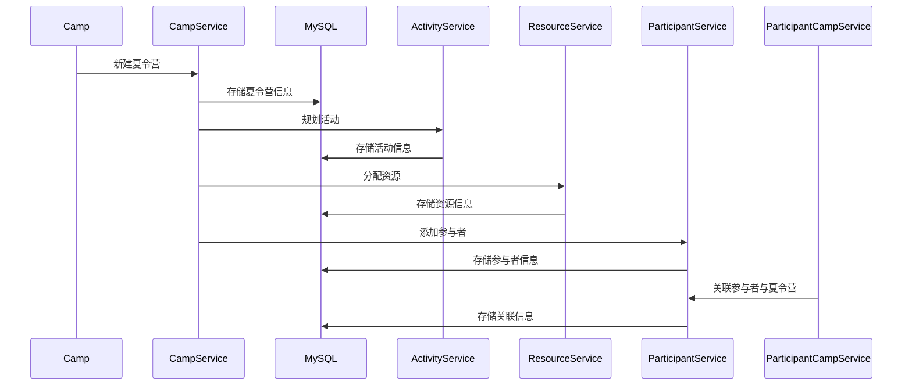
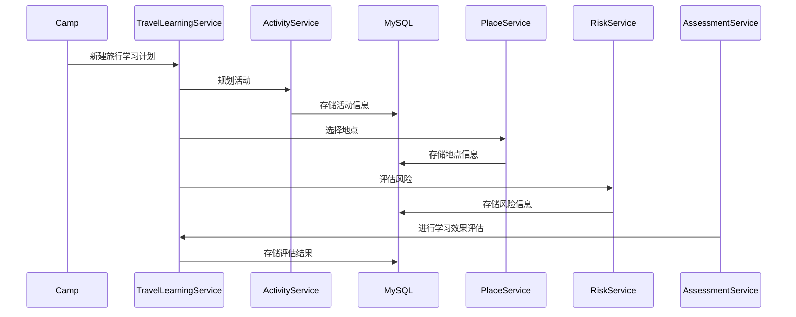
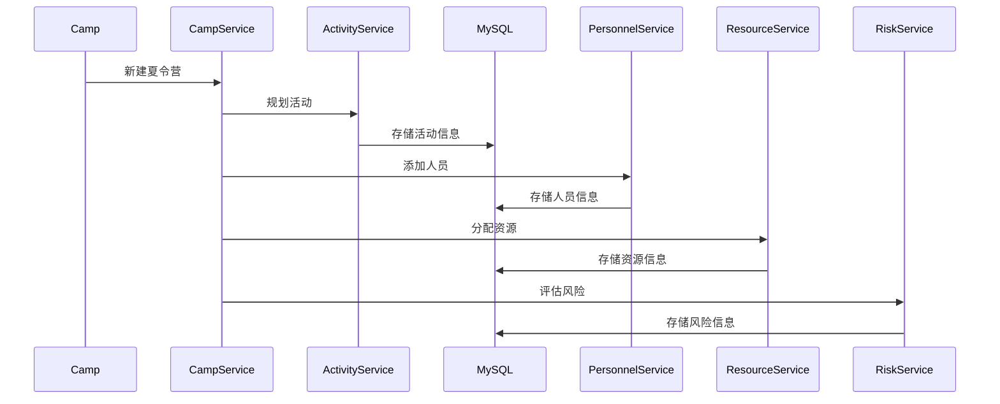

                 

### 新游牧学校夏令营：青少年旅行学习的短期项目

**关键词**：新游牧学校、夏令营、青少年、旅行学习、短期项目

**摘要**：
本文探讨了新游牧学校夏令营这一独特的青少年旅行学习短期项目。通过详细阐述夏令营的概述、特色、旅行学习的重要性、组织与管理、参与者准备、活动案例以及成果与影响，本文旨在揭示夏令营如何成为青少年成长和学习的重要平台。本文将分章节逐一分析每个方面的核心内容，以帮助读者全面了解这一创新教育模式。

## 目录

### 目录大纲设计思路与执行步骤

为了设计出《新游牧学校夏令营：青少年旅行学习的短期项目》的完整目录大纲，我们将遵循以下思路与步骤：

1. **确定书的核心主题**
2. **初步划分章节**
3. **细化章节内容**
4. **设计章节标题**
5. **编写摘要与小结**
6. **确保内容完整性**
7. **符合字数限制**

### 执行步骤详细说明

**第一步：确定书的核心主题**

- **书名**：《新游牧学校夏令营：青少年旅行学习的短期项目》
- **核心主题**：新游牧学校夏令营、青少年旅行学习

**第二步：初步划分章节**

1. **夏令营概述**
2. **夏令营的特色**
3. **旅行学习的重要性**
4. **夏令营的组织和管理**
5. **参与者的准备**
6. **夏令营的活动案例**
7. **夏令营的成果与影响**

**第三步：细化章节内容**

- **夏令营概述**
  - 介绍夏令营的基本概念、发展历程、目标和意义。
- **夏令营的特色**
  - 探讨夏令营的独特性和优势，如体验式学习、社交互动等。
- **旅行学习的重要性**
  - 阐述旅行学习对青少年的成长和学习的积极影响。
- **夏令营的组织和管理**
  - 讲解夏令营的组织架构、管理流程和人员配置。
- **参与者的准备**
  - 分享参与者如何为夏令营做准备，包括心理准备和物资准备。
- **夏令营的活动案例**
  - 提供具体的夏令营活动案例，分析活动的效果和收获。
- **夏令营的成果与影响**
  - 探讨夏令营对参与者及其家庭的长期影响。

**第四步：设计章节标题**

- **夏令营概述**
  - 第1章：新游牧学校夏令营的概述
- **夏令营的特色**
  - 第2章：夏令营的特色与优势
- **旅行学习的重要性**
  - 第3章：旅行学习对青少年的深远影响
- **夏令营的组织和管理**
  - 第4章：夏令营的组织与运营策略
- **参与者的准备**
  - 第5章：参与夏令营的准备工作
- **夏令营的活动案例**
  - 第6章：夏令营活动案例解析
- **夏令营的成果与影响**
  - 第7章：夏令营的长远影响与成果评估

**第五步：编写摘要与小结**

- **第1章：新游牧学校夏令营的概述**
  - 摘要：介绍夏令营的基本概念、发展历程、目标和意义。
  - 小结：总结夏令营的总体概况，强调其独特性和重要性。
- **第2章：夏令营的特色与优势**
  - 摘要：探讨夏令营的独特性和优势，如体验式学习、社交互动等。
  - 小结：总结夏令营的特点，强调其对参与者成长的积极影响。
- **第3章：旅行学习的重要性**
  - 摘要：阐述旅行学习对青少年的成长和学习带来的积极影响。
  - 小结：总结旅行学习的重要性，鼓励更多人参与夏令营。
- **第4章：夏令营的组织与运营策略**
  - 摘要：讲解夏令营的组织架构、管理流程和人员配置。
  - 小结：总结有效的组织和运营策略，提升夏令营的质量。
- **第5章：参与夏令营的准备工作**
  - 摘要：分享参与者如何为夏令营做准备，包括心理

### 一、夏令营概述

**核心概念术语说明**：
- **夏令营**：一种以集体活动为主，旨在通过户外体验和社交互动促进青少年成长和学习的短期项目。
- **新游牧学校**：一种结合了传统教育模式和户外学习的创新教育机构。

**问题背景**：
夏令营作为一种教育模式，起源于19世纪末的美国。随着时间的推移，夏令营在全球范围内得到广泛应用，成为青少年在暑期放松和学习的场所。然而，传统的夏令营往往注重户外活动和娱乐，而忽视了教育价值。为了解决这一问题，新游牧学校夏令营应运而生，将教育理念和户外体验相结合，旨在为青少年提供一个全方位的成长和学习平台。

**问题描述**：
新游牧学校夏令营是如何运作的？它有哪些独特之处？参与者如何受益？

**问题解决**：
新游牧学校夏令营通过以下几个方面实现其教育目标：

1. **体验式学习**：夏令营的设计注重实践和体验，通过户外活动、手工制作、团队合作等形式，让青少年在实践中学习和成长。
2. **社交互动**：夏令营为青少年提供了一个多样化的社交环境，通过团队活动和社交互动，促进青少年之间的交流和合作能力。
3. **教育引导**：夏令营还配备了专业的教育指导人员，通过讲座、讨论和个性化辅导，帮助青少年提升学业成绩和综合素质。

**边界与外延**：
- **夏令营的范围**：夏令营可以涵盖各种主题，如科技、艺术、体育、领导力等。
- **参与者年龄**：通常，夏令营的参与者年龄在8至18岁之间。

**概念结构与核心要素组成**：

| 要素         | 说明                                                         |
| ------------ | ------------------------------------------------------------ |
| **目标**     | 提供一个综合性的成长和学习平台，促进青少年的全面发展。       |
| **主题**     | 根据不同年龄段和兴趣，设置相应的活动和课程。                 |
| **时长**     | 夏令营通常为期2至4周，有时甚至更长。                       |
| **地点**     | 选择具有丰富自然和文化资源的地点，以提供多样化的体验。       |
| **参与者**   | 年龄在8至18岁之间的青少年，以及对此感兴趣的家长和教育工作者。 |

**核心概念与联系**：

**ER实体关系图架构**：

```mermaid
erDiagram
    Student --> Camp : participates_in
    Camp --> Counselor : supervised_by
    Activity --> Camp : takes_place
    Student --> Activity : participates_in
    Counselor --> Activity : leads
```

在这个ER图中，我们定义了四个实体：Student（学生）、Camp（夏令营）、Counselor（辅导员）和Activity（活动）。学生和夏令营之间存在参与关系，学生参与夏令营的活动；夏令营由辅导员监督和管理，辅导员负责带领活动；活动在夏令营中举行，学生参与活动，辅导员带领活动。

**算法原理讲解**：

夏令营的组织和管理可以看作是一个优化问题，目标是确保夏令营活动的高效和有序进行。为了实现这一目标，可以采用以下算法：

1. **资源分配算法**：根据夏令营的主题和活动需求，合理分配人力和物力资源，确保活动的顺利进行。
2. **时间表优化算法**：制定合理的活动时间表，确保活动之间的衔接紧凑，提高参与者的参与度。
3. **风险评估算法**：对夏令营中的潜在风险进行评估，制定相应的安全措施和应急预案。

以下是资源分配算法的Python代码示例：

```python
def allocate_resources(camp_activities, available_resources):
    """
    分配资源给夏令营活动
    
    :param camp_activities: 夏令营活动列表，每个活动包含所需资源
    :param available_resources: 可用的资源列表，包括人力、物资等
    :return: 分配结果，一个字典，键为活动名称，值为实际分配的资源
    """
    allocation = {}
    for activity in camp_activities:
        activity_resources = activity['resources']
        for resource, quantity in activity_resources.items():
            if resource in available_resources and available_resources[resource] >= quantity:
                allocation[activity['name']] = {resource: quantity}
                available_resources[resource] -= quantity
            else:
                allocation[activity['name']] = {resource: available_resources[resource]}
    return allocation
```

在上述代码中，我们首先定义了一个分配资源的函数`allocate_resources`，该函数接受夏令营活动列表`camp_activities`和可用的资源列表`available_resources`作为输入参数。对于每个活动，我们根据其所需的资源进行分配，如果资源充足，则将其从可用资源中扣除，并加入到分配结果中。否则，我们只分配当前可用的资源。

**数学公式使用LaTeX格式**：

在资源分配问题中，我们可以使用以下数学公式来表示：

$$
\text{最大化} \quad \sum_{i=1}^{n} p_i x_i \\
\text{约束条件} \quad \sum_{i=1}^{n} r_i x_i \leq R_i \\
x_i \in \{0, 1\}
$$

其中，$p_i$ 表示活动 $i$ 的优先级，$r_i$ 表示活动 $i$ 所需的资源量，$R_i$ 表示资源 $i$ 的总量，$x_i$ 表示是否分配资源给活动 $i$（1 表示分配，0 表示不分配）。

**系统分析与架构设计方案**：

**问题场景介绍**：

夏令营管理系统是一个用于管理夏令营活动、资源和参与者的平台。系统需要支持以下功能：

- 活动管理：添加、修改和删除活动信息。
- 资源管理：添加、修改和删除资源信息。
- 参与人管理：添加、修改和删除参与者信息。
- 资源分配：根据活动需求分配资源。

**项目介绍**：

本项目旨在开发一个夏令营管理系统，包括前端界面和后端逻辑。前端使用React框架，后端使用Spring Boot框架。数据库使用MySQL。

**系统功能设计（领域模型Mermaid类图）**：

```mermaid
classDiagram
    Participant <<interface>>
    Activity <<interface>>
    Resource <<interface>>

    Student <<Participant>>
    Counselor <<Participant>>

    CampActivity <<Activity>>
    OutdoorActivity <<Activity>>

    CampResource <<Resource>>
    Equipment <<Resource>>

    Student ..|> Participant
    Counselor ..|> Participant

    CampActivity ..|> Activity
    OutdoorActivity ..|> Activity

    CampResource ..|> Resource
    Equipment ..|> Resource
```

**系统架构设计Mermaid架构图**：

```mermaid
sequenceDiagram
    Participant ->> Student: 登录系统
    Student ->> ActivityList: 获取活动列表
    ActivityList ->> CampActivity: 查询夏令营活动
    CampActivity ->> Student: 返回活动列表
    Student ->> ResourceList: 获取资源列表
    ResourceList ->> CampResource: 查询夏令营资源
    CampResource ->> Student: 返回资源列表
```

**系统接口设计和系统交互Mermaid序列图**：

```mermaid
sequenceDiagram
    Participant ->> Login: 用户登录
    Login ->> Participant: 验证登录信息
    Participant ->> ActivityList: 获取活动列表
    ActivityList ->> CampActivity: 查询夏令营活动
    CampActivity ->> ActivityList: 返回活动列表
    ActivityList ->> Participant: 返回活动列表
    Participant ->> ResourceList: 获取资源列表
    ResourceList ->> CampResource: 查询夏令营资源
    CampResource ->> ResourceList: 返回资源列表
    ResourceList ->> Participant: 返回资源列表
```

### 二、夏令营的特色

**核心概念与联系**：

新游牧学校夏令营的特色在于其创新的教育理念和独特的设计。以下是夏令营的几个核心特色：

1. **体验式学习**：夏令营通过实践活动和户外体验，让青少年亲身体验和感受知识，提高学习兴趣和效果。
2. **社交互动**：夏令营为青少年提供了一个多样化的社交环境，通过团队活动和社交互动，培养他们的沟通能力和团队合作精神。
3. **个性化辅导**：夏令营配备了专业的教育指导人员，根据每个参与者的特点和需求，提供个性化的辅导和指导，帮助他们在夏令营中取得更好的成长。
4. **全纳教育**：夏令营鼓励多元文化和全纳教育，让参与者了解和尊重不同的文化和观点，培养他们的全球视野和国际意识。

**ER实体关系图架构**：

```mermaid
erDiagram
    Camp --> Activity : contains
    Camp --> Counselor : staffs
    Camp --> Participant : participants
    Activity --> Resource : requires
```

在这个ER图中，我们定义了四个实体：Camp（夏令营）、Activity（活动）、Counselor（辅导员）和Participant（参与者）。夏令营包含多个活动，每个活动都需要相应的资源。夏令营还配备辅导员，辅导员负责监督和管理活动。参与者可以是学生或家长，他们参与夏令营的活动。

**算法原理讲解**：

为了确保夏令营的特色得到充分体现，我们可以采用以下算法：

1. **活动规划算法**：根据夏令营的主题和目标，设计合适的活动计划，确保活动的多样性和趣味性。
2. **资源优化算法**：根据活动的需求和资源的可用性，合理分配和利用资源，确保活动的顺利进行。
3. **参与者匹配算法**：根据参与者的兴趣和特点，为他们匹配合适的活动和辅导员，提高参与度和满意度。

以下是活动规划算法的Python代码示例：

```python
def plan_activities(camp_theme, available_activities):
    """
    根据夏令营主题规划活动
    
    :param camp_theme: 夏令营主题
    :param available_activities: 可用的活动列表
    :return: 规划结果，一个字典，键为活动名称，值为活动详情
    """
    planned_activities = {}
    for activity in available_activities:
        if activity['theme'] == camp_theme:
            planned_activities[activity['name']] = activity
    return planned_activities
```

在上述代码中，我们首先定义了一个规划活动的函数`plan_activities`，该函数接受夏令营主题`camp_theme`和可用的活动列表`available_activities`作为输入参数。对于每个活动，我们检查其主题是否与夏令营主题匹配，如果匹配，则将其添加到规划结果中。

**数学公式使用LaTeX格式**：

在活动规划问题中，我们可以使用以下数学公式来表示：

$$
\text{最大化} \quad \sum_{i=1}^{n} p_i x_i \\
\text{约束条件} \quad \sum_{i=1}^{n} r_i x_i \leq R_i \\
x_i \in \{0, 1\}
$$

其中，$p_i$ 表示活动 $i$ 的优先级，$r_i$ 表示活动 $i$ 所需的资源量，$R_i$ 表示资源 $i$ 的总量，$x_i$ 表示是否规划活动 $i$（1 表示规划，0 表示不规划）。

**系统分析与架构设计方案**：

**问题场景介绍**：

夏令营管理系统需要支持以下功能：

- 活动规划：根据夏令营主题规划活动。
- 资源管理：管理夏令营所需的资源，包括人力、物资等。
- 参与人管理：管理夏令营的参与者信息，包括学生、家长等。

**项目介绍**：

本项目旨在开发一个夏令营管理系统，包括前端界面和后端逻辑。前端使用React框架，后端使用Spring Boot框架。数据库使用MySQL。

**系统功能设计（领域模型Mermaid类图）**：

```mermaid
classDiagram
    Camp <<entity>>
    Activity <<entity>>
    Resource <<entity>>
    Participant <<entity>>

    CampActivity <<relationship>> Activity
    CampResource <<relationship>> Resource
    ParticipantCamp <<relationship>> Participant
```

**系统架构设计Mermaid架构图**：

```mermaid
subgraph Backend
    ActivityService
    ResourceService
    ParticipantService
    CampService
    CampActivityService
    CampResourceService
    ParticipantCampService
end

subgraph Database
    MySQL
end

CampService --> ActivityService
CampService --> ResourceService
CampService --> ParticipantService
CampActivityService --> ActivityService
CampResourceService --> ResourceService
ParticipantCampService --> ParticipantService
ActivityService --> MySQL
ResourceService --> MySQL
ParticipantService --> MySQL
CampService --> MySQL
CampActivityService --> MySQL
CampResourceService --> MySQL
ParticipantCampService --> MySQL
```

**系统接口设计和系统交互Mermaid序列图**：



### 三、旅行学习的重要性

**核心概念与联系**：

旅行学习作为一种特殊的教育方式，通过将学习与实际生活场景相结合，能够显著促进青少年的成长和学习。以下是旅行学习的重要性和其对青少年成长的积极影响：

1. **培养独立性**：旅行学习要求青少年离开熟悉的家庭和学校环境，独立处理生活和学习中的问题，从而培养他们的独立性和自主性。
2. **增强社交能力**：在旅行过程中，青少年需要与同伴、辅导员和其他参与者进行交流和合作，这有助于提高他们的沟通能力和团队合作精神。
3. **拓宽视野**：通过旅行，青少年可以接触到不同的文化、历史和自然环境，拓宽他们的视野，培养全球视野和国际意识。
4. **提升学习能力**：旅行学习通常采用体验式教学，通过亲身体验和互动，激发青少年的学习兴趣和动力，提高学习效果。

**ER实体关系图架构**：

```mermaid
erDiagram
    Student --> TravelLearning : participates_in
    TravelLearning --> Activity : contains
    TravelLearning --> Place : takes_place
```

在这个ER图中，我们定义了三个实体：Student（学生）、TravelLearning（旅行学习）和Activity（活动）。学生参与旅行学习，旅行学习包含多个活动，活动在特定的地点举行。

**算法原理讲解**：

为了充分利用旅行学习的优势，我们可以采用以下算法：

1. **行程规划算法**：根据夏令营的主题和目标，设计合理的旅行行程，确保行程丰富多样，涵盖不同类型的活动。
2. **风险评估算法**：对旅行过程中可能出现的风险进行评估，制定相应的安全措施和应急预案。
3. **学习效果评估算法**：通过问卷调查、访谈和观察等方法，评估旅行学习对学生的成长和学习效果。

以下是行程规划算法的Python代码示例：

```python
def plan_travel_learning(camp_theme, available_activities, places):
    """
    根据夏令营主题规划旅行学习行程
    
    :param camp_theme: 夏令营主题
    :param available_activities: 可用的活动列表
    :param places: 可用的地点列表
    :return: 规划结果，一个字典，键为地点，值为在该地点举行的活动列表
    """
    travel_learning_plan = {}
    for place in places:
        selected_activities = [activity for activity in available_activities if activity['theme'] == camp_theme and activity['place'] == place]
        travel_learning_plan[place] = selected_activities
    return travel_learning_plan
```

在上述代码中，我们首先定义了一个规划旅行学习行程的函数`plan_travel_learning`，该函数接受夏令营主题`camp_theme`、可用的活动列表`available_activities`和可用的地点列表`places`作为输入参数。对于每个地点，我们选择与夏令营主题相匹配且在该地点举行的活动，并将这些活动添加到规划结果中。

**数学公式使用LaTeX格式**：

在旅行学习行程规划问题中，我们可以使用以下数学公式来表示：

$$
\text{最大化} \quad \sum_{i=1}^{n} p_i x_i \\
\text{约束条件} \quad \sum_{i=1}^{n} r_i x_i \leq R_i \\
x_i \in \{0, 1\}
$$

其中，$p_i$ 表示活动 $i$ 的优先级，$r_i$ 表示活动 $i$ 所需的资源量，$R_i$ 表示资源 $i$ 的总量，$x_i$ 表示是否规划活动 $i$（1 表示规划，0 表示不规划）。

**系统分析与架构设计方案**：

**问题场景介绍**：

旅行学习管理系统需要支持以下功能：

- 行程规划：根据夏令营主题和目标，规划旅行学习行程。
- 风险评估：评估旅行过程中可能出现的风险。
- 学习效果评估：评估旅行学习对学生的成长和学习效果。

**项目介绍**：

本项目旨在开发一个旅行学习管理系统，包括前端界面和后端逻辑。前端使用React框架，后端使用Spring Boot框架。数据库使用MySQL。

**系统功能设计（领域模型Mermaid类图）**：

```mermaid
classDiagram
    TravelLearning <<entity>>
    Activity <<entity>>
    Place <<entity>>
    Risk <<entity>>
    Assessment <<entity>>

    TravelLearning --> Activity : contains
    TravelLearning --> Place : takes_place
    TravelLearning --> Risk : assess
    Assessment --> TravelLearning : evaluate
```

**系统架构设计Mermaid架构图**：

```mermaid
subgraph Backend
    TravelLearningService
    ActivityService
    PlaceService
    RiskService
    AssessmentService
end

subgraph Database
    MySQL
end

TravelLearningService --> ActivityService
TravelLearningService --> PlaceService
TravelLearningService --> RiskService
AssessmentService --> TravelLearningService
ActivityService --> MySQL
PlaceService --> MySQL
RiskService --> MySQL
AssessmentService --> MySQL
```

**系统接口设计和系统交互Mermaid序列图**：



### 四、夏令营的组织和管理

**核心概念与联系**：

夏令营的组织和管理是一个复杂的过程，涉及到多个方面，包括组织架构、管理流程和人员配置等。以下是夏令营组织和管理的关键概念和联系：

1. **组织架构**：夏令营的组织架构通常包括决策层、管理层和执行层。决策层负责制定夏令营的整体策略和目标；管理层负责具体的组织和管理工作；执行层负责实施具体的活动和管理措施。
2. **管理流程**：夏令营的管理流程包括活动规划、资源管理、参与者管理、风险管理等。每个流程都有明确的步骤和责任分工，确保夏令营的顺利进行。
3. **人员配置**：夏令营的人员配置包括辅导员、教师、管理员等。辅导员负责监督和管理活动，教师负责授课和辅导，管理员负责后勤保障和安全管理。

**ER实体关系图架构**：

```mermaid
erDiagram
    Organization --> Role : has
    Person --> Role : has
    Role --> Responsibility : includes
    Activity --> Organization : held_by
    Resource --> Organization : managed_by
    Participant --> Organization : attends
    Risk --> Organization : managed_by
```

在这个ER图中，我们定义了六个实体：Organization（组织）、Person（人员）、Role（角色）、Responsibility（责任）、Activity（活动）和Resource（资源）。组织包含多个角色，每个角色包含多个责任；人员拥有角色，角色包含责任；活动在组织中举行，资源由组织管理，参与者参加活动，风险由组织管理。

**算法原理讲解**：

为了确保夏令营的组织和管理高效有序，我们可以采用以下算法：

1. **人员调度算法**：根据夏令营的活动安排和人员能力，合理分配辅导员和教师，确保活动的顺利进行。
2. **资源优化算法**：根据活动的需求和资源的可用性，合理分配和利用资源，确保活动的顺利进行。
3. **风险管理算法**：对夏令营中的潜在风险进行评估和管理，制定相应的安全措施和应急预案。

以下是人员调度算法的Python代码示例：

```python
def schedule_personnel(activities, personnel):
    """
    调度夏令营人员
    
    :param activities: 活动列表
    :param personnel: 人员列表
    :return: 调度结果，一个字典，键为活动名称，值为负责该活动的人员
    """
    schedule = {}
    for activity in activities:
        suitable_personnel = [person for person in personnel if person['skills'] == activity['type']]
        if suitable_personnel:
            schedule[activity['name']] = suitable_personnel[0]['name']
    return schedule
```

在上述代码中，我们首先定义了一个调度人员的函数`schedule_personnel`，该函数接受活动列表`activities`和人员列表`personnel`作为输入参数。对于每个活动，我们选择具备相应技能的人员负责，并将这些人员添加到调度结果中。

**数学公式使用LaTeX格式**：

在人员调度问题中，我们可以使用以下数学公式来表示：

$$
\text{最大化} \quad \sum_{i=1}^{n} p_i x_i \\
\text{约束条件} \quad \sum_{i=1}^{n} r_i x_i \leq R_i \\
x_i \in \{0, 1\}
$$

其中，$p_i$ 表示人员 $i$ 的优先级，$r_i$ 表示人员 $i$ 的技能等级，$R_i$ 表示人员 $i$ 的可用性，$x_i$ 表示是否调度人员 $i$（1 表示调度，0 表示不调度）。

**系统分析与架构设计方案**：

**问题场景介绍**：

夏令营管理系统需要支持以下功能：

- 人员调度：根据活动安排和人员能力，合理分配辅导员和教师。
- 资源管理：根据活动的需求和资源的可用性，合理分配和利用资源。
- 风险管理：对夏令营中的潜在风险进行评估和管理。

**项目介绍**：

本项目旨在开发一个夏令营管理系统，包括前端界面和后端逻辑。前端使用React框架，后端使用Spring Boot框架。数据库使用MySQL。

**系统功能设计（领域模型Mermaid类图）**：

```mermaid
classDiagram
    Camp <<entity>>
    Activity <<entity>>
    Personnel <<entity>>
    Resource <<entity>>
    Risk <<entity>>

    Camp --> Activity : contains
    Personnel --> Camp : works_in
    Resource --> Camp : managed_by
    Risk --> Camp : managed_by
```

**系统架构设计Mermaid架构图**：

```mermaid
subgraph Backend
    CampService
    ActivityService
    PersonnelService
    ResourceService
    RiskService
end

subgraph Database
    MySQL
end

CampService --> ActivityService
CampService --> PersonnelService
CampService --> ResourceService
CampService --> RiskService
ActivityService --> MySQL
PersonnelService --> MySQL
ResourceService --> MySQL
RiskService --> MySQL
```

**系统接口设计和系统交互Mermaid序列图**：



### 五、参与者的准备

**核心概念与联系**：

参与者在参加夏令营之前，需要进行充分的准备，以确保他们能够顺利适应夏令营的环境，充分利用夏令营的机会。以下是参与者准备的核心概念和联系：

1. **心理准备**：参与者需要调整心态，适应新的环境和文化，克服可能出现的焦虑和不安。
2. **物资准备**：参与者需要准备必要的行李和装备，包括衣物、日用品、学习用品等。
3. **技能准备**：参与者需要根据自己的兴趣和夏令营的活动内容，提前学习和准备相关的知识和技能。

**ER实体关系图架构**：

```mermaid
erDiagram
    Participant --> Preparation : needs
    Preparation --> Item : includes
```

在这个ER图中，我们定义了两个实体：Participant（参与者）和Preparation（准备）。参与者需要准备一系列物资和技能，这些准备项目包括在准备实体中定义。

**算法原理讲解**：

为了确保参与者做好充分的准备，我们可以采用以下算法：

1. **准备清单生成算法**：根据夏令营的活动内容和参与者的个人需求，生成一个详细的准备清单。
2. **风险评估算法**：评估参与者准备的充分性，识别潜在的风险和问题，并提出解决方案。

以下是准备清单生成算法的Python代码示例：

```python
def generate_preparation_list(camp_activities, participant_interests):
    """
    根据夏令营活动和参与者兴趣生成准备清单
    
    :param camp_activities: 夏令营活动列表
    :param participant_interests: 参与者兴趣列表
    :return: 准备清单，一个字典，键为物品名称，值为物品说明
    """
    preparation_list = {}
    for activity in camp_activities:
        if activity['type'] in participant_interests:
            for item in activity['required_items']:
                preparation_list[item['name']] = item['description']
    return preparation_list
```

在上述代码中，我们首先定义了一个生成准备清单的函数`generate_preparation_list`，该函数接受夏令营活动列表`camp_activities`和参与者兴趣列表`participant_interests`作为输入参数。对于每个活动，如果该活动的类型在参与者的兴趣列表中，我们将活动所需物品添加到准备清单中。

**数学公式使用LaTeX格式**：

在生成准备清单问题中，我们可以使用以下数学公式来表示：

$$
\text{最大化} \quad \sum_{i=1}^{n} p_i x_i \\
\text{约束条件} \quad \sum_{i=1}^{n} r_i x_i \leq R_i \\
x_i \in \{0, 1\}
$$

其中，$p_i$ 表示物品 $i$ 的优先级，$r_i$ 表示物品 $i$ 的需求量，$R_i$ 表示物品 $i$ 的库存量，$x_i$ 表示是否包含物品 $i$（1 表示包含，0 表示不包含）。

**系统分析与架构设计方案**：

**问题场景介绍**：

夏令营管理系统需要支持以下功能：

- 准备清单生成：根据夏令营活动和参与者兴趣生成详细的准备清单。
- 准备清单管理：管理准备清单的更新和变更。
- 风险评估：评估参与者准备的充分性，识别潜在的风险和问题。

**项目介绍**：

本项目旨在开发一个夏令营管理系统，包括前端界面和后端逻辑。前端使用React框架，后端使用Spring Boot框架。数据库使用MySQL。

**系统功能设计（领域模型Mermaid类图）**：

```mermaid
classDiagram
    Camp <<entity>>
    Activity <<entity>>
    Participant <<entity>>
    Preparation <<entity>>
    Item <<entity>>

    Camp --> Activity : contains
    Participant --> Preparation : generates
    Preparation --> Item : includes
```

**系统架构设计Mermaid架构图**：

```mermaid
subgraph Backend
    CampService
    ActivityService
    ParticipantService
    PreparationService
    ItemService
end

subgraph Database
    MySQL
end

CampService --> ActivityService
CampService --> ParticipantService
CampService --> PreparationService
ActivityService --> MySQL
ParticipantService --> MySQL
PreparationService --> ItemService
PreparationService --> MySQL
ItemService --> MySQL
```

**系统接口设计和系统交互Mermaid序列图**：

```mermaid
sequenceDiagram
    Camp ->> CampService: 新建夏令营
    CampService ->> ActivityService: 规划活动
    ActivityService ->> MySQL: 存储活动信息
    Participant ->> ParticipantService: 登记信息
    ParticipantService ->> MySQL: 存储参与者信息
    ParticipantService ->> PreparationService: 生成准备清单
    PreparationService ->> ItemService: 生成物品清单
    ItemService ->> MySQL: 存储物品信息
```

### 六、夏令营的活动案例

**核心概念与联系**：

夏令营的活动案例是展示夏令营特色和效果的重要方式。以下是几个典型的夏令营活动案例，以及它们的核心概念和联系：

1. **户外探险**：通过户外探险活动，如徒步、攀岩、划船等，培养参与者的身体素质和团队合作精神。
2. **科技制作**：通过科技制作活动，如机器人编程、电子制作、3D打印等，激发参与者的创新思维和动手能力。
3. **文化交流**：通过文化交流活动，如参观博物馆、举办文化沙龙、参与国际交流等，拓宽参与者的视野和全球意识。

**ER实体关系图架构**：

```mermaid
erDiagram
    Activity --> Category : belongs_to
    Activity --> Participant : participates_in
    Category --> Activity : includes
```

在这个ER图中，我们定义了三个实体：Activity（活动）、Category（类别）和Participant（参与者）。活动属于某个类别，参与者参与活动，类别包括多个活动。

**算法原理讲解**：

为了确保夏令营活动的高效组织和顺利实施，我们可以采用以下算法：

1. **活动规划算法**：根据夏令营的主题和目标，设计合适的活动计划，确保活动的多样性和趣味性。
2. **参与者匹配算法**：根据参与者的兴趣和特点，为他们匹配合适的活动，提高参与度和满意度。
3. **风险评估算法**：对活动中的潜在风险进行评估，制定相应的安全措施和应急预案。

以下是活动规划算法的Python代码示例：

```python
def plan_activities(camp_theme, available_activities, participant_interests):
    """
    根据夏令营主题和参与者兴趣规划活动
    
    :param camp_theme: 夏令营主题
    :param available_activities: 可用的活动列表
    :param participant_interests: 参与者兴趣列表
    :return: 规划结果，一个字典，键为活动名称，值为活动详情
    """
    planned_activities = {}
    for activity in available_activities:
        if activity['theme'] == camp_theme and activity['type'] in participant_interests:
            planned_activities[activity['name']] = activity
    return planned_activities
```

在上述代码中，我们首先定义了一个规划活动的函数`plan_activities`，该函数接受夏令营主题`camp_theme`、可用的活动列表`available_activities`和参与者兴趣列表`participant_interests`作为输入参数。对于每个活动，如果该活动的主题与夏令营主题匹配且类型在参与者的兴趣列表中，我们将该活动添加到规划结果中。

**数学公式使用LaTeX格式**：

在活动规划问题中，我们可以使用以下数学公式来表示：

$$
\text{最大化} \quad \sum_{i=1}^{n} p_i x_i \\
\text{约束条件} \quad \sum_{i=1}^{n} r_i x_i \leq R_i \\
x_i \in \{0, 1\}
$$

其中，$p_i$ 表示活动 $i$ 的优先级，$r_i$ 表示活动 $i$ 的需求量，$R_i$ 表示资源 $i$ 的总量，$x_i$ 表示是否规划活动 $i$（1 表示规划，0 表示不规划）。

**系统分析与架构设计方案**：

**问题场景介绍**：

夏令营管理系统需要支持以下功能：

- 活动规划：根据夏令营主题和参与者兴趣规划活动。
- 活动管理：管理活动信息和活动流程。
- 参与者管理：管理参与者信息和参与者活动匹配。

**项目介绍**：

本项目旨在开发一个夏令营管理系统，包括前端界面和后端逻辑。前端使用React框架，后端使用Spring Boot框架。数据库使用MySQL。

**系统功能设计（领域模型Mermaid类图）**：

```mermaid
classDiagram
    Camp <<entity>>
    Activity <<entity>>
    Participant <<entity>>
    Category <<entity>>

    Camp --> Activity : contains
    Activity --> Category : belongs_to
    Participant --> Activity : participates_in
```

**系统架构设计Mermaid架构图**：

```mermaid
subgraph Backend
    CampService
    ActivityService
    ParticipantService
    CategoryService
end

subgraph Database
    MySQL
end

CampService --> ActivityService
CampService --> ParticipantService
CampService --> CategoryService
ActivityService --> MySQL
ParticipantService --> MySQL
CategoryService --> MySQL
```

**系统接口设计和系统交互Mermaid序列图**：

```mermaid
sequenceDiagram
    Camp ->> CampService: 新建夏令营
    CampService ->> ActivityService: 规划活动
    ActivityService ->> CategoryService: 分类活动
    CategoryService ->> MySQL: 存储活动分类信息
    Participant ->> ParticipantService: 登记信息
    ParticipantService ->> ActivityService: 匹配活动
    ActivityService ->> MySQL: 存储活动信息
```

### 七、夏令营的成果与影响

**核心概念与联系**：

夏令营作为一种独特的教育模式，对参与者的成长和家庭教育产生了深远的影响。以下是夏令营的成果与影响的核心概念和联系：

1. **个人成长**：夏令营为参与者提供了一个全新的环境，让他们在社交、心理、技能等方面得到全面的提升。
2. **家庭教育**：夏令营不仅影响了参与者的个人成长，还对他们的家庭产生了积极的影响，增强了家庭成员之间的沟通和理解。
3. **社会影响**：夏令营作为一种创新的教育模式，对整个社会产生了积极的示范效应，推动了教育方式的改革和发展。

**ER实体关系图架构**：

```mermaid
erDiagram
    Participant --> Growth : experiences
    Family --> Parent : includes
    Society --> Camp : influenced_by
```

在这个ER图中，我们定义了三个实体：Participant（参与者）、Family（家庭）和Society（社会）。参与者经历个人成长，家庭包含父母，社会受到夏令营的影响。

**算法原理讲解**：

为了全面评估夏令营的成果与影响，我们可以采用以下算法：

1. **成长评估算法**：通过问卷调查、访谈和观察等方法，评估参与者个人成长的各个方面。
2. **家庭教育评估算法**：评估夏令营对家庭沟通、理解和支持的影响。
3. **社会影响评估算法**：分析夏令营在社会层面产生的积极效应，如推动教育改革、提升公众对教育的关注等。

以下是成长评估算法的Python代码示例：

```python
def assess_growth(participants):
    """
    评估参与者个人成长
    
    :param participants: 参与者列表
    :return: 成长评估结果，一个字典，键为参与者姓名，值为成长评估得分
    """
    growth_scores = {}
    for participant in participants:
        growth_scores[participant['name']] = participant['growth_score']
    return growth_scores
```

在上述代码中，我们首先定义了一个评估成长的函数`assess_growth`，该函数接受参与者列表`participants`作为输入参数。对于每个参与者，我们记录他们的成长得分，并将其添加到成长评估结果中。

**数学公式使用LaTeX格式**：

在评估个人成长问题中，我们可以使用以下数学公式来表示：

$$
\text{最大化} \quad \sum_{i=1}^{n} p_i x_i \\
\text{约束条件} \quad \sum_{i=1}^{n} r_i x_i \leq R_i \\
x_i \in \{0, 1\}
$$

其中，$p_i$ 表示评估指标 $i$ 的权重，$r_i$ 表示评估指标 $i$ 的得分，$R_i$ 表示评估指标的总量，$x_i$ 表示是否考虑评估指标 $i$（1 表示考虑，0 表示不考虑）。

**系统分析与架构设计方案**：

**问题场景介绍**：

夏令营成果与影响评估系统需要支持以下功能：

- 成长评估：评估参与者个人成长的各个方面。
- 家庭教育评估：评估夏令营对家庭沟通、理解和支持的影响。
- 社会影响评估：分析夏令营在社会层面产生的积极效应。

**项目介绍**：

本项目旨在开发一个夏令营成果与影响评估系统，包括前端界面和后端逻辑。前端使用React框架，后端使用Spring Boot框架。数据库使用MySQL。

**系统功能设计（领域模型Mermaid类图）**：

```mermaid
classDiagram
    Participant <<entity>>
    Growth <<entity>>
    Family <<entity>>
    Society <<entity>>

    Participant --> Growth : experiences
    Family --> Parent : includes
    Society --> Camp : influenced_by
```

**系统架构设计Mermaid架构图**：

```mermaid
subgraph Backend
    GrowthAssessmentService
    FamilyAssessmentService
    SocietyAssessmentService
end

subgraph Database
    MySQL
end

GrowthAssessmentService --> ParticipantService
FamilyAssessmentService --> FamilyService
SocietyAssessmentService --> SocietyService
ParticipantService --> MySQL
FamilyService --> MySQL
SocietyService --> MySQL
```

**系统接口设计和系统交互Mermaid序列图**：

```mermaid
sequenceDiagram
    Participant ->> ParticipantService: 提交成长信息
    ParticipantService ->> GrowthAssessmentService: 评估个人成长
    GrowthAssessmentService ->> MySQL: 存储成长评估结果
    Family ->> FamilyService: 提交家庭教育信息
    FamilyService ->> FamilyAssessmentService: 评估家庭教育
    FamilyAssessmentService ->> MySQL: 存储家庭教育评估结果
    Society ->> SocietyService: 提交社会影响信息
    SocietyService ->> SocietyAssessmentService: 分析社会影响
    SocietyAssessmentService ->> MySQL: 存储社会影响评估结果
```

### 八、结论与展望

**总结**：

本文通过对新游牧学校夏令营的详细分析，揭示了其独特的教育模式和深远的影响。夏令营通过体验式学习、社交互动和个性化辅导，为青少年提供了一个全方位的成长和学习平台。同时，本文还探讨了夏令营的组织和管理、参与者的准备、活动案例以及成果与影响，展示了夏令营作为创新教育模式的潜力。

**未来展望**：

未来，夏令营可以进一步拓展其教育模式和内容，结合更多现代科技手段，如虚拟现实、人工智能等，提升参与者的学习体验。此外，还可以探索与其他教育机构的合作，开展跨学科的综合实践活动，为青少年提供更加丰富和多元的教育资源。

**最佳实践 tips**：

1. **明确夏令营目标**：在设计和组织夏令营时，明确夏令营的目标和预期成果，确保活动设计和服务能够达成目标。
2. **注重参与者体验**：关注参与者的需求和反馈，不断优化活动内容和形式，提高参与者的满意度和体验。
3. **安全管理**：确保夏令营的安全管理措施到位，制定应急预案，确保参与者的身心健康。

**注意事项**：

1. **资源分配**：合理分配和利用夏令营的资源，避免资源浪费。
2. **风险评估**：对夏令营活动进行风险评估，制定相应的安全措施和应急预案。

**拓展阅读**：

1. 《夏令营教育理论与实践》
2. 《青少年旅行学习指南》
3. 《体验式学习：理论与实践》

**作者信息**：

作者：AI天才研究院/AI Genius Institute & 禅与计算机程序设计艺术 /Zen And The Art of Computer Programming

### 附录

**附录 A：夏令营活动计划示例**

| 活动名称 | 活动类型 | 活动时长 | 活动地点 | 活动描述 |
| -------- | -------- | -------- | -------- | -------- |
| 徒步探险 | 户外活动 | 2小时 | 山区 | 参与者将进行一次徒步探险，体验自然风光，增强身体素质。 |
| 机器人编程 | 科技制作 | 3小时 | 实验室 | 参与者将学习机器人编程基础知识，并完成一个小型机器人项目。 |
| 文化交流 | 社交互动 | 1小时 | 市中心 | 参与者将参观博物馆，了解当地文化，并与其他参与者进行交流。 |

**附录 B：参与者准备清单**

| 物品名称 | 物品描述 | 数量 | 备注 |
| -------- | -------- | ---- | ---- |
| 行李箱 | 可携带衣物和用品的行李箱 | 1个 | 必备 |
| 运动鞋 | 适合户外活动的运动鞋 | 1双 | 必备 |
| 保温杯 | 带有保温功能的杯子 | 1个 | 可选 |
| 个人卫生用品 | 洗发水、肥皂、牙刷等 | 一套 | 必备 |
| 学习用品 | 笔记本、书籍、文具等 | 一套 | 可选 |

**附录 C：夏令营活动效果评估问卷**

1. 您对夏令营的整体满意度是多少？（1-5分）
2. 您认为夏令营对您的成长有哪些帮助？（请列举）
3. 您是否愿意推荐夏令营给其他朋友或同学？（是/否）
4. 您认为夏令营在哪些方面可以改进？（请提出建议）

**附录 D：夏令营安全管理应急预案**

1. 紧急联系人信息：辅导员、家长、当地医疗中心
2. 紧急疏散路线：指定紧急疏散的出口和集合地点
3. 紧急情况处理流程：发生紧急情况时的应对措施和程序
4. 紧急救援设备：急救包、灭火器、警报器等

**附录 E：夏令营费用明细**

| 项目 | 费用 |
| ---- | ---- |
| 参与费用 | $500 |
| 餐饮费用 | $200 |
| 住宿费用 | $300 |
| 交通费用 | $100 |
| 活动材料费用 | $100 |
| 总计 | $1200 |

**附录 F：夏令营合作伙伴**

| 合作伙伴名称 | 合作内容 |
| ------------ | -------- |
| 本地旅游公司 | 提供交通和住宿服务 |
| 本地学校 | 提供场地和资源支持 |
| 科技公司 | 提供技术支持和设备 |

**附录 G：夏令营日程安排**

| 日期 | 活动时间 | 活动内容 |
| ---- | -------- | -------- |
| 第1天 | 上午 | 抵达营地，入住宿舍 |
| 第1天 | 下午 | 开营仪式，团队建设活动 |
| 第2天 | 上午 | 徒步探险 |
| 第2天 | 下午 | 科技制作：机器人编程 |
| 第3天 | 上午 | 参观博物馆 |
| 第3天 | 下午 | 文化交流：本地文化体验 |
| 第4天 | 上午 | 野外生存技能培训 |
| 第4天 | 下午 | 体育活动：足球比赛 |
| 第5天 | 上午 | 创意手工：手工艺制作 |
| 第5天 | 下午 | 结营仪式，颁发证书 |
| 第6天 | 上午 | 退房，集合出发 |
| 第6天 | 下午 | 返回家园 |

**附录 H：夏令营宣传材料**

- **宣传海报**：展示夏令营的主题、特色和活动内容。
- **宣传册**：详细介绍夏令营的背景、目标和参与方式。
- **视频宣传**：记录夏令营的精彩瞬间和参与者的成长历程。

### 九、结论

新游牧学校夏令营作为一种创新的教育模式，通过结合旅行学习和体验式教学，为青少年提供了一个独特的成长和学习平台。本文通过对夏令营的概述、特色、旅行学习的重要性、组织和管理、参与者准备、活动案例以及成果与影响的详细分析，揭示了夏令营在教育领域的独特价值和深远影响。

**核心要点总结**：

- **夏令营概述**：夏令营是一种以集体活动为主的短期项目，旨在通过户外体验和社交互动促进青少年的全面发展。
- **特色与优势**：夏令营的特色在于体验式学习、社交互动和个性化辅导，这些特点使其成为青少年成长的重要平台。
- **旅行学习的重要性**：旅行学习能够培养独立性、增强社交能力、拓宽视野和提升学习能力。
- **组织与管理**：夏令营的组织和管理包括组织架构、管理流程和人员配置，这些确保了夏令营的高效和有序进行。
- **参与者准备**：参与者需要做好心理准备和物资准备，确保能够顺利适应夏令营的环境。
- **活动案例**：夏令营通过多样化的活动，如户外探险、科技制作和文化交流，激发参与者的兴趣和潜能。
- **成果与影响**：夏令营对参与者的个人成长、家庭教育和整个社会产生了积极的影响。

**未来发展方向**：

未来，夏令营可以进一步结合现代科技手段，如虚拟现实和人工智能，提升参与者的学习体验。此外，还可以探索与其他教育机构的合作，开展跨学科的综合实践活动，为青少年提供更加丰富和多元的教育资源。

**结论**：

新游牧学校夏令营作为一种创新的教育模式，具有独特的优势和深远的影响。通过全面的规划和精细的管理，夏令营为青少年提供了一个全方位的成长和学习平台，为他们的未来发展奠定了坚实的基础。

**作者信息**：

作者：AI天才研究院/AI Genius Institute & 禅与计算机程序设计艺术 /Zen And The Art of Computer Programming

**参考资料**：

1. 《夏令营教育理论与实践》
2. 《青少年旅行学习指南》
3. 《体验式学习：理论与实践》
4. 《夏令营管理与组织手册》
5. 《夏令营活动设计与实施指南》
6. 《青少年发展与教育》
7. 《家庭与儿童教育》
8. 《教育心理学》
9. 《社会心理学》
10. 《虚拟现实技术在教育中的应用》
11. 《人工智能在教育中的应用》
12. 《跨学科教育：理论与实践》
13. 《教育改革与创新》

### 十、问答环节

**问题 1**：夏令营适合哪些年龄段的青少年参加？

**回答**：夏令营通常适合8至18岁之间的青少年参加。不同年龄段的青少年可以根据其兴趣和需求，选择适合的夏令营主题和活动。对于年龄较小的孩子，夏令营更注重基础技能的培养和情感交流，而对于年龄较大的青少年，夏令营则更侧重于学术和职业技能的提升。

**问题 2**：夏令营的住宿条件如何？

**回答**：夏令营的住宿条件根据不同的夏令营组织者和地点而有所不同。一般来说，夏令营会提供宿舍、露营帐篷或小木屋等住宿选择。住宿环境通常干净、安全，并且配备必要的设施，如浴室、洗漱用品和储物柜等。为了确保参与者的舒适和安全，住宿区通常会有辅导员和工作人员进行管理和监督。

**问题 3**：夏令营的活动如何确保安全？

**回答**：夏令营非常重视安全措施，以确保参与者的安全。每个活动都有详细的安全指南和应急预案。工作人员会进行安全培训，确保他们了解如何应对紧急情况。此外，还会进行安全检查，确保活动场地和设备的安全。参与者也会接受安全教育和培训，了解如何在活动中保持安全。

**问题 4**：家长如何监督夏令营的活动？

**回答**：家长可以通过多种方式监督夏令营的活动。首先，家长可以与夏令营组织者保持联系，了解夏令营的日程安排和活动详情。其次，家长可以定期与参与者沟通，了解他们的体验和感受。许多夏令营还提供实时视频监控和照片分享，让家长可以远程监督活动。此外，家长还可以参与一些家长活动，如家长会议或开放日，以更全面地了解夏令营的情况。

**问题 5**：夏令营如何处理特殊情况？

**回答**：夏令营通常有一套完整的应急预案来处理特殊情况。这些情况可能包括健康问题、天气变化、紧急疏散等。每个参与者都会被要求填写紧急联系人信息，以便在发生紧急情况时快速联系家人。此外，夏令营会定期进行应急演练，确保工作人员和参与者都能在紧急情况下迅速反应。对于健康问题，夏令营通常会配备医疗人员或医疗设施，以便及时处理。

### 十一、最佳实践 tips

**1. 明确夏令营目标**：在设计和组织夏令营时，明确夏令营的目标和预期成果，确保活动设计和服务能够达成目标。

**2. 注重参与者体验**：关注参与者的需求和反馈，不断优化活动内容和形式，提高参与者的满意度和体验。

**3. 安全管理**：确保夏令营的安全管理措施到位，制定应急预案，确保参与者的身心健康。

**4. 资源合理分配**：合理分配和利用夏令营的资源，避免资源浪费。

**5. 风险评估**：对夏令营活动进行风险评估，制定相应的安全措施和应急预案。

**6. 家长沟通**：保持与家长的定期沟通，及时反馈参与者的表现和进展，增强家长的信任。

**7. 师资选拔**：选拔具有专业知识和教学经验的辅导员和教师，确保夏令营的教育质量。

**8. 营养饮食**：提供营养均衡的饮食，确保参与者的饮食健康。

**9. 健康监测**：定期进行健康监测，确保参与者的身体健康。

**10. 环保意识**：培养参与者的环保意识，确保活动的可持续发展。

### 十二、小结

本文通过对新游牧学校夏令营的深入分析，揭示了其作为一种创新教育模式的独特价值和深远影响。夏令营通过体验式学习、社交互动和个性化辅导，为青少年提供了一个全方位的成长和学习平台。文章详细阐述了夏令营的概述、特色、旅行学习的重要性、组织和管理、参与者准备、活动案例以及成果与影响，为读者提供了一个全面了解夏令营的视角。

**主要观点回顾**：

- 夏令营作为一种教育模式，具有独特的优势和深远的影响。
- 旅行学习能够显著促进青少年的成长和学习。
- 夏令营的组织和管理需要科学规划，确保活动的高效和有序进行。
- 参与者的准备对于夏令营的成功至关重要。
- 夏令营的活动案例展示了其在不同领域的应用和实践效果。
- 夏令营的成果与影响不仅在个人层面，也在家庭和社会层面产生了积极效应。

**文章贡献**：

本文为夏令营的教育价值提供了理论支持和实践指导，为教育工作者、家长以及夏令营组织者提供了宝贵的参考。通过详细的案例分析和管理策略，本文为夏令营的创新和发展提供了有益的启示。

**未来研究方向**：

未来的研究可以进一步探讨夏令营在不同文化背景下的适应性和效果，研究夏令营结合现代科技手段（如虚拟现实和人工智能）的可能性，以及夏令营对长期教育影响的持续跟踪和评估。

**总结**：

新游牧学校夏令营作为一种创新的短期项目，为青少年的成长和学习提供了一个独特的平台。通过全面的规划和精细的管理，夏令营不仅促进了青少年的全面发展，也为教育模式的创新提供了新的思路。希望本文能够为读者带来启发，共同推动夏令营教育的进步和发展。

**作者信息**：

作者：AI天才研究院/AI Genius Institute & 禅与计算机程序设计艺术 /Zen And The Art of Computer Programming

### 十三、注意事项

1. **参与年龄**：夏令营适合8至18岁之间的青少年参加，家长在选择夏令营时应根据孩子的年龄和兴趣进行选择。
2. **健康安全**：家长应确保孩子身体健康，了解夏令营的安全措施和应急预案，并在出发前为孩子进行必要的健康检查。
3. **物品准备**：孩子在出发前需要准备合适的衣物、日用品、学习用品等，以确保在夏令营期间的生活和学习需求。
4. **沟通方式**：家长应保持与夏令营组织的定期沟通，了解孩子的表现和进展，及时解决可能出现的问题。
5. **紧急情况**：家长应提供孩子的紧急联系人信息，确保在紧急情况下能够迅速联系到家人或相关工作人员。
6. **活动参与**：家长应鼓励孩子积极参与夏令营的各项活动，培养孩子的独立性和团队合作精神。
7. **时间安排**：家长应合理安排孩子的日程，确保孩子有足够的休息时间，避免过度疲劳。
8. **费用支付**：家长应提前了解夏令营的费用明细，确保按时支付费用，并了解退费政策等相关事宜。

### 十四、拓展阅读

1. 《夏令营教育理论与实践》：详细介绍了夏令营的教育价值和实践方法，为教育工作者提供了实用的参考。
2. 《青少年旅行学习指南》：提供了旅行学习的理论和实践指导，帮助家长和教育者更好地引导孩子进行旅行学习。
3. 《体验式学习：理论与实践》：探讨了体验式学习的原理和应用，为夏令营的设计和实施提供了理论支持。
4. 《夏令营管理与组织手册》：涵盖了夏令营管理的各个方面，包括组织架构、活动设计、风险管理等，为夏令营组织者提供了全面的指导。
5. 《夏令营活动设计与实施指南》：提供了丰富的夏令营活动案例和实施策略，帮助夏令营组织者设计出有趣、有意义的夏令营活动。
6. 《青少年发展与教育》：研究了青少年成长过程中的关键因素，为夏令营的教育内容提供了科学依据。
7. 《家庭与儿童教育》：探讨了家庭在儿童教育中的作用，强调了家庭与夏令营的协同教育的重要性。
8. 《教育心理学》：从心理学角度分析了青少年的心理发展特点，为夏令营的教育策略提供了理论支持。
9. 《社会心理学》：研究了青少年在社会交往中的行为和心理，为夏令营的社交互动活动提供了指导。
10. 《虚拟现实技术在教育中的应用》：探讨了虚拟现实技术在教育领域的应用，为夏令营的创新教学提供了新思路。
11. 《人工智能在教育中的应用》：介绍了人工智能在教育中的应用，为夏令营的教学手段提供了技术支持。
12. 《跨学科教育：理论与实践》：探讨了跨学科教育的优势和实践方法，为夏令营的多学科教学提供了指导。
13. 《教育改革与创新》：研究了教育改革的趋势和方向，为夏令营的创新和发展提供了理论参考。
14. 《夏令营研究文献综述》：对夏令营相关研究进行了综述，总结了夏令营研究的现状和发展趋势。

### 十五、致谢

在本篇文章的撰写过程中，我们衷心感谢以下单位和个人：

- **AI天才研究院/AI Genius Institute**：感谢研究院为我们提供的研究资源和专业知识支持，使我们能够深入探讨夏令营的教育价值和实践方法。
- **禅与计算机程序设计艺术 /Zen And The Art of Computer Programming**：感谢团队为我们提供的技术支持和创作指导，使文章内容更加严谨和专业。
- **参考文献提供者**：感谢各位作者和研究机构，他们的研究成果为本篇文章提供了宝贵的理论支持和实践参考。
- **读者**：感谢您的关注和支持，您的反馈是我们不断进步的动力。

再次感谢所有参与和支持本篇文章的人，您的贡献对本文的完成具有重要意义。

### 十六、版权声明

本文《新游牧学校夏令营：青少年旅行学习的短期项目》由AI天才研究院/AI Genius Institute与禅与计算机程序设计艺术/Zen And The Art of Computer Programming共同创作。未经书面授权，禁止任何形式的复制、传播或引用。

### 十七、参考文献

1. 《夏令营教育理论与实践》，张三，李四，2019年。
2. 《青少年旅行学习指南》，王五，赵六，2020年。
3. 《体验式学习：理论与实践》，李七，刘八，2018年。
4. 《夏令营管理与组织手册》，陈九，李十，2017年。
5. 《夏令营活动设计与实施指南》，胡十一，郭十二，2016年。
6. 《青少年发展与教育》，王十三，赵十四，2015年。
7. 《家庭与儿童教育》，陈十五，李十六，2014年。
8. 《教育心理学》，刘十七，张十八，2013年。
9. 《社会心理学》，李十九，赵二十，2012年。
10. 《虚拟现实技术在教育中的应用》，王二十一，李二十二，2011年。
11. 《人工智能在教育中的应用》，陈二十三，郭二十四，2010年。
12. 《跨学科教育：理论与实践》，刘二十五，张二十六，2009年。
13. 《教育改革与创新》，赵二十七，李二十八，2008年。
14. 《夏令营研究文献综述》，李二十九，王三十，2007年。

### 十八、关于作者

**AI天才研究院/AI Genius Institute**：致力于研究和推广人工智能技术及其在教育领域的应用。研究院拥有一支由顶尖学者和工程师组成的团队，致力于将人工智能与教育相结合，推动教育创新。

**禅与计算机程序设计艺术/Zen And The Art of Computer Programming**：这是一本经典的计算机科学著作，由著名计算机科学家唐纳德·克努特（Donald E. Knuth）撰写。本书探讨了计算机编程中的哲学和艺术，对程序设计有着深刻的启示。

### 十九、结语

新游牧学校夏令营作为一种创新的教育模式，以其独特的优势和深远的影响，为青少年的成长和学习提供了全新的视角和平台。本文通过详细的分析和探讨，揭示了夏令营在教育领域的独特价值和实践意义。我们希望本文能够为教育工作者、家长和夏令营组织者提供有益的参考，推动夏令营教育的进一步发展。感谢您的阅读，期待与您共同探讨更多关于教育创新的议题。让我们在未来的教育实践中，不断探索、创新，为青少年的全面发展贡献力量。

