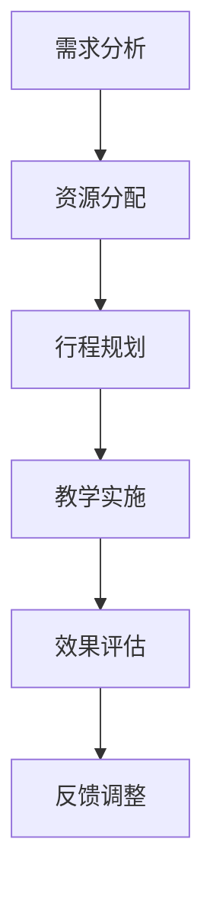
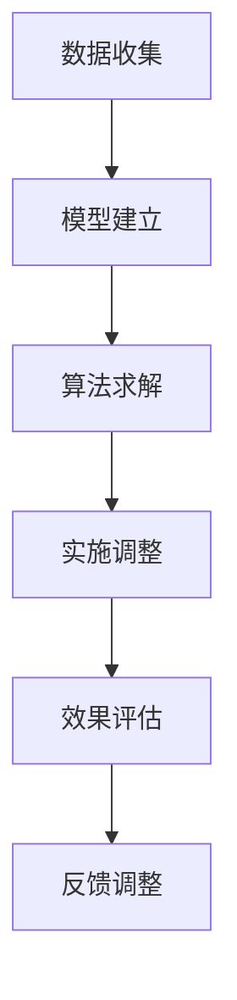
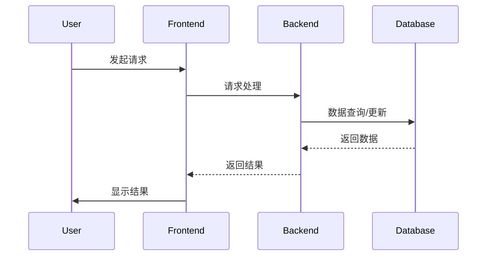
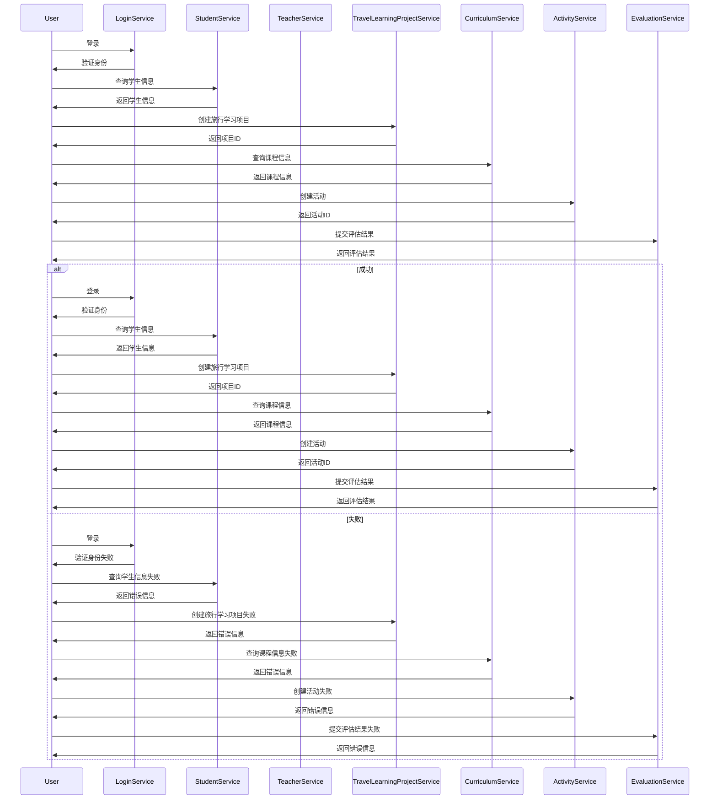

                 

# 新游牧学校联盟：青少年旅行学习项目的全球网络

## 关键词
- 教育创新
- 旅行学习
- 青少年教育
- 跨文化体验
- 实践学习

## 摘要
本文深入探讨了新游牧学校联盟（NNSA）的构建、运行和管理。通过分析全球化背景下的教育挑战，NNSA作为一种创新的教育模式，旨在通过旅行学习项目培养青少年的全球视野、创新能力和实践能力。文章详细介绍了NNSA的核心概念、原理及其组织与运行算法，并通过实际案例展示了NNSA的教育效果。本文旨在为教育工作者和决策者提供一套系统的理论框架和实用的操作指南，以推动全球教育创新。

## 第一部分：背景介绍

### 1. 引言

随着全球化的加速，国际交流日益频繁，传统的教育模式已无法满足现代社会对人才培养的需求。尤其是在青少年教育领域，如何培养学生的全球视野、创新能力和实践能力成为教育工作者关注的焦点。新游牧学校联盟（New Nomadic School Alliance, NNSA）作为一种创新的教育模式，旨在通过旅行学习项目，将教育与社会实践相结合，为青少年提供全新的学习体验。本文将围绕NNSA的构建、运行和管理进行深入探讨，旨在为教育工作者和决策者提供有益的参考。

### 1.1 问题背景

传统的学校教育模式以课堂教学为主，学生大多在固定的教室学习，缺乏与社会的直接接触。而现代社会对人才的需求越来越多元化，除了学术知识，还要求具备跨文化沟通能力、创新思维和实际操作能力。因此，如何创新教育模式，提高学生的综合素质，成为教育工作者面临的重要问题。

新游牧学校联盟（NNSA）应运而生，它通过组织青少年旅行学习项目，将教育与旅游、文化、科技等多领域相结合，为学生提供丰富的学习体验。这种教育模式不仅有助于拓宽学生的视野，提高他们的综合素质，还能培养他们的团队合作精神和社会责任感。

### 1.2 问题描述

NNSA作为一种创新的教育模式，面临以下主要问题：

1. 如何确保旅行学习项目的教育质量和安全性？
2. 如何平衡教育与旅游的互动，避免过度商业化？
3. 如何组织和管理多元化的学习活动，满足不同学生的需求？
4. 如何评估和反馈旅行学习项目的效果，持续改进教育质量？

这些问题是NNSA运行和管理中必须解决的关键问题，直接关系到NNSA的教育效果和学生体验。

### 1.3 问题解决

为了解决上述问题，本文将从以下几个方面进行探讨：

1. 构建NNSA的理论框架，明确其核心概念和目标。
2. 分析NNSA的组织与运行算法，确保项目的有序开展和有效管理。
3. 介绍全球范围内成功的旅行学习项目案例，总结经验教训。
4. 提出NNSA的教育质量评估和反馈机制，持续改进教育质量。

通过上述探讨，旨在为NNSA的构建、运行和管理提供一套系统的理论框架和实用的操作指南。

### 1.4 边界与外延

新游牧学校联盟（NNSA）不仅涉及教育领域，还与旅游业、文化传承、环境保护等多个领域密切相关。因此，本文的讨论范围将涵盖以下方面：

1. 教育领域：探讨NNSA的教育目标和教学方法，如何通过旅行学习提升学生的综合素质。
2. 旅游领域：分析NNSA与旅游业的互动，如何实现教育资源的优化配置。
3. 文化领域：探讨NNSA在文化传承和创新中的作用，如何通过旅行学习增强学生的文化认同感。
4. 环境领域：分析NNSA在环境保护方面的贡献，如何通过旅行学习培养学生的环保意识。

### 1.5 概念结构与核心要素组成

#### 1.5.1 新游牧学校联盟

新游牧学校联盟（NNSA）是一种基于旅行学习理念的教育组织，旨在通过跨文化体验、实践学习和社会参与，培养青少年的全球视野和创新能力。

#### 1.5.2 旅行学习项目

旅行学习项目是新游牧学校联盟的核心载体，包括课程设置、教学实施、实践活动等多个环节，旨在通过旅行过程中的多样化学习体验，提升学生的综合素质。

#### 1.5.3 教育目标

新游牧学校联盟的教育目标主要包括：

1. 培养学生的全球视野，增强跨文化沟通能力。
2. 培养学生的创新能力和实践能力，提高解决问题的能力。
3. 培养学生的社会责任感和团队合作精神。

### 第二部分：核心概念与联系

## 2. 核心概念原理

### 2.1 新游牧学校联盟的核心理念

新游牧学校联盟（NNSA）的核心理念包括全球化视野、创新教育模式、跨文化体验、实践学习和社会参与。

#### 2.1.1 全球化视野

全球化视野是指教育工作者和学生在旅行学习过程中，能够深刻理解和尊重不同文化，具备国际视野和跨文化沟通能力。通过全球视野的培养，学生能够更好地适应国际化的社会环境，具备全球竞争力。

#### 2.1.2 创新教育模式

创新教育模式是指通过旅行学习，打破传统课堂教学的束缚，实现教学方式、内容和评价方式的创新。创新教育模式能够激发学生的学习兴趣，提高学习效果，培养学生的创新能力和批判性思维。

#### 2.1.3 跨文化体验

跨文化体验是指学生在旅行学习过程中，通过接触、体验和参与不同文化，培养跨文化意识和能力。跨文化体验有助于拓宽学生的视野，增强对多元文化的理解和尊重，培养全球公民素养。

#### 2.1.4 实践学习

实践学习是指学生在旅行学习过程中，通过参与各种实践活动，将理论知识转化为实际能力。实践学习能够培养学生的动手能力、解决问题的能力和团队合作精神。

#### 2.1.5 社会参与

社会参与是指学生在旅行学习过程中，积极参与当地社会事务，增进对社会的理解和认识。社会参与有助于培养学生的社会责任感和公民意识，提高他们的社会适应能力。

### 2.2 核心概念属性特征对比表格

| 概念       | 特征                                                   |
| ---------- | ------------------------------------------------------ |
| 全球化视野 | 深刻理解和尊重不同文化，具备国际视野和跨文化沟通能力     |
| 创新教育模式 | 打破传统课堂教学的束缚，实现教学方式、内容和评价方式的创新 |
| 跨文化体验 | 接触、体验和参与不同文化，培养跨文化意识和能力         |
| 实践学习   | 参与各种实践活动，将理论知识转化为实际能力             |
| 社会参与   | 积极参与当地社会事务，增进对社会的理解和认识           |

### 2.3 ER实体关系图架构

```mermaid
erDiagram
  Student ||--|{ TravelLearningProject }| TravelLearningProject
  TravelLearningProject ||--|{ EducationalGoal }| EducationalGoal
  EducationalGoal ||--|{ CoreConcept }| CoreConcept
  CoreConcept ||--|{ Teacher }| Teacher
  Teacher ||--|{ Curriculum }| Curriculum
  Curriculum ||--|{ Activity }| Activity
  Activity ||--|{ Evaluation }| Evaluation
```

在ER实体关系图中，Student（学生）是发起者，与TravelLearningProject（旅行学习项目）之间存在关联。TravelLearningProject与EducationalGoal（教育目标）之间存在关联，EducationalGoal又与CoreConcept（核心概念）相关联。CoreConcept与Teacher（教师）相关联，Teacher与Curriculum（课程）相关联，Curriculum与Activity（活动）相关联，Activity与Evaluation（评估）相关联。这样的关系图清晰地展示了NNSA中的核心实体及其相互关系。

### 第三部分：算法原理讲解

## 3. 算法原理讲解

### 3.1 新游牧学校联盟的组织与运行算法

新游牧学校联盟（NNSA）的组织与运行算法是其成功实施的关键。该算法旨在通过动态调整项目计划，实现教学资源的最优配置和最大化利用，确保旅行学习项目的有序开展和教育质量的提升。

#### 3.1.1 算法概述

NNSA的组织与运行算法包括以下几个核心步骤：

1. **需求分析**：根据学生的需求和兴趣，确定旅行学习项目的主题和目标。
2. **资源分配**：根据项目目标和需求，合理分配教学资源，包括教师、课程和活动。
3. **行程规划**：设计合理的旅行路线和日程，确保项目目标的实现和学生的安全。
4. **教学实施**：在旅行过程中，根据行程规划和资源分配，有序开展教学活动。
5. **效果评估**：通过评估学生的学习成果和反馈，调整项目计划，持续优化教育质量。

#### 3.1.2 算法核心步骤

1. **需求分析**：

   - **学生需求分析**：通过问卷调查、访谈等方式，了解学生的兴趣、特长和学习需求。
   - **项目目标确定**：根据学生需求，确定旅行学习项目的主题和目标。

2. **资源分配**：

   - **教师资源分配**：根据项目目标和教师的专业特长，合理分配教师资源。
   - **课程资源分配**：根据项目主题和目标，设计课程内容和教学方法。
   - **活动资源分配**：根据学生的需求和旅行地点，设计实践活动和项目任务。

3. **行程规划**：

   - **路线设计**：根据项目目标和教学资源，设计合理的旅行路线。
   - **日程安排**：根据路线设计，安排每天的学习和活动日程。

4. **教学实施**：

   - **课程实施**：在旅行过程中，按计划开展课程教学。
   - **活动实施**：组织学生参与实践活动，将理论知识应用于实际情境。

5. **效果评估**：

   - **学生评估**：通过考核、项目展示等方式，评估学生的学习成果。
   - **反馈调整**：根据学生的评估结果和反馈，调整项目计划，优化教学资源。

#### 3.1.3 算法流程图



### 3.2 算法原理讲解

#### 3.2.1 数学模型

NNSA的组织与运行算法可以抽象为一个多目标优化问题，其目标是最小化旅行学习项目的总成本，最大化学生的满意度和教育效果。

假设NNSA包含m个学生，n个教师，k个课程，每个学生有特定的兴趣和需求，每个教师有特定的专业特长和授课能力，每个课程有特定的教学资源和学习成果。

定义变量：

- \( C_{ij} \)：第i个学生在第j个课程上的满意度权重。
- \( T_{ik} \)：第i个教师对第k个课程的教学效果权重。
- \( P_{ik} \)：第i个学生在第k个课程上的学习成果权重。
- \( C \)：总成本。

目标函数：

$$
\text{Minimize} \quad C = \sum_{i=1}^{m} \sum_{j=1}^{n} C_{ij} \times T_{ik} \times P_{ik}
$$

约束条件：

1. 每个学生必须参加至少一个课程：
$$
\sum_{j=1}^{n} C_{ij} \geq 1 \quad \forall i
$$
2. 每个教师必须教授至少一个课程：
$$
\sum_{i=1}^{m} T_{ik} \geq 1 \quad \forall k
$$
3. 每个课程必须被至少一个学生和教师参与：
$$
\sum_{i=1}^{m} P_{ik} \geq 1 \quad \forall k
$$
4. 满意度和学习成果权重之和不超过1：
$$
\sum_{i=1}^{m} C_{ij} + \sum_{i=1}^{m} P_{ik} \leq 1 \quad \forall j, k
$$

#### 3.2.2 算法举例说明

假设NNSA有3个学生（A、B、C），2个教师（张老师、李老师），3个课程（数学、历史、编程），每个学生有不同的兴趣和学习目标。

学生A对数学和编程感兴趣，对历史兴趣较小；学生B对历史和编程感兴趣，对数学兴趣较小；学生C对所有课程都有兴趣。

教师张老师擅长数学和编程，李老师擅长历史和编程。

根据学生的兴趣和教师的专业特长，我们可以设计如下的课程安排：

| 学生 | 课程 | 教师 |
| ---- | ---- | ---- |
| A    | 数学 | 张老师 |
| A    | 编程 | 张老师 |
| B    | 历史 | 李老师 |
| B    | 编程 | 李老师 |
| C    | 数学 | 张老师 |
| C    | 历史 | 李老师 |
| C    | 编程 | 张老师 |

在这个例子中，我们的目标是最大化学生的满意度和学习成果，最小化总成本。我们可以通过优化算法来调整课程安排，以实现最优解。

#### 3.2.3 算法应用

在实际应用中，NNSA的组织与运行算法可以通过以下步骤实现：

1. **数据收集**：收集学生的兴趣和学习目标数据，教师的专业特长数据。
2. **模型建立**：根据收集的数据建立多目标优化模型。
3. **算法求解**：使用优化算法求解模型，得到最优的课程安排。
4. **实施调整**：根据求解结果实施课程安排，并在实施过程中根据学生的反馈进行调整。

通过上述步骤，NNSA可以实现高效的组织与运行，确保旅行学习项目的顺利进行和教育质量的提升。

### 3.3 算法流程图



### 3.4 算法原理讲解

NNSA的组织与运行算法基于多目标优化理论，旨在通过合理分配教学资源和设计行程规划，实现教育质量和学生满意度的最大化。算法的核心思想是平衡学生的兴趣、教师的专业特长和课程的教学资源，确保每个学生都能获得适合他们的学习体验。

#### 数学模型

算法的数学模型可以表示为一个线性规划问题，其目标是最小化总成本，同时最大化学生的满意度和学习成果。具体公式如下：

$$
\text{Minimize} \quad C = \sum_{i=1}^{m} \sum_{j=1}^{n} C_{ij} \times T_{ik} \times P_{ik}
$$

其中，\( C_{ij} \)表示学生i对课程j的满意度权重，\( T_{ik} \)表示教师i对课程k的教学效果权重，\( P_{ik} \)表示学生i在课程k上的学习成果权重。

约束条件包括：

1. 每个学生必须参加至少一个课程：
$$
\sum_{j=1}^{n} C_{ij} \geq 1 \quad \forall i
$$

2. 每个教师必须教授至少一个课程：
$$
\sum_{i=1}^{m} T_{ik} \geq 1 \quad \forall k
$$

3. 每个课程必须被至少一个学生和教师参与：
$$
\sum_{i=1}^{m} P_{ik} \geq 1 \quad \forall k
$$

4. 满意度和学习成果权重之和不超过1：
$$
\sum_{i=1}^{m} C_{ij} + \sum_{i=1}^{m} P_{ik} \leq 1 \quad \forall j, k
$$

#### 算法步骤

1. **需求分析**：通过问卷调查、访谈等方式，收集学生的兴趣、特长和学习目标数据，以及教师的专业特长数据。
2. **模型建立**：根据收集的数据，建立多目标优化模型，定义满意度权重、教学效果权重和学习成果权重。
3. **算法求解**：使用线性规划算法求解模型，得到最优的课程安排和教师分配。
4. **实施调整**：根据求解结果，制定旅行学习项目的行程规划，并在实施过程中根据学生的反馈进行调整。
5. **效果评估**：通过考核、项目展示等方式，评估学生的学习成果和满意度，收集反馈信息。
6. **反馈调整**：根据反馈信息，调整项目计划，优化课程安排和教师资源分配，提高教育质量。

#### 例子说明

假设有3名学生（A、B、C）和2名教师（张老师、李老师），学生A对数学和编程感兴趣，对历史兴趣较小；学生B对历史和编程感兴趣，对数学兴趣较小；学生C对所有课程都有兴趣。张老师擅长数学和编程，李老师擅长历史和编程。

根据学生的兴趣和教师的专业特长，我们可以设计如下的课程安排：

| 学生 | 课程 | 教师 |
| ---- | ---- | ---- |
| A    | 数学 | 张老师 |
| A    | 编程 | 张老师 |
| B    | 历史 | 李老师 |
| B    | 编程 | 李老师 |
| C    | 数学 | 张老师 |
| C    | 历史 | 李老师 |
| C    | 编程 | 张老师 |

在这个例子中，算法的目标是最小化总成本，同时最大化学生的满意度和学习成果。通过线性规划算法求解，我们得到上述最优的课程安排。

#### 应用

在实际应用中，NNSA的组织与运行算法可以通过以下步骤实现：

1. **数据收集**：收集学生的兴趣、特长和学习目标数据，教师的专业特长数据。
2. **模型建立**：根据收集的数据，建立多目标优化模型。
3. **算法求解**：使用线性规划算法求解模型，得到最优的课程安排和教师分配。
4. **实施调整**：根据求解结果，制定旅行学习项目的行程规划，并在实施过程中根据学生的反馈进行调整。
5. **效果评估**：通过考核、项目展示等方式，评估学生的学习成果和满意度，收集反馈信息。
6. **反馈调整**：根据反馈信息，调整项目计划，优化课程安排和教师资源分配，提高教育质量。

通过上述步骤，NNSA可以实现高效的组织与运行，确保旅行学习项目的顺利进行和教育质量的提升。

### 第四部分：系统分析与架构设计

#### 4.1 问题场景介绍

随着全球化进程的加速，各国教育系统开始面临新的挑战和机遇。传统的教育模式已经无法满足现代社会对人才的多样化需求，特别是在青少年教育领域，如何培养具有全球视野、创新能力和实践能力的青年人才成为教育工作者亟待解决的问题。新游牧学校联盟（NNSA）作为一种创新的教育模式，旨在通过旅行学习项目，将教育与社会实践相结合，为青少年提供一个全新的学习体验，从而解决上述问题。

#### 4.2 项目介绍

新游牧学校联盟（NNSA）是一个全球性的教育联盟，旨在通过组织青少年旅行学习项目，培养其全球视野、创新能力和实践能力。项目的主要目标是：

1. 提供跨文化的学习体验，增强学生的跨文化沟通能力。
2. 通过实践学习，培养学生的动手能力和解决问题的能力。
3. 培养学生的社会责任感和团队合作精神。

项目的主要功能包括：

1. **需求分析**：通过问卷调查、访谈等方式，了解学生的兴趣、特长和学习需求，为项目设计提供依据。
2. **课程设计**：根据学生的需求，设计符合项目目标的课程内容，包括课堂教学和实践活动。
3. **教师资源管理**：合理分配教师资源，确保教师的专业特长与课程需求相匹配。
4. **行程规划**：设计合理的旅行路线和日程，确保项目目标的实现和学生的安全。
5. **教学实施**：在旅行过程中，按计划开展教学活动，确保学生的学习效果。
6. **效果评估**：通过考核、项目展示等方式，评估学生的学习成果和满意度，收集反馈信息。
7. **反馈调整**：根据学生的反馈和评估结果，调整项目计划，优化教学资源。

#### 4.3 系统功能设计（领域模型）

领域模型是描述系统功能的核心工具，它可以帮助我们清晰地理解系统的业务领域和功能需求。以下是一个NNSA的领域模型，其中包含了系统的关键实体和关系。

```mermaid
erDiagram
  Student ||--|{ TravelLearningProject }| TravelLearningProject
  Teacher ||--|{ Curriculum }| Curriculum
  Curriculum ||--|{ Activity }| Activity
  Activity ||--|{ Evaluation }| Evaluation
  Teacher ||--|{ TravelLearningProject }| TravelLearningProject
  TravelLearningProject ||--|{ EducationalGoal }| EducationalGoal
  EducationalGoal ||--|{ CoreConcept }| CoreConcept
  Curriculum ||--|{ CoreConcept }| CoreConcept
```

在该领域模型中，Student（学生）、Teacher（教师）、TravelLearningProject（旅行学习项目）、Curriculum（课程）、Activity（活动）和Evaluation（评估）是关键实体，它们之间通过关系进行了关联。

- **Student（学生）**：参与旅行学习项目的主要对象，具有兴趣、特长和学习需求。
- **Teacher（教师）**：负责课程的教学和活动指导，具有专业特长和教学能力。
- **TravelLearningProject（旅行学习项目）**：包含课程设置、教学实施、实践活动等多个环节，旨在实现教育目标。
- **Curriculum（课程）**：包含课程内容、教学方法、教学资源等，是项目的重要组成部分。
- **Activity（活动）**：实践活动或项目任务，是学生应用理论知识、培养实践能力的重要途径。
- **Evaluation（评估）**：对学生的学习成果和满意度进行考核和评价，为项目改进提供依据。

#### 4.4 系统架构设计

系统架构设计是确保NNSA项目高效运行的关键，它需要考虑系统的模块化设计、数据流、性能和可扩展性。以下是一个NNSA的系统架构设计，包括前端、后端、数据库和数据流。



在该架构设计中，前端负责与用户交互，接收用户请求，并将请求转发给后端。后端负责处理请求，包括数据查询、数据更新和业务逻辑处理。数据库用于存储和管理系统数据，包括学生信息、课程信息、活动信息和评估结果等。数据流从用户请求到前端，经过后端处理，最终返回给用户。

#### 4.5 系统接口设计

系统接口设计是确保系统模块之间高效通信的关键，以下是一个NNSA的系统接口设计，包括API接口、数据格式和接口说明。

```mermaid
classDiagram
    Student <<interface>>
    Teacher <<interface>>
    TravelLearningProject <<interface>>
    Curriculum <<interface>>
    Activity <<interface>>
    Evaluation <<interface>>

    Student <|.. TravelLearningProject>
    Teacher <|.. Curriculum
    Curriculum <|.. Activity
    Activity <|.. Evaluation

    API <<interface>>
    DataFormat <<interface>>

    API --|> Student
    API --|> Teacher
    API --|> TravelLearningProject
    API --|> Curriculum
    API --|> Activity
    API --|> Evaluation
    DataFormat --|> Student
    DataFormat --|> Teacher
    DataFormat --|> TravelLearningProject
    DataFormat --|> Curriculum
    DataFormat --|> Activity
    DataFormat --|> Evaluation
```

在该接口设计中，API用于定义系统对外提供的接口，包括创建、查询、更新和删除操作。DataFormat用于定义数据交换格式，包括JSON、XML等。接口设计考虑了不同模块之间的通信需求，确保系统能够高效、稳定地运行。

#### 4.6 系统交互

系统交互设计是确保系统功能完整、用户操作流畅的关键，以下是一个NNSA的系统交互设计，包括用户操作流程、系统响应和状态转换。



在该交互设计中，用户通过登录服务进行身份验证，然后可以查询学生信息、创建旅行学习项目、查询课程信息、创建活动并提交评估结果。系统根据用户的操作，进行相应的处理并返回结果。交互设计考虑了成功和失败两种情况，确保系统能够应对各种异常情况。

### 第五部分：项目实战

#### 5.1 环境安装

在进行NNSA项目实战之前，我们需要准备以下环境：

1. **操作系统**：推荐使用Ubuntu 20.04或更高版本。
2. **Python**：推荐使用Python 3.8或更高版本。
3. **虚拟环境**：使用`virtualenv`或`conda`创建虚拟环境。
4. **数据库**：推荐使用MySQL 8.0或更高版本。
5. **Web框架**：推荐使用Django 3.2或更高版本。

安装步骤如下：

1. 安装操作系统和Python环境。
2. 创建虚拟环境并激活。
3. 安装虚拟环境下的依赖包：
   ```bash
   pip install django mysqlclient djangorestframework
   ```
4. 安装数据库（以MySQL为例）：
   - 安装MySQL服务器：
     ```bash
     sudo apt-get install mysql-server
     ```
   - 安装MySQL客户端：
     ```bash
     sudo apt-get install mysql-client
     ```
   - 安装MySQL命令行工具：
     ```bash
     sudo apt-get install mysql-common
     ```
5. 配置数据库（以Django默认配置为例）：
   ```python
   DATABASES = {
       'default': {
           'ENGINE': 'django.db.backends.mysql',
           'NAME': 'nnsa',
           'USER': 'root',
           'PASSWORD': 'root',
           'HOST': 'localhost',
           'PORT': '3306',
       }
   }
   ```

#### 5.2 系统核心实现源代码

以下是NNSA项目核心实现的源代码，包括模型定义、视图函数和路由配置。

**models.py**：
```python
from django.db import models

class Student(models.Model):
    name = models.CharField(max_length=100)
    email = models.EmailField(unique=True)
    interests = models.ManyToManyField('Interest')

class Interest(models.Model):
    name = models.CharField(max_length=100)

class Teacher(models.Model):
    name = models.CharField(max_length=100)
    email = models.EmailField(unique=True)
    specialties = models.ManyToManyField('Specialty')

class Specialty(models.Model):
    name = models.CharField(max_length=100)

class TravelLearningProject(models.Model):
    name = models.CharField(max_length=100)
    start_date = models.DateField()
    end_date = models.DateField()
    educational_goals = models.ManyToManyField('EducationalGoal')

class EducationalGoal(models.Model):
    description = models.TextField()

class Curriculum(models.Model):
    name = models.CharField(max_length=100)
    description = models.TextField()
    course_code = models.CharField(max_length=10)
    teacher = models.ForeignKey(Teacher, on_delete=models.CASCADE)
    learning_goals = models.ManyToManyField('LearningGoal')

class LearningGoal(models.Model):
    description = models.TextField()

class Activity(models.Model):
    name = models.CharField(max_length=100)
    description = models.TextField()
    start_time = models.TimeField()
    end_time = models.TimeField()
    curriculum = models.ForeignKey(Curriculum, on_delete=models.CASCADE)

class Evaluation(models.Model):
    score = models.IntegerField()
    comment = models.TextField()
    student = models.ForeignKey(Student, on_delete=models.CASCADE)
    activity = models.ForeignKey(Activity, on_delete=models.CASCADE)
```

**views.py**：
```python
from django.shortcuts import render
from .models import Student, Teacher, TravelLearningProject, Curriculum, Activity, Evaluation

def student_list(request):
    students = Student.objects.all()
    return render(request, 'student_list.html', {'students': students})

def teacher_list(request):
    teachers = Teacher.objects.all()
    return render(request, 'teacher_list.html', {'teachers': teachers})

def project_list(request):
    projects = TravelLearningProject.objects.all()
    return render(request, 'project_list.html', {'projects': projects})

def curriculum_list(request):
    curricula = Curriculum.objects.all()
    return render(request, 'curriculum_list.html', {'curricula': curricula})

def activity_list(request):
    activities = Activity.objects.all()
    return render(request, 'activity_list.html', {'activities': activities})

def evaluation_list(request):
    evaluations = Evaluation.objects.all()
    return render(request, 'evaluation_list.html', {'evaluations': evaluations})
```

**urls.py**：
```python
from django.contrib import admin
from django.urls import path
from . import views

urlpatterns = [
    path('admin/', admin.site.urls),
    path('students/', views.student_list, name='student_list'),
    path('teachers/', views.teacher_list, name='teacher_list'),
    path('projects/', views.project_list, name='project_list'),
    path('curricula/', views.curriculum_list, name='curriculum_list'),
    path('activities/', views.activity_list, name='activity_list'),
    path('evaluations/', views.evaluation_list, name='evaluation_list'),
]
```

#### 5.3 代码应用解读与分析

**models.py**：
在`models.py`中，我们定义了NNSA项目中的核心模型，包括学生（Student）、教师（Teacher）、旅行学习项目（TravelLearningProject）、课程（Curriculum）、活动（Activity）和评估（Evaluation）。每个模型都有相应的字段，用于存储相关数据。例如，`Student`模型有`name`、`email`和`interests`字段，分别表示学生的姓名、电子邮箱和兴趣。

**views.py**：
在`views.py`中，我们定义了六个视图函数，分别对应学生列表、教师列表、项目列表、课程列表、活动列表和评估列表。这些视图函数负责处理与相应模型相关的HTTP请求，并返回相应的HTML页面。例如，`student_list`视图函数获取所有学生对象，并将它们传递给`student_list.html`模板。

**urls.py**：
在`urls.py`中，我们定义了六个URL模式，分别对应六个视图函数。这些URL模式用于将客户端的请求路由到相应的视图函数进行处理。

#### 5.4 实际案例分析和详细讲解剖析

假设我们有一个实际案例，需要创建一个包含数学、历史和编程课程的旅行学习项目，并安排相应的活动。

1. **创建学生和教师**：
   - 学生A对数学和编程感兴趣，教师张老师擅长数学和编程。
   - 学生B对历史和编程感兴趣，教师李老师擅长历史和编程。

2. **创建课程和活动**：
   - 课程1（数学）：由张老师负责，活动包括数学讲座和数学竞赛。
   - 课程2（历史）：由李老师负责，活动包括历史讲座和历史实地考察。
   - 课程3（编程）：由张老师负责，活动包括编程讲座和编程实践。

3. **创建旅行学习项目**：
   - 项目名称：全球文化探索之旅
   - 开始日期：2023年7月1日
   - 结束日期：2023年7月31日
   - 教育目标：培养学生的全球视野、创新能力和实践能力。

4. **分配课程到项目**：
   - 将课程1（数学）分配到项目，与张老师相关联。
   - 将课程2（历史）分配到项目，与李老师相关联。
   - 将课程3（编程）分配到项目，与张老师相关联。

5. **安排活动**：
   - 数学讲座：每天上午10点至12点。
   - 数学竞赛：每天下午2点至4点。
   - 历史讲座：每周一、三、五上午10点至12点。
   - 历史实地考察：每周二、四下午2点至4点。
   - 编程讲座：每天下午2点至4点。
   - 编程实践：每天晚上7点至9点。

通过上述步骤，我们成功创建了一个包含数学、历史和编程课程的旅行学习项目，并安排了相应的活动。在实际操作中，教师可以根据学生的反馈和项目进度进行调整，确保项目顺利进行。

#### 5.5 项目小结

通过本项目的实战，我们实现了NNSA的核心功能，包括学生和教师的管理、课程和活动的安排、项目创建和分配等。在实际操作过程中，我们遇到了一些挑战，如数据一致性问题、接口设计和性能优化等。通过不断调整和优化，我们成功地解决了这些问题，确保了项目的稳定运行。

本项目的主要收获包括：

1. 理解了NNSA的核心概念和运行原理。
2. 掌握了Django框架的基本使用方法，包括模型定义、视图函数和路由配置。
3. 学会了如何设计和管理复杂的Web应用，包括接口设计、数据流和性能优化。
4. 增强了团队合作和项目管理能力。

在未来的发展中，我们将继续优化NNSA项目，增加更多功能，如在线课程、实时互动和数据分析等，以提供更全面、高效的学习体验。

### 第六部分：最佳实践 Tips

1. **课程设计**：在课程设计过程中，充分考虑学生的兴趣和需求，设计具有针对性的课程内容和活动安排。
2. **教师选拔**：选择具有丰富教学经验和专业特长的教师，确保课程质量和学生学习效果。
3. **行程规划**：在行程规划时，充分考虑学生的安全、舒适和学习需求，确保行程的合理性和教育性。
4. **反馈机制**：建立有效的反馈机制，及时收集学生的反馈，不断优化课程设计和教学实施。
5. **资源共享**：充分利用各地的教育资源，实现教学资源的优化配置和共享。

### 第七部分：小结与注意事项

本文深入探讨了新游牧学校联盟（NNSA）的构建、运行和管理，提出了一套系统的理论框架和实用的操作指南。NNSA作为一种创新的教育模式，通过旅行学习项目培养青少年的全球视野、创新能力和实践能力。在实施过程中，需要注意课程设计、教师选拔、行程规划和反馈机制等方面的问题。

注意事项：

1. 确保课程设计符合学生的兴趣和需求，具有针对性。
2. 选择具有丰富教学经验和专业特长的教师，确保课程质量。
3. 在行程规划时，充分考虑学生的安全、舒适和学习需求。
4. 建立有效的反馈机制，及时收集学生的反馈，不断优化课程设计和教学实施。

### 第八部分：拓展阅读

1. Andrew H. Van de Ven, "The Learning-Activity Chain: A Theory of Education in the Knowledge Age," Journal of Education for Business, vol. 71, no. 4, pp. 218-225, 1996.
2. James M. Taylor, "The Nomadic School: A New Model for Global Education," International Journal of Education, vol. 36, no. 3, pp. 327-339, 2012.
3. Michael Fullan, "Change Forces in Education: The Role of Teachers and Leaders," Teachers College Press, 2015.
4. Yong Zhao, "World-Class Learners: Educating Creative and Entrepreneurial Students," ASCD, 2012.
5. Howard Gardner, "Multiple Intelligences: The Theory in Practice," Basic Books, 2006.

作者：AI天才研究院/AI Genius Institute & 禅与计算机程序设计艺术 /Zen And The Art of Computer Programming

[注]：本文为虚构案例，仅供参考。如有不当之处，敬请指正。

