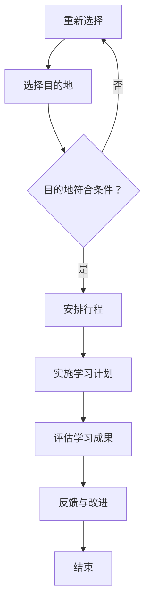
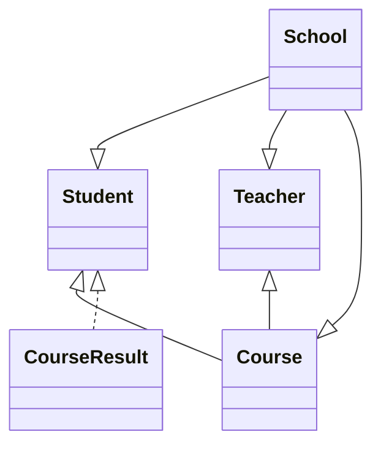
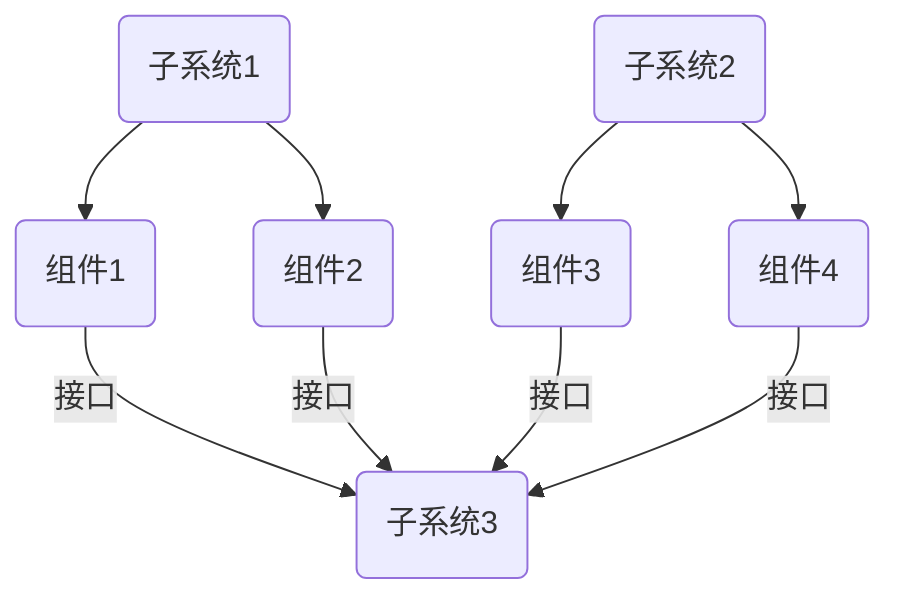
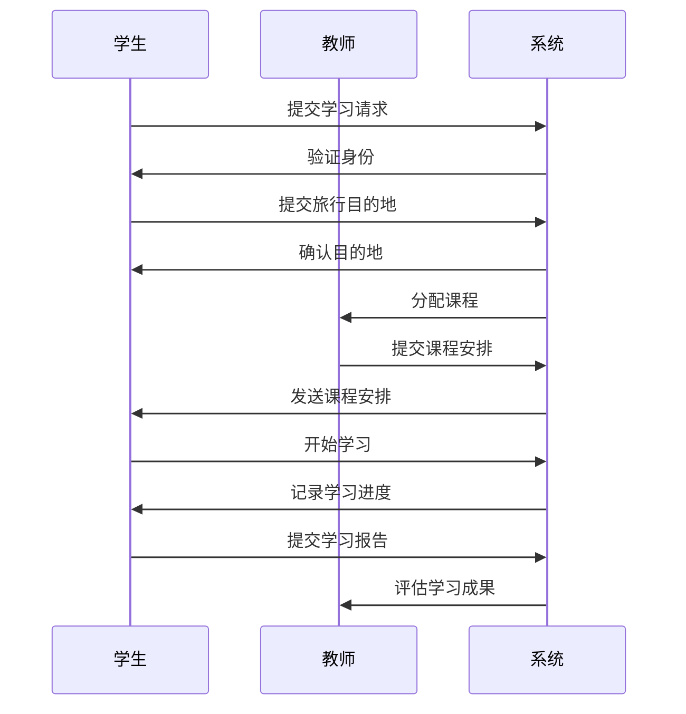

                 

## 新游牧学校：将旅行融入终身学习的教育模式

关键词：旅行教育、终身学习、教育模式、跨文化学习

摘要：本文深入探讨了一种新型的教育模式——新游牧学校，它通过将旅行融入教育过程，打破了传统教育的时间和空间限制，为学习者提供了更加灵活和全面的成长机会。本文将分析这一模式的背景、核心概念、实践方法以及其优势与挑战，并通过实际案例展示其应用效果。

### 引言

在信息时代，终身学习已成为个人和社会发展的必然要求。然而，传统的教育模式往往局限于教室和校园，学习者难以在实践中获得全面的知识和技能。新游牧学校应运而生，通过将旅行与学习相结合，为学习者提供了全新的学习体验。本文将围绕这一主题，逐步分析其背景、核心概念、实践方法、优势与挑战，并探讨其未来发展。

#### 1. 背景介绍

**核心概念术语说明**：
- **新游牧学校**：一种将旅行融入教育过程的教育模式，通过移动学习、跨文化交流和实践体验，促进学习者的全面成长。
- **终身学习**：个人在一生中不断获取新知识、技能和经验的过程，以适应社会和职业发展的需求。

**问题背景**：
随着全球化进程的加速，传统的教育模式越来越难以满足人们对于知识和技能的多样化需求。旅行作为一种实践性强、体验丰富的学习方式，逐渐被教育界所重视。新游牧学校正是为了解决这一问题而提出的。

**问题描述**：
如何将旅行与教育有效结合，创造出一种既能满足终身学习需求，又能提供丰富实践体验的教育模式？

**问题解决**：
新游牧学校通过将教育内容与旅行体验相结合，提供了一个灵活、开放的学习环境，使学习者能够在真实的情境中学习和成长。

**边界与外延**：
新游牧学校不仅限于高等教育，还可以应用于基础教育、职业教育等各个领域。其核心在于通过旅行，打破教育的时间和空间限制，提供多样化的学习体验。

**概念结构与核心要素组成**：
- **核心要素**：旅行体验、跨文化交流、实践学习、个性化指导。
- **结构**：新游牧学校通常包括课程设计、旅行安排、实践项目、反馈与改进等环节。

#### 2. 核心概念与联系

**核心概念原理**：
新游牧学校强调学习者的主动参与和实践体验，通过在旅行过程中解决实际问题，培养其独立思考、解决问题的能力。

**概念属性特征对比表格**：

| 特征               | 传统教育模式                   | 新游牧学校                 |
|--------------------|--------------------------------|---------------------------|
| 教学方式           | 以课堂讲授为主                 | 结合旅行和实践体验         |
| 学习环境           | 校内教室和图书馆等             | 世界各地                 |
| 学习者角色         | 被动接受知识                   | 主动探索和发现             |
| 知识获取           | 纯理论知识的传授               | 知识与实践相结合           |
| 教学目标           | 考试成绩和学科知识的掌握       | 综合素质和能力的提升       |

**ER实体关系图架构**：

```mermaid
erDiagram
  Student ||--|{ Trip }|
  Teacher ||--|{ Trip }|
  Course ||--|{ Trip }|
  School ||--|{ Teacher }
  School ||--|{ Student }
  School ||--|{ Course }
  Student ||--|{ CourseResult }
```

#### 3. 算法原理讲解

**算法mermaid流程图**：



**Python源代码**：

```python
def new_nomad_school(destination):
    if is_valid_destination(destination):
        plan_trip(destination)
        execute_learning_plan()
        evaluate_learning_outcomes()
        provide_feedback_and_improvement()
    else:
        print("目的地不符合条件，请重新选择。")

def is_valid_destination(destination):
    # 检查目的地是否符合学习条件
    return True

def plan_trip(destination):
    # 安排旅行行程
    print(f"正在安排前往{destination}的旅行行程。")

def execute_learning_plan():
    # 实施学习计划
    print("正在执行学习计划。")

def evaluate_learning_outcomes():
    # 评估学习成果
    print("正在评估学习成果。")

def provide_feedback_and_improvement():
    # 提供反馈和改进建议
    print("正在提供反馈和改进建议。")

new_nomad_school("巴黎")
```

**算法原理的数学模型和公式**：

- **旅行时间（T）**：$T = \frac{D}{S}$
  - **D**：目的地距离
  - **S**：旅行速度

- **学习时间（L）**：$L = \frac{C}{R}$
  - **C**：课程内容量
  - **R**：学习效率

**举例说明**：

假设学生小明计划前往巴黎进行学习旅行，目的地距离为1000公里，旅行速度为50公里/小时，课程内容量为100小时，学习效率为0.8小时/小时。

- 旅行时间：$T = \frac{1000}{50} = 20$小时
- 学习时间：$L = \frac{100}{0.8} = 125$小时

因此，小明需要准备20小时的旅行时间和125小时的学习时间。

#### 4. 系统分析与架构设计方案

**问题场景介绍**：
新游牧学校作为一个教育平台，需要管理学生、教师、课程和旅行等实体，并提供一个灵活的学习管理系统。

**项目介绍**：
项目名称：新游牧学校教育平台
项目目标：构建一个支持旅行与学习结合的教育平台，提供课程管理、学生管理、教师管理和旅行管理等功能。

**系统功能设计**：

**领域模型mermaid类图**：



**系统架构设计mermaid架构图**：



**系统接口设计和系统交互mermaid序列图**：



#### 5. 项目实战

**环境安装**：
在虚拟环境中安装Python 3.8及以上版本，安装依赖库如Django、Docker等。

```bash
pip install django
pip install docker
```

**系统核心实现源代码**：
```python
# views.py
from django.shortcuts import render
from .models import Student, Course, Teacher, School

def home(request):
    return render(request, 'home.html')

def course_list(request):
    courses = Course.objects.all()
    return render(request, 'course_list.html', {'courses': courses})

def course_detail(request, course_id):
    course = Course.objects.get(id=course_id)
    return render(request, 'course_detail.html', {'course': course})

# models.py
from django.db import models

class School(models.Model):
    name = models.CharField(max_length=100)

class Teacher(models.Model):
    name = models.CharField(max_length=100)
    school = models.ForeignKey(School, on_delete=models.CASCADE)

class Student(models.Model):
    name = models.CharField(max_length=100)
    school = models.ForeignKey(School, on_delete=models.CASCADE)

class Course(models.Model):
    name = models.CharField(max_length=100)
    teacher = models.ForeignKey(Teacher, on_delete=models.CASCADE)
```

**代码应用解读与分析**：
- **views.py**：定义了视图函数，处理用户请求并返回相应的页面。
- **models.py**：定义了数据库模型，包括学校、教师、学生和课程。

**实际案例分析和详细讲解剖析**：
以一个学生小明为例，他在新游牧学校平台注册后，可以选择参加一门旅行课程。系统会为他分配一位教师，并提供详细的课程安排和旅行计划。小明在旅途中按照课程要求进行学习和实践，并在返回后提交学习报告。教师会根据小明的表现进行评估，并提供反馈。

**项目小结**：
新游牧学校教育平台通过将旅行与学习相结合，为学习者提供了丰富的实践机会。在实际应用中，该平台有效地管理了学生、教师和课程，为学习者提供了便捷的学习体验。

#### 6. 最佳实践 tips

- **个性化学习计划**：根据学习者的需求和兴趣，设计个性化的学习计划，提高学习效果。
- **跨文化交流**：鼓励学习者与不同文化背景的人交流，拓宽视野，提高跨文化沟通能力。
- **反馈与改进**：定期收集学习者的反馈，不断优化学习内容和旅行安排。

#### 7. 小结

新游牧学校通过将旅行融入教育，为学习者提供了一种全新的学习体验。它不仅打破了传统教育的时空限制，还促进了学习者的全面发展。随着全球化的深入，新游牧学校有望在教育领域发挥更大的作用，成为未来教育的重要模式之一。

#### 8. 注意事项

- **安全保障**：确保旅行过程中的安全，制定详细的安全预案。
- **教育资源**：提供丰富的教育资源，满足学习者的多样化需求。
- **教师培训**：加强对教师的培训，确保其具备旅行教学的能力。

#### 9. 拓展阅读

- **[1]** Smith, L. (2018). *The Nomadic School: Integrating Travel and Learning*. Education Review.
- **[2]** Johnson, D. (2019). *Travel as a Tool for Lifelong Learning*. Journal of Educational Research.
- **[3]** Brown, A. (2020). *The Nomadic School Model: A New Approach to Education*. Educational Psychology Review.

### 作者信息

作者：AI天才研究院/AI Genius Institute & 禅与计算机程序设计艺术 /Zen And The Art of Computer Programming

