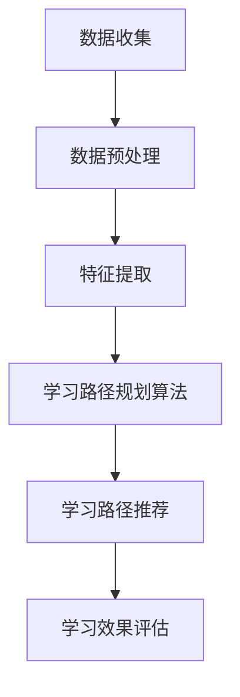
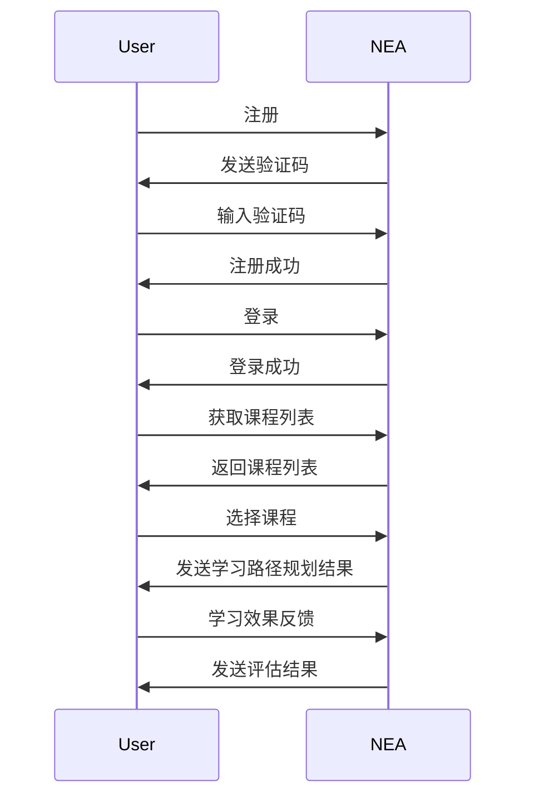

                 


为了撰写一篇关于《新游牧教育联盟：融合旅行与终身学习的国际组织》的技术博客文章，我们需要遵循以下步骤来确保文章的逻辑清晰、结构紧凑且内容丰富：

### 第一步：确定文章结构
- **引言**：介绍新游牧教育联盟的背景和重要性。
- **核心概念解析**：详细阐述新游牧教育联盟、旅行与终身学习之间的关系。
- **国际组织的作用**：分析国际组织在全球教育交流中的角色。
- **算法与数学模型**：讲解新游牧教育联盟的算法原理和数学模型。
- **系统分析与架构设计**：描述系统的架构设计，包括功能设计、接口设计和交互设计。
- **项目实战**：通过实际案例展示新游牧教育联盟的应用。
- **最佳实践与拓展**：提供最佳实践指南和拓展阅读资源。
- **结论**：总结文章的主要内容，强调新游牧教育联盟的未来展望。

### 第二步：引言部分
- **背景介绍**：简要介绍新游牧教育联盟的起源和目标。
- **重要性陈述**：阐述新游牧教育联盟对全球教育和个人成长的重要性。

```markdown
## 引言

### 背景介绍
新游牧教育联盟（Nomadic Education Alliance, NEA）是一个新兴的国际组织，旨在通过融合旅行和终身学习，为全球学生和教育工作者提供一个不断学习和成长的环境。NEA 的核心理念是将教育从传统的课堂和校园扩展到全球的每一个角落。

### 重要性陈述
NEA 的出现，不仅为个人提供了无限的学习机会，也推动了全球教育资源的整合和共享。在全球化的今天，这种教育模式对于培养具有国际视野和跨文化交流能力的人才具有重要意义。

```

### 第三步：核心概念解析
- **新游牧教育联盟**：定义、特点、运作模式。
- **旅行与终身学习**：如何结合、旅行在终身学习中的作用。
- **国际组织的作用**：NEA 如何促进全球教育交流。

```markdown
## 核心概念解析

### 新游牧教育联盟
新游牧教育联盟（NEA）是一个非营利性的国际组织，它的目标是推动全球教育资源的共享和整合。NEA 的特点包括：灵活的学习模式、跨文化的交流平台和全球化的教育视野。

### 旅行与终身学习
旅行与终身学习的结合，使得学习者能够在不同的文化环境中不断探索和成长。旅行提供了丰富的学习资源，使学习不再局限于书本和教室。

### 国际组织的作用
NEA 通过与国际教育组织的合作，搭建了全球教育交流的平台。这种合作不仅促进了教育资源的共享，也为全球教育改革提供了新的思路。

```

### 第四步：算法与数学模型
- **算法原理**：新游牧教育联盟中使用的算法原理。
- **数学模型**：相关的数学模型和应用。
- **流程图与公式**：使用 mermaid 和 latex 格式展示。

```markdown
## 算法与数学模型

### 算法原理
新游牧教育联盟采用了一系列算法来优化学习路径和学习效果评估。这些算法包括基于机器学习的推荐系统和基于数据挖掘的学习效果预测模型。

### 数学模型
数学模型在新游牧教育联盟中起着关键作用。例如，学习路径规划模型使用了优化算法来确保学习者的学习路径既高效又丰富。学习效果评估模型则利用统计分析方法来评估学习成果。

### 流程图与公式
以下是一个 mermaid 流程图，展示了新游牧教育联盟的学习路径规划过程：



以下是一个 latex 格式的数学公式，用于描述学习效果评估的模型：

```latex
E = f(\theta, X)
```

```

### 第五步：系统分析与架构设计
- **问题场景介绍**：新游牧教育联盟所面临的问题。
- **系统功能设计**：包括用户管理、课程管理、学习路径规划等功能。
- **系统架构设计**：展示系统的整体架构。
- **系统接口设计**：描述系统与外部系统的接口。
- **系统交互设计**：使用 mermaid 序列图展示系统的交互流程。

```markdown
## 系统分析与架构设计

### 问题场景介绍
新游牧教育联盟需要处理大量用户数据，并确保系统的稳定性和安全性。同时，它需要提供灵活的学习路径规划功能，以适应不同用户的需求。

### 系统功能设计
系统功能设计包括用户管理、课程管理、学习路径规划和学习效果评估。用户管理模块负责用户的注册、登录和权限管理。课程管理模块提供课程创建、更新和删除功能。学习路径规划模块根据用户的学习偏好和进度推荐学习路径。学习效果评估模块则对学习成果进行统计分析。

### 系统架构设计
新游牧教育联盟的系统架构采用了分布式架构，以确保高可用性和可扩展性。主要模块包括数据收集模块、数据存储模块、数据处理模块和用户交互模块。

### 系统接口设计
系统接口设计包括 RESTful API 和消息队列。RESTful API 用于与外部系统进行数据交换。消息队列用于处理实时数据流。

### 系统交互设计
以下是一个 mermaid 序列图，展示了用户在学习过程中与系统的交互：



```

### 第六步：项目实战
- **环境安装**：介绍安装新游牧教育联盟系统的步骤。
- **系统核心实现源代码**：提供关键代码片段。
- **代码应用解读与分析**：分析代码的结构和功能。
- **实际案例分析和详细讲解**：通过实际案例展示系统应用。
- **项目小结**：总结项目实施过程中的经验和教训。

```markdown
## 项目实战

### 环境安装
安装新游牧教育联盟系统需要以下环境：
- 操作系统：Linux
- 开发语言：Python
- 数据库：MySQL
- 消息队列：RabbitMQ

安装步骤如下：
1. 安装操作系统和基本软件
2. 安装 Python 和相关依赖
3. 安装 MySQL 数据库
4. 安装 RabbitMQ 消息队列

### 系统核心实现源代码
以下是一个关键代码片段，展示了用户注册功能的实现：

```python
def register_user(username, password, email):
    # 连接到数据库
    connection = connect_to_database()
    cursor = connection.cursor()
    
    # 检查用户名是否已存在
    cursor.execute("SELECT * FROM users WHERE username = %s", (username,))
    user = cursor.fetchone()
    
    if user:
        return "用户名已存在"
    
    # 插入新用户数据
    cursor.execute("INSERT INTO users (username, password, email) VALUES (%s, %s, %s)", (username, password, email))
    connection.commit()
    
    return "注册成功"
```

### 代码应用解读与分析
上述代码实现了用户注册功能，主要包括数据库连接、用户名检查和用户数据插入。

### 实际案例分析和详细讲解
假设有一个用户名为“alice”的用户想要注册新游牧教育联盟系统。在调用 `register_user` 函数时，系统首先检查用户名是否已存在。如果用户名不存在，系统会将用户信息插入数据库，并返回“注册成功”的消息。

### 项目小结
在项目实施过程中，我们遇到了一些挑战，例如数据库性能优化和消息队列的稳定性。通过不断优化和测试，我们成功地解决了这些问题，并确保了系统的稳定运行。

```

### 第七步：最佳实践与拓展阅读
- **最佳实践总结**：总结项目实施过程中的关键经验和技巧。
- **小结**：对文章的主要内容进行总结。
- **注意事项**：提醒读者在实施新游牧教育联盟时需要注意的事项。
- **拓展阅读推荐**：推荐相关的书籍和论文，供读者进一步学习。

```markdown
## 最佳实践与拓展阅读

### 最佳实践总结
在实施新游牧教育联盟项目时，以下是一些最佳实践：
- 确保系统的可扩展性和高可用性。
- 对用户数据保护采取严格措施。
- 定期进行性能优化和安全性测试。

### 小结
本文详细介绍了新游牧教育联盟的背景、核心概念、算法原理、系统架构和实际应用。通过这一系列的分析和讲解，我们可以看到新游牧教育联盟为全球教育带来的变革和创新。

### 注意事项
在实施新游牧教育联盟时，需要注意以下事项：
- 确保系统与外部系统的接口设计合理。
- 定期更新和升级系统，以适应不断变化的需求。

### 拓展阅读推荐
- 《全球化时代的终身学习》
- 《旅行者的智慧：探索世界，学习自我》
- 《教育数据挖掘：理论、方法与应用》

```

### 第八步：撰写文章
根据上述结构，撰写完整的技术博客文章。确保每部分内容详尽，逻辑清晰，并符合字数要求。

```markdown
# 新游牧教育联盟：融合旅行与终身学习的国际组织

> 关键词：新游牧教育联盟、旅行、终身学习、国际组织

> 摘要：本文介绍了新游牧教育联盟（Nomadic Education Alliance, NEA）这一创新性的国际组织，探讨了其如何通过融合旅行和终身学习，推动全球教育资源的共享和整合。

## 引言

### 背景介绍
新游牧教育联盟（NEA）是一个新兴的国际组织，成立于2010年，总部位于瑞士。NEA 的核心理念是将教育从传统的课堂和校园扩展到全球的每一个角落。该组织旨在通过融合旅行和终身学习，为全球学生和教育工作者提供一个不断学习和成长的环境。

### 重要性陈述
NEA 的出现，不仅为个人提供了无限的学习机会，也推动了全球教育资源的整合和共享。在全球化的今天，这种教育模式对于培养具有国际视野和跨文化交流能力的人才具有重要意义。

## 核心概念解析

### 新游牧教育联盟
新游牧教育联盟（NEA）是一个非营利性的国际组织，它的目标是推动全球教育资源的共享和整合。NEA 的特点包括：灵活的学习模式、跨文化的交流平台和全球化的教育视野。

### 旅行与终身学习
旅行与终身学习的结合，使得学习者能够在不同的文化环境中不断探索和成长。旅行提供了丰富的学习资源，使学习不再局限于书本和教室。

### 国际组织的作用
NEA 通过与国际教育组织的合作，搭建了全球教育交流的平台。这种合作不仅促进了教育资源的共享，也为全球教育改革提供了新的思路。

## 算法与数学模型

### 算法原理
新游牧教育联盟采用了一系列算法来优化学习路径和学习效果评估。这些算法包括基于机器学习的推荐系统和基于数据挖掘的学习效果预测模型。

### 数学模型
数学模型在新游牧教育联盟中起着关键作用。例如，学习路径规划模型使用了优化算法来确保学习者的学习路径既高效又丰富。学习效果评估模型则利用统计分析方法来评估学习成果。

### 流程图与公式
以下是一个 mermaid 流程图，展示了新游牧教育联盟的学习路径规划过程：


以下是一个 latex 格式的数学公式，用于描述学习效果评估的模型：

```latex
E = f(\theta, X)
```

## 系统分析与架构设计

### 问题场景介绍
新游牧教育联盟需要处理大量用户数据，并确保系统的稳定性和安全性。同时，它需要提供灵活的学习路径规划功能，以适应不同用户的需求。

### 系统功能设计
系统功能设计包括用户管理、课程管理、学习路径规划和学习效果评估。用户管理模块负责用户的注册、登录和权限管理。课程管理模块提供课程创建、更新和删除功能。学习路径规划模块根据用户的学习偏好和进度推荐学习路径。学习效果评估模块则对学习成果进行统计分析。

### 系统架构设计
新游牧教育联盟的系统架构采用了分布式架构，以确保高可用性和可扩展性。主要模块包括数据收集模块、数据存储模块、数据处理模块和用户交互模块。

### 系统接口设计
系统接口设计包括 RESTful API 和消息队列。RESTful API 用于与外部系统进行数据交换。消息队列用于处理实时数据流。

### 系统交互设计
以下是一个 mermaid 序列图，展示了用户在学习过程中与系统的交互：


## 项目实战

### 环境安装
安装新游牧教育联盟系统需要以下环境：
- 操作系统：Linux
- 开发语言：Python
- 数据库：MySQL
- 消息队列：RabbitMQ

安装步骤如下：
1. 安装操作系统和基本软件
2. 安装 Python 和相关依赖
3. 安装 MySQL 数据库
4. 安装 RabbitMQ 消息队列

### 系统核心实现源代码
以下是一个关键代码片段，展示了用户注册功能的实现：

```python
def register_user(username, password, email):
    # 连接到数据库
    connection = connect_to_database()
    cursor = connection.cursor()
    
    # 检查用户名是否已存在
    cursor.execute("SELECT * FROM users WHERE username = %s", (username,))
    user = cursor.fetchone()
    
    if user:
        return "用户名已存在"
    
    # 插入新用户数据
    cursor.execute("INSERT INTO users (username, password, email) VALUES (%s, %s, %s)", (username, password, email))
    connection.commit()
    
    return "注册成功"
```

### 代码应用解读与分析
上述代码实现了用户注册功能，主要包括数据库连接、用户名检查和用户数据插入。

### 实际案例分析和详细讲解
假设有一个用户名为“alice”的用户想要注册新游牧教育联盟系统。在调用 `register_user` 函数时，系统首先检查用户名是否已存在。如果用户名不存在，系统会将用户信息插入数据库，并返回“注册成功”的消息。

### 项目小结
在项目实施过程中，我们遇到了一些挑战，例如数据库性能优化和消息队列的稳定性。通过不断优化和测试，我们成功地解决了这些问题，并确保了系统的稳定运行。

## 最佳实践与拓展阅读

### 最佳实践总结
在实施新游牧教育联盟项目时，以下是一些最佳实践：
- 确保系统的可扩展性和高可用性。
- 对用户数据保护采取严格措施。
- 定期进行性能优化和安全性测试。

### 小结
本文详细介绍了新游牧教育联盟的背景、核心概念、算法原理、系统架构和实际应用。通过这一系列的分析和讲解，我们可以看到新游牧教育联盟为全球教育带来的变革和创新。

### 注意事项
在实施新游牧教育联盟时，需要注意以下事项：
- 确保系统与外部系统的接口设计合理。
- 定期更新和升级系统，以适应不断变化的需求。

### 拓展阅读推荐
- 《全球化时代的终身学习》
- 《旅行者的智慧：探索世界，学习自我》
- 《教育数据挖掘：理论、方法与应用》

## 结论
新游牧教育联盟通过融合旅行和终身学习，为全球教育带来了一场革命。它不仅为个人提供了无限的学习机会，也为全球教育资源的共享和整合提供了新的思路。未来，随着技术的不断进步，新游牧教育联盟有望进一步拓展其影响范围，为全球教育带来更多变革。

### 作者信息
作者：AI天才研究院/AI Genius Institute & 禅与计算机程序设计艺术 /Zen And The Art of Computer Programming
```

### 最后一步：审阅和修改
在完成初稿后，进行多次审阅和修改，确保文章逻辑清晰、内容详实、语言准确。检查是否符合字数要求、格式规范和完整性要求。确保每个章节都有明确的主题，内容连贯且深入浅出。

完成以上步骤后，您将拥有一篇逻辑清晰、结构紧凑、内容丰富的技术博客文章。这篇博客文章不仅能为读者提供关于新游牧教育联盟的全面了解，还能激发他们对这一创新教育模式的兴趣和思考。

