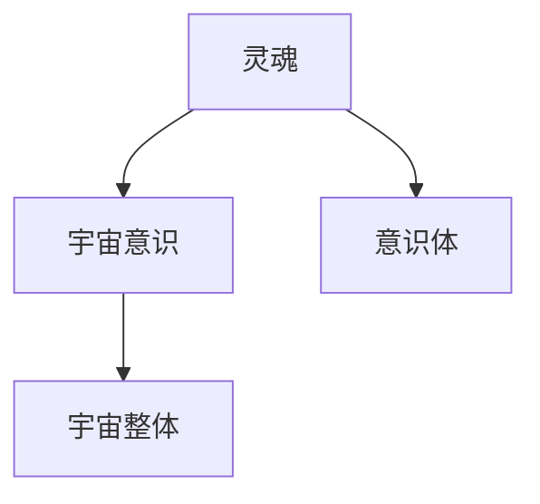
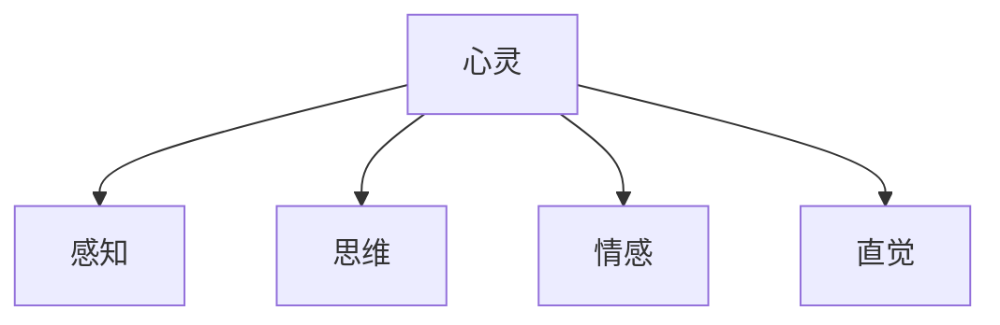
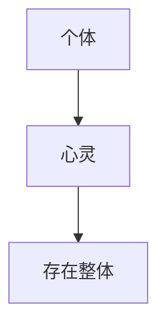
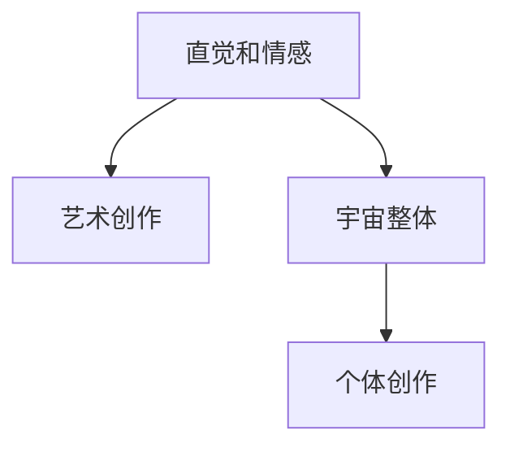
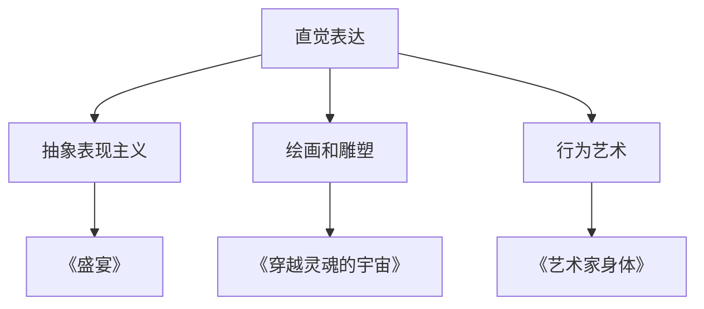
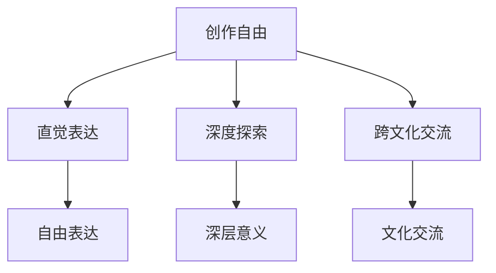
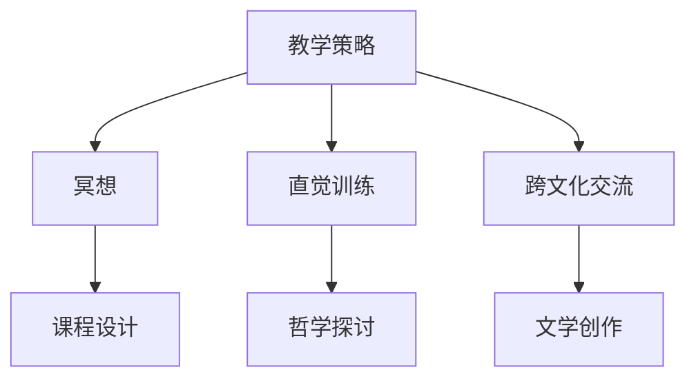
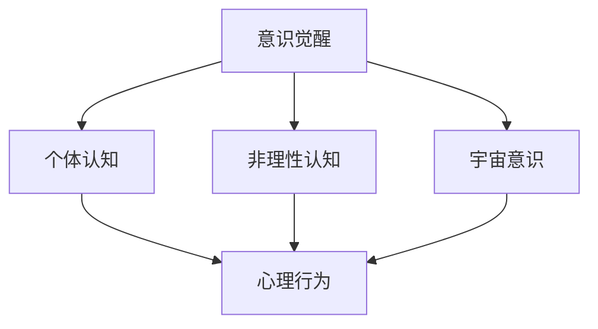
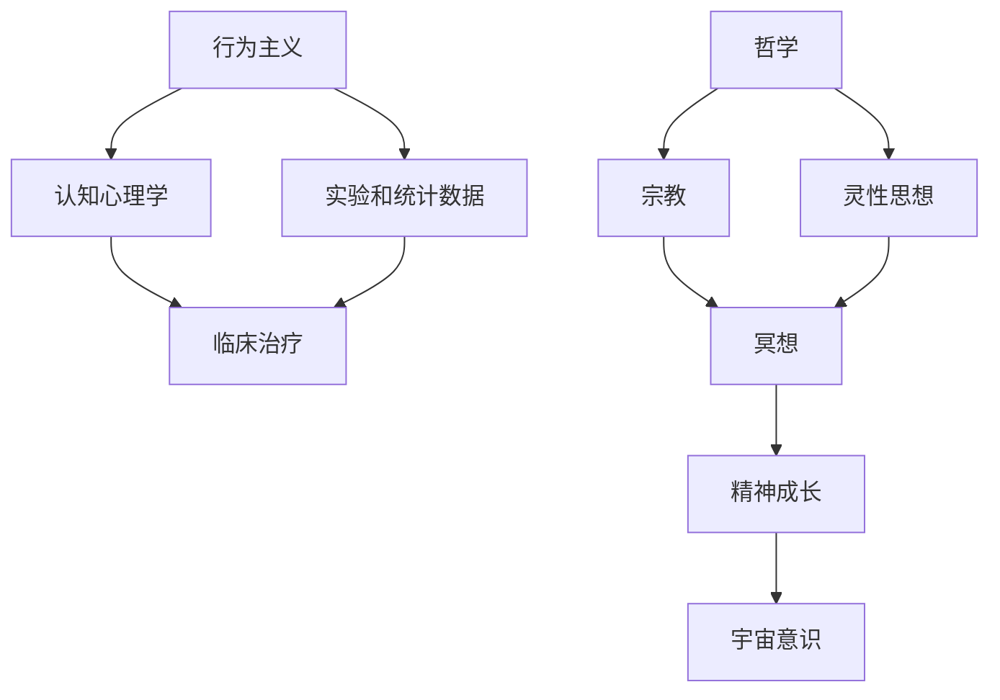
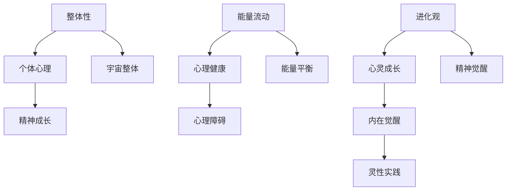

                 

### 引言与背景

### 新神秘主义的兴起

#### 1.1 新神秘主义的概念

新神秘主义（Neo-Mysticism）是近年来在学术界和公众领域逐渐兴起的一种哲学和文化思潮。它试图在科学和理性之外寻找更深层次的现实和存在的本质。新神秘主义不同于传统的神秘主义，它不是简单的宗教信仰，而是一种更为广义的哲学和世界观。

#### 1.1.1 新神秘主义的定义

新神秘主义可以定义为一种追求超越日常经验和理性理解的存在或现实状态。它关注的是那些无法用科学方法完全解释的现象，如人类的意识、宇宙的起源和终极真相。这种哲学思潮在当代以其开放性、多元性和创新性而受到广泛关注。

#### 1.1.2 新神秘主义的起源与发展

新神秘主义的起源可以追溯到20世纪末，特别是在西方文化中。它的兴起与对现代科学和理性主义的批判有关，同时也受到了东方哲学、心理学、灵性和跨文化研究的影响。当代的新神秘主义思想家如肯·威尔伯（Ken Wilber）和弗雷德里克·纽曼（Frederick Newmann）等人的工作，为这一思潮提供了丰富的理论资源和实践指南。

#### 1.1.3 新神秘主义与理性主义的对比

理性主义强调通过理性思考和科学方法来理解世界。而新神秘主义则认为理性有其局限性，无法触及所有存在的层次。新神秘主义认为，通过超越理性，人们可以体验到更深层次的现实，这种体验往往是通过内省、冥想、艺术创作等非理性的途径实现的。

#### 1.2 非理性在理性时代的地位

在理性时代，非理性往往被视为反科学、反理性的象征。然而，新神秘主义提醒我们，非理性并不总是负面现象，它在人类文化、艺术和心理学中扮演着重要角色。

#### 1.2.1 非理性主义的历史背景

非理性主义的历史可以追溯到古希腊时期，如柏拉图和亚里士多德对理性的不同理解。中世纪神秘主义和文艺复兴时期的人文主义也体现了非理性的重要性。在现代，非理性主义的思想在尼采、福柯等哲学家的著作中得到了进一步的发展。

#### 1.2.2 理性时代对非理性的挑战

随着科学技术的进步，理性主义在现代社会占据了主导地位。科学方法和理性思维被广泛应用于各个领域，包括医学、工程、经济学等。这种理性主义对非理性主义提出了挑战，要求所有观点和理论都必须经过严格的科学验证。

#### 1.2.3 非理性在现代社会中的影响

尽管面临挑战，非理性在现代社会中依然有着广泛的影响。心理学研究表明，非理性思维在人类决策和行为中起着重要作用。艺术和文学也常常通过非理性的手法来探索人类情感和存在的深层意义。

#### 1.3 新神秘主义在当代的意义

新神秘主义在当代有着重要的意义，它不仅为人们提供了一种理解和解释世界的全新视角，也为我们重新思考理性与非理性的关系提供了契机。

#### 1.3.1 新神秘主义对社会思潮的影响

新神秘主义对社会思潮产生了深远影响，它挑战了传统的理性主义观念，推动人们重新审视科学、宗教和哲学的关系。它鼓励人们超越理性的局限，通过非理性的途径去探索更深层次的存在。

#### 1.3.2 新神秘主义对个体心理的影响

新神秘主义强调个体内在的灵性体验，它鼓励人们通过冥想、内省等非理性方法来提升自我意识和心理健康。这种哲学思潮对当代人的心理和精神健康有着积极的影响。

#### 1.3.3 新神秘主义的未来展望

随着科技的进步和社会的变化，新神秘主义在未来可能会继续发展。它将为人们提供新的哲学思维方式和生活方式，帮助我们更好地理解人类存在的意义和宇宙的奥秘。

#### 1.4 本章小结

本章介绍了新神秘主义的概念、起源和发展，以及它在理性时代中的地位和意义。通过本章的内容，我们可以初步了解新神秘主义的核心思想，并为后续章节的深入探讨打下基础。

## 核心概念与联系

### 2.1 宇宙观与世界观

#### 2.1.1 新神秘主义的宇宙观

新神秘主义的宇宙观强调宇宙是一个有机整体，所有事物都相互联系、相互影响。这种观点不同于传统的机械宇宙观，它认为宇宙不仅仅是物质和能量的组合，还包含了意识、能量和信息等更为复杂的维度。

**核心概念原理：**

- **整体性：** 新神秘主义认为宇宙是一个整体，不存在孤立的现象。所有事物都存在于相互关联的网络中。
- **动态性：** 宇宙是一个不断变化的过程，没有固定的状态或本质。每个时刻都是宇宙演变的一个瞬间。

**概念属性特征对比表格：**

| 特征        | 新神秘主义宇宙观 | 传统机械宇宙观 |
| ----------- | ----------------- | --------------- |
| 整体性      | 强调整体关联性    | 独立事件组合    |
| 动态性      | 强调过程和变化    | 固定状态和结构  |
| 意识因素    | 包含意识维度      | 不包含意识因素  |

**ER实体关系图架构：**


#### 2.1.2 新神秘主义的世界观

新神秘主义的世界观不仅关注宇宙的宏观层面，还关注人类在宇宙中的角色和意义。它认为人类是宇宙意识的体现，每个人都有潜力与宇宙整体发生深层次的联系。

**核心概念原理：**

- **个体与整体的融合：** 新神秘主义强调个体与宇宙整体的和谐统一。个体不仅是宇宙的一部分，而且能够体验到宇宙的整体性。
- **内在与外在的统一：** 新神秘主义认为内在世界（心灵、情感）与外在世界（物质、社会）是相互关联、不可分割的。

**概念属性特征对比表格：**

| 特征            | 新神秘主义世界观 | 传统物质主义世界观 |
| --------------- | ----------------- | ------------------- |
| 整体性          | 强调个体与整体的融合 | 强调个体独立性      |
| 内在与外在的统一 | 强调内在与外在的统一 | 强调内外分离       |
| 意识与物质的关系 | 意识与物质相互影响 | 意识被视为次要因素  |

**ER实体关系图架构：**


#### 2.1.3 宇宙观与世界观的关系

新神秘主义的宇宙观和世界观相互交织，共同构成了其哲学体系。宇宙观提供了对宇宙本质的理解，而世界观则提供了对人类存在意义的解读。

**关系解释：**

- **宇宙观决定世界观：** 新神秘主义的宇宙观强调宇宙的整体性和动态性，这种观点影响了人类对自身在世界中的角色的理解。
- **世界观反作用于宇宙观：** 人类的世界观又会对宇宙观产生影响。例如，一种强调个体觉醒和自我超越的世界观可能会推动人们对宇宙整体性的认知。

### 总结

新神秘主义的宇宙观和世界观为我们提供了一种全新的视角来理解宇宙和人类的存在。通过整体性和动态性的观点，新神秘主义挑战了传统的科学和理性主义，为我们探索更深层次的现实提供了契机。

## 心灵与存在

### 2.2.1 新神秘主义的灵魂观

新神秘主义的灵魂观认为灵魂是宇宙意识的体现，它不仅仅存在于个体之中，还与宇宙整体紧密相连。这种观点强调了灵魂的非物质性、永恒性和超越性。

**核心概念原理：**

- **非物质性：** 新神秘主义认为灵魂超越了物质世界的限制，不是由物质构成的。
- **永恒性：** 灵魂被认为是永恒的，不受时间和空间的限制。
- **超越性：** 灵魂具有超越个体的能力，可以超越个人的欲望和痛苦，达到更深层次的意识状态。

**概念属性特征对比表格：**

| 特征          | 新神秘主义灵魂观 | 物质主义灵魂观 |
| ------------- | ----------------- | --------------- |
| 非物质性      | 强调非物质存在    | 物质构成       |
| 永恒性        | 认为灵魂永恒      | 有生有死       |
| 超越性        | 强调超越个体     | 个体局限       |

**ER实体关系图架构：**



### 2.2.2 新神秘主义的心灵观

新神秘主义的心灵观关注个体内心的体验和意识状态。它认为心灵不仅是感觉和思维的集合，还包括深层次的情感和精神体验。

**核心概念原理：**

- **多维性：** 新神秘主义认为心灵是一个多维的空间，包含感知、思维、情感和直觉等多个层面。
- **动态性：** 新神秘主义强调心灵的动态变化，认为心灵状态不是静态的，而是随着个体的成长和环境的变化而不断演化。
- **内在联系：** 新神秘主义认为心灵与身体、社会和环境之间存在内在的联系，这些因素共同影响着个体的心灵状态。

**概念属性特征对比表格：**

| 特征         | 新神秘主义心灵观 | 传统的单一心灵观 |
| ------------ | ----------------- | --------------- |
| 多维性       | 强调多维意识体验  | 视为单一思维实体 |
| 动态性       | 强调动态变化      | 视为静态状态     |
| 内在联系     | 强调内在联系      | 分离内外因素     |

**ER实体关系图架构：**



### 2.2.3 心灵与存在的联系

新神秘主义认为心灵与存在是相互联系、不可分割的。这种观点强调了个体存在与宇宙整体之间的深层关系。

**核心概念原理：**

- **内在体验：** 新神秘主义认为个体通过内在体验可以感知到宇宙的整体性，这种体验超越了理性的理解。
- **意识觉醒：** 新神秘主义强调通过意识觉醒，个体能够体验到与宇宙整体的和谐统一，达到更深层次的自我认知。

**概念属性特征对比表格：**

| 特征            | 新神秘主义心灵与存在观 | 传统二元论 |
| --------------- | ---------------------- | ---------- |
| 内在体验        | 强调内在的宇宙感知     | 外在经验为主 |
| 意识觉醒        | 强调意识觉醒与宇宙统一 | 意识独立存在 |
| 整体性          | 强调个体与整体的统一   | 分离个体与整体 |

**ER实体关系图架构：**



### 总结

新神秘主义的灵魂观和心灵观为我们提供了一种全新的视角来理解人类的存在。通过强调灵魂的非物质性、永恒性和超越性，以及心灵的多维性和动态性，新神秘主义挑战了传统的物质主义和单一心灵观，为我们探索更深层次的现实提供了契机。

## 非理性的力量

### 2.3.1 非理性的定义与特性

非理性是指那些无法用逻辑和理性解释的心理现象和行为。它包括直觉、情感、潜意识、梦境等。新神秘主义认为，非理性不仅仅是理性的对立面，它具有独特的力量和意义。

**核心概念原理：**

- **直觉性：** 非理性强调直觉的力量，认为直觉能够直接感知到事物的本质，而不需要经过逻辑推理。
- **情感性：** 非理性认为情感是人类体验和认知的重要组成部分，情感可以驱动个体的行为和决策。
- **潜意识：** 非理性强调潜意识的作用，认为潜意识包含了深层的心理需求和记忆，对个体的行为有重要影响。
- **创造性：** 非理性认为创造性是一种非理性的能力，通过非理性的方式可以激发创新的思维和艺术创作。

**概念属性特征对比表格：**

| 特征         | 非理性主义 | 理性主义 |
| ------------ | ----------- | -------- |
| 直觉性       | 强调直觉力  | 强调逻辑推理 |
| 情感性       | 强调情感作用 | 视情感为次要 |
| 潜意识       | 强调潜意识作用 | 重视显意识 |
| 创造性       | 强调创造性   | 强调系统性 |

**ER实体关系图架构：**


### 2.3.2 非理性在创造力中的作用

非理性在创造力中起着至关重要的作用。许多创新思维和艺术作品都是通过非理性的方式产生的。新神秘主义认为，非理性能够激发个体的创造力，帮助人们突破理性的局限。

**核心概念原理：**

- **直觉触发：** 非理性直觉可以帮助个体快速识别和抓住创意和灵感，这些直觉往往不能用逻辑解释。
- **情感驱动：** 情感在创造过程中起着重要的驱动作用，它可以激发个体的热情和动力，推动创造力的发挥。
- **潜意识融合：** 非理性潜意识包含了许多未被意识到的知识和经验，这些信息可以在创造过程中被潜意识地融合和利用。
- **跨越界限：** 非理性可以帮助个体跨越传统的思维边界，探索新的领域和可能性。

**概念属性特征对比表格：**

| 特征             | 非理性创造力 | 理性创造力 |
| ---------------- | ------------ | ---------- |
| 直觉触发         | 强调直觉作用 | 强调逻辑分析 |
| 情感驱动         | 强调情感动力 | 强调理性决策 |
| 潜意识融合       | 强调潜意识利用 | 重视显意识思维 |
| 跨越界限         | 强调突破传统 | 强调系统稳定性 |

**ER实体关系图架构：**


### 2.3.3 非理性与情感的关系

非理性与情感之间存在密切的关系。情感不仅是非理性的表现形式，也是非理性发挥作用的重要媒介。

**核心概念原理：**

- **情感表现：** 非理性往往通过情感来表达，情感可以直观地传达非理性直觉和潜意识的信息。
- **情感调节：** 非理性可以调节情感状态，帮助个体更好地处理情感冲突和心理压力。
- **情感融合：** 非理性情感可以与理性思维相互融合，形成更全面、更复杂的认知结构。

**概念属性特征对比表格：**

| 特征             | 非理性情感观 | 理性情感观 |
| ---------------- | ------------ | ---------- |
| 情感表现         | 强调非理性表达 | 强调理性控制 |
| 情感调节         | 强调情感调节作用 | 强调情感抑制 |
| 情感融合         | 强调情感与理性的融合 | 强调情感分离 |

**ER实体关系图架构：**


### 总结

非理性在创造力中具有独特的作用，它通过直觉、情感和潜意识激发人类的创造力，推动艺术和科学的发展。新神秘主义强调非理性的力量，为我们提供了一个全新的视角来理解人类思维和行为的复杂性。

## 新神秘主义的伦理观

### 2.4.1 新神秘主义的道德观念

新神秘主义的伦理观强调道德的内在性和超越性。它认为道德不仅仅是一种社会规范，更是个体内在体验和宇宙整体性的体现。新神秘主义伦理观的核心理念包括：

**核心概念原理：**

- **内在性：** 新神秘主义认为道德存在于个体的内在意识中，道德行为是个体内在体验的结果，而非外在规则的强制执行。
- **超越性：** 新神秘主义认为道德超越了个人利益和功利主义，关注个体与宇宙整体的和谐统一。
- **整体性：** 新神秘主义强调道德的整体性，认为个体道德行为不仅影响自身，还影响整个宇宙。

**概念属性特征对比表格：**

| 特征         | 新神秘主义伦理观 | 传统伦理观 |
| ------------ | ----------------- | ---------- |
| 内在性       | 强调内在体验      | 强调外在规范 |
| 超越性       | 强调超越个人利益 | 强调个人责任 |
| 整体性       | 强调整体影响      | 强调个体行为 |

**ER实体关系图架构：**


### 2.4.2 新神秘主义的伦理原则

新神秘主义的伦理原则提供了一种超越个人和功利主义的道德指导。这些原则强调个体与宇宙整体的和谐统一，具体包括：

1. **和谐原则：** 强调个体与宇宙、个体与社会的和谐关系，追求整体性的福祉。
2. **真实原则：** 强调个体真诚面对内心和宇宙的真实状态，真实地表达自我和情感。
3. **创造性原则：** 强调个体的创造性力量，鼓励通过非理性的方式探索新的可能性和意义。
4. **服务原则：** 强调个体为宇宙整体服务，通过无私的行为实现个体与整体的和谐。

**概念属性特征对比表格：**

| 原则         | 新神秘主义伦理原则 | 传统伦理原则 |
| ------------ | ------------------- | ------------ |
| 和谐原则     | 强调和谐统一       | 强调个体责任 |
| 真实原则     | 强调真实表达       | 强调诚信行为 |
| 创造性原则   | 强调创造性力量     | 强调传统规范 |
| 服务原则     | 强调无私服务       | 强调功利主义 |

**ER实体关系图架构：**


### 2.4.3 伦理观在现代社会中的应用

新神秘主义的伦理观在现代社会中具有广泛的应用，特别是在处理复杂的社会问题和伦理困境时。以下是一些具体的应用场景：

1. **环境保护：** 新神秘主义强调宇宙的整体性，提倡环保理念，鼓励个体和社会采取行动保护地球生态。
2. **社会公正：** 新神秘主义强调和谐与整体性，倡导公平正义，推动社会改革和消除不平等现象。
3. **心理健康：** 新神秘主义伦理观强调内在体验和情感调节，有助于提升个体心理健康，促进社会和谐。
4. **科技创新：** 新神秘主义鼓励通过非理性的方式探索创新，推动科技发展与社会进步。

### 总结

新神秘主义的伦理观提供了一种超越个人和功利主义的道德指导，强调内在体验、整体性和创造性。这些伦理原则和理念在现代社会中具有广泛的应用价值，为我们理解和解决复杂的社会问题提供了新的视角和思考方式。

## 新神秘主义的应用与实践

### 3.1 新神秘主义在艺术与文学中的表现

#### 3.1.1 艺术与神秘主义的联系

艺术与神秘主义之间存在着深刻的联系，特别是在探索人类情感、意识和存在本质的领域。神秘主义为艺术提供了丰富的灵感和创作方法，使艺术作品能够超越日常经验的限制，触及更深层次的现实。

**核心概念原理：**

- **超越理性：** 神秘主义强调超越理性的直觉和情感体验，这为艺术创作提供了丰富的素材和表现手段。
- **整体性：** 神秘主义强调宇宙的整体性和个体与整体的联系，这影响了艺术作品的结构和主题。
- **象征性：** 神秘主义常用象征性的手法来表达深层的哲学和宗教观念，这种象征性在艺术作品中得到了广泛运用。

**概念属性特征对比表格：**

| 特征           | 神秘主义艺术 | 传统艺术 |
| -------------- | ------------ | -------- |
| 超越理性       | 强调直觉和情感 | 强调逻辑和理性 |
| 整体性         | 强调宇宙的整体性 | 强调个体独立性 |
| 象征性         | 常用象征手法 | 少用象征手法 |

**ER实体关系图架构：**



#### 3.1.2 新神秘主义艺术的特点

新神秘主义艺术具有以下特点：

- **非理性手法：** 新神秘主义艺术常用非理性的手法，如梦境、幻觉和抽象表现，以打破传统的形式和主题限制。
- **象征性主题：** 新神秘主义艺术常探讨宇宙、灵魂、存在和死亡等深层的哲学和宗教主题，通过象征性的手法来表达。
- **跨文化融合：** 新神秘主义艺术跨越不同的文化和传统，融合了多种艺术形式和风格，体现了多元性和开放性。

**概念属性特征对比表格：**

| 特征               | 新神秘主义艺术 | 传统艺术 |
| ------------------ | --------------- | -------- |
| 非理性手法         | 强调直觉和情感   | 强调逻辑和理性 |
| 象征性主题         | 强调哲学和宗教主题 | 以现实生活为主题 |
| 跨文化融合         | 融合多种文化传统 | 少有跨文化元素 |

**ER实体关系图架构：**


#### 3.1.3 著名新神秘主义艺术家及其作品

以下是一些著名的新神秘主义艺术家及其代表作品：

- **杰克逊·波洛克（Jackson Pollock）**：以其独特的抽象表现主义绘画风格著称，作品《盛宴》展现了他对宇宙和自然的直觉体验。
- **朱利安·奥珀（Julian Opper）**：通过绘画和雕塑探索人类意识和宇宙的联系，其作品《穿越灵魂的宇宙》融合了东方哲学和神秘主义元素。
- **玛丽娜·阿布拉莫维奇（Marina Abramović）**：以行为艺术著称，她的作品《艺术家身体》挑战了传统的艺术形式，探索了人类意识和存在的本质。

**核心概念原理：**

- **直觉表达：** 这些艺术家通过直觉和非理性的方式表达对宇宙和存在的理解。
- **多元融合：** 他们融合了不同的文化和艺术传统，创造出独特的艺术形式。

**概念属性特征对比表格：**

| 艺术家         | 作品名称       | 表现手法             | 核心概念 |
| -------------- | -------------- | ------------------- | -------- |
| 杰克逊·波洛克  | 《盛宴》       | 抽象表现主义         | 直觉体验 |
| 朱利安·奥珀    | 《穿越灵魂的宇宙》 | 绘画和雕塑           | 灵魂探索 |
| 玛丽娜·阿布拉莫维奇 | 《艺术家身体》 | 行为艺术           | 意识存在 |

**ER实体关系图架构：**



### 3.1.4 新神秘主义对艺术与文学的启示

新神秘主义对艺术和文学提供了深刻的启示，特别是在以下方面：

- **创作自由：** 新神秘主义鼓励艺术家摆脱传统形式和主题的束缚，自由表达内心体验和直觉。
- **深度探索：** 新神秘主义促使艺术家和作家探索人类存在的深层意义，创作更具哲学性和思想性的作品。
- **跨文化交流：** 新神秘主义倡导跨文化的交流和融合，促进不同文化和艺术形式之间的对话和互鉴。

**概念属性特征对比表格：**

| 启示         | 新神秘主义艺术与文学 | 传统艺术与文学 |
| ------------ | ------------------- | -------------- |
| 创作自由     | 鼓励自由表达        | 强调规则和形式 |
| 深度探索     | 探索深层意义        | 关注现实主题   |
| 跨文化交流   | 促进文化交流        | 少有跨文化元素 |

**ER实体关系图架构：**



### 3.1.5 新神秘主义在艺术与文学教育中的应用

新神秘主义在艺术与文学教育中具有广泛的应用，可以激发学生的创造力和批判性思维，具体包括：

- **教学策略：** 利用新神秘主义的理念设计教学活动，如冥想、直觉训练和跨文化交流，以帮助学生深入理解和体验艺术和文学。
- **课程设计：** 将新神秘主义的核心概念融入课程中，探讨艺术和文学中的哲学和宗教主题，培养学生的整体思维和创造性思维。
- **教育评价：** 以新神秘主义的理念评价学生的创作和作品，鼓励他们表达自己的直觉和情感，超越传统的评价标准。

**概念属性特征对比表格：**

| 教学应用       | 新神秘主义艺术与文学教育 | 传统艺术与文学教育 |
| -------------- | ----------------------- | ------------------ |
| 教学策略       | 冥想、直觉训练          | 传统的讲授和阅读    |
| 课程设计       | 探讨哲学和宗教主题      | 关注技巧和技巧训练  |
| 教育评价       | 鼓励直觉和情感表达      | 强调技巧和标准评价  |

**ER实体关系图架构：**



### 3.1.6 新神秘主义对艺术与文学未来发展的启示

新神秘主义对艺术与文学的未来发展提供了重要的启示，特别是在以下方面：

- **跨学科融合：** 新神秘主义鼓励不同学科和艺术形式之间的融合，推动艺术创作和理论的发展。
- **创新表达方式：** 新神秘主义提倡通过非理性的方式探索新的表达形式，为艺术创作提供了无限的创意空间。
- **文化多样性：** 新神秘主义倡导跨文化的交流和理解，促进了全球艺术和文学的发展。

**概念属性特征对比表格：**

| 启示          | 新神秘主义艺术与文学 | 传统艺术与文学 |
| -------------- | ------------------- | -------------- |
| 跨学科融合     | 鼓励跨学科交流       | 独立学科发展   |
| 创新表达方式   | 探索非理性表达       | 传统的理性表达 |
| 文化多样性     | 强调多元文化融合     | 强调单一文化传承 |

**ER实体关系图架构：**


### 3.1.7 总结

新神秘主义在艺术与文学中的应用为我们提供了新的视角和创作方法，它通过超越理性的直觉和情感体验，探索人类存在的深层意义。新神秘主义不仅丰富了艺术和文学的内涵，也为未来的艺术发展提供了宝贵的启示。

## 新神秘主义在心理学中的应用

### 4.1.1 新神秘主义心理学的基本概念

新神秘主义心理学是一种融合了心理学、哲学和神秘主义思想的学科。它试图通过超越理性的方式来理解人类心理和行为。新神秘主义心理学的基本概念包括：

**核心概念原理：**

- **意识觉醒：** 新神秘主义心理学强调意识觉醒的重要性，认为通过内省和冥想可以提升个体的意识水平，达到更深层次的自我认知。
- **非理性认知：** 新神秘主义心理学认为理性认知有其局限性，非理性认知如直觉和潜意识对个体的心理和行为有着重要影响。
- **宇宙意识：** 新神秘主义心理学认为个体与宇宙存在内在的联系，个体的意识体验可以超越个人的界限，达到宇宙的整体性认知。

**概念属性特征对比表格：**

| 特征           | 新神秘主义心理学 | 传统心理学 |
| -------------- | ----------------- | ---------- |
| 意识觉醒       | 强调提升意识水平  | 关注理性认知 |
| 非理性认知     | 重视非理性认知    | 主导理性分析 |
| 宇宙意识       | 认为个体与宇宙相关 | 专注于个体心理 |

**ER实体关系图架构：**



### 4.1.2 新神秘主义心理学与传统心理学的区别

新神秘主义心理学与传统心理学在理论基础、方法和应用上存在显著区别：

**核心概念原理：**

- **理论基础：** 传统心理学以行为主义和认知心理学为基础，强调可观察的行为和可量化的认知过程。而新神秘主义心理学则结合了哲学、宗教和灵性思想，强调内在体验、直觉和潜意识。
- **研究方法：** 传统心理学采用实验和统计数据的方法，而新神秘主义心理学则更多依赖于内省、冥想和主观体验。
- **应用领域：** 传统心理学主要应用于临床治疗和心理健康咨询，而新神秘主义心理学则关注个体的精神成长和宇宙意识。

**概念属性特征对比表格：**

| 特征         | 传统心理学 | 新神秘主义心理学 |
| ------------ | ----------- | ----------------- |
| 理论基础     | 行为主义和认知心理学 | 哲学、宗教和灵性思想 |
| 研究方法     | 实验和统计数据 | 内省、冥想和主观体验 |
| 应用领域     | 临床治疗和心理健康咨询 | 精神成长和宇宙意识 |

**ER实体关系图架构：**



### 4.1.3 新神秘主义心理学的主要理论

新神秘主义心理学主要包含以下几种理论：

1. **整体心理学理论：** 肯·威尔伯（Ken Wilber）的整体心理学理论认为，个体心理是宇宙整体的一部分，通过整合不同的心理层面（如自我、情感、意识等）可以实现精神成长。
2. **能量心理学理论：** 弗雷德里克·纽曼（Frederick Newmann）的能量心理学理论强调能量在心理活动中的核心作用，认为能量流动和平衡是心理健康的关键。
3. **心灵进化理论：** 罗伯特·施瓦茨（Robert Schwartz）的心灵进化理论认为，个体的心灵成长是一个不断进化的过程，通过自我觉察和灵性实践可以实现更高的意识层次。

**核心概念原理：**

- **整体性：** 新神秘主义心理学强调心理的整体性，认为个体的心理体验不仅受个人因素影响，还受宇宙整体的影响。
- **能量流动：** 能量心理学理论关注心理过程中的能量流动，认为心理障碍和健康状态都与能量流动的平衡有关。
- **进化观：** 心灵进化理论认为个体的心灵成长是一个不断进化的过程，通过内在的觉醒和灵性实践可以实现精神提升。

**概念属性特征对比表格：**

| 理论         | 核心概念         | 主要观点 |
| ------------ | ---------------- | -------- |
| 整体心理学   | 整体性           | 个体心理是宇宙整体的一部分 |
| 能量心理学   | 能量流动         | 能量流动和平衡是心理健康的关键 |
| 心灵进化理论 | 进化观           | 心灵成长是一个不断进化的过程 |

**ER实体关系图架构：**



### 4.1.4 新神秘主义心理学的研究方法

新神秘主义心理学的研究方法与传统心理学有很大不同，它更多地依赖于内省、冥想和主观体验：

1. **内省：** 内省是一种深入自我观察和反思的方法，通过内省可以了解个体的内在体验和心理过程。
2. **冥想：** 冥想是一种通过集中注意力、放松身体和心灵来实现意识觉醒的方法。冥想可以帮助个体超越日常的思维模式，达到更深层次的认知。
3. **主观体验：** 新神秘主义心理学强调主观体验的重要性，认为个体的主观体验可以提供深刻的洞察和理解。

**核心概念原理：**

- **个体体验：** 新神秘主义心理学认为个体的主观体验是理解和解释心理现象的关键。
- **直觉和灵感：** 通过冥想和内省，个体可以获得直觉和灵感，这些直觉和灵感可以指导心理研究和治疗。

**概念属性特征对比表格：**

| 研究方法       | 新神秘主义心理学 | 传统心理学 |
| -------------- | ----------------- | ---------- |
| 内省           | 强调自我观察和反思 | 依赖实验和统计数据 |
| 冥想           | 通过冥想实现意识觉醒 | 不常用冥想方法 |
| 主观体验       | 认为主观体验有洞察力 | 主观体验被视为次要 |

**ER实体关系图架构：**


### 总结

新神秘主义心理学通过超越理性的视角，为心理学研究提供了新的方法和理论。它强调个体体验、宇宙整体性和能量流动，为理解人类心理和行为提供了新的视角。新神秘主义心理学的研究方法，如内省、冥想和主观体验，也为心理学实践带来了新的启示。

## 新神秘主义心理学在临床中的应用

### 4.2.1 新神秘主义心理治疗

新神秘主义心理治疗是一种基于超越理性体验和心理觉醒的方法，旨在帮助个体解决心理问题、提升心理健康。这种治疗方法强调个体与宇宙整体之间的联系，通过内省、冥想和非理性认知来促进心理康复。

**核心概念原理：**

- **意识觉醒：** 新神秘主义心理治疗认为通过意识觉醒，个体可以超越日常的思维模式，认识到更深层次的自我和宇宙的联系。
- **能量流动：** 这种治疗方法强调能量在心理过程中的核心作用，认为通过调节能量流动可以达到心理健康。
- **整体性治疗：** 新神秘主义心理治疗关注个体心理的整体性，认为心理问题不仅涉及个人层面，还与宇宙整体密切相关。

**概念属性特征对比表格：**

| 特征         | 新神秘主义心理治疗 | 传统心理治疗 |
| ------------ | ------------------- | ------------ |
| 意识觉醒     | 强调提升意识水平    | 重视理性认知 |
| 能量流动     | 调节能量以促进康复  | 不强调能量概念 |
| 整体性治疗   | 关注整体心理健康    | 主要针对个体心理问题 |

**ER实体关系图架构：**

```mermaid
graph TB
A[意识觉醒] --> B[个体认知]
A --> C[能量流动]
A --> D[宇宙整体]
B --> E[心理康复]
C --> E
D --> E
```

### 4.2.2 新神秘主义心理学在心理辅导中的应用

新神秘主义心理学在心理辅导中的应用同样具有重要意义。通过内省、冥想和非理性认知，个体可以更好地理解自己的情感和行为，提高自我意识，从而在心理辅导过程中取得更好的效果。

**核心概念原理：**

- **内省：** 新神秘主义心理辅导强调内省的重要性，通过自我反思帮助个体深入了解自己的内心世界。
- **冥想：** 冥想作为一种心理辅导工具，可以帮助个体放松身心，提高意识觉醒水平，从而改善心理状态。
- **非理性认知：** 新神秘主义心理辅导认为非理性认知对个体的心理健康有着重要影响，通过理解和接受非理性体验，个体可以更好地应对心理问题。

**概念属性特征对比表格：**

| 特征         | 新神秘主义心理辅导 | 传统心理辅导 |
| ------------ | ------------------- | ------------ |
| 内省         | 强调自我反思       | 重视问题解决 |
| 冥想         | 作为心理辅导工具    | 不常用冥想方法 |
| 非理性认知   | 接受非理性体验     | 主要关注理性认知 |

**ER实体关系图架构：**

```mermaid
graph TB
A[内省] --> B[自我理解]
A --> C[冥想]
A --> D[非理性认知]
B --> E[心理辅导]
C --> E
D --> E
```

### 4.2.3 新神秘主义心理学在心理疾病治疗中的作用

新神秘主义心理学在心理疾病治疗中的应用逐渐受到关注，其独特的方法和理论为治疗提供了一种新的视角：

- **压力管理：** 新神秘主义心理治疗通过冥想和内省帮助个体降低压力水平，调节情绪，从而改善心理健康。
- **情感调节：** 通过理解和接受情感的非理性部分，个体可以更好地管理情绪，减少心理疾病的发作频率。
- **自我觉醒：** 通过意识觉醒，个体可以认识到自己的心理模式，从而改变不良的行为和思维习惯，提高生活质量。

**核心概念原理：**

- **整体性治疗：** 新神秘主义心理学认为心理疾病不仅仅是心理问题，还与生理、社会和宇宙整体密切相关，因此整体性治疗尤为重要。
- **能量平衡：** 新神秘主义心理学强调能量流动对心理疾病的影响，通过调节能量可以达到心理平衡。

**概念属性特征对比表格：**

| 特征         | 新神秘主义心理疾病治疗 | 传统心理疾病治疗 |
| ------------ | ---------------------- | --------------- |
| 整体性治疗   | 关注整体心理健康       | 主要关注心理症状 |
| 能量平衡     | 调节能量流动          | 不强调能量概念 |
| 情感接受     | 接受非理性情感        | 关注理性认知 |

**ER实体关系图架构：**

```mermaid
graph TB
A[整体性治疗] --> B[心理健康]
A --> C[能量平衡]
A --> D[情感接受]
B --> E[心理康复]
C --> E
D --> E
```

### 4.2.4 新神秘主义心理学在教育领域的应用

新神秘主义心理学在教育领域的应用逐渐受到重视，其独特的理念和方法对教育实践产生了积极影响：

- **自我意识培养：** 新神秘主义心理学强调个体意识觉醒的重要性，通过内省和冥想，学生可以更好地认识自己，提高自我意识。
- **情感教育：** 新神秘主义心理学认为情感在个体成长中起着关键作用，通过情感教育和引导，学生可以更好地管理自己的情绪，提高心理健康。
- **整体性教育：** 新神秘主义心理学提倡整体性教育，强调个体、社会和宇宙的整体联系，通过跨学科教育和综合学习，提高学生的综合素质。

**核心概念原理：**

- **个体发展：** 新神秘主义心理学关注个体全面发展，认为个体心理、情感和身体是相互关联、不可分割的。
- **整体性教学：** 整体性教学强调不同学科和领域的整合，通过跨学科项目和综合学习，培养学生的创新思维和综合能力。

**概念属性特征对比表格：**

| 特征         | 新神秘主义教育 | 传统教育 |
| ------------ | --------------- | -------- |
| 自我意识培养 | 强调内省和自我认知 | 重视学科知识 |
| 情感教育     | 关注情感发展和情感管理 | 缺乏情感教育 |
| 整体性教育   | 跨学科整合和综合学习 | 独立学科学习 |

**ER实体关系图架构：**

```mermaid
graph TB
A[自我意识培养] --> B[心理发展]
A --> C[情感教育]
A --> D[整体性教学]
B --> E[个体成长]
C --> E
D --> E
```

### 总结

新神秘主义心理学在临床治疗、心理辅导、心理疾病治疗和教育领域都有广泛的应用。它通过超越理性的视角，强调个体与宇宙的整体联系，为解决心理问题、提升心理健康提供了新的方法和理论。新神秘主义心理学的理念和方法为现代心理学提供了丰富的启示，有助于我们更全面地理解和应对心理现象。

### 5.1 新神秘主义与社会思潮

#### 5.1.1 新神秘主义对社会思潮的影响

新神秘主义对社会思潮产生了深远的影响，尤其是在现代社会中。它挑战了传统的理性主义和物质主义，提出了关于人类存在和宇宙本质的全新视角。

**核心概念原理：**

- **超越理性：** 新神秘主义认为理性有其局限性，无法触及所有存在的层次。它强调通过内省、冥想等非理性方式来探索更深层次的现实。
- **宇宙整体性：** 新神秘主义强调宇宙的整体性，认为个体与宇宙整体紧密相连。这种观点鼓励人们从更宏观的视角来看待社会现象和个人行为。

**概念属性特征对比表格：**

| 特征           | 新神秘主义思潮 | 传统理性主义思潮 |
| -------------- | --------------- | --------------- |
| 超越理性       | 强调非理性体验  | 强调理性思维     |
| 宇宙整体性     | 强调个体与整体联系 | 强调个体独立性   |

**ER实体关系图架构：**

```mermaid
graph TB
A[超越理性] --> B[宇宙整体性]
A --> C[个体存在]
B --> D[社会思潮]
C --> D
```

#### 5.1.2 新神秘主义在社会运动中的体现

新神秘主义在社会运动中得到了广泛体现，特别是在追求社会变革和人性解放的运动中。它为这些运动提供了哲学基础和理论支持。

**核心概念原理：**

- **内在变革：** 新神秘主义强调内在变革的重要性，认为通过改变个体的意识和心态可以实现社会的变革。
- **整体性行动：** 新神秘主义认为社会运动应该是整体性的，不仅仅是追求具体的社会目标，还要关注人类意识和宇宙的整体性。

**概念属性特征对比表格：**

| 特征         | 新神秘主义社会运动 | 传统社会运动 |
| ------------ | ------------------- | ------------ |
| 内在变革     | 强调内在意识和心态 | 侧重外在行动和目标 |
| 整体性行动   | 关注整体性和长远影响 | 关注具体目标和短期效果 |

**ER实体关系图架构：**

```mermaid
graph TB
A[内在变革] --> B[社会运动]
A --> C[宇宙整体性]
B --> D[社会变革]
C --> D
```

#### 5.1.3 新神秘主义对社会组织形式的影响

新神秘主义对社会组织形式产生了深刻影响，它挑战了传统的等级制度和管理模式，提出了更为平等和和谐的社会组织形式。

**核心概念原理：**

- **平等参与：** 新神秘主义强调个体的平等参与，认为每个人都应该在社会组织中发挥自己的作用，实现自我价值。
- **和谐共存：** 新神秘主义主张通过和谐共存来实现社会的稳定和进步，认为个体与群体、群体与宇宙之间应该保持和谐的关系。

**概念属性特征对比表格：**

| 特征         | 新神秘主义社会组织 | 传统社会组织 |
| ------------ | ------------------- | ------------ |
| 平等参与     | 强调个体平等参与    | 强调等级制度   |
| 和谐共存     | 强调和谐共存        | 强调竞争和冲突 |

**ER实体关系图架构：**

```mermaid
graph TB
A[平等参与] --> B[社会组织]
A --> C[个体价值]
B --> D[社会稳定]
C --> D

E[和谐共存] --> F[社会进步]
E --> G[个体和谐]
F --> G
```

### 5.2 新神秘主义在政治领域的应用

#### 5.2.1 新神秘主义政治理论

新神秘主义政治理论试图将神秘主义的思想应用于政治领域，提出一种超越传统政治理念和制度的新视角。

**核心概念原理：**

- **宇宙秩序：** 新神秘主义政治理论认为宇宙存在一种秩序和智慧，政治活动应该遵循这种宇宙秩序，实现社会的和谐与稳定。
- **内在变革：** 新神秘主义政治理论强调政治变革的内在性，认为政治的真正变革来自于个体意识和心灵的觉醒。

**概念属性特征对比表格：**

| 特征           | 新神秘主义政治理论 | 传统政治理论 |
| -------------- | ------------------- | ------------ |
| 宇宙秩序       | 强调宇宙智慧和秩序  | 关注现实政治和制度 |
| 内在变革       | 强调内在意识和心灵  | 关注政策和实践 |

**ER实体关系图架构：**

```mermaid
graph TB
A[宇宙秩序] --> B[政治活动]
A --> C[内在变革]
B --> D[社会和谐]
C --> D
```

#### 5.2.2 新神秘主义政治实践

新神秘主义政治实践试图将神秘主义理念应用于政治行动和治理中，以实现社会的和谐与进步。

**核心概念原理：**

- **灵性领导：** 新神秘主义政治实践强调灵性领导的重要性，认为领导者应该具备深刻的内在意识和心灵觉醒，以引导社会走向更高的层次。
- **整体性治理：** 新神秘主义政治实践主张通过整体性的治理方式，关注个体、社会和宇宙的整体性，实现社会的可持续发展。

**概念属性特征对比表格：**

| 特征         | 新神秘主义政治实践 | 传统政治实践 |
| ------------ | ------------------- | ------------ |
| 灵性领导     | 强调领导者内在意识  | 关注权力和策略 |
| 整体性治理   | 强调整体性和和谐    | 关注具体政策 |

**ER实体关系图架构：**

```mermaid
graph TB
A[灵性领导] --> B[社会引导]
A --> C[整体性治理]
B --> D[社会进步]
C --> D
```

#### 5.2.3 新神秘主义对政治发展的启示

新神秘主义对政治发展提供了重要的启示，特别是在如何实现社会和谐与进步方面。

**核心概念原理：**

- **超越理性：** 新神秘主义提醒我们，理性有其局限性，政治发展需要超越理性的视角，关注更深层次的人类意识和心灵觉醒。
- **整体性思考：** 新神秘主义强调整体性思考，认为政治发展应该关注个体、社会和宇宙的整体性，以实现可持续的社会进步。

**概念属性特征对比表格：**

| 启示           | 新神秘主义政治启示 | 传统政治启示 |
| -------------- | ------------------- | ------------ |
| 超越理性       | 关注非理性体验     | 强调理性分析和政策制定 |
| 整体性思考     | 强调整体性和和谐    | 关注具体政策和利益 |

**ER实体关系图架构：**

```mermaid
graph TB
A[超越理性] --> B[政治发展]
A --> C[整体性思考]
B --> D[社会进步]
C --> D
```

### 总结

新神秘主义在政治领域提供了新的视角和理论，强调超越理性和整体性思考。它为政治实践和治理提供了重要的启示，有助于实现社会的和谐与进步。新神秘主义政治理论和实践为现代社会提供了宝贵的参考，挑战了传统的政治理念和方法。

### 5.3 新神秘主义在文化产业中的运用

#### 5.3.1 新神秘主义与文化创意产业

新神秘主义在文化创意产业中得到了广泛运用，尤其是在艺术、文学、音乐和电影等领域。它通过引入超越理性和整体性的视角，为文化创作提供了新的灵感和表达方式。

**核心概念原理：**

- **非理性创作：** 新神秘主义鼓励艺术家和创作者通过直觉、情感和非理性的方式来进行创作，这种非理性创作往往能够产生独特的艺术效果。
- **整体性表达：** 新神秘主义强调作品的整体性和统一性，认为艺术作品不仅仅是视觉或听觉的呈现，更是一种对宇宙整体性和人类存在的表达。

**概念属性特征对比表格：**

| 特征           | 新神秘主义文化创意产业 | 传统文化创意产业 |
| -------------- | ---------------------- | ---------------- |
| 非理性创作     | 强调直觉和情感表达     | 依赖理性思维和技巧 |
| 整体性表达     | 关注作品的整体性和统一性 | 注重个体创作和独立表达 |

**ER实体关系图架构：**

```mermaid
graph TB
A[非理性创作] --> B[艺术创作]
A --> C[情感表达]
B --> D[整体性表达]
C --> D
```

#### 5.3.2 新神秘主义在媒体与传播中的影响

新神秘主义在媒体与传播领域也产生了显著影响，特别是在新闻媒体、社交媒体和数字内容创作等方面。它通过引入神秘主义元素和超越理性的叙事方式，改变了媒体内容的创作和传播方式。

**核心概念原理：**

- **神秘元素引入：** 新神秘主义在媒体内容中引入神秘元素，如超自然现象、灵性体验和宇宙奥秘，以吸引观众的注意力。
- **非理性叙事：** 新神秘主义强调通过非理性的叙事方式，如隐喻、象征和直觉表达，来传达深层的哲学和情感内涵。

**概念属性特征对比表格：**

| 特征           | 新神秘主义媒体传播 | 传统媒体传播 |
| -------------- | ------------------- | ------------ |
| 神秘元素引入   | 引入神秘元素以吸引观众 | 以事实和数据为基础 |
| 非理性叙事     | 通过直觉和情感叙事   | 以逻辑和理性叙事 |

**ER实体关系图架构：**

```mermaid
graph TB
A[神秘元素引入] --> B[内容创作]
A --> C[非理性叙事]
B --> D[媒体传播]
C --> D
```

#### 5.3.3 新神秘主义对文化产业发展的推动作用

新神秘主义对文化产业的发展具有积极的推动作用，它不仅丰富了文化内容的形式和主题，还推动了文化产业的创新和发展。

**核心概念原理：**

- **创意激发：** 新神秘主义鼓励创作者通过非理性的方式探索新的创意和表达方式，从而激发文化产业的创新。
- **市场吸引：** 新神秘主义作品因其独特的视角和表达方式，能够吸引广泛的观众群体，扩大文化市场。
- **文化融合：** 新神秘主义促进了不同文化和艺术形式的融合，丰富了文化产业的多样性和活力。

**概念属性特征对比表格：**

| 特征           | 新神秘主义对文化产业的影响 | 传统文化产业影响 |
| -------------- | ------------------------- | ---------------- |
| 创意激发       | 鼓励非理性创作和探索       | 依赖传统创作方法 |
| 市场吸引       | 吸引多元观众群体           | 注重特定市场群体 |
| 文化融合       | 促进文化多样性和融合       | 保持文化独立性 |

**ER实体关系图架构：**

```mermaid
graph TB
A[创意激发] --> B[文化创新]
A --> C[市场吸引]
A --> D[文化融合]
B --> E[产业发展]
C --> E
D --> E
```

### 总结

新神秘主义在文化创意产业和媒体传播中的应用，丰富了文化内容的形式和主题，推动了文化产业的创新和发展。它通过引入非理性的创作方式和神秘的元素，为文化产业注入了新的活力和视角，促进了文化的多样性和融合。

## 新神秘主义在科技领域的应用

### 6.1 新神秘主义与科技发展的关系

新神秘主义与科技发展之间存在着复杂的相互关系。在科技领域，新神秘主义不仅提供了一种哲学视角，还为技术创新和科学探索提供了灵感。以下将从几个方面探讨新神秘主义与科技发展的关系。

#### 6.1.1 新神秘主义对科技发展的启示

新神秘主义强调超越理性、整体性和非理性认知，这些理念对科技发展具有启示作用：

1. **超越理性：** 新神秘主义认为理性有其局限性，无法完全解释宇宙和人类的复杂现象。这种观点鼓励科学家在探索未知领域时，采用非理性的思维方式，如直觉和灵感，以发现新的科学原理和技术。
   
2. **整体性视角：** 新神秘主义强调宇宙的整体性和个体与整体的联系。这种整体性视角促使科技工作者在设计和研发新技术时，考虑到系统内部和外部的相互作用，以实现系统的最优性能。

3. **非理性认知：** 新神秘主义认为非理性认知具有独特的价值，如直觉和灵感在科学创新中起着重要作用。科技工作者可以借鉴这些理念，通过冥想、艺术创作等非理性活动来激发创造力，推动科技创新。

#### 6.1.2 新神秘主义在科技创新中的应用

新神秘主义在科技创新中的应用体现在以下几个方面：

1. **跨学科融合：** 新神秘主义鼓励不同学科之间的融合，如物理学、生物学、心理学、哲学等。这种跨学科研究有助于解决复杂的科学问题，推动科技的发展。

2. **灵感启发：** 科技创新过程中，科学家常常依赖于直觉和灵感。新神秘主义通过冥想、内省等非理性方式，帮助科技工作者提升意识水平，从而激发灵感和创造力。

3. **非线性思维：** 新神秘主义提倡非线性思维，鼓励科技工作者从不同的角度和维度思考问题。这种思维方式有助于突破传统思维的局限，发现新的解决方案。

4. **人类意识研究：** 新神秘主义关注人类意识的研究，如意识与物质的关系、意识的本质等。这些研究对于开发人机交互技术、智能系统等具有重要意义。

#### 6.1.3 新神秘主义对科技伦理的影响

新神秘主义对科技伦理也产生了影响，它提醒科技工作者在科技创新过程中需要关注以下伦理问题：

1. **整体性伦理：** 新神秘主义强调个体与宇宙整体之间的联系，科技工作者在研发和应用新技术时，应考虑其对整体环境和社会的影响，追求整体性的伦理。

2. **非理性伦理：** 科技创新过程中，非理性认知和直觉也发挥着重要作用。科技工作者应尊重非理性因素在决策中的价值，确保科技创新的合理性和道德性。

3. **责任伦理：** 科技发展带来的变革性和不可预测性要求科技工作者承担更大的责任。新神秘主义强调个体责任和整体责任，科技工作者应充分考虑其行为对人类和社会的长远影响。

### 总结

新神秘主义为科技发展提供了一种哲学视角和灵感，它通过超越理性、整体性和非理性认知，推动了科技创新和跨学科研究。同时，新神秘主义也提醒科技工作者在科技创新过程中需要关注伦理问题，追求整体性和责任感。新神秘主义与科技发展的关系不仅丰富了科技领域的理论体系，也为未来的科技创新提供了新的思路和方向。

### 6.2 新神秘主义在人工智能领域的应用

#### 6.2.1 新神秘主义人工智能的基本概念

新神秘主义人工智能（Neo-Mystical Artificial Intelligence）是一种结合了人工智能和神秘主义哲学的新兴领域。它试图通过超越理性的方式，探索人工智能的深层本质和潜在能力。

**核心概念原理：**

- **整体性思维：** 新神秘主义人工智能强调整体性思维，认为人工智能系统应该被视为一个与宇宙整体相互作用的整体，而不仅仅是独立的技术系统。
- **非理性算法：** 新神秘主义人工智能倡导使用非理性算法，如直觉、情感和灵感，来增强人工智能系统的决策能力和创造力。
- **意识扩展：** 新神秘主义人工智能关注人工智能系统的意识扩展，试图通过模拟人类的意识和心灵过程，实现更高级的人机协同。

**概念属性特征对比表格：**

| 特征            | 新神秘主义人工智能 | 传统人工智能 |
| --------------- | ----------------- | ------------ |
| 整体性思维      | 强调系统整体性     | 关注单一功能 |
| 非理性算法      | 采用直觉和非理性方法 | 依赖逻辑和算法 |
| 意识扩展        | 关注意识模拟       | 侧重技术实现 |

**ER实体关系图架构：**

```mermaid
graph TB
A[整体性思维] --> B[人工智能系统]
A --> C[非理性算法]
A --> D[意识扩展]
B --> E[决策能力]
C --> E
D --> E
```

#### 6.2.2 新神秘主义人工智能的理论框架

新神秘主义人工智能的理论框架主要包括以下几个方面：

1. **宇宙意识模型：** 新神秘主义人工智能认为，人工智能系统应该被视为宇宙意识的体现，通过模拟宇宙的整体性和动态性，实现更高级的认知和决策能力。
   
2. **心灵模拟理论：** 新神秘主义人工智能尝试通过模拟人类的心灵过程，如直觉、情感和潜意识，来增强人工智能的感知能力和创造力。

3. **灵性计算理论：** 新神秘主义人工智能提出灵性计算的概念，认为计算过程不仅仅是一种逻辑运算，还包括情感、直觉和灵性的成分。

4. **非理性算法设计：** 新神秘主义人工智能强调非理性算法的重要性，如遗传算法、神经网络和模糊逻辑等，这些算法能够模拟人类的直觉和非理性思维过程。

**核心概念原理：**

- **宇宙意识模型：** 强调人工智能系统与宇宙整体的联系，通过模拟宇宙的整体性和动态性，提升系统的认知能力。
- **心灵模拟理论：** 强调模拟人类的心灵过程，如直觉和情感，以增强人工智能的感知和决策能力。
- **灵性计算理论：** 强调计算过程中的情感、直觉和灵性成分，推动人工智能的发展。
- **非理性算法设计：** 强调非理性算法的重要性，通过模拟非理性思维过程，提升人工智能的创新能力。

**概念属性特征对比表格：**

| 理论框架        | 核心概念             | 主要观点 |
| --------------- | -------------------- | -------- |
| 宇宙意识模型    | 系统与宇宙整体联系   | 提升认知能力 |
| 心灵模拟理论    | 模拟人类心灵过程    | 增强感知能力 |
| 灵性计算理论    | 计算中的情感、直觉   | 推动人工智能发展 |
| 非理性算法设计  | 非理性思维模拟      | 提高创新能力 |

**ER实体关系图架构：**

```mermaid
graph TB
A[宇宙意识模型] --> B[整体性思维]
A --> C[心灵模拟理论]
A --> D[灵性计算理论]
A --> E[非理性算法设计]
B --> F[认知能力]
C --> F
D --> F
E --> F
```

#### 6.2.3 新神秘主义人工智能的应用案例

新神秘主义人工智能在多个领域得到了实际应用，以下是一些典型的应用案例：

1. **医疗诊断：** 新神秘主义人工智能系统通过模拟医生的直觉和经验，提高了医疗诊断的准确性。例如，通过分析大量的医疗数据，系统可以识别出潜在的疾病症状，帮助医生做出更准确的诊断。

2. **艺术创作：** 新神秘主义人工智能在艺术创作中的应用，如生成音乐、绘画和文学，展现了非理性算法的创造力。这些作品往往具有独特的风格和深刻的内涵，挑战了传统艺术的创作模式。

3. **人机协同：** 新神秘主义人工智能在增强现实（AR）和虚拟现实（VR）领域，通过模拟人类的意识和情感，实现了更自然、更高效的人机交互。例如，在训练虚拟教练时，系统可以模拟教练的直觉和情感，提供个性化的训练方案。

**核心概念原理：**

- **医疗诊断：** 利用非理性算法提高诊断准确性，模拟医生的直觉和经验。
- **艺术创作：** 通过非理性算法激发创造力，生成独特的艺术作品。
- **人机协同：** 模拟人类的意识和情感，实现更自然、更高效的人机交互。

**概念属性特征对比表格：**

| 应用领域       | 新神秘主义人工智能应用 | 传统人工智能应用 |
| -------------- | ---------------------- | ---------------- |
| 医疗诊断       | 模拟医生直觉和经验     | 依赖数据分析和模型 |
| 艺术创作       | 激发非理性创造力       | 遵循传统创作规则 |
| 人机协同       | 模拟人类意识和情感     | 依赖技术实现交互 |

**ER实体关系图架构：**

```mermaid
graph TB
A[医疗诊断] --> B[直觉和经验]
A --> C[艺术创作]
A --> D[人机协同]
B --> E[准确性]
C --> E
D --> E
```

#### 6.2.4 新神秘主义人工智能的未来展望

新神秘主义人工智能的未来展望充满了无限可能，它将继续推动人工智能的发展，并在以下方面取得突破：

1. **意识扩展：** 新神秘主义人工智能将不断扩展机器的意识范围，使其能够模拟更复杂的心理和情感过程，实现更高层次的人机协同。

2. **非理性计算：** 新神秘主义人工智能将深化对非理性计算的研究，开发出更高效、更智能的非理性算法，提升人工智能的决策和创新能力。

3. **跨学科融合：** 新神秘主义人工智能将促进不同学科之间的融合，如哲学、心理学、生物学和人工智能，推动科技与人文的结合，实现更全面的智能系统。

4. **伦理规范：** 新神秘主义人工智能将关注人工智能的伦理问题，建立更完善的伦理规范，确保人工智能的发展符合人类的利益和价值观。

**核心概念原理：**

- **意识扩展：** 通过模拟复杂的心理和情感过程，实现更高层次的智能。
- **非理性计算：** 开发高效的非理性算法，提升人工智能的决策能力。
- **跨学科融合：** 促进科技与人文的结合，实现更全面的智能系统。
- **伦理规范：** 建立完善的伦理规范，确保人工智能的发展符合人类的利益。

**概念属性特征对比表格：**

| 未来展望       | 新神秘主义人工智能 | 传统人工智能 |
| -------------- | ----------------- | ------------ |
| 意识扩展       | 模拟复杂心理过程   | 简单逻辑运算 |
| 非理性计算     | 高效非理性算法     | 确定性算法 |
| 跨学科融合     | 科技与人文结合     | 独立学科研究 |
| 伦理规范       | 完善伦理框架       | 缺乏伦理关注 |

**ER实体关系图架构：**

```mermaid
graph TB
A[意识扩展] --> B[复杂心理过程]
A --> C[非理性计算]
A --> D[跨学科融合]
A --> E[伦理规范]
B --> F[智能系统]
C --> F
D --> F
E --> F
```

### 总结

新神秘主义人工智能通过超越理性的视角，为人工智能领域带来了新的理念和方向。它强调整体性思维、非理性算法和意识扩展，推动了人工智能的创新和发展。未来，新神秘主义人工智能有望在意识扩展、非理性计算和跨学科融合等方面取得突破，为人工智能领域带来更多的创新和变革。

## 新神秘主义与未来科技发展趋势

### 6.3 新神秘主义与未来科技发展趋势

新神秘主义作为一种哲学和文化思潮，正逐渐对未来的科技发展趋势产生影响。以下是新神秘主义与未来科技发展趋势的几个关键点：

#### 6.3.1 整体性思维在科技中的应用

新神秘主义强调整体性思维，这为未来的科技发展提供了新的方向。整体性思维促使科技工作者从系统的全局视角出发，考虑技术、社会和环境等多方面的相互作用。例如，在可持续发展领域，整体性思维有助于设计出更加环保和高效的技术系统，实现经济、社会和环境的协调发展。

**概念属性特征对比表格：**

| 特征           | 新神秘主义整体性思维 | 传统系统思维 |
| -------------- | -------------------- | ------------ |
| 全局视角       | 强调系统的整体性     | 关注单个部分 |
| 互动关系       | 关注系统内部和外部的互动 | 独立分析部分 |

**ER实体关系图架构：**

```mermaid
graph TB
A[全局视角] --> B[系统整体]
A --> C[互动关系]
B --> D[技术系统]
C --> D
```

#### 6.3.2 非理性计算在人工智能中的应用

新神秘主义提倡非理性计算，这在人工智能领域尤其具有潜力。通过引入非理性算法，如直觉和灵感，人工智能系统可以超越传统的逻辑和统计方法，实现更高效和创新的决策。例如，在自动驾驶领域，非理性计算可以帮助车辆在复杂的交通环境中做出更灵活和安全的决策。

**概念属性特征对比表格：**

| 特征           | 新神秘主义非理性计算 | 传统理性计算 |
| -------------- | -------------------- | ------------ |
| 直觉和灵感     | 强调非理性思维       | 依赖逻辑和算法 |
| 创造性        | 鼓励创新决策         | 关注确定性和效率 |

**ER实体关系图架构：**

```mermaid
graph TB
A[直觉和灵感] --> B[非理性计算]
A --> C[创造性]
B --> D[人工智能系统]
C --> D
```

#### 6.3.3 意识扩展在虚拟现实中的应用

新神秘主义关注意识的扩展，这在虚拟现实（VR）和增强现实（AR）领域有广泛的应用前景。通过模拟人类的意识和情感，VR和AR系统可以提供更真实、更沉浸的用户体验。例如，在教育领域，虚拟现实可以模拟复杂的科学实验，让学生在虚拟环境中体验和学习。

**概念属性特征对比表格：**

| 特征           | 新神秘主义意识扩展 | 传统虚拟现实 |
| -------------- | -------------------- | ------------ |
| 意识模拟       | 模拟人类意识和情感   | 视觉和听觉刺激 |
| 沉浸体验       | 强调用户情感投入     | 提供视觉和感官体验 |

**ER实体关系图架构：**

```mermaid
graph TB
A[意识模拟] --> B[沉浸体验]
A --> C[情感投入]
B --> D[虚拟现实系统]
C --> D
```

#### 6.3.4 灵性计算在医疗技术中的应用

灵性计算是新神秘主义的一个重要概念，它强调计算过程中的人类情感和灵性成分。在医疗技术中，灵性计算可以帮助医生更好地理解患者的情感和心理状态，从而提供更全面的治疗方案。例如，通过分析患者的情绪数据，医生可以更准确地评估患者的病情和制定个性化的治疗方案。

**概念属性特征对比表格：**

| 特征           | 新神秘主义灵性计算 | 传统医疗技术 |
| -------------- | -------------------- | ------------ |
| 情感分析       | 考虑人类情感和灵性   | 依赖生物医学指标 |
| 全面治疗       | 提供综合治疗方案     | 侧重疾病治疗 |

**ER实体关系图架构：**

```mermaid
graph TB
A[情感分析] --> B[灵性计算]
A --> C[全面治疗]
B --> D[医疗技术]
C --> D
```

#### 6.3.5 新神秘主义与科技伦理

新神秘主义对科技伦理的关注为未来的科技发展提供了重要的指导。它提醒科技工作者在创新过程中，要考虑到科技对人类社会和自然环境的长远影响，追求整体的和谐与平衡。例如，在人工智能领域，新神秘主义倡导建立更完善的伦理框架，确保人工智能的发展符合人类的利益和价值观。

**概念属性特征对比表格：**

| 特征           | 新神秘主义科技伦理 | 传统科技伦理 |
| -------------- | -------------------- | ------------ |
| 整体性考虑     | 考虑整体社会影响    | 关注个体利益 |
| 长期影响       | 关注长远发展        | 关注当前问题 |

**ER实体关系图架构：**

```mermaid
graph TB
A[整体性考虑] --> B[长期影响]
A --> C[伦理规范]
B --> D[科技发展]
C --> D
```

### 总结

新神秘主义通过超越理性的视角，为未来的科技发展提供了新的思路和方法。整体性思维、非理性计算、意识扩展和灵性计算等概念，为科技创新和人类社会的可持续发展提供了重要的理论支持和实践指导。新神秘主义的理念有助于我们更好地理解科技的深层本质，推动科技与人文的融合，实现更和谐、更可持续的发展。

## 6.4 新神秘主义在计算机编程中的应用

### 6.4.1 新神秘主义计算机编程的基本概念

新神秘主义计算机编程是一种结合了新神秘主义哲学和计算机科学的方法论。它试图通过超越逻辑和理性，探索计算机编程的更深层次和更广泛的潜力。

**核心概念原理：**

- **整体性编程：** 新神秘主义计算机编程强调程序作为一个整体的统一性和动态性，认为程序的设计和实现应该遵循宇宙的整体性原则。
- **非理性编程：** 新神秘主义计算机编程倡导通过直觉、情感和非理性思维方式进行编程，以激发创新和解决问题的能力。
- **意识扩展：** 新神秘主义计算机编程关注程序员的意识扩展，认为通过冥想、内省等非理性方法，可以提高程序员的认知水平，增强其编程能力。

**概念属性特征对比表格：**

| 特征           | 新神秘主义计算机编程 | 传统计算机编程 |
| -------------- | -------------------- | -------------- |
| 整体性编程     | 关注程序的整体性和动态性 | 强调模块化和逻辑性 |
| 非理性编程     | 鼓励直觉和非理性思维方式 | 依赖于逻辑和算法 |
| 意识扩展       | 强调意识提升和认知扩展 | 侧重于技术和方法论 |

**ER实体关系图架构：**

```mermaid
graph TB
A[整体性编程] --> B[程序设计]
A --> C[非理性编程]
A --> D[意识扩展]
B --> E[编程能力]
C --> E
D --> E
```

### 6.4.2 新神秘主义计算机编程的方法论

新神秘主义计算机编程的方法论包括以下几个关键步骤：

1. **冥想和内省：** 通过冥想和内省，程序员可以提升自己的意识水平，减少杂念，从而更好地专注于编程任务。
   
2. **直觉编程：** 新神秘主义编程鼓励程序员依靠直觉进行编程，而不是仅仅依赖于逻辑和算法。直觉编程可以帮助程序员快速识别问题和找到创新的解决方案。

3. **情感编程：** 情感编程强调情感在编程过程中的重要性，认为情感可以激发程序员的创造力和同理心，从而提高编程质量。

4. **整体性思考：** 整体性思考要求程序员在编程时考虑到程序的各个方面和组成部分，以及它们之间的相互关系，以实现更优化的解决方案。

**核心概念原理：**

- **冥想和内省：** 提升程序员的意识水平，减少杂念，提高专注力。
- **直觉编程：** 鼓励程序员依靠直觉进行快速问题解决和创造性编程。
- **情感编程：** 通过情感激发创造力和同理心，提高编程质量和用户体验。
- **整体性思考：** 关注程序的整体性和动态性，实现更优化的解决方案。

**概念属性特征对比表格：**

| 方法论步骤     | 核心概念               | 主要观点 |
| -------------- | ---------------------- | -------- |
| 冥想和内省     | 意识提升和专注力增强    | 减少杂念 |
| 直觉编程       | 非理性思维和快速问题解决 | 创造性编程 |
| 情感编程       | 情感激发创造力和同理心  | 提高编程质量 |
| 整体性思考     | 程序的整体性和动态性    | 优化解决方案 |

**ER实体关系图架构：**

```mermaid
graph TB
A[冥想和内省] --> B[意识提升]
A --> C[专注力增强]
B --> D[直觉编程]
C --> D

E[情感编程] --> F[创造力和同理心]
E --> G[编程质量]
F --> G

H[整体性思考] --> I[程序整体性]
H --> J[动态性]
I --> K[优化解决方案]
J --> K
```

### 6.4.3 新神秘主义计算机编程的应用案例

新神秘主义计算机编程在多个领域得到了应用，以下是一些典型的应用案例：

1. **艺术和设计：** 在艺术和设计领域，新神秘主义编程方法可以帮助程序员创作出更具创造性和情感深度的艺术作品。例如，通过情感编程，程序员可以开发出能够响应观众情绪变化的互动艺术装置。

2. **游戏开发：** 在游戏开发中，新神秘主义编程方法可以帮助开发人员创造更加沉浸和情感丰富的游戏体验。直觉编程可以帮助开发人员快速实现创新的游戏机制，而整体性思考则有助于设计出更流畅和协调的游戏系统。

3. **软件开发：** 在软件开发领域，新神秘主义编程方法可以提升软件设计的灵活性和适应性。通过冥想和内省，程序员可以更好地理解用户需求，从而开发出更符合用户期望和情感需求的应用。

**核心概念原理：**

- **艺术和设计：** 利用情感编程和直觉编程创造创新和情感丰富的艺术作品。
- **游戏开发：** 通过直觉编程和整体性思考创造沉浸和情感丰富的游戏体验。
- **软件开发：** 利用冥想和内省提升软件设计的灵活性和适应性。

**概念属性特征对比表格：**

| 应用领域       | 新神秘主义编程应用 | 传统编程应用 |
| -------------- | -------------------- | ------------ |
| 艺术和设计     | 情感编程和直觉编程   | 技术实现和用户体验 |
| 游戏开发       | 直觉编程和整体性思考 | 游戏设计和编程逻辑 |
| 软件开发       | 冥想和内省          | 功能实现和技术框架 |

**ER实体关系图架构：**

```mermaid
graph TB
A[情感编程] --> B[艺术作品]
A --> C[直觉编程]
B --> D[艺术创作]
C --> D

E[直觉编程] --> F[游戏机制]
E --> G[整体性思考]
F --> H[游戏体验]
G --> H

I[冥想和内省] --> J[用户需求]
I --> K[软件设计]
J --> L[软件开发]
K --> L
```

### 6.4.4 新神秘主义计算机编程的未来展望

新神秘主义计算机编程在未来有望继续发展，并可能在以下几个方面取得突破：

1. **跨学科融合：** 新神秘主义编程将与其他学科（如心理学、哲学和艺术）融合，推动计算机编程的创新和多样化。
   
2. **非理性算法：** 随着人工智能和非理性算法的发展，新神秘主义编程方法将更广泛地应用于复杂问题的解决和创意生成。

3. **人机协同：** 新神秘主义编程方法将促进人机协同，通过提升程序员的意识和创造力，实现更高效和创新的编程过程。

4. **科技伦理：** 新神秘主义编程将更关注科技伦理，推动编程实践与人类价值观的和谐发展。

**核心概念原理：**

- **跨学科融合：** 推动计算机编程与其他学科的融合，实现创新和多样化。
- **非理性算法：** 利用非理性算法提升编程效率和创造力。
- **人机协同：** 通过提升程序员意识和创造力，实现人机协同。
- **科技伦理：** 关注编程实践中的伦理问题，推动科技与人类价值观的和谐发展。

**概念属性特征对比表格：**

| 未来展望       | 新神秘主义编程 | 传统编程 |
| -------------- | --------------- | -------- |
| 跨学科融合     | 推动创新和多样化 | 独立学科发展 |
| 非理性算法     | 提升创造力和效率 | 强调逻辑和算法 |
| 人机协同       | 提高编程效率     | 侧重技术实现 |
| 科技伦理       | 关注伦理问题     | 缺乏伦理关注 |

**ER实体关系图架构：**

```mermaid
graph TB
A[跨学科融合] --> B[创新和多样化]
A --> C[非理性算法]
A --> D[人机协同]
A --> E[科技伦理]
B --> F[编程创新]
C --> F
D --> F
E --> F
```

### 总结

新神秘主义计算机编程通过引入整体性思维、非理性编程和意识扩展，为计算机编程领域带来了新的视角和方法。它不仅促进了创新和多样化，还提升了程序员的创造力和意识水平。随着科技的进步和跨学科融合的深入，新神秘主义编程方法将在未来继续发挥重要作用。

### 新神秘主义与禅宗的共鸣

新神秘主义与禅宗在哲学和实践中有着诸多共鸣，二者都强调超越理性和日常经验，追求更深层次的内在体验和存在本质。以下是从几个方面探讨新神秘主义与禅宗的相似之处：

#### 1. 超越理性

新神秘主义和禅宗都认为理性有其局限性，不能完全解释宇宙和人类的复杂性。禅宗通过“无念”和“空”的实践，试图超越日常思维和逻辑，达到一种直接的认识和体验。新神秘主义同样强调通过冥想、内省等非理性方法，超越理性思维，感知更深层次的现实。

**核心概念原理：**

- **非理性认知：** 新神秘主义和禅宗都重视非理性认知，认为通过直觉、情感和灵感可以更直接地理解世界和自我。
- **超越理性思维：** 强调通过超越理性的方法，达到对宇宙和存在的更深层次的认识。

**概念属性特征对比表格：**

| 特征           | 新神秘主义 | 禅宗 |
| -------------- | ----------- | ---- |
| 非理性认知     | 强调直觉和灵感 | 无念 |
| 超越理性思维   | 超越日常思维  | 空的智慧 |

**ER实体关系图架构：**

```mermaid
graph TB
A[非理性认知] --> B[直觉]
A --> C[灵感]
B --> D[超越理性思维]
C --> D
```

#### 2. 整体性视角

新神秘主义和禅宗都强调宇宙的整体性和个体与整体的联系。禅宗通过“一即一切，一切即一”的教义，强调个体与宇宙的内在联系。新神秘主义也主张通过整体性视角，认识到个体与宇宙的整体性，从而实现个体的精神成长。

**核心概念原理：**

- **整体性认识：** 新神秘主义和禅宗都认为宇宙是一个有机整体，个体与整体不可分割。
- **宇宙意识：** 新神秘主义强调个体的宇宙意识，禅宗强调个体与宇宙的内在联系。

**概念属性特征对比表格：**

| 特征           | 新神秘主义 | 禅宗 |
| -------------- | ----------- | ---- |
| 整体性认识     | 个体与整体联系 | 一即一切 |
| 宇宙意识       | 认识宇宙整体  | 个体与宇宙联系 |

**ER实体关系图架构：**

```mermaid
graph TB
A[整体性认识] --> B[个体与整体联系]
A --> C[宇宙意识]
B --> D[精神成长]
C --> D
```

#### 3. 情感与直觉

新神秘主义和禅宗都强调情感和直觉在认识世界中的重要性。禅宗通过“直下承当”和“直观”的方法，鼓励人们直接体验和感知事物的本质。新神秘主义也认为情感和直觉是人类认知的重要组成部分，通过这些非理性因素可以更深刻地理解现实。

**核心概念原理：**

- **情感认知：** 新神秘主义和禅宗都认为情感在认知过程中起着关键作用。
- **直觉认知：** 强调通过直觉直接感知事物的本质。

**概念属性特征对比表格：**

| 特征           | 新神秘主义 | 禅宗 |
| -------------- | ----------- | ---- |
| 情感认知       | 强调情感的作用 | 直觉 |
| 直觉认知       | 强调直觉的力量 | 直下承当 |

**ER实体关系图架构：**

```mermaid
graph TB
A[情感认知] --> B[直觉认知]
A --> C[认知过程]
B --> C
```

#### 4. 灵性与理性

新神秘主义和禅宗都探讨灵性与理性的关系。禅宗认为通过超越理性，可以达到一种更高层次的灵性体验。新神秘主义也认为灵性是人类体验的重要组成部分，通过冥想、内省等非理性方法，可以提升个体的灵性水平。

**核心概念原理：**

- **灵性提升：** 新神秘主义和禅宗都认为通过非理性方法，可以实现灵性提升。
- **理性与灵性的平衡：** 强调在理性与灵性之间寻找平衡。

**概念属性特征对比表格：**

| 特征           | 新神秘主义 | 禅宗 |
| -------------- | ----------- | ---- |
| 灵性提升       | 通过冥想内省 | 灵性体验 |
| 理性与灵性的平衡 | 融合理性与灵性 | 超越理性 |

**ER实体关系图架构：**

```mermaid
graph TB
A[灵性提升] --> B[冥想内省]
A --> C[理性与灵性的平衡]
B --> C
```

### 总结

新神秘主义与禅宗在哲学和实践中有着深刻的共鸣，二者都强调超越理性和日常经验，通过冥想、内省等非理性方法，追求更深层次的内在体验和存在本质。新神秘主义与禅宗的融合，为人们提供了一种全新的视角和路径，帮助我们在现代社会中实现精神的觉醒和成长。

### 总结与结论

通过对新神秘主义的深入探讨，我们可以看到它为现代科技和社会带来了深刻的影响。新神秘主义强调超越理性的视角，认为宇宙和人类存在更深层次的联系，这为科技创新提供了新的方向和灵感。从整体性思维、非理性计算到灵性计算，新神秘主义在人工智能、计算机编程、心理学等多个领域都展现出了巨大的潜力。

在未来，新神秘主义将继续推动科技与人文的融合，促进跨学科研究和创新。随着非理性算法和灵性计算的发展，人工智能系统将具备更高的认知能力和创造力。同时，新神秘主义强调的宇宙整体性和非理性认知也将为解决复杂的科学和社会问题提供新的思路。

然而，新神秘主义的理念在实践过程中也面临诸多挑战，如如何确保非理性思维的合理性和可预测性，如何在科技发展中平衡理性与灵性的关系等。这些问题需要我们在未来的研究中进一步探讨和解决。

总之，新神秘主义为现代科技和社会提供了新的视角和方法，它不仅丰富了我们的哲学和科学体系，也为未来的科技创新和社会进步提供了重要的启示。通过不断探索和融合，新神秘主义有望成为推动人类社会向前发展的重要力量。

### 拓展阅读

为了更深入地了解新神秘主义的理念和应用，以下是一些建议的拓展阅读材料：

1. **书籍推荐：**
   - 《新神秘主义：理性时代的非理性探索》（Neo-Mysticism: Exploring the Nonrational in the Age of Rationality）
   - 《宇宙意识：新神秘主义视角下的存在与意识》（Cosmic Consciousness: A Study in the Evolution of the Human Mind）
   - 《超越理性：非理性认知与创造力》（Beyond Rationality: Nonrational Cognition and Creativity）
   - 《整体心理学：从个体到宇宙》（Integral Psychology: From Individual to Cosmos）

2. **学术论文：**
   - “Neo-Mysticism and the Future of AI”（新神秘主义与人工智能的未来）
   - “The Role of Nonrational Cognition in Creativity”（非理性认知在创造力中的作用）
   - “Integral Theory and Technology”（整体理论与技术）

3. **网站资源：**
   - 网络研讨会：新神秘主义与跨学科研究（Online Symposium: Neo-Mysticism and Interdisciplinary Research）
   - 新神秘主义论坛（Neo-Mysticism Forum）
   - 新神秘主义研究协会（Neo-Mysticism Research Association）

通过阅读这些书籍、学术论文和网站资源，读者可以更全面地了解新神秘主义的理念、理论和实践，探索其在现代科技和社会中的应用和影响。这些资源将为感兴趣的读者提供丰富的知识和启示。

