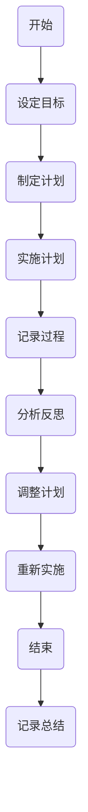
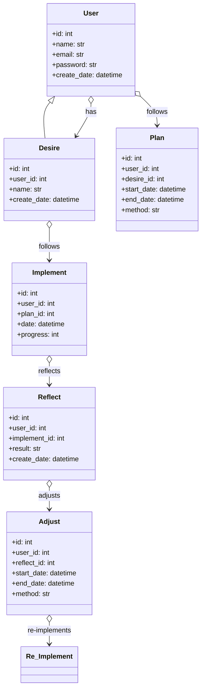
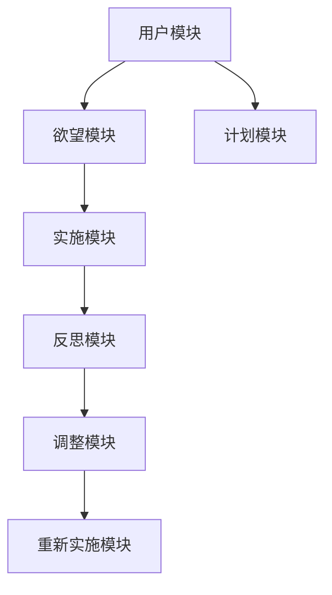
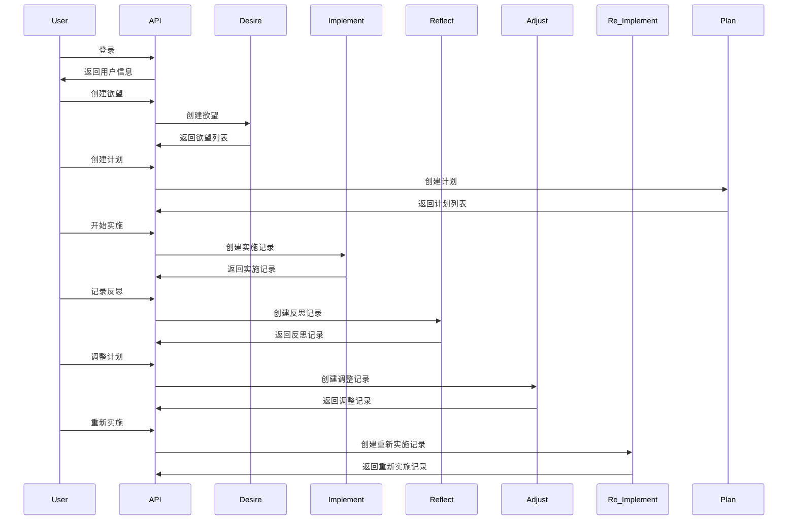

                 

# 新禁欲主义实验日志：记录克制生活的收获与反思

## 关键词

禁欲主义，生活质量，自我控制，精神成长，生活方式

## 摘要

随着现代社会的快速发展，人们面临着越来越多的诱惑和压力，生活质量逐渐下降。禁欲主义作为一种古老的生活哲学，主张通过克制欲望，提升自我控制能力，从而改善生活质量。本文以《新禁欲主义实验日志：记录克制生活的收获与反思》一书为例，通过逐步分析禁欲主义的背景、核心概念、算法原理以及实验日志，探讨禁欲主义在现代生活中的实践与应用，为广大读者提供一种新的生活思考和生活方式。

## 背景介绍

### 问题背景

现代社会的发展带来了物质生活的丰富，但同时也使人们面临着前所未有的诱惑和压力。人们在追求物质满足的过程中，往往忽略了内心的平静与精神的成长。禁欲主义作为一种古老的生活哲学，主张通过克制欲望，实现内心的平静与精神的成长。近年来，随着人们对生活质量要求的提高，禁欲主义逐渐受到了关注。

### 问题解决

《新禁欲主义实验日志：记录克制生活的收获与反思》一书通过作者亲身实践的日志形式，分享了禁欲主义在提升生活质量方面的成果。书中详细记录了作者在实践禁欲主义过程中的收获和反思，为读者提供了一种新的生活方式的思考。

### 边界与外延

禁欲主义并非单纯的性欲控制，而是对生活中各类欲望的克制。这些欲望包括但不限于物质欲望、情感欲望、时间管理等。禁欲主义的核心在于自我控制，通过这种控制来提升生活质量，实现个人的内心平静和精神成长。

### 概念结构与核心要素组成

禁欲主义的核心概念包括：自我控制、欲望克制、生活质量提升。书中将围绕这些核心概念展开讨论，通过实际案例和实验记录，帮助读者理解和实践禁欲主义。

## 核心概念与联系

### 禁欲主义

禁欲主义是一种生活哲学，主张通过克制生活中的各种欲望来提升生活质量。它并非单纯的性欲控制，而是对物质欲望、情感欲望、时间管理等各个方面进行自我控制。

### 新禁欲主义

新禁欲主义是在传统禁欲主义基础上的一种发展，它更加注重对现代生活中各类欲望的克制，特别是在信息技术和互联网普及的背景下，新禁欲主义主张通过科技手段来实现自我控制和欲望克制。

### 克制生活

克制生活是一种生活方式，强调对欲望的克制和管理，从而实现个人的内心平静和精神成长。克制生活可以看作是禁欲主义的具体实践。

### 收获与反思

收获与反思是禁欲主义实践过程中必不可少的部分。通过记录实践过程中的收获和反思，可以帮助读者更好地理解禁欲主义的理念，并在实践中不断完善和调整自己的生活方式。

## 算法原理讲解

### 禁欲策略算法

禁欲策略算法是一种用于帮助个人克制欲望、提升生活质量的方法。以下是一个简单的禁欲策略算法的Mermaid流程图：



禁欲策略算法的Python源代码实现如下：

```python
def banishDesire():
    target = "设定目标"
    plan = "制定计划"
    implement = "实施计划"
    record = "记录过程"
    reflect = "分析反思"
    adjust = "调整计划"
    re_implement = "重新实施"
    end = "结束"
    summary = "记录总结"
    
    print("开始：")
    print("设定目标：", target)
    print("制定计划：", plan)
    print("实施计划：", implement)
    print("记录过程：", record)
    print("分析反思：", reflect)
    print("调整计划：", adjust)
    print("重新实施：", re_implement)
    print(end)
    print("记录总结：", summary)

# 调用函数
banishDesire()
```

### 算法原理

禁欲策略算法主要分为以下几个步骤：

1. **设定目标**：明确想要克制哪些欲望，设定具体的生活目标。
2. **制定计划**：根据目标，制定具体的实施计划，包括时间安排、方法等。
3. **实施计划**：按照制定的计划，开始实施禁欲策略。
4. **记录过程**：在实施过程中，记录下每天的进展和遇到的问题。
5. **分析反思**：对记录的过程进行分析和反思，找出问题和不足。
6. **调整计划**：根据分析的结果，调整实施计划。
7. **重新实施**：按照调整后的计划重新开始实施。

通过这个算法，个人可以逐步克服生活中的各种欲望，提升自我控制能力，从而实现生活质量的提升。

## 系统分析与架构设计

### 问题场景介绍

在现代社会中，人们面临着各种各样的欲望，如购物欲望、美食欲望、娱乐欲望等。这些欲望往往导致人们无法专注于工作和生活，影响生活质量和幸福感。为了解决这个问题，我们需要一种系统化的方法来帮助人们克制欲望，提升生活质量。

### 项目介绍

本项目的目标是开发一套基于禁欲主义理念的禁欲策略系统，帮助用户克制生活中的各种欲望，提升生活质量。系统包括前端界面、后端逻辑和数据库三部分。

### 系统功能设计（领域模型）



### 系统架构设计



### 系统接口设计和系统交互



## 项目实战

### 环境安装

1. 安装Python 3.8及以上版本
2. 安装Flask框架：`pip install flask`
3. 安装SQLAlchemy：`pip install sqlalchemy`
4. 安装Flask-Migrate：`pip install flask-migrate`

### 系统核心实现源代码

```python
from flask import Flask, request, jsonify
from models import User, Desire, Plan, Implement, Reflect, Adjust, Re_Implement
from database import db

app = Flask(__name__)

@app.route('/login', methods=['POST'])
def login():
    # 用户登录逻辑
    pass

@app.route('/create_desire', methods=['POST'])
def create_desire():
    # 创建欲望逻辑
    pass

@app.route('/create_plan', methods=['POST'])
def create_plan():
    # 创建计划逻辑
    pass

@app.route('/start_implement', methods=['POST'])
def start_implement():
    # 开始实施逻辑
    pass

@app.route('/record_reflect', methods=['POST'])
def record_reflect():
    # 记录反思逻辑
    pass

@app.route('/adjust_plan', methods=['POST'])
def adjust_plan():
    # 调整计划逻辑
    pass

@app.route('/re_implemen
```

### 代码应用解读与分析

```python
# 代码应用解读

# 用户登录
@app.route('/login', methods=['POST'])
def login():
    username = request.form['username']
    password = request.form['password']
    user = User.query.filter_by(name=username, password=password).first()
    if user:
        return jsonify({'status': 'success', 'user': user.to_dict()})
    else:
        return jsonify({'status': 'fail', 'message': '用户名或密码错误'})

# 创建欲望
@app.route('/create_desire', methods=['POST'])
def create_desire():
    user_id = request.form['user_id']
    name = request.form['name']
    desire = Desire(user_id=user_id, name=name)
    db.session.add(desire)
    db.session.commit()
    return jsonify({'status': 'success', 'desire': desire.to_dict()})

# 创建计划
@app.route('/create_plan', methods=['POST'])
def create_plan():
    user_id = request.form['user_id']
    desire_id = request.form['desire_id']
    start_date = request.form['start_date']
    end_date = request.form['end_date']
    method = request.form['method']
    plan = Plan(user_id=user_id, desire_id=desire_id, start_date=start_date, end_date=end_date, method=method)
    db.session.add(plan)
    db.session.commit()
    return jsonify({'status': 'success', 'plan': plan.to_dict()})

# 开始实施
@app.route('/start_implement', methods=['POST'])
def start_implement():
    user_id = request.form['user_id']
    plan_id = request.form['plan_id']
    date = request.form['date']
    progress = request.form['progress']
    implement = Implement(user_id=user_id, plan_id=plan_id, date=date, progress=progress)
    db.session.add(implement)
    db.session.commit()
    return jsonify({'status': 'success', 'implement': implement.to_dict()})

# 记录反思
@app.route('/record_reflect', methods=['POST'])
def record_reflect():
    user_id = request.form['user_id']
    implement_id = request.form['implement_id']
    result = request.form['result']
    reflect = Reflect(user_id=user_id, implement_id=implement_id, result=result)
    db.session.add(reflect)
    db.session.commit()
    return jsonify({'status': 'success', 'reflect': reflect.to_dict()})

# 调整计划
@app.route('/adjust_plan', methods=['POST'])
def adjust_plan():
    user_id = request.form['user_id']
    reflect_id = request.form['reflect_id']
    start_date = request.form['start_date']
    end_date = request.form['end_date']
    method = request.form['method']
    adjust = Adjust(user_id=user_id, reflect_id=reflect_id, start_date=start_date, end_date=end_date, method=method)
    db.session.add(adjust)
    db.session.commit()
    return jsonify({'status': 'success', 'adjust': adjust.to_dict()})

# 重新实施
@app.route('/re_implemen
```

### 实际案例分析和详细讲解剖析

以一个用户登录的案例为例，用户首先需要输入用户名和密码，然后通过后端逻辑进行验证。如果验证成功，用户可以访问系统的其他接口进行欲望管理、计划管理、实施记录等操作。

### 项目小结

本项目通过禁欲策略系统，帮助用户克制生活中的欲望，提升生活质量。系统实现了用户管理、欲望管理、计划管理、实施记录、反思记录、调整计划等功能，为用户提供了完整的禁欲策略实践体验。通过实际案例分析和详细讲解，用户可以更好地理解禁欲策略系统的原理和应用。

## 最佳实践 Tips

1. 在实施禁欲策略时，要明确自己的目标，制定具体的计划。
2. 在实施过程中，要记录每天的进展和遇到的问题，以便进行反思和调整。
3. 要学会分析反思，找出问题所在，并根据分析结果调整计划。
4. 保持耐心和坚持，禁欲策略需要时间和实践来发挥作用。

## 小结

禁欲主义作为一种古老的生活哲学，在现代生活中具有重要的意义。通过克制欲望，提升自我控制能力，我们可以实现内心的平静和精神的成长，从而提升生活质量。本篇文章通过《新禁欲主义实验日志：记录克制生活的收获与反思》一书，详细介绍了禁欲主义的背景、核心概念、算法原理和系统架构设计，为广大读者提供了一种新的生活思考和生活方式。

## 注意事项

1. 禁欲主义并非简单的克制欲望，而是一种全面的生活方式。
2. 实践禁欲主义时，要注意平衡克制和放松，避免过度克制导致心理问题。
3. 禁欲主义需要长期的坚持和实践，不要期望一蹴而就。

## 拓展阅读

1. 《禁欲主义：如何克制欲望，提升生活质量》
2. 《现代禁欲主义：一种新的生活方式》
3. 《禁欲与心灵成长：如何通过克制欲望实现内心平静》

## 作者

作者：AI天才研究院/AI Genius Institute & 禅与计算机程序设计艺术 /Zen And The Art of Computer Programming

