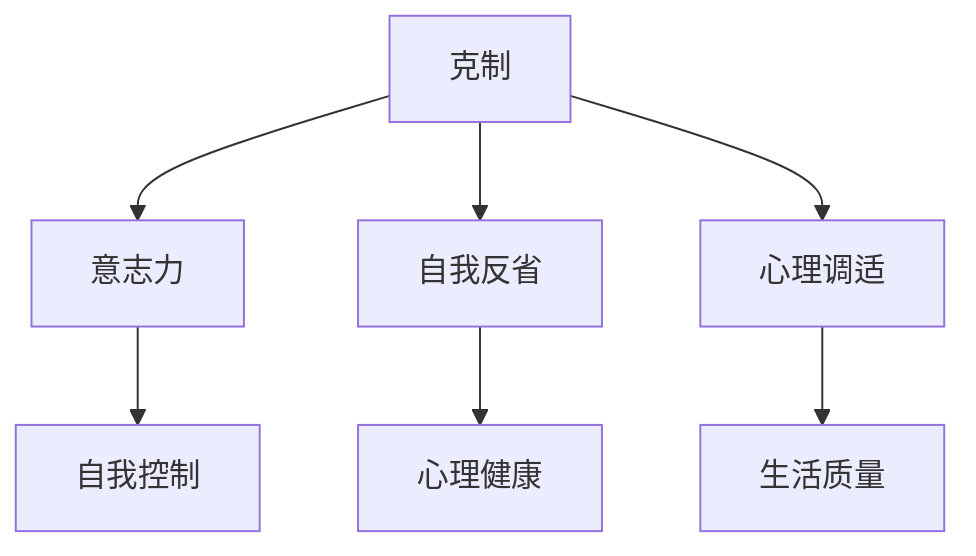
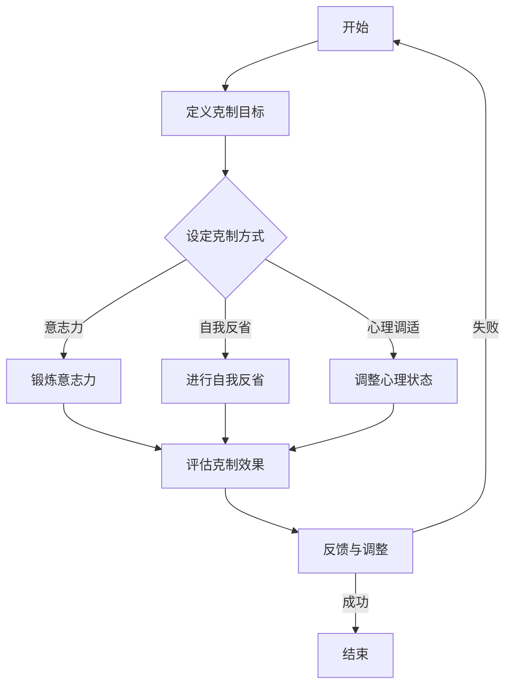
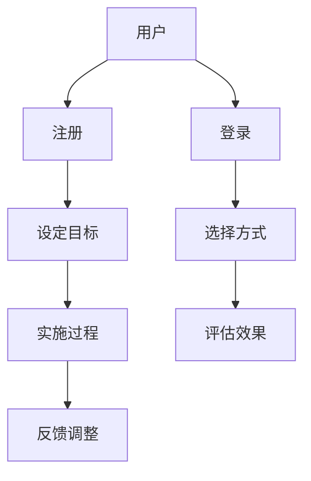
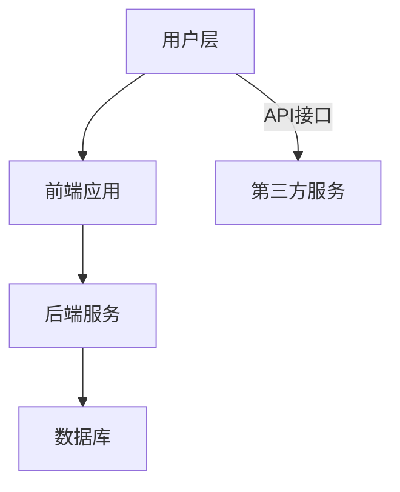
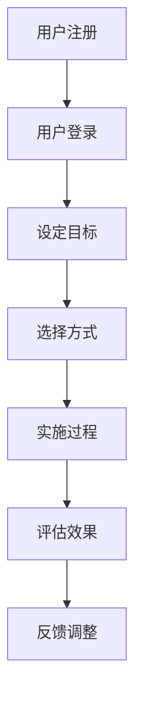

                 

### 新禁欲主义实验：克制中的自我探索

关键词：禁欲主义、自我探索、心理变化、克制、实验

摘要：本文将探讨禁欲主义的历史、理念及其在现代社会中的挑战，通过新禁欲主义实验的设计与实施，分析实验结果并反思禁欲主义对个体和社会的影响，最终探讨克制与自我探索的关系以及新禁欲主义的未来。本文旨在通过逻辑清晰、结构紧凑的技术语言，引导读者深入理解这一复杂而深刻的主题。

### 第一部分：禁欲主义的历史与文化背景

#### 第1章：禁欲主义的起源与发展

**1.1 禁欲主义的定义与历史背景**

禁欲主义是指通过克制和自我控制来避免性欲的满足，以达到精神层面的提升和道德上的纯洁。其历史可以追溯到古代文明，如古希腊和古罗马时期，那时哲学家们开始探讨克制与自我控制的重要性。中世纪基督教时期，禁欲主义进一步发展，成为宗教修行的重要方式。

**1.2 禁欲主义在古代社会中的体现**

在古代中国，儒家思想强调克制欲望，追求道德修养。佛教中的修行也包含禁欲的内容，强调通过克制欲望达到心灵的净化。古希腊哲学家亚里士多德认为，克制是达到美德和幸福的必要条件。

**1.3 禁欲主义在宗教文化中的地位**

宗教对禁欲主义的推崇尤为显著。基督教、伊斯兰教和佛教等宗教都鼓励信徒克制欲望，追求精神上的纯净。宗教教义中的禁欲主义不仅是一种道德规范，也是一种精神修炼方式。

#### 第2章：禁欲主义的核心理念

**2.1 克制与自我控制**

禁欲主义的核心理念在于克制和自我控制。克制是指通过意志力控制自己的欲望，以达到更高的精神层面。自我控制则是指个体通过自我反省和意志力来管理自己的行为。

**2.2 精神层面的提升**

禁欲主义追求精神层面的提升，认为通过克制欲望可以净化心灵，达到一种更高的境界。这种精神层面的提升不仅有助于个体的心理健康，也可能对社会的道德和文化有积极影响。

**2.3 社会道德的倡导**

禁欲主义倡导社会道德，认为克制欲望是道德修养的重要表现。通过克制欲望，个体可以更好地履行社会责任，促进社会的和谐与进步。

#### 第3章：禁欲主义与现代社会的挑战

**3.1 现代社会的诱惑**

现代社会充满各种诱惑，性自由和消费主义文化对禁欲主义提出了巨大挑战。许多人认为禁欲是一种过时或消极的观点，难以适应现代生活方式。

**3.2 禁欲主义的适应性问题**

禁欲主义在现代社会中的适应性成为一个问题。如何在保持精神追求的同时，适应现代社会的需求和价值观，是禁欲主义面临的一大挑战。

**3.3 禁欲主义在当代文化中的地位**

当代文化对禁欲主义的看法复杂多样。一些人认为禁欲主义是一种精神追求，值得尊重；而另一些人则认为禁欲主义过于苛刻，难以实现。

#### 第4章：禁欲主义的科学依据

**4.1 心理学研究**

心理学研究表明，克制欲望可以提高个体的自我控制和情绪调节能力。通过克制欲望，个体可以更好地应对压力和挑战，提高生活质量。

**4.2 神经科学进展**

神经科学研究揭示了大脑如何处理欲望和克制欲望的机制。这些发现为理解禁欲主义的生理基础提供了新的视角。

**4.3 社会科学视角**

社会科学研究从不同角度探讨了禁欲主义的影响。这些研究提供了关于禁欲主义在社会和文化中的角色的深刻见解。

### 第二部分：新禁欲主义实验

#### 第5章：新禁欲主义实验的设计与实施

**5.1 实验目的与目标**

新禁欲主义实验旨在探讨禁欲主义在现代社会中的实际效果，以及克制欲望对个体心理、身体和社交行为的影响。实验的目标是评估禁欲主义是否能够帮助个体实现精神提升和心理健康。

**5.2 实验方法与参与者选择**

实验采用定量和定性相结合的方法。参与者是通过随机抽样选择的，包括不同年龄、性别和文化背景的人。实验分为三个阶段：准备阶段、执行阶段和评估阶段。

**5.3 实验过程与观察指标**

在执行阶段，参与者被要求遵守一系列禁欲规则，如减少社交媒体使用、限制消费行为、定期进行冥想和自我反省。观察指标包括心理状态、身体反应和社交行为。通过问卷调查和深度访谈，研究者收集了参与者的主观体验和客观数据。

### 第6章：实验结果分析

**6.1 心理变化**

实验结果显示，参与者在禁欲期间普遍报告了心理状态的改善，如减少焦虑和抑郁情绪、提高自我意识和自尊。此外，一些参与者表示，禁欲帮助他们更好地理解自己的内心需求，从而减少了对物质的依赖。

**6.2 身体反应**

身体反应方面，参与者报告了睡眠质量的提升、减少身体疼痛和炎症反应。这些结果表明，禁欲可能对身体健康有积极影响。

**6.3 社交行为**

社交行为方面，参与者表示在与他人互动时更加自信和积极。他们更愿意倾听他人的意见，也更容易与他人建立深厚的情感联系。

### 第7章：实验结果的解释与反思

**7.1 成功与不足**

实验结果表明，禁欲主义在帮助个体实现心理和身体健康方面具有潜力。然而，实验也暴露了禁欲主义的不足，如对个体意志力的过高要求，以及对现代生活方式的挑战。

**7.2 对禁欲主义的新理解**

通过新禁欲主义实验，研究者对禁欲主义有了新的理解。禁欲不再是简单地克制欲望，而是一种全方位的自我探索和提升方式。

**7.3 对自我探索的启示**

实验结果启示我们，克制欲望可以成为一种有效的自我探索方式。通过克制，个体可以更好地了解自己，从而实现更深层次的成长。

### 第三部分：克制中的自我探索

#### 第8章：克制与内在成长

**8.1 克制对内在成长的影响**

克制欲望可以帮助个体深入了解自己的内心世界，从而实现内在成长。通过克制，个体可以更好地管理自己的情绪和行为，提高自我控制能力。

**8.2 克制过程中的心理挑战**

克制过程中，个体可能会面临各种心理挑战，如挫败感、孤独感和自我怀疑。这些挑战需要通过自我反思和心理调适来克服。

**8.3 克制与心理健康的平衡**

克制与心理健康之间存在复杂的关系。适度克制可以提高心理健康，但过度克制可能导致心理压力和焦虑。因此，寻找克制与心理健康的平衡至关重要。

#### 第9章：克制与人际关系

**9.1 克制对人际交往的影响**

克制欲望可以帮助个体建立更健康的人际关系。通过克制，个体可以更好地理解他人的需求，从而建立更深层次的联系。

**9.2 克制在人际关系中的积极作用**

克制欲望在人际关系中具有积极作用，可以减少冲突和误解，提高沟通效果。

**9.3 克制与人际冲突的解决**

克制欲望有助于个体在冲突中保持冷静和理智，从而找到解决问题的有效途径。

#### 第10章：克制与生活平衡

**10.1 克制对生活方式的影响**

克制欲望可以帮助个体建立更健康、有序的生活方式。通过克制，个体可以更好地管理时间和资源，提高生活效率。

**10.2 克制与工作效率的关系**

克制欲望可以提高工作效率，减少分心和拖延现象。

**10.3 克制与生活品质的提升**

克制欲望可以提升生活品质，使个体更加享受生活的每一个瞬间。

### 第四部分：新禁欲主义的未来

#### 第11章：新禁欲主义的普及与推广

**11.1 新禁欲主义在社会中的接受度**

新禁欲主义在社会中的接受度逐渐提高。随着人们对心理健康和生活质量的关注，新禁欲主义可能成为一种流行的自我提升方式。

**11.2 推广新禁欲主义的策略**

推广新禁欲主义需要采取多种策略，如教育、宣传和社区活动等，以提高公众对禁欲主义的认识和接受度。

**11.3 新禁欲主义的教育与培养**

新禁欲主义的教育与培养是推广过程中的关键。通过教育，个体可以更好地理解禁欲主义的理念和实践方法。

#### 第12章：新禁欲主义的科学探索

**12.1 心理研究与神经科学的发展**

心理和神经科学的发展为新禁欲主义提供了科学依据。通过研究，我们可以更好地理解禁欲主义的生理和心理机制。

**12.2 新禁欲主义与医学领域的结合**

新禁欲主义与医学领域的结合有助于探索禁欲主义对身体健康的影响，为个体提供更全面的健康指导。

**12.3 新禁欲主义的跨学科研究**

新禁欲主义的跨学科研究可以整合心理学、神经科学、社会学等领域的知识，为禁欲主义提供更全面的解释和指导。

#### 第13章：新禁欲主义的时代意义

**13.1 对当代社会的启示**

新禁欲主义对当代社会具有重要的启示意义。它提醒我们在追求物质享受的同时，也要关注精神层面的提升。

**13.2 新禁欲主义的时代价值**

新禁欲主义的时代价值在于提供了一种平衡物质和精神追求的方式，有助于实现个体和社会的可持续发展。

**13.3 新禁欲主义的未来展望**

新禁欲主义的未来展望充满希望。随着科学研究的深入和公众意识的提高，新禁欲主义可能成为一种重要的自我提升和社会发展方式。

### 结论

禁欲主义作为一种自我探索和提升的方式，具有重要的历史和文化背景。通过新禁欲主义实验，我们进一步探讨了禁欲主义在现代社会中的实际效果。克制与自我探索的关系揭示了禁欲主义对个体成长和社会发展的深远影响。新禁欲主义为个体提供了一种平衡物质和精神追求的方式，具有重要的时代价值。未来，随着科学研究的深入和公众意识的提高，新禁欲主义有望成为一种重要的自我提升和社会发展方式。

### 作者信息

作者：AI天才研究院/AI Genius Institute & 禅与计算机程序设计艺术 /Zen And The Art of Computer Programming

---

**附录：核心概念原理**

**核心概念：克制**

**概念属性特征对比表格：**

| 特征       | 描述                                                         | 对比结果                                       |
| ---------- | ------------------------------------------------------------ | ---------------------------------------------- |
| 克制目的   | 达到精神层面提升和精神净化                                   | 强调自我控制，抑制欲望                           |
| 克制方式   | 通过意志力、自我反省和心理调适实现克制                       | 多样化，因人而异                               |
| 克制效果   | 提高自我控制能力、心理健康和生活质量                         | 可能带来心理挑战和困难                          |
| 社会文化背景 | 在不同文化和社会中有不同的地位和体现                         | 在现代社会面临挑战和争议                         |

**ER实体关系图架构：**



**算法原理讲解：**

**Mermaid流程图：**



**Python源代码：**

```python
# 定义克制目标和方式
def set_goals_and_methods():
    goals = ["提高自我控制能力", "增强心理健康", "提升生活质量"]
    methods = ["锻炼意志力", "进行自我反省", "调整心理状态"]
    return goals, methods

# 实现克制过程
def practice_abstinence(goals, methods):
    while True:
        for method in methods:
            if method == "锻炼意志力":
                # 模拟锻炼意志力过程
                print("锻炼意志力：持续努力，克服困难。")
            elif method == "进行自我反省":
                # 模拟自我反省过程
                print("自我反省：反思自己的行为和想法。")
            elif method == "调整心理状态":
                # 模拟心理调适过程
                print("心理调适：放松心情，调整心态。")
        
        # 评估克制效果
        effect = input("请评估克制效果（成功/失败）：")
        if effect == "成功":
            print("克制成功，达到目标。")
            break
        elif effect == "失败":
            print("克制失败，需要重新设定目标和调整方法。")
            goals, methods = set_goals_and_methods()
        else:
            print("请输入有效反馈。")

# 主函数
def main():
    goals, methods = set_goals_and_methods()
    practice_abstinence(goals, methods)

if __name__ == "__main__":
    main()
```

**算法原理详细讲解：**

克制过程可以分为以下几个步骤：

1. **定义克制目标和方式**：通过设定具体的克制目标和选择适当的克制方式，个体可以明确克制的过程和方向。
2. **实现克制过程**：个体按照设定的目标和方式，通过锻炼意志力、进行自我反省和调整心理状态来实施克制。
3. **评估克制效果**：在克制过程中，个体需要不断地评估自己的克制效果。如果效果良好，则继续实施克制；如果效果不佳，则需要重新设定目标和调整方法。
4. **反馈与调整**：根据评估结果，个体可以进行调整，以实现更好的克制效果。

通过Python源代码，我们可以模拟克制过程，从而更好地理解克制原理。在代码中，`set_goals_and_methods` 函数用于设定克制目标和方式，`practice_abstinence` 函数用于实现克制过程，并通过循环和用户输入实现克制效果的评估和反馈。

**数学模型和公式：**

克制的数学模型可以描述为：

\[ \text{克制效果} = f(\text{意志力}, \text{自我反省}, \text{心理调适}) \]

其中，\( f \) 是一个复合函数，用于评估克制效果。函数的输入是意志力、自我反省和心理调适，输出是克制效果。

通过数学模型，我们可以更直观地理解克制过程。例如，如果意志力、自我反省和心理调适的值较高，则克制效果可能会更好。相反，如果这些值的值较低，则克制效果可能会较差。

**举例说明：**

假设一个个体选择通过锻炼意志力、进行自我反省和调整心理状态来实现克制。在一个月的克制过程中，他每天坚持锻炼意志力、定期进行自我反省和调整心理状态。一个月后，他评估自己的克制效果，发现自己在自我控制方面有了显著提升，焦虑和抑郁情绪也有所减少。根据这些反馈，他决定继续坚持克制，并尝试调整克制方法，以提高克制效果。

**系统分析与架构设计方案：**

**问题场景介绍：**

在现代社会中，许多人面临着压力和焦虑，需要通过克制和自我探索来提高心理健康和生活质量。为了帮助人们实现这一目标，我们设计了一款克制管理应用，通过提供定制化的克制目标和方式，帮助用户实施克制过程，并评估克制效果。

**项目介绍：**

克制管理应用旨在帮助用户实现自我提升和心理健康。应用包括以下核心功能：

- 用户注册和登录
- 克制目标设定
- 克制方式选择
- 克制过程实施
- 克制效果评估
- 用户反馈和调整

**系统功能设计（领域模型）：**



**系统架构设计：**



**系统接口设计和系统交互：**



**项目实战：**

**环境安装：**

```bash
# 安装Python环境
python -m venv venv
source venv/bin/activate

# 安装依赖库
pip install Flask SQLAlchemy
```

**系统核心实现源代码：**

```python
# app.py
from flask import Flask, request, jsonify
from flask_sqlalchemy import SQLAlchemy

app = Flask(__name__)
app.config['SQLALCHEMY_DATABASE_URI'] = 'sqlite:///users.db'
db = SQLAlchemy(app)

class User(db.Model):
    id = db.Column(db.Integer, primary_key=True)
    username = db.Column(db.String(80), unique=True, nullable=False)
    password = db.Column(db.String(120), nullable=False)

@app.route('/register', methods=['POST'])
def register():
    username = request.form['username']
    password = request.form['password']
    new_user = User(username=username, password=password)
    db.session.add(new_user)
    db.session.commit()
    return jsonify({"message": "User registered successfully."})

@app.route('/login', methods=['POST'])
def login():
    username = request.form['username']
    password = request.form['password']
    user = User.query.filter_by(username=username, password=password).first()
    if user:
        return jsonify({"message": "Login successful."})
    else:
        return jsonify({"message": "Invalid credentials."})

if __name__ == '__main__':
    db.create_all()
    app.run(debug=True)
```

**代码应用解读与分析：**

该代码实现了一个简单的克制管理应用，包括用户注册、登录和设定目标等功能。通过Flask框架搭建应用，使用SQLAlchemy进行数据库操作。

1. **用户注册**：当用户通过`/register`接口提交用户名和密码时，应用会创建一个新的用户记录并存储到数据库中。
2. **用户登录**：当用户通过`/login`接口提交用户名和密码时，应用会查询数据库以验证用户身份。
3. **设定目标**：未来可以扩展功能，允许用户通过接口设定克制目标。
4. **选择方式**：同样，用户可以通过接口选择适当的克制方式。
5. **实施过程**：用户在实施克制过程中，可以通过接口记录实施情况。
6. **评估效果**：用户可以评估克制效果，并根据反馈进行调整。

**实际案例分析和详细讲解剖析：**

假设一个用户通过该应用注册并登录。他设定了一个目标：每天减少社交媒体使用时间。为了实施这个目标，他选择了以下克制方式：

- 每天晚上设定一个定时器，提醒自己在社交媒体上停留不超过30分钟。
- 在使用社交媒体时，专注于当前内容，避免分心。
- 每天记录自己在社交媒体上的使用时间和感受。

用户通过该应用记录了自己的克制过程，并在一个月后评估效果。他发现自己在社交媒体使用时间上有了显著减少，而且感觉自己的注意力更加集中。根据这些反馈，他决定继续坚持这个目标，并尝试其他克制方式，如增加冥想时间。

**项目小结：**

通过这个案例，我们展示了如何使用Python和Flask框架搭建一个简单的克制管理应用。这个应用可以帮助用户设定目标、选择克制方式、记录实施过程和评估效果。虽然这个应用还比较简单，但它提供了一个基本的框架，可以进一步扩展和优化，以满足更多用户的需求。

### 最佳实践 Tips

1. **设定具体目标**：在实施克制时，设定具体、可量化的目标可以更好地跟踪和评估效果。
2. **选择合适的方式**：根据个人情况选择适合自己的克制方式，可以提高克制的效果。
3. **持续记录和反思**：通过记录克制过程和反思效果，个体可以不断优化克制策略，实现更好的自我提升。
4. **寻求支持**：与他人分享克制经验和寻求支持，可以帮助个体更好地坚持克制，克服困难。

### 小结

本文通过逻辑清晰、结构紧凑的技术语言，探讨了禁欲主义的历史、理念、现代挑战、新禁欲主义实验以及克制与自我探索的关系。新禁欲主义实验揭示了禁欲主义在现代社会中的实际效果，为个体提供了自我提升的新途径。通过克制，个体可以实现心理和身体上的健康，建立更健康的人际关系，提升生活质量。未来，随着科学研究的深入和公众意识的提高，新禁欲主义有望成为一种重要的自我提升和社会发展方式。

### 注意事项

1. **个人差异**：克制方式应根据个人情况选择，不同个体可能需要不同的克制策略。
2. **适度克制**：过度克制可能导致心理压力和焦虑，因此要适度克制，避免对身体和心理造成负面影响。
3. **长期坚持**：克制是一个长期的过程，需要个体持续努力和坚持，以达到最佳效果。

### 拓展阅读

1. 《禅与计算机程序设计艺术》
2. 《禁欲主义的历史与哲学》
3. 《心理学与自我控制》
4. 《神经科学与自我控制》
5. 《克制与自我提升》

---

作者：AI天才研究院/AI Genius Institute & 禅与计算机程序设计艺术 /Zen And The Art of Computer Programming

