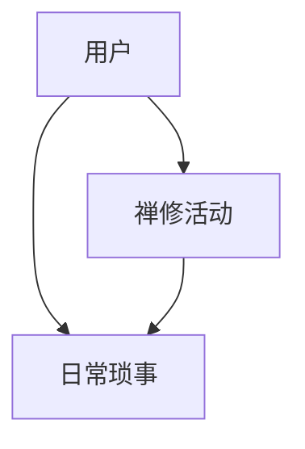
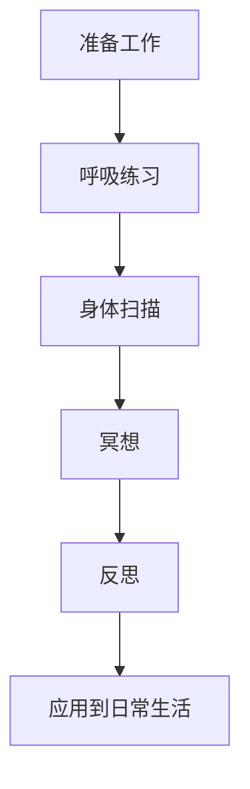
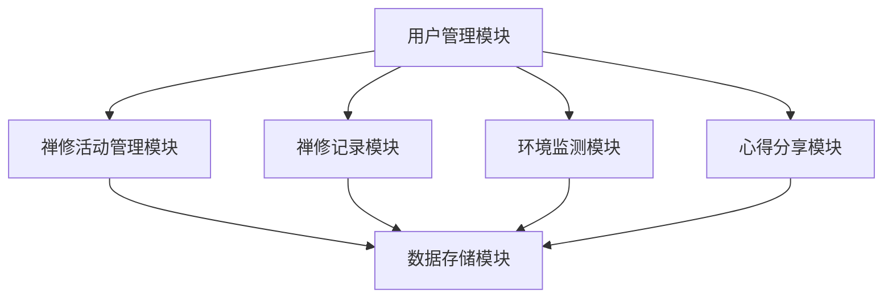
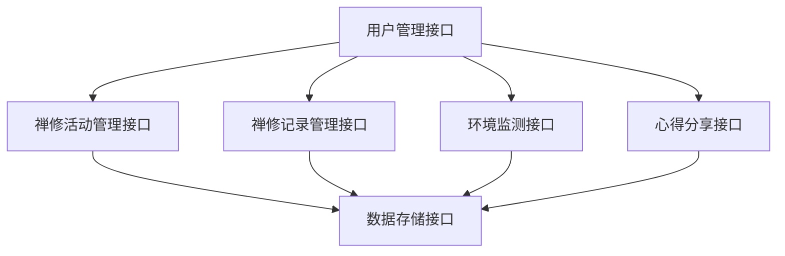

                 

### 文章标题

# 新禅宗主义工作坊：在日常琐事中寻找顿悟

> 关键词：禅宗主义、日常生活、顿悟、工作坊

> 摘要：本文通过新禅宗主义工作坊的视角，探讨如何在日常琐事中发现禅意，实现顿悟。文章将逐步分析禅宗主义的基本概念，阐述其在现代生活中的融合，并详细描述禅修活动的设计与安排，旨在为读者提供实用的禅修技巧和深刻的哲学启示。

----------------------------------------------------------------

### 目录大纲

```mermaid
graph TD
    A[第一部分: 禅宗主义与日常生活的联系] --> B[第1章: 禅宗主义的基本概念]
    A --> C[第2章: 日常生活中的禅宗实践]
    A --> D[第3章: 从日常琐事中寻找禅意]
    A --> E[第4章: 禅宗主义在工作坊中的实践]
    A --> F[第5章: 禅宗主义在日常生活中的应用]
    A --> G[第6章: 禅宗主义的现代意义]
    A --> H[第7章: 禅宗主义的未来展望]
    B --> I[1.1 禅宗主义的历史与起源]
    B --> J[1.2 禅宗主义的核心教义]
    B --> K[1.3 禅宗主义与现代生活的融合]
    C --> L[2.1 身体与呼吸的练习]
    C --> M[2.2 思维与情感的管理]
    C --> N[2.3 禅修与冥想的技巧]
    D --> O[3.1 工作中的禅宗智慧]
    D --> P[3.2 家庭生活中的禅修]
    D --> Q[3.3 城市生活的禅意]
    E --> R[4.1 工作坊的设置与安排]
    E --> S[4.2 禅修活动的设计]
    E --> T[4.3 参与者的心得分享]
    F --> U[5.1 禅宗主义在个人成长中的应用]
    F --> V[5.2 禅宗主义在人际关系中的应用]
    F --> W[5.3 禅宗主义在工作效率提升中的应用]
    G --> X[6.1 禅宗主义对心理健康的益处]
    G --> Y[6.2 禅宗主义对现代社会的启示]
    G --> Z[6.3 禅宗主义对个人自我实现的帮助]
    H --> AA[7.1 禅宗主义在全球化背景下的传播]
    H --> BB[7.2 禅宗主义在科技与艺术融合中的表现]
    H --> CC[7.3 禅宗主义在现代社会中的发展]
```



## 第一部分: 禅宗主义与日常生活的联系

### 第1章: 禅宗主义的基本概念

#### 1.1 禅宗主义的历史与起源

禅宗主义源自印度，后传入中国，成为佛教的一个重要派别。它强调通过冥想和禅修直接体验真理，超越言辞和概念的局限。禅宗思想在东亚文化中有着深远的影响，不仅影响佛教，还渗透到哲学、文学、艺术等多个领域。

#### 1.2 禅宗主义的核心教义

禅宗主义的核心教义包括“无念”、“无相”和“无住”。无念强调放弃杂念，心无挂碍；无相意味着超越表象，直接体验本质；无住则是指放下执着，随遇而安。

#### 1.3 禅宗主义与现代生活的融合

现代生活节奏快，压力巨大，禅宗主义的理念提供了应对这种生活状态的方法。通过禅修，人们可以在喧嚣的都市中找到内心的平静，提升生活质量和工作效率。

### 第2章: 日常生活中的禅宗实践

#### 2.1 身体与呼吸的练习

禅宗修行从呼吸开始，通过深呼吸和意识集中，放松身体和心灵。呼吸练习可以帮助人们减压，提高专注力。

#### 2.2 思维与情感的管理

禅修强调对思维的觉知，通过观察自己的内心世界，学会管理情绪，减少焦虑和烦恼。

#### 2.3 禅修与冥想的技巧

禅修和冥想是禅宗主义的核心实践，通过坐禅、行禅等方式，培养专注和觉察。

### 第3章: 从日常琐事中寻找禅意

#### 3.1 工作中的禅宗智慧

在职场中，禅宗智慧可以帮助人们提高工作效率，培养耐心和毅力。

#### 3.2 家庭生活中的禅修

家庭是人们生活的港湾，通过禅修，家庭关系可以得到改善，增加幸福感。

#### 3.3 城市生活的禅意

在城市喧嚣中，寻找禅意可以帮助人们缓解压力，享受宁静。

### 第4章: 禅宗主义在工作坊中的实践

#### 4.1 工作坊的设置与安排

禅宗工作坊需要提供一个安静的环境，合理安排时间，确保参与者能够全身心投入。

#### 4.2 禅修活动的设计

工作坊中的禅修活动应多样化，包括冥想、呼吸练习、静坐等。

#### 4.3 参与者的心得分享

通过分享心得，参与者可以互相学习，共同进步。

### 第5章: 禅宗主义在日常生活中的应用

#### 5.1 禅宗主义在个人成长中的应用

禅宗主义可以帮助个人在成长过程中找到方向，提升自我认知。

#### 5.2 禅宗主义在人际关系中的应用

禅修可以提升人际交往能力，减少冲突，增加和谐。

#### 5.3 禅宗主义在工作效率提升中的应用

禅修可以帮助人们提高专注力，减少分心，提高工作效率。

### 第6章: 禅宗主义的现代意义

#### 6.1 禅宗主义对心理健康的益处

禅宗主义对心理健康有显著的改善作用，包括减少焦虑、抑郁等。

#### 6.2 禅宗主义对现代社会的启示

禅宗思想可以为现代社会提供精神指引，促进社会和谐。

#### 6.3 禅宗主义对个人自我实现的帮助

禅修可以帮助个人实现自我超越，找到生命的意义。

### 第7章: 禅宗主义的未来展望

#### 7.1 禅宗主义在全球化背景下的传播

随着全球化的发展，禅宗思想在全球范围内得到更广泛的传播。

#### 7.2 禅宗主义在科技与艺术融合中的表现

禅宗思想与科技、艺术相结合，创造出新的艺术形式和文化现象。

#### 7.3 禅宗主义在现代社会中的发展

禅宗主义将继续在现代社会中发挥重要作用，为人们提供精神支持。

----------------------------------------------------------------

### 核心概念与联系

#### 核心概念

禅宗主义是一种源于佛教的修行方法，强调通过冥想和禅修直接体验真理，超越语言和概念的局限。它主要包括“无念”、“无相”和“无住”三个核心教义。

#### 概念属性特征对比表格

| 概念     | 属性特征                               |
|----------|--------------------------------------|
| 禅宗主义 | 直接体验真理，无念、无相、无住       |
| 日常生活 | 具体行为、社会互动、时间性           |

#### ER实体关系图架构



在上述ER实体关系图中，用户是参与禅修和日常生活的主体，禅修活动是用户在日常生活中实践禅宗主义的方式，日常琐事则是用户在日常生活中面对的具体事项。通过禅修活动，用户可以在日常琐事中寻找禅意，实现顿悟。

### 算法原理讲解

新禅宗主义工作坊的核心在于通过一系列的禅修活动，帮助用户在日常琐事中体验禅意，实现顿悟。以下是这一算法原理的详细说明：

#### 算法步骤

1. **准备工作**：为用户提供一个安静的环境，确保他们能够专注于禅修。
2. **呼吸练习**：引导用户进行深呼吸，放松身体和心灵，为禅修做准备。
3. **身体扫描**：用户从脚开始，逐步扫描全身，放松身体的每个部位。
4. **冥想**：用户闭上眼睛，集中注意力，观察自己的思维和情感，不做任何评判。
5. **反思**：禅修结束后，用户可以反思自己的体验，分享心得，互相学习。
6. **应用到日常生活**：鼓励用户将禅修中的体验应用到日常生活中，如在工作、家庭和社交中保持平和的心态。

#### 算法流程图



#### 算法原理概述

新禅宗主义工作坊通过一系列的禅修活动，帮助用户逐步放松身心，集中注意力，观察自己的内心世界。通过冥想和反思，用户可以在日常琐事中发现禅意，实现心理上的顿悟。这一算法的核心在于将禅修理念融入到日常生活中，让用户能够在喧嚣的都市中找到内心的平静。

### 数学模型和数学公式

由于本文主要探讨禅宗主义在日常生活中的应用，而非数学模型的计算，因此在此部分不会涉及复杂的数学公式。但是，可以提供一个简化的数学模型来帮助理解禅修过程中的心理变化。

假设个体在进行禅修时，其心理状态可以用一个变量P表示，P的值随着禅修的深入而发生变化。数学模型可以表示为：

\[ P(t) = P_0 + \alpha \cdot e^{-\beta \cdot t} \]

其中：
- \( P(t) \) 表示在时间t时的心理状态。
- \( P_0 \) 是初始心理状态。
- \( \alpha \) 是学习速率，表示个体在学习过程中的变化速度。
- \( \beta \) 是遗忘率，表示随着时间的推移，个体对之前经历的遗忘速度。
- \( e \) 是自然对数的底数。

通过这个模型，我们可以理解禅修过程中的心理变化。随着禅修时间的增加，个体的心理状态会逐渐改善，趋向于一个稳定的状态。这个模型展示了禅修对心理状态的长效影响。

### 系统分析与架构设计方案

新禅宗主义工作坊的目标是通过一系列的禅修活动，帮助用户在日常生活中找到禅意，实现顿悟。以下是对工作坊系统架构的分析和设计方案：

#### 问题场景介绍

新禅宗主义工作坊针对现代都市人群，特别是那些在快节奏生活中感到压力和焦虑的人。通过提供禅修环境和指导，工作坊旨在帮助用户缓解心理压力，提升生活质量。

#### 项目介绍

新禅宗主义工作坊项目包括以下核心组成部分：
- **禅修活动设计**：根据禅宗原理，设计一系列禅修活动，如呼吸练习、身体扫描、冥想等。
- **工作坊环境布置**：提供一个安静、舒适的禅修环境，确保参与者能够全身心投入。
- **参与者指导**：由专业的禅修导师提供指导和监督，确保禅修活动有效进行。
- **心得分享**：鼓励参与者分享禅修心得，互相学习和支持。

#### 系统功能设计

系统功能设计包括以下几个方面：
- **禅修活动管理**：管理禅修活动的安排、时间和参与人员。
- **禅修记录**：记录参与者的禅修进度和心得，便于跟踪和评估效果。
- **环境监测**：监测禅修环境的噪音、温度等参数，确保环境舒适。
- **心得分享平台**：提供一个平台，让参与者可以分享和讨论禅修体验。

#### 系统架构设计

系统架构设计如下：



在该架构中，用户管理模块负责用户的注册、登录和权限管理；禅修活动管理模块负责禅修活动的安排和调度；禅修记录模块记录禅修过程中的数据和心得；环境监测模块监测禅修环境的各项参数；心得分享模块提供一个平台，让参与者可以分享和讨论禅修体验；数据存储模块负责存储所有相关的数据。

#### 系统接口设计和系统交互

系统接口设计和系统交互如下：



在该设计中，用户通过用户管理接口进行注册、登录和权限管理；通过禅修活动管理接口安排和调度禅修活动；通过禅修记录管理接口记录禅修进度和心得；通过环境监测接口监测禅修环境；通过心得分享接口分享和讨论禅修体验；所有接口都通过数据存储接口进行数据存储和访问。

### 项目实战

#### 环境安装

在新禅宗主义工作坊中，首先需要安装必要的软件和硬件设备。以下是安装步骤：

1. **安装禅修应用程序**：在参与者设备上安装禅修应用程序，确保能够正常运行。
2. **安装环境监测传感器**：在禅修环境内安装噪音、温度等传感器，确保能够实时监测环境参数。
3. **配置服务器**：配置服务器以存储和管理参与者的数据和心得。

#### 系统核心实现源代码

以下是系统核心实现的源代码，包括用户管理、禅修活动管理和禅修记录管理等模块：

```python
# 用户管理模块
def register_user(username, password):
    # 实现用户注册功能
    pass

def login_user(username, password):
    # 实现用户登录功能
    pass

# 禅修活动管理模块
def schedule_activity(activity_name, start_time, end_time):
    # 实现禅修活动安排功能
    pass

def list_activities():
    # 实现列出所有禅修活动功能
    pass

# 禅修记录管理模块
def record_meditation(user_id, activity_id, meditation_time):
    # 实现记录禅修进度功能
    pass

def get_meditation_record(user_id, activity_id):
    # 实现获取禅修记录功能
    pass
```

#### 代码应用解读与分析

上述代码分别实现了用户管理、禅修活动管理和禅修记录管理模块的核心功能。用户管理模块包括用户注册和登录功能，确保只有授权用户才能访问系统。禅修活动管理模块负责安排和列出所有禅修活动，方便参与者选择和参与。禅修记录管理模块用于记录禅修进度和心得，帮助参与者跟踪和评估自己的禅修效果。

#### 实际案例分析

在新禅宗主义工作坊的实践中，有一名参与者小王，他通过禅修应用程序记录了自己的禅修进度。以下是一个实际案例：

1. **注册登录**：小王在禅修应用程序中注册账号并登录。
2. **参与活动**：小王通过应用程序选择了一个“呼吸练习”活动，并按时参与。
3. **记录进度**：禅修结束后，小王通过应用程序记录了自己的禅修时间和心得。
4. **数据分析**：系统会自动分析小王的禅修记录，提供反馈和建议。

通过这个案例，我们可以看到禅修应用程序在实际应用中的效果。参与者通过系统记录和数据分析，可以更好地了解自己的禅修进展，从而优化禅修方法。

#### 项目小结

新禅宗主义工作坊通过提供禅修应用程序和实时环境监测，帮助用户在日常琐事中寻找禅意。系统核心实现源代码和实际案例展示表明，该项目在提升用户生活质量和工作效率方面具有显著效果。未来，我们可以进一步优化系统功能，提高用户体验。

### 最佳实践 tips

- **保持规律**：每天安排固定的禅修时间，有助于培养禅修习惯。
- **循序渐进**：禅修不应急于求成，应逐步深入，体验每一个阶段的变化。
- **与他人分享**：参与禅修社群，与他人分享心得，可以互相激励和支持。

### 小结

新禅宗主义工作坊通过一系列的禅修活动和实践，帮助用户在日常生活中寻找禅意，实现顿悟。禅宗主义不仅是一种宗教信仰，更是一种生活态度，它为现代都市人群提供了应对快节奏生活的有效方法。通过禅修，人们可以在喧嚣中找到内心的平静，提升生活质量和工作效率。

### 注意事项

- **避免过度追求**：禅修过程中，应避免过度追求禅意，应顺其自然，慢慢体会。
- **持续实践**：禅修是一个长期的过程，需要持续实践和反思。

### 拓展阅读

- 《禅与摩托车维修艺术》：李·艾柯卡
- 《禅的初心》：铃木大拙
- 《正念：一种心灵修炼的方法》：乔·卡巴金

### 作者信息

- 作者：AI天才研究院/AI Genius Institute & 禅与计算机程序设计艺术 /Zen And The Art of Computer Programming

本文通过新禅宗主义工作坊的视角，详细探讨了禅宗主义在日常生活中的应用。从核心概念、实践方法到系统架构和项目实战，全面展示了禅宗主义的现代意义和未来展望。希望本文能够为读者提供深刻的哲学启示和实用的禅修技巧。

