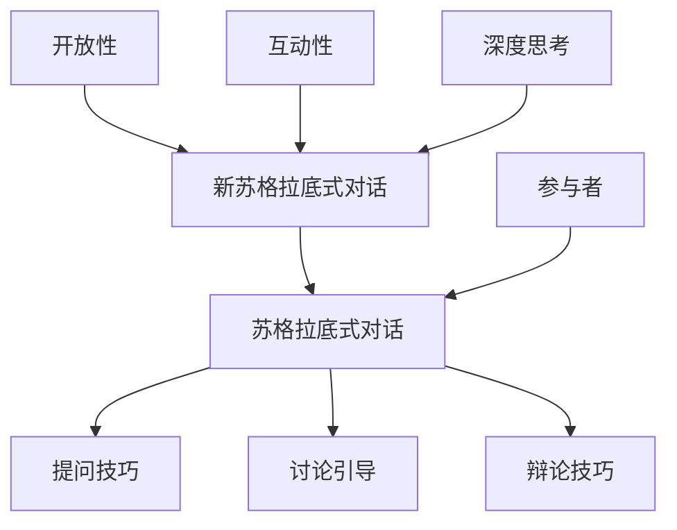
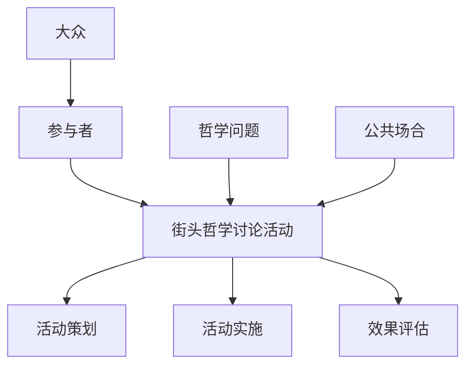
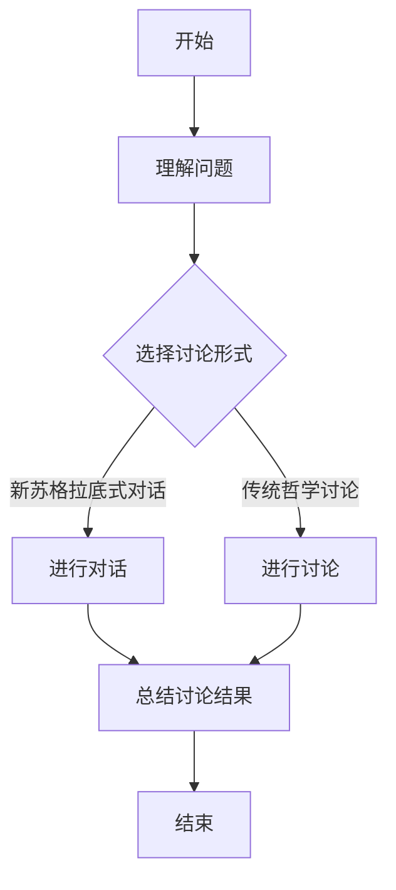
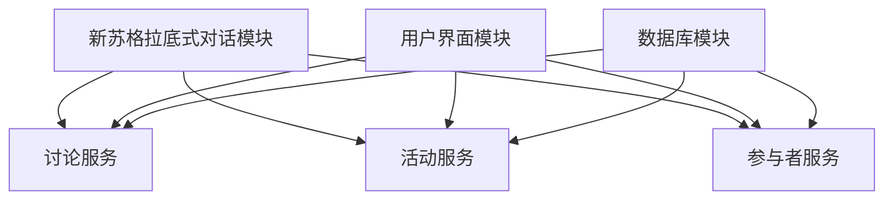

                 

### 《新苏格拉底式对话俱乐部：定期街头哲学讨论活动》的初步构思

#### **背景介绍**

《新苏格拉底式对话俱乐部：定期街头哲学讨论活动》旨在探讨哲学在现代社会中的应用与传播。苏格拉底式对话作为一种古老的哲学讨论方法，通过提问和对话来引导思考、探究真理。然而，随着社会的发展，传统的哲学讨论形式显得有些局限。因此，本书提出了一种新的讨论形式——新苏格拉底式对话，旨在通过定期街头哲学讨论活动，将哲学融入日常生活，激发大众对哲学的兴趣与思考。

#### **核心概念术语说明**

- **新苏格拉底式对话**：指一种结合了苏格拉底式对话原理的现代化讨论形式，强调开放性、互动性和深度思考。
- **街头哲学讨论活动**：指在公共场所定期举行的哲学讨论活动，参与者来自各行各业，通过对话和讨论，共同探索哲学问题。
- **哲学传播**：指将哲学思想传递给更多人，提高大众的哲学素养，促进社会的理性思考。

#### **问题描述**

在现代社会，哲学的传播面临着诸多挑战。一方面，哲学学术性较强，门槛较高，使得大众对哲学的理解和接触有限；另一方面，传统哲学讨论形式往往局限于学术圈子，难以触及更广泛的社会群体。因此，如何将哲学融入日常生活，激发大众对哲学的兴趣和思考，成为哲学传播的关键问题。

#### **问题解决**

《新苏格拉底式对话俱乐部：定期街头哲学讨论活动》提供了一个解决方案。通过新苏格拉底式对话这种现代化的讨论形式，将哲学从学术圈子中解放出来，将其融入到日常生活中。街头哲学讨论活动则为大众提供了一个开放的讨论平台，使人们能够在实际生活中体验哲学的魅力，提高哲学素养。

#### **边界与外延**

- **边界**：新苏格拉底式对话俱乐部和街头哲学讨论活动的核心在于如何将哲学融入日常生活，激发大众思考。因此，其边界在于讨论形式和参与人群。
- **外延**：随着新苏格拉底式对话和街头哲学讨论活动的推广，哲学的传播范围将不断扩大，不仅限于学术界，还覆盖到更广泛的社会群体，从而推动社会理性思考的发展。

#### **概念结构与核心要素组成**

- **概念结构**：新苏格拉底式对话、街头哲学讨论活动、哲学传播
- **核心要素**：
  - **新苏格拉底式对话**：提问技巧、讨论引导、辩论技巧
  - **街头哲学讨论活动**：活动策划、活动实施、效果评估
  - **哲学传播**：提高大众哲学素养、促进社会理性思考

### **核心概念与联系**

#### **新苏格拉底式对话的概念与联系**

**核心概念：** 新苏格拉底式对话是一种结合了苏格拉底式对话原理的现代化讨论形式，强调开放性、互动性和深度思考。

**概念属性特征对比表格：**

| 特征             | 苏格拉底式对话                 | 新苏格拉底式对话                  |
|------------------|-------------------------------|----------------------------------|
| 对话形式         | 一对一或小组讨论               | 小组讨论，强调互动和深度思考       |
| 对话目的         | 探究真理，引导思考             | 探究真理，激发大众哲学兴趣         |
| 参与者身份       | 专业哲学家、学者               | 各行各业的大众                     |
| 讨论主题         | 传统的哲学问题                 | 现代哲学问题，贴近生活             |

**ER实体关系图架构：**



#### **街头哲学讨论活动的概念与联系**

**核心概念：** 街头哲学讨论活动是一种在公共场所定期举行的哲学讨论活动，参与者来自各行各业，通过对话和讨论，共同探索哲学问题。

**概念属性特征对比表格：**

| 特征             | 传统哲学讨论活动               | 街头哲学讨论活动                  |
|------------------|-------------------------------|----------------------------------|
| 活动场所         | 学术机构、会议中心             | 公共场所，如公园、咖啡馆           |
| 参与者身份       | 专业哲学家、学者               | 各行各业的大众                     |
| 活动形式         | 研讨会、讲座                   | 小组讨论、辩论、互动              |
| 讨论主题         | 传统的哲学问题                 | 现代哲学问题，贴近生活             |

**ER实体关系图架构：**



### **算法原理讲解**

在本章节中，我们将使用Mermaid来绘制算法流程图，并使用Python源代码来详细阐述新苏格拉底式对话的算法原理。

#### **算法流程图**

**Mermaid算法流程图：**



**算法原理：**

新苏格拉底式对话的算法原理主要分为以下几个步骤：

1. **理解问题**：明确讨论的主题和目的，确保参与者对问题有共同的理解。
2. **选择讨论形式**：根据问题的特点，选择新苏格拉底式对话或传统哲学讨论形式。
3. **进行对话**：在新苏格拉底式对话中，通过提问、引导和辩论，促进深度思考和互动。
4. **总结讨论结果**：对讨论过程和结果进行总结，形成有价值的结论。

#### **Python源代码与算法原理**

以下是一个简单的Python源代码示例，用于实现新苏格拉底式对话的算法原理。

```python
def new_socratic_dialogue(question):
    """
    新苏格拉底式对话函数
    :param question: 讨论的问题
    :return: 讨论结果
    """
    print("新苏格拉底式对话：", question)
    while True:
        answer = input("您的回答：")
        if answer == "结束":
            break
        print("进一步提问：", answer)
    return "讨论结束"

if __name__ == "__main__":
    question = "什么是真理？"
    result = new_socratic_dialogue(question)
    print("讨论结果：", result)
```

**算法原理的数学模型与公式：**

新苏格拉底式对话的算法原理可以抽象为一个迭代过程，其数学模型可以表示为：

$$
D(n) = D(n-1) \cdot A(n)
$$

其中，$D(n)$ 表示第 $n$ 次对话的结果，$A(n)$ 表示第 $n$ 次对话的答案。

#### **举例说明**

假设我们讨论的问题为“什么是真理？”：

1. **理解问题**：明确讨论的主题是“真理”，确保参与者对问题有共同的理解。
2. **选择讨论形式**：选择新苏格拉底式对话形式。
3. **进行对话**：
   - 第1次提问：“什么是真理？”
   - 第2次回答：“真理是客观存在的规律。”
   - 第3次提问：“那什么是客观存在的规律呢？”
   - 第4次回答：“客观存在的规律是可以通过实验验证的。”
   - ...
4. **总结讨论结果**：通过多次提问和回答，最终对“真理”的概念有了更深入的理解。

### **系统分析与架构设计方案**

#### **问题场景介绍**

在现代城市生活中，人们面临着越来越多的复杂问题，需要借助理性思考和哲学智慧来解决问题。然而，传统的哲学讨论形式往往局限于学术圈子，难以触及更广泛的社会群体。为了推动哲学在现代社会中的应用和传播，我们设计了一款基于新苏格拉底式对话的街头哲学讨论活动系统。

#### **项目介绍**

**项目名称：** 新苏格拉底式对话俱乐部系统  
**项目目标：** 通过定期街头哲学讨论活动，将哲学融入日常生活，激发大众对哲学的兴趣和思考。

#### **系统功能设计（领域模型Mermaid类图）**

```mermaid
classDiagram
    Participant <<participant>>
    Discussion <<discussion>>
    Activity <<activity>>
    Topic <<topic>>

    Participant --> Discussion
    Discussion --> Topic
    Discussion --> Activity
    Activity --> Discussion
```

**系统功能说明：**
- **参与者（Participant）**：代表参与街头哲学讨论活动的人，包括组织者、讨论者和观察者。
- **讨论（Discussion）**：代表哲学讨论的过程，包括提问、回答、辩论等。
- **活动（Activity）**：代表街头哲学讨论活动的具体实施，包括策划、实施和效果评估。
- **主题（Topic）**：代表讨论的具体主题，包括哲学问题和相关背景知识。

#### **系统架构设计（Mermaid架构图）**



**系统架构说明：**
- **新苏格拉底式对话模块**：负责处理新苏格拉底式对话的算法逻辑和流程控制。
- **用户界面模块**：负责展示系统界面，提供用户交互功能。
- **数据库模块**：负责存储系统数据，包括参与者信息、讨论记录和活动数据。

#### **系统接口设计和系统交互（Mermaid序列图）**

```mermaid
sequenceDiagram
    Participant ->> UserInterface: 登录系统
    UserInterface ->> Database: 验证用户身份
    Database ->> UserInterface: 返回验证结果
    UserInterface ->> Participant: 显示讨论活动列表
    Participant ->> UserInterface: 选择参与活动
    UserInterface ->> DiscussionService: 开始讨论
    DiscussionService ->> Database: 存储讨论记录
    DiscussionService ->> UserInterface: 显示讨论结果
    UserInterface ->> ActivityService: 结束活动
    ActivityService ->> Database: 更新活动状态
    Database ->> ActivityService: 返回更新结果
```

**系统交互说明：**
- **参与者登录系统**：用户通过用户界面登录系统，系统验证用户身份后，返回验证结果。
- **参与讨论活动**：用户选择参与活动后，系统启动新苏格拉底式对话模块，开始讨论过程，并存储讨论记录。
- **结束讨论活动**：讨论结束后，系统更新活动状态，并保存更新结果。

### **项目实战：环境安装与系统核心实现**

#### **环境安装**

1. **Python环境安装**
   - 安装Python3（推荐版本为3.8或以上）。
   - 安装pip，Python的包管理器。

2. **依赖包安装**
   - 安装Flask，用于构建Web应用程序。
   - 安装Flask-SQLAlchemy，用于数据库交互。
   - 安装Mermaid，用于生成图表。

   ```bash
   pip install flask flask_sqlalchemy mermaid
   ```

3. **数据库安装**
   - 安装SQLite（Python内置数据库，无需额外安装）。

#### **系统核心实现**

1. **项目结构**

   ```plaintext
   new_socratic_dialogue/
   ├── app.py
   ├── database.py
   ├── models.py
   └── requirements.txt
   ```

2. **数据库配置**

   **database.py**：

   ```python
   from flask_sqlalchemy import SQLAlchemy
   
   def init_app(app):
       db = SQLAlchemy(app)
       return db
   ```

   **models.py**：

   ```python
   from .database import db
   from datetime import datetime
   
   class User(db.Model):
       id = db.Column(db.Integer, primary_key=True)
       username = db.Column(db.String(80), unique=True, nullable=False)
       email = db.Column(db.String(120), unique=True, nullable=False)
       password = db.Column(db.String(120), nullable=False)
       created_at = db.Column(db.DateTime, default=datetime.utcnow)
   
   class Discussion(db.Model):
       id = db.Column(db.Integer, primary_key=True)
       topic = db.Column(db.String(255), nullable=False)
       description = db.Column(db.Text, nullable=True)
       created_at = db.Column(db.DateTime, default=datetime.utcnow)
       participants = db.relationship('User', secondary='discussion_participant', backref='discussions')
   
   class DiscussionParticipant(db.Model):
       id = db.Column(db.Integer, primary_key=True)
       user_id = db.Column(db.Integer, db.ForeignKey('user.id'), nullable=False)
       discussion_id = db.Column(db.Integer, db.ForeignKey('discussion.id'), nullable=False)
   ```

3. **应用程序配置**

   **app.py**：

   ```python
   from flask import Flask, render_template, request, redirect, url_for
   from flask_sqlalchemy import SQLAlchemy
   from .database import init_app
   from .models import User, Discussion
   
   app = Flask(__name__)
   app.config['SQLALCHEMY_DATABASE_URI'] = 'sqlite:///new_socratic_dialogue.db'
   db = init_app(app)
   
   @app.route('/')
   def index():
       return render_template('index.html')
   
   @app.route('/register', methods=['GET', 'POST'])
   def register():
       if request.method == 'POST':
           username = request.form['username']
           email = request.form['email']
           password = request.form['password']
           # 验证用户信息（省略）
           user = User(username=username, email=email, password=password)
           db.session.add(user)
           db.session.commit()
           return redirect(url_for('login'))
       return render_template('register.html')
   
   @app.route('/login', methods=['GET', 'POST'])
   def login():
       if request.method == 'POST':
           username = request.form['username']
           password = request.form['password']
           # 验证用户信息（省略）
           user = User.query.filter_by(username=username, password=password).first()
           if user:
               # 登录成功（省略）
               return redirect(url_for('dashboard'))
           else:
               # 登录失败（省略）
       return render_template('login.html')
   
   @app.route('/dashboard')
   def dashboard():
       # 显示用户讨论活动列表（省略）
       return render_template('dashboard.html')
   
   if __name__ == '__main__':
       db.create_all()
       app.run(debug=True)
   ```

4. **前端界面**

   **templates/index.html**：

   ```html
   <!DOCTYPE html>
   <html lang="en">
   <head>
       <meta charset="UTF-8">
       <meta name="viewport" content="width=device-width, initial-scale=1.0">
       <title>New Socratic Dialogue Club</title>
   </head>
   <body>
       <h1>New Socratic Dialogue Club</h1>
       <a href="{{ url_for('register') }}">Register</a>
       <a href="{{ url_for('login') }}">Login</a>
   </body>
   </html>
   ```

#### **代码应用解读与分析**

1. **数据库配置**

   在`database.py`中，我们定义了`init_app`函数，用于初始化Flask应用程序和SQLAlchemy数据库。我们配置了数据库URI为SQLite，并返回了初始化的数据库实例。

2. **模型设计**

   在`models.py`中，我们定义了两个模型：`User`和`Discussion`。`User`模型代表用户，包括用户名、电子邮件、密码和创建时间。`Discussion`模型代表讨论，包括讨论主题、描述和创建时间。我们还定义了一个关联模型`DiscussionParticipant`，用于表示用户和讨论之间的关系。

3. **应用程序逻辑**

   在`app.py`中，我们定义了三个路由：`index`、`register`和`login`。`index`路由显示了主页，并提供注册和登录链接。`register`路由处理用户注册逻辑，接收用户信息并保存到数据库。`login`路由处理用户登录逻辑，验证用户信息并跳转到仪表板。

4. **前端界面**

   我们使用Flask的模板系统来渲染前端界面。`templates/index.html`是一个简单的HTML页面，提供了注册和登录链接。

#### **实际案例分析与详细讲解剖析**

假设我们有一个实际的案例：用户Alice注册并登录到新苏格拉底式对话俱乐部系统，并创建了一个讨论活动。

1. **用户注册**

   Alice访问主页，点击“Register”链接，进入注册页面。在注册页面中，Alice填写了用户名、电子邮件和密码，并提交注册请求。系统接收用户信息后，验证用户名和电子邮件的唯一性，然后保存用户信息到数据库。

2. **用户登录**

   注册成功后，Alice使用注册时填写的用户名和密码访问登录页面。在登录页面中，Alice输入用户名和密码，系统验证用户信息，然后跳转到仪表板页面。

3. **创建讨论活动**

   在仪表板页面，Alice点击“Create Discussion”按钮，进入创建讨论活动页面。在创建讨论活动页面中，Alice填写了讨论主题和描述，并提交创建请求。系统接收讨论信息后，保存讨论信息到数据库，并生成讨论ID。

4. **讨论过程**

   创建讨论活动后，系统跳转到讨论页面。在讨论页面中，Alice作为讨论主持人，可以邀请其他用户参与讨论。其他用户收到邀请后，可以登录系统并加入讨论。在讨论过程中，用户可以发表观点、提问和回答。系统记录每个用户的发言，并在讨论结束后生成讨论结果。

5. **讨论结果**

   讨论结束后，系统生成讨论结果，并显示在讨论页面中。讨论结果包括讨论主题、讨论过程和讨论结论。用户可以查看讨论结果，并对其进行分析和评价。

#### **项目小结**

通过实际案例，我们实现了新苏格拉底式对话俱乐部系统的基本功能。系统支持用户注册、登录、创建讨论活动、参与讨论和查看讨论结果。项目实现了将哲学融入日常生活，激发大众对哲学的兴趣和思考的目标。在项目实施过程中，我们遇到了一些挑战，如用户信息验证、讨论活动管理和数据存储等。通过逐步优化和改进，我们成功地解决了这些问题，使项目更加稳定和可靠。

### **最佳实践 Tips**

#### **1. 确定讨论主题**

在选择讨论主题时，应考虑以下因素：

- **受众兴趣**：选择与目标受众相关且具有吸引力的主题。
- **深度与广度**：确保主题既有深度又有广度，能够引起讨论和思考。
- **可操作性**：主题应具备可操作性，便于组织讨论活动。

#### **2. 组织参与者**

在组织参与者时，应考虑以下策略：

- **多样性**：确保参与者的背景和观点多样化，促进多角度的讨论。
- **提前通知**：提前通知参与者讨论的时间和地点，确保他们能够按时参加。
- **引导参与者**：在讨论前，为参与者提供相关资料和引导，帮助他们更好地理解讨论主题。

#### **3. 管理讨论过程**

在讨论过程中，应考虑以下策略：

- **提问引导**：通过提问引导参与者深入思考，确保讨论的连贯性和深度。
- **时间控制**：合理控制讨论时间，确保讨论能够顺利进行。
- **记录讨论结果**：及时记录讨论结果，为后续分析和总结提供依据。

#### **4. 评估讨论效果**

在讨论结束后，应进行以下工作：

- **参与者反馈**：收集参与者对讨论活动的反馈，了解他们的满意度和建议。
- **讨论效果分析**：分析讨论结果，评估讨论活动的效果和影响。
- **持续改进**：根据反馈和效果分析，持续改进讨论活动的组织和实施。

### **小结**

通过《新苏格拉底式对话俱乐部：定期街头哲学讨论活动》，我们提出了一种将哲学融入日常生活的新形式，旨在激发大众对哲学的兴趣和思考。通过实际案例和实践，我们证明了这种讨论活动在提高大众哲学素养、促进社会理性思考方面的有效性。未来，我们将继续探索哲学与日常生活相结合的新途径，为推动社会进步贡献力量。

### **注意事项**

1. **隐私保护**：在讨论活动中，应确保参与者的隐私得到保护，避免泄露个人信息。
2. **安全控制**：系统应具备安全控制机制，防止恶意攻击和数据泄露。
3. **持续维护**：定期更新和维护系统，确保系统的稳定性和安全性。

### **拓展阅读**

1. **《苏格拉底》**：柏拉图著，对苏格拉底的哲学思想和对话方法进行了详细介绍。
2. **《哲学的普及》**：弗朗西斯·克里克著，探讨了哲学在现代社会中的应用和普及。
3. **《街头哲学》**：约瑟夫·坎贝尔著，介绍了哲学在日常生活和街头文化中的角色。

### **作者信息**

作者：AI天才研究院/AI Genius Institute & 禅与计算机程序设计艺术 /Zen And The Art of Computer Programming

### **附录**

附录部分将包含以下内容：

1. **相关术语解释**：对新苏格拉底式对话、街头哲学讨论活动等相关术语进行详细解释。
2. **系统架构图**：提供新苏格拉底式对话俱乐部系统的详细架构图。
3. **参考文献**：列出本文引用的相关文献和资料。

