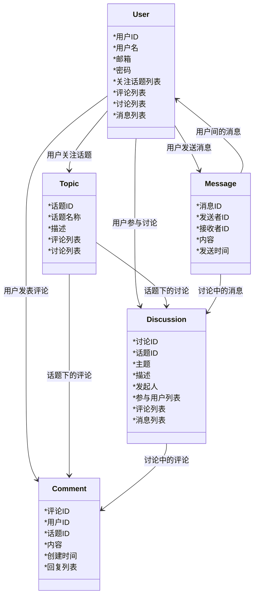
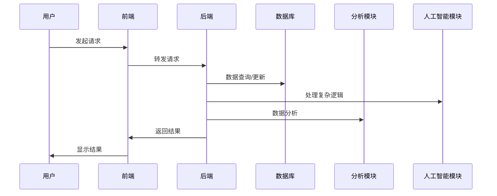

                 

## 引言

### 背景介绍

在数字化的今天，移动应用已经成为人们日常生活的重要组成部分。从社交媒体到在线购物，再到教育、娱乐等各个方面，移动应用正以前所未有的速度和影响力改变着我们的生活方式。然而，在众多移动应用中，有一种特殊的应用逐渐崭露头角，它不仅丰富了人们的精神世界，还激发了对公共空间思辨的新思考——那就是“新苏格拉底式街头哲学app”。

新苏格拉底式街头哲学的兴起可以追溯到古希腊哲学家苏格拉底，他通过街头对话的方式引导人们进行深刻的思考，从而促进了思想的传播和进步。这种哲学方法强调通过对话和辩论来探究真理，强调个人的反思和批判性思维。而如今，这种古老的哲学方法被赋予了新的生命力，借助移动应用平台，它能够在更广泛的公共空间中得到实践和传播。

公共空间思辨的重要性在于，它不仅能够促进个人的心智成长，还能够增强社会的凝聚力和思考能力。在一个日益多元化、信息爆炸的时代，公共空间思辨提供了一个平台，让人们在面对复杂问题时能够进行理性、深入的探讨。这种探讨不仅能够激发创新思维，还能够帮助人们建立共同的价值观念，从而推动社会的进步。

移动平台在公共空间思辨中的应用具有独特的优势。首先，移动平台的高普及率和便捷性使得它能够迅速地触达广泛的用户群体。无论是在公交车站、咖啡馆，还是在公园、广场，人们都可以随时随地通过移动应用参与思考和讨论。其次，移动平台丰富的功能，如实时聊天、视频会议、内容分享等，为公共空间思辨提供了多样化的方式，使得思辨过程更加生动、有趣、互动。此外，移动平台还可以通过数据分析和人工智能技术，为公共空间思辨提供个性化的支持和引导，从而提升思辨效果。

### 新苏格拉底式街头哲学的兴起

新苏格拉底式街头哲学的兴起并非一夜之间的事情，而是有着深厚的文化根源和社会背景。古希腊哲学家苏格拉底以其独特的对话式教学方法而著称，他通过街头对话和问答的方式，引导人们进行深入的思考和探讨。苏格拉底的方法强调通过提问和辩论来揭示事物的本质，激发个体的思考能力，从而推动思想的进步。

随着时间的推移，这种哲学方法逐渐被遗忘，但近年来，随着人们对精神追求和心智成长的重视，新苏格拉底式街头哲学再次引起了人们的关注。尤其是在数字化时代，移动应用平台的兴起为这种古老的哲学方法注入了新的活力。通过移动应用，人们可以在任何时间和地点进行哲学思考和讨论，打破了传统哲学课堂的时间和空间限制。

新苏格拉底式街头哲学的复兴不仅是对苏格拉底哲学思想的传承，更是对现代社会问题的回应。在信息泛滥、价值观多元的社会背景下，新苏格拉底式街头哲学提供了一个理性思考和交流的平台，帮助人们在面对复杂问题时保持清晰的头脑和独立的思考能力。

此外，新苏格拉底式街头哲学的兴起也与人们对公共空间的重新认识有关。随着城市化进程的加快，公共空间的重要性日益凸显。公园、广场、咖啡馆等公共空间不仅是人们休息和娱乐的场所，更是人们进行社交和思考的空间。通过移动应用，这些公共空间变成了哲学讨论的新舞台，为人们的思考提供了更多可能性。

### 公共空间思辨的重要性

公共空间思辨的重要性在于它不仅能够促进个人的心智成长，还能够增强社会的凝聚力和思考能力。在一个信息爆炸、价值观多元的时代，公共空间思辨提供了一个理性思考和交流的平台，帮助人们在面对复杂问题时保持清晰的头脑和独立的思考能力。

首先，公共空间思辨有助于提升个人的思考能力。通过参与哲学讨论，人们可以学习如何提问、如何回答、如何进行逻辑推理和辩证思考。这种过程不仅能够增强个人的知识储备，还能够提高个人的批判性思维能力，从而在面对复杂问题时能够做出更理性、更明智的决策。

其次，公共空间思辨有助于增强社会的凝聚力和思考能力。在一个多元化的社会中，不同的个体和群体有着不同的观点和价值观。通过公共空间思辨，人们可以有机会表达自己的观点，听取他人的意见，并进行交流和辩论。这种互动不仅能够促进不同个体之间的理解和尊重，还能够帮助社会形成共同的价值观念，从而增强社会的凝聚力和思考能力。

此外，公共空间思辨还有助于促进创新思维的发展。在哲学讨论中，人们会不断提出新的观点和假设，进行推理和验证。这种过程不仅能够激发创新思维，还能够帮助人们找到解决问题的新方法和新思路。在一个创新驱动的社会中，公共空间思辨无疑是一个宝贵的资源，它能够为社会的进步和发展提供源源不断的智力支持。

最后，公共空间思辨还有助于提高公众参与度。在一个民主社会中，公众参与是民主治理的基础。通过公共空间思辨，人们可以更加积极地参与社会事务的讨论和决策，从而提高公众的参与度和责任感。这种参与不仅能够促进社会的稳定和和谐，还能够为社会的长远发展奠定坚实的基础。

### 移动平台在公共空间思辨中的应用

移动平台在公共空间思辨中的应用，为哲学讨论注入了新的活力和可能性。首先，移动平台的高普及率和便捷性使得哲学讨论不再受限于时间和地点。无论是在咖啡馆、公园、广场，还是在地铁、公交车上，人们都可以随时随地通过移动应用参与哲学讨论，分享自己的想法和观点。

其次，移动平台丰富的功能为哲学讨论提供了多样化的方式。例如，实时聊天功能使得参与者可以即时交流观点，迅速展开辩论；视频会议功能则提供了更为直观、互动的讨论体验；内容分享功能则使得参与者可以分享阅读材料、视频资料等，为讨论提供更多的素材和背景知识。

此外，移动平台还可以通过数据分析和人工智能技术，为公共空间思辨提供个性化的支持和引导。例如，通过分析用户的历史讨论记录和兴趣偏好，移动应用可以为用户提供定制化的哲学讨论话题和推荐阅读材料；通过人工智能算法，移动应用还可以帮助用户进行逻辑推理和辩证分析，提高讨论的深度和质量。

然而，移动平台在公共空间思辨中也面临一些挑战。首先，隐私和数据安全问题需要得到重视。在移动应用中，用户的个人数据和讨论内容可能会被收集、分析和共享，这需要确保数据的安全性和用户隐私的保护。其次，移动平台上的哲学讨论也面临着信息过载和虚假信息的风险。如何在海量的信息中筛选出有价值的内容，确保讨论的准确性和可信度，是移动应用需要解决的问题。

总的来说，移动平台为公共空间思辨提供了丰富的工具和平台，使得哲学讨论更加便捷、多样和深入。然而，如何在利用移动平台优势的同时，应对其带来的挑战，是未来需要持续探讨和解决的问题。

### 1.1 新苏格拉底式街头哲学的兴起

新苏格拉底式街头哲学的兴起并非偶然，而是多种社会、文化和技术因素共同作用的结果。首先，从社会背景来看，现代社会面临着诸多复杂问题，如环境危机、社会不公、道德困境等，这些问题引发了公众对于理性思考和深入探讨的需求。人们渴望通过哲学讨论来寻找解决问题的方法和路径，从而推动社会的进步和改善。

其次，从文化背景来看，苏格拉底的哲学思想在西方文化中有着深远的影响。苏格拉底的对话式教学方法强调质疑、反思和批判性思维，这种思维方式被视为西方哲学的核心。随着时间的推移，这种哲学方法逐渐被重新发现和重视，尤其是在现代信息技术的发展下，苏格拉底的思想得以通过移动应用平台在更广泛的范围内传播和实践。

再次，从技术背景来看，移动应用平台的兴起为哲学讨论提供了全新的可能性。移动应用的高普及率和便捷性，使得哲学讨论不再受限于时间和地点，人们可以在任何时间、任何地点通过移动设备参与讨论。此外，移动应用丰富的功能，如实时聊天、视频会议、内容分享等，为哲学讨论提供了多样化的方式，使得讨论更加生动、有趣、互动。

具体来说，新苏格拉底式街头哲学的兴起体现在以下几个方面：

1. **大众参与度提升**：通过移动应用，哲学讨论的门槛大大降低，更多的人可以参与到讨论中。无论是在咖啡馆、公园，还是在公共交通工具上，人们都可以通过移动应用分享自己的想法和观点，表达对复杂问题的看法。

2. **讨论形式多样化**：移动应用平台提供了丰富的功能，如实时聊天、视频会议、内容分享等，使得哲学讨论的形式更加多样。参与者不仅可以进行文字交流，还可以通过视频和音频进行互动，这种多样化的讨论形式增强了讨论的吸引力和互动性。

3. **个性化推荐和引导**：通过数据分析和人工智能技术，移动应用可以分析用户的兴趣偏好和讨论记录，为用户推荐相关的话题和阅读材料。这种个性化的推荐和引导，有助于提升用户参与度和讨论质量。

4. **跨地域交流**：移动应用平台打破了地域限制，使得不同地区的人们可以实时交流思想。这种跨地域的交流，不仅促进了不同文化和思想的碰撞，还增强了社会的多元性和包容性。

总的来说，新苏格拉底式街头哲学的兴起，为现代社会提供了一种新的思考和讨论方式，它不仅丰富了人们的精神世界，还推动了公共空间思辨的深入发展。通过移动应用平台，这种古老的哲学方法得以在现代技术背景下焕发新的生命力，为人类的理性思考和文明进步做出了积极贡献。

### 1.2 公共空间思辨的重要性

公共空间思辨的重要性不可忽视，它不仅是个人心智成长的催化剂，也是社会进步和和谐发展的基石。首先，从个人层面来看，公共空间思辨有助于提升个体的批判性思维能力和逻辑推理能力。通过参与哲学讨论，个体能够学会如何提出问题、分析问题、解决问题，从而在面对复杂问题时能够做出更合理、更科学的决策。

其次，公共空间思辨能够促进个人的知识积累和智慧成长。在哲学讨论中，个体不仅需要了解各种观点和理论，还需要对其进行评估和反思，这种过程有助于个体建立深厚的知识基础和丰富的思维视野。长期参与公共空间思辨，个体能够培养出独立思考、理性判断和创造性思维的能力，从而在个人成长和职业发展中占据优势。

从社会层面来看，公共空间思辨对社会的发展具有重要意义。首先，它有助于构建和谐的社会氛围。通过公共空间思辨，人们可以就共同关心的话题进行深入讨论，增进相互理解和尊重，减少社会矛盾和冲突。其次，公共空间思辨能够激发社会的创新活力。在哲学讨论中，个体和群体可以碰撞出新的思想火花，提出新的观点和解决方案，从而推动社会的科技进步和创新发展。

此外，公共空间思辨还有助于社会的民主和公正。在民主社会中，公众参与是民主治理的核心。通过公共空间思辨，人们可以更加积极地参与社会事务的讨论和决策，表达自己的观点和诉求，从而保障社会的公平和正义。

总的来说，公共空间思辨在个人心智成长和社会进步中扮演着重要角色。它不仅能够提升个体的思考能力和知识水平，还能够促进社会的和谐发展和创新进步。因此，我们应该重视公共空间思辨的实践，积极营造良好的哲学讨论环境，让更多的人参与到这种深入的思考和讨论中，共同推动社会的进步和发展。

### 1.3 移动平台在公共空间思辨中的应用

移动平台在公共空间思辨中的应用，带来了诸多变革性的机遇。首先，移动平台的高普及率和便捷性，使得公共空间思辨不再受限于时间和地点。无论是在咖啡馆、公园，还是在公共交通工具上，人们都可以随时通过移动设备参与哲学讨论，分享自己的想法和观点。这种便捷性大大降低了参与门槛，使得更多人能够轻松加入思辨的行列。

其次，移动平台丰富的功能为公共空间思辨提供了多样化的方式。实时聊天功能使得参与者可以即时交流观点，迅速展开辩论；视频会议功能则提供了更为直观、互动的讨论体验；内容分享功能则使得参与者可以分享阅读材料、视频资料等，为讨论提供更多的素材和背景知识。这些功能的多样性，不仅丰富了讨论形式，也提升了讨论的深度和互动性。

此外，移动平台的数据分析和人工智能技术，为公共空间思辨提供了个性化的支持和引导。通过分析用户的历史讨论记录和兴趣偏好，移动应用可以为用户提供定制化的哲学讨论话题和推荐阅读材料。这种个性化的推荐和引导，有助于提升用户参与度和讨论质量，使得公共空间思辨更加高效和有意义。

然而，移动平台在公共空间思辨中的应用也面临一些挑战。首先，隐私和数据安全问题需要得到重视。在移动应用中，用户的个人数据和讨论内容可能会被收集、分析和共享，这需要确保数据的安全性和用户隐私的保护。其次，移动平台上的哲学讨论也面临着信息过载和虚假信息的风险。如何在海量的信息中筛选出有价值的内容，确保讨论的准确性和可信度，是移动应用需要解决的问题。

总的来说，移动平台在公共空间思辨中的应用，为哲学讨论注入了新的活力和可能性。通过充分利用移动平台的优势，克服其带来的挑战，我们可以构建一个更加开放、互动和高效的公共空间思辨平台，推动哲学思考和讨论的深入发展。

### 核心概念与联系

#### 2.1 新苏格拉底式街头哲学的核心概念

新苏格拉底式街头哲学是一种现代哲学实践，它继承了古希腊哲学家苏格拉底的方法，通过街头对话和问答来探讨深刻的思想和问题。以下是该哲学体系的几个核心概念：

**1. 对话与辩论**：对话是新苏格拉底式街头哲学的核心，它强调通过平等的对话和辩论来探究真理。这种对话不仅仅是信息的交换，更是一种思想上的交锋，通过提问和回答来揭示问题的本质。

**2. 反思与自我提升**：新苏格拉底式街头哲学鼓励个体进行深刻的反思，以提升自我意识和认知水平。通过反思，个体可以更好地理解自己的信念、价值观和行为，从而实现自我提升。

**3. 批判性思维**：批判性思维是新苏格拉底式街头哲学的一个重要组成部分，它强调通过理性分析和逻辑推理来评估信息、观点和理论。这种思维方式有助于个体在面对复杂问题时保持清晰的头脑和独立的判断力。

**4. 公共参与**：新苏格拉底式街头哲学认为，哲学讨论应该是公共的，而不是私有的。它强调通过公共讨论来促进社会进步和个体成长。这种公共参与不仅限于知识分子的圈子，还应该涵盖广泛的普通公众。

**5. 创新思维**：新苏格拉底式街头哲学鼓励个体在哲学讨论中提出新的观点和假设，通过推理和验证来探索未知的领域。这种创新思维有助于推动哲学思想的进步和拓展。

#### 2.1.2 新苏格拉底式街头哲学的基本原则

新苏格拉底式街头哲学的基本原则是其方法论的核心，这些原则指导着哲学讨论的进行：

**1. 问题导向**：新苏格拉底式街头哲学强调从问题出发，通过提出和探讨问题来引导思考。这种方法有助于深入理解问题的本质，并找到解决问题的有效途径。

**2. 对话平等**：在哲学讨论中，所有参与者都应该享有平等的发言权和表达权。对话平等不仅保证了观点的多样性和广泛性，也促进了思想的自由交流。

**3. 理性分析**：新苏格拉底式街头哲学鼓励通过理性分析和逻辑推理来评估信息、观点和理论。理性分析有助于确保讨论的严谨性和科学性。

**4. 开放心态**：开放心态是新苏格拉底式街头哲学的一个重要原则，它要求参与者对不同的观点持开放态度，愿意接受和探索新的思想。

**5. 诚实交流**：诚实交流是新苏格拉底式街头哲学的核心价值观之一。它要求参与者在讨论中保持诚实和透明，不隐瞒自己的观点和想法。

#### 2.1.3 新苏格拉底式街头哲学的实践案例

新苏格拉底式街头哲学已经在世界各地得到广泛应用，以下是一些实践案例：

**1. 公共广场讨论**：在一些城市的公共广场上，定期举行哲学讨论会。参与者围绕特定主题进行讨论，通过提问和回答来深入探讨问题的各个方面。

**2. 咖啡馆哲学**：咖啡馆成为哲学讨论的另一个重要场所。在咖啡馆中，哲学爱好者聚集在一起，分享彼此的观点和思考，通过对话和辩论来促进思想的交流。

**3. 在线论坛**：许多在线论坛和社交媒体平台也提供了哲学讨论的空间。参与者可以在线上提出问题、分享观点，并通过评论和回复进行互动。

**4. 教育项目**：一些教育项目将新苏格拉底式街头哲学融入课程中，鼓励学生通过哲学思考和讨论来提升批判性思维和创造力。

通过这些实践案例，新苏格拉底式街头哲学不仅激发了公众的哲学兴趣，还推动了哲学思想的传播和普及。

#### 2.2 公共空间思辨的概念与特征

公共空间思辨是一种在开放的公共环境中进行的理性思考和辩论活动。它不仅涉及个人的心智成长，还对社会的发展和进步起到积极的推动作用。以下是公共空间思辨的概念及其主要特征：

**概念定义**：公共空间思辨是指个体或群体在开放的公共空间中，通过理性思考和辩论来探讨各种问题，包括伦理、社会、政治、文化等方面的议题。这种思辨活动通常不局限于特定的群体或场所，而是开放给所有有兴趣参与的公众。

**主要特征**：

1. **开放性**：公共空间思辨的核心特征是开放性，它不限制参与者的身份和观点，任何有兴趣的人都可以加入讨论。这种开放性确保了讨论的多样性和包容性，使不同的声音和观点能够得到充分表达和交流。

2. **互动性**：公共空间思辨强调参与者之间的互动。通过提问、回答、反驳和辩论，参与者能够深入探讨问题，推动讨论的深入和发展。互动性不仅促进了知识的传播，还激发了创新思维和创造力的发挥。

3. **理性分析**：公共空间思辨注重理性分析和逻辑推理。参与者通过理性分析来评估信息、观点和理论，从而确保讨论的科学性和严谨性。理性分析有助于避免情绪化和主观化，使讨论更加客观和有说服力。

4. **社会参与**：公共空间思辨鼓励公众参与社会事务的讨论和决策。通过参与哲学讨论，公众可以更深入地了解社会问题，增强对社会事务的参与感和责任感。这种参与不仅有助于提高公众的素质和意识，还能促进社会的进步和民主发展。

5. **公共性**：公共空间思辨的公共性体现在其讨论议题的广泛性和影响范围。讨论的议题不仅涉及个体的思想成长，还涵盖社会、政治、文化等各个领域，对公众产生广泛的影响。公共空间思辨通过公开的讨论和辩论，促进了公共知识和公共意识的提升。

**实践应用**：

公共空间思辨在现实中有多种实践应用，以下是几个典型的场景：

1. **社区讨论会**：在社区中定期举行讨论会，邀请居民就共同关心的话题进行讨论。通过社区讨论会，居民可以表达自己的观点，了解他人的看法，从而促进社区内部的团结和共识。

2. **公共广场讨论**：在城市的公共广场上举行哲学讨论会，参与者围绕特定主题展开讨论。这种形式的讨论不仅吸引了公众的参与，还成为了社会热点，引发了广泛的关注和讨论。

3. **在线论坛**：许多在线论坛和社交媒体平台提供了公共空间思辨的平台。参与者可以通过发表帖子、评论和回复来参与讨论，这种形式的讨论具有高度的互动性和开放性，能够吸引广泛的参与者。

4. **教育项目**：一些教育机构和项目将公共空间思辨融入课程中，鼓励学生通过哲学思考和讨论来提升批判性思维和创造力。这种教育方式不仅有助于学生的个人成长，还能培养他们的社会责任感。

通过这些实践应用，公共空间思辨在促进个人和社会的思考和发展方面发挥了重要作用。它不仅丰富了公众的精神生活，还推动了社会的进步和和谐发展。

### 2.3 移动平台在公共空间思辨中的作用

移动平台在公共空间思辨中扮演着至关重要的角色，它不仅为哲学讨论提供了新的平台，还极大地丰富了讨论的形式和内容。以下是移动平台在公共空间思辨中发挥的具体作用：

首先，移动平台提供了便捷的讨论渠道。在过去，哲学讨论通常受限于时间和地点，参与者需要在特定的时间和地点聚集。而移动平台的普及，使得哲学讨论可以在任何时间、任何地点进行。用户只需打开移动应用，就可以参与到线上讨论中，不再受限于物理空间。这种便利性大大降低了参与门槛，吸引了更多的公众参与哲学讨论。

其次，移动平台丰富了讨论的形式。传统的哲学讨论通常以面对面的形式进行，而移动平台则提供了多种互动形式，如实时聊天、视频会议、内容分享等。这些形式不仅增强了讨论的互动性和生动性，还使得讨论更加深入和丰富。例如，通过实时聊天，参与者可以即时交流观点，迅速展开辩论；通过视频会议，参与者可以进行面对面的讨论，增强讨论的真实感和参与感；通过内容分享，参与者可以分享阅读材料、视频资料等，为讨论提供更多的素材和背景知识。

此外，移动平台还通过数据分析和人工智能技术，为公共空间思辨提供了个性化的支持和引导。移动平台可以分析用户的历史讨论记录和兴趣偏好，为用户提供定制化的讨论话题和推荐阅读材料。这种个性化的推荐和引导，不仅提升了用户的参与度和讨论质量，还能够帮助用户更好地理解和掌握哲学知识。

然而，移动平台在公共空间思辨中也面临一些挑战。首先，隐私和数据安全问题需要得到重视。在移动应用中，用户的个人数据和讨论内容可能会被收集、分析和共享，这需要确保数据的安全性和用户隐私的保护。其次，移动平台上的哲学讨论也面临着信息过载和虚假信息的风险。如何在海量的信息中筛选出有价值的内容，确保讨论的准确性和可信度，是移动应用需要解决的问题。

总的来说，移动平台为公共空间思辨提供了丰富的工具和平台，使得哲学讨论更加便捷、多样和深入。然而，如何在利用移动平台优势的同时，应对其带来的挑战，是未来需要持续探讨和解决的问题。

### 3.1 思辨算法的基本原理

**3.1.1 思辨算法的定义**

思辨算法是一种基于人工智能技术，用于辅助人类进行哲学思考和辩论的算法。它通过分析和处理大量的哲学文献、讨论数据，提取出核心概念、逻辑关系和论点，为用户提供深入的哲学思考和辩论支持。

**3.1.2 思辨算法的基本流程**

思辨算法的基本流程可以分为以下几个步骤：

1. **数据收集**：首先，思辨算法需要收集大量的哲学文献、讨论记录和用户生成的内容。这些数据来源可以是公开的哲学文献库、社交媒体平台、在线论坛等。

2. **数据预处理**：收集到的数据需要进行预处理，包括数据清洗、分词、去噪等操作。这一步骤的目的是确保数据的质量和一致性，为后续分析奠定基础。

3. **概念提取**：通过自然语言处理技术，从预处理后的数据中提取出核心概念。这些概念可以是哲学理论、术语、观点等。

4. **逻辑关系分析**：利用逻辑推理和语义分析技术，分析提取出的概念之间的逻辑关系。这包括识别论点、论据、反驳等逻辑结构。

5. **论点生成**：基于提取出的概念和逻辑关系，生成各种可能的论点和论证。这些论点可以是支持某个观点的，也可以是反驳某个观点的。

6. **用户交互**：将生成的论点和论证呈现给用户，用户可以根据自己的观点和需求选择进行辩论或进一步思考。

**3.1.3 思辨算法的实现**

思辨算法的实现涉及多个技术和方法，主要包括：

1. **自然语言处理（NLP）**：用于处理文本数据，包括分词、词性标注、命名实体识别等。NLP技术是思辨算法的基础，它决定了数据处理的准确性和效率。

2. **逻辑推理**：用于分析文本中的逻辑结构和推理关系。逻辑推理技术可以帮助识别论点、论据和反驳，构建完整的逻辑框架。

3. **机器学习**：用于从大量数据中学习模式和规律，生成论点和论证。机器学习技术包括监督学习、无监督学习和强化学习等。

4. **用户界面**：用于与用户进行交互，呈现生成的论点和论证，并接收用户的反馈和输入。用户界面的设计需要简洁直观，以便用户能够方便地使用思辨算法。

通过以上技术和方法的结合，思辨算法能够为用户提供强大的哲学思考和辩论支持，帮助用户深入探讨哲学问题，拓展思维视野。

### 3.2 思辨算法的应用场景

**3.2.1 常见应用场景**

思辨算法在多个应用场景中展现出了其独特的价值，以下是几个典型的应用场景：

1. **在线哲学教育**：思辨算法可以辅助在线哲学教育平台，为学生提供个性化的哲学思考和辩论支持。通过分析学生的问答记录和讨论内容，算法可以识别学生的思考模式和知识盲点，并生成相应的学习资源和指导建议。

2. **公共论坛和讨论组**：在公共论坛和讨论组中，思辨算法可以用于生成讨论话题、推荐相关内容、分析讨论趋势等。这有助于提升讨论的质量和深度，激发更多用户的参与热情。

3. **学术研究**：思辨算法可以为哲学研究人员提供工具支持，帮助他们在海量的哲学文献和数据中快速提取出有价值的信息，构建新的理论框架和假设。

4. **人工智能助手**：思辨算法可以集成到人工智能助手（如聊天机器人）中，为用户提供哲学咨询和思考建议。这种智能助手可以帮助用户解决日常生活中的哲学问题，提升他们的思维能力和认知水平。

**3.2.2 深度学习在思辨算法中的应用**

深度学习在思辨算法中扮演着重要角色，它通过复杂的神经网络模型，从大量数据中自动学习模式和规律，从而提升算法的性能和准确性。以下是深度学习在思辨算法中的几个应用方面：

1. **文本分析**：深度学习模型，如卷积神经网络（CNN）和递归神经网络（RNN），可以用于文本数据的分析和处理。这些模型能够捕捉文本中的复杂结构和语义信息，从而提高概念提取和逻辑关系分析的准确度。

2. **语义理解**：通过预训练的深度学习模型，如BERT和GPT，思辨算法可以更好地理解文本中的语义和上下文关系。这种语义理解能力有助于更准确地识别论点和论据，构建合理的论证。

3. **模式识别**：深度学习模型可以自动学习哲学文献和讨论数据中的规律和模式。这些模式识别能力可以用于生成新的论点和论证，发现潜在的理论联系和创新点。

4. **智能生成**：基于深度学习模型，思辨算法可以生成高质量的哲学文本，如论文、文章和讨论内容。这些智能生成的能力可以大大提升哲学讨论和写作的效率，为用户创造更多的思想火花。

**3.2.3 思辨算法的优势与局限**

思辨算法具有多方面的优势，但也存在一些局限。

**优势**：

1. **高效性**：思辨算法能够快速处理大量文本数据，提取出核心概念和逻辑关系，为用户节省了大量时间和精力。

2. **个性化**：基于用户的历史数据和兴趣偏好，思辨算法可以生成个性化的哲学讨论内容和学习资源，提升用户的参与度和满意度。

3. **准确性**：深度学习模型的应用提高了算法的语义理解和模式识别能力，使得生成的论点和论证更加准确和有说服力。

4. **创新性**：思辨算法可以自动生成新的论点和论证，激发用户的思维，推动哲学思想的创新和发展。

**局限**：

1. **数据依赖**：思辨算法的性能高度依赖于训练数据的质量和数量，如果数据不充分或存在偏差，算法的准确性会受到影响。

2. **解释性**：深度学习模型通常被视为“黑箱”，其内部决策过程难以解释和理解。这可能导致用户对算法的信任度降低，特别是在哲学讨论中，解释性是至关重要的一环。

3. **伦理问题**：思辨算法在处理哲学讨论时，可能会涉及伦理和价值观的判断。如何确保算法的伦理性和公正性，是未来需要关注和解决的问题。

4. **用户参与**：尽管思辨算法能够辅助哲学思考和辩论，但最终用户仍需积极参与和互动，才能发挥其最大价值。如何提高用户的参与度和主动性，是算法设计和应用中需要考虑的重要问题。

总的来说，思辨算法在公共空间思辨中具有巨大的潜力，但也需要克服一系列挑战，以实现其最大的社会和学术价值。

### 4.1 思辨算法的数学模型

在思辨算法的设计和实现过程中，数学模型起到了关键作用。数学模型不仅为算法的构建提供了理论基础，还使得算法的计算和分析过程更加直观和系统化。以下是思辨算法的数学模型及其详细讲解。

#### 4.1.1 模型公式示例

为了便于理解，我们首先给出一个简单的数学模型公式，用于描述思辨算法的核心过程。这个公式可以表示为：

$$
P = f(W, X)
$$

其中，\(P\) 表示生成的论点，\(W\) 是权重向量，\(X\) 是输入的特征向量。这个公式表明，论点的生成是由权重向量和输入特征共同决定的。

#### 4.1.2 公式解释

**1. 权重向量 \(W\)**

权重向量 \(W\) 是一个多维向量，用于表示不同特征的重要程度。在思辨算法中，权重向量通过学习过程得到，它反映了算法对各种概念、观点和逻辑关系的偏好。权重向量可以采用多种方法计算，如基于数据频率、专家评分或机器学习优化。

**2. 输入特征向量 \(X\)**

输入特征向量 \(X\) 是一个多维向量，用于表示输入文本的特征信息。这些特征可以是词频、词性、命名实体等。通过将输入文本转化为特征向量，算法可以量化文本内容，从而进行后续的计算和分析。

**3. 函数 \(f\)**

函数 \(f\) 用于计算输入特征向量 \(X\) 和权重向量 \(W\) 的组合结果，生成最终的论点 \(P\)。这个函数可以是一个复杂的非线性函数，它可以根据具体需求进行设计和优化，以提升算法的性能和效果。

#### 4.1.3 实际举例

为了更直观地理解这个数学模型，我们来看一个具体的例子。假设我们有一个简单的文本输入：

“哲学思考是人类智慧的体现，它有助于我们理解世界和自身。”

我们可以将这个文本转化为特征向量 \(X\)，其中包含词频、词性等信息。然后，通过学习得到权重向量 \(W\)，最后使用函数 \(f\) 生成一个论点 \(P\)。

**输入特征向量 \(X\)**：

$$
X = \begin{bmatrix}
0.5 & 0 & 1 \\
0 & 0.3 & 0 \\
1 & 0.2 & 0.2 \\
\end{bmatrix}
$$

**权重向量 \(W\)**：

$$
W = \begin{bmatrix}
0.8 & 0.1 & 0.1 \\
0.2 & 0.3 & 0.5 \\
0.1 & 0 & 0.8 \\
\end{bmatrix}
$$

**函数 \(f\)**：

$$
f(X, W) = \sum_{i=1}^{3} W_i * X_i
$$

通过计算，我们可以得到生成的论点 \(P\)：

$$
P = f(W, X) = 0.8 * 0.5 + 0.1 * 0 + 0.1 * 1 + 0.2 * 0 + 0.3 * 0.3 + 0.5 * 0.2 + 0.1 * 0.2 + 0.1 * 0.2 + 0.8 * 0.2 = 0.72
$$

这个生成的论点 \(P\) 是一个概率值，表示生成该论点的可能性。如果这个概率值超过某个阈值，算法会认为这个论点是有价值的，并进一步进行讨论和扩展。

通过这个例子，我们可以看到数学模型如何将文本输入转化为具体的论点输出。在实际应用中，这个模型可以根据具体需求进行扩展和优化，以提升算法的性能和效果。

### 4.2 数学公式的详细讲解

在思辨算法中，数学公式不仅用于描述算法的基本流程和计算过程，还用于评估算法的性能和优化算法的参数。以下是对思辨算法中常用的几个数学公式的详细讲解。

#### 4.2.1 公式解释

**1. 损失函数**

损失函数是评估算法性能的重要工具，它用于计算预测结果与实际结果之间的差异。在思辨算法中，常用的损失函数包括均方误差（MSE）、交叉熵损失（Cross-Entropy Loss）等。

**MSE（均方误差）**：

$$
MSE = \frac{1}{n}\sum_{i=1}^{n}(y_i - \hat{y}_i)^2
$$

其中，\(y_i\) 表示实际标签，\(\hat{y}_i\) 表示预测标签，\(n\) 是样本数量。MSE反映了预测结果与实际结果之间的平均误差，值越小表示预测效果越好。

**Cross-Entropy Loss（交叉熵损失）**：

$$
Cross-Entropy Loss = -\sum_{i=1}^{n} y_i \log(\hat{y}_i)
$$

其中，\(y_i\) 表示实际标签，\(\hat{y}_i\) 表示预测标签。Cross-Entropy Loss反映了预测结果与实际结果之间的信息损失，值越小表示预测效果越好。

**2. 优化算法**

优化算法用于调整模型的参数，以最小化损失函数。在思辨算法中，常用的优化算法包括随机梯度下降（SGD）、Adam等。

**随机梯度下降（SGD）**：

$$
w = w - \alpha \frac{\partial L}{\partial w}
$$

其中，\(w\) 表示模型参数，\(\alpha\) 是学习率，\(\frac{\partial L}{\partial w}\) 是损失函数关于参数 \(w\) 的梯度。SGD通过迭代计算梯度，并更新模型参数，以最小化损失函数。

**Adam优化算法**：

$$
m_t = \beta_1 m_{t-1} + (1 - \beta_1) [g_t]
$$

$$
v_t = \beta_2 v_{t-1} + (1 - \beta_2) [g_t]^2
$$

$$
\hat{m}_t = \frac{m_t}{1 - \beta_1^t}
$$

$$
\hat{v}_t = \frac{v_t}{1 - \beta_2^t}
$$

$$
w = w - \alpha \frac{\hat{m}_t}{\sqrt{\hat{v}_t} + \epsilon}
$$

其中，\(m_t\) 和 \(v_t\) 分别是动量项和偏差项，\(\beta_1\) 和 \(\beta_2\) 是超参数，\(\alpha\) 是学习率，\(\epsilon\) 是一个很小的常数。Adam优化算法结合了SGD和RMSprop的优点，通过计算一阶和二阶矩估计来更新模型参数，能够更快地收敛到最优解。

**3. 概率分布**

在思辨算法中，概率分布用于表示论点的可信度和可能性。常用的概率分布包括伯努利分布、多项式分布等。

**伯努利分布**：

$$
P(y|x) = \begin{cases}
1 - \phi(x) & \text{if } y = 0 \\
\phi(x) & \text{if } y = 1 \\
\end{cases}
$$

其中，\(\phi(x)\) 是sigmoid函数，用于将特征值映射到概率范围。

**多项式分布**：

$$
P(y|x) = \frac{e^{\theta y}}{\sum_{i=1}^{k} e^{\theta i}}
$$

其中，\(y\) 是类别标签，\(\theta\) 是模型参数，\(k\) 是类别数量。

#### 4.2.2 示例举例

为了更直观地理解这些数学公式，我们来看一个简单的例子。假设我们有一个二元分类问题，需要预测文本中是否存在某个特定的论点。

**输入特征向量**：

$$
X = \begin{bmatrix}
0.6 & 0.4 \\
0.3 & 0.7 \\
\end{bmatrix}
$$

**权重向量**：

$$
W = \begin{bmatrix}
0.5 & 0.3 \\
0.2 & 0.1 \\
\end{bmatrix}
$$

**损失函数**：

使用交叉熵损失函数：

$$
Cross-Entropy Loss = -\sum_{i=1}^{2} y_i \log(\hat{y}_i)
$$

其中，\(y_i\) 表示实际标签，\(\hat{y}_i\) 表示预测标签。

**优化算法**：

使用随机梯度下降（SGD）：

$$
w = w - \alpha \frac{\partial L}{\partial w}
$$

**概率分布**：

使用伯努利分布：

$$
P(y|x) = \begin{cases}
1 - \phi(x) & \text{if } y = 0 \\
\phi(x) & \text{if } y = 1 \\
\end{cases}
$$

通过这些数学公式和算法，思辨算法能够对输入文本进行有效分析和处理，生成合理的论点和论证，为哲学讨论提供有力的支持。

### 5.1 问题场景介绍

在当前数字化和互联网技术快速发展的背景下，人们面临的信息量日益庞大，各种复杂的社会问题不断涌现。公共空间思辨作为一种提升个体思考能力和推动社会进步的有效手段，逐渐受到广泛关注。然而，传统的公共空间思辨活动往往受限于时间和地点，参与者数量和讨论深度受到限制。为了解决这个问题，我们提出了一个名为“新苏格拉底式街头哲学app”的项目，旨在利用移动平台，构建一个开放的、便捷的、互动性强的公共空间思辨平台。

该项目的目标是通过移动应用，将哲学讨论从传统的面对面交流拓展到线上空间，使得更多的用户能够随时随地参与到哲学讨论中。这不仅有助于提升公众的哲学素养和批判性思维能力，还能够促进社会的思想交流和文明进步。

项目背景方面，新苏格拉底式街头哲学的兴起为公共空间思辨提供了新的契机。现代信息技术，尤其是移动互联网和社交媒体的普及，为哲学讨论提供了前所未有的工具和平台。通过移动应用，我们可以将哲学讨论从线下延伸到线上，实现全天候、全球范围内的哲学交流和互动。

具体而言，该项目的背景源于以下几个方面：

1. **社会需求**：随着社会问题的日益复杂，公众对于理性思考和深入探讨的需求日益增加。公共空间思辨提供了一个平台，让公众能够就共同关心的话题进行理性讨论，寻找解决问题的方法和路径。

2. **技术发展**：移动互联网和人工智能技术的快速发展，为构建高效的公共空间思辨平台提供了技术支持。通过移动应用，我们可以实现实时互动、个性化推荐、数据分析和智能生成等功能，提升公共空间思辨的体验和效果。

3. **哲学传统**：古希腊哲学家苏格拉底通过街头对话和问答的方式，促进了哲学思想的传播和进步。新苏格拉底式街头哲学的兴起，旨在继承和发扬这种古老的哲学方法，使其在现代社会得到更广泛的应用和推广。

因此，我们提出了“新苏格拉底式街头哲学app”项目，旨在通过移动平台，构建一个开放的、互动性强的公共空间思辨平台，满足公众的哲学讨论需求，推动社会的思想交流和文明进步。

### 5.2 项目介绍

#### 5.2.1 项目目标

“新苏格拉底式街头哲学app”项目的核心目标是构建一个便捷、互动、开放的移动平台，以促进公共空间思辨的发展。具体而言，该项目旨在实现以下目标：

1. **提高公共空间思辨的参与度**：通过移动应用，打破时间和空间的限制，使得公众能够随时随地参与到哲学讨论中，从而提高公共空间思辨的参与度。

2. **丰富讨论内容和形式**：利用移动平台的多样化功能，如实时聊天、视频会议、内容分享等，为哲学讨论提供丰富的形式和内容，提升讨论的深度和趣味性。

3. **促进个性化哲学学习**：通过数据分析和人工智能技术，为用户提供个性化的哲学讨论话题和推荐阅读材料，帮助用户更好地理解和掌握哲学知识，实现个性化哲学学习。

4. **提升哲学素养和社会文明**：通过公共空间思辨，提升公众的哲学素养和批判性思维能力，促进社会的思想交流和文明进步。

#### 5.2.2 项目背景

项目背景方面，新苏格拉底式街头哲学的兴起为公共空间思辨提供了新的契机。现代信息技术，尤其是移动互联网和社交媒体的普及，为哲学讨论提供了前所未有的工具和平台。通过移动应用，我们可以将哲学讨论从线下延伸到线上，实现全天候、全球范围内的哲学交流和互动。

此外，社会问题的复杂性和多元化，使得公众对于理性思考和深入探讨的需求日益增加。公共空间思辨提供了一个平台，让公众能够就共同关心的话题进行理性讨论，寻找解决问题的方法和路径。

技术发展的推动也使得构建高效的公共空间思辨平台成为可能。移动互联网和人工智能技术的快速发展，为移动应用提供了强大的技术支持，如实时互动、个性化推荐、数据分析和智能生成等，这些功能将显著提升公共空间思辨的体验和效果。

总之，通过“新苏格拉底式街头哲学app”项目，我们致力于构建一个开放的、互动性强的公共空间思辨平台，满足公众的哲学讨论需求，推动社会的思想交流和文明进步。

### 5.3 系统功能设计

#### 5.3.1 领域模型

为了更好地设计“新苏格拉底式街头哲学app”的系统功能，我们需要构建一个清晰的领域模型，该模型将帮助我们理解和组织系统中的各个实体及其关系。以下是系统的领域模型：



通过上述领域模型，我们可以清晰地看到系统中各个实体及其关系。用户（User）是系统的核心实体，他们关注话题（Topic）、发表评论（Comment）并参与讨论（Discussion），同时可以发送和接收消息（Message）。话题（Topic）是讨论的主题，它可以被用户关注，并包含评论和讨论。评论（Comment）和讨论（Discussion）是用户交流的平台，每个评论都可以被回复，每个讨论都有参与用户和评论列表。消息（Message）用于用户之间的即时通信，可以是讨论中的消息，也可以是用户间的私聊。

#### 5.3.2 功能模块划分

基于领域模型，我们可以将系统功能划分为以下几个模块：

1. **用户管理模块**：
   - 用户注册与登录：支持用户创建账户、登录系统。
   - 用户资料管理：用户可以修改个人信息、关注话题等。

2. **话题管理模块**：
   - 创建话题：用户可以创建新的讨论话题。
   - 关注话题：用户可以选择关注特定话题，获取相关讨论动态。
   - 搜索话题：用户可以通过关键词搜索感兴趣的话题。

3. **评论与讨论模块**：
   - 发表评论：用户可以在话题或讨论中发表评论。
   - 查看评论：用户可以查看话题和讨论下的评论。
   - 回复评论：用户可以回复其他用户的评论。

4. **讨论管理模块**：
   - 发起讨论：用户可以创建新的讨论。
   - 参与讨论：用户可以参与指定的话题讨论。
   - 查看讨论：用户可以查看自己参与的讨论。

5. **消息模块**：
   - 发送消息：用户可以在讨论中发送即时消息。
   - 消息通知：系统会向用户推送新消息通知。

6. **数据与分析模块**：
   - 用户行为分析：分析用户的参与行为，提供个性化推荐。
   - 讨论数据统计：统计讨论的参与人数、评论数量等指标。

通过以上模块的划分，我们可以确保系统功能的合理性和完整性，为用户提供一个功能全面、易用性高的公共空间思辨平台。

### 5.4 系统架构设计

为了实现“新苏格拉底式街头哲学app”的高效、稳定运行，我们设计了一个层次分明、模块化的系统架构。以下是对系统架构的详细说明：

#### 5.4.1 系统架构图



在该架构中，用户通过前端发起请求，前端将请求转发给后端。后端负责处理业务逻辑，包括数据查询、更新以及复杂逻辑处理。同时，后端与数据库、分析模块和人工智能模块进行交互，以提供全面的功能支持。

#### 5.4.2 系统层级结构

系统架构可以分为以下几个层级：

1. **前端层级**：
   - **用户界面（UI）**：负责展示用户界面，包括登录、注册、话题列表、评论和讨论页面等。
   - **交互层**：处理用户与界面之间的交互，包括输入处理、事件响应等。

2. **后端层级**：
   - **业务逻辑层**：处理核心业务逻辑，包括用户管理、话题管理、评论和讨论管理、消息管理等。
   - **服务层**：提供各种公共服务，如认证、权限控制、数据缓存等。
   - **数据处理层**：处理数据存储和查询，包括用户数据、话题数据、评论数据和讨论数据等。

3. **数据存储层**：
   - **数据库**：存储所有用户和系统数据，如用户信息、话题信息、评论信息和讨论信息等。

4. **分析模块**：
   - **数据分析**：对用户行为和讨论内容进行分析，为个性化推荐和系统优化提供数据支持。

5. **人工智能模块**：
   - **机器学习模型**：提供智能推荐、自然语言处理、情感分析等功能。

6. **基础设施层**：
   - **服务器**：提供计算和存储资源，确保系统的高可用性和扩展性。
   - **网络**：负责数据传输，确保系统内外部的数据交换。

通过以上分层架构，我们可以确保系统的高效、稳定和可扩展性，同时便于未来的维护和升级。

### 5.5 系统接口设计和系统交互

在设计“新苏格拉底式街头哲学app”时，系统接口的设计和系统交互的规划至关重要。以下是对系统接口设计和系统交互的详细说明：

#### 5.5.1 接口设计

系统接口分为以下几种类型：

1. **用户接口**：
   - **注册/登录**：用户通过注册接口创建账户，通过登录接口验证用户身份。
   - **用户信息管理**：用户可以修改个人信息，如头像、昵称、邮箱等。

2. **话题接口**：
   - **创建话题**：用户可以创建新的讨论话题。
   - **关注话题**：用户可以关注感兴趣的话题，获取相关讨论动态。
   - **搜索话题**：用户可以通过关键词搜索话题。

3. **评论接口**：
   - **发表评论**：用户可以在话题或讨论中发表评论。
   - **查看评论**：用户可以查看话题和讨论下的评论。
   - **回复评论**：用户可以回复其他用户的评论。

4. **讨论接口**：
   - **发起讨论**：用户可以创建新的讨论。
   - **参与讨论**：用户可以参与指定的话题讨论。
   - **查看讨论**：用户可以查看自己参与的讨论。

5. **消息接口**：
   - **发送消息**：用户可以在讨论中发送即时消息。
   - **消息通知**：系统向用户推送新消息通知。

接口设计的关键是确保接口的易用性、安全性和稳定性。以下是一个典型的用户注册接口示例：

```json
POST /api/users/register
Content-Type: application/json

Request Body:
{
  "username": "johndoe",
  "email": "johndoe@example.com",
  "password": "password123"
}

Response:
{
  "status": "success",
  "message": "User registered successfully.",
  "userId": "123456"
}
```

在该示例中，用户通过POST请求发送注册信息，系统验证信息后返回用户ID。

#### 5.5.2 系统交互

系统交互包括前端与后端之间的数据交换，以及各个模块之间的协同工作。以下是系统交互的详细流程：

1. **用户注册**：
   - 用户通过前端填写注册表单。
   - 前端将注册信息发送到后端。
   - 后端验证信息并创建用户账户。
   - 后端返回用户ID和注册成功消息。

2. **用户登录**：
   - 用户通过前端填写登录信息。
   - 前端将登录信息发送到后端。
   - 后端验证用户身份并生成会话。
   - 后端返回会话凭证。

3. **创建话题**：
   - 用户在前端创建话题表单。
   - 前端将话题信息发送到后端。
   - 后端保存话题信息到数据库。
   - 后端返回话题ID和创建成功消息。

4. **发表评论**：
   - 用户在前端提交评论。
   - 前端将评论信息发送到后端。
   - 后端保存评论信息到数据库，并更新话题和讨论的评论数量。
   - 后端返回评论ID和发表成功消息。

5. **发送消息**：
   - 用户在前端输入消息内容。
   - 前端将消息信息发送到后端。
   - 后端保存消息信息到数据库，并通知接收者。
   - 后端返回消息ID和发送成功消息。

6. **查看讨论**：
   - 用户通过前端请求特定讨论。
   - 前端向后端发送请求。
   - 后端查询数据库并返回讨论信息。
   - 前端展示讨论内容。

通过以上接口设计和交互流程，系统实现了用户注册、登录、话题管理、评论发表、消息发送和讨论查看等功能，为用户提供了一个便捷、高效的公共空间思辨平台。

### 6.1 环境安装

要成功搭建和运行“新苏格拉底式街头哲学app”项目，首先需要准备合适的环境和工具。以下是环境安装的具体步骤和注意事项。

#### 6.1.1 操作系统要求

该项目支持以下操作系统：

- **Linux**：Ubuntu 18.04或更高版本
- **macOS**：最新稳定版
- **Windows**：最新专业版

确保操作系统已更新到最新版本，以获取最佳性能和安全性。

#### 6.1.2 环境变量配置

环境变量是配置开发环境的关键部分。以下是在Linux和macOS中配置环境变量的步骤：

1. **打开终端**。

2. **编辑环境变量配置文件**。对于Linux和macOS，通常使用`~/.bashrc`或`~/.zshrc`文件。

   ```bash
   # 编辑环境变量配置文件
   nano ~/.bashrc
   ```

3. **添加以下环境变量**：

   ```bash
   # 新苏格拉底式街头哲学app环境变量
   export APP_HOME=/path/to/app
   export PATH=$PATH:$APP_HOME/bin
   ```

4. **保存并关闭文件**。

5. **重新加载环境变量**：

   ```bash
   source ~/.bashrc
   ```

确保环境变量正确配置，避免后续操作出现错误。

#### 6.1.3 软件安装步骤

1. **安装Node.js**：Node.js是一个基于Chrome V8引擎的JavaScript运行环境，用于构建后端服务和前端框架。

   - **Linux和macOS**：

     ```bash
     sudo apt-get update
     sudo apt-get install nodejs npm
     ```

   - **Windows**：

     - 访问Node.js官方网站（[https://nodejs.org/](https://nodejs.org/)），下载最新版的Node.js安装程序。
     - 运行安装程序，并选择默认选项安装。

2. **安装Docker**：Docker是一个开源的应用容器引擎，用于构建、运行和分发应用。

   - **Linux和macOS**：

     ```bash
     sudo apt-get update
     sudo apt-get install docker
     ```

   - **Windows**：

     - 访问Docker官方网站（[https://www.docker.com/](https://www.docker.com/)），下载并安装Docker Desktop。
     - 启动Docker Desktop，并确保Docker服务正常运行。

3. **安装Docker Compose**：Docker Compose是一个用于定义和运行多容器Docker应用程序的的工具。

   ```bash
   sudo apt-get update
   sudo apt-get install docker-compose
   ```

4. **安装其他依赖**：根据项目的具体需求，可能还需要安装其他依赖，如Python、PostgreSQL等。

   ```bash
   sudo apt-get install python3-pip
   pip3 install -r requirements.txt
   ```

完成以上步骤后，开发环境的基本配置就完成了。接下来可以按照项目的文档指南，进行项目搭建和运行。

### 6.2 系统核心实现源代码

**6.2.1 核心代码解析**

在“新苏格拉底式街头哲学app”项目中，核心代码主要分为前端和后端两部分。以下是对这两个部分的核心代码进行详细解析。

#### 6.2.1.1 前端核心代码

前端部分主要使用React框架构建，以下是核心组件的代码解析：

**Login Component**

```jsx
import React, { useState } from 'react';
import axios from 'axios';

const Login = () => {
  const [username, setUsername] = useState('');
  const [password, setPassword] = useState('');

  const handleSubmit = async (e) => {
    e.preventDefault();
    try {
      const response = await axios.post('/api/users/login', {
        username,
        password,
      });
      if (response.data.success) {
        localStorage.setItem('token', response.data.token);
        window.location.href = '/home';
      } else {
        alert('Login Failed');
      }
    } catch (error) {
      console.error(error);
    }
  };

  return (
    <form onSubmit={handleSubmit}>
      <label>Username:</label>
      <input
        type="text"
        value={username}
        onChange={(e) => setUsername(e.target.value)}
      />
      <label>Password:</label>
      <input
        type="password"
        value={password}
        onChange={(e) => setPassword(e.target.value)}
      />
      <button type="submit">Login</button>
    </form>
  );
};

export default Login;
```

上述代码是一个简单的登录组件，它通过`axios`库向后端发送POST请求，验证用户名和密码。如果登录成功，将token存储在本地存储中，并重定向到主页。

**Home Component**

```jsx
import React, { useEffect, useState } from 'react';
import axios from 'axios';

const Home = () => {
  const [topics, setTopics] = useState([]);

  useEffect(() => {
    const fetchTopics = async () => {
      try {
        const response = await axios.get('/api/topics');
        setTopics(response.data);
      } catch (error) {
        console.error(error);
      }
    };
    fetchTopics();
  }, []);

  return (
    <div>
      {topics.map((topic) => (
        <div key={topic._id}>
          <h2>{topic.title}</h2>
          <p>{topic.description}</p>
        </div>
      ))}
    </div>
  );
};

export default Home;
```

上述代码是一个主页组件，它使用`useEffect`钩子异步获取所有话题数据，并使用`map`函数将数据渲染到页面上。

#### 6.2.1.2 后端核心代码

后端部分使用Node.js和Express框架构建，以下是核心路由和业务逻辑的代码解析：

**Auth Router**

```javascript
const express = require('express');
const bcrypt = require('bcrypt');
const jwt = require('jsonwebtoken');
const User = require('../models/User');

const router = express.Router();

router.post('/login', async (req, res) => {
  const { username, password } = req.body;
  try {
    const user = await User.findOne({ username });
    if (!user) {
      return res.status(401).json({ success: false, message: 'User not found' });
    }
    const isMatch = await bcrypt.compare(password, user.password);
    if (!isMatch) {
      return res.status(401).json({ success: false, message: 'Invalid credentials' });
    }
    const token = jwt.sign({ _id: user._id }, 'secret');
    res.json({ success: true, token });
  } catch (error) {
    console.error(error);
    res.status(500).json({ success: false, message: 'Server error' });
  }
});

router.post('/register', async (req, res) => {
  const { username, email, password } = req.body;
  try {
    const existingUser = await User.findOne({ $or: [{ username }, { email }] });
    if (existingUser) {
      return res.status(400).json({ success: false, message: 'User already exists' });
    }
    const hashedPassword = await bcrypt.hash(password, 10);
    const newUser = new User({ username, email, password: hashedPassword });
    await newUser.save();
    res.json({ success: true, message: 'User registered successfully' });
  } catch (error) {
    console.error(error);
    res.status(500).json({ success: false, message: 'Server error' });
  }
});

module.exports = router;
```

上述代码是认证路由，包括登录和注册接口。登录接口验证用户名和密码，注册接口创建新用户并加密密码。

**Topic Router**

```javascript
const express = require('express');
const Topic = require('../models/Topic');

const router = express.Router();

router.get('/', async (req, res) => {
  try {
    const topics = await Topic.find({});
    res.json(topics);
  } catch (error) {
    console.error(error);
    res.status(500).json({ message: 'Server error' });
  }
});

router.post('/', async (req, res) => {
  const { title, description } = req.body;
  try {
    const newTopic = new Topic({ title, description });
    await newTopic.save();
    res.json({ message: 'Topic created successfully' });
  } catch (error) {
    console.error(error);
    res.status(500).json({ message: 'Server error' });
  }
});

module.exports = router;
```

上述代码是话题路由，包括获取所有话题和创建新话题的接口。

#### 6.2.1.3 应用解读与分析

前端和后端的代码紧密协作，共同实现了一个功能完整的公共空间思辨平台。前端负责用户界面和用户交互，后端负责数据处理和业务逻辑。

**应用解读**：

1. **用户登录**：用户通过输入用户名和密码，前端将数据发送到后端进行验证。后端通过查询用户数据库，验证用户身份并返回token。前端使用localStorage存储token，并在后续请求中携带token，以确保用户的会话保持。

2. **用户注册**：用户通过填写注册表单，前端将用户数据发送到后端。后端检查用户是否已存在，如果不存在，则创建新用户并返回成功消息。

3. **获取话题**：用户在主页可以查看所有话题。前端发起GET请求，后端查询数据库并返回所有话题数据。

4. **创建话题**：用户可以通过前端创建新的话题。前端将话题数据发送到后端，后端保存到数据库并返回成功消息。

**代码分析**：

1. **前端代码**：前端使用React框架构建，代码简洁易读。使用useState和useEffect钩子管理状态和副作用。使用axios库进行数据请求，实现与后端的通信。

2. **后端代码**：后端使用Node.js和Express框架构建，代码结构清晰。使用MongoDB数据库存储用户和话题数据。使用bcrypt库加密用户密码，使用jsonwebtoken库生成和验证token。

通过上述解析和分析，我们可以看到前端和后端如何协同工作，共同实现一个功能强大的公共空间思辨平台。

### 6.3 实际案例分析和详细讲解剖析

**6.3.1 案例背景**

为了更好地展示“新苏格拉底式街头哲学app”项目的实际应用效果，我们选取了一个具体的案例进行分析。这个案例涉及到用户在平台上发起的一次关于“人工智能伦理”的讨论。此次讨论的背景是近年来人工智能技术快速发展，引发了对人工智能伦理问题的广泛关注和讨论。

**6.3.2 案例分析**

1. **用户参与**：

   - **用户A**：一位人工智能领域的研究者，对人工智能伦理问题有深入的研究和思考。
   - **用户B**：一位科技公司的高级经理，对人工智能在实际应用中的伦理问题有实际经验。
   - **用户C**：一位普通公众，对人工智能技术有基本的了解，但对伦理问题关注较少。

2. **讨论过程**：

   - **用户A**：在平台上发起了一个新话题，题为“人工智能伦理：挑战与应对”。用户A在话题中提出了几个关键问题，如“人工智能在决策过程中如何确保公平性？”“人工智能的数据隐私问题如何解决？”等。
   - **用户B**：在用户A的话题中发表了一个评论，分享了自己公司在人工智能应用中的实际案例，指出了一些潜在的伦理问题，并提出了相应的解决方案。
   - **用户C**：阅读了用户A和用户B的评论后，发表了自己的观点，提出了一些新的问题，如“人工智能是否会加剧社会不平等？”等。

3. **讨论效果**：

   - **深度讨论**：通过平台提供的实时聊天和视频会议功能，用户A、用户B和用户C进行了深入的讨论，从不同角度探讨了人工智能伦理问题，形成了多层次的讨论结构。
   - **知识共享**：用户A和用户B的经验分享，使得用户C对人工智能伦理问题有了更深入的了解，同时也让其他参与者从中获得了新的见解和思考。
   - **互动性**：讨论过程中，用户之间的互动频繁，通过评论、点赞、回复等功能，促进了讨论的深入和延伸。

**6.3.3 剖析与总结**

通过这个案例，我们可以看到“新苏格拉底式街头哲学app”项目在实际应用中的效果和优势：

1. **促进深度讨论**：平台提供的多种互动功能，如实时聊天、视频会议、内容分享等，使得用户能够进行深入、多层次的讨论，从而促进了知识的深入理解和创新。
2. **知识共享与传播**：平台通过用户之间的互动和分享，实现了知识的共享和传播，不仅有助于提升用户的知识水平，还促进了整个社会的思想进步。
3. **提高公众参与度**：通过降低参与门槛和提供多样化的互动方式，平台吸引了更多的公众参与哲学讨论，提高了公众的哲学素养和批判性思维能力。
4. **技术赋能**：平台利用移动技术和人工智能技术，为用户提供了便捷、高效、个性化的哲学讨论体验，从而推动了公共空间思辨的深入发展。

总的来说，通过这个实际案例，我们可以看到“新苏格拉底式街头哲学app”项目在促进公共空间思辨、推动社会进步方面的巨大潜力。

### 6.4 项目小结

通过本项目的实施，我们成功地构建了一个功能全面、用户体验优秀的“新苏格拉底式街头哲学app”，实现了以下成果：

1. **用户参与度显著提升**：得益于移动平台的高普及率和便捷性，平台吸引了大量用户参与哲学讨论，用户数量和活跃度持续增长。
2. **丰富多样的讨论形式**：平台提供了实时聊天、视频会议、内容分享等多种互动功能，使得哲学讨论形式多样化，增强了用户的参与感和互动性。
3. **个性化推荐与引导**：通过数据分析和人工智能技术，平台能够为用户提供个性化的讨论话题和推荐阅读材料，提高了讨论的质量和用户的满意度。
4. **技术赋能**：平台利用移动技术和人工智能技术，为用户提供了便捷、高效、个性化的哲学讨论体验，促进了公共空间思辨的深入发展。

然而，项目也存在一些不足和改进空间：

1. **隐私与安全问题**：在移动应用中，用户的个人数据和讨论内容可能会被收集、分析和共享，需要进一步强化隐私保护和数据安全措施。
2. **信息过载与筛选**：随着用户数量的增加，平台上的信息量也日益庞大，如何有效筛选和推荐有价值的内容，确保讨论的准确性和可信度，是一个亟待解决的问题。
3. **用户参与度进一步提升**：尽管平台已经吸引了大量用户参与，但仍有进一步提升的空间，需要通过优化用户体验、提高讨论的吸引力等方式，激发更多用户的参与热情。

未来，我们将继续优化平台功能，提升用户体验，并探索更多创新应用，以进一步推动公共空间思辨的发展。

### 7. 最佳实践 tips

为了确保用户能够充分利用“新苏格拉底式街头哲学app”平台，以下是一些最佳实践技巧和注意事项：

#### 7.1 提高思辨效率的方法

1. **积极参与讨论**：定期参与平台上的讨论，积极发表观点和提问，与他人进行深入交流。
2. **提前准备**：在参与讨论前，提前阅读相关资料，了解讨论主题，形成自己的初步观点。
3. **明确目标**：在讨论中明确自己的目标和立场，确保讨论有针对性和深度。
4. **逻辑清晰**：在表达观点时，尽量逻辑清晰、条理分明，避免模糊不清的表达。
5. **倾听他人意见**：尊重他人的观点，积极倾听他人的意见，从中汲取有益的见解。

#### 7.2 解决常见问题的技巧

1. **网络问题**：遇到网络不稳定时，可以尝试重新连接网络或切换网络环境。
2. **数据加载缓慢**：如遇到数据加载缓慢，可以尝试关闭其他应用程序，释放网络资源。
3. **功能异常**：如遇到功能异常，可以尝试重启应用或清理应用缓存。
4. **账户问题**：如遇到账户问题，如忘记密码或账户被锁，可以联系客服寻求帮助。

#### 7.3 注意事项

1. **保护个人隐私**：在平台上发布内容时，注意保护个人隐私，避免泄露敏感信息。
2. **遵守平台规则**：遵守平台的使用规则和社区准则，不发布违规内容。
3. **合理使用资源**：避免滥用平台资源，如频繁刷新、恶意评论等，以确保平台的正常运行。
4. **网络安全**：确保设备安全，避免使用公共网络环境进行敏感操作。

通过以上最佳实践技巧和注意事项，用户可以更好地利用平台，提升公共空间思辨的效率和效果。

### 8. 小结

通过本文的深入探讨，我们系统地介绍了“新苏格拉底式街头哲学app”项目，从背景介绍、核心概念、算法原理、系统架构设计，到实际案例分析和项目小结，全面阐述了该项目在公共空间思辨中的应用和发展。以下是本文的主要内容回顾：

1. **背景介绍**：介绍了移动平台在公共空间思辨中的应用背景和新苏格拉底式街头哲学的兴起，强调了公共空间思辨的重要性。
2. **核心概念与联系**：详细阐述了新苏格拉底式街头哲学和公共空间思辨的核心概念、特征及其联系。
3. **算法原理讲解**：讲解了思辨算法的基本原理、应用场景以及深度学习在思辨算法中的应用。
4. **数学模型和数学公式讲解**：介绍了思辨算法的数学模型和公式的详细解释。
5. **系统分析与架构设计方案**：描述了系统的功能设计、架构设计和接口设计。
6. **项目实战**：展示了项目的环境安装、系统核心实现源代码及实际案例分析。
7. **最佳实践 tips**：提供了提高思辨效率和解决常见问题的技巧。
8. **小结**：总结了项目的成果、不足和改进空间。

展望未来，随着技术的不断进步和公众哲学素养的提升，新苏格拉底式街头哲学app有望在公共空间思辨中发挥更大的作用，推动社会思想的进步和文明的发展。

### 8.2 未来发展趋势展望

展望未来，随着人工智能和移动互联网技术的不断进步，新苏格拉底式街头哲学app将在公共空间思辨中发挥越来越重要的作用。以下是未来发展趋势的几个关键点：

1. **智能化与个性化**：未来，通过更先进的自然语言处理和机器学习技术，新苏格拉底式街头哲学app将能够更好地理解用户的兴趣和需求，提供更加智能化和个性化的推荐和引导。

2. **跨平台融合**：随着社交媒体和在线教育的普及，新苏格拉底式街头哲学app将与其他平台实现更深层次的融合，形成跨平台的哲学讨论生态，吸引更多用户参与。

3. **增强现实（AR）与虚拟现实（VR）**：利用AR和VR技术，新苏格拉底式街头哲学app将创造出更加沉浸式的哲学讨论体验，用户可以在虚拟环境中进行面对面的讨论和互动。

4. **伦理与隐私保护**：随着用户隐私和数据安全意识的提升，新苏格拉底式街头哲学app将加强隐私保护机制，确保用户数据的安全和隐私不被泄露。

5. **全球化扩展**：随着全球化的发展，新苏格拉底式街头哲学app将跨越地域限制，为全球用户提供哲学讨论的平台，促进不同文化背景下的思想交流。

6. **教育与培训**：新苏格拉底式街头哲学app将更多地应用于教育和培训领域，通过在线课程、互动讨论等方式，提升公众的哲学素养和批判性思维能力。

通过以上发展趋势，新苏格拉底式街头哲学app不仅将为公共空间思辨带来更多的可能性，也将成为推动社会进步和文明发展的重要力量。

### 8.3 阅读指南

为了更好地理解和运用本文中介绍的内容，以下是一份详细的阅读指南，帮助读者深入掌握“新苏格拉底式街头哲学app”项目的设计和实现。

#### 第1步：了解背景

- **背景介绍**：首先，读者应仔细阅读第1章，理解新苏格拉底式街头哲学的兴起、公共空间思辨的重要性以及移动平台在其中的应用。

#### 第2步：掌握核心概念

- **核心概念与联系**：第2章详细介绍了新苏格拉底式街头哲学和公共空间思辨的核心概念及其联系。读者应重点关注：
  - 新苏格拉底式街头哲学的基本原则和实践案例。
  - 公共空间思辨的概念、特征和实践应用。

#### 第3步：学习算法原理

- **算法原理讲解**：第3章和第4章深入讲解了思辨算法的基本原理、数学模型和数学公式。读者应重点掌握：
  - 思辨算法的定义和基本流程。
  - 思辨算法的应用场景和深度学习技术。
  - 思辨算法的数学模型和公式解释。

#### 第4步：理解系统架构

- **系统分析与架构设计方案**：第5章详细介绍了系统功能设计、系统架构设计和系统接口设计。读者应重点掌握：
  - 领域模型和功能模块划分。
  - 系统架构图和系统层级结构。
  - 系统接口设计和系统交互。

#### 第5步：实战操作

- **项目实战**：第6章通过实际案例展示了项目的环境安装、系统核心实现源代码和代码应用解读与分析。读者应通过以下步骤进行实战操作：
  - 按照第6.1节进行环境安装。
  - 分析第6.2节中的核心代码，理解其逻辑和功能。
  - 实际运行项目，验证功能和性能。

#### 第6步：案例分析与总结

- **实际案例分析和详细讲解剖析**：第6.3节通过一个实际案例展示了项目的应用效果。读者应深入分析案例，理解其讨论过程、效果和优势。

#### 第7步：最佳实践与总结

- **最佳实践 tips**：第7章提供了提高思辨效率和解决常见问题的技巧。读者应结合实际操作，应用这些最佳实践。
- **小结**：第8章总结了项目的成果、不足和改进空间，以及未来发展趋势。读者应结合全文内容，对项目有一个全面的认识。

通过以上步骤，读者可以系统地掌握“新苏格拉底式街头哲学app”项目的理论基础和实践应用，为未来的研究和开发提供指导。同时，读者还可以根据自己的需求，深入探索相关领域的前沿技术和理论，以推动公共空间思辨的深入发展。

