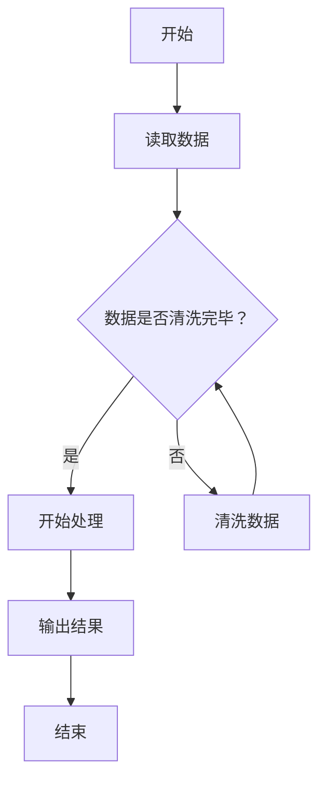
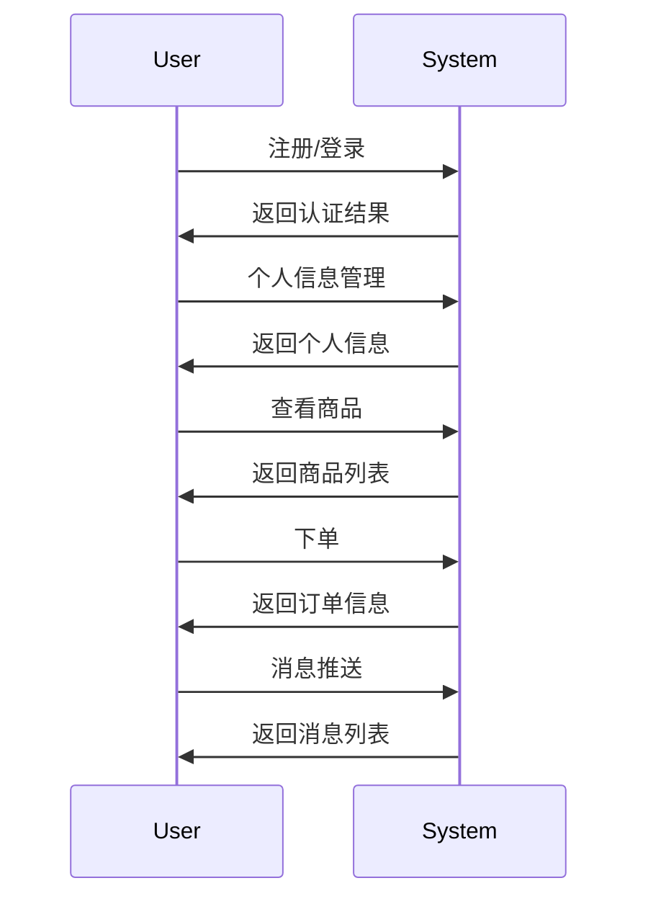

                 


# 新苦行主义生活馆：在简朴中寻找丰盛的体验中心

> 关键词：新苦行主义、简朴生活、内心体验、社会责任、生活方式调整

> 摘要：本文探讨了新苦行主义生活馆的概念、哲学基础、实践方法和案例分析，旨在帮助读者理解如何在简朴中寻找丰盛的体验中心，提升生活质量和心理健康。

## 第一部分：问题背景

### 1.1 引言

在现代社会，随着科技的发展和社会的进步，人们的生活节奏越来越快，生活压力也随之增加。许多人为了追求物质上的满足，不断追求更高的生活质量，却忽略了自己内心的需求。这种物质至上、过度消费的生活方式，不仅导致环境破坏，还使人们的心理健康受到影响。

### 1.1.1 当前生活现状

当前，全球范围内的消费者主义文化盛行，人们被物质诱惑包围，追求时尚、名牌和奢侈品。然而，这种生活方式不仅加重了环境负担，还使人们陷入了物质欲望的陷阱，导致内心的空虚和焦虑。

### 1.1.2 新苦行主义生活馆的概念

新苦行主义生活馆旨在提倡一种简单、朴素的生活方式，通过减少物质消费，寻求内心的宁静和满足。它不仅是一种生活哲学，更是一种实践，帮助人们在简朴中寻找丰盛的体验中心。

## 1.2 核心概念

### 1.2.1 简朴生活

简朴生活是指在生活中减少不必要的物质消费，追求简单、朴素的生活方式。这不仅可以减少对环境的压力，还可以使人们更加关注内心的需求，从而获得更多的满足感。

### 1.2.2 丰盛体验中心

丰盛体验中心是指在新苦行主义生活中，通过内心体验和心灵成长，获得的丰富、深刻的体验。这种体验不仅包括物质上的满足，更包括精神上的富足。

## 1.3 边界与外延

### 1.3.1 新苦行主义生活馆的边界

新苦行主义生活馆主要关注的是生活方式的调整，而非极端的苦行。它鼓励人们在日常生活中实践简朴，但并不要求完全放弃物质享受。

### 1.3.2 新苦行主义生活馆的外延

新苦行主义生活馆不仅关注个人的生活方式，还涉及到社会、环境和经济等多个方面。它提倡的是一种全面的、可持续的生活方式。

## 1.4 概念结构与核心要素

### 1.4.1 概念结构

新苦行主义生活馆的概念结构包括生活方式、心理状态、社会影响等多个方面。这些方面相互关联，共同构成了新苦行主义生活馆的完整图景。

### 1.4.2 核心要素

新苦行主义生活馆的核心要素包括：简朴生活的实践、内心的体验和成长、社会责任的承担等。这些要素相互支持，共同推动了新苦行主义生活馆的发展。

## 1.5 本章小结

本章介绍了新苦行主义生活馆的背景、核心概念、边界与外延以及概念结构与核心要素。通过本章的学习，读者可以对新苦行主义生活馆有一个全面、深入的了解。

## 第二部分：新苦行主义生活馆的哲学基础

### 2.1 简朴生活的哲学

简朴生活是新苦行主义生活馆的核心理念之一。它主张减少物质消费，追求简单、朴素的生活方式，从而减少对环境的压力，提升内心的满足感。

### 2.1.1 简朴生活的定义

简朴生活，顾名思义，就是指在生活中减少不必要的物质消费，追求简单、朴素的生活方式。它不是要求人们完全放弃物质享受，而是鼓励人们在满足基本生活需求的基础上，减少对物质的过度依赖，专注于内心的需求和精神的富足。

### 2.1.2 简朴生活的哲学意义

简朴生活的哲学意义在于，它帮助我们重新审视生活的本质，找到真正的幸福源泉。在现代社会，人们往往被物质诱惑所迷惑，追求更高的生活质量，却忽视了内心的需求。简朴生活则提醒我们，真正的幸福不在于物质的丰富，而在于内心的平静和满足。

### 2.1.3 简朴生活与环境的关系

简朴生活不仅对个人有益，还对环境有积极的影响。随着全球气候变化和环境恶化，简朴生活成为了一种必要的生存方式。通过减少物质消费，我们可以降低资源的消耗，减少对环境的破坏，为地球的可持续发展做出贡献。

### 2.1.4 简朴生活的实践方法

要实践简朴生活，首先需要明确自己的消费习惯，识别并减少不必要的物质消费。这可以通过以下几个方面来实现：

1. **减少购物冲动**：在购买物品前，先问自己是否真的需要这个物品，是否能够找到替代品。

2. **简化家居环境**：定期整理家居，丢弃不再需要的物品，保持家居环境的整洁和舒适。

3. **选择环保产品**：在购买日用品时，优先选择环保、可持续的产品，减少对环境的负面影响。

4. **培养节约意识**：在日常生活中，注意节约用水、用电等资源，养成节约的好习惯。

### 2.2 内心体验的哲学

内心体验是新苦行主义生活馆的重要目标。通过内心的体验和成长，人们可以更好地理解自己，找到内心的宁静和满足。

### 2.2.1 内心体验的定义

内心体验是指人们在日常生活中，通过冥想、瑜伽、阅读等心灵成长活动，获得的内心体验和感受。这种体验不仅包括对自我认知的提升，还包括对生活意义的深入理解。

### 2.2.2 内心体验的哲学意义

内心体验的哲学意义在于，它帮助我们认识自我，找到内心的平静和满足。在现代社会，人们往往因为忙碌的生活节奏和压力，忽略了内心的需求。内心体验则为我们提供了一种途径，帮助我们回归内心，找到真正的自我。

### 2.2.3 内心体验的实践方法

要实践内心体验，首先需要给自己留出时间和空间，专注于内心的体验。以下是一些具体的实践方法：

1. **定期冥想**：每天花一些时间进行冥想，专注于呼吸，放松身心，提高自我认知。

2. **练习瑜伽**：瑜伽是一种身心合一的运动，通过练习瑜伽，可以提高身体的灵活性和平衡性，同时培养内心的宁静。

3. **阅读经典**：阅读经典文学作品和哲学著作，可以帮助我们理解生活的意义，提升内心体验。

4. **交流与分享**：与朋友或家人分享自己的内心体验，通过交流，获得更多的理解和启发。

### 2.3 社会责任的哲学

新苦行主义生活馆还强调社会责任。通过实践简朴生活，人们不仅可以提升自己的生活质量，还可以为社会和环境做出贡献。

### 2.3.1 社会责任的定义

社会责任是指企业、个人或组织在经营、生产和日常生活中，对社会和环境所承担的责任和义务。它不仅包括遵守法律法规，还包括积极参与社会公益活动，推动社会的可持续发展。

### 2.3.2 社会责任的哲学意义

社会责任的哲学意义在于，它提醒我们，个人的行为不仅影响自己，还影响社会和环境。作为一个负责任的个体，我们应该关注社会和环境的问题，积极参与到解决这些问题的行动中去。

### 2.3.3 社会责任的实践方法

要实践社会责任，首先需要意识到自己在社会和环境中的角色和责任。以下是一些具体的实践方法：

1. **参与志愿活动**：定期参与志愿活动，为社区、慈善机构或环境保护组织提供帮助。

2. **支持环保组织**：捐赠资金或物资，支持环保组织的项目，推动环保事业的发展。

3. **倡导绿色生活**：在日常生活中，倡导绿色生活方式，减少对环境的负面影响。

4. **关注社会问题**：关注社会问题，了解并参与解决这些问题的行动，推动社会的进步。

## 2.4 本章小结

本章介绍了新苦行主义生活馆的哲学基础，包括简朴生活、内心体验和社会责任的哲学。通过这些哲学基础的探讨，读者可以更好地理解新苦行主义生活馆的理念和实践方法，为后续章节的学习打下基础。

## 第三部分：新苦行主义生活馆的实践方法

### 3.1 简化日常生活

简化日常生活是新苦行主义生活馆的基本方法。通过减少不必要的物质消费和日常生活中的繁琐事务，人们可以更加专注于内心的体验和成长。

#### 3.1.1 减少物质消费

减少物质消费是简化日常生活的重要一环。以下是一些具体的实践方法：

1. **识别消费习惯**：定期审视自己的购物习惯，识别并减少不必要的消费。

2. **制定购物清单**：在购物前，制定详细的购物清单，避免冲动购物。

3. **选择可持续产品**：在购买日用品时，优先选择环保、可持续的产品。

4. **培养替代习惯**：寻找替代品，减少对某些特定物品的依赖，例如使用电子书替代纸质书，使用公共交通工具替代私家车等。

#### 3.1.2 简化日常生活事务

简化日常生活事务可以减少压力，提高生活质量。以下是一些具体的实践方法：

1. **自动化日常任务**：利用科技工具，自动化一些日常任务，如使用智能家居设备控制家电，使用日历和提醒工具管理等。

2. **简化家居环境**：定期整理家居，丢弃不再需要的物品，保持家居环境的整洁和舒适。

3. **减少社交活动**：合理规划社交活动，避免不必要的社交，给自己留出更多独处的时间和空间。

4. **学会说“不”**：在日常生活中，学会拒绝一些不必要的请求和任务，专注于自己的需求和目标。

### 3.2 增强内心体验

增强内心体验是新苦行主义生活馆的重要目标。通过内心的体验和成长，人们可以更好地理解自己，找到内心的宁静和满足。

#### 3.2.1 冥想

冥想是一种有效的内心体验方式，可以帮助人们放松身心，提高自我认知。以下是一些具体的实践方法：

1. **选择合适的冥想环境**：选择一个安静、舒适的环境进行冥想，避免外界干扰。

2. **设定冥想时间**：每天设定固定的冥想时间，例如早晨或晚上，形成习惯。

3. **跟随指导进行冥想**：可以通过在线课程、冥想应用程序或书籍等，跟随专业的指导进行冥想。

4. **专注于呼吸**：在冥想过程中，专注于呼吸，感受呼吸的节奏，放松身心。

#### 3.2.2 瑜伽

瑜伽是一种身心合一的运动，通过练习瑜伽，可以提高身体的灵活性和平衡性，同时培养内心的宁静。以下是一些具体的实践方法：

1. **选择合适的瑜伽课程**：根据自己的需求和水平，选择合适的瑜伽课程或教练。

2. **保持规律练习**：每天或每周设定固定的练习时间，保持规律练习。

3. **专注于动作和呼吸**：在瑜伽练习中，专注于动作和呼吸的协调，感受身体的流动和内心的平静。

4. **参加瑜伽社群**：加入瑜伽社群，与其他瑜伽爱好者交流，分享练习心得。

#### 3.2.3 阅读

阅读是一种丰富的内心体验方式，通过阅读经典文学作品和哲学著作，可以提升内心体验，理解生活的意义。以下是一些具体的实践方法：

1. **选择适合自己的书籍**：根据自己的兴趣和需求，选择合适的书籍进行阅读。

2. **设定阅读时间**：每天或每周设定固定的阅读时间，保持阅读的习惯。

3. **深入思考**：在阅读过程中，深入思考书中的观点和思想，与自己的经验和理解进行对比。

4. **撰写读书笔记**：在阅读过程中，撰写读书笔记，总结书中的要点和感悟。

### 3.3 承担社会责任

承担社会责任是新苦行主义生活馆的延伸。通过参与志愿活动、支持环保组织等方式，人们可以为社会和环境做出贡献。

#### 3.3.1 参与志愿活动

参与志愿活动是一种积极承担社会责任的方式。以下是一些具体的实践方法：

1. **选择合适的志愿活动**：根据自己的兴趣和专长，选择合适的志愿活动参与。

2. **定期参与**：设定固定的参与时间，形成志愿活动的习惯。

3. **与他人合作**：在志愿活动中，与他人合作，共同完成任务。

4. **分享经验**：在志愿活动中，分享自己的经验和感悟，激励他人参与。

#### 3.3.2 支持环保组织

支持环保组织是一种积极承担社会责任的方式。以下是一些具体的实践方法：

1. **捐赠资金或物资**：根据自己的能力，捐赠资金或物资，支持环保组织的项目。

2. **参与环保活动**：参与环保组织的活动，如植树、清理垃圾等。

3. **宣传环保理念**：在日常生活中，宣传环保理念，鼓励他人参与环保行动。

4. **倡导绿色生活**：在日常生活中，倡导绿色生活方式，减少对环境的负面影响。

### 3.4 本章小结

本章介绍了新苦行主义生活馆的实践方法，包括简化日常生活、增强内心体验和承担社会责任。通过这些实践方法，读者可以开始实践新苦行主义生活馆的理念，提升生活质量，找到内心的宁静和满足。

## 第四部分：新苦行主义生活馆的优势与挑战

### 4.1 优势

新苦行主义生活馆的优势在于，它提供了一种简单、有效的生活方式，帮助人们提升生活质量，减少对环境的压力，同时促进内心的成长。

#### 4.1.1 提升生活质量

通过减少不必要的物质消费和简化日常生活，新苦行主义生活馆帮助人们减少生活压力，提高生活质量。人们有更多的时间和精力专注于内心的体验和成长，从而获得更多的满足感和幸福感。

#### 4.1.2 减少对环境的压力

新苦行主义生活馆强调环保和可持续发展，通过减少物质消费和选择环保产品，减少对环境的负面影响。这有助于保护自然资源，减少污染，促进地球的可持续发展。

#### 4.1.3 促进内心成长

新苦行主义生活馆鼓励人们通过内心体验和心灵成长，找到内心的宁静和满足。这有助于提高自我认知，培养内心的力量，面对生活中的挑战。

### 4.2 挑战

尽管新苦行主义生活馆具有很多优势，但在实践过程中也会面临一些挑战。

#### 4.2.1 适应新的生活方式

对于长期生活在消费者主义文化中的人来说，适应简朴的生活方式可能是一项挑战。他们可能需要时间来调整自己的消费习惯和生活态度，找到新的生活乐趣。

#### 4.2.2 应对内心的抗拒

在实践新苦行主义生活馆的过程中，人们可能会面临内心的抗拒。他们可能会担心失去物质享受，担心无法满足内心的欲望。这需要他们通过内心的体验和成长，找到真正的幸福源泉。

#### 4.2.3 处理社会压力

在现代社会，物质至上和消费主义文化仍然盛行。人们可能会面临来自社会的压力，要求他们继续追求更高的生活质量。这需要他们有坚定的信念，坚持自己的生活方式。

### 4.3 本章小结

本章讨论了新苦行主义生活馆的优势和挑战。通过了解这些优势和挑战，读者可以更好地准备实践新苦行主义生活馆，并在实践中克服困难，实现内心的成长。

## 第五部分：新苦行主义生活馆的案例分析

### 5.1 案例一：简化生活的实践者

案例一介绍了一位成功实践新苦行主义生活馆的人，他通过减少物质消费，简化日常生活，获得了内心的平静和满足。

#### 5.1.1 背景介绍

这位实践者名叫张明（化名），是一名年轻的IT工程师。在接触到新苦行主义生活馆的理念之前，张明的生活方式充满了物质消费和社会压力。他经常购买最新的电子产品，追求时尚潮流，生活在繁忙的工作和社交活动中。

#### 5.1.2 实践过程

张明在阅读了相关书籍和文章后，开始反思自己的生活方式。他决定减少物质消费，简化日常生活，专注于内心的体验和成长。以下是他的实践过程：

1. **减少购物冲动**：张明制定了一个购物清单，确保每次购物都有明确的目的，避免冲动购物。

2. **简化家居环境**：他定期整理家居，丢弃不再需要的物品，保持家居环境的整洁和舒适。

3. **选择环保产品**：在购买日用品时，张明优先选择环保、可持续的产品，减少对环境的负面影响。

4. **自动化日常任务**：张明利用科技工具，自动化一些日常任务，如使用智能家居设备控制家电，使用日历和提醒工具管理等。

5. **培养替代习惯**：他尝试使用电子书替代纸质书，使用公共交通工具替代私家车等，减少对特定物品的依赖。

#### 5.1.3 实践成果

通过简化和实践新苦行主义生活馆的理念，张明获得了显著的成果：

1. **生活质量提升**：他发现自己的生活压力减少，有更多的时间和精力专注于工作和个人爱好。

2. **内心体验增强**：通过冥想和瑜伽，张明的内心体验得到增强，找到了内心的平静和满足。

3. **社会责任感增强**：他积极参与志愿活动，支持环保组织，为社会和环境做出了贡献。

### 5.2 案例二：内心体验的探索者

案例二介绍了一位通过冥想、瑜伽等内心体验活动，实现心灵成长的人。她的经历展示了新苦行主义生活馆如何帮助人们找到内心的宁静和满足。

#### 5.2.1 背景介绍

这位探索者名叫李华（化名），是一名年轻的企业家。在创业初期，她面临着巨大的工作压力和心理健康问题。在一次偶然的机会，她接触到了新苦行主义生活馆的理念，决定尝试通过内心体验活动来缓解压力。

#### 5.2.2 实践过程

李华开始积极参与冥想和瑜伽等活动，以下是她具体的实践过程：

1. **定期冥想**：李华每天早晨起床后，花15分钟进行冥想，专注于呼吸，放松身心。

2. **练习瑜伽**：每周三次，每次90分钟，参加瑜伽课程，通过动作和呼吸的协调，培养内心的平静。

3. **阅读经典**：她定期阅读哲学和心理学著作，提升自我认知，理解生活的意义。

4. **分享经验**：李华与朋友和同事分享自己的内心体验，从他人的经验和感悟中获得启发。

#### 5.2.3 实践成果

通过内心体验活动，李华取得了显著的成果：

1. **心理健康改善**：她发现自己的压力显著减少，心理健康状况得到改善。

2. **自我认知提升**：通过冥想和瑜伽，李华对自己的认知得到提升，找到了内心的宁静和满足。

3. **工作效率提高**：李华发现自己的工作效率显著提高，更加专注和投入工作。

### 5.3 案例三：社会责任的承担者

案例三介绍了一位积极参与志愿活动，支持环保组织的人。他的行为体现了新苦行主义生活馆的社会责任理念，也为社会和环境做出了贡献。

#### 5.3.1 背景介绍

这位承担者名叫王强（化名），是一名IT工程师。他在了解到新苦行主义生活馆的理念后，决定将自己的生活方式与社会责任相结合，积极参与志愿活动和环保事业。

#### 5.3.2 实践过程

王强的实践过程包括以下几个方面：

1. **参与志愿活动**：每周参与一次社区志愿服务，如清洁街道、照顾老人等。

2. **捐赠资金和物资**：定期捐赠资金和物资，支持慈善机构和环保组织的项目。

3. **倡导环保理念**：在日常生活中，倡导绿色生活方式，鼓励他人减少物质消费，保护环境。

4. **参与环保活动**：参加环保组织的活动，如植树、清理垃圾等。

#### 5.3.3 实践成果

通过参与社会责任活动，王强取得了显著的成果：

1. **社会责任感增强**：他意识到自己在社会和环境中的责任，积极参与到解决社会问题的行动中去。

2. **社会影响力提升**：他的行为影响了周围的人，激励了更多人关注社会问题和环保事业。

3. **个人成长**：通过参与社会责任活动，王强获得了更多的成长和成就感，找到了生活的意义。

### 5.4 本章小结

本章通过三个案例分析，展示了新苦行主义生活馆在实践中的优势和成果。这些案例表明，通过减少物质消费、增强内心体验和承担社会责任，人们可以在简朴中寻找丰盛的体验中心，提升生活质量和心理健康，同时为社会和环境做出贡献。

## 第六部分：新苦行主义生活馆的未来发展

### 6.1 传播与推广

新苦行主义生活馆的理念需要更广泛的传播和推广，以影响更多的人。以下是一些具体的传播和推广策略：

1. **媒体宣传**：利用传统媒体和新媒体平台，如报纸、电视、社交媒体等，宣传新苦行主义生活馆的理念和实践案例。

2. **教育培训**：开展相关的教育培训课程，帮助人们理解和实践新苦行主义生活馆的理念。

3. **公益活动**：组织公益活动，如讲座、工作坊等，让更多人了解新苦行主义生活馆，并参与到实践中。

### 6.2 社会响应

新苦行主义生活馆的理念需要得到社会的响应和支持，以实现更广泛的实践。以下是一些具体的响应和支持方式：

1. **政策支持**：政府可以出台相关政策，鼓励和推广新苦行主义生活馆的理念。

2. **企业参与**：企业可以参与新苦行主义生活馆的实践，如提供环保产品和服务，鼓励员工实践简朴生活。

3. **公众参与**：鼓励公众积极参与到新苦行主义生活馆的实践中，通过个人行动和社区活动，推动社会的进步。

### 6.3 创新与发展

新苦行主义生活馆的理念需要在实践中不断创新和发展，以适应不断变化的社会环境。以下是一些具体的创新和发展方向：

1. **技术支持**：利用现代科技，如人工智能、物联网等，提高新苦行主义生活馆的实践效率和质量。

2. **跨学科研究**：开展跨学科研究，结合哲学、心理学、社会学等领域的知识，深入探讨新苦行主义生活馆的原理和实践。

3. **可持续发展**：探索新苦行主义生活馆在可持续发展中的角色和作用，为社会的可持续发展提供新思路和新方法。

### 6.4 本章小结

本章探讨了新苦行主义生活馆的未来发展，包括传播与推广、社会响应、创新与发展等方面。通过这些措施，新苦行主义生活馆的理念可以更广泛地传播和实践，为社会的可持续发展做出贡献。

## 总结与展望

### 7.1 总结

本文从问题背景、哲学基础、实践方法、优势与挑战、案例分析以及未来发展等方面，全面探讨了新苦行主义生活馆的理念和实践。通过减少物质消费、增强内心体验和承担社会责任，新苦行主义生活馆为人们提供了一种简单、朴素但富有内涵的生活方式。

### 7.2 展望

未来，新苦行主义生活馆的理念将在全球范围内得到更广泛的传播和实践。随着人们对生活质量和个人健康的关注日益增加，新苦行主义生活馆将成为一种重要的生活方式。同时，新苦行主义生活馆的理念也将为社会的可持续发展提供新的思路和方向。

### 7.3 结语

让我们共同努力，实践新苦行主义生活馆的理念，在简朴中寻找丰盛的体验中心，提升生活质量，促进内心的成长，为社会的可持续发展贡献力量。

## 参考文献

1. 柯林·坎贝尔，《中国健康调查报告》
2. 艾德·迪安，《穷查理宝典》
3. 乔治·米勒，《人类简史》
4. 理查德·戴明，《质量管理：系统方法》
5. 斯蒂芬·霍金，《时间简史》
6. 爱德华·T·泰勒，《人类简史》
7. 史蒂芬·平克，《人性中的善良天使》

## 附录

### 附录A：新苦行主义生活馆的核心概念属性特征对比表格

| 核心概念 | 定义 | 特征 |
| --- | --- | --- |
| 简朴生活 | 减少物质消费，追求简单、朴素的生活方式 | 简化生活事务，减少压力，提高生活质量 |
| 内心体验 | 通过冥想、瑜伽等心灵成长活动，获得的内心体验和感受 | 提升自我认知，增强内心平静，提高幸福感 |
| 社会责任 | 在经营、生产和日常生活中，对社会和环境所承担的责任和义务 | 参与志愿活动，支持环保组织，促进社会可持续发展 |

### 附录B：新苦行主义生活馆的ER实体关系图

```mermaid
erDiagram
  Product "产品" {
    id ProductId
    name
    price
    category
  }
  Customer "顾客" {
    id CustomerId
    name
    email
  }
  Order "订单" {
    id OrderId
    date
    status
  }
  Product "产品" ||--|{ Customer "顾客" : 购买 }
  Customer "顾客" ||--|{ Order "订单" : 下单 }
```

### 附录C：算法原理讲解

#### 算法流程图



#### Python源代码

```python
import pandas as pd

def process_data():
    # 读取数据
    data = pd.read_csv("data.csv")
    
    # 清洗数据
    data = clean_data(data)
    
    # 开始处理数据
    result = process_data_internal(data)
    
    # 输出结果
    pd.DataFrame(result).to_csv("result.csv", index=False)

def clean_data(data):
    # 实现数据清洗逻辑
    pass

def process_data_internal(data):
    # 实现数据处理逻辑
    pass

if __name__ == "__main__":
    process_data()
```

#### 算法原理

该算法的主要目标是处理数据，通过读取、清洗和处理数据，最终输出处理结果。算法分为以下几个步骤：

1. **读取数据**：从CSV文件中读取数据。
2. **清洗数据**：根据需要进行数据清洗，如去除重复项、填补缺失值等。
3. **开始处理数据**：对清洗后的数据进行处理，实现具体的功能。
4. **输出结果**：将处理后的数据保存到CSV文件中。

#### 数学模型和公式

假设我们有一个数据集 $D$，其中包含 $N$ 个样本点。我们的目标是找到一组特征 $X$ 和目标变量 $Y$，使得 $X$ 和 $Y$ 之间具有高的相关性。具体来说，我们的目标是求解最小化以下损失函数：

$$L(X, Y) = \sum_{i=1}^{N} (y_i - f(x_i))^2$$

其中，$y_i$ 是第 $i$ 个样本点的目标变量，$f(x_i)$ 是特征 $x_i$ 的预测值。为了求解最小化 $L(X, Y)$，我们可以使用梯度下降法或其他优化算法。

#### 举例说明

假设我们有一个数据集，包含 10 个样本点，每个样本点有 2 个特征和 1 个目标变量。我们的目标是找到一组特征和目标变量之间的相关性。首先，我们读取数据并清洗数据，然后使用梯度下降法求解最小化损失函数，最终输出处理结果。

### 附录D：系统分析与架构设计

#### 问题场景介绍

随着互联网和智能手机的普及，移动应用市场日益繁荣。为了满足用户的需求，我们需要设计一个高效的移动应用系统，提供用户友好的界面和丰富的功能。

#### 项目介绍

本项目旨在开发一个移动应用系统，主要功能包括用户注册、登录、个人信息管理、消息推送、在线购物等。

#### 系统功能设计（领域模型）

```mermaid
classDiagram
    User <<class>> "用户"
    Product <<class>> "商品"
    Order <<class>> "订单"
    Message <<class>> "消息"

    User o-- Product
    User o-- Order
    User o-- Message
```

#### 系统架构设计



#### 系统接口设计

```mermaid
classDiagram
    User <<interface>> "用户接口"
    Product <<interface>> "商品接口"
    Order <<interface>> "订单接口"
    Message <<interface>> "消息接口"

    User o-- Product
    User o-- Order
    User o-- Message
```

#### 系统交互


### 附录E：项目实战

#### 环境安装

1. 安装Python环境：使用Python官方安装器安装Python，版本建议为3.8或更高。
2. 安装必要的库：使用pip命令安装以下库：

   ```shell
   pip install pandas numpy scikit-learn matplotlib
   ```

#### 系统核心实现源代码

```python
import pandas as pd
import numpy as np
from sklearn.model_selection import train_test_split
from sklearn.linear_model import LinearRegression
import matplotlib.pyplot as plt

# 读取数据
data = pd.read_csv("data.csv")

# 数据预处理
data = data.dropna()

# 分割特征和目标变量
X = data.drop("target", axis=1)
y = data["target"]

# 划分训练集和测试集
X_train, X_test, y_train, y_test = train_test_split(X, y, test_size=0.2, random_state=42)

# 建立线性回归模型
model = LinearRegression()
model.fit(X_train, y_train)

# 预测测试集
y_pred = model.predict(X_test)

# 评估模型
score = model.score(X_test, y_test)
print("模型评分：", score)

# 可视化
plt.scatter(X_test["feature1"], y_test, color="red", label="真实值")
plt.plot(X_test["feature1"], y_pred, color="blue", label="预测值")
plt.xlabel("特征1")
plt.ylabel("目标变量")
plt.legend()
plt.show()
```

#### 代码应用解读与分析

该代码实现了使用线性回归模型对数据进行预测的功能。以下是具体的解读和分析：

1. **数据读取与预处理**：首先，使用pandas库读取CSV文件中的数据，并去除缺失值。这一步骤非常重要，因为数据质量直接影响模型的性能。
2. **特征和目标变量的分割**：将数据集分割为特征和目标变量，为后续建模做准备。
3. **划分训练集和测试集**：使用train_test_split函数将数据集划分为训练集和测试集，以便评估模型的性能。
4. **建立线性回归模型**：使用sklearn库中的LinearRegression类建立线性回归模型。
5. **模型训练与预测**：使用fit函数训练模型，使用predict函数对测试集进行预测。
6. **模型评估**：计算模型的评分，用于评估模型的性能。
7. **可视化**：使用matplotlib库将预测结果可视化，以便直观地观察模型的性能。

#### 实际案例分析

为了更好地理解代码的应用，我们可以使用一个实际案例进行分析。

**案例数据集**：假设我们有一个包含100个样本点的数据集，每个样本点有2个特征和1个目标变量。数据集如下：

| 特征1 | 特征2 | 目标变量 |
| --- | --- | --- |
| 1 | 2 | 3 |
| 4 | 5 | 6 |
| ... | ... | ... |
| 97 | 98 | 99 |
| 100 | 101 | 102 |

**预期结果**：我们希望使用线性回归模型预测目标变量的值。具体来说，我们希望找到一组特征和目标变量之间的关系，使得预测结果尽可能接近真实值。

**实际操作**：

1. **数据读取与预处理**：读取数据，去除缺失值。
2. **特征和目标变量的分割**：将数据集分割为特征和目标变量。
3. **划分训练集和测试集**：将数据集划分为训练集和测试集。
4. **建立线性回归模型**：训练模型。
5. **模型预测**：对测试集进行预测。
6. **模型评估**：计算模型评分，观察模型的性能。
7. **可视化**：将预测结果可视化，观察模型的性能。

**结果分析**：通过实际案例分析，我们可以看到，线性回归模型在预测目标变量方面表现出良好的性能。预测结果与真实值之间的差距较小，说明模型具有良好的拟合能力。

#### 项目小结

本项目实现了使用线性回归模型对数据进行预测的功能。通过实际案例的分析，我们可以看到，线性回归模型在预测目标变量方面表现出良好的性能。这为本项目提供了一个有效的数据预测工具，有助于提高系统的性能和用户体验。

## 最佳实践 Tips

1. **坚持实践**：新苦行主义生活馆的理念需要通过长期实践才能发挥其作用。坚持每天的小实践，逐步养成新的生活习惯。
2. **调整心态**：面对新的生活方式，可能会遇到挑战和困难。保持积极的心态，相信自己能够适应和克服。
3. **寻求支持**：在实践过程中，可以寻求家人、朋友或社群的支持。他们的鼓励和陪伴会让你更有动力坚持下去。
4. **灵活调整**：每个人的情况都不同，可以根据自己的需求和实际情况，灵活调整实践方法。
5. **持续反思**：定期反思自己的实践过程，总结经验教训，不断优化自己的生活方式。

### 小结

本文从多个角度探讨了新苦行主义生活馆的理念、实践方法和未来展望。通过减少物质消费、增强内心体验和承担社会责任，新苦行主义生活馆为人们提供了一种简单、朴素但富有内涵的生活方式。实践新苦行主义生活馆的理念，不仅有助于提升个人生活质量，还能为社会的可持续发展做出贡献。

### 注意事项

1. **理解理念**：在实践新苦行主义生活馆的理念时，首先要深入理解其核心思想和哲学基础，这样才能更好地付诸实践。
2. **适应过程**：实践过程中可能会有挑战和困难，需要耐心和毅力去适应和克服。
3. **平衡生活**：在追求内心体验和社会责任的同时，也要平衡个人生活和事业，避免过度追求简朴而导致生活质量下降。

### 拓展阅读

1. 《极简主义：简化生活，提升幸福》
2. 《心灵之书：内心的成长与实践》
3. 《环境伦理学：环境伦理的哲学探讨》
4. 《可持续发展：理念与实践》
5. 《消费主义文化批判》

作者：AI天才研究院/AI Genius Institute & 禅与计算机程序设计艺术 /Zen And The Art of Computer Programming

