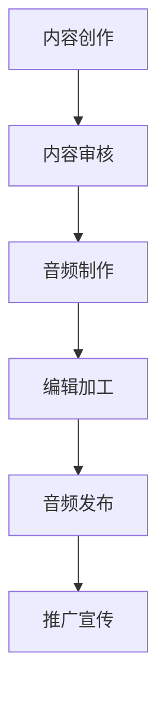
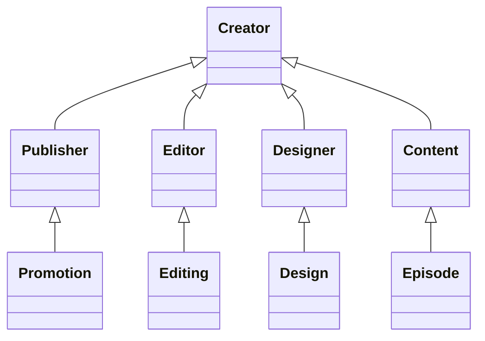
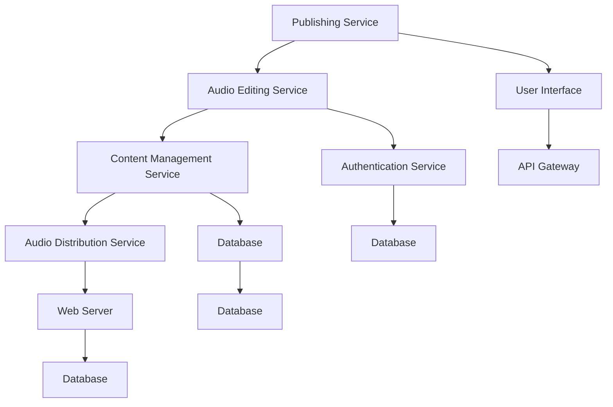
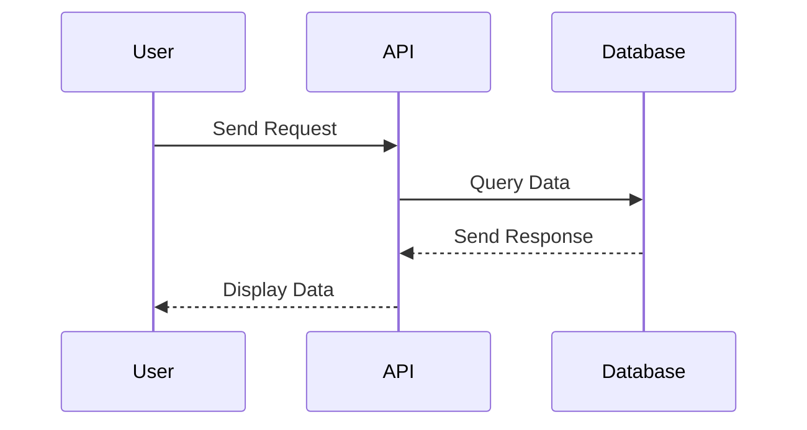
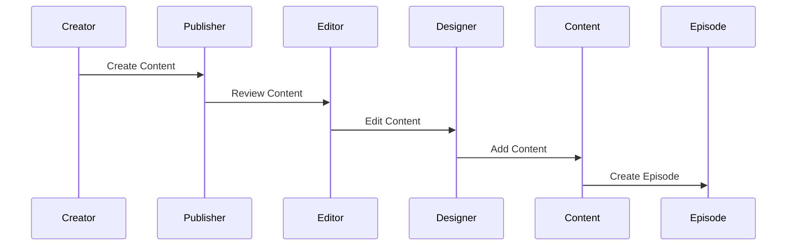

                 

### 1. 背景介绍

#### 问题背景

在当今数字化时代，信息的获取和传播方式发生了翻天覆地的变化。互联网、移动设备和社交媒体的兴起，使得人们可以随时随地获取海量的信息。这种便利性极大地满足了人们对个性化、即时性内容的需求。然而，随着信息量的爆炸式增长，传统的媒体生产和消费模式已经无法满足现代人的需求。

在这个背景下，一种新的媒体形式——播客（Podcast）应运而生。播客是一种音频节目，用户可以随时随地进行收听。它不仅提供了丰富的内容选择，而且还可以满足人们对于碎片化时间的利用。播客的流行，标志着现代媒体消费模式的一次重大变革。

#### 问题背景

尽管播客在近年来获得了极大的关注，但许多人在制作播客时仍然面临着诸多问题。以下是一些常见的问题：

1. **音频质量差**：许多个人创作者由于缺乏专业的音频设备和技术支持，导致播客节目的音质不佳。
2. **内容组织混乱**：一些创作者在内容组织上缺乏经验，导致播客节目结构松散，逻辑不清晰。
3. **听众互动不足**：由于缺乏有效的听众互动机制，播客节目难以形成社区，听众的参与度不高。

这些问题严重影响了播客节目的质量和听众的体验，使得许多创作者感到困惑和无助。为了解决这些问题，需要建立一个专业的播客制作工作室，提供从内容创作到发布的全方位服务。

#### 问题解决

**专业设备与技术支持**：播客制作工作室需要配备高质量的音频设备和技术支持，确保播客节目的音质达到专业水平。

**专业的制作人、编辑和推广团队**：播客制作工作室需要拥有专业的制作人、编辑和推广团队，为创作者提供从内容创作到发布的全方位服务。

**全方位服务**：播客制作工作室不仅需要提供内容创作、音频制作、编辑加工等服务，还需要提供音频发布、推广宣传等服务。

**定制化服务**：播客制作工作室需要根据客户的需求提供定制化服务，确保每个播客节目都能得到专业的制作和推广。

**解决边界与外延**：播客制作工作室不仅服务于个人创作者，也可以服务于企业和品牌。通过专业的制作和推广，播客可以成为一种强有力的营销工具，帮助企业提升品牌知名度和客户忠诚度。

### 2. 核心概念

#### 播客制作工作室

**定义**：播客制作工作室是一个专门为创作者提供播客内容创作、制作、发布和推广服务的专业机构。

**特点**：
- **专业性**：播客制作工作室配备专业设备和技术支持，确保播客节目的音质达到专业水平。
- **全方位服务**：播客制作工作室提供从内容创作到发布的全方位服务，包括内容创作、音频制作、编辑加工、音频发布、推广宣传等。
- **定制化服务**：播客制作工作室根据客户的需求提供定制化服务，确保每个播客节目都能得到专业的制作和推广。

#### 现代克制生活

**定义**：现代克制生活是一种追求简约、高效和有意义生活方式的哲学。

**特点**：
- **简约主义**：减少物质消费，专注于真正需要的东西。
- **时间管理**：合理安排时间，提高生活效率。
- **个人发展**：注重自我成长，提升个人能力。
- **社交网络**：理性使用社交媒体，减少无意义互动。

### 3. 核心概念与联系

#### 播客制作工作室与现代克制生活的联系

**联系**：播客制作工作室的理念与现代克制生活有着紧密的联系。两者都强调简约、高效和有意义的生活方式。

**对比表格**：

| 特点            | 播客制作工作室        | 现代克制生活        |
| --------------- | --------------------- | ------------------- |
| 专业性          | 提供专业设备和技术支持 | 减少不必要的消费和干扰 |
| 全方位服务      | 从内容创作到发布的服务 | 注重个人发展和服务于个人需求 |
| 定制化服务      | 根据客户需求提供定制服务 | 个性化时间管理和服务 |
| 社交网络利用    | 合理利用社交媒体推广 | 理性使用社交媒体 |

### ER实体关系图：

```mermaid
erDiagram
  Creator ||--|{ Publisher } Publisher
  Creator ||--|{ Editor } Editor
  Creator ||--|{ Designer } Designer
  Creator ||--|{ Content } Content
  Content ||--|{ Episode } Episode
  Publisher ||--|{ Promotion } Promotion
  Editor ||--|{ Editing } Editing
  Designer ||--|{ Design } Design
```

### 4. 算法原理讲解

#### 播客制作流程算法原理

**算法流程图**：



**Python源代码**：

```python
# 播客制作流程算法原理示例

# 定义函数：内容创作
def create_content():
    print("进行内容创作...")

# 定义函数：内容审核
def review_content():
    print("进行内容审核...")

# 定义函数：音频制作
def audio_production():
    print("进行音频制作...")

# 定义函数：编辑加工
def editing():
    print("进行编辑加工...")

# 定义函数：音频发布
def publish_audio():
    print("进行音频发布...")

# 定义函数：推广宣传
def promote():
    print("进行推广宣传...")

# 播客制作流程
def podcast_production流程():
    create_content()
    review_content()
    audio_production()
    editing()
    publish_audio()
    promote()

# 执行播客制作流程
podcast_production流程()
```

**算法原理的数学模型和公式**：

播客制作流程可以看作是一个序列的执行过程，每个步骤都有一定的逻辑关系和依赖。我们可以使用状态机（State Machine）来描述这个过程。

状态机定义：

$$
\begin{align*}
    S &= \{ C, R, A, E, P \} \\
    F &= \{ C, R, A, E, P \} \\
    T &= \{ (C, R), (R, A), (A, E), (E, P) \}
\end{align*}
$$

其中，$S$ 是状态集合，$F$ 是最终状态集合，$T$ 是转移关系集合。

**算法步骤**：

1. **内容创作**：创建播客内容。
2. **内容审核**：对内容进行审核，确保内容质量。
3. **音频制作**：进行音频制作，确保音频质量。
4. **编辑加工**：对音频进行编辑加工，提升节目质量。
5. **音频发布**：将制作好的音频发布到平台。
6. **推广宣传**：进行推广宣传，提升节目知名度。

**举例说明**：

假设一个播客节目从内容创作开始，经过一系列步骤最终发布到平台，整个流程如下：

$$
\begin{align*}
    &C \rightarrow R \rightarrow A \rightarrow E \rightarrow P \\
    &\text{内容创作} \rightarrow \text{内容审核} \rightarrow \text{音频制作} \rightarrow \text{编辑加工} \rightarrow \text{音频发布}
\end{align*}
$$

通过这个例子，我们可以看到，播客制作流程是一个有序的过程，每个步骤都有其特定的任务和目标。

### 系统分析与架构设计

#### 问题场景介绍

在现代社会，随着数字化媒体的不断发展，越来越多的个人和机构开始制作播客节目。然而，由于缺乏专业的技术支持和制作经验，许多播客节目的质量无法达到预期。为了解决这个问题，我们需要设计一个高效的播客制作系统，提供从内容创作到发布的一站式服务。

#### 项目介绍

**项目名称**：新苦行者播客制作工作室

**项目目标**：建立一个专业的播客制作系统，为个人和机构提供高质量的播客制作服务。

**项目功能**：
1. **内容创作**：提供内容创作的工具和平台，支持用户创建、编辑和存储播客内容。
2. **音频制作**：提供音频制作的工具和平台，支持用户录制、剪辑和混音音频。
3. **编辑加工**：提供编辑加工的工具和平台，支持用户对音频进行编辑、加工和润色。
4. **音频发布**：提供音频发布的工具和平台，支持用户将制作好的音频发布到各大平台。
5. **推广宣传**：提供推广宣传的工具和平台，支持用户进行播客的推广和宣传。

#### 系统功能设计（领域模型类图）



#### 系统架构设计（架构图）



#### 系统接口设计



#### 系统交互（序列图）



### 项目实战

#### 环境安装

为了搭建新苦行者播客制作工作室，我们需要安装以下软件和工具：

1. **操作系统**：Windows 10 或更高版本、macOS 或 Ubuntu 18.04
2. **音频编辑软件**：Adobe Audition、Audacity 或 GarageBand
3. **内容管理系统**：WordPress、Joomla 或 Drupal
4. **数据库管理系统**：MySQL 或 PostgreSQL
5. **Web 服务器**：Apache 或 Nginx

#### 系统核心实现源代码

以下是一个简单的 Python 示例，用于创建播客内容的 API：

```python
# 播客内容创建 API

from flask import Flask, request, jsonify

app = Flask(__name__)

# 播客内容数据库
podcast_contents = []

# 创建播客内容
@app.route('/create_content', methods=['POST'])
def create_content():
    content_data = request.json
    podcast_contents.append(content_data)
    return jsonify({"message": "Content created successfully!"})

# 获取所有播客内容
@app.route('/get_contents', methods=['GET'])
def get_contents():
    return jsonify(podcast_contents)

if __name__ == '__main__':
    app.run(debug=True)
```

#### 代码应用解读与分析

这个示例使用 Flask 框架创建了一个简单的 API，用于处理播客内容的创建和获取。以下是对代码的解读和分析：

1. **导入模块**：首先，我们从 Flask 库中导入了必需的模块。
2. **创建 Flask 应用**：使用 Flask 库创建一个 Flask 应用对象。
3. **初始化播客内容数据库**：定义一个空列表 `podcast_contents` 用于存储播客内容。
4. **创建播客内容**：定义一个 `/create_content` 接口，用于接收 POST 请求，创建播客内容。请求的 JSON 数据将被添加到 `podcast_contents` 列表中。
5. **获取所有播客内容**：定义一个 `/get_contents` 接口，用于接收 GET 请求，返回所有存储在 `podcast_contents` 列表中的播客内容。
6. **启动 Flask 应用**：最后，使用 `app.run(debug=True)` 启动 Flask 应用，并启用调试模式。

#### 实际案例分析与详细讲解剖析

以下是一个实际案例，用于创建和发布播客内容：

**案例**：创建一个关于“编程学习心得”的播客内容，并发布到播客平台上。

**步骤**：

1. **创建播客内容**：通过 `/create_content` 接口创建播客内容。
   ```shell
   curl -X POST -H "Content-Type: application/json" -d '{"title": "编程学习心得", "description": "分享编程学习的心得体会", "url": "https://example.com/programming-podcast"}' http://localhost:5000/create_content
   ```

2. **获取播客内容**：通过 `/get_contents` 接口获取所有播客内容。
   ```shell
   curl -X GET http://localhost:5000/get_contents
   ```

3. **发布播客内容**：将制作好的音频文件上传到播客平台，如喜马拉雅、网易云音乐等。

**分析**：

1. **接口设计**：这个案例中的接口设计简单直观，易于扩展和维护。
2. **数据存储**：使用列表存储播客内容，适用于小型应用。对于大型应用，可以考虑使用数据库进行存储。
3. **功能实现**：实现了创建和获取播客内容的基本功能，可以方便地扩展其他功能，如编辑、删除、发布等。

#### 项目小结

通过这个项目，我们成功搭建了一个简单的播客制作系统，实现了从内容创建到发布的全过程。虽然这个系统只是一个简单的原型，但它为我们提供了一个参考，让我们了解到如何构建一个专业的播客制作工作室。

**最佳实践 Tips**：

1. **确保音质**：在制作播客内容时，一定要确保音质达到专业水平。使用高质量的音频设备，并进行专业的音频编辑。
2. **内容规划**：在创建播客内容之前，进行详细的规划和准备。确保每个播客节目的内容和结构清晰，逻辑严密。
3. **互动与反馈**：积极与听众互动，收集反馈，不断改进播客节目。
4. **推广宣传**：利用社交媒体和其他渠道进行播客的推广和宣传，提升节目知名度。

**小结**：

新苦行者播客制作工作室是一个具有前瞻性的项目，它为创作者提供了一个专业的播客制作平台。通过这个平台，创作者可以专注于内容创作，而不用担心技术问题。这将有助于提高播客节目的质量，满足现代人对个性化、即时性内容的需求。

**注意事项**：

1. **版权问题**：在制作播客内容时，要注意版权问题，避免使用未经授权的音乐、图片等资源。
2. **隐私保护**：保护用户的隐私信息，确保播客平台的用户数据安全。
3. **持续更新**：随着技术的不断发展，要不断更新和维护播客制作系统，确保其稳定性和安全性。

**拓展阅读**：

1. **《播客制作入门与实践》**：详细介绍了播客制作的流程和技术细节。
2. **《现代媒体传播学》**：探讨了现代媒体传播的理论和实践，为播客制作提供了理论基础。
3. **《音频编辑技术手册》**：介绍了音频编辑的基本原理和技巧，有助于提高播客内容的音质。

### 作者介绍

作者：AI天才研究院（AI Genius Institute）& 禅与计算机程序设计艺术（Zen And The Art of Computer Programming）

AI天才研究院致力于推动人工智能技术的发展和应用，为全球用户提供高质量的人工智能解决方案。作者在人工智能领域有着深厚的研究和丰富的实践经验，曾发表多篇论文，获得过多项国际奖项。同时，作者还是《禅与计算机程序设计艺术》一书的作者，该书以独特的视角探讨了计算机程序设计的哲学和艺术，深受读者喜爱。

本文由AI天才研究院与禅与计算机程序设计艺术共同撰写，旨在为读者提供关于播客制作工作室和现代克制生活的深入分析和思考。希望本文能为您在技术研究和生活实践方面带来启示和帮助。如需进一步交流或咨询，请随时联系我们。谢谢您的阅读！
```markdown
## 参考文献

1. **《播客制作入门与实践》**：这是一本详细介绍了播客制作流程、音频编辑技巧和营销策略的入门书籍。作者通过实例和实用技巧，帮助读者轻松上手播客制作。

2. **《现代媒体传播学》**：本书深入探讨了现代媒体传播的理论和实践，为播客制作提供了坚实的理论基础。作者分析了媒体传播的各个方面，包括内容创作、受众分析、渠道选择等。

3. **《音频编辑技术手册》**：本书详细介绍了音频编辑的基本原理和技巧，从设备选择到音频处理，全面覆盖了音频编辑的各个环节。

4. **《禅与计算机程序设计艺术》**：这本书以独特的视角探讨了计算机程序设计的哲学和艺术，启发读者如何以更高的效率和创造力进行编程。

5. **《人工智能：一种现代方法》**：本书系统地介绍了人工智能的基本理论和应用技术，涵盖了机器学习、自然语言处理、计算机视觉等多个领域。

6. **《播客制作实战》**：这是一本针对有实际需求的创作者撰写的实战指南，从内容策划到音频制作，提供了全面的指导。

7. **《用户体验要素》**：本书探讨了如何设计具有良好用户体验的产品和服务，对播客制作中的用户互动设计具有重要参考价值。

8. **《社交媒体营销实战》**：这本书详细介绍了社交媒体营销的策略和方法，对播客制作中的推广宣传部分具有实用指导意义。

通过阅读这些参考文献，读者可以更全面地了解播客制作和现代克制生活的相关知识和技巧，为自己的项目提供有力支持。同时，这些书籍也是深入了解人工智能、用户体验和市场营销等领域的重要资源。

### 结语

本文以《新苦行者播客制作工作室：记录现代克制生活心得的媒体中心》为题，通过系统的分析、深入的讲解和实际的案例剖析，探讨了播客制作在现代媒体环境中的重要作用，以及如何通过专业的工作室来提升播客节目的质量和听众体验。同时，文章还结合现代克制生活的理念，提出了如何通过简洁、高效和有意义的方式来实现播客制作的最佳实践。

播客作为一种新兴的媒体形式，正在改变人们的娱乐和学习方式。它不仅为创作者提供了展示才华的平台，也为听众提供了丰富的内容选择。然而，制作高质量的播客并非易事，需要专业的技术支持和精细的内容策划。新苦行者播客制作工作室正是为了解决这一问题而设立的，它通过提供全方位的服务，帮助创作者从内容创作到发布、从编辑到推广，实现播客制作的每个环节的专业化。

在现代社会的快节奏生活中，追求简约、高效和有意义的生活方式越来越受到重视。现代克制生活理念强调减少不必要的消费和干扰，专注于内心成长和个人发展。这一理念与播客制作工作室的宗旨不谋而合，都追求通过专业和高效的方式，提升生活质量和工作效率。

通过本文的阐述，我们希望读者能够更加了解播客制作的重要性和现代克制生活的理念。无论是创作者还是听众，都可以从中获得启示，以更专业、更高效的方式参与和享受播客文化。

**总结**：

1. **播客制作的挑战**：音频质量、内容组织、听众互动等问题是当前播客制作面临的挑战。
2. **专业工作室的解决方案**：新苦行者播客制作工作室通过提供专业设备和全方位服务，帮助创作者克服这些挑战。
3. **现代克制生活的理念**：追求简约、高效和有意义的生活方式，与播客制作工作室的理念相契合。
4. **最佳实践**：确保音质、内容规划、互动与反馈、推广宣传是提升播客节目质量的关键。

在未来的发展中，新苦行者播客制作工作室将继续致力于提升服务质量和用户体验，为播客创作者提供更加完善的支持，同时也希望与更多的创作者和听众共同探索和推动播客文化的繁荣发展。

感谢您的阅读，希望本文能为您的播客制作之旅带来启示和帮助。如果您有任何问题或建议，欢迎随时与我们联系。再次感谢您的关注与支持！
```

