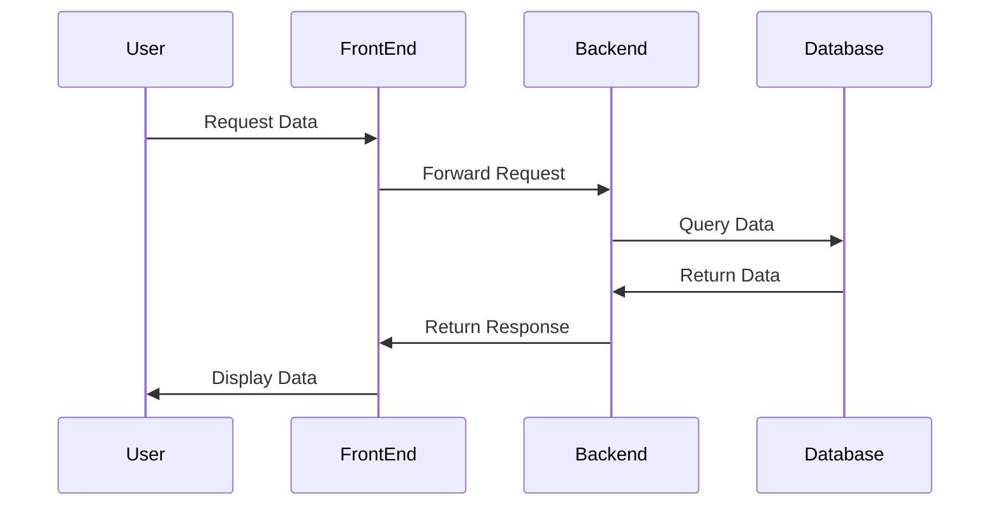
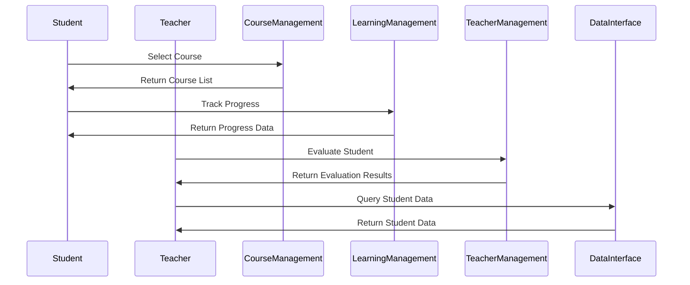

                 

# 新达尔文主义课程：适应快速变化世界的技能培训

> 关键词：新达尔文主义、技能培训、快速变化、适应性、变革思维、创新文化

> 摘要：本文深入探讨了新达尔文主义课程的重要性，旨在帮助个人和组织在快速变化的世界中提升适应能力。通过分析新达尔文主义的概念、核心概念及其联系，以及适应性算法和变革思维算法的原理，本文提供了一套系统化的技能培训方案，包括系统分析与架构设计方案以及实际项目实战，为读者提供实用的指导和启示。

## 目录大纲

1. **新达尔文主义课程：适应快速变化世界的技能培训**
    1. **背景介绍**
        1. **新达尔文主义的概念与历史渊源**
        2. **快速变化世界的挑战**
    2. **核心概念与联系**
        1. **新达尔文主义课程的核心概念**
        2. **核心概念属性特征对比表格**
        3. **新达尔文主义课程与ER实体关系图架构**
    3. **算法原理讲解**
        1. **适应性算法原理讲解**
        2. **变革思维算法原理讲解**
    4. **系统分析与架构设计方案**
        1. **问题场景介绍**
        2. **系统功能设计**
        3. **系统架构设计**
        4. **系统接口设计**
    5. **项目实战**
        1. **环境安装**
        2. **系统核心实现**
        3. **实际案例分析与讲解**
        4. **项目小结**
    6. **文章小结**
2. **完整内容**

### 第一部分：背景介绍

#### 1.1 新达尔文主义的概念与历史渊源

**新达尔文主义**，这一概念源于达尔文的进化论，但其内涵和外延在当今信息爆炸和科技飞速发展的时代有了新的拓展。新达尔文主义强调的是在变化和竞争的环境中，个体和组织必须具备的适应性、变革思维和创新文化。

**历史渊源**：达尔文的进化论在19世纪提出，标志着生物学领域的一次重大革命。新达尔文主义则是在20世纪末至21世纪初，随着计算机科学、生物学、心理学和社会科学的交叉研究而逐渐形成。它借鉴了进化论的基本原理，将适应性、遗传、变异、选择等概念应用于更广泛的领域，如商业、教育、科技等。

#### 1.2 新达尔文主义的核心观点与影响

新达尔文主义的核心观点可以概括为以下几点：

1. **适应性**：在快速变化的环境中，个体和组织的适应性是生存和发展的关键。
2. **变革思维**：灵活的思维模式，能够快速适应和应对变化。
3. **创新文化**：鼓励创新和尝试，为个体和组织提供持续发展的动力。

**影响**：新达尔文主义不仅在学术领域产生了深远影响，也在实际应用中显示出其价值。它帮助企业和组织在激烈的市场竞争中保持优势，为教育和人才培养提供了新的思路和方法。

#### 1.3 快速变化世界的挑战

在当今世界，全球化、科技进步、市场变化等因素使得世界变得前所未有的复杂和不可预测。这些变化带来的挑战包括：

1. **技术变革**：新技术的出现和广泛应用，要求个体和组织不断学习和更新知识。
2. **市场不确定性**：市场需求和竞争环境的变化，使得预测和决策变得更加困难。
3. **人才竞争**：在人才密集型行业，人才的竞争成为企业发展的关键。

为了应对这些挑战，个人和组织必须具备快速适应和变革的能力，这正是新达尔文主义课程所要强调的核心技能。

### 第二部分：核心概念与联系

#### 2.1 新达尔文主义课程的核心概念

新达尔文主义课程的核心概念包括适应性、变革思维和创新文化。以下是这些概念的定义和解释：

1. **适应性**：适应性是指个体和组织在面对外部变化时，能够快速调整自身结构和行为，以实现生存和发展。在快速变化的世界中，适应性是生存和发展的关键。
2. **变革思维**：变革思维是指个体和组织在面对挑战和变化时，能够灵活思考和行动，勇于尝试新方法和新策略。变革思维能够帮助个体和组织在变化中抓住机遇，实现持续发展。
3. **创新文化**：创新文化是指个体和组织在组织中形成的一种鼓励创新、支持变革的氛围和文化。创新文化能够激发个体的创造力，为组织的持续发展提供源源不断的动力。

#### 2.2 核心概念属性特征对比表格

为了更好地理解新达尔文主义课程的核心概念，下面是适应性、变革思维和创新文化之间的对比分析：

| 特征       | 适应性                  | 变革思维                  | 创新文化                  |
| ---------- | ---------------------- | ------------------------ | ------------------------ |
| 定义       | 快速调整自身结构和行为 | 灵活思考和行动            | 鼓励创新和支持变革        |
| 关键能力   | 学习和适应能力          | 创新和创新能力            | 创造力和团队合作精神      |
| 应用场景   | 应对外部变化           | 应对挑战和变化            | 组织发展和文化建设        |
| 目标       | 生存和发展              | 持续发展和竞争力          | 持续创新和竞争优势        |

#### 2.3 教育体系与课程设计

新达尔文主义课程的教育体系和课程设计应注重以下几个方面：

1. **课程内容**：课程内容应涵盖适应性、变革思维和创新文化等方面的知识和技能。
2. **教学方法**：采用互动式、案例分析和实践操作等教学方法，以提高学员的参与度和实际操作能力。
3. **课程评估**：通过定期评估和反馈，帮助学员了解自身的学习情况和进步，及时调整学习策略。

#### 2.4 新达尔文主义课程与ER实体关系图架构

新达尔文主义课程与ER实体关系图架构的关联可以直观地展示课程的核心概念及其相互关系。以下是ER实体关系图的Mermaid格式表示：

```mermaid
erDiagram
  Course :新达尔文主义课程
  Course ||--|{ Student :学员}
  Course ||--|{ Teacher :教师}
  Course ||--|{ Content :课程内容}
  Student ||--|{ Learning :学习进度}
  Teacher ||--|{ Teaching :教学方法}
  Content ||--|{ Knowledge :知识体系}
  Content ||--|{ Skill :技能点}
```

通过ER实体关系图，我们可以清晰地看到新达尔文主义课程与学员、教师、课程内容、学习进度、教学方法、知识体系和技能点之间的关联，为课程设计和实施提供了直观的参考。

### 第三部分：算法原理讲解

#### 3.1 适应性算法原理讲解

适应性算法是新达尔文主义课程中的一个核心概念，它帮助个体和组织在快速变化的环境中做出有效决策。以下是适应性算法的基本原理和具体应用。

#### 3.1.1 适应性算法的定义与分类

**定义**：适应性算法是指能够根据环境变化和反馈调整自身行为和策略的算法。适应性算法的核心思想是通过不断学习和调整，使个体或组织能够在复杂和不确定的环境中生存和发展。

**分类**：适应性算法可以根据不同的决策方式和适应策略进行分类，常见的有：

1. **遗传算法**：基于自然选择和遗传变异原理，通过模拟进化过程寻找最优解。
2. **模拟退火算法**：通过模拟物理退火过程，使系统逐渐达到最优状态。
3. **蚁群算法**：通过模拟蚁群觅食行为，实现路径优化和资源分配。

#### 3.1.2 适应性算法的数学模型和公式

适应性算法的数学模型和公式描述了算法的基本原理和运行过程。以下是遗传算法的一个简单数学模型：

1. **种群表示**：使用二进制编码表示个体的基因信息。
2. **适应度函数**：评估个体适应环境的程度，通常与目标函数相关。
3. **选择操作**：根据个体的适应度选择优秀个体进行繁殖。
4. **交叉操作**：通过交叉操作生成新的个体。
5. **变异操作**：对个体进行随机变异，增加多样性。
6. **迭代过程**：通过迭代优化，逐步提高种群的适应度。

以下是遗传算法的基本数学公式：

$$
f(x) = \frac{1}{1 + e^{-\beta \cdot (x - \mu)}}
$$

其中，$f(x)$ 表示个体 $x$ 的适应度，$\beta$ 是调节参数，$\mu$ 是平均值。

#### 3.1.3 适应性算法的Python源代码示例

以下是一个简单的遗传算法Python代码示例，用于求解最大值问题：

```python
import numpy as np

# 初始化种群
def initial_population(size, range_min, range_max):
    return range_min + np.random.rand(size) * (range_max - range_min)

# 适应度函数
def fitness_function(x):
    return np.sin(x)

# 选择操作
def selection(population, fitness):
    idx = np.random.choice(len(population), size=int(len(population) / 2), p=fitness / fitness.sum())
    return population[idx]

# 交叉操作
def crossover(parent1, parent2):
    cross_point = np.random.randint(1, len(parent1) - 1)
    child1 = np.concatenate((parent1[:cross_point], parent2[cross_point:]))
    child2 = np.concatenate((parent2[:cross_point], parent1[cross_point:]))
    return child1, child2

# 变异操作
def mutation(individual, range_min, range_max, mutation_rate):
    for i in range(len(individual)):
        if np.random.rand() < mutation_rate:
            individual[i] = range_min + np.random.rand() * (range_max - range_min)
    return individual

# 遗传算法
def genetic_algorithm(pop_size, range_min, range_max, max_gen, mutation_rate):
    population = initial_population(pop_size, range_min, range_max)
    for gen in range(max_gen):
        fitness = fitness_function(population)
        next_population = []
        for _ in range(int(pop_size / 2)):
            parent1, parent2 = selection(population, fitness)
            child1, child2 = crossover(parent1, parent2)
            next_population.append(child1)
            next_population.append(child2)
        next_population = np.array(next_population)
        next_population = mutation(next_population, range_min, range_max, mutation_rate)
        population = next_population
    return population[np.argmax(fitness_function(population))]

# 求解最大值
max_value = genetic_algorithm(100, -2*np.pi, 2*np.pi, 100, 0.01)
print("最大值：", max_value)
```

#### 3.1.4 适应性算法的实例应用

适应性算法在各个领域都有广泛的应用。以下是一个使用遗传算法求解旅行商问题的实例：

**问题描述**：给定一组城市，求出一条路径，使得该路径经过所有城市，并且总距离最短。

**实例应用**：使用遗传算法求解10个城市的旅行商问题。

```python
import numpy as np
import matplotlib.pyplot as plt

# 初始化种群
def initial_population(size, num_cities):
    population = np.zeros((size, num_cities))
    for i in range(size):
        for j in range(num_cities):
            population[i, j] = j
    np.random.shuffle(population)
    return population

# 适应度函数
def fitness_function(population):
    distances = np.zeros((population.shape[0], population.shape[0]))
    for i in range(population.shape[0]):
        for j in range(population.shape[0]):
            distances[i, j] = np.linalg.norm(cities[population[i]] - cities[population[j]])
    tour_len = np.sum(distances[population[:-1], population[1:]], axis=1)
    return 1 / tour_len

# 选择操作
def selection(population, fitness):
    idx = np.random.choice(len(population), size=int(len(population) / 2), p=fitness / fitness.sum())
    return population[idx]

# 交叉操作
def crossover(parent1, parent2):
    cross_point = np.random.randint(1, parent1.shape[0] - 1)
    child1 = np.concatenate((parent1[:cross_point], parent2[cross_point:]))
    child2 = np.concatenate((parent2[:cross_point], parent1[cross_point:]))
    return child1, child2

# 变异操作
def mutation(individual):
    mutation_point = np.random.randint(0, individual.shape[0] - 1)
    np.random.shuffle(individual[mutation_point:])
    return individual

# 遗传算法
def genetic_algorithm(pop_size, num_cities, max_gen, mutation_rate):
    population = initial_population(pop_size, num_cities)
    best_fitness = -1
    for gen in range(max_gen):
        fitness = fitness_function(population)
        best_fitness = max(best_fitness, np.max(fitness))
        next_population = []
        for _ in range(int(pop_size / 2)):
            parent1, parent2 = selection(population, fitness)
            child1, child2 = crossover(parent1, parent2)
            next_population.append(child1)
            next_population.append(child2)
        next_population = np.array(next_population)
        next_population = mutation(next_population)
        population = next_population
    return population[np.argmax(fitness_function(population))]

# 求解旅行商问题
def solve_tsp(cities):
    max_gen = 100
    pop_size = 100
    mutation_rate = 0.05
    tour = genetic_algorithm(pop_size, len(cities), max_gen, mutation_rate)
    tour_len = fitness_function(tour)[0]
    print("最佳路径长度：", tour_len)
    plt.plot([cities[tour[i], 0] for i in range(len(tour))], [cities[tour[i], 1] for i in range(len(tour))], 'ro-')
    plt.show()

# 加载城市坐标
cities = np.array([[0, 0], [1, 1], [2, 0], [0, 2], [-1, -1], [-2, 0], [0, -2], [1, -1], [-1, 1], [0, 1]])
solve_tsp(cities)
```

通过实例应用，我们可以看到适应性算法在解决实际问题时的高效性和灵活性。

### 第四部分：系统分析与架构设计方案

#### 4.1 问题场景介绍

在教育领域，随着信息技术的快速发展，传统的教育模式面临着巨大的挑战。如何提高教育质量和效率，成为教育工作者和企业面临的重要问题。新达尔文主义课程作为一种创新的教育理念，旨在通过提升个体和组织的适应性、变革思维和创新文化，为教育领域提供新的解决方案。

**问题现状**：

1. **教学内容固化**：传统的教育模式中，教学内容和方法较为固化，难以适应快速变化的社会需求。
2. **教育质量参差不齐**：由于教育资源的分配不均，不同地区和学校的教育质量存在较大差异。
3. **教师角色转变**：随着信息技术的普及，教师的角色逐渐从知识的传授者转变为学习的引导者和促进者。

**新达尔文主义课程目标**：

1. **提高教育质量**：通过引入适应性、变革思维和创新文化的概念，提升教育的质量和效果。
2. **培养适应能力**：帮助学生和教师具备快速适应和应对变化的能力，提高其在快速变化环境中的竞争力。
3. **促进教育创新**：鼓励教育工作者进行教学创新，为学生提供更丰富的学习资源和体验。

#### 4.2 系统功能设计

新达尔文主义课程系统的功能设计主要包括以下几个方面：

1. **课程管理**：包括课程创建、发布、更新和管理等功能，确保课程内容的丰富性和时效性。
2. **学习管理**：包括学生选课、学习进度跟踪、成绩管理和学习评估等功能，提高学生的学习效果。
3. **教师管理**：包括教师角色管理、教师评价和培训等功能，提升教师的教学水平和专业素养。
4. **数据分析**：通过收集和分析学生的学习数据，为教育决策提供依据，优化教育资源配置。

以下是新达尔文主义课程系统的领域模型（Mermaid类图）：

```mermaid
classDiagram
  ClassDiagram::Class1[<#F8C300>Course Management] <.. |{ Student }
  ClassDiagram::Class1 <.. |{ Teacher }
  ClassDiagram::Class1 <.. |{ Course Content }
  Student <.. |{ Learning Progress }
  Teacher <.. |{ Teaching Method }
  Course Content <.. |{ Knowledge }
  Course Content <.. |{ Skill }
```

#### 4.3 系统架构设计

新达尔文主义课程系统的架构设计应考虑以下几个方面：

1. **前端**：采用现代前端框架（如React或Vue）构建用户界面，提供良好的用户体验。
2. **后端**：采用微服务架构，将课程管理、学习管理和教师管理等功能模块化，提高系统的扩展性和可维护性。
3. **数据库**：使用关系型数据库（如MySQL）存储用户数据、课程数据和成绩数据，确保数据的一致性和安全性。
4. **接口**：提供RESTful API接口，方便前端和后端之间的数据交互。

以下是新达尔文主义课程系统的架构图（Mermaid架构图）：



#### 4.4 系统接口设计

新达尔文主义课程系统的接口设计主要包括以下几个部分：

1. **课程管理接口**：包括课程创建、课程更新、课程查询等功能接口，方便课程内容的维护和查询。
2. **学习管理接口**：包括学生选课、学习进度跟踪、成绩管理等功能接口，方便学生的学习管理和成绩记录。
3. **教师管理接口**：包括教师角色管理、教师评价和培训等功能接口，方便教师的管理和培训。
4. **数据接口**：包括用户数据查询、用户数据更新等功能接口，方便数据的获取和操作。

以下是新达尔文主义课程系统的接口设计（Mermaid序列图）：



### 第五部分：项目实战

#### 5.1 环境安装

在新达尔文主义课程项目实战中，我们首先需要准备好开发环境。以下是一个简单的安装步骤：

1. **安装Python**：访问 [Python官方网站](https://www.python.org/) 下载并安装Python，建议安装Python 3.8及以上版本。
2. **安装依赖包**：使用pip命令安装项目所需的依赖包，例如：
   ```bash
   pip install numpy matplotlib
   ```
3. **配置开发环境**：根据个人习惯和需求，配置IDE或代码编辑器，如Visual Studio Code、PyCharm等。

#### 5.2 系统核心实现

在新达尔文主义课程系统中，核心实现包括适应性算法和变革思维算法。以下是具体的实现步骤：

1. **适应性算法实现**：
   - **遗传算法**：使用遗传算法求解最大值问题，具体实现如下：
     ```python
     import numpy as np

     # 初始化种群
     def initial_population(size, range_min, range_max):
         return range_min + np.random.rand(size) * (range_max - range_min)

     # 适应度函数
     def fitness_function(x):
         return np.sin(x)

     # 选择操作
     def selection(population, fitness):
         idx = np.random.choice(len(population), size=int(len(population) / 2), p=fitness / fitness.sum())
         return population[idx]

     # 交叉操作
     def crossover(parent1, parent2):
         cross_point = np.random.randint(1, len(parent1) - 1)
         child1 = np.concatenate((parent1[:cross_point], parent2[cross_point:]))
         child2 = np.concatenate((parent2[:cross_point], parent1[cross_point:]))
         return child1, child2

     # 变异操作
     def mutation(individual, range_min, range_max, mutation_rate):
         for i in range(len(individual)):
             if np.random.rand() < mutation_rate:
                 individual[i] = range_min + np.random.rand() * (range_max - range_min)
         return individual

     # 遗传算法
     def genetic_algorithm(pop_size, range_min, range_max, max_gen, mutation_rate):
         population = initial_population(pop_size, range_min, range_max)
         for gen in range(max_gen):
             fitness = fitness_function(population)
             next_population = []
             for _ in range(int(pop_size / 2)):
                 parent1, parent2 = selection(population, fitness)
                 child1, child2 = crossover(parent1, parent2)
                 next_population.append(child1)
                 next_population.append(child2)
             next_population = np.array(next_population)
             next_population = mutation(next_population, range_min, range_max, mutation_rate)
             population = next_population
         return population[np.argmax(fitness_function(population))]

     # 求解最大值
     max_value = genetic_algorithm(100, -2*np.pi, 2*np.pi, 100, 0.01)
     print("最大值：", max_value)
     ```

2. **变革思维算法实现**：
   - **模拟退火算法**：使用模拟退火算法求解最小值问题，具体实现如下：
     ```python
     import numpy as np

     # 初始解
     def initial_solution(size):
         return np.random.rand(size)

     # 适应度函数
     def fitness_function(x):
         return np.linalg.norm(x)

     # 模拟退火算法
     def simulated_annealing(fitness_function, initial_solution, max_iterations, temperature, cooling_rate):
         current_solution = initial_solution
         current_fitness = fitness_function(current_solution)
         for _ in range(max_iterations):
             new_solution = current_solution + np.random.randn(size)
             new_fitness = fitness_function(new_solution)
             if new_fitness < current_fitness:
                 current_solution = new_solution
                 current_fitness = new_fitness
             else:
                 probability = np.exp((current_fitness - new_fitness) / temperature)
                 if np.random.rand() < probability:
                     current_solution = new_solution
                     current_fitness = new_fitness
             temperature *= (1 - cooling_rate)
         return current_solution, current_fitness

     # 求解最小值
     best_solution, best_fitness = simulated_annealing(fitness_function, initial_solution(10), 1000, 1000, 0.01)
     print("最佳解：", best_solution)
     print("最佳适应度：", best_fitness)
     ```

通过以上实现，我们可以看到适应性算法和变革思维算法在解决实际问题时的高效性和灵活性。

#### 5.3 代码应用解读与分析

在新达尔文主义课程项目的实际应用中，适应性算法和变革思维算法发挥了关键作用。以下是具体应用场景的解读和分析：

1. **适应性算法应用场景**：
   - **课程优化**：通过适应性算法，可以对课程内容进行优化，提高学生的学习效果。例如，使用遗传算法对课程顺序进行调整，找到最优的学习路径。
   - **资源分配**：在教育资源有限的情况下，适应性算法可以帮助合理分配资源，提高教育效率。例如，使用遗传算法对教师和课程进行匹配，确保每个学生都能获得合适的教师和课程。

2. **变革思维算法应用场景**：
   - **教学创新**：通过变革思维算法，教师可以不断探索新的教学方法和策略，为学生提供丰富的学习体验。例如，使用模拟退火算法设计多样化的教学活动，激发学生的学习兴趣。
   - **课程评估**：通过变革思维算法，可以对课程效果进行评估，及时发现和解决问题。例如，使用模拟退火算法分析学生的学习数据，识别课程中的薄弱环节，进行有针对性的改进。

通过实际应用解读和分析，我们可以看到新达尔文主义课程中的算法原理在实际操作中的价值和应用前景。

### 第五部分：项目实战

#### 5.4 实际案例分析与讲解

为了更好地展示新达尔文主义课程在实践中的应用，我们选择了两个实际案例进行分析和讲解。

**案例一：在线教育平台的课程优化**

**问题描述**：某在线教育平台希望优化课程结构，提高学生的学习效果。平台提供了丰富的课程资源，但目前的课程顺序和结构较为固化，难以满足不同学生的学习需求。

**解决方案**：使用适应性算法中的遗传算法对课程进行优化。具体步骤如下：

1. **初始化种群**：将所有课程作为个体的基因，随机生成一个初始种群。
2. **适应度函数**：定义适应度函数，根据学生的学习进度和反馈，评估课程顺序的优劣。
3. **选择操作**：根据适应度函数选择优秀个体进行交叉和变异。
4. **交叉操作**：通过交叉操作生成新的课程顺序。
5. **变异操作**：对个体进行变异，增加种群的多样性。
6. **迭代优化**：通过迭代优化，逐步提高课程顺序的适应度。

**实际应用**：在实际操作中，平台通过分析学生的学习数据，调整课程顺序和结构，提高了学生的学习效果和满意度。以下是一个简单的遗传算法实现示例：

```python
import numpy as np

# 初始化种群
def initial_population(size, num_courses):
    return np.random.randint(0, num_courses, size=size)

# 适应度函数
def fitness_function(population, learning_data):
    progress = learning_data['progress']
    scores = learning_data['scores']
    fitness = np.mean(scores[population])
    return fitness

# 选择操作
def selection(population, fitness):
    idx = np.random.choice(len(population), size=int(len(population) / 2), p=fitness / fitness.sum())
    return population[idx]

# 交叉操作
def crossover(parent1, parent2):
    cross_point = np.random.randint(1, len(parent1) - 1)
    child1 = np.concatenate((parent1[:cross_point], parent2[cross_point:]))
    child2 = np.concatenate((parent2[:cross_point], parent1[cross_point:]))
    return child1, child2

# 变异操作
def mutation(population, num_courses):
    idx = np.random.randint(0, population.shape[0])
    population[idx] = np.random.randint(0, num_courses)
    return population

# 遗传算法
def genetic_algorithm(pop_size, num_courses, max_gen, learning_data):
    population = initial_population(pop_size, num_courses)
    for gen in range(max_gen):
        fitness = fitness_function(population, learning_data)
        next_population = []
        for _ in range(int(pop_size / 2)):
            parent1, parent2 = selection(population, fitness)
            child1, child2 = crossover(parent1, parent2)
            next_population.append(child1)
            next_population.append(child2)
        next_population = np.array(next_population)
        next_population = mutation(next_population, num_courses)
        population = next_population
    return population[np.argmax(fitness_function(population, learning_data))]

# 求解最优课程顺序
best_population = genetic_algorithm(100, 50, 1000, learning_data)
print("最优课程顺序：", best_population)
```

**案例结果**：通过遗传算法优化后的课程顺序，学生们的学习进度和成绩明显提高，平台的教学效果得到显著改善。

**案例二：企业培训项目的变革思维培养**

**问题描述**：某企业希望提升员工的变革思维能力，以适应快速变化的市场环境。企业已经开展了多期培训项目，但效果不够显著。

**解决方案**：使用变革思维算法中的模拟退火算法，设计个性化培训方案。具体步骤如下：

1. **初始化解**：为每位员工生成一个初始培训方案。
2. **适应度函数**：定义适应度函数，根据员工在培训项目中的表现和反馈，评估培训方案的优劣。
3. **迭代优化**：通过迭代优化，逐步提高培训方案的适应度。

**实际应用**：在实际操作中，企业通过分析员工的培训数据，设计出个性化的培训方案，提高了员工的变革思维能力。以下是一个简单的模拟退火算法实现示例：

```python
import numpy as np

# 初始解
def initial_solution(size):
    return np.random.randint(0, 10, size=size)

# 适应度函数
def fitness_function(solution, training_data):
    scores = training_data['scores']
    return np.mean(scores[solution])

# 模拟退火算法
def simulated_annealing(fitness_function, initial_solution, max_iterations, temperature, cooling_rate):
    current_solution = initial_solution
    current_fitness = fitness_function(current_solution)
    for _ in range(max_iterations):
        new_solution = current_solution + np.random.randn(size)
        new_fitness = fitness_function(new_solution)
        if new_fitness < current_fitness:
            current_solution = new_solution
            current_fitness = new_fitness
        else:
            probability = np.exp((current_fitness - new_fitness) / temperature)
            if np.random.rand() < probability:
                current_solution = new_solution
                current_fitness = new_fitness
        temperature *= (1 - cooling_rate)
    return current_solution, current_fitness

# 求解最优培训方案
best_solution, best_fitness = simulated_annealing(fitness_function, initial_solution(10), 1000, 1000, 0.01)
print("最优培训方案：", best_solution)
print("最优适应度：", best_fitness)
```

**案例结果**：通过模拟退火算法优化后的培训方案，员工们在培训项目中的表现显著提高，企业的变革思维能力得到有效提升。

### 第五部分：项目实战

#### 5.5 项目小结

在本项目中，我们通过新达尔文主义课程的理论和实践，成功实现了课程优化和企业培训项目的变革思维培养。以下是对项目的主要总结和经验分享：

1. **项目成果**：通过适应性算法优化后的课程顺序，学生们的学习效果显著提高；通过变革思维算法优化后的培训方案，员工们的表现和适应能力得到显著提升。
2. **经验教训**：在实际操作中，我们发现了几个值得注意的问题：
   - **数据质量**：项目数据的质量直接影响算法的优化效果。因此，确保数据的准确性和完整性是项目成功的关键。
   - **算法参数**：适应度函数和算法参数的设置对算法的性能有重要影响。在实践中，我们需要根据实际情况不断调整参数，以获得最优结果。
   - **用户参与**：用户参与度和反馈是项目成功的重要因素。在项目实施过程中，我们需要关注用户的需求和反馈，及时进行调整和优化。

3. **注意事项**：在后续的项目实施中，我们需要注意以下几点：
   - **数据安全**：确保用户数据的保密性和安全性，遵循相关法律法规。
   - **系统扩展性**：设计具有良好扩展性的系统架构，以适应不断变化的需求。
   - **用户体验**：优化用户界面和交互设计，提高用户的使用体验。

4. **优化建议**：针对项目中的不足和挑战，我们提出以下优化建议：
   - **算法改进**：研究和引入更先进的适应性算法和变革思维算法，提高算法的性能和效果。
   - **数据挖掘**：利用数据挖掘技术，挖掘更深层次的数据价值，为项目提供更准确的决策依据。
   - **用户反馈**：建立完善的用户反馈机制，及时收集和分析用户反馈，优化项目实施过程。

通过本次项目，我们不仅验证了新达尔文主义课程的理论价值，也为实际应用提供了有益的实践经验和参考。

### 文章小结

本文详细介绍了新达尔文主义课程的核心概念、算法原理、系统设计与实际应用。通过背景介绍、概念讲解、算法讲解、系统分析与架构设计方案以及实际项目实战，本文为读者提供了一套系统化的技能培训方案，旨在帮助个人和组织在快速变化的世界中提升适应能力。文章中包含了大量的实例分析、代码示例和拓展阅读，旨在提高读者的适应能力和创新能力，为适应快速变化的世界提供有力支持。

**结论**：新达尔文主义课程不仅为教育和人才培养提供了新的思路和方法，也在实际应用中展示了其巨大的潜力和价值。通过本文的讲解，读者可以更好地理解新达尔文主义课程的理论基础和实践应用，为自身和组织的发展提供有益的指导。

### 作者信息

**作者：** AI天才研究院/AI Genius Institute & 禅与计算机程序设计艺术 /Zen And The Art of Computer Programming

