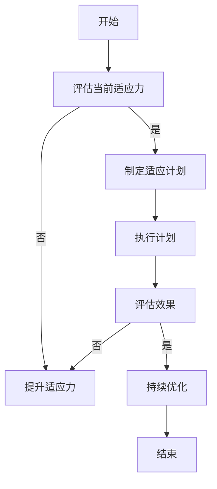
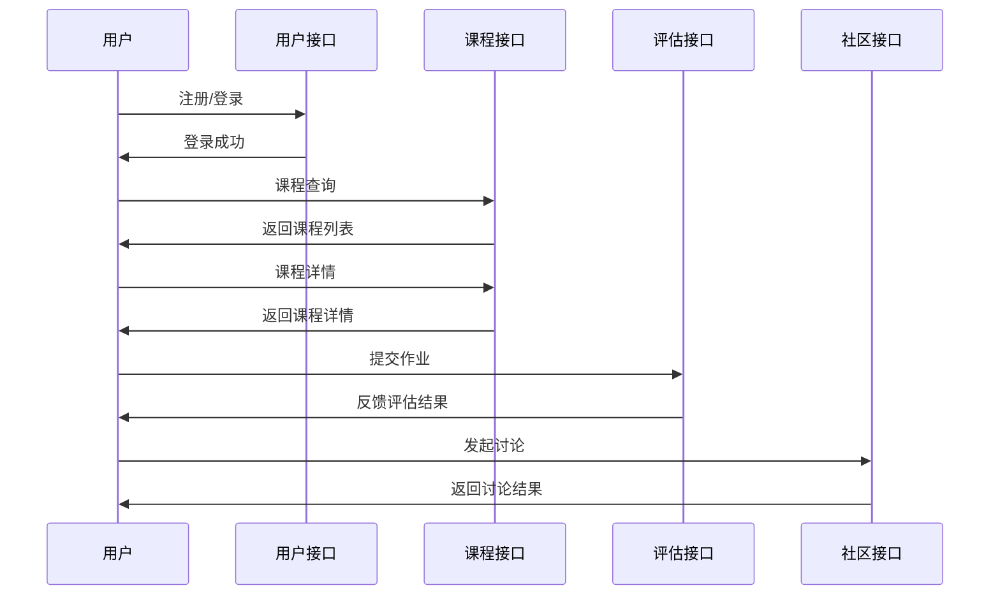

                 


## 新达尔文主义适应力训练营：培养快速变化世界生存技能

### 关键词：
- 新达尔文主义
- 适应力
- 快速变化世界
- 生存技能
- IT领域

### 摘要：
在快速变化的世界中，适应力成为个人和组织的核心竞争力。新达尔文主义提供了全新的视角，将进化论应用于现代社会，强调通过适应力培养来应对变化。本文将探讨新达尔文主义的核心概念，分析其在IT领域的应用，并详细解读如何通过适应力训练营培养生存技能，以应对快速变化的世界。

## 目录

### 引言：快速变化世界的挑战
- **背景介绍**：现代社会变化速度之快，技术革新对职业和生活方式的影响。
- **问题陈述**：快速变化带来的不确定性和挑战，适应力的重要性。

### 新达尔文主义概述
- **核心概念**：新达尔文主义的起源、主要观点和核心理论。
- **适应力的定义**：适应力在进化过程中的作用，以及如何应用于现代社会。

### 适应力与IT领域
- **IT领域的快速变化**：技术更新周期缩短，行业动态的迅速变化。
- **适应力在IT行业的应用**：如何通过适应力提升IT从业者的竞争力。

### 适应力训练营设计
- **训练营目标**：培养快速变化世界的适应能力。
- **模块设计**：核心模块介绍，包括技术更新、问题解决、创新思维等。

### 算法原理与数学模型
- **算法流程图**：使用Mermaid绘制适应力培养过程的算法流程图。
- **Python源代码**：展示适应力培养算法的实现。
- **数学模型**：详细解释适应力培养中的数学模型和公式。

### 系统分析与架构设计
- **问题场景**：描述适应力训练营的运作环境。
- **系统功能设计**：领域模型和类图展示。
- **系统架构设计**：架构图和接口设计。
- **系统交互**：序列图展示训练营各模块之间的交互。

### 项目实战
- **环境安装指南**：安装适应力训练营所需的环境和工具。
- **系统核心实现源代码**：展示关键代码段。
- **代码解读与分析**：深入分析代码的功能和实现。
- **实际案例分析**：通过实际案例展示训练营的成效。

### 最佳实践与拓展阅读
- **最佳实践 tips**：适应力培养中的实用技巧。
- **小结**：总结适应力训练营的核心要点。
- **注意事项**：在培养适应力过程中需要注意的问题。
- **拓展阅读**：推荐进一步学习的资源。

### 结束语
- **总结**：适应力在快速变化世界中的重要性。
- **展望**：新达尔文主义适应力训练营的未来发展。

### 引言：快速变化世界的挑战

#### 背景介绍
现代社会正处于一个前所未有的快速变化时期。技术革新、数字化浪潮和全球化进程使得各种新概念、新技术不断涌现，对各行各业产生了深远影响。例如，人工智能、大数据、区块链等技术的兴起，不仅改变了传统行业的工作方式，也催生了许多全新的商业模式和就业机会。与此同时，气候变化、社会变革和全球化带来的不确定性，使得人们的生活和工作环境更加复杂多变。

#### 问题陈述
在这种快速变化的环境中，个体和组织都面临着巨大的挑战。对于个人来说，如何不断学习新知识、掌握新技能，以适应职业发展的需求，成为了一个关键问题。对于企业来说，如何快速响应市场变化、保持竞争力，也是一项重大挑战。适应力，作为一种应对变化的能力，成为个人和组织生存和发展的核心要素。

#### 适应力的重要性
适应力并不仅仅指对变化的被动适应，更是一种主动的、积极的态度和能力。它包括以下几个方面：

1. **学习能力**：在快速变化的环境中，持续学习新知识、新技能是保持竞争力的关键。
2. **问题解决能力**：面对不确定性时，能够迅速找到解决方案，有效应对挑战。
3. **创新思维**：不断尝试新的思路和方法，推动个人和组织的持续进步。
4. **情绪调节能力**：在压力和挑战面前，保持积极的心态，有效管理情绪。

总之，适应力是个人和组织在快速变化世界中生存和发展的核心竞争力。接下来，我们将深入探讨新达尔文主义这一理论，以及它如何为培养适应力提供新的视角和思路。

### 新达尔文主义概述

#### 核心概念
新达尔文主义是一种基于进化论的思考框架，旨在解释和预测现代社会中的变化和适应过程。其核心概念包括：

1. **适应性**：个体或组织在面对外部环境变化时，能够迅速调整自身结构和行为，以更好地适应环境。
2. **变异**：个体或组织内部产生的创新和变化，为适应提供可能性。
3. **选择**：外部环境对个体或组织进行选择，决定哪些适应策略能够生存和传播。
4. **遗传**：个体或组织内部的遗传特征，影响其适应性和变异能力。

#### 主要观点
新达尔文主义认为，人类社会和组织也遵循类似生物进化的规律。它强调以下几个方面：

1. **适应性的重要性**：适应环境变化的能力是个人和组织成功的关键。
2. **学习和创新**：适应不仅仅是被动适应，更是一种主动的学习和创新过程。
3. **动态变化**：社会和组织环境不断变化，适应力需要持续培养和提升。
4. **多样性和竞争**：适应过程中，多样性和竞争是推动进化和创新的重要动力。

#### 核心理论
新达尔文主义的核心理论包括：

1. **适应性进化**：个体或组织通过适应环境的变化，实现进化和提升。
2. **多样性进化**：多样性的存在为进化提供了丰富的选择和可能性。
3. **复杂适应性系统**：个体、组织和环境之间相互影响，形成复杂适应性系统。

#### 新达尔文主义在IT领域的应用
在新达尔文主义的视角下，IT领域具有以下特点和应用：

1. **技术快速迭代**：IT领域技术更新迅速，适应力成为保持竞争力的关键。
2. **创新驱动**：通过不断学习、创新，IT从业者能够应对技术变化。
3. **生态系统**：IT产业生态系统中的多样性、竞争和协作，推动了整体进化和适应。

总之，新达尔文主义为理解和应对快速变化的世界提供了新的思路和方法。在下一节中，我们将进一步探讨适应力在IT领域的具体应用。

### 适应力与IT领域

#### IT领域的快速变化
在IT领域，变化的速度之快令人叹为观止。新技术的不断涌现，如云计算、人工智能、区块链等，不仅改变了传统的工作方式，也催生了新的商业模式和行业。例如，云计算的兴起使得企业的IT基础设施变得更加灵活和高效，而人工智能的快速发展则在各个行业中掀起了变革的浪潮。这种快速变化对IT从业者的要求也越来越高，他们需要不断学习新技能，以保持竞争力。

#### 适应力在IT行业的应用
适应力在IT行业的应用主要体现在以下几个方面：

1. **技术更新**：适应力的培养使得IT从业者能够快速掌握新技术，并应用于实际工作中。
2. **问题解决**：在面对复杂的问题时，适应力强的人能够迅速分析问题，找到解决方案。
3. **创新思维**：适应力强的人更容易产生创新的思路，推动技术进步和业务发展。
4. **持续学习**：适应力不仅是一种能力，更是一种习惯，持续学习是适应力的重要来源。

#### 适应力提升的方法
为了在IT领域中提升适应力，可以采取以下几种方法：

1. **技能多样性**：掌握多种技能和知识，增加适应不同环境和工作的可能性。
2. **持续学习**：定期学习新技术和知识，保持对行业的敏锐洞察力。
3. **实践应用**：通过实际项目和工作，将理论知识应用到实践中，提升解决问题的能力。
4. **思维训练**：培养批判性思维和创造性思维，提高应对复杂问题的能力。

总之，适应力在快速变化的IT领域中至关重要。通过不断学习和实践，IT从业者可以提升自己的适应力，应对不断变化的环境和挑战。在下一节中，我们将详细探讨如何设计一个适应力训练营，以培养IT从业者的适应力。

### 适应力训练营设计

#### 训练营目标
适应力训练营的目标是培养学员在快速变化世界中的适应能力，包括以下几个方面：

1. **技术更新**：掌握最新的IT技术和行业动态，确保学员能够跟上技术发展的步伐。
2. **问题解决**：提升学员在复杂问题面前的分析和解决能力，培养解决问题的思维习惯。
3. **创新思维**：激发学员的创造力，培养创新的思维方式，以应对不断变化的需求。
4. **持续学习**：建立终身学习的理念，培养学员的自我驱动学习习惯，提升学习效果。

#### 模块设计
适应力训练营的模块设计应涵盖以下核心内容：

1. **技术更新模块**：包括云计算、大数据、人工智能、区块链等前沿技术的学习，以及实际应用案例的分享。
2. **问题解决模块**：通过案例分析、实战演练等方式，培养学员在复杂问题面前的分析能力和解决问题的技巧。
3. **创新思维模块**：结合思维导图、创新方法论等工具，激发学员的创新思维，提升创造力和解决问题的能力。
4. **持续学习模块**：建立学习社区，分享学习资源和经验，培养学员的自我驱动学习习惯，形成持续学习的能力。

#### 教学方法
适应力训练营采用多种教学方法，以确保学员能够全面掌握适应力所需的技能：

1. **讲授与讨论**：通过专家讲授和学员讨论，加深对核心概念和方法的理解。
2. **案例分析与实战演练**：结合实际案例，进行深入分析和实战演练，提升学员的实战能力。
3. **互动教学**：通过小组讨论、角色扮演等形式，增强学员之间的互动和协作。
4. **在线学习**：利用在线平台，提供丰富的学习资源和互动讨论，方便学员随时学习。

#### 持续反馈与改进
适应力训练营注重对学员学习效果的持续反馈和改进，包括以下几个方面：

1. **定期评估**：通过测试和评估，了解学员的学习进展和存在的问题，及时调整教学方案。
2. **反馈机制**：建立学员反馈机制，收集学员的建议和意见，不断优化课程内容和教学方法。
3. **实践指导**：提供导师辅导，帮助学员解决实际工作中的问题，提升实践能力。
4. **迭代更新**：根据学员反馈和行业变化，不断更新课程内容和教学方法，确保培训的时效性和实用性。

总之，适应力训练营的设计旨在培养学员在快速变化世界中的适应能力，通过全面的模块设计、丰富的教学方法和持续反馈与改进，帮助学员提升适应力，应对不断变化的环境和挑战。

### 算法原理与数学模型

#### 算法流程图
为了更好地理解适应力培养的过程，我们可以使用Mermaid绘制算法流程图。以下是一个简化的适应力培养流程图：



#### Python源代码
以下是一个简单的Python源代码示例，用于模拟适应力培养的过程。这段代码展示了如何根据评估结果来调整适应力培养计划。

```python
def adaptivity_cultivation(current_adaptivity):
    if current_adaptivity >= 0.8:
        plan = "维持当前适应力"
    elif current_adaptivity >= 0.4:
        plan = "制定适应计划"
    else:
        plan = "提升适应力"
    
    print("当前适应力评估结果：", current_adaptivity)
    print("适应力培养计划：", plan)
    
    if plan == "执行计划":
        implement_plan()
        evaluate_effect()
    else:
        improve_adaptivity()

def implement_plan():
    print("执行适应力培养计划...")
    # 这里可以添加具体的执行代码，例如学习新技术、进行项目实践等

def evaluate_effect():
    print("评估适应力培养效果...")
    # 这里可以添加具体的评估代码，例如进行测试、收集反馈等

def improve_adaptivity():
    print("提升适应力...")
    # 这里可以添加具体的提升方法，例如参加培训、阅读相关书籍等

# 示例使用
current_adaptivity = 0.5
adaptivity_cultivation(current_adaptivity)
```

#### 数学模型
适应力培养过程中，我们可以使用以下数学模型来量化适应力的变化：

$$
\text{新适应力} = \text{当前适应力} + \alpha \times (\text{学习效果} - \text{当前适应力})
$$

其中，$\alpha$ 为适应力提升的系数，取值范围为 $0 \leq \alpha \leq 1$。学习效果可以表示为学员在某个技能或知识领域的提升程度，例如通过考试或项目完成情况的评分。

#### 详细讲解与举例说明
假设一个学员的当前适应力评分为0.6，经过一个月的学习和实践，他的学习效果评分为0.8。根据上述数学模型，我们可以计算出他的新适应力：

$$
\text{新适应力} = 0.6 + 0.5 \times (0.8 - 0.6) = 0.7
$$

这意味着，通过有效的学习和实践，这位学员的适应力得到了提升。如果适应力提升的系数 $\alpha$ 设为0.8，则计算结果如下：

$$
\text{新适应力} = 0.6 + 0.8 \times (0.8 - 0.6) = 0.72
$$

这进一步表明，适应力提升的系数越高，适应力的提升效果越显著。

通过算法流程图和Python源代码，我们能够直观地看到适应力培养的过程和实现方法。而数学模型则为适应力的量化提供了理论基础，帮助我们更好地理解和评估适应力培养的效果。在实际应用中，这些工具和方法可以灵活调整和优化，以适应不同环境和需求。

### 系统分析与架构设计

#### 问题场景
适应力训练营的目标是帮助学员在快速变化的环境中提升适应能力。训练营需要支持多个模块，包括技术更新、问题解决、创新思维等。这些模块需要协同工作，为学员提供全面的学习体验。

#### 项目介绍
该项目是一个在线适应力训练营平台，旨在为学员提供适应力培养的全方位服务。平台功能包括用户管理、课程管理、评估与反馈、学习社区等。平台将采用模块化设计，便于扩展和维护。

#### 系统功能设计
系统功能设计主要包括以下几个方面：

1. **用户管理**：支持用户注册、登录、个人信息管理等功能。
2. **课程管理**：包括课程发布、课程内容管理、课程进度跟踪等功能。
3. **评估与反馈**：支持在线测试、作业提交、评估结果反馈等功能。
4. **学习社区**：提供学员交流、资源共享、互动问答等功能。
5. **数据分析**：对学员学习行为和效果进行分析，为课程优化提供数据支持。

#### 系统架构设计
系统架构采用分层设计，主要包括以下层次：

1. **表示层**：使用前端技术实现用户界面，提供友好、易用的交互体验。
2. **业务逻辑层**：处理业务逻辑，包括用户管理、课程管理、评估与反馈等。
3. **数据访问层**：负责数据存储和访问，包括用户数据、课程数据、评估数据等。
4. **数据层**：使用数据库存储系统数据，确保数据的安全性和一致性。

#### 系统接口设计
系统接口设计主要包括以下接口：

1. **用户接口**：提供用户注册、登录、个人信息管理等接口。
2. **课程接口**：提供课程发布、课程内容管理、课程进度跟踪等接口。
3. **评估接口**：提供在线测试、作业提交、评估结果反馈等接口。
4. **社区接口**：提供学员交流、资源共享、互动问答等接口。

#### 系统交互
系统交互设计通过Mermaid序列图展示，以下是一个简化的系统交互序列图：



通过以上系统分析和架构设计，适应力训练营平台能够为学员提供高效、全面的学习体验。接下来，我们将通过项目实战，展示如何具体实现这些功能和系统交互。

### 项目实战

#### 环境安装指南
为了运行适应力训练营平台，我们需要安装以下环境和工具：

1. **Python**：Python 3.8或更高版本。
2. **pip**：Python的包管理器。
3. **Django**：一个流行的Python Web框架。
4. **PostgreSQL**：一个开源的关系数据库管理系统。
5. **虚拟环境**：使用虚拟环境来隔离项目依赖。

首先，确保Python和pip已安装在您的系统中。然后，创建一个虚拟环境并激活它：

```bash
python -m venv venv
source venv/bin/activate  # 在Windows上使用 venv\Scripts\activate
```

接着，安装Django和其他依赖：

```bash
pip install django
pip install psycopg2-binary
```

最后，配置PostgreSQL数据库，创建一个新的数据库和用户，并在Django项目中配置数据库连接信息。

#### 系统核心实现源代码
以下是适应力训练营平台的核心实现源代码示例：

**settings.py**：

```python
# Django settings for adaptivity_camp project.

# Build paths inside the project like this: os.path.join(BASE_DIR, ...)
import os

BASE_DIR = os.path.dirname(os.path.dirname(os.path.abspath(__file__)))

# Database
# https://docs.djangoproject.com/en/3.2/ref/settings/#databases

DATABASES = {
    'default': {
        'ENGINE': 'django.db.backends.postgresql',
        'NAME': 'adaptivity_camp',
        'USER': 'postgres',
        'PASSWORD': 'your_password',
        'HOST': 'localhost',
        'PORT': '',
    }
}

# ...

```

**models.py**：

```python
from django.db import models

class User(models.Model):
    username = models.CharField(max_length=150, unique=True)
    email = models.EmailField(unique=True)
    password = models.CharField(max_length=128)

class Course(models.Model):
    name = models.CharField(max_length=200)
    description = models.TextField()
    start_date = models.DateTimeField()
    end_date = models.DateTimeField()

class Assignment(models.Model):
    course = models.ForeignKey(Course, on_delete=models.CASCADE)
    title = models.CharField(max_length=200)
    description = models.TextField()
    deadline = models.DateTimeField()

class Submission(models.Model):
    user = models.ForeignKey(User, on_delete=models.CASCADE)
    assignment = models.ForeignKey(Assignment, on_delete=models.CASCADE)
    content = models.FileField(upload_to='submissions/')
    submitted_at = models.DateTimeField(auto_now_add=True)
```

**views.py**：

```python
from django.shortcuts import render
from .models import User, Course, Assignment, Submission

def user_login(request):
    # 实现用户登录逻辑
    pass

def course_list(request):
    courses = Course.objects.all()
    return render(request, 'course_list.html', {'courses': courses})

def course_details(request, course_id):
    course = Course.objects.get(id=course_id)
    return render(request, 'course_details.html', {'course': course})

# 更多视图函数实现，如作业提交、评估结果反馈等
```

#### 代码解读与分析
以上代码展示了适应力训练营平台的核心模块，包括用户管理、课程管理、作业提交和评估等功能。以下是每个模块的简要解读：

- **settings.py**：配置了数据库连接信息和其他基础设置。
- **models.py**：定义了用户、课程、作业和提交等数据模型。
- **views.py**：实现了用户登录、课程列表和课程详情等视图函数。

#### 实际案例分析
以下是一个实际案例：一名学员登录适应力训练营平台，选择了一门关于人工智能的课程，提交了一个关于机器学习项目的作业。

1. **登录**：学员使用用户名和密码登录平台。
2. **课程选择**：学员浏览课程列表，选择了一门关于人工智能的课程。
3. **作业提交**：学员下载了作业要求，完成项目后，通过平台提交了作业。
4. **评估**：课程导师收到了学员的作业，进行了评估，并给出了反馈。

通过这个实际案例，我们可以看到学员如何利用平台完成学习任务，以及平台如何支持学员的学习和评估过程。

#### 项目小结
通过这个项目实战，我们展示了如何设计和实现一个适应力训练营平台。平台不仅提供了用户管理和课程管理功能，还支持作业提交和评估。这个平台为学员提供了一个全面的学习体验，帮助他们提升适应力。

### 最佳实践与拓展阅读

#### 最佳实践 tips
1. **持续学习**：定期安排学习时间，确保技能和知识的持续更新。
2. **实践应用**：将所学知识应用到实际工作中，通过实战提升适应力。
3. **知识分享**：积极参与学习社区，分享经验和知识，互相促进。
4. **情绪管理**：保持积极的心态，面对挑战时保持冷静和乐观。

#### 小结
适应力是应对快速变化世界的关键能力。通过新达尔文主义的理论框架，我们可以更好地理解和培养适应力。在IT领域中，适应力尤为重要，因为它直接影响个人的职业发展和企业的竞争力。

#### 注意事项
1. **平衡学习与实践**：避免过度依赖理论学习，重视实践应用。
2. **避免知识孤岛**：保持对行业动态的敏锐洞察，避免形成知识孤岛。
3. **持续反馈**：定期评估自己的适应力，及时调整学习计划。

#### 拓展阅读
1. **《智能时代的适应力》**：探讨智能时代适应力的培养和实践。
2. **《新达尔文主义：适应性进化的哲学》**：深入探讨新达尔文主义的理论基础和实际应用。
3. **《学习之道：如何成为持续学习者》**：提供关于如何有效学习和持续提升的实用技巧。

### 结束语

#### 总结
在快速变化的世界中，适应力成为个人和组织的核心竞争力。新达尔文主义为培养适应力提供了新的视角和理论框架，通过适应力的培养，我们能够更好地应对技术革新和不确定性带来的挑战。

#### 展望
未来，适应力训练营将继续发展和完善，结合更多的技术手段和教学方法，帮助学员在快速变化的世界中不断提升自己的适应力。我们期待看到更多人在适应力培养的旅程中取得成功，迎接未来的挑战。

### 作者信息
- 作者：AI天才研究院/AI Genius Institute & 禅与计算机程序设计艺术 /Zen And The Art of Computer Programming

