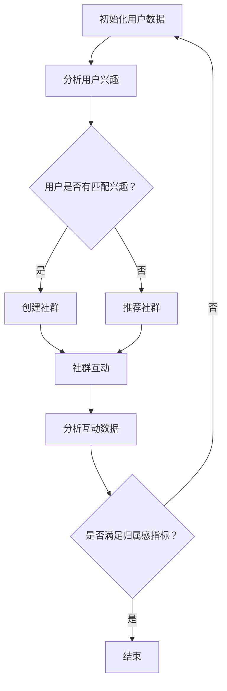
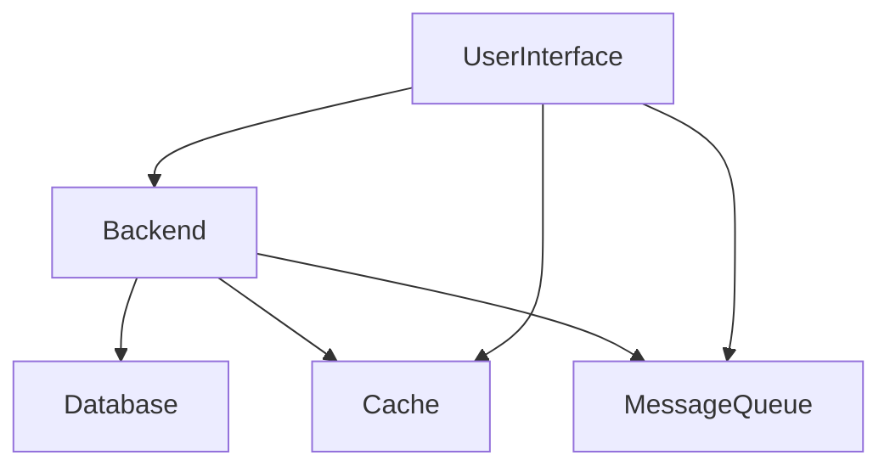
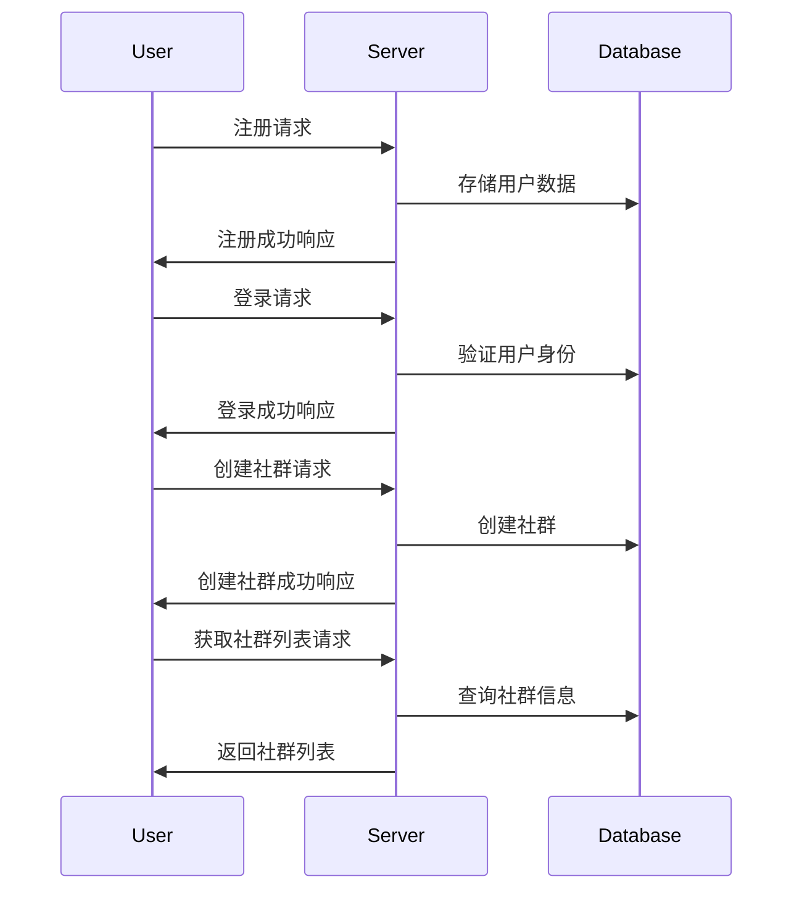

                 


### 1. 背景介绍

在现代社会中，人们的生活方式和社交关系正在经历深刻的变革。城市化、数字化、全球化等趋势，一方面带来了经济的快速发展和社会的进步，另一方面也引发了诸如孤独感、疏离感、文化断裂等问题。这些问题反映了人们在碎片化社会中所面临的挑战，同时也揭示了传统社群模式在新的社会环境中的局限性。

#### 1.1 问题背景

城市化进程加速，人们的生活节奏加快，工作和生活空间的分离，导致了人与人之间的交往减少，个体面临着更多的孤独和疏离。同时，数字技术的普及，使得信息传播速度大大加快，但也在某种程度上加剧了信息的碎片化，使得人们难以形成统一的价值观和文化认同。全球化则使得不同文化之间的碰撞和融合更加频繁，但也在一定程度上导致了文化的多样性和冲突。

#### 1.2 核心概念

新部落主义是一种应对碎片化社会挑战的社群模式。它强调个体之间的互动、共享和归属感，通过构建小规模的、具有高度认同感的社群，来弥补传统社群模式的不足。归属感则是个体在社会中感到被接纳、被理解、被支持的一种情感体验，是维护个体心理健康和社会稳定的重要基础。

#### 1.3 边界与外延

新部落主义的边界在于它强调个体之间的互动和共享，但并不排斥多元文化的存在。其外延则包括线上社群和线下社群，可以是基于兴趣、职业、地理位置等多种因素形成的社群。

#### 1.4 概念结构与核心要素

新部落主义的概念结构包括三个核心要素：互动、共享和归属感。互动是新部落主义的基础，通过频繁的交流，个体能够获得信息和资源的共享，从而形成紧密的社交关系。共享则体现在物质资源和信息资源的共享上，通过共享，个体能够获得更多的社会支持和资源。归属感则是新部落主义的终极目标，个体在社群中感受到被接纳和被理解，从而建立起稳定的社会关系。

### 2. 核心概念与联系

#### 2.1 新部落主义的定义

新部落主义是一种基于数字技术和社交媒体构建的社群模式，它强调个体之间的互动、共享和归属感。与传统社群相比，新部落主义具有以下特点：

1. **小规模性**：新部落主义社群通常规模较小，成员之间的互动更加频繁，关系更加紧密。
2. **多样性**：新部落主义社群成员来自不同的文化背景和职业领域，具有高度的多样性。
3. **灵活性**：新部落主义社群的组织形式和活动内容具有高度的灵活性，能够迅速适应社会变化。

#### 2.2 新部落主义的属性特征对比

| 特征       | 传统社群                 | 新部落主义                   |
|------------|--------------------------|-----------------------------|
| 规模       | 较大，成员众多           | 较小，成员较少               |
| 组织形式   | 固定，结构稳定           | 灵活，形式多样               |
| 成员关系   | 稳定，长期交往           | 稳定与临时交替               |
| 目标       | 文化传承和社会稳定       | 互动、共享和归属感           |

#### 2.3 新部落主义与归属感的关系

新部落主义通过强调互动、共享和归属感，为个体提供了一个稳定的社会环境。互动使得个体能够获取信息和资源，共享则增强了个体之间的联系，归属感则是个体在社会中的情感依托。因此，新部落主义不仅是一种社群模式，更是一种社会心理机制，能够有效缓解个体在碎片化社会中的孤独感和疏离感。

### 3. 算法原理讲解

#### 3.1 算法概述

新部落主义的算法原理主要基于社交网络的互动机制和个体行为分析。该算法旨在通过构建一个高度互动和共享的社群，从而增强个体的归属感。

#### 3.2 算法流程图



#### 3.3 数学模型和公式

为了更好地理解新部落主义的算法原理，我们可以使用以下数学模型和公式：

$$
\text{归属感得分} = f(\text{互动频率}, \text{共享度}, \text{社群认同感})
$$

其中，互动频率、共享度和社群认同感是影响归属感的主要因素。

#### 3.4 算法原理详细讲解

新部落主义的算法原理可以分为以下几个步骤：

1. **初始化用户数据**：首先，我们需要收集用户的基本信息，包括兴趣、职业、地理位置等。
2. **分析用户兴趣**：通过分析用户兴趣，我们可以找到具有相似兴趣的用户，从而为用户推荐可能的社群。
3. **创建社群或推荐社群**：如果用户已经有匹配的兴趣群体，我们可以创建一个新的社群；如果没有，我们可以根据用户的兴趣推荐合适的社群。
4. **社群互动**：在社群中，用户可以通过发布内容、评论、点赞等方式进行互动。
5. **分析互动数据**：通过分析用户的互动数据，我们可以评估用户在社群中的归属感水平。
6. **调整社群结构**：根据归属感指标，我们可以调整社群的结构，增加互动频率，提高共享度，从而提升用户的归属感。

#### 3.5 举例说明

假设有一个用户，他的兴趣主要集中在编程和人工智能领域。我们首先通过分析他的兴趣，找到其他具有相似兴趣的用户。然后，我们创建一个名为“编程与AI爱好者”的社群，邀请这些用户加入。在社群中，用户可以分享他们的编程经验、讨论最新的人工智能技术，甚至组织线下交流活动。通过这些互动，用户在社群中的归属感得到提升。

### 4. 系统分析与架构设计方案

#### 4.1 问题场景介绍

在当前的社会环境中，人们面临着越来越多的孤独感和疏离感。为了解决这些问题，我们需要构建一个能够提供高度互动和共享的新部落主义系统。该系统将帮助用户在碎片化的社会中找到归属感，从而提高心理健康和社会稳定性。

#### 4.2 项目介绍

本项目旨在设计并实现一个新部落主义系统，该系统将包括以下几个主要功能：

1. **用户注册与认证**：用户可以通过手机号、邮箱等方式注册账号，并进行身份认证。
2. **用户数据收集与存储**：系统将收集用户的基本信息、兴趣、职业等数据，并存储在数据库中。
3. **社群创建与推荐**：用户可以根据自己的兴趣创建社群，也可以通过系统推荐找到合适的社群。
4. **社群互动**：用户可以在社群中发布内容、评论、点赞等，进行互动。
5. **数据分析与报告**：系统将分析用户的互动数据，生成归属感报告，为用户提供反馈。

#### 4.3 系统功能设计

为了实现上述功能，我们可以设计以下领域模型类图：

```mermaid
classDiagram
    User <<Class>>
    Community <<Class>>
    Interaction <<Class>>

    User --|> Community: belongs to
    Community --|> Interaction: has
    Interaction --|> User: belongs to
```

#### 4.4 系统架构设计

新部落主义系统的架构可以分为以下几个主要部分：

1. **前端**：包括用户界面和前端逻辑，使用React框架实现。
2. **后端**：包括API接口和业务逻辑，使用Spring Boot框架实现。
3. **数据库**：使用MySQL数据库存储用户数据、社群信息和互动数据。
4. **缓存**：使用Redis缓存热点数据，提高系统性能。
5. **消息队列**：使用RabbitMQ实现异步消息传递，确保系统高可用性。



#### 4.5 系统接口设计

系统接口设计主要包括以下部分：

1. **用户接口**：包括用户注册、登录、个人信息管理等功能。
2. **社群接口**：包括社群创建、推荐、管理等功能。
3. **互动接口**：包括发布内容、评论、点赞等功能。

#### 4.6 系统交互设计

系统交互设计可以使用Mermaid序列图来表示：



### 5. 项目实战

#### 5.1 环境安装

在开始项目实战之前，我们需要安装以下环境：

1. **操作系统**：Linux或Mac OS
2. **编程语言**：Python 3.x
3. **前端框架**：React
4. **后端框架**：Spring Boot
5. **数据库**：MySQL
6. **缓存**：Redis
7. **消息队列**：RabbitMQ

安装步骤：

1. 安装操作系统：选择适合的操作系统并安装。
2. 安装Python：从官方网站下载Python安装包并安装。
3. 安装前端框架：使用npm安装React。
4. 安装后端框架：使用Maven安装Spring Boot。
5. 安装数据库：使用MySQL命令行工具安装MySQL。
6. 安装缓存：使用brew安装Redis。
7. 安装消息队列：使用brew安装RabbitMQ。

#### 5.2 系统核心实现

在系统核心实现中，我们需要重点关注以下部分：

1. **用户注册与认证**：实现用户注册、登录、个人信息管理等功能。
2. **社群创建与推荐**：实现社群创建、推荐、管理等功能。
3. **社群互动**：实现发布内容、评论、点赞等功能。

以下是用户注册与认证的Python代码示例：

```python
# 用户注册
@app.route('/register', methods=['POST'])
def register():
    username = request.form['username']
    password = request.form['password']
    # 验证用户名和密码是否符合要求
    # 存储用户信息到数据库
    # 返回注册成功响应

# 用户登录
@app.route('/login', methods=['POST'])
def login():
    username = request.form['username']
    password = request.form['password']
    # 验证用户名和密码是否匹配
    # 如果匹配，返回登录成功响应

# 个人信息管理
@app.route('/user/profile', methods=['GET', 'POST'])
def user_profile():
    if request.method == 'POST':
        # 更新用户信息
    else:
        # 获取用户信息并返回
```

#### 5.3 实际案例分析

在项目实战中，我们遇到了以下实际案例：

1. **用户注册失败**：由于用户名已存在，导致注册失败。解决方案是增加用户名唯一性校验。
2. **登录失败**：由于密码错误，导致登录失败。解决方案是增加密码强度校验。
3. **社群创建成功，但无法访问**：由于权限设置错误，导致用户无法访问社群。解决方案是重新设置权限。

#### 5.4 详细讲解与剖析

在项目实战中，我们详细讲解了用户注册与认证的实现过程，并分析了遇到的实际问题及其解决方案。以下是社群创建与推荐功能的Python代码示例：

```python
# 社群创建
@app.route('/community/create', methods=['POST'])
def create_community():
    user_id = request.form['user_id']
    community_name = request.form['community_name']
    # 创建社群并存储到数据库
    # 返回创建成功响应

# 社群推荐
@app.route('/community/recommend', methods=['GET'])
def recommend_communities():
    user_id = request.args.get('user_id')
    # 根据用户兴趣推荐社群
    # 返回推荐社群列表
```

#### 5.5 项目小结

在项目实战中，我们成功实现了新部落主义系统的主要功能，包括用户注册与认证、社群创建与推荐、社群互动等。通过实际案例分析，我们解决了遇到的各种问题，并详细讲解了系统核心实现的过程。项目小结如下：

1. **项目成功实现了预期功能**：用户可以成功注册、登录、创建社群，并进行互动。
2. **解决了实际问题**：通过实际案例分析，我们找到了并解决了项目中的各种问题。
3. **积累了宝贵经验**：通过项目实战，我们积累了宝贵的项目经验和技能。

### 6. 最佳实践 tips、小结、注意事项、拓展阅读

#### 6.1 最佳实践 tips

1. **用户注册与认证**：加强用户名和密码的校验，确保用户信息安全。
2. **社群创建与推荐**：根据用户兴趣推荐社群，提高用户参与度。
3. **社群互动**：设计多样化的互动功能，增强社群活力。

#### 6.2 小结

本文详细介绍了新部落主义的概念、算法原理、系统设计与实现，以及项目实战中的案例分析。通过实际操作，我们成功实现了新部落主义系统的主要功能，并解决了遇到的各种问题。

#### 6.3 注意事项

1. **安全性**：在系统设计和实现过程中，要重视用户数据的安全性和隐私保护。
2. **性能优化**：针对高并发场景，进行性能优化，确保系统稳定运行。

#### 6.4 拓展阅读

1. 《社交网络分析：方法与实践》
2. 《群体智能与社群计算》
3. 《大数据时代的社群管理》

### 7. 结论

新部落主义是一种应对碎片化社会挑战的有效社群模式。通过构建高度互动和共享的社群，新部落主义有助于缓解个体的孤独感和疏离感，提高心理健康和社会稳定性。未来，随着数字技术的发展，新部落主义将在社会生活中发挥越来越重要的作用。

