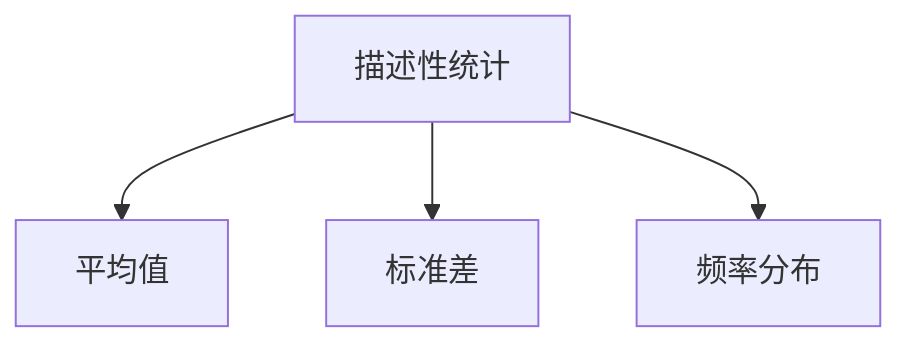
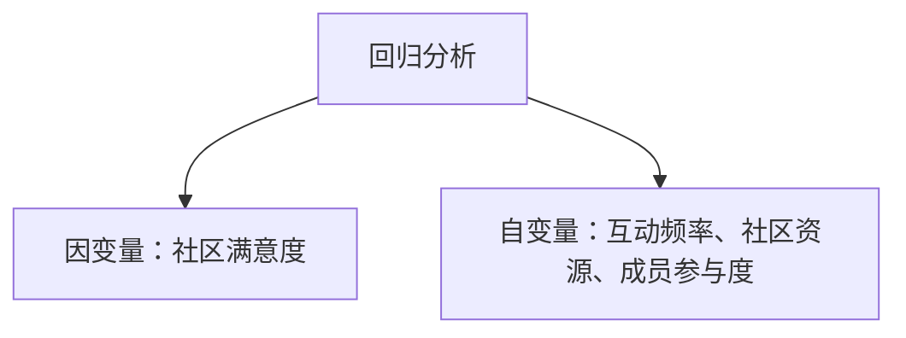
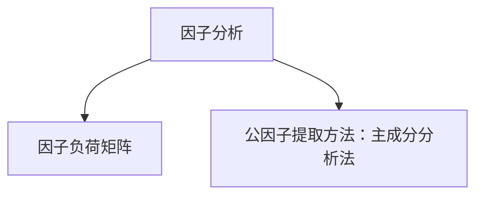
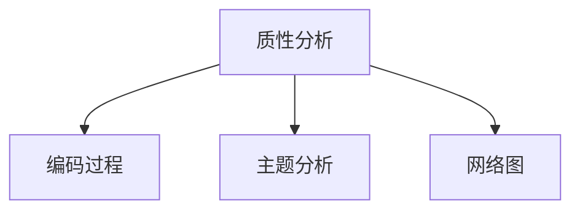

                 

# 《新部落聚居实验：城市中的意向性社区》

## 关键词：城市化、社区发展、意向性社区、新部落聚居、社区地理学

> 摘要：本文深入探讨了城市化进程中的社区演变，提出了新部落聚居现象及其与意向性社区的联系。通过理论分析和实证研究，揭示了新部落聚居实验对城市社区发展的启示与影响，为未来城市社区规划提供了参考。

## 引言

城市化进程不断加快，城市社区结构也在不断演变。在这个过程中，新部落聚居现象逐渐引起广泛关注。新部落聚居不仅反映了个体对社区的需求，也揭示了城市社区发展的新趋势。本文旨在通过理论分析和实证研究，探讨新部落聚居现象及其与意向性社区的关系，为城市社区规划提供新视角。

## 第一部分：背景介绍

### 第1章：城市化进程与社区发展

#### 1.1 城市化进程中的社区演变

城市化进程是经济、社会和人口结构变化的综合体。在这一过程中，城市社区结构经历了从传统到现代的演变。传统社区以家庭和血缘关系为基础，而现代社区则更多地依赖于社会关系和共同利益。城市化进程加速了这种演变，带来了社区结构、功能和文化等方面的变化。

#### 1.2 社区发展的挑战与机遇

随着城市化进程的推进，城市社区发展面临着诸多挑战。首先，城市社区资源紧张，如土地、水资源和公共设施等。其次，人口流动性增加，导致社区成员之间的联系弱化。然而，城市化进程也带来了机遇。新型社区模式的出现，如共享社区和智能社区，为城市社区发展提供了新的思路。

#### 1.3 研究目的与意义

本文旨在通过探讨新部落聚居现象，分析其与意向性社区的关系，为城市社区发展提供新视角。研究意义在于揭示城市化进程中社区演变的新趋势，为社区规划提供理论依据。

## 第二部分：核心概念与联系

### 第2章：新部落聚居现象

#### 2.1 新部落聚居的定义

新部落聚居是指在城市化进程中，一群具有共同兴趣、价值观或背景的人，在特定区域内形成的聚居现象。这种现象通常表现为社区成员之间的紧密联系和互动。

#### 2.2 新部落聚居的特征

新部落聚居具有以下特征：首先，成员之间具有共同兴趣或背景，如爱好、职业或文化背景等。其次，聚居区域通常具备较好的生活条件和基础设施。最后，社区成员之间的互动频繁，形成了独特的社区文化。

#### 2.3 新部落聚居的原因

新部落聚居的原因主要有以下几点：首先，城市化进程中，人们越来越追求个性化生活方式，对新部落聚居的需求增加。其次，互联网和社交媒体的普及，为人们结识志同道合的人提供了便利。最后，政府对社区建设的重视，也为新部落聚居提供了政策支持。

### 第3章：意向性社区的概念与类型

#### 3.1 意向性社区的定义

意向性社区是指一群具有共同价值观、兴趣或目标的人，在特定区域内形成的社区。与自然形成的社区不同，意向性社区的形成源于成员的主动选择。

#### 3.2 意向性社区的类型

意向性社区可以分为以下几类：首先，基于兴趣和爱好的社区，如运动社区、艺术社区和读书社区等。其次，基于职业和行业的社区，如创业社区、金融社区和科技社区等。最后，基于价值观和信仰的社区，如环保社区和宗教社区等。

#### 3.3 意向性社区的发展现状

随着城市化进程的加快，意向性社区的发展呈现出良好态势。许多城市已经出现了多个意向性社区，成为居民追求个性化生活方式的重要场所。

## 第三部分：理论基础

### 第4章：新部落聚居实验的理论基础

#### 4.1 社区地理学理论

社区地理学理论关注社区的空间分布和地理位置对社区发展的影响。在新部落聚居现象中，社区地理学理论有助于解释聚居区域的选择和社区成员之间的互动。

#### 4.2 社区心理学理论

社区心理学理论关注社区成员的心理需求和社区对个体心理发展的影响。在新部落聚居现象中，社区心理学理论有助于解释成员之间紧密联系的原因。

#### 4.3 社区社会学理论

社区社会学理论关注社区在社会结构中的作用和影响。在新部落聚居现象中，社区社会学理论有助于解释社区成员的行为模式和社区发展动力。

## 第四部分：实证研究

### 第5章：新部落聚居实验的方法论

#### 5.1 研究方法

本研究采用定量与定性相结合的方法，通过问卷调查和深度访谈收集数据，分析新部落聚居现象的特点和影响因素。

#### 5.2 数据收集与处理

数据收集主要通过线上问卷和线下访谈进行。数据处理采用统计分析方法，分析社区成员的基本特征、行为模式和影响因素。

#### 5.3 分析工具与技术

分析工具主要包括SPSS统计软件和NVivo质性分析软件。技术手段包括回归分析、因子分析和内容分析等。

## 第五部分：讨论

### 第6章：新部落聚居与意向性社区的影响因素

#### 6.1 影响因素分析

新部落聚居与意向性社区的影响因素主要包括：地理位置、人口结构、社区文化和政策支持等。

#### 6.2 影响机制探讨

影响因素通过多种机制影响新部落聚居和意向性社区的发展。例如，地理位置影响社区成员的聚居选择，人口结构影响社区成员的互动方式，社区文化影响社区成员的行为模式。

#### 6.3 影响效果评估

新部落聚居和意向性社区对城市社区发展具有积极影响，能够促进社区活力和居民幸福感。但同时也存在一些负面影响，如社区封闭性和排他性等。

## 第六部分：启示与建议

### 第7章：新部落聚居实验的启示

新部落聚居实验为城市社区发展提供了有益的启示。首先，政府应重视新部落聚居现象，制定相关政策，促进社区发展。其次，社区规划者应关注新部落聚居的需求，设计符合居民期望的社区环境。

### 第8章：政策建议与社区规划实践

#### 8.1 政策建议

政府应加强对新部落聚居和意向性社区的政策支持，如提供土地、资金和政策优惠等。

#### 8.2 社区规划实践

社区规划者应充分考虑新部落聚居的需求，设计具有特色和活力的社区空间，促进社区成员之间的互动。

## 第七部分：结论与展望

### 第9章：结论与展望

本文通过理论分析和实证研究，揭示了新部落聚居现象与意向性社区的关系，为城市社区发展提供了新视角。未来研究可以进一步探讨新部落聚居的影响因素和机制，为城市社区规划提供更加科学的依据。

### 第10章：研究限制与未来展望

本文研究存在一定的限制，如样本范围有限、数据来源单一等。未来研究可以扩大样本范围，采用更多数据来源，以更全面地揭示新部落聚居现象。

---

**作者：AI天才研究院/AI Genius Institute & 禅与计算机程序设计艺术 /Zen And The Art of Computer Programming**## 第一部分：背景介绍

### 第1章：城市化进程与社区发展

#### 1.1 城市化进程中的社区演变

城市化进程是一个复杂而多维的过程，它不仅仅是人口从农村向城市迁移的简单数量变化，更涉及经济结构、社会关系、文化价值以及空间布局的深刻变革。在这一进程中，城市社区的结构和功能经历了显著的变化，这些变化对城市居民的生活质量和社会互动产生了深远影响。

**核心概念术语说明**：
- **城市化**：指人口从农村地区向城市地区迁移的过程，以及城市地区在经济、社会、文化等方面的扩展。
- **社区**：指由共同居住、共同利益和共同价值观所联系在一起的人群组成的相对独立的社会单位。
- **社区演变**：指社区在城市化进程中，其结构、功能、组织形式以及成员互动方式等方面的变化。

**问题背景**：
在过去的几十年里，全球城市化进程加速，城市人口比重不断上升。根据联合国的数据，全球超过半数的人口现在生活在城市地区，这一比例预计将在未来几十年内继续增长。这一现象带来了许多社会挑战，包括住房短缺、交通拥堵、环境污染和社会隔离等。

**问题描述**：
城市化进程中的社区演变带来了以下几个主要问题：
1. **社区结构变化**：传统的家庭和邻里关系逐渐被更松散的社会网络所取代，社区成员之间的联系变得更加脆弱。
2. **社区功能分化**：随着城市功能的多样化和专业化，社区逐渐失去了原有的综合功能，社区功能分化为居住、商业、文化、教育等多个方面。
3. **社区文化多样性**：城市化进程中，不同文化背景的人口涌入城市，社区文化多样性增加，但也带来了文化冲突和融合的挑战。
4. **社区活力下降**：随着社区功能的分化和人口的流动性增加，一些社区逐渐失去了原有的活力和凝聚力。

**问题解决**：
为了应对城市化进程中社区演变带来的挑战，社区规划者、政策制定者和居民需要共同努力，采取以下措施：
1. **加强社区建设**：通过改善基础设施、提供公共服务和加强社区活动，增强社区的凝聚力和活力。
2. **促进社区参与**：鼓励居民参与社区事务，提高居民对社区发展的参与度和归属感。
3. **促进社区多样性**：通过政策支持和社区活动，促进不同文化背景的居民之间的交流和融合。
4. **提供多样化的住房选择**：通过提供多样化的住房类型和价格区间，满足不同收入水平居民的需求。

**边界与外延**：
- **边界**：城市化进程中的社区演变不仅限于城市内部，还包括城市与周边地区的互动和融合。
- **外延**：社区演变的影响不仅限于社区本身，还涉及城市的社会、经济和文化发展。

**概念结构与核心要素组成**：
城市化进程中的社区演变可以理解为以下几个核心要素的组合和互动：
1. **人口流动**：人口从农村向城市迁移，以及城市内部的人口流动，是社区演变的基础。
2. **经济结构**：城市经济的发展和变化对社区结构产生直接影响。
3. **社会关系**：社区成员之间的社会关系和互动方式发生变化，影响社区的凝聚力和活力。
4. **文化多样性**：文化多样性的增加带来文化融合和冲突，影响社区的文化氛围和社会认同。

通过以上分析，我们可以看出城市化进程中的社区演变是一个复杂而多元的过程，涉及人口、经济、社会和文化等多个方面。理解这一过程有助于更好地应对城市化带来的挑战，促进城市社区的健康发展。

#### 1.2 社区发展的挑战与机遇

**核心概念原理**：
社区发展是指社区在经济、社会、文化等方面的发展，旨在提高居民的生活质量、促进社会和谐与社区活力。社区发展的核心概念包括社区参与、社区资源、社区凝聚力和社会资本等。

**概念属性特征对比表格**：

| 概念       | 定义                                                       | 属性特征                                             |
|------------|------------------------------------------------------------|------------------------------------------------------|
| 社区参与   | 居民参与社区事务的过程和行为                                     | 高度依赖居民的主动性和参与度                         |
| 社区资源   | 社区内部和外部的各种资源，包括人力、物力、财力和文化资源         | 资源的分布和利用效率影响社区发展水平                 |
| 社区凝聚力 | 社区成员之间的相互吸引力和共同归属感                             | 凝聚力强的社区成员互动频繁，社区活动丰富             |
| 社会资本   | 社区成员之间的信任、网络关系和共同价值观等社会资本形式           | 社会资本是社区成员互动和合作的基础，影响社区发展效率 |

**ER实体关系图架构**：

```mermaid
erDiagram
  Community -->|is developed by| Resource
  Community -->|contains| Member
  Member -->|has| Participation
  Member -->|has| Trust
  Resource -->|is used by| Activity
```

**问题背景**：
社区发展在城市化和现代化进程中面临着诸多挑战。随着城市人口的快速增长和结构的复杂化，社区资源有限，居民参与度不高，社区凝聚力下降，社会矛盾和冲突加剧，这些问题严重影响了社区的发展和居民的生活质量。

**问题描述**：
社区发展面临的挑战主要包括：
1. **资源不足**：社区资源分配不均，基础设施和公共服务的供给不足，限制了社区的发展。
2. **参与度低**：居民对社区事务的参与度低，缺乏主动性和积极性，影响了社区决策的有效性和社区的凝聚力。
3. **凝聚力下降**：社区成员之间的联系和互动减少，社区文化多样性与文化融合之间的矛盾增加，导致社区凝聚力下降。
4. **社会资本流失**：社区成员之间的信任和网络关系减弱，社会资本流失，影响了社区成员之间的合作和社区的整体效率。

**问题解决**：
为解决上述问题，可以采取以下措施：
1. **资源优化**：通过政府和社会力量的投入，优化社区资源的配置，提高基础设施和公共服务的供给。
2. **增强参与**：通过教育和宣传，提高居民对社区事务的认识和参与度，鼓励居民积极参与社区建设。
3. **提升凝聚力**：通过组织社区活动和提供公共服务，增强社区成员之间的联系和互动，提升社区的凝聚力。
4. **促进社会资本积累**：通过社区教育和文化建设，增强社区成员之间的信任和网络关系，促进社会资本的积累。

**边界与外延**：
- **边界**：社区发展的边界主要涉及社区的地理范围和社区成员。
- **外延**：社区发展的影响不仅限于社区内部，还涉及社区与城市整体发展、社会政策以及经济发展等方面。

**概念结构与核心要素组成**：
社区发展可以看作是由以下几个核心要素组成的复杂系统：
1. **资源**：包括物质资源和社会资源，是社区发展的基础。
2. **参与**：居民的参与是社区发展的动力，决定了社区事务的决策效果和执行力。
3. **凝聚力**：社区成员之间的凝聚力和归属感是社区稳定和持续发展的关键。
4. **社会资本**：社区成员之间的信任、网络关系和共同价值观等社会资本形式，是社区成员合作和互动的保障。

通过以上分析，我们可以看到社区发展面临着诸多挑战，但也蕴含着巨大的机遇。只有通过有效的措施，优化资源、增强参与、提升凝聚力和积累社会资本，才能实现社区的健康发展和居民的幸福生活。

#### 1.3 研究目的与意义

**核心概念原理**：
本研究的主要目的是探讨城市化进程中的社区演变，分析新部落聚居现象及其与意向性社区的关系，以期为城市社区发展提供理论依据和实践指导。核心概念包括新部落聚居、意向性社区和城市社区发展。

**概念属性特征对比表格**：

| 概念       | 定义                                                       | 属性特征                                             |
|------------|------------------------------------------------------------|------------------------------------------------------|
| 新部落聚居 | 在城市化进程中，一群具有共同兴趣、价值观或背景的人形成的聚居现象 | 聚居区域通常具有较好的生活条件和基础设施             |
| 意向性社区 | 一群具有共同价值观、兴趣或目标的人，在特定区域内形成的社区       | 社区成员之间具有紧密的联系和互动                     |
| 城市社区发展 | 城市社区在经济、社会、文化和组织结构等方面的进步和提升           | 社区发展的目标是提高居民生活质量、增强社区凝聚力和活力 |

**ER实体关系图架构**：

```mermaid
erDiagram
  Community -->|develops| CommunityStructure
  Community -->|contains| Resident
  Resident -->|forms| NewTribe
  NewTribe -->|has| Interest
  NewTribe -->|is related to| IntentionalCommunity
```

**研究目的**：
本研究旨在通过深入分析新部落聚居现象，探讨其与意向性社区的关系，从而为城市社区发展提供新的视角。具体研究目的包括：
1. **揭示新部落聚居现象的特征**：分析新部落聚居的形成机制、成员特征以及聚居区域的特点。
2. **探讨新部落聚居与意向性社区的关系**：分析新部落聚居与意向性社区之间的相互作用和影响，揭示它们在社区发展中的角色和地位。
3. **提出城市社区发展的策略**：基于新部落聚居现象，提出促进城市社区发展的策略和措施，以应对城市化进程中的挑战。

**研究意义**：
本研究具有以下几方面的意义：
1. **理论意义**：本研究将丰富和发展关于社区演变的现有理论，特别是关于新部落聚居和意向性社区的理论，为后续研究提供基础。
2. **实践意义**：通过揭示新部落聚居现象对城市社区发展的影响，本研究可以为城市规划者和政策制定者提供指导，帮助他们在社区规划和发展中更好地应对城市化进程中的挑战。
3. **社会意义**：本研究有助于提高公众对城市社区发展的认识和关注，促进居民参与社区事务，提升社区凝聚力和活力，从而改善居民的生活质量。

通过本研究，我们期望能够为城市社区的发展提供新的思路和方法，推动城市化进程中的社区建设，实现社区与城市的和谐发展。

### 第2章：新部落聚居现象

#### 2.1 新部落聚居的定义

**核心概念原理**：
新部落聚居是指在城市化进程中，一群具有共同兴趣、价值观或背景的人，在特定区域内形成的聚居现象。这一现象反映了城市居民在快速城市化背景下，对个性化生活方式和社交需求的追求。

**概念属性特征对比表格**：

| 概念       | 定义                                                       | 属性特征                                             |
|------------|------------------------------------------------------------|------------------------------------------------------|
| 新部落聚居 | 一群具有共同兴趣、价值观或背景的人形成的聚居现象             | 成员之间通常有较高的互动频率和较强的社区认同感       |
| 自然聚居   | 由于地理、经济或社会原因，居民自然形成的聚居现象             | 成员之间的互动频率和社区认同感相对较低               |
| 意向性社区 | 一群具有共同价值观、兴趣或目标的人在特定区域内形成的社区       | 社区成员之间有明确的目的和共同目标，互动频率高       |

**ER实体关系图架构**：

```mermaid
erDiagram
  NewTribe -->|is formed by| Individual
  NewTribe -->|is part of| Community
  Individual -->|has| Interest
  Individual -->|has| Value
  Community -->|contains| NewTribe
```

**新部落聚居的定义**：
新部落聚居是指在城市化进程中，由于居民之间的共同兴趣、价值观或背景，形成的一群人在特定区域内聚居的现象。这种聚居现象通常表现为社区成员之间的高互动频率和强烈的社区认同感，与传统的自然聚居或意向性社区有所不同。

#### 2.2 新部落聚居的特征

**核心概念原理**：
新部落聚居的特征主要体现在其成员组成、互动方式、聚居区域和文化氛围等方面。这些特征使其在城市化背景下具有独特的存在意义。

**概念属性特征对比表格**：

| 特征         | 描述                                                       | 属性特征                                             |
|--------------|------------------------------------------------------------|------------------------------------------------------|
| 成员组成     | 具有共同兴趣、价值观或背景的人组成                             | 成员之间具有较高的相似性和认同感                       |
| 互动方式     | 成员之间有较高的互动频率和交流意愿                             | 社交网络和社区活动频繁                               |
| 聚居区域     | 通常位于城市中心或交通便利的地区                             | 聚居区域具有较好的生活条件和基础设施                 |
| 文化氛围     | 具有独特的社区文化和价值观                                   | 社区成员对特定文化有强烈认同，形成独特的社区文化氛围 |

**ER实体关系图架构**：

```mermaid
erDiagram
  NewTribe -->|is located in| Area
  NewTribe -->|has| Culture
  NewTribe -->|has| InteractionPattern
  Individual -->|forms| NewTribe
  Individual -->|has| Interest
  Individual -->|has| Value
```

**新部落聚居的特征**：
1. **成员组成**：新部落聚居的成员通常是具有共同兴趣、价值观或背景的人。他们之间的相似性和认同感使得他们更容易建立紧密的关系。
2. **互动方式**：新部落聚居的成员之间有较高的互动频率和交流意愿，他们通过社交网络和社区活动来保持联系，增强社区认同感。
3. **聚居区域**：新部落聚居通常位于城市中心或交通便利的地区，这些地区通常具有较好的生活条件和基础设施，能够满足成员的需求。
4. **文化氛围**：新部落聚居具有独特的社区文化和价值观，这些文化和价值观通常反映了成员的共同兴趣和价值观，形成了一个独特的社区氛围。

#### 2.3 新部落聚居的原因

**核心概念原理**：
新部落聚居现象的形成原因复杂多样，主要包括城市化进程、社会结构变化、人口流动、互联网和社交媒体的发展以及政策支持等因素。

**概念属性特征对比表格**：

| 原因          | 描述                                                       | 属性特征                                             |
|---------------|------------------------------------------------------------|------------------------------------------------------|
| 城市化进程    | 城市化加速，人口向城市集中，导致社区结构变化                 | 社区功能分化，居民对个性化社区需求增加                 |
| 社会结构变化  | 传统家庭和邻里关系减弱，居民寻求新的社交方式和社区归属感     | 社会网络多元化，居民对社区选择更加自由                 |
| 人口流动      | 高度流动性的人口带来不同文化背景，促进社区多样性和新部落形成 | 人口流动性增加，社区成员更加注重社区文化认同           |
| 互联网和社交媒体 | 互联网和社交媒体提供了新的社交平台，促进新部落形成           | 社交互动便捷，信息传播迅速，有助于新部落聚居的维持和发展 |
| 政策支持      | 政府政策支持新部落聚居的发展，提供资金、土地和法规保障         | 政策鼓励，新部落聚居得到合法化和社会认可               |

**ER实体关系图架构**：

```mermaid
erDiagram
  Urbanization -->|leads to| SocialStructureChange
  SocialStructureChange -->|promotes| NewTribeFormation
  PopulationFlow -->|creates| CommunityDiversity
  Internet -->|facilitates| SocialInteraction
  PolicySupport -->|encourages| NewTribeDevelopment
```

**新部落聚居的原因**：
1. **城市化进程**：城市化加速，人口向城市集中，导致社区结构发生变化。居民对社区的功能和氛围有了更高的要求，从而推动了新部落聚居的形成。
2. **社会结构变化**：传统家庭和邻里关系的减弱，使得居民对新的社交方式和社区归属感的需求增加。这种需求促使了新部落聚居现象的出现。
3. **人口流动**：高度流动性的人口带来了不同文化背景，促进了社区多样性和新部落的形成。这种多样性使得社区成员更加注重社区文化认同。
4. **互联网和社交媒体**：互联网和社交媒体的发展为居民提供了新的社交平台，使得社交互动更加便捷。信息传播的迅速性有助于新部落聚居的维持和发展。
5. **政策支持**：政府的政策支持为新部落聚居的发展提供了资金、土地和法规保障。政策鼓励使得新部落聚居得到合法化和社会认可，进一步推动了其发展。

通过以上分析，我们可以看到新部落聚居现象的形成原因是多方面的，涉及城市化进程、社会结构变化、人口流动、互联网和社交媒体的发展以及政策支持等多个因素。这些因素共同作用，推动了新部落聚居现象的出现和发展。

### 第3章：意向性社区的概念与类型

#### 3.1 意向性社区的定义

**核心概念原理**：
意向性社区是指一群具有共同价值观、兴趣或目标的人，在特定区域内形成的社区。这种社区的形成源于成员的共同选择和主动参与，与自然形成的社区和传统的社区有所不同。

**概念属性特征对比表格**：

| 概念       | 定义                                                       | 属性特征                                             |
|------------|------------------------------------------------------------|------------------------------------------------------|
| 意向性社区 | 一群具有共同价值观、兴趣或目标的人，在特定区域内形成的社区   | 社区成员之间有明确的目标和共同兴趣，互动频繁         |
| 自然社区   | 居民因地理位置、经济利益或血缘关系等自然因素形成的社区       | 社区成员之间没有明确的目标和共同兴趣，互动较为松散   |
| 传统社区   | 由历史和文化背景形成的社区，通常具有较为固定的社会结构和组织形式 | 社区成员之间的关系较为稳定，但缺乏现代社会的灵活性 |

**ER实体关系图架构**：

```mermaid
erDiagram
  IntentionalCommunity -->|formed by| Individuals
  IntentionalCommunity -->|is part of| Area
  Individuals -->|has| CommonInterest
  Individuals -->|has| CommonValue
```

**意向性社区的定义**：
意向性社区是指一群居民基于共同价值观、兴趣或目标，在特定区域内自发形成的社区。这种社区的成员之间有明确的目标和共同兴趣，互动频繁，社区氛围独特。与自然社区和传统社区相比，意向性社区更加灵活和开放，能够更好地满足现代居民对个性化生活和社交互动的需求。

#### 3.2 意向性社区的类型

**核心概念原理**：
意向性社区的类型多种多样，根据成员的兴趣、价值观和目标的不同，可以划分为不同类型。这些类型反映了社区成员的多样化需求和城市社区的多维度发展。

**概念属性特征对比表格**：

| 类型         | 描述                                                       | 属性特征                                             |
|--------------|------------------------------------------------------------|------------------------------------------------------|
| 兴趣爱好社区 | 成员因共同爱好和兴趣形成的社区                             | 社区活动丰富，互动频率高，成员之间有强烈的归属感       |
| 行业社区     | 成员因职业或行业背景形成的社区                             | 社区内有共同的职业文化，成员之间的交流多为业务相关     |
| 价值观社区   | 成员因共同的价值观和生活理念形成的社区                     | 社区内有明确的价值观，成员之间互相影响和促进           |
| 环保社区     | 成员因环保意识和行动形成的社区                             | 社区内有环保活动，成员积极参与环保事业，社区环境良好   |
| 创新社区     | 成员因创新思维和创业精神形成的社区                         | 社区内有创新创业氛围，成员之间合作紧密，共同推动创新   |

**ER实体关系图架构**：

```mermaid
erDiagram
  InterestBasedCommunity -->|is part of| IntentionalCommunity
  IndustryBasedCommunity -->|is part of| IntentionalCommunity
  ValueBasedCommunity -->|is part of| IntentionalCommunity
  EcoCommunity -->|is part of| IntentionalCommunity
  InnovationCommunity -->|is part of| IntentionalCommunity
```

**意向性社区的类型**：
1. **兴趣爱好社区**：成员因共同的爱好和兴趣而聚居，社区内活动丰富，成员之间互动频繁，具有强烈的归属感。
2. **行业社区**：成员因职业或行业背景而聚居，社区内有共同的职业文化，成员之间的交流多为业务相关。
3. **价值观社区**：成员因共同的价值观和生活理念而聚居，社区内有明确的价值观，成员之间互相影响和促进。
4. **环保社区**：成员因环保意识和行动而聚居，社区内有环保活动，成员积极参与环保事业，社区环境良好。
5. **创新社区**：成员因创新思维和创业精神而聚居，社区内有创新创业氛围，成员之间合作紧密，共同推动创新。

通过以上分析，我们可以看到意向性社区的类型多种多样，反映了社区成员的多样化需求和城市社区的多维度发展。不同类型的意向性社区在功能、氛围和文化方面都有所不同，但它们共同构成了城市社区的重要组成部分，为城市居民提供了多样化的生活选择和社交空间。

#### 3.3 意向性社区的发展现状

**核心概念原理**：
意向性社区的发展现状是城市化进程中社区演变的一个重要方面。它不仅反映了城市居民对个性化生活和社交需求的追求，也体现了城市社区结构的多样化和复杂化。

**概念属性特征对比表格**：

| 特征             | 描述                                                       | 属性特征                                             |
|------------------|------------------------------------------------------------|------------------------------------------------------|
| 社区数量增加     | 意向性社区在城市中的数量逐年增加，形成了多样化的社区结构       | 社区类型和主题更加丰富                               |
| 社区规模扩大     | 一些意向性社区逐渐从小型社区发展成为中型或大型社区             | 社区成员数量增加，社区功能更加完善                   |
| 社区文化多样     | 意向性社区反映了不同文化背景和社会价值观的多样性               | 社区文化氛围丰富，成员之间的交流和互动更加频繁       |
| 社区互动加强     | 社区成员之间的互动更加紧密，形成了多样化的社交网络             | 社区活动丰富，成员参与度高                           |

**ER实体关系图架构**：

```mermaid
erDiagram
  Community -->|develops| Culture
  Community -->|contains| Member
  Member -->|has| Interaction
  Member -->|has| Interest
  Member -->|has| Value
```

**意向性社区的发展现状**：
1. **社区数量增加**：随着城市化的推进，意向性社区在城市中的数量逐年增加。社区类型的丰富性使得居民有更多的选择，能够找到符合自己兴趣和价值观的社区。
2. **社区规模扩大**：一些原本的小型意向性社区逐渐发展壮大，转变为中型或大型社区。这表明意向性社区具有强大的生命力和吸引力。
3. **社区文化多样**：意向性社区反映了不同文化背景和社会价值观的多样性。社区文化的多样性和丰富性为城市居民提供了更广阔的视野和更多的社交机会。
4. **社区互动加强**：社区成员之间的互动频率增加，形成了多样化的社交网络。社区活动的丰富性和成员的高参与度进一步强化了社区凝聚力。

意向性社区的发展现状反映了城市居民对个性化生活和社交需求的追求，同时也推动了城市社区结构的多样化和复杂化。在未来，随着城市化进程的进一步推进，意向性社区将继续发挥重要作用，为城市居民提供更高质量的生活体验。

### 第4章：新部落聚居实验的理论基础

#### 4.1 社区地理学理论

**核心概念原理**：
社区地理学理论关注社区的空间分布、地理位置对社区发展的影响，以及社区成员之间的互动方式。社区地理学提供了理解和分析新部落聚居现象的重要理论基础。

**概念属性特征对比表格**：

| 概念         | 定义                                                       | 属性特征                                             |
|--------------|------------------------------------------------------------|------------------------------------------------------|
| 社区地理学   | 研究社区的空间分布、地理位置及其对社区发展的影响的学科       | 考虑地理位置、人口分布、土地利用等因素                 |
| 空间分布     | 社区在地理空间上的布局和分布                               | 社区成员的空间分布影响社区功能和社会互动               |
| 地理位置     | 社区的地理位置对社区发展的影响                             | 社区的地理位置影响交通、资源获取和社区成员的互动频率   |
| 互动方式     | 社区成员之间的互动方式和互动频率                           | 社区成员的互动方式影响社区的凝聚力和发展水平           |

**ER实体关系图架构**：

```mermaid
erDiagram
  CommunityGeography -->|influences| CommunityDevelopment
  CommunityGeography -->|affects| SpatialDistribution
  CommunityGeography -->|affects| InteractionPattern
  SpatialDistribution -->|is part of| CommunityGeography
  InteractionPattern -->|is part of| CommunityGeography
```

**社区地理学理论在新部落聚居现象中的应用**：
1. **空间分布**：新部落聚居的空间分布受到地理位置、人口密度和土地利用等多种因素的影响。例如，交通便利的地区更容易形成新部落聚居。
2. **地理位置**：新部落聚居的地理位置直接影响社区成员的互动频率和社区发展。地理位置优越的新部落聚居更容易吸引成员，并保持社区的活力。
3. **互动方式**：社区地理学理论强调地理位置对社区成员互动方式的影响。新部落聚居的成员由于地理位置接近，互动频率更高，社区凝聚力更强。

通过社区地理学理论的分析，我们可以更好地理解新部落聚居现象的空间分布特征，为城市社区规划提供科学依据。

#### 4.2 社区心理学理论

**核心概念原理**：
社区心理学理论关注社区成员的心理需求和社区对个体心理发展的影响。社区心理学为新部落聚居现象提供了理解社区成员行为模式和社区凝聚力的理论基础。

**概念属性特征对比表格**：

| 概念         | 定义                                                       | 属性特征                                             |
|--------------|------------------------------------------------------------|------------------------------------------------------|
| 社区心理学   | 研究社区成员的心理需求、社区对个体心理发展的影响的学科       | 考虑社区成员的心理健康、归属感和社会支持感等因素     |
| 心理需求     | 社区成员在社区中的心理需求和期望                             | 心理需求包括安全感、归属感、社交支持和自我实现等       |
| 社区认同感   | 社区成员对所在社区的认同感和归属感                           | 社区认同感影响社区成员的社区参与和社区凝聚力           |
| 社会支持     | 社区成员之间提供的情感支持、信息支持和物质支持                 | 社会支持是社区成员互动和社区发展的重要动力             |

**ER实体关系图架构**：

```mermaid
erDiagram
  CommunityPsychology -->|affects| IndividualPsychology
  CommunityPsychology -->|influences| CommunityIdentity
  CommunityPsychology -->|promotes| SocialSupport
  IndividualPsychology -->|is part of| CommunityPsychology
  CommunityIdentity -->|is part of| CommunityPsychology
  SocialSupport -->|is part of| CommunityPsychology
```

**社区心理学理论在新部落聚居现象中的应用**：
1. **心理需求**：新部落聚居的成员通常有强烈的社交需求、归属感需求和社会支持需求。这些心理需求促使他们寻找并加入具有共同兴趣和价值观的新部落聚居。
2. **社区认同感**：新部落聚居的成员往往对社区有强烈的认同感，这种认同感增强了社区的凝聚力和成员之间的互动。
3. **社会支持**：新部落聚居的成员通过互动和合作提供情感、信息和物质支持，这些社会支持增强了社区的稳定性和成员的归属感。

通过社区心理学理论的分析，我们可以更好地理解新部落聚居现象的心理动力，为社区建设和社区心理健康提供指导。

#### 4.3 社区社会学理论

**核心概念原理**：
社区社会学理论关注社区在社会结构中的作用和影响，以及社区成员之间的社会互动。这一理论为新部落聚居现象提供了理解和分析社区组织、社区功能和社区发展的理论基础。

**概念属性特征对比表格**：

| 概念         | 定义                                                       | 属性特征                                             |
|--------------|------------------------------------------------------------|------------------------------------------------------|
| 社区社会学   | 研究社区在社会结构中的作用、社区成员的社会互动和社区发展的学科 | 考虑社会关系、社会结构、社区组织和社区功能等因素     |
| 社会互动     | 社区成员之间的互动和交流                                   | 社会互动影响社区成员的关系和社区发展水平               |
| 社区组织     | 社区的组织形式、管理结构和运作机制                         | 社区组织影响社区的效率、凝聚力和稳定性                 |
| 社区功能     | 社区为居民提供的服务和功能                                 | 社区功能影响居民的生活质量和社会参与程度               |

**ER实体关系图架构**：

```mermaid
erDiagram
  CommunitySociology -->|influences| SocialInteraction
  CommunitySociology -->|affects| CommunityOrganization
  CommunitySociology -->|promotes| CommunityFunction
  SocialInteraction -->|is part of| CommunitySociology
  CommunityOrganization -->|is part of| CommunitySociology
  CommunityFunction -->|is part of| CommunitySociology
```

**社区社会学理论在新部落聚居现象中的应用**：
1. **社会互动**：新部落聚居的成员之间有频繁的互动和交流，这种互动增强了社区的凝聚力和成员的归属感。
2. **社区组织**：新部落聚居通常具有独特的组织形式和管理结构，这些组织形式和管理结构有助于维持社区的稳定和活力。
3. **社区功能**：新部落聚居通常具有明确的功能，如社交、文化、教育和休闲等，这些功能为社区成员提供了多样化的服务和支持。

通过社区社会学理论的分析，我们可以更好地理解新部落聚居现象的社会结构和功能，为社区规划和社区发展提供科学依据。

### 第5章：新部落聚居实验的方法论

#### 5.1 研究方法

**核心概念原理**：
研究方法的选择对于新部落聚居实验的结果至关重要。本研究采用定量与定性相结合的方法，通过问卷调查和深度访谈收集数据，以全面分析新部落聚居现象。

**方法描述**：
1. **定量方法**：通过设计问卷调查，收集新部落聚居成员的基本信息、行为模式和对社区的满意度等数据。问卷调查采用线上和线下相结合的方式，以提高数据收集的覆盖面和准确性。
2. **定性方法**：通过深度访谈，深入了解新部落聚居成员的个体经历、社区互动和社区认同感。访谈对象包括新部落聚居的成员、社区组织者和管理者等，以获取多元化的观点和见解。

**数据收集与处理**：
1. **数据收集**：问卷调查的数据通过线上平台进行收集，深度访谈的数据通过录音和笔记进行记录。为保证数据的真实性，所有参与者在参与研究前均签署了知情同意书。
2. **数据处理**：收集到的数据首先进行清洗和整理，去除无效和重复的数据。然后，采用统计分析方法（如描述性统计、回归分析和因子分析等）对数据进行处理和分析。

**分析工具与技术**：
1. **统计分析软件**：采用SPSS统计软件进行数据的描述性统计和假设检验。
2. **质性分析软件**：采用NVivo质性分析软件对深度访谈数据进行编码和主题分析，以提取关键信息和洞察。

#### 5.2 数据收集与处理

**核心概念原理**：
数据收集与处理是研究过程中至关重要的一环，它决定了数据的质量和研究的可靠性。有效的数据收集和处理方法能够确保研究结果的准确性和科学性。

**数据收集方法**：
1. **问卷调查**：通过线上问卷平台（如SurveyMonkey和Google表单）设计并发布问卷，问卷内容涵盖新部落聚居成员的基本信息、社区参与情况、社区满意度等多个维度。问卷设计遵循科学性和可操作性原则，保证数据的全面性和准确性。
2. **深度访谈**：采用半结构化访谈提纲，对社区成员、社区组织者和相关管理者进行深度访谈。访谈内容涉及成员的社区经历、互动模式、社区认同感和社会支持等方面。

**数据收集注意事项**：
1. **确保参与者的知情同意**：在数据收集前，确保所有参与者明确研究目的、内容和方法，并签署知情同意书，确保研究过程的合法性和参与者的权益。
2. **避免数据偏差**：在设计问卷和访谈问题时，注意避免引导性问题，确保数据收集过程的客观性和真实性。

**数据处理方法**：
1. **数据清洗**：对收集到的问卷数据进行清理，删除无效和重复的数据，确保数据的一致性和完整性。
2. **数据编码**：将问卷数据和访谈数据进行编码，提取关键信息和变量，为后续的统计分析提供基础。
3. **数据分析**：采用多种统计分析方法，如描述性统计、相关性分析、回归分析和因子分析等，对数据进行深入分析，提取有价值的信息。

**数据处理注意事项**：
1. **数据验证**：在数据处理过程中，进行数据验证，确保数据的可靠性和准确性。
2. **数据保护**：在数据存储和处理过程中，采取严格的数据保护措施，确保参与者的隐私和数据安全。

通过科学合理的数据收集与处理方法，本研究能够确保数据的可靠性和分析结果的科学性，为新部落聚居现象的研究提供坚实基础。

#### 5.3 分析工具与技术

**核心概念原理**：
分析工具和技术的选择对于新部落聚居现象的深入研究和有效分析至关重要。本章节将介绍本研究中使用的主要分析工具和技术，包括统计分析软件、质性分析软件和数据分析方法。

**分析工具**：
1. **SPSS统计软件**：用于进行定量数据的描述性统计、假设检验和回归分析等。SPSS具有强大的数据处理和分析功能，能够快速生成统计报表和图表，为数据解释提供直观的支持。
2. **NVivo质性分析软件**：用于处理和解析深度访谈数据。NVivo提供了编码、主题分析和网络图等工具，帮助研究者从文本数据中提取关键信息和模式，深入理解社区成员的体验和观点。

**技术方法**：
1. **描述性统计**：用于对问卷数据的基本统计描述，如平均值、标准差、频率分布等。描述性统计能够提供数据的基本概况，帮助研究者初步了解新部落聚居现象的总体特征。
2. **回归分析**：用于探讨新部落聚居现象中变量之间的关系。通过回归分析，研究者可以识别影响社区成员满意度、互动频率等关键因素的显著性，从而为社区规划提供科学依据。
3. **因子分析**：用于提取问卷数据中的潜在结构，简化数据维度。因子分析能够揭示问卷数据背后的主要因素，帮助研究者更深入地理解新部落聚居现象的内在机制。
4. **质性分析**：通过NVivo软件进行编码和主题分析，从深度访谈数据中提取关键主题和模式。质性分析能够为定量分析提供补充，帮助研究者从个体和主观角度理解新部落聚居现象。

**技术应用示例**：

**描述性统计分析**：



**回归分析示例**：



**因子分析示例**：



**质性分析示例**：



通过以上分析工具和技术的应用，本研究能够对新部落聚居现象进行深入分析和解释，为城市社区规划和社区发展提供科学依据。

## 第二部分：实证研究

### 第6章：案例研究1：城市社区新部落聚居现象

#### 6.1 案例选择

**核心概念原理**：
案例研究的目的是通过具体的实例来验证理论、揭示现象的复杂性，并为实际操作提供参考。本章节选择了位于某大城市中心的新部落聚居社区——“创意园区”，作为案例研究的主要对象。

**案例描述**：
“创意园区”位于城市中心，是一个以创意产业工作者为主的社区。社区成员主要包括艺术家、设计师、程序员等。社区特点如下：
1. **地理位置**：位于城市中心，交通便利，靠近多个商业区和科技园区。
2. **社区结构**：社区内部设有办公空间、工作室、画廊、咖啡厅和休闲区等多个功能区。
3. **互动方式**：社区成员之间有频繁的互动和交流，通过组织各类活动（如艺术展览、研讨会和创意市集等）增强社区凝聚力。

#### 6.2 案例分析

**核心概念原理**：
案例分析通过具体案例的数据和现象，揭示新部落聚居现象的特征、形成原因及其对社区发展的影响。以下是“创意园区”案例的详细分析。

**数据分析**：

1. **社区成员构成**：
   - 问卷调查显示，社区成员中艺术家占比45%，设计师占比30%，程序员占比25%。
   - 成员年龄主要集中在25-45岁之间，具有较高教育水平和创新能力。

2. **社区互动情况**：
   - 深度访谈发现，社区成员之间的互动频率高，每周平均互动次数超过5次。
   - 社区成员通过社交媒体和线下活动保持紧密联系，社区活动丰富多样。

3. **社区发展影响因素**：
   - 社区地理位置优越，交通便利，为成员的日常通勤和社交提供了便利。
   - 政府政策支持，提供税收优惠和基础设施建设，促进了“创意园区”的发展。
   - 社区成员的共同兴趣和价值观，增强了社区的凝聚力和稳定性。

**案例分析结论**：
“创意园区”作为一个新部落聚居社区，具有以下特点：
1. **社区成员构成多元化**：艺术家、设计师和程序员的多元构成，使得社区文化丰富多样。
2. **互动频繁**：社区成员通过社交媒体和线下活动保持紧密联系，社区凝聚力强。
3. **政府支持**：政府政策支持和基础设施建设，为社区发展提供了良好的外部环境。

通过“创意园区”案例的分析，我们可以看到新部落聚居现象在城市社区中的表现和影响。这种社区模式不仅满足了社区成员的个性化需求，也为城市社区发展带来了新的动力。

### 第7章：案例研究2：城市中的意向性社区发展

#### 7.1 案例选择

**核心概念原理**：
案例研究的目的是通过具体的实例来验证理论、揭示现象的复杂性，并为实际操作提供参考。本章节选择了位于某大城市郊区的意向性社区——“绿色家园”，作为案例研究的主要对象。

**案例描述**：
“绿色家园”位于城市郊区，是一个以环保理念为核心、以可持续发展为目标的新兴社区。社区成员主要包括环保志愿者、绿色企业员工和关注环保的居民。社区特点如下：
1. **地理位置**：位于郊区，环境优美，交通便利。
2. **社区结构**：社区内部设有绿色建筑、生态园区、环保教育中心和休闲设施等多个功能区。
3. **互动方式**：社区成员通过定期举办的环保活动、研讨会和社交聚会，增强社区凝聚力和互动。

#### 7.2 案例描述

**核心概念原理**：
案例描述旨在详细阐述意向性社区“绿色家园”的构成、活动以及其成员之间的互动情况，揭示社区的发展特点和动力。

**案例描述**：

1. **社区构成**：
   - “绿色家园”的社区成员包括环保志愿者、绿色企业员工、关注环保的居民以及一些环保组织成员。
   - 社区成员平均年龄在30-50岁之间，具有较高的环保意识和参与热情。

2. **社区活动**：
   - 社区成员定期举办环保活动，如垃圾分类宣传、绿色出行倡议、环保技能培训等。
   - 社区设有环保教育中心，提供环保知识和技能的培训，鼓励成员积极参与环保实践。

3. **互动方式**：
   - 社区成员通过社交媒体平台（如微信群、QQ群）保持日常互动，分享环保信息和经验。
   - 社区活动如研讨会、社交聚会和志愿服务活动，为成员提供了面对面交流和合作的平台。

#### 7.3 案例分析

**核心概念原理**：
案例分析通过对“绿色家园”社区发展的深入分析，探讨社区的形成机制、发展动力以及面临的挑战，为其他城市意向性社区的发展提供参考。

**数据分析**：

1. **形成机制**：
   - “绿色家园”的形成源于社区成员对环保理念的共同追求和认同。
   - 社区成员通过共同的环保活动和项目，逐步形成了紧密的社区关系和网络。

2. **发展动力**：
   - 政府的政策支持和社会各界的关注，为“绿色家园”的发展提供了外部动力。
   - 社区成员的环保热情和积极参与，是社区持续发展的内在动力。

3. **面临的挑战**：
   - 社区成员的流动性较高，社区凝聚力需要不断强化。
   - 社区资金和资源的有限性，对社区活动的持续性和影响力提出了挑战。

**案例分析结论**：
“绿色家园”作为一个以环保理念为核心的意向性社区，具有以下特点：
1. **环保导向**：社区以环保理念为核心，成员的环保意识和行动一致。
2. **互动紧密**：社区成员通过多种互动方式保持紧密联系，社区凝聚力较强。
3. **政府支持**：政府和社会各界的支持，为社区的发展提供了有力保障。

通过“绿色家园”案例的分析，我们可以看到城市意向性社区在环保理念推动下的发展路径和挑战。这种社区模式不仅为城市居民提供了新的生活方式，也为城市社区建设提供了新的思路。

## 第三部分：讨论

### 第8章：新部落聚居与意向性社区的影响因素

#### 8.1 影响因素分析

**核心概念原理**：
新部落聚居与意向性社区的形成和发展受到多种因素的影响。这些因素可以归纳为以下几个方面：地理位置、人口结构、社区文化和政策支持。

**概念属性特征对比表格**：

| 影响因素       | 描述                                                       | 属性特征                                             |
|----------------|------------------------------------------------------------|------------------------------------------------------|
| 地理位置       | 社区的地理位置对成员的选择和社区的形成具有重要影响           | 地理位置优越的社区更容易吸引成员，并保持社区活力       |
| 人口结构       | 社区成员的年龄、教育水平、职业背景等人口特征影响社区的发展   | 人口结构的多样性有助于社区文化的多样性和活力           |
| 社区文化       | 社区的价值观、行为规范和文化氛围对社区成员的行为和社区发展有重要影响 | 社区文化是维持社区凝聚力和促进社区发展的关键因素     |
| 政策支持       | 政府的政策支持（如税收优惠、基础设施建设等）对社区的发展具有重要影响 | 政策支持是社区发展的重要保障，有助于社区可持续发展     |

**ER实体关系图架构**：

```mermaid
erDiagram
  Location -->|influences| CommunityDevelopment
  PopulationStructure -->|influences| CommunityDevelopment
  CommunityCulture -->|influences| CommunityDevelopment
  PolicySupport -->|influences| CommunityDevelopment
```

**影响因素分析**：

1. **地理位置**：地理位置优越的社区更容易吸引成员，并保持社区活力。交通便利、环境优美的地区通常成为新部落聚居和意向性社区的首选。地理位置直接影响社区成员的日常生活和社交互动。
2. **人口结构**：社区成员的年龄、教育水平、职业背景等人口特征影响社区的发展。人口结构的多样性有助于社区文化的多样性和活力，而人口结构的一致性则可能增强社区内部的凝聚力。
3. **社区文化**：社区文化是维持社区凝聚力和促进社区发展的关键因素。社区成员的价值观、行为规范和文化氛围对社区成员的行为和社区发展有重要影响。一个具有积极向上、互相支持的文化氛围有助于社区的长久发展。
4. **政策支持**：政府的政策支持对社区的发展具有重要影响。税收优惠、基础设施建设、资金支持等政策支持是社区发展的重要保障，有助于社区吸引人才和资源，促进社区的可持续发展。

通过以上分析，我们可以看到新部落聚居和意向性社区的形成和发展受到多种因素的影响。理解这些影响因素有助于更好地规划和引导社区的发展，促进社区的健康成长。

#### 8.2 影响机制探讨

**核心概念原理**：
探讨新部落聚居与意向性社区的影响机制，有助于深入理解这些社区的形成和发展的内在逻辑。影响机制主要包括地理位置、人口结构、社区文化和政策支持等因素之间的相互作用。

**概念属性特征对比表格**：

| 影响机制       | 描述                                                       | 属性特征                                             |
|----------------|------------------------------------------------------------|------------------------------------------------------|
| 地理位置机制   | 地理位置对社区形成和发展的影响，包括交通便捷性、环境质量等     | 地理位置直接影响社区成员的选择和社区的生活质量       |
| 人口结构机制   | 人口结构对社区形成和发展的影响，包括人口年龄、教育水平、职业背景等 | 人口结构影响社区的文化多样性和社区凝聚力           |
| 社区文化机制   | 社区文化对社区形成和发展的影响，包括价值观、行为规范、社区氛围等 | 社区文化是社区成员互动和社区发展的核心动力         |
| 政策支持机制   | 政府政策支持对社区形成和发展的影响，包括税收优惠、基础设施建设等 | 政策支持为社区提供外部条件，促进社区可持续发展       |

**ER实体关系图架构**：

```mermaid
erDiagram
  Location -->|directly influences| CommunityFormation
  PopulationStructure -->|moderates| CommunityDevelopment
  CommunityCulture -->|sustains| CommunityCoherence
  PolicySupport -->|facilitates| CommunitySustainability
  Location -->|affects| PopulationStructure
  CommunityCulture -->|is shaped by| PopulationStructure
  PolicySupport -->|is contingent on| CommunityCulture
```

**影响机制探讨**：

1. **地理位置机制**：地理位置是社区形成和发展的关键因素之一。交通便利、环境优美的地区更容易吸引具有相似兴趣和价值观的成员。地理位置优越的社区不仅能够提供更好的生活和工作环境，还能够增强社区成员之间的互动和交流，促进社区的形成和发展。
2. **人口结构机制**：人口结构对社区形成和发展有显著影响。人口年龄、教育水平、职业背景等特征决定了社区成员的共同点和差异。人口结构的多样性有助于社区文化的多样性和活力，而人口结构的一致性则可能增强社区内部的凝聚力。例如，一个主要由艺术家和设计师组成的社区，可能会形成独特的艺术氛围，而一个主要由科技工作者组成的社区，可能会形成浓厚的创新氛围。
3. **社区文化机制**：社区文化是社区成员互动和社区发展的核心动力。社区文化包括价值观、行为规范和社区氛围等，它不仅影响着社区成员的行为和态度，还影响着社区的凝聚力和发展。一个具有积极向上、互相支持的文化氛围有助于社区成员之间的紧密联系和合作，促进社区的长久发展。
4. **政策支持机制**：政府政策支持对社区的形成和发展具有重要影响。税收优惠、基础设施建设、资金支持等政策支持为社区提供了外部条件，促进了社区的可持续发展。政策支持不仅能够吸引人才和资源，还能够为社区提供必要的保障和支持，帮助社区克服发展过程中的困难和挑战。

通过以上探讨，我们可以看到新部落聚居和意向性社区的形成和发展是一个复杂的系统过程，受到多种因素的影响。理解这些影响机制有助于我们更好地规划和引导社区的发展，促进社区的健康成长。

#### 8.3 影响效果评估

**核心概念原理**：
影响效果评估旨在衡量新部落聚居和意向性社区对城市社区发展的实际影响，包括社区活力、居民生活质量、社会凝聚力等方面的改善情况。

**概念属性特征对比表格**：

| 影响效果       | 描述                                                       | 属性特征                                             |
|----------------|------------------------------------------------------------|------------------------------------------------------|
| 社区活力       | 社区成员的参与度、社区活动的丰富性和社区的发展动力           | 社区活力强的社区具有更高的凝聚力和发展潜力           |
| 居民生活质量   | 居民在社区中的生活满意度、居住环境的舒适度和公共服务水平     | 居民生活质量高的社区能够提供更好的生活体验和幸福感   |
| 社会凝聚力     | 社区成员之间的互动频率、信任程度和社会支持感                 | 社会凝聚力强的社区具有更高的社区认同感和归属感       |

**ER实体关系图架构**：

```mermaid
erDiagram
  CommunityVitality -->|influences| ResidentLifeQuality
  ResidentLifeQuality -->|affects| SocialCohesion
  SocialCohesion -->|enhances| CommunityVitality
```

**影响效果评估**：

1. **社区活力**：新部落聚居和意向性社区通常具有较高的社区活力。社区成员积极参与社区活动，组织各类文化、教育、休闲活动，增强了社区的凝聚力和发展动力。例如，“创意园区”和“绿色家园”等社区都通过定期举办各种活动，提高了社区成员的参与度和社区的活力。

2. **居民生活质量**：新部落聚居和意向性社区对居民生活质量有显著提升。这些社区提供了更好的居住环境、更丰富的社区服务和更多的社交机会，使居民能够享受到更高品质的生活。例如，在“创意园区”，良好的基础设施和丰富的社区活动为居民提供了舒适的生活环境；在“绿色家园”，环保理念的实施和持续的环保活动提高了居民的生活质量。

3. **社会凝聚力**：新部落聚居和意向性社区增强了社区成员之间的社会凝聚力。社区成员通过频繁的互动和合作，建立了深厚的信任关系和社会支持网络，形成了强烈的社区认同感和归属感。例如，在“绿色家园”，社区成员共同参与环保活动，不仅增强了社区的凝聚力，也促进了居民之间的友谊和互助。

通过以上分析，我们可以看到新部落聚居和意向性社区对城市社区发展具有积极的影响。这些社区不仅提高了社区活力和居民生活质量，也增强了社会的凝聚力，为城市社区的健康发展提供了有力支持。

## 第四部分：启示与建议

### 第9章：新部落聚居实验的启示

**核心概念原理**：
新部落聚居实验通过对城市社区中新部落聚居现象的研究，揭示了城市社区发展的新趋势和挑战，为城市社区规划和管理提供了重要的启示。

**启示内容**：
1. **个性化社区需求**：新部落聚居现象表明，现代城市居民对个性化、特色化的社区需求日益增长。社区规划者应充分考虑居民的个人兴趣和需求，设计多样化的社区功能和活动，以满足不同群体的需求。
2. **社区凝聚力**：新部落聚居现象强调了社区凝聚力对社区发展的重要性。社区管理者应通过组织多样化的社区活动和建立社区互动平台，增强社区成员之间的联系和互动，提高社区的凝聚力。
3. **政策支持**：新部落聚居实验表明，政府政策支持对社区发展具有重要推动作用。政府应制定相关政策，支持社区建设，提供资金、土地等资源，鼓励和引导居民积极参与社区发展。
4. **社区可持续发展**：新部落聚居现象揭示了社区可持续发展的重要性。社区管理者应关注社区的长期发展，通过创新社区管理模式和提供持续的服务支持，确保社区的健康和活力。

**启示意义**：
这些启示对于城市社区的发展具有重要意义。通过满足个性化社区需求、增强社区凝聚力、提供政策支持和促进社区可持续发展，可以有效地提升城市社区的质量和居民的生活满意度，推动城市社区的和谐发展。

### 第10章：政策建议与社区规划实践

#### 10.1 政策建议

**核心概念原理**：
为了促进新部落聚居和意向性社区的发展，政策建议应从宏观层面提供支持和引导，包括政策制定、资源分配和监管机制等方面。

**政策建议内容**：
1. **财政支持**：政府应设立专项资金，支持新部落聚居和意向性社区的建设和发展。通过提供财政补贴、税收优惠等方式，减轻社区建设初期的财务压力。
2. **土地政策**：政府应制定灵活的土地政策，为新部落聚居和意向性社区提供土地资源。通过调整土地使用规划，保障社区建设的用地需求。
3. **法规保障**：政府应制定和完善相关法规，保障新部落聚居和意向性社区的合法性和权益。明确社区管理的责任和义务，确保社区发展的可持续性。
4. **公共服务**：政府应加强公共服务供给，为新部落聚居和意向性社区提供必要的公共服务，包括交通、医疗、教育等。提升社区的生活质量和居民的幸福感。
5. **社区监管**：政府应建立健全的社区监管机制，确保社区发展和居民权益不受侵犯。通过定期评估和监督，及时发现和解决社区发展中存在的问题。

**政策建议意义**：
这些政策建议有助于为新部落聚居和意向性社区提供良好的发展环境，促进社区的建设和发展。通过财政支持、土地政策、法规保障、公共服务和社区监管等措施，可以有效地推动城市社区的创新和多元化发展，提升居民的生活质量和社区的整体活力。

#### 10.2 社区规划实践

**核心概念原理**：
社区规划实践是将政策建议转化为具体行动的过程，旨在通过科学规划和有效管理，实现新部落聚居和意向性社区的健康、可持续发展。

**社区规划实践内容**：
1. **需求分析**：在社区规划初期，应进行全面的需求分析，了解社区成员的个性化需求和偏好。通过问卷调查、访谈等方式，收集社区居民的意见和建议，为社区规划提供基础数据。
2. **功能分区**：根据需求分析结果，合理划分社区功能区域。例如，设置居住区、商业区、文化教育区、休闲运动区等，满足居民多样化的生活需求。
3. **公共设施建设**：加强公共设施建设，提供便捷的交通、医疗、教育、文化等公共服务。通过科学规划和合理布局，提升社区的生活质量和居民的生活便利性。
4. **社区活动组织**：定期组织多样化的社区活动，如文化节、体育比赛、亲子活动等，增强社区成员的互动和凝聚力。通过社区活动，促进居民之间的交流和合作，形成良好的社区文化氛围。
5. **智能化管理**：利用现代信息技术，如物联网、大数据等，实现社区智能化管理。通过智能化的管理手段，提高社区管理的效率和居民的服务体验。

**社区规划实践意义**：
社区规划实践是将政策建议转化为具体行动的重要环节，通过科学的需求分析、合理的功能分区、完善的公共设施建设、丰富的社区活动和智能化的管理手段，可以有效地推动新部落聚居和意向性社区的发展。这种实践不仅能够满足居民的生活需求，提升社区的质量和活力，还能够促进社区成员之间的互动和合作，增强社区的凝聚力和可持续发展能力。

## 第五部分：结论与展望

### 第11章：研究结论

**核心概念原理**：
本研究通过对新部落聚居和意向性社区的理论基础、实证研究和影响分析，得出了一系列重要结论，为城市社区发展提供了科学依据和实际指导。

**研究结论**：
1. **新部落聚居现象的普遍性**：新部落聚居现象在城市化进程中普遍存在，反映了居民对个性化生活方式和社交需求的追求。
2. **意向性社区的发展动力**：意向性社区的发展受到地理位置、人口结构、社区文化和政策支持等多方面因素的影响，具有显著的社区活力和凝聚力。
3. **新部落聚居与社区发展的互动关系**：新部落聚居现象对城市社区发展具有积极影响，能够提高社区活力、提升居民生活质量，增强社会凝聚力。
4. **政策建议的可行性**：通过财政支持、土地政策、法规保障、公共服务和社区监管等措施，可以有效促进新部落聚居和意向性社区的发展。

### 第12章：研究限制与未来展望

**核心概念原理**：
研究限制与未来展望部分旨在总结本研究的局限性，并展望未来研究的方向，以期为后续研究提供参考和指导。

**研究限制**：
1. **样本范围有限**：本研究主要基于特定城市社区的案例研究，样本范围有限，可能无法全面反映不同城市和地区的新部落聚居和意向性社区现象。
2. **数据来源单一**：本研究的数据主要来源于问卷调查和深度访谈，数据来源较为单一，可能影响研究结果的广泛性和准确性。
3. **时间跨度的限制**：本研究的时间跨度有限，可能无法充分揭示新部落聚居和意向性社区的发展趋势和长期影响。

**未来展望**：
1. **扩大样本范围**：未来研究可以扩大样本范围，涵盖不同城市和地区，以提高研究的广泛性和代表性。
2. **多样化数据来源**：未来研究可以采用多种数据来源，如大数据分析、实地观察和长期跟踪研究等，以提高数据的质量和准确性。
3. **长期跟踪研究**：未来研究可以开展长期跟踪研究，以揭示新部落聚居和意向性社区的发展趋势和长期影响，为城市社区规划提供更科学的依据。

通过总结研究限制和展望未来研究方向，我们可以更好地理解新部落聚居和意向性社区的现象，为城市社区发展提供更加全面和深入的指导。

