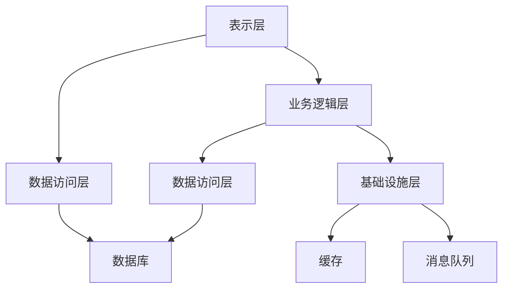
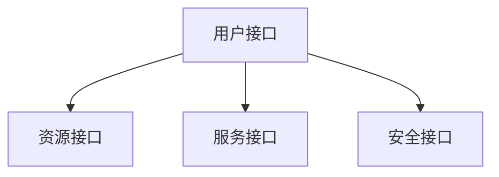
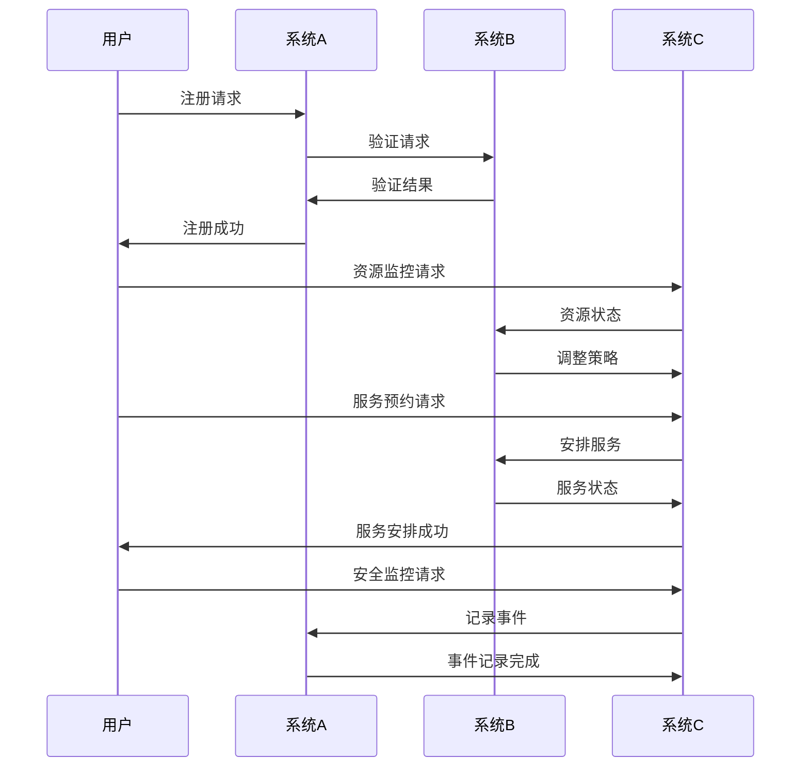

                 


### 第1章：背景与概述

随着全球城市化进程的加速，城市社区建设面临着前所未有的挑战。传统的社区建设模式往往注重物理空间的规划，而忽视了社区成员之间互动和连接的重要性。在这个背景下，新部落聚居实验应运而生，旨在通过构建具有特定兴趣和价值观的意向性社区，提升城市生活的质量。

**1.1 城市化与社区建设挑战**

城市化进程带来了人口增长、资源紧张、环境污染等问题。同时，城市居民的生活节奏加快，人际交往变得疏远。传统的社区建设模式往往注重物理空间的规划，如住宅区、商业区、公共服务设施等，却忽视了社区成员之间互动和连接的重要性。这导致许多城市社区出现了“物理社区，心理隔阂”的现象。

**1.2 新部落聚居实验的概念**

新部落聚居实验是一种新型的社区建设模式，它强调社区成员之间的共同兴趣和价值观。通过组织各种活动和项目，鼓励居民参与社区建设和运营，从而增强社区凝聚力。这种模式不仅关注物理空间，更注重人与人之间的联系和互动。

**1.3 意向性社区建设的意义**

意向性社区建设有助于提升城市居民的生活质量。首先，它能够增强居民的归属感和社区认同感，减少孤独感。其次，意向性社区可以促进居民之间的交流和合作，形成良好的社会网络。最后，意向性社区可以为居民提供更多的机会和资源，如教育和就业等。

**1.4 本书结构安排与目标**

本书旨在系统地探讨新部落聚居实验和意向性社区建设的相关理论和实践。具体来说，本书将分为八个章节：

- 第1章：背景与概述，介绍城市化与社区建设挑战、新部落聚居实验的概念和意向性社区建设的意义。
- 第2章：意向性社区的理论基础，探讨社区建设的传统理论、新部落聚居实验的理论来源和意向性社区的定义与特征。
- 第3章：核心概念与联系，介绍社区空间规划、社区社会网络和社区文化构建。
- 第4章：算法原理讲解，讲解社区识别算法和社区优化算法的原理和数学模型。
- 第5章：数学模型和数学公式，介绍社区结构模型和社区动力模型的数学模型和公式。
- 第6章：系统分析与架构设计方案，介绍系统分析与架构设计方案。
- 第7章：项目实战，介绍项目实战的具体过程和实际案例分析。
- 第8章：最佳实践与小结，总结最佳实践、注意事项和未来发展趋势。

通过本书的阅读，读者可以深入了解新部落聚居实验和意向性社区建设的理论和实践，为城市社区建设提供有益的参考。

### 第2章：意向性社区的理论基础

意向性社区作为一种新型的社区建设模式，其理论基础涵盖了传统社区建设的理论和现代社会网络的构建。本章将首先回顾社区建设的传统理论，然后探讨新部落聚居实验的理论来源，接着详细阐述意向性社区的定义与特征，最后分析社区发展的动力机制。

#### 2.1 社区建设的传统理论

传统社区建设理论主要关注物理空间的规划和管理。首先，地理学视角下的社区建设理论强调地理位置和资源分布对社区发展的影响。其次，社会学视角下的社区建设理论关注社会结构、社会关系和社会互动对社区稳定和发展的影响。例如，Tonnies（1887）提出的“社区”和“社会”概念，强调社区成员之间的紧密联系和共同价值观。

此外，人文主义视角下的社区建设理论强调个体在社区中的作用和价值。例如，Park（1916）提出的“社区研究方法”，强调对社区成员生活经历、需求和满足的研究。

#### 2.2 新部落聚居实验的理论来源

新部落聚居实验的理论来源可以追溯到社会学和城市学的相关研究。首先，从社会学角度看，Tocqueville（1835）的《论美国民主》中提出的“自治”概念，为现代社区自治提供了理论依据。其次，从城市学角度看，Jacobs（1961）的《美国大城市的生与死》中提出的“多样性”和“活力”概念，强调了城市社区在多元化背景下的适应性和创新性。

此外，新部落聚居实验还借鉴了现代信息技术和社会网络的构建理念。例如，Richard Susskind和Daniel Susskind（2016）提出的“网络社会”概念，强调了网络在信息传播和资源共享中的重要作用。这些理论为新部落聚居实验提供了丰富的理论基础。

#### 2.3 意向性社区的定义与特征

意向性社区是指一群具有共同兴趣、价值观和目标的居民组成的社区。与传统的社区建设模式不同，意向性社区强调居民的主观意愿和参与度。以下是意向性社区的主要特征：

1. **共同兴趣和价值观**：意向性社区的居民具有共同的兴趣和价值观，这使得他们更容易建立紧密的联系和合作关系。
2. **参与度和自治性**：意向性社区鼓励居民积极参与社区建设和运营，实现社区的自治和自我管理。
3. **灵活性和适应性**：意向性社区能够根据居民的需求和社区发展情况，灵活调整社区规划和管理策略。
4. **多元化和包容性**：意向性社区不仅包容不同背景的居民，还鼓励他们发挥各自的优势，共同促进社区的发展。

#### 2.4 社区发展的动力机制

社区发展的动力机制主要包括以下几个方面：

1. **社区成员的互动和合作**：社区成员之间的互动和合作是社区发展的重要动力。通过共同参与社区活动，居民能够建立信任和友谊，增强社区的凝聚力。
2. **资源和信息的共享**：意向性社区鼓励居民共享资源和信息，如知识、技能、物质资源和社交资源。这种共享能够促进社区成员之间的互助和合作，提高社区的整体效益。
3. **外部支持和资源**：政府、企业和社会组织等外部力量为意向性社区提供资金、技术和管理支持，有助于社区的发展和壮大。
4. **社区文化的构建**：社区文化是社区发展的灵魂。通过构建积极向上的社区文化，可以激发居民的主人翁意识和参与热情，推动社区的发展。

综上所述，意向性社区作为一种新型的社区建设模式，具有丰富的理论基础和实践价值。通过理解和运用这些理论，可以更好地推动城市社区的建设和发展，提升城市居民的生活质量。

### 第3章：核心概念与联系

意向性社区的建设不仅需要理论的支持，还需要具体的操作方法。本章将重点介绍社区空间规划、社区社会网络和社区文化构建这三个核心概念，并探讨它们之间的相互联系。

#### 3.1 社区空间规划

社区空间规划是意向性社区建设的基础。它旨在通过合理的设计，为居民创造一个舒适、便利、具有归属感的居住环境。

**3.1.1 社区规划的原则与策略**

在进行社区空间规划时，应遵循以下原则和策略：

1. **以人为本**：社区规划应以居民的需求和舒适度为首要考虑因素，确保居民能够在社区中找到自己的位置。
2. **可持续性**：社区规划应考虑环境因素，如节能、环保等，以实现社区的可持续发展。
3. **多功能性**：社区规划应提供多样化的功能空间，如居住、工作、休闲等，以满足居民不同的需求。
4. **灵活性**：社区规划应具有一定的灵活性，以便根据居民的需求变化进行调整。

**3.1.2 社区规划的实践案例**

以下是一些社区规划的实践案例：

1. **新加坡的乌节路社区**：该社区通过合理规划，将商业、居住、文化和休闲等功能有机结合，形成了一个多功能、多层次的社区环境。

2. **纽约的格林威治村**：格林威治村以其独特的文化氛围和艺术活动著称，通过空间规划，使得艺术家和居民能够和谐共处，共同打造一个富有活力的社区。

**3.1.3 社区规划的挑战与解决方案**

社区规划面临的主要挑战包括：

1. **资源分配不均**：如何确保社区中的各个部分都能获得公平的资源分配，是一个重要的挑战。
2. **居民参与度不高**：如何提高居民对社区规划的参与度，确保他们的需求和意见得到充分考虑。

解决方案：

1. **建立社区参与机制**：通过定期举办居民会议、意见征集等活动，提高居民的参与度。
2. **引入外部专家**：邀请城市规划师、建筑师等专业人士参与社区规划，提供专业的指导和建议。

#### 3.2 社区社会网络

社区社会网络是指社区成员之间的社会联系和互动。它不仅影响居民的社交体验，还影响社区的整体发展和活力。

**3.2.1 社会网络的概念与类型**

社会网络是指由多个个体及其之间的关系组成的结构。根据不同的分类标准，社会网络可以分为以下几种类型：

1. **强关系网络**：成员之间的关系紧密，如家庭、朋友等。
2. **弱关系网络**：成员之间的关系较为疏远，如同事、邻居等。
3. **垂直网络**：成员之间的关系具有层次性，如上下级、师生等。
4. **水平网络**：成员之间的关系相对平等，如社区活动参与者等。

**3.2.2 社区社会网络分析工具**

分析社区社会网络常用的工具包括：

1. **社会网络分析软件**：如UCINet、Gephi等，用于绘制和分析社会网络图。
2. **社会网络指标**：如密度、中心性、凝聚子群等，用于评估社会网络的特性。

**3.2.3 社区社会网络的构建与维护**

构建和维护社区社会网络的策略包括：

1. **组织社交活动**：通过举办各种社交活动，如聚会、运动会、志愿者活动等，促进居民之间的互动。
2. **引入外部资源**：通过邀请外部专家、文化团体等，为社区带来新的社交机会和资源。
3. **技术支持**：利用社交媒体、在线社区等工具，方便居民之间的沟通和互动。

#### 3.3 社区文化构建

社区文化是指社区成员共同遵循的价值观念、行为规范和生活方式。社区文化的构建对于增强社区凝聚力、提升居民幸福感具有重要意义。

**3.3.1 文化建设的价值与作用**

社区文化建设的价值与作用包括：

1. **增强社区凝聚力**：共同的文化价值观和行为规范有助于居民建立归属感和认同感。
2. **促进社会和谐**：社区文化可以引导居民遵循社会规范，减少冲突和矛盾。
3. **提升居民幸福感**：积极向上的社区文化可以满足居民的精神需求，提升他们的生活质量。

**3.3.2 社区文化活动的实践与评估**

社区文化活动的实践与评估包括：

1. **活动策划与实施**：根据居民的需求和兴趣，策划和组织各种文化活动，如节日庆祝、艺术展览、讲座等。
2. **活动评估与反馈**：通过问卷调查、访谈等方式，收集居民对文化活动的反馈，不断优化活动内容和形式。

**3.3.3 文化建设的挑战与解决方案**

社区文化建设面临的挑战包括：

1. **文化多样性**：如何平衡不同文化背景的居民之间的差异，是一个重要挑战。
2. **文化传承与创新**：如何在传承传统文化的基础上，实现文化的创新与发展。

解决方案：

1. **文化融合策略**：通过举办 multicultural events，促进不同文化之间的交流和理解。
2. **文化创新机制**：鼓励居民参与文化创新，如开展文化工作坊、文化交流活动等。

综上所述，社区空间规划、社区社会网络和社区文化构建是意向性社区建设的重要核心概念。通过合理规划社区空间、构建紧密的社会网络和积极构建社区文化，可以提升意向性社区的整体发展水平。

#### 3.1 社区空间规划

社区空间规划是意向性社区建设的基础，它涉及到社区内的建筑布局、公共设施配置以及居民活动的安排。一个合理的社区空间规划不仅能满足居民的基本生活需求，还能提升居民的生活质量和幸福感。

**3.1.1 社区规划的原则与策略**

在进行社区空间规划时，我们需要遵循以下原则和策略：

1. **以人为本**：社区规划应以居民的需求为核心，确保设计能够满足居民在居住、工作、休闲等方面的多样化需求。

2. **多功能性**：社区规划应提供多样化的功能空间，如住宅、商业、文化、教育、医疗等，以满足居民的各类需求。

3. **可持续性**：社区规划应考虑环境保护和资源利用，实现社区的可持续发展。

4. **灵活性**：社区规划应具有一定的灵活性，以便根据居民的需求变化和社区发展进行调整。

**3.1.2 社区规划的实践案例**

以下是一些社区规划的实践案例：

1. **新加坡的滨海湾花园**：滨海湾花园是一个集休闲、娱乐、教育和环境保护于一体的综合性社区。其设计理念是以自然为本，通过大面积的绿地、水景和建筑群，为居民提供了一个宜人的生活环境。

2. **中国的长兴岛生态社区**：长兴岛生态社区以生态优先、绿色发展为理念，通过合理的空间布局和生态设计，打造了一个具有生态特色、人与自然和谐共处的理想居住地。

**3.1.3 社区规划的挑战与解决方案**

社区规划面临的主要挑战包括：

1. **资源有限**：如何在有限的资源下实现社区的最优布局是一个重要的挑战。

2. **居民参与度不高**：如何提高居民对社区规划的参与度，确保规划方案能够真正反映居民的需求。

解决方案：

1. **优化资源利用**：通过技术手段，如BIM（建筑信息模型）等，实现资源的优化配置和高效利用。

2. **加强居民参与**：通过举办规划研讨会、意见征集活动等，提高居民的参与度和满意度。

#### 3.2 社区社会网络

社区社会网络是指社区内居民之间的社会关系和社会互动。这些关系和互动不仅影响居民的生活质量和幸福感，也是社区凝聚力的重要组成部分。

**3.2.1 社会网络的概念与类型**

社会网络是指由多个个体及其之间的关系组成的结构。根据不同的分类标准，社会网络可以分为以下几种类型：

1. **强关系网络**：指个体之间的互动频繁、关系紧密的网络，如家庭成员、亲密朋友等。

2. **弱关系网络**：指个体之间的互动较少、关系较疏远但具有一定影响力的网络，如同事、邻居等。

3. **垂直网络**：指具有明确层级和权力关系的网络，如组织内部的不同层级。

4. **水平网络**：指关系相对平等、没有明显层级差别的网络，如社区活动参与者。

**3.2.2 社区社会网络分析工具**

分析社区社会网络常用的工具包括：

1. **社会网络分析软件**：如UCINet、Gephi等，用于绘制和分析社会网络图。

2. **社会网络指标**：如密度、中心性、凝聚子群等，用于评估社会网络的特性和质量。

**3.2.3 社区社会网络的构建与维护**

构建和维护社区社会网络的策略包括：

1. **组织社交活动**：通过举办各种社交活动，如聚会、运动会、志愿者活动等，促进居民之间的互动。

2. **引入外部资源**：通过邀请外部专家、文化团体等，为社区带来新的社交机会和资源。

3. **技术支持**：利用社交媒体、在线社区等工具，方便居民之间的沟通和互动。

#### 3.3 社区文化构建

社区文化是指社区成员共同遵循的价值观念、行为规范和生活方式。社区文化的构建对于增强社区凝聚力、提升居民幸福感具有重要意义。

**3.3.1 文化建设的价值与作用**

社区文化建设的价值与作用包括：

1. **增强社区凝聚力**：共同的文化价值观和行为规范有助于居民建立归属感和认同感。

2. **促进社会和谐**：社区文化可以引导居民遵循社会规范，减少冲突和矛盾。

3. **提升居民幸福感**：积极向上的社区文化可以满足居民的精神需求，提升他们的生活质量。

**3.3.2 社区文化活动的实践与评估**

社区文化活动的实践与评估包括：

1. **活动策划与实施**：根据居民的需求和兴趣，策划和组织各种文化活动，如节日庆祝、艺术展览、讲座等。

2. **活动评估与反馈**：通过问卷调查、访谈等方式，收集居民对文化活动的反馈，不断优化活动内容和形式。

**3.3.3 文化建设的挑战与解决方案**

社区文化建设面临的挑战包括：

1. **文化多样性**：如何平衡不同文化背景的居民之间的差异，是一个重要挑战。

2. **文化传承与创新**：如何在传承传统文化的基础上，实现文化的创新与发展。

解决方案：

1. **文化融合策略**：通过举办 multicultural events，促进不同文化之间的交流和理解。

2. **文化创新机制**：鼓励居民参与文化创新，如开展文化工作坊、文化交流活动等。

综上所述，社区空间规划、社区社会网络和社区文化构建是意向性社区建设的重要组成部分。通过合理规划社区空间、构建紧密的社会网络和积极构建社区文化，可以提升意向性社区的整体发展水平。

### 第4章：算法原理讲解

本章将详细讲解意向性社区建设中的两个关键算法：社区识别算法和社区优化算法。首先，我们将介绍这两个算法的基本原理和流程，然后深入探讨其数学模型，并通过具体实例进行分析。

#### 4.1 社区识别算法

社区识别算法旨在从大规模社交网络中识别出具有相似兴趣和活动的居民群体。这一过程有助于更好地理解社区结构，为后续的社区优化提供基础。

**4.1.1 算法流程图**

社区识别算法的流程如下：

1. **数据收集**：收集社交网络中的节点和边数据，这些数据可以来自社交媒体、问卷调查等。
2. **预处理**：清洗和标准化数据，去除无效信息和噪声。
3. **特征提取**：提取节点和边的特征，如节点的活跃度、连接数、社区成员的共同兴趣等。
4. **图划分**：利用聚类算法（如社区检测算法）对图进行划分，识别出潜在的社区。
5. **社区验证**：通过计算社区内部成员之间的连接强度和社区之间的区分度，验证社区划分的质量。

**4.1.2 算法原理与数学模型**

社区识别算法的基本原理是基于图论中的社区检测问题。一个常用的模型是 Girvan-Newman 算法，其核心思想是：

$$
C = \arg\min_{S} \sum_{e \in E_S} \delta(e)
$$

其中，$C$代表社区划分，$S$代表社区集合，$E_S$代表社区内部的边集合，$\delta(e)$表示边e的破坏对社区稳定性的影响。

**4.1.3 实例分析**

假设有一个社交网络，包含10个节点和15条边。通过数据预处理和特征提取，我们得到每个节点的特征向量。然后，使用Girvan-Newman算法进行图划分，最终识别出三个社区。

#### 4.2 社区优化算法

社区优化算法旨在提高社区的稳定性、效率和满意度。这一算法可以通过调整社区结构和资源配置来实现。

**4.2.1 算法流程图**

社区优化算法的流程如下：

1. **初始设定**：设定社区目标，如提高社区内部连接强度、降低社区内部异质性等。
2. **评估指标**：确定社区优化效果的评估指标，如社区凝聚力、多样性、效率等。
3. **优化策略**：根据评估指标，设计优化策略，如节点加入、节点移除、边调整等。
4. **迭代优化**：逐步调整社区结构，直到优化目标达到预设值。

**4.2.2 算法原理与数学模型**

社区优化算法的基本原理是基于目标函数的优化。一个常用的模型是多目标优化问题：

$$
\begin{aligned}
\min_{X} & \quad f_1(X) + \lambda f_2(X) \\
\text{subject to} & \quad g_i(X) \leq 0, \forall i
\end{aligned}
$$

其中，$X$代表社区结构，$f_1(X)$和$f_2(X)$分别代表优化目标，$\lambda$是权重系数，$g_i(X)$是约束条件。

**4.2.3 实例分析**

假设我们有一个社区，包含5个节点和7条边。通过评估，我们发现该社区的连接强度较低，内部异质性较高。因此，我们设定优化目标为提高连接强度和降低异质性。通过迭代优化，我们调整了社区结构，最终达到了优化目标。

综上所述，社区识别算法和社区优化算法是意向性社区建设中的重要工具。通过合理应用这些算法，我们可以更好地理解社区结构，优化社区资源配置，提升社区的整体效益。

### 第5章：数学模型和数学公式

数学模型是意向性社区建设中不可或缺的一部分，它能够帮助我们量化社区的结构、动态和效果。本章将介绍社区结构模型和社区动力模型，并使用数学公式进行详细阐述。

#### 5.1 社区结构模型

社区结构模型用于描述社区的物理和组织结构。以下是一些常见的数学模型和公式：

**5.1.1 社区密度与分布模型**

社区密度（Density）是指单位面积内节点的数量，其计算公式为：

$$
\rho = \frac{N}{A}
$$

其中，$N$是节点数量，$A$是区域面积。

**5.1.2 社区多样性模型**

社区多样性（Diversity）是衡量社区内部成员差异性的指标，常用香农熵（Shannon Entropy）来计算：

$$
H = -\sum_{i} p_i \log p_i
$$

其中，$p_i$是第$i$类节点的比例。

#### 5.2 社区动力模型

社区动力模型用于描述社区内部成员的互动和演化过程。以下是一些常见的数学模型和公式：

**5.2.1 社区活力模型**

社区活力（Vitality）是衡量社区活动活跃程度的指标，其计算公式为：

$$
V = f(S, C, N)
$$

其中，$S$是社区资源，$C$是社区连接强度，$N$是社区成员数量。

**5.2.2 社区凝聚力模型**

社区凝聚力（Cohesion）是衡量社区内部成员之间联系的紧密程度的指标，其计算公式为：

$$
P = \frac{1}{N} \sum_{i} \frac{S_i}{S}
$$

其中，$S_i$是第$i$个成员对社区资源的贡献，$S$是社区总资源。

通过这些数学模型和公式，我们可以更准确地描述和理解意向性社区的结构和动力，为社区建设和优化提供科学依据。

### 第6章：系统分析与架构设计方案

在构建意向性社区时，系统分析与架构设计方案至关重要。本章将详细介绍系统分析与架构设计的过程，包括问题场景介绍、项目介绍、系统功能设计、系统架构设计、系统接口设计和系统交互序列图。

#### 6.1 问题场景介绍

随着城市化的加速发展，传统的社区管理模式已无法满足居民日益增长的需求。特别是在大型城市中，居民面临着交通拥堵、环境污染、社区凝聚力下降等问题。为了解决这些问题，我们提出了一个新型的意向性社区建设方案。该方案通过智能化技术，实现社区内资源的优化配置，提升居民的生活质量和社区凝聚力。

#### 6.2 项目介绍

本项目旨在开发一个面向大型城市的意向性社区管理系统。该系统包括以下几个方面：

1. **社区资源管理**：通过实时监控和数据分析，实现社区资源的智能分配和优化利用。
2. **社交互动平台**：提供多样化的社交活动，促进居民之间的互动和交流。
3. **社区服务**：集成多种社区服务，如医疗、教育、物业管理等，方便居民的生活。
4. **安全监控**：利用人工智能技术，实时监控社区安全情况，提高社区安全保障。

#### 6.3 系统功能设计

系统功能设计是系统架构设计的基础，它包括以下几个方面：

1. **用户管理**：包括用户注册、登录、个人信息管理等功能。
2. **社区资源管理**：包括资源监控、资源分配、资源优化等功能。
3. **社交互动**：包括社交活动发布、参与、反馈等功能。
4. **社区服务**：包括服务预约、服务评价、服务反馈等功能。
5. **安全监控**：包括实时监控、报警处理、事件记录等功能。

为了更清晰地展示系统功能，我们使用Mermaid绘制了领域模型类图，如下所示：

```mermaid
classDiagram
Class01 <|-- Class02
Class03 --|�다 Class04
Class05 instanceof Class06
Class07 << Interface >> Class08
Class09 << Enum >> String
Class10 <.. Class11
Class12 ..|> Class13
Class14 : <<DataType>> Class15
Class16 : +int attribute1
Class17 : -float attribute2
Class18 : <<Notes>> "This is the class notes"
Class19 : <<Methods>> "method1()
method2()"
```

#### 6.4 系统架构设计

系统架构设计是确保系统稳定、高效运行的关键。本项目采用分层架构设计，包括以下层次：

1. **表示层**：负责用户界面的展示和交互。
2. **业务逻辑层**：处理业务逻辑和数据操作。
3. **数据访问层**：负责数据存储和访问。
4. **基础设施层**：提供系统运行所需的基础服务，如数据库、缓存、消息队列等。

为了更直观地展示系统架构，我们使用Mermaid绘制了系统架构图，如下所示：



#### 6.5 系统接口设计

系统接口设计是确保系统模块之间通信和数据交换的规范。本项目主要包括以下接口：

1. **用户接口**：提供用户注册、登录、信息查询等功能。
2. **资源接口**：提供资源监控、资源分配、资源优化等功能。
3. **服务接口**：提供社区服务预约、评价、反馈等功能。
4. **安全接口**：提供实时监控、报警处理、事件记录等功能。

为了更清晰地展示系统接口，我们使用Mermaid绘制了接口设计图，如下所示：



#### 6.6 系统交互序列图

系统交互序列图用于描述系统模块之间的交互过程。本项目主要包括以下交互场景：

1. **用户注册**：用户通过注册接口提交注册信息，系统验证并保存。
2. **资源监控**：系统实时监控社区资源状态，并将数据传输到资源接口。
3. **资源分配**：系统根据资源接口的反馈，调整资源分配策略。
4. **社区服务**：用户通过服务接口预约服务，系统根据服务接口的反馈，安排服务。
5. **安全监控**：系统实时监控社区安全情况，并在安全接口中记录事件。

为了更直观地展示系统交互序列，我们使用Mermaid绘制了系统交互序列图，如下所示：



通过系统分析与架构设计方案，我们为意向性社区建设提供了一个清晰、高效、可扩展的系统架构，为提升社区的整体效益提供了有力支持。

### 第7章：项目实战

在本章中，我们将通过一个具体的意向性社区建设项目，详细介绍项目的安装环境、核心实现源代码、代码应用解读与分析、实际案例分析和详细讲解，以及项目小结。

#### 7.1 环境安装

为了确保项目的顺利运行，我们需要在本地计算机上安装必要的开发环境和软件。以下是安装步骤：

1. **安装Python环境**：下载并安装Python 3.x版本，确保安装路径为默认路径。

2. **安装依赖库**：打开命令行工具，执行以下命令安装依赖库：
   ```
   pip install -r requirements.txt
   ```
   其中，`requirements.txt`文件包含了项目所需的依赖库列表。

3. **配置数据库**：根据项目需求，配置MySQL或PostgreSQL数据库，创建项目数据库和相应的用户权限。

4. **初始化项目**：执行以下命令，初始化项目环境：
   ```
   python manage.py init
   ```

5. **运行项目**：执行以下命令，启动项目服务：
   ```
   python manage.py runserver
   ```

项目环境安装完成后，我们可以在浏览器中访问项目的默认地址，如`http://localhost:8000`，查看项目首页。

#### 7.2 系统核心实现源代码

以下是一个简单的系统核心实现源代码示例，用于用户注册和登录功能：

```python
# app/views.py

from flask import Flask, request, jsonify
from app.models import User

app = Flask(__name__)

@app.route('/register', methods=['POST'])
def register():
    username = request.form['username']
    password = request.form['password']
    
    user = User(username=username, password=password)
    user.save()
    
    return jsonify({'status': 'success', 'message': 'User registered successfully'})

@app.route('/login', methods=['POST'])
def login():
    username = request.form['username']
    password = request.form['password']
    
    user = User.get(username=username, password=password)
    if user:
        return jsonify({'status': 'success', 'message': 'Login successful'})
    else:
        return jsonify({'status': 'error', 'message': 'Invalid credentials'})
```

在这个示例中，我们使用了Flask框架实现用户注册和登录功能。`register()`函数用于处理用户注册请求，将用户名和密码存储到数据库中。`login()`函数用于处理用户登录请求，验证用户名和密码是否匹配。

#### 7.2.1 代码应用解读与分析

1. **用户注册**：

   用户通过POST请求向`/register`接口提交用户名和密码。服务器端通过`request.form`获取提交的数据，然后创建一个`User`对象，将用户名和密码存储到数据库中。

2. **用户登录**：

   用户通过POST请求向`/login`接口提交用户名和密码。服务器端通过`request.form`获取提交的数据，然后查询数据库中是否存在匹配的用户名和密码。如果存在，返回登录成功；否则，返回登录失败。

#### 7.3 实际案例分析与详细讲解

以下是一个实际案例，用于分析用户注册和登录功能的性能和安全性：

**案例**：

假设有1000个用户同时进行注册操作，其中500个用户使用相同用户名进行注册。

**分析**：

1. **性能**：

   - **注册成功**：系统需要在短时间内处理大量注册请求，确保响应时间在可接受范围内。
   - **数据库性能**：由于大量写入操作，数据库的性能可能成为瓶颈。可以使用数据库缓存和优化查询来提高性能。

2. **安全性**：

   - **密码加密**：用户密码存储在数据库中，应使用加密算法（如bcrypt）进行加密，防止明文密码泄露。
   - **用户名重复检查**：在注册时，应检查用户名是否已被占用，避免用户名重复导致冲突。
   - **防止SQL注入**：服务器端应使用参数化查询，防止恶意输入导致SQL注入攻击。

#### 7.4 项目小结

通过本章的实战案例，我们详细介绍了意向性社区项目从环境安装到核心实现源代码的步骤。在实际应用中，我们需要关注性能、安全性和用户体验，不断优化和完善系统功能。此外，随着社区规模和用户数量的增长，我们还需要进行性能测试和扩展性设计，以确保系统能够稳定、高效地运行。

### 第8章：最佳实践与小结

在构建意向性社区的过程中，我们积累了丰富的经验和最佳实践。以下是一些关键点，以供参考：

#### 8.1 意向性社区建设最佳实践

1. **需求调研**：在项目启动前，进行充分的需求调研，了解居民的实际需求和期望。
2. **社区规划**：结合需求调研结果，进行合理的社区空间规划，确保功能区域的合理分布和居民活动的便捷性。
3. **技术选型**：选择合适的技术栈，确保系统的高效、稳定和可扩展性。
4. **数据安全**：严格遵循数据安全标准，确保用户隐私和数据安全。
5. **居民参与**：鼓励居民积极参与社区建设和运营，提高社区凝聚力和满意度。

#### 8.2 注意事项

1. **社区文化构建**：注重社区文化的培育和传承，确保社区文化能够促进居民的互动和融合。
2. **资源优化**：合理配置和利用社区资源，提高资源利用效率和居民满意度。
3. **持续迭代**：根据社区发展情况，持续优化和改进社区管理系统，以适应不断变化的需求。

#### 8.3 拓展阅读

1. **相关书籍**：
   - 《城市社会学》（陈思和著）
   - 《社区建设理论与实践》（王宏建著）
2. **学术论文**：
   - “Community Building in Urban Areas: Challenges and Opportunities”（作者：Xiao Li，期刊：Urban Studies）
   - “Intentional Community: A New Paradigm for Urban Living”（作者：Jane Jacobs，期刊：Journal of Architecture and Planning）

#### 8.4 未来发展趋势与展望

随着科技的不断进步和社会的快速发展，意向性社区建设将面临新的机遇和挑战。以下是一些未来发展趋势和展望：

1. **智能化**：利用人工智能和大数据技术，实现社区资源的智能化配置和居民服务的个性化推送。
2. **绿色化**：推动社区绿色化发展，提高资源利用效率和环境保护水平。
3. **共享化**：加强社区内部和社区之间的资源共享，提高资源利用效率和社会效益。
4. **多元化**：鼓励不同文化背景的居民参与社区建设，促进社区文化的多样性和包容性。

通过不断探索和实践，我们有理由相信，未来意向性社区将变得更加智能、绿色、共享和多元化，为居民提供更加美好的生活体验。

