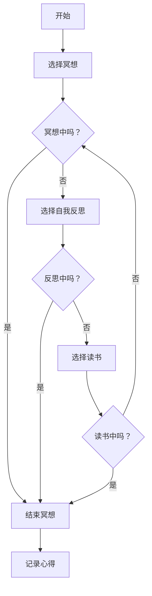
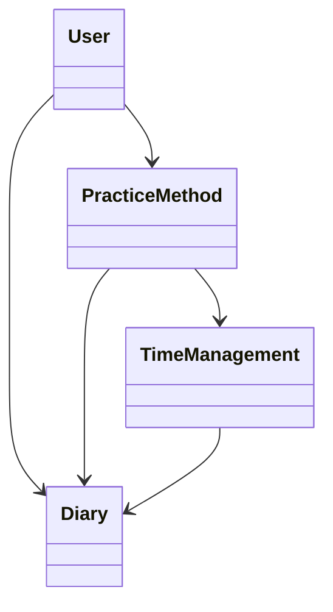
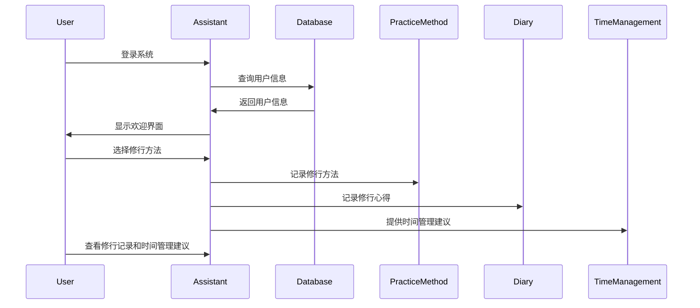
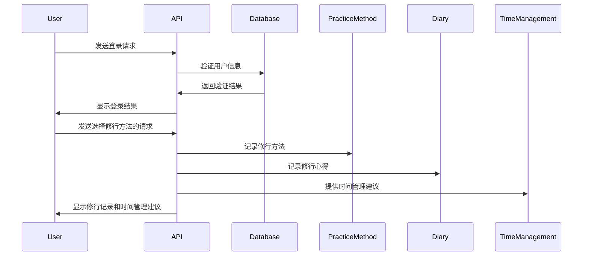

                 


### 日常生活中的修行：平凡中寻找超越

#### 关键词：修行、日常生活、心灵成长、精神追求、算法、实践、系统架构

> 摘要：
在快节奏的现代生活中，如何在平凡的生活中找到内心的平静与精神追求，实现个人成长与超越，成为了许多人关注的焦点。本文将探讨日常生活中的修行之道，通过介绍核心概念、算法原理、系统架构设计以及实战案例，帮助读者在平凡中寻找超越。

## 第1章 背景介绍——日常生活中的修行

### 1.1.1 问题背景

现代社会的快节奏和高压环境，使得人们在追求物质生活的同时，也渴望获得精神上的满足和成长。日常生活中的修行，不仅是为了缓解压力，更是为了在平凡的生活中找到超越自我的可能。

#### 1.1.2 问题描述

如何在忙碌的日常生活中找到时间进行修行？如何让修行成为生活的一部分，而不仅仅是额外的负担？

#### 1.1.3 问题解决

通过简化和优化修行方法，将其融入日常生活中，实现修行与生活的平衡。

#### 1.1.4 边界与外延

修行不仅限于宗教信仰，更是一种心灵成长与精神追求的过程，可以应用于各个领域。

#### 1.1.5 核心概念

- **修行**: 心灵成长与精神追求的过程
- **平凡**: 普通生活的状态
- **超越**: 超越自我，达到更高的境界

## 第2章 核心概念与联系

### 2.1.1 修行原理

修行是一个逐步深入了解自我、提升自我的过程。它包括冥想、自我反思和读书等多个方面，旨在帮助人们达到内心的平静与精神追求。

#### 2.1.2 概念属性特征对比

| 特征               | 修行                      | 平凡                      | 超越                      |
|------------------|------------------------|------------------------|------------------------|
| **内在动机**       | 内心平静与自我提升       | 日常生活需求与责任       | 求知欲与精神追求       |
| **实践方法**       | 冥想、自我反思、读书       | 完成日常任务、与人交往       | 创新与自我实现       |
| **目标导向**       | 达到精神层面的觉悟       | 维持生活的平衡与稳定       | 实现个人与社会价值       |

#### 2.1.3 ER实体关系图

```mermaid
erDiagram
  Person ||--|{ Reaching } Reaching
  Person ||--|{ Practicing } Practicing
  Person ||--|{ Beyonding } Beyonding
```

## 第3章 算法原理讲解——日常生活中的修行方法

### 3.1.1 修行方法

修行方法多种多样，但核心目的是帮助人们达到内心的平静与精神追求。以下是几种常见的修行方法：

- **冥想**: 通过清空杂念，放松身心，达到内心的平静。
- **自我反思**: 通过深入思考自己的行为和思想，了解自我，发现不足。
- **读书**: 通过吸收知识，启迪思维，提升自己的认知水平。

### 3.1.2 算法流程图



### 3.1.3 Python代码示例

```python
def修行(method):
    if method == "冥想":
        print("开始冥想...")
        # 冥想相关代码
    elif method == "自我反思":
        print("开始自我反思...")
        # 反思相关代码
    elif method == "读书":
        print("开始读书...")
        # 读书相关代码

# 使用示例
修行("冥想")
修行("自我反思")
修行("读书")
```

### 3.1.4 数学模型和公式

修行的过程可以看作是一个自我提升的函数，其变化速率取决于修行的方法和持续的时间。我们可以用以下公式来表示：

$$
\frac{dS}{dt} = k \cdot M \cdot T
$$

其中，$S$ 代表精神层次的变化，$M$ 代表修行方法，$T$ 代表修行的时间，$k$ 是一个常数，表示修行的效率。

## 第4章 系统分析与架构设计方案

### 4.1 问题场景介绍

在现代快节奏的生活中，许多人希望能够在忙碌的工作和生活之间找到时间进行修行。然而，如何有效地管理时间，选择合适的修行方法，并记录修行心得，成为了一个挑战。

### 4.2 项目介绍

为了解决上述问题，我们设计了一个名为“修行助手”的项目，它可以帮助用户选择合适的修行方法，记录修行心得，并提供科学的时间管理建议。

### 4.3 系统功能设计（领域模型）



### 4.4 系统架构设计



### 4.5 系统接口设计和系统交互



## 第5章 项目实战

### 5.1 环境安装

为了运行“修行助手”项目，我们需要安装以下环境：

- Python 3.8 或以上版本
- Flask 框架
- SQLite 数据库
- Mermaid 图库

### 5.2 系统核心实现源代码

以下是系统核心实现的源代码：

```python
# app.py

from flask import Flask, request, jsonify
import sqlite3

app = Flask(__name__)

# 连接数据库
def connect_db():
    conn = sqlite3.connect('diary.db')
    cursor = conn.cursor()
    cursor.execute('''CREATE TABLE IF NOT EXISTS user (id INTEGER PRIMARY KEY, username TEXT, password TEXT)''')
    cursor.execute('''CREATE TABLE IF NOT EXISTS diary (id INTEGER PRIMARY KEY, user_id INTEGER, content TEXT, date TEXT)''')
    cursor.execute('''CREATE TABLE IF NOT EXISTS practicemethod (id INTEGER PRIMARY KEY, user_id INTEGER, method TEXT)''')
    cursor.execute('''CREATE TABLE IF NOT EXISTS timemanagement (id INTEGER PRIMARY KEY, user_id INTEGER, suggestion TEXT)''')
    conn.commit()
    return conn

# 登录接口
@app.route('/login', methods=['POST'])
def login():
    username = request.form['username']
    password = request.form['password']
    conn = connect_db()
    cursor = conn.cursor()
    cursor.execute('SELECT * FROM user WHERE username=? AND password=?', (username, password))
    user = cursor.fetchone()
    if user:
        return jsonify({'status': 'success', 'id': user[0]})
    else:
        return jsonify({'status': 'fail'})

# 选择修行方法接口
@app.route('/practicemethod', methods=['POST'])
def practicemethod():
    user_id = request.form['user_id']
    method = request.form['method']
    conn = connect_db()
    cursor = conn.cursor()
    cursor.execute('INSERT INTO practicemethod (user_id, method) VALUES (?, ?)', (user_id, method))
    conn.commit()
    return jsonify({'status': 'success'})

# 记录修行心得接口
@app.route('/diary', methods=['POST'])
def diary():
    user_id = request.form['user_id']
    content = request.form['content']
    date = request.form['date']
    conn = connect_db()
    cursor = conn.cursor()
    cursor.execute('INSERT INTO diary (user_id, content, date) VALUES (?, ?, ?)', (user_id, content, date))
    conn.commit()
    return jsonify({'status': 'success'})

# 提供时间管理建议接口
@app.route('/timemanagement', methods=['POST'])
def timemanagement():
    user_id = request.form['user_id']
    suggestion = request.form['suggestion']
    conn = connect_db()
    cursor = conn.cursor()
    cursor.execute('INSERT INTO timemanagement (user_id, suggestion) VALUES (?, ?)', (user_id, suggestion))
    conn.commit()
    return jsonify({'status': 'success'})

if __name__ == '__main__':
    app.run(debug=True)
```

### 5.3 代码应用解读与分析

这段代码是一个基于 Flask 的简单 Web 应用程序，它提供了一系列接口，用于管理用户、修行方法、修行心得和时间管理建议。

- **数据库连接**：使用 SQLite 数据库，创建用户、日记、修行方法和时间管理建议四个表。
- **登录接口**：验证用户登录，返回用户 ID。
- **选择修行方法接口**：记录用户选择的修行方法。
- **记录修行心得接口**：记录用户的修行心得。
- **提供时间管理建议接口**：记录用户的时间管理建议。

### 5.4 实际案例分析和详细讲解剖析

假设用户“张三”登录系统，选择冥想作为修行方法，并在一天后的日记中记录了冥想的心得，同时系统根据用户的使用习惯提供了时间管理建议。

- 用户登录：发送 POST 请求到 `/login`，返回用户 ID。
- 选择修行方法：发送 POST 请求到 `/practicemethod`，记录冥想方法。
- 记录修行心得：发送 POST 请求到 `/diary`，记录冥想心得。
- 时间管理建议：发送 POST 请求到 `/timemanagement`，记录时间管理建议。

通过上述接口，用户可以方便地管理自己的修行过程，同时系统也可以根据用户的行为提供个性化的建议。

### 5.5 项目小结

“修行助手”项目通过简化的接口和数据库设计，实现了用户对修行过程的管理和记录。它不仅可以帮助用户更好地进行日常修行，还可以根据用户的行为提供个性化的建议，提高修行的效果。

## 第6章 最佳实践 tips

- **坚持每日修行**：修行不是一蹴而就的，需要长期坚持。每天花费一点时间进行冥想、自我反思和读书，可以逐渐提升精神层次。
- **选择适合自己的修行方法**：每个人的情况和需求都不同，选择适合自己的修行方法至关重要。可以通过尝试不同的方法，找到最适合自己的方式。
- **记录修行心得**：记录修行心得可以帮助你更好地反思自己的修行过程，发现进步和不足。同时，这也是一种积累知识和经验的好方法。

## 第7章 小结与注意事项

本文通过介绍修行的概念、方法、系统架构和实战案例，帮助读者在日常生活中找到修行的途径。需要注意的是，修行是一个长期的过程，需要坚持和耐心。通过合理的规划和实践，每个人都可以在平凡的生活中实现精神的超越。

## 拓展阅读

- 《禅与计算机程序设计艺术》
- 《心流：最优体验心理学》
- 《高效能人士的七个习惯》

### 作者信息：

作者：AI天才研究院/AI Genius Institute & 禅与计算机程序设计艺术 /Zen And The Art of Computer Programming


