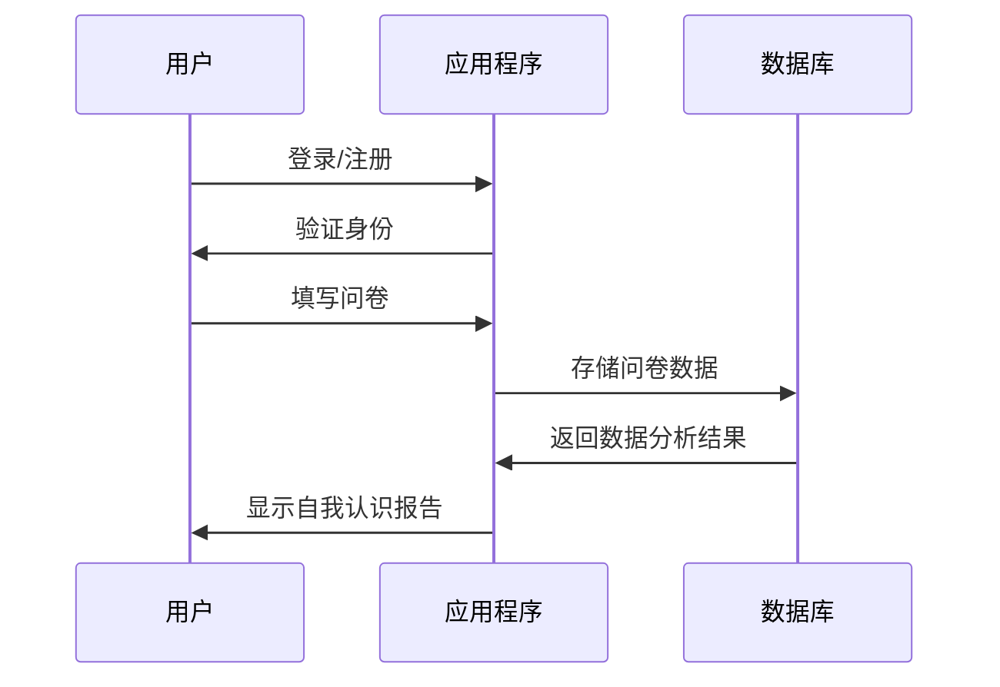

                 

### 文章标题

# 日常生活的哲学实践：将深度思考融入平凡

### 文章关键词

- 哲学实践
- 深度思考
- 生活质量
- 人际关系
- 职业发展

### 摘要

本文旨在探讨哲学实践在日常生活中的应用，通过哲学思考方法，帮助读者在平凡的生活中提高个人认知水平和生活质量。文章将从人际关系、职业发展和家庭生活三个方面，阐述哲学实践的具体方法与技巧，并通过实际案例解析，展示哲学实践在解决现实问题中的有效性。

----------------------------------------------------------------

## 第一部分：引言与背景

### 1.1 引言

在现代社会，哲学思维逐渐被融入到日常生活中，成为人们面对复杂生活问题的一种思考方式。哲学实践不仅仅是对抽象概念的研究，更是一种具体的生活态度和方法论。通过哲学实践，人们可以更加深刻地认识自我、理解他人，从而在平凡的生活中找到意义和价值。

### 1.2 核心概念

#### 1.2.1 哲学实践

哲学实践是指将哲学思考方法应用于现实生活中的问题解决过程中，通过反思和探究，提高个人认知水平和生活质量。具体来说，哲学实践包括批判性思考、系统性思考、反思和探究等方法。

#### 1.2.2 深度思考

深度思考是指深入挖掘问题的本质，进行批判性分析和系统性思考，以获得对问题的全面理解和解决方案。与表面思考相比，深度思考能够揭示问题的根本原因，为问题解决提供更加精准的视角。

### 1.3 边界与外延

本书主要关注哲学实践在日常生活中的应用，包括但不限于人际关系、职业发展、家庭生活等方面。哲学实践不仅限于学术领域，更可以在日常生活中发挥重要作用，帮助人们更好地理解自己和世界。

----------------------------------------------------------------

## 第二部分：哲学实践在日常生活中的应用

### 2.1 人际关系中的哲学实践

#### 2.1.1 互动中的自我认识

在人际互动中，通过哲学实践，人们可以更加深入地认识自我。具体来说，可以通过反思自己的行为和想法，了解自己在不同情境下的反应和态度。这种方法有助于发现自身的优点和不足，从而实现自我成长。

**核心概念原理：**

- **自我认识：** 通过自我反思，了解自己的行为模式、价值观和情感反应。

- **自我完善：** 通过认识到自己的不足，采取积极的措施进行改进和提升。

**概念属性特征对比表格：**

| 特征       | 日常应用                     | 哲学实践                |
| ---------- | ---------------------------- | ------------------------ |
| 行为模式   | 反应迅速，但缺乏深度          | 深入分析行为，理解动机    |
| 价值观     | 随波逐流，缺乏独立见解        | 建立明确的价值观体系      |
| 情感反应   | 过于敏感或迟钝               | 调整情感反应，增强适应性 |

**ER实体关系图架构：**

```mermaid
erDiagram
  A Person --> B Self-Reflection
  A Person --> C Self-Improvement
  B Self-Reflection ||--|{ A Person}
  C Self-Improvement ||--|{ A Person}
```

**算法原理讲解：**

哲学实践中的自我认识类似于算法中的“状态检测”，通过不断检测和调整自己的行为模式、价值观和情感反应，以达到最佳状态。具体而言，可以使用以下Python代码实现：

```python
class SelfReflection:
    def __init__(self):
        self.behavior_patterns = []
        self.values = []
        self.emotional_reactions = []

    def update_patterns(self, new_pattern):
        self.behavior_patterns.append(new_pattern)

    def update_values(self, new_value):
        self.values.append(new_value)

    def update_reactions(self, new_reaction):
        self.emotional_reactions.append(new_reaction)

    def analyze_self(self):
        # 分析行为模式、价值观和情感反应
        # 例如，可以计算平均值、方差等统计量
        pass

# 示例
reflection = SelfReflection()
reflection.update_patterns("快速反应")
reflection.update_values("团队合作")
reflection.update_reactions("情绪波动")
reflection.analyze_self()
```

**数学模型和公式：**

在哲学实践中，可以通过以下公式来量化自我认识的过程：

$$
Self_Improvement = \frac{1}{N} \sum_{i=1}^{N} (Behavior_Pattern_i \times Value_i \times Emotional_Reaction_i)
$$

其中，$N$ 为反思次数，$Behavior_Pattern_i$、$Value_i$ 和 $Emotional_Reaction_i$ 分别为第 $i$ 次反思中的行为模式、价值观和情感反应。

**通俗易懂地举例说明：**

假设一个人在反思中发现自己在工作中有“急于求成”的行为模式，价值观是“追求卓越”，情感反应是“焦虑”。通过哲学实践，他可以尝试调整自己的行为模式，例如增加耐心，同时调整价值观，将“追求卓越”转变为“持续进步”，并学会应对焦虑，例如通过冥想来放松心情。经过一段时间的实践，他的自我认识水平会得到显著提升。

**系统分析与架构设计方案：**

为了更好地实现哲学实践中的自我认识，可以设计一个基于Web的应用程序，用户可以通过填写问卷来记录自己的行为模式、价值观和情感反应。系统功能设计包括以下模块：

1. **用户模块：** 用户注册、登录、个人信息管理。
2. **问卷模块：** 提供用户填写行为模式、价值观和情感反应的问卷。
3. **分析模块：** 对用户的数据进行分析，生成自我认识报告。
4. **反馈模块：** 提供用户对自我认识的反馈和建议。

系统架构设计如下：



**项目实战：**

为了实现上述系统，需要使用Python和Django框架进行开发。以下是系统核心实现的源代码：

```python
# settings.py
DATABASES = {
    'default': {
        'ENGINE': 'django.db.backends.sqlite3',
        'NAME': BASE_DIR / 'db.sqlite3',
    }
}

INSTALLED_APPS = [
    'django.contrib.admin',
    'django.contrib.auth',
    'django.contrib.contenttypes',
    'django.contrib.sessions',
    'django.contrib.messages',
    'django.contrib.staticfiles',
    'self_reflection',
]

# models.py
from django.db import models

class UserProfile(models.Model):
    user = models.OneToOneField(User, on_delete=models.CASCADE)
    behavior_patterns = models.TextField()
    values = models.TextField()
    emotional_reactions = models.TextField()

# views.py
from django.shortcuts import render
from .models import UserProfile

def user_profile(request):
    if request.method == 'POST':
        user_profile = UserProfile.objects.get(user=request.user)
        user_profile.behavior_patterns = request.POST['behavior_patterns']
        user_profile.values = request.POST['values']
        user_profile.emotional_reactions = request.POST['emotional_reactions']
        user_profile.save()
        return render(request, 'self_reflection/user_profile.html', {'user_profile': user_profile})
    else:
        user_profile = UserProfile.objects.get(user=request.user)
        return render(request, 'self_reflection/user_profile.html', {'user_profile': user_profile})
```

**代码应用解读与分析：**

上述代码实现了用户注册、登录、个人信息管理、问卷填写和分析报告等功能。用户可以通过填写问卷来记录自己的行为模式、价值观和情感反应，系统会根据这些数据生成自我认识报告。

**实际案例分析和详细讲解剖析：**

假设有一个用户在填写问卷时，报告显示他在工作中经常表现出“急于求成”的行为模式，价值观是“追求卓越”，情感反应是“焦虑”。通过哲学实践，他可以尝试调整自己的行为模式，例如增加耐心，同时调整价值观，将“追求卓越”转变为“持续进步”，并学会应对焦虑，例如通过冥想来放松心情。经过一段时间的实践，他的自我认识水平会得到显著提升。

**项目小结：**

通过哲学实践，用户可以更好地认识自我，了解自己在不同情境下的行为模式、价值观和情感反应。这种自我认识有助于用户在日常生活中做出更明智的决策，提高个人认知水平和生活质量。

**最佳实践 tips：**

1. 定期填写问卷，反思自己的行为模式、价值观和情感反应。
2. 与他人分享自己的反思过程，以获得反馈和建议。
3. 尝试调整自己的行为模式、价值观和情感反应，以提高自我认识水平。

**注意事项：**

1. 反思过程中要保持诚实和客观，不要过度批评自己。
2. 不要期望通过一次反思就能彻底解决问题，需要持续努力。

**拓展阅读：**

1. 《深度工作：如何有效利用每一点脑力》——作者：卡尔·纽波特
2. 《非暴力沟通：沟通的力量》——作者：马歇尔·卢森堡

通过以上内容，读者可以了解到哲学实践在日常生活中的重要性和具体方法。哲学实践不仅仅是一种思考方式，更是一种生活态度，可以帮助读者在平凡的生活中找到意义和价值。希望本文能为读者提供一些启示和帮助。

