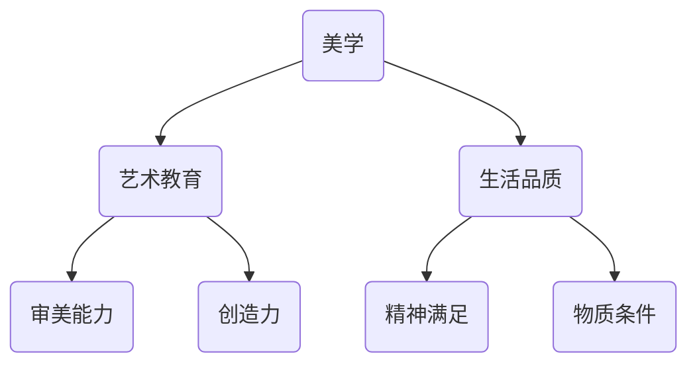
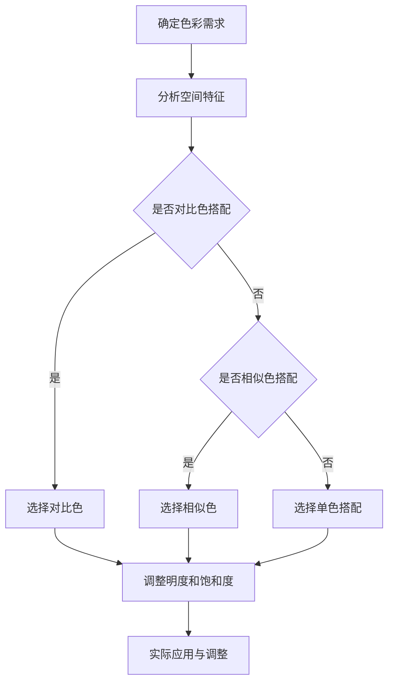
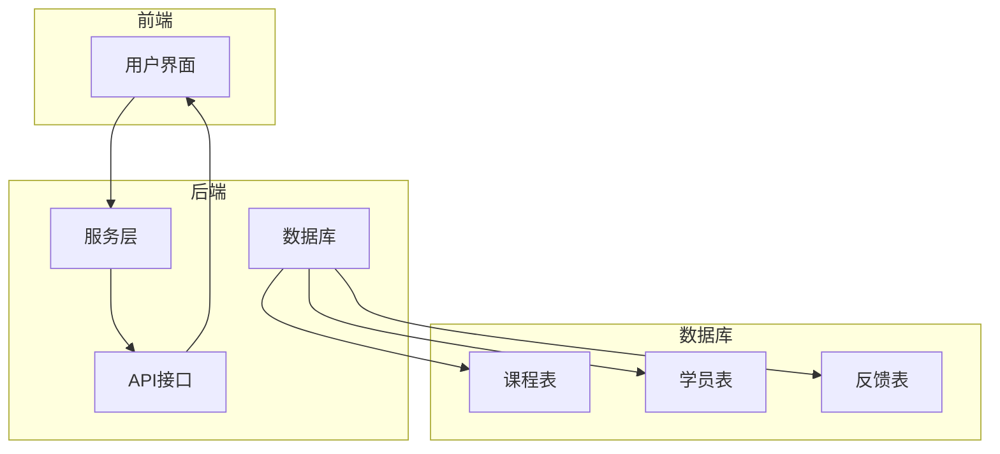
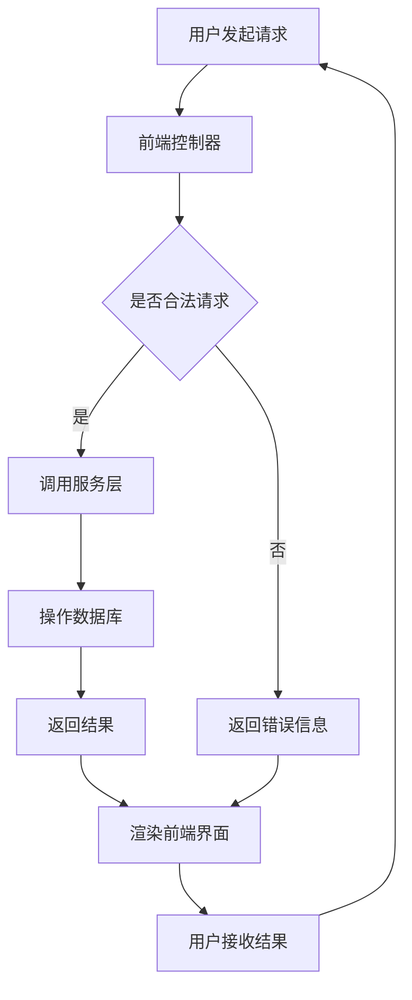

                 

# 日常美学培训课程：提升生活品质的艺术教育

## 关键词
- 美学培训课程
- 生活品质提升
- 艺术教育
- 审美能力培养
- 室内设计
- 家居美化

## 摘要
本文旨在探讨日常美学培训课程对于提升生活品质的重要性。通过分析美学与生活品质的关系，介绍艺术教育在美学素养培养中的作用，本文将逐步讲解色彩理论、空间布局原理等核心概念，并通过实际案例展示美学教育在生活中的应用。此外，本文还将探讨美学教育实践中的最佳方法和注意事项，为读者提供实用的提升生活品质的艺术教育指导。

## 背景介绍

### 美学培训课程的背景

随着社会的发展，人们对于生活品质的要求逐渐提高。美学培训课程作为提升生活品质的一种重要手段，正日益受到关注。美学不仅仅是艺术领域的研究，更与我们的日常生活息息相关。从家居设计到服装搭配，从美食烹饪到园艺养护，美学无处不在。美学培训课程通过系统的教育，帮助人们掌握提升生活品质的技巧和方法。

### 当前社会生活品质提升的需求

在现代社会，人们的生活节奏加快，工作压力增大，对于生活品质的追求变得更加迫切。然而，许多人在追求物质富足的同时，忽视了精神层面的满足。美学培训课程恰好填补了这一空白，通过培养审美能力和美学素养，帮助人们从内心感受到生活的美好，从而提升整体生活质量。

### 美学教育的重要性

美学教育不仅仅是学习艺术知识和技能，更是一种对生活的态度和方式的培养。通过美学教育，人们可以学会欣赏生活中的美好，发现美的价值，从而提高对生活的满意度。此外，美学教育还可以培养人们的创新思维和解决问题的能力，对于个人的成长和社会的进步都具有重要意义。

### 美学培训课程的目标

美学培训课程的主要目标是提升学生的审美能力和美学素养，培养他们发现美、创造美的能力。具体来说，课程目标包括：

1. 培养学生的审美感知力，让他们能够敏锐地捕捉生活中的美好。
2. 提升学生的美学素养，让他们能够理解艺术作品，欣赏不同风格的美。
3. 培养学生的创意思维，让他们能够运用美学知识解决实际问题。
4. 丰富学生的日常生活，提高他们的生活品质。

### 提升审美能力

审美能力是指人们识别、欣赏和创造美的能力。通过美学培训课程，学生可以学习到各种艺术形式和美学理论，从而提升自己的审美能力。例如，通过学习色彩理论，学生可以掌握如何搭配色彩，创造出和谐、美观的视觉效果。

### 培养美学素养

美学素养是指人们对美的理解和认知水平。美学培训课程通过系统的教育，帮助学生建立全面的美学知识体系，培养他们独立思考、批判性思维和审美判断能力。例如，通过分析不同艺术作品的历史背景和风格特点，学生可以更好地理解艺术作品的美学价值。

### 丰富日常生活

美学培训课程不仅限于理论知识的传授，更注重实践应用。通过学习美学知识，学生可以将其应用于日常生活，如家居装饰、服装搭配、美食烹饪等，从而提升生活质量。例如，通过学习空间布局原理，学生可以设计出更舒适、美观的居住空间。

### 日常美学培训课程的意义

日常美学培训课程对于提升生活品质具有重要意义。首先，它可以帮助人们建立正确的审美观念，提高对美的识别和欣赏能力。其次，它可以帮助人们培养健康的生活方式，如合理搭配饮食、科学锻炼身体、合理规划时间等。最后，它可以帮助人们提升心理素质，缓解生活压力，提高生活满意度。

## 核心概念与联系

### 定义美学

美学是一门研究美和审美现象的学科。它涉及对美的本质、特征、形式和价值的探讨，以及审美活动中的心理、社会和文化因素。美学不仅仅是艺术领域的研究，还与哲学、心理学、文化学等多个学科有着密切的联系。

### 定义艺术教育

艺术教育是指通过系统的教学活动，培养学生的艺术素养、审美能力和创造力。它包括音乐、绘画、雕塑、戏剧、文学等多个艺术门类，旨在通过艺术体验和创作，帮助学生理解和欣赏艺术作品，培养他们的艺术表达和创新能力。

### 定义生活品质

生活品质是指人们在日常生活中所体验到的整体幸福感，包括物质条件、精神满足、健康状态和社会关系等多个方面。一个高品质的生活不仅仅依赖于物质的富足，更依赖于精神层面的满足和内心的安宁。

### 美学与艺术教育的关系

美学和艺术教育有着密切的联系。美学为艺术教育提供了理论基础和指导原则，而艺术教育则是美学的具体实践和应用。通过艺术教育，学生可以学习到美学的基本原理和方法，提高他们的审美能力和艺术素养。

### 生活品质与美学教育的关系

美学教育对于提升生活品质具有重要意义。通过美学教育，人们可以学会欣赏生活中的美好，发现美的价值，从而提高对生活的满意度。同时，美学教育还可以培养人们的创新思维和解决问题的能力，有助于提升个人的生活品质。

### 表格对比

| 关键概念 | 定义 | 关系 |
| --- | --- | --- |
| 美学 | 研究美和审美现象的学科 | 提供艺术教育的理论基础 |
| 艺术教育 | 培养艺术素养、审美能力和创造力 | 美学的具体实践和应用 |
| 生活品质 | 衡量日常生活中整体幸福感的指标 | 受美学教育的影响 |

### ER实体关系图



## 算法原理讲解

### 色彩理论的基本原理

色彩理论是美学教育中非常重要的一个部分，它涉及到色彩的性质、搭配原则以及它们对人的心理和情感的影响。了解色彩理论的基本原理，对于提升家居美化和视觉艺术创作能力至关重要。

### 色彩的性质

色彩具有三种基本性质：色相、明度和饱和度。

- **色相**：指色彩的视觉属性，如红色、绿色、蓝色等。
- **明度**：指色彩的亮度程度，从深到浅的变化。
- **饱和度**：指色彩的纯净程度，从淡到浓的变化。

### 色彩的搭配原则

在色彩搭配中，常见的原则包括对比色搭配、相似色搭配和单色搭配。

- **对比色搭配**：选择色轮上对立的颜色进行搭配，如红色与绿色、蓝色与橙色。这种搭配能够产生强烈的视觉冲击力。
- **相似色搭配**：选择色轮上相邻的颜色进行搭配，如黄色与绿色、红色与粉色。这种搭配能够产生和谐、统一的视觉效果。
- **单色搭配**：使用单一颜色的不同明度和饱和度进行搭配，能够营造出简约、高雅的氛围。

### 色彩对人的心理和情感的影响

不同的色彩会对人的心理和情感产生不同的影响。

- **红色**：充满活力和激情，能够引起人们的注意和兴奋。
- **绿色**：代表自然和平，能够让人感到放松和舒适。
- **蓝色**：给人以宁静和信任感，有助于缓解压力。
- **黄色**：象征阳光和快乐，能够提高人的情绪和注意力。

### 色彩搭配的流程图

下面是一个简单的色彩搭配流程图，用于指导如何选择和搭配色彩。



### Python源代码示例

以下是一个使用Python进行色彩搭配的简单示例，该示例通过使用Python的颜色库（例如`colorsys`）来计算和调整色彩的明度和饱和度。

```python
import colorsys

# 定义原始颜色
def get_color_components(rgb):
    r, g, b = rgb
    max_val = max(r, g, b)
    min_val = min(r, g, b)
    delta = max_val - min_val

    if delta == 0:
        h = 0
    elif max_val == r:
        h = (g - b) / delta
    elif max_val == g:
        h = 2 + (b - r) / delta
    elif max_val == b:
        h = 4 + (r - g) / delta

    h *= 60
    if h < 0:
        h += 360

    l = (max_val + min_val) / 2
    s = 0 if max_val == min_val else delta / (1 - abs(2 * l - 1))

    return h, s, l

# 调整颜色明度和饱和度
def adjust_color(h, s, l, amount):
    s += amount
    s = max(0, min(s, 1))
    l += amount
    l = max(0, min(l, 1))
    return colorsys.hls_to_rgb(h, l, s)

# 原始颜色
rgb = (255, 0, 0)  # 红色
h, s, l = get_color_components(rgb)

# 调整色彩
# 增加明度
adjusted_rgb = adjust_color(h, s, l, 0.1)
print(f"Adjusted Color (Brightness): {adjusted_rgb}")

# 增加饱和度
adjusted_rgb = adjust_color(h, s, l, 0.1)
print(f"Adjusted Color (Saturation): {adjusted_rgb}")
```

### 数学模型和公式

在色彩理论中，常用的数学模型包括HSL（色调、饱和度、亮度）模型和HSV（色调、饱和度、值）模型。以下是一个简单的HSL模型公式：

$$
\text{HSL}(H, S, L) = \text{RGB}(\text{colorsys.hls_to_rgb}(H, L, S))
$$

其中，H代表色调（Hue），S代表饱和度（Saturation），L代表亮度（Lightness）。RGB是最终得到的红、绿、蓝三原色值。

```latex
\text{HLS} \rightarrow \text{RGB}
\begin{cases}
R' = L + 0.5 * S * \cos(H \times \frac{2\pi}{360}) \\
G' = L - 0.5 * S * \cos(H \times \frac{2\pi}{360}) \\
B' = L - 0.5 * S * \cos(H \times \frac{2\pi}{360})
\end{cases}
$$
```

## 系统分析与架构设计方案

### 问题描述

为了有效地进行日常美学培训课程，我们需要设计一个完整的培训系统。这个系统需要涵盖课程设计、教学实施、学员反馈等多个方面，并能够支持课程的管理和数据分析。

### 项目介绍

该项目旨在开发一个综合性的美学培训平台，该平台将为学生提供全面的美学教育，同时为教师和课程管理者提供便捷的管理工具。平台的主要目标是提升学生的审美能力和美学素养，丰富他们的日常生活。

### 系统功能设计

该系统的主要功能包括：

1. **课程管理**：包括课程创建、课程编辑、课程发布等功能，便于课程管理者对课程进行统一管理。
2. **教学实施**：提供在线教学、直播授课、作业提交和批改等功能，方便教师进行教学活动。
3. **学员反馈**：收集学员的反馈意见，对课程进行优化和改进。
4. **数据分析**：对学员的学习进度、学习效果进行数据分析，为课程优化提供依据。
5. **用户管理**：包括学员注册、登录、个人信息管理等功能。

### 系统架构设计

系统架构采用分层设计，主要分为前端、后端和数据库三部分。

1. **前端**：采用Vue.js框架，提供用户友好的界面和交互体验。
2. **后端**：采用Spring Boot框架，负责处理业务逻辑和数据交互。
3. **数据库**：采用MySQL数据库，存储课程数据、学员数据、反馈数据等。

### 系统架构图

以下是系统架构的Mermaid图：



### 系统接口设计和系统交互

系统接口设计主要包括RESTful API接口，以下是一个简单的接口设计示例：

```plaintext
GET /courses             // 获取所有课程
POST /courses           // 创建新课程
GET /courses/{id}       // 获取指定课程详情
PUT /courses/{id}       // 更新指定课程
DELETE /courses/{id}    // 删除指定课程

GET /users              // 获取所有学员
POST /users             // 注册新学员
GET /users/{id}         // 获取指定学员详情
PUT /users/{id}         // 更新指定学员信息
DELETE /users/{id}      // 删除指定学员

POST /feedbacks         // 提交反馈
GET /feedbacks/{id}     // 获取指定反馈详情
```

系统交互流程图如下：



## 项目实战

### 实例介绍

本项目选择了一个具体的家居美化课程作为实例，旨在通过系统的美学教育，帮助学员提升家居环境的审美质量和居住体验。

### 环境安装

1. **前端环境**：安装Vue.js和Vue CLI，创建项目。
2. **后端环境**：安装Java和Spring Boot，创建RESTful服务。
3. **数据库环境**：安装MySQL，创建数据库和表结构。

### 系统核心实现

1. **课程设计**：设计包含色彩理论、空间布局、家具搭配等课程内容。
2. **在线教学**：实现直播授课、录播视频、互动问答等功能。
3. **作业提交与批改**：学员提交作业，教师在线批改并给予反馈。

### 代码应用解读与分析

以下是关于色彩理论课程代码的解读与分析：

```python
# 引入相关库
import colorsys

# 色彩转换函数
def convert_color(h, s, l):
    r, g, b = colorsys.hls_to_rgb(h, l, s)
    return tuple(int(r * 255) for r in [r, g, b])

# 示例：生成红色色彩的RGB值
red_h = 0
red_s = 1
red_l = 0.5
red_rgb = convert_color(red_h, red_s, red_l)
print(f"Red Color (HSL): ({red_h}, {red_s}, {red_l})"
      f"\nRed Color (RGB): {red_rgb}")

# 示例：生成绿色色彩的RGB值
green_h = 120
green_s = 1
green_l = 0.5
green_rgb = convert_color(green_h, green_s, green_l)
print(f"Green Color (HSL): ({green_h}, {green_s}, {green_l})"
      f"\nGreen Color (RGB): {green_rgb}")
```

解读：
- `colorsys`库提供了色彩转换的相关函数。
- `convert_color`函数用于将HSL值转换为RGB值。
- 通过修改HSL值（色调、饱和度、亮度），可以生成不同颜色的RGB值。

### 实际案例分析和详细讲解

#### 案例背景

某学员希望将自己的客厅色彩调整为温馨舒适的氛围，选择了红色和绿色作为主要色彩。

#### 色彩搭配方案设计与实施

1. **红色**（HSL: (0, 1, 0.5)）：
   - 红色具有温暖、激情的特性，适合作为空间的重点色彩。
   - 在客厅中，可以选择红色的沙发或窗帘，搭配白色或米色的墙壁，以增加空间的明亮度。

2. **绿色**（HSL: (120, 1, 0.5)）：
   - 绿色给人以自然、平静的感觉，适合作为辅助色彩。
   - 在客厅中，可以选择绿色的抱枕或地毯，与红色沙发形成对比，增加空间的层次感。

#### 色彩搭配效果分析

- **视觉冲击**：红色作为主色调，能够吸引眼球，增加空间的活力。
- **心理舒适**：绿色作为辅助色，能够缓解视觉疲劳，营造舒适的环境。
- **空间层次**：通过红色和绿色的对比，增加了客厅的层次感，使得空间更加丰富。

#### 案例小结

通过本案例，我们可以看到色彩搭配在提升家居美学方面的作用。合理运用色彩理论，不仅可以改善视觉效果，还能提升居住者的心理舒适度，为日常生活带来更多的美好。

## 最佳实践 tips

### 课程内容设计

1. **理论与实践相结合**：课程内容应包含理论讲解和实践操作，让学生能够在理论学习的基础上，通过实际操作提升美学素养。
2. **多样化教学方法**：采用小组讨论、案例分析、实地考察等多种教学方法，提高学生的学习兴趣和参与度。
3. **个性化定制**：根据学生的兴趣和需求，提供个性化的学习计划和课程内容，帮助学生实现自我提升。

### 教学方法选择

1. **互动式教学**：鼓励学生参与讨论和互动，激发他们的思考和创造力。
2. **案例教学**：通过实际案例的分析，帮助学生理解美学理论在现实中的应用。
3. **示范教学**：通过教师的示范和指导，让学生直观地学习美学技巧。

### 注意事项

1. **课程进度的合理安排**：确保课程内容能够有序进行，避免内容过于集中或过于分散。
2. **教学资源的充分准备**：确保教学材料、工具和设备齐全，为学生提供良好的学习环境。
3. **学员反馈的及时回应**：关注学员的反馈，及时调整教学策略，提高教学效果。

### 潜在问题

1. **学生兴趣不浓**：针对学生兴趣不高的情况，可以采用互动式和案例教学等方法，增加课程的趣味性和实用性。
2. **课程难度较大**：对于难度较大的内容，可以通过分步骤讲解和辅导，帮助学生逐步掌握。
3. **课程时间安排紧张**：合理安排课程时间，确保每节课有足够的时间进行讲解和练习。

## 小结与拓展阅读

### 小结

本文通过介绍日常美学培训课程，探讨了提升生活品质的艺术教育。从美学与生活品质的关系，到艺术教育在美学素养培养中的作用，再到色彩理论、空间布局原理等核心概念的讲解，本文为读者提供了全面的美学教育指南。通过实际案例分析和最佳实践建议，本文旨在帮助读者提升家居美化和生活品质。

### 拓展阅读

1. **《色彩设计原理》**：[作者：约翰·爱德华兹（John Edwards）]
2. **《室内设计基础》**：[作者：凯瑟琳·麦克劳德（Catherine McLeod）]
3. **《美学基础教程》**：[作者：迈克尔·温格（Michael Wengel）]
4. **《现代美学》**：[作者：安德烈·马尔罗（André Malraux）]
5. **《美学与生活》**：[作者：陈丹燕]

### 作者信息

**作者：AI天才研究院/AI Genius Institute & 禅与计算机程序设计艺术 /Zen And The Art of Computer Programming**

