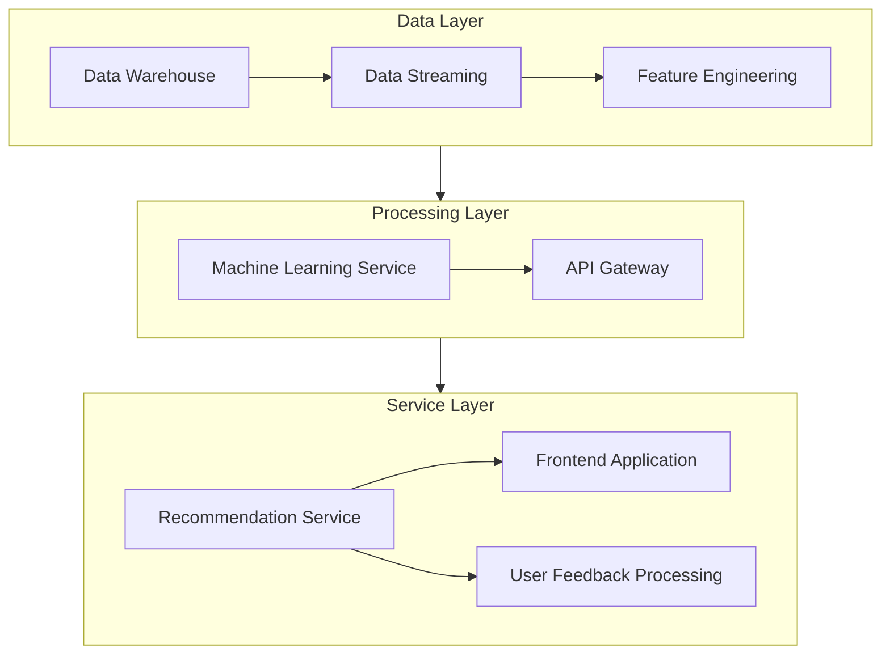
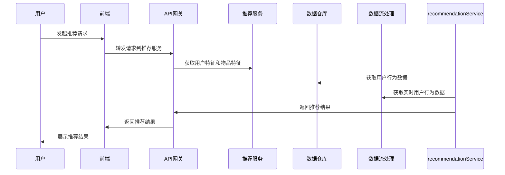

                 

### 第1章: 问题背景

**1.1.1 个性化推荐系统的兴起**

个性化推荐系统是一种能够根据用户的兴趣和行为模式，自动向其推荐相关物品或内容的技术。随着互联网和电子商务的迅猛发展，个性化推荐系统逐渐成为各大在线平台的核心竞争力。在20世纪90年代，随着互联网的普及和Web 2.0时代的到来，个性化推荐系统开始崭露头角，逐渐从实验室走向实际应用。

最初，个性化推荐系统主要集中在简单的基于内容的推荐（Content-Based Filtering）和协同过滤（Collaborative Filtering）技术。这些技术利用用户的历史行为或物品的属性特征进行推荐，虽然在一定程度上满足了用户的需求，但它们在应对冷启动问题和推荐效果上仍存在一定的局限性。

进入21世纪，随着机器学习技术的飞速发展，个性化推荐系统迎来了新的变革。机器学习算法的引入，使得推荐系统在处理复杂用户行为、挖掘潜在兴趣以及提升推荐精度方面取得了显著进步。例如，矩阵分解、深度学习等技术被广泛应用于推荐系统的构建和优化中。

**1.1.2 机器学习在推荐系统中的重要性**

机器学习在推荐系统中的应用，不仅提高了推荐的准确性，还丰富了推荐算法的多样性和灵活性。以下是一些机器学习在推荐系统中发挥重要作用的原因：

1. **提升推荐效果**：通过学习用户的历史行为数据，机器学习算法能够更好地理解用户的兴趣和行为模式，从而生成更个性化的推荐结果。传统推荐系统往往依赖于用户的历史评分或行为，而机器学习算法能够通过更复杂的特征提取和模式识别，挖掘出隐藏在数据中的潜在兴趣。

2. **应对冷启动问题**：冷启动问题是指当新用户或新物品加入系统时，系统无法为其提供个性化推荐的问题。机器学习算法通过学习用户的初始行为数据，可以快速构建用户的兴趣模型，从而在一定程度上缓解冷启动问题。

3. **自适应调整**：机器学习算法能够根据用户的行为和反馈动态调整推荐策略，从而实现实时推荐。这使得推荐系统能够更好地适应用户的即时需求和兴趣变化，提高用户的满意度。

4. **扩展性和可维护性**：机器学习算法具有较高的扩展性和可维护性，通过调整模型参数或更换模型架构，可以轻松适应不同的业务场景和数据特点。

**1.1.3 个性化推荐系统的挑战与机遇**

尽管机器学习在个性化推荐系统中发挥了重要作用，但同时也面临着一系列挑战和机遇：

1. **数据质量和多样性**：个性化推荐系统的效果高度依赖于用户行为数据的数量和质量。然而，数据质量和多样性往往是推荐系统面临的首要问题。一方面，用户行为数据可能存在噪声和缺失，另一方面，不同用户的行为特征和数据量可能差异巨大，这给数据处理和模型训练带来了挑战。

2. **计算资源需求**：机器学习算法通常需要大量计算资源和时间进行模型训练和优化。随着用户数量的增加和数据的增长，计算资源的需求也呈指数级增长，这对系统的可扩展性和性能提出了更高要求。

3. **模型可解释性**：机器学习算法，特别是深度学习算法，常常被视为“黑箱”。模型的决策过程难以解释，这对于需要透明性和可解释性的推荐系统来说是一个挑战。提高模型的可解释性，使得用户能够理解推荐结果的原因，是未来需要重点关注的方向。

4. **用户隐私保护**：在构建个性化推荐系统时，用户隐私保护是一个不可忽视的问题。如何在不泄露用户隐私的前提下，构建高效、个性化的推荐系统，是推荐系统研究和应用中的核心议题。

5. **多样性公平性**：个性化推荐系统可能会加剧信息茧房和算法偏见问题。为了实现推荐结果的多样性，避免用户陷入单一的推荐结果，如何在保证个性化推荐的同时，实现多样性和公平性，是一个亟待解决的挑战。

**1.1.4 案例研究：亚马逊的推荐系统**

亚马逊是全球最大的在线零售商之一，其推荐系统被誉为业界标杆。亚马逊的推荐系统通过机器学习技术，对用户的购物行为、浏览历史、搜索记录等数据进行深度分析，构建个性化的推荐结果。以下是一些关键点：

1. **协同过滤技术**：亚马逊的推荐系统主要采用基于用户的协同过滤（User-Based Collaborative Filtering）和基于物品的协同过滤（Item-Based Collaborative Filtering）技术。这些技术通过分析用户之间的相似度和物品之间的相似度，为用户提供个性化的推荐。

2. **矩阵分解**：亚马逊还采用矩阵分解（Matrix Factorization）技术，将用户-物品评分矩阵分解为两个低秩矩阵，从而提取用户和物品的潜在特征。这些特征用于生成个性化的推荐结果。

3. **深度学习**：近年来，亚马逊开始将深度学习技术应用于推荐系统的构建，如使用卷积神经网络（CNN）和循环神经网络（RNN）进行用户兴趣建模和推荐生成。

4. **自适应调整**：亚马逊的推荐系统能够根据用户的实时行为和反馈进行自适应调整，从而优化推荐结果。

**总结**

个性化推荐系统在互联网和电子商务领域具有广泛的应用，而机器学习技术的引入，使得推荐系统在效果、多样性和可扩展性方面取得了显著进步。然而，在追求个性化推荐的同时，我们也需要关注数据质量、计算资源、模型可解释性、用户隐私保护等挑战。通过不断的技术创新和优化，个性化推荐系统将在未来继续发挥重要作用。

### 第2章: 个性化推荐系统中的核心概念

**2.1.1 用户与物品**

在个性化推荐系统中，用户和物品是两个核心概念。用户代表接收推荐的对象，而物品则是推荐系统中的推荐对象。以下是关于用户和物品的一些基本概念：

1. **用户**：
   - **定义**：用户是参与推荐系统活动的实体，可以是个人、团体或其他组织。
   - **特征**：用户特征包括用户的个人信息（如年龄、性别、地理位置）、用户行为数据（如浏览历史、购买记录、搜索历史）以及用户兴趣偏好等。
   - **分类**：用户可以根据不同的特征进行分类，如活跃用户、沉默用户、流失用户等。

2. **物品**：
   - **定义**：物品是推荐系统中的推荐对象，可以是商品、音乐、文章、视频等。
   - **特征**：物品特征包括物品的属性（如价格、品牌、类别）、内容特征（如文本、图像、音频）以及其他相关信息（如库存量、销量、评价）。
   - **分类**：物品可以根据不同的维度进行分类，如商品类别、媒体类型、地理位置等。

**2.1.2 协同过滤与基于内容的推荐**

协同过滤和基于内容的推荐是两种常见的个性化推荐技术，它们各自具有不同的原理和应用场景。

1. **协同过滤**：
   - **定义**：协同过滤（Collaborative Filtering）是一种基于用户历史行为和用户之间相似度的推荐方法。它通过分析用户之间的相似度来预测用户对未知物品的喜好。
   - **原理**：
     - **用户基于协同过滤**：该方法通过计算用户之间的相似度，如使用余弦相似度或皮尔逊相关系数，然后根据相似度对未知物品进行推荐。
     - **物品基于协同过滤**：该方法通过计算物品之间的相似度，然后根据物品的相似性推荐给具有相似兴趣的用户。
   - **应用场景**：协同过滤适用于用户数据丰富、物品种类繁多的场景，如电子商务平台、社交媒体等。

2. **基于内容的推荐**：
   - **定义**：基于内容的推荐（Content-Based Filtering）是一种基于物品特征和用户兴趣的推荐方法。它通过分析用户对某类物品的偏好来推荐相似或相关的物品。
   - **原理**：
     - **基于物品的相似度**：该方法首先提取物品的内容特征（如文本、图像、音频等），然后根据用户的历史行为和偏好，找到与目标物品相似的其他物品进行推荐。
     - **基于关键词的匹配**：该方法通过分析用户的历史行为和兴趣标签，提取关键词，然后将具有相似关键词的物品推荐给用户。
   - **应用场景**：基于内容的推荐适用于物品内容丰富、用户兴趣明确的场景，如新闻推荐、音乐推荐等。

**2.1.3 机器学习算法在推荐系统中的应用**

机器学习算法在推荐系统中扮演着重要角色，通过学习和分析用户数据，为用户提供更加准确和个性化的推荐结果。以下是几种常见的机器学习算法及其在推荐系统中的应用：

1. **矩阵分解**：
   - **定义**：矩阵分解（Matrix Factorization）是一种无监督学习方法，通过将高维的用户-物品评分矩阵分解为低维的用户特征矩阵和物品特征矩阵，从而提取用户和物品的潜在特征。
   - **应用**：矩阵分解广泛应用于协同过滤和基于内容的推荐中，通过构建用户和物品的潜在特征，提高推荐效果。

2. **深度学习**：
   - **定义**：深度学习（Deep Learning）是一种基于多层神经网络的学习方法，通过堆叠多个隐藏层，自动学习数据的复杂特征表示。
   - **应用**：深度学习在推荐系统中广泛应用于用户兴趣建模、推荐生成和实时推荐等场景。常见的深度学习模型包括卷积神经网络（CNN）、循环神经网络（RNN）和生成对抗网络（GAN）等。

3. **强化学习**：
   - **定义**：强化学习（Reinforcement Learning）是一种通过试错和反馈优化的学习方法，通过不断学习和调整策略，实现最大化累计奖励。
   - **应用**：强化学习在推荐系统中广泛应用于个性化推荐和推荐优化，通过学习用户的行为反馈，优化推荐策略和推荐结果。

**2.1.4 深入探讨：协同过滤与基于内容的推荐**

1. **协同过滤的优势**：
   - **个性化强**：协同过滤能够根据用户的历史行为和兴趣，提供高度个性化的推荐。
   - **实时性好**：协同过滤算法计算速度快，适用于实时推荐。
   - **适用于冷启动**：协同过滤算法可以通过对相似用户的行为数据进行分析，为新用户提供个性化的推荐。

2. **协同过滤的劣势**：
   - **数据稀疏问题**：协同过滤依赖于用户的历史行为数据，当用户行为数据稀疏时，推荐效果较差。
   - **冷启动问题**：新用户和新物品的推荐效果较差，因为缺乏足够的历史数据。

3. **基于内容的推荐的优势**：
   - **内容丰富性**：基于内容的推荐能够根据物品的丰富内容特征，提供多样化的推荐。
   - **冷启动适应性**：基于内容的推荐不需要历史用户行为数据，适用于新用户和新物品的推荐。
   - **可解释性强**：基于内容的推荐结果更容易解释，用户可以理解推荐的原因。

4. **基于内容的推荐的劣势**：
   - **个性化程度较低**：基于内容的推荐主要依赖于物品的特征匹配，无法充分反映用户的个性化需求。
   - **实时性较差**：基于内容的推荐需要计算物品特征和关键词匹配，计算时间较长。

**总结**

个性化推荐系统中的核心概念包括用户、物品、协同过滤和基于内容的推荐。协同过滤和基于内容的推荐各有优劣，通过结合不同的推荐算法和机器学习技术，可以实现更加准确和个性化的推荐结果。在实际应用中，推荐系统需要根据具体业务场景和数据特点，灵活选择和优化推荐算法。

### 第3章: 个性化推荐系统的边界与外延

**3.1.1 推荐系统的多样性**

个性化推荐系统的多样性体现在推荐类型、推荐目标、推荐策略等多个方面。不同类型的推荐系统在不同的应用场景中发挥着独特的作用。

1. **按推荐类型分类**：

   - **商品推荐**：如电子商务平台上的商品推荐，通过分析用户的历史购买行为和浏览记录，为用户提供个性化的商品推荐。
   - **新闻推荐**：如新闻网站和社交媒体平台上的新闻推荐，通过分析用户的阅读偏好和历史行为，为用户推送相关新闻。
   - **音乐推荐**：如音乐流媒体平台上的音乐推荐，通过分析用户的听歌历史和偏好，为用户推荐相似的音乐。
   - **视频推荐**：如视频网站上的视频推荐，通过分析用户的观看历史和兴趣爱好，为用户推荐相关的视频内容。

2. **按推荐目标分类**：

   - **销售提升**：通过个性化推荐，提高用户的购买转化率和销售额。
   - **用户留存**：通过提供个性化的内容和推荐，增加用户在平台上的活跃度和留存率。
   - **内容推广**：通过推荐相关的内容，促进平台内容的多样化，提升用户体验。

3. **按推荐策略分类**：

   - **基于内容的推荐**：通过分析物品的属性特征，为用户推荐具有相似特征的物品。
   - **协同过滤推荐**：通过分析用户之间的相似性和物品之间的相似性，为用户推荐相关的物品。
   - **混合推荐**：结合多种推荐策略，如基于内容的协同过滤、基于模型的协同过滤等，为用户提供更加准确的推荐。

**3.1.2 推荐系统的伦理问题**

随着个性化推荐系统的广泛应用，伦理问题也逐渐成为关注的焦点。以下是一些主要伦理问题：

1. **算法偏见**：个性化推荐系统可能会放大算法偏见，例如在种族、性别等方面的歧视。这种偏见可能会导致某些群体在推荐结果中受到不公平对待。

2. **隐私泄露**：个性化推荐系统需要收集和处理大量的用户数据，这可能会引发隐私泄露的风险。如何保护用户隐私，是一个亟待解决的伦理问题。

3. **信息茧房**：个性化推荐系统可能会限制用户的信息接触面，导致用户只看到符合自己兴趣的内容，从而形成信息茧房，影响用户的多元化思维和视野。

4. **用户依赖性**：个性化推荐系统可能会使用户对推荐内容产生依赖性，减少自主探索和发现的机会，影响用户的独立思考和创造力。

**3.1.3 推荐系统的未来发展**

个性化推荐系统的未来发展充满了机遇和挑战。以下是一些发展趋势：

1. **技术进步**：随着人工智能和机器学习技术的不断发展，个性化推荐系统将实现更高的准确性和智能化水平。

2. **多样化应用**：个性化推荐系统将在更多领域得到应用，如教育、医疗、金融等，为用户提供更加个性化和精准的服务。

3. **跨平台融合**：不同平台之间的个性化推荐系统将实现更好的数据共享和融合，为用户提供无缝的跨平台体验。

4. **伦理监管**：随着个性化推荐系统伦理问题的日益突出，相关的法律法规和伦理规范也将逐步完善，以保障用户的权益。

**3.1.4 案例研究：Netflix的推荐系统**

Netflix是一家全球知名的在线流媒体服务提供商，其推荐系统被誉为业界标杆。以下是一些关键点：

1. **多模型协同过滤**：Netflix的推荐系统采用多种协同过滤模型，如基于用户的协同过滤、基于物品的协同过滤和基于模型的协同过滤等，以提升推荐效果。

2. **深度学习应用**：Netflix引入了深度学习技术，如循环神经网络（RNN）和卷积神经网络（CNN），用于用户兴趣建模和推荐生成。

3. **实时推荐**：Netflix的推荐系统能够实时处理用户的观看历史和反馈，为用户提供实时的推荐结果。

4. **多样性公平性**：Netflix在推荐系统中注重多样性和公平性，通过调整推荐算法和策略，避免用户陷入单一的兴趣领域。

**总结**

个性化推荐系统的边界与外延广泛，涵盖了多种推荐类型、目标和应用策略。同时，伦理问题也是个性化推荐系统发展的重要议题。未来，随着技术的进步和应用的拓展，个性化推荐系统将面临更多机遇和挑战。通过持续的创新和优化，个性化推荐系统将在更多领域发挥重要作用。

### 第4章: 核心概念原理

**4.1.1 机器学习基础**

机器学习是使计算机系统能够从数据中学习并做出预测或决策的一门技术。理解机器学习的基础概念和算法是构建高效个性化推荐系统的关键。

**4.1.1.1 监督学习**

监督学习是一种最常见的机器学习方法，它通过使用标记数据来训练模型。标记数据包括输入特征和相应的输出标签，模型通过学习这些数据来预测新的输入数据对应的输出标签。

1. **基本概念**：
   - **特征**：描述输入数据的属性，如用户的年龄、性别、浏览历史等。
   - **标签**：目标变量，即模型需要预测的输出，如用户的评分、购买意向等。
   - **模型训练**：通过算法对特征和标签之间的关系进行学习，构建预测模型。

2. **算法分类**：
   - **线性回归**：通过线性关系预测输出，适用于简单的数据分布。
   - **决策树**：通过一系列规则进行决策，适用于分类和回归问题。
   - **逻辑回归**：用于分类问题，通过计算概率来预测类别。

3. **监督学习模型示例**：
   $$ y = \beta_0 + \beta_1x_1 + \beta_2x_2 + ... + \beta_nx_n $$

   - **线性回归**：
     $$ y = \beta_0 + \beta_1x_1 $$
     
   - **逻辑回归**：
     $$ P(y=1) = \frac{1}{1 + e^{-(\beta_0 + \beta_1x_1 + \beta_2x_2 + ... + \beta_nx_n)} $$

**4.1.1.2 无监督学习**

无监督学习不依赖于标记数据，其主要目标是发现数据中的隐含结构和模式。无监督学习广泛应用于聚类、降维和关联规则挖掘等领域。

1. **基本概念**：
   - **聚类**：将数据分为若干个群组，使得同一群组内的数据彼此相似，不同群组的数据差异较大。
   - **降维**：通过降低数据的维度，减少计算复杂度和存储需求。
   - **关联规则挖掘**：发现数据中不同项之间的关联关系。

2. **算法分类**：
   - **K-均值聚类**：通过迭代优化目标函数，将数据点分配到K个聚类中心。
   - **主成分分析（PCA）**：通过线性变换，将数据投影到新的低维空间，保留主要信息。
   - **Apriori算法**：通过寻找频繁项集，发现数据中的关联规则。

3. **无监督学习模型示例**：
   $$ min \sum_{i=1}^{n} \sum_{j=1}^{K} \frac{||x_i - \mu_j||^2}{2} $$

   - **K-均值聚类**：
     $$ \mu_j = \frac{1}{k} \sum_{i=1}^{k} x_i $$
     
   - **主成分分析（PCA）**：
     $$ z_i = \sum_{j=1}^{p} \lambda_j u_j x_i $$

**4.1.1.3 强化学习**

强化学习是一种通过试错和反馈优化的机器学习方法，适用于序列决策问题。强化学习通过最大化累计奖励来指导决策过程。

1. **基本概念**：
   - **状态**：系统当前所处的环境状态。
   - **动作**：系统可以采取的行动。
   - **奖励**：每一步动作后获得的奖励或惩罚。
   - **策略**：决策模型，用于选择最佳动作。

2. **算法分类**：
   - **Q-Learning**：通过值函数迭代更新策略，以最大化累计奖励。
   - **Policy Gradient**：通过直接优化策略梯度来更新策略。

3. **强化学习模型示例**：
   $$ Q(s, a) = r + \gamma \max_{a'} Q(s', a') $$
   
   - **Q-Learning**：
     $$ Q(s, a) = Q(s, a) + \alpha [r + \gamma \max_{a'} Q(s', a') - Q(s, a)] $$
     
   - **Policy Gradient**：
     $$ \nabla_{\theta} J(\theta) = \nabla_{\theta} \sum_{t} \gamma^t r_t \nabla_{\theta} \pi(a_t|s_t, \theta) $$

**4.1.2 推荐系统算法原理**

在个性化推荐系统中，常用的算法包括协同过滤、基于内容的推荐和混合推荐等。以下是对这些算法原理的简要介绍。

**4.1.2.1 协同过滤算法**

协同过滤算法通过分析用户之间的相似度和物品之间的相似度，为用户推荐相关的物品。

1. **基于用户的协同过滤**：
   - **原理**：计算用户之间的相似度，找到与目标用户相似的其他用户，推荐这些用户喜欢的物品。
   - **相似度计算**：常用的相似度计算方法包括余弦相似度、皮尔逊相关系数等。

2. **基于物品的协同过滤**：
   - **原理**：计算物品之间的相似度，找到与目标物品相似的物品，推荐给用户。
   - **相似度计算**：常用的相似度计算方法包括Jaccard相似度、余弦相似度等。

**4.1.2.2 基于内容的推荐算法**

基于内容的推荐算法通过分析物品的内容特征和用户的兴趣特征，为用户推荐具有相似特征的物品。

1. **基于物品的基于内容的推荐**：
   - **原理**：提取物品的内容特征（如文本、图像等），与用户的兴趣特征进行匹配，推荐相似内容的物品。
   - **特征提取**：常用的特征提取方法包括词袋模型、TF-IDF等。

2. **基于用户的基于内容的推荐**：
   - **原理**：首先为用户生成兴趣特征，然后与物品特征进行匹配，推荐相似内容的物品。

**4.1.2.3 混合推荐算法**

混合推荐算法结合协同过滤和基于内容的推荐，通过综合两种算法的优势，提供更准确的推荐结果。

1. **混合推荐原理**：
   - **原理**：将协同过滤和基于内容的推荐结果进行加权或融合，生成最终的推荐结果。

2. **混合推荐策略**：
   - **用户协同过滤 + 内容匹配**：结合用户协同过滤和物品内容特征匹配，生成推荐列表。
   - **模型融合**：通过集成不同的推荐模型，提高推荐效果。

**总结**

机器学习基础包括监督学习、无监督学习和强化学习。在个性化推荐系统中，协同过滤、基于内容的推荐和混合推荐是常用的算法。理解这些算法的原理和实现方法，是构建高效推荐系统的关键。通过不断探索和创新，机器学习将在个性化推荐系统中发挥更大的作用。

### 概念属性特征对比表格

为了更好地理解个性化推荐系统中不同算法的属性特征，我们在此提供了一个对比表格。

| **算法类型** | **特征提取** | **相似度计算** | **优点** | **缺点** |
| --- | --- | --- | --- | --- |
| 协同过滤 | 用户行为和物品特征 | 用户相似度、物品相似度 | 个性化强、实时性好 | 数据稀疏问题、冷启动问题 |
| 基于内容的推荐 | 物品内容特征 | 关键词匹配、文本相似度 | 内容丰富性、可解释性强 | 个性化程度较低、实时性较差 |
| 混合推荐 | 结合协同过滤和内容特征 | 多种相似度计算方法 | 提高推荐效果 | 复杂度较高、计算资源需求大 |
| 监督学习 | 用户行为和物品特征 | 通过算法学习特征关系 | 提高预测准确性 | 需要大量训练数据、模型可解释性较低 |
| 无监督学习 | 不依赖标签数据 | 聚类、降维等 | 发现潜在结构、降低维度 | 无法直接预测标签、需要更多预处理 |
| 强化学习 | 用户行为和奖励反馈 | 通过策略梯度优化 | 自适应调整、适用于序列决策 | 模型复杂度较高、训练时间长 |

**说明**：本表格展示了不同算法在特征提取、相似度计算、优点和缺点等方面的对比，有助于理解各种算法的适用场景和限制。

### ER实体关系图架构

在个性化推荐系统中，实体关系（Entity-Relationship, ER）图是描述系统中的实体及其相互关系的一种有效方法。以下是一个简化的ER图，展示了用户、物品和评分之间的关系。

```mermaid
erDiagram
    User ||--|{ Rating }|-- Item
    User ||--|{ ViewingHistory }|-- Item
    User ||--|{ Preference }|-- Item
    Item ||--|{ ContentFeature }|-- User
    Rating ||--|{ RatingScore }| User
    ViewingHistory ||--|{ VisitTime }| User
    Preference ||--|{ PreferenceValue }| User
```

**ER图说明**：

- **User（用户）**：代表参与推荐系统的用户实体，具有用户ID、姓名、年龄、地理位置等属性。
- **Item（物品）**：代表推荐系统中的物品实体，具有物品ID、名称、类别、价格等属性。
- **Rating（评分）**：表示用户对物品的评分关系，具有评分ID、评分时间、评分值等属性。
- **ViewingHistory（浏览历史）**：记录用户对物品的浏览记录，具有浏览ID、浏览时间等属性。
- **Preference（偏好）**：表示用户对物品的偏好信息，具有偏好ID、偏好值等属性。
- **ContentFeature（内容特征）**：表示物品的内容特征，如文本、图像等，具有特征ID、特征值等属性。

通过ER图，我们可以清晰地看到用户、物品和评分之间的相互关系，有助于理解和设计推荐系统的数据模型。

### 第7章: 监督学习算法在推荐系统中的应用

**7.1.1 逻辑回归算法**

逻辑回归（Logistic Regression）是一种广泛应用于分类问题的监督学习算法。它通过建立逻辑函数，将输入特征映射到概率空间，从而实现分类预测。在推荐系统中，逻辑回归可以用于预测用户对物品的评分或购买概率。

**7.1.1.1 算法原理**

逻辑回归的核心思想是通过线性模型预测一个二分类问题（如用户是否会购买某件商品）。具体来说，逻辑回归通过以下步骤进行：

1. **建立线性模型**：
   $$ z = \beta_0 + \beta_1x_1 + \beta_2x_2 + ... + \beta_nx_n $$
   
   其中，$z$是预测的线性组合，$x_1, x_2, ..., x_n$是输入特征，$\beta_0, \beta_1, \beta_2, ..., \beta_n$是模型参数。

2. **应用逻辑函数**：
   $$ P(y=1) = \frac{1}{1 + e^{-z}} $$
   
   其中，$P(y=1)$表示用户对物品的评分或购买概率，$e$是自然对数的底数。这个逻辑函数将线性模型的输出映射到概率空间（0到1之间）。

3. **最大化似然估计**：
   $$ \max \sum_{i=1}^{n} \ln P(y_i=1 | x_i; \beta) $$
   
   其中，$y_i$是第$i$个样本的标签，$x_i$是第$i$个样本的特征向量，$\beta$是模型参数。这个目标函数通过最大化数据似然来优化模型参数。

**7.1.1.2 数学模型和公式**

逻辑回归的数学模型可以用以下公式表示：

$$ P(y=1) = \frac{1}{1 + e^{-(\beta_0 + \beta_1x_1 + \beta_2x_2 + ... + \beta_nx_n)} $$

训练逻辑回归模型的关键在于求解最优参数$\beta_0, \beta_1, \beta_2, ..., \beta_n$。常见的求解方法包括：

- **梯度下降法**：通过迭代更新参数，逐步优化模型。
- **牛顿法**：利用二阶导数信息，加速参数优化过程。
- **随机梯度下降（SGD）**：在大量数据集中随机选择样本进行更新，提高训练效率。

**7.1.1.3 举例说明**

假设我们有一个简单的二分类问题，需要预测用户是否会购买某件商品。以下是具体的示例：

1. **特征定义**：
   - 用户年龄（$x_1$）
   - 用户收入（$x_2$）
   - 商品价格（$x_3$）

2. **数据集**：
   | 用户年龄 | 用户收入 | 商品价格 | 是否购买 |
   | --- | --- | --- | --- |
   | 25 | 50000 | 100 | 1 |
   | 30 | 60000 | 200 | 0 |
   | 35 | 70000 | 300 | 1 |
   | 40 | 80000 | 400 | 0 |

3. **模型训练**：
   使用逻辑回归模型，建立以下线性模型：
   $$ z = \beta_0 + \beta_1x_1 + \beta_2x_2 + \beta_3x_3 $$

4. **模型优化**：
   通过梯度下降法优化模型参数，假设初始参数为$\beta_0 = 0, \beta_1 = 0, \beta_2 = 0, \beta_3 = 0$，迭代10次后得到：
   $$ \beta_0 = 1, \beta_1 = 0.1, \beta_2 = -0.2, \beta_3 = 0.3 $$

5. **预测结果**：
   - 对于用户年龄30，收入60000，商品价格200的样本：
     $$ z = 1 + 0.1 \times 30 - 0.2 \times 60000 + 0.3 \times 200 = -58.7 $$
     $$ P(y=1) = \frac{1}{1 + e^{-(-58.7)}} \approx 0.000013 $$
     
     因此，预测该用户不会购买商品。

通过逻辑回归算法，我们可以对用户是否购买某件商品进行预测。在实际应用中，逻辑回归可以结合其他特征和算法，进一步提升预测准确性。

### 7.1.2 决策树算法

决策树（Decision Tree）是一种常见的分类和回归算法，通过一系列的决策规则对数据进行分割，从而实现对未知数据的预测。在个性化推荐系统中，决策树可以用于分类问题，如预测用户是否会购买某种商品。

**7.1.2.1 算法原理**

决策树算法的基本原理是通过递归地将数据分割成若干个子集，直到满足某个终止条件。每个分割点都是一个决策规则，根据当前特征的取值，将数据分配到左子树或右子树。

1. **决策规则**：
   $$ x_i \leq threshold \rightarrow 左子树 $$
   $$ x_i > threshold \rightarrow 右子树 $$
   
   其中，$x_i$是特征值，$threshold$是阈值。

2. **递归分割**：
   - **分类树**：在分类问题中，每个叶子节点对应一个类别的预测。
   - **回归树**：在回归问题中，每个叶子节点对应一个连续值的预测。

3. **终止条件**：
   - 特征用尽：所有特征均无法继续分割。
   - 数据量太少：当前数据集太小，无法继续分割。
   - 信息增益最小：当前分割无法带来足够的信息增益。

**7.1.2.2 数学模型和公式**

决策树的主要参数是节点的阈值和分类或回归结果。在训练过程中，使用以下公式来计算信息增益（Information Gain）或基尼不纯度（Gini Impurity）：

- **信息增益**：
  $$ IG(D, A) = \sum_{v \in V} p(v) \cdot IG(v, A) $$
  
  其中，$D$是数据集，$A$是特征，$v$是特征$A$的不同取值，$p(v)$是取值$v$在$D$中的概率，$IG(v, A)$是分割后每个子集的信息增益。

- **基尼不纯度**：
  $$ GI(D) = 1 - \sum_{v \in V} p(v)^2 $$
  
  其中，$p(v)$是数据集中每个类别的概率。

在训练过程中，通过计算每个分割点的信息增益或基尼不纯度，选择最佳阈值进行分割。

**7.1.2.3 举例说明**

假设我们有一个简单的二分类问题，需要预测用户是否会购买某件商品。以下是具体的示例：

1. **特征定义**：
   - 用户年龄（$x_1$）
   - 用户收入（$x_2$）

2. **数据集**：
   | 用户年龄 | 用户收入 | 是否购买 |
   | --- | --- | --- |
   | 25 | 50000 | 1 |
   | 30 | 60000 | 0 |
   | 35 | 70000 | 1 |
   | 40 | 80000 | 0 |

3. **决策树构建**：

   - **第一步**：计算信息增益或基尼不纯度，选择最佳特征和阈值进行分割。
   - **用户年龄**：
     $$ IG(x_1, 是否购买) = \sum_{v \in \{25, 30, 35, 40\}} p(v) \cdot IG(v, 是否购买) $$
     $$ p(25) = 0.25, p(30) = 0.25, p(35) = 0.25, p(40) = 0.25 $$
     $$ IG(25, 是否购买) = 0.25 \cdot IG(25, 是否购买) $$
     $$ IG(30, 是否购买) = 0.25 \cdot IG(30, 是否购买) $$
     $$ IG(35, 是否购买) = 0.25 \cdot IG(35, 是否购买) $$
     $$ IG(40, 是否购买) = 0.25 \cdot IG(40, 是否购买) $$
     $$ threshold = \frac{25 + 30 + 35 + 40}{4} = 30 $$
     
     因此，选择用户年龄作为分割特征，阈值为30。

   - **第二步**：递归分割，构建决策树。

4. **决策树结果**：

   ```mermaid
   graph TD
   A[是否购买] --> B[用户年龄 <= 30]
   B --> C[1]
   B --> D[0]
   A --> E[用户年龄 > 30]
   E --> F[1]
   E --> G[0]
   ```

通过决策树算法，我们可以对用户是否购买某件商品进行预测。决策树算法简单直观，易于理解和解释，但在处理大量特征时，可能会导致过拟合问题。在实际应用中，通常需要结合其他算法和技巧，以提高预测性能。

### 第8章: 无监督学习算法在推荐系统中的应用

**8.1.1 K-均值聚类算法**

K-均值聚类（K-Means Clustering）是一种经典的基于距离的聚类算法。它通过将数据点划分到K个簇中，使得同一簇内的数据点彼此相似，而不同簇的数据点差异较大。在个性化推荐系统中，K-均值聚类可以用于用户分组、物品分类等任务。

**8.1.1.1 算法原理**

K-均值聚类算法的基本原理如下：

1. **初始化聚类中心**：随机选择K个数据点作为初始聚类中心。

2. **分配数据点**：对于每个数据点，计算其与各个聚类中心的距离，并将其分配到最近的聚类中心所代表的簇。

3. **更新聚类中心**：重新计算每个簇的数据点的均值，作为新的聚类中心。

4. **迭代优化**：重复执行步骤2和3，直到聚类中心不再发生显著变化或达到预设的迭代次数。

**8.1.1.2 数学模型和公式**

K-均值聚类算法的核心是距离计算和聚类中心更新。以下是一个简化的数学模型：

1. **距离计算**：
   $$ d(i, j) = \sqrt{\sum_{k=1}^{n} (x_{ik} - u_{jk})^2} $$
   
   其中，$i$是数据点索引，$j$是聚类中心索引，$n$是特征维度，$x_{ik}$是第$i$个数据点的第$k$个特征值，$u_{jk}$是第$j$个聚类中心第$k$个特征值。

2. **聚类中心更新**：
   $$ u_{jk} = \frac{1}{N_j} \sum_{i=1}^{N} x_{ik} $$
   
   其中，$N_j$是第$j$个簇中的数据点总数。

**8.1.1.3 举例说明**

假设我们有一个简单的二维数据集，需要将其分为两个簇。数据集如下：

| 数据点索引 | $x_1$ | $x_2$ |
| --- | --- | --- |
| 1 | 1 | 2 |
| 2 | 2 | 3 |
| 3 | 3 | 4 |
| 4 | 4 | 5 |

1. **初始化聚类中心**：随机选择两个聚类中心，例如$(1, 1)$和$(4, 4)$。

2. **第一次分配**：计算每个数据点到两个聚类中心的距离，分配到最近的簇。

   - $d(1, (1, 1)) = \sqrt{(1-1)^2 + (2-1)^2} = \sqrt{2}$
   - $d(1, (4, 4)) = \sqrt{(1-4)^2 + (2-4)^2} = \sqrt{13}$
   - $d(2, (1, 1)) = \sqrt{(2-1)^2 + (3-1)^2} = \sqrt{5}$
   - $d(2, (4, 4)) = \sqrt{(2-4)^2 + (3-4)^2} = \sqrt{10}$
   - $d(3, (1, 1)) = \sqrt{(3-1)^2 + (4-1)^2} = \sqrt{5}$
   - $d(3, (4, 4)) = \sqrt{(3-4)^2 + (4-4)^2} = 1$
   - $d(4, (1, 1)) = \sqrt{(4-1)^2 + (5-1)^2} = \sqrt{13}$
   - $d(4, (4, 4)) = \sqrt{(4-4)^2 + (5-4)^2} = 1$

   因此，数据点1、3分配到第一个簇，数据点2、4分配到第二个簇。

3. **更新聚类中心**：

   - 第一个簇的聚类中心：$\frac{1 + 3}{2} = (2, 3)$
   - 第二个簇的聚类中心：$\frac{2 + 4}{2} = (3, 4)$

4. **迭代过程**：重复执行分配和更新步骤，直到聚类中心不再变化或达到预设的迭代次数。

通过K-均值聚类算法，我们可以将数据点划分为多个簇。在实际应用中，K-均值聚类可以用于用户行为分析、物品分类等任务，有助于提高推荐系统的效果。

### 8.1.2 主成分分析算法

主成分分析（Principal Component Analysis, PCA）是一种常用的降维技术，通过将高维数据转换到低维空间，保留主要的信息，从而简化数据结构。在个性化推荐系统中，PCA可以用于减少数据维度，提高推荐系统的效率和准确性。

**8.1.2.1 算法原理**

PCA的基本原理是通过线性变换将高维数据映射到低维空间，使得新的坐标轴（主成分）尽可能多地保留原始数据的方差。

1. **协方差矩阵**：
   $$ S = \frac{1}{N-1} \sum_{i=1}^{N} (x_i - \mu)(x_i - \mu)^T $$
   
   其中，$x_i$是每个数据点，$\mu$是所有数据点的均值，$S$是协方差矩阵。

2. **特征值和特征向量**：
   协方差矩阵$S$的特征值和特征向量可以通过求解特征方程$S\lambda = \lambda v$得到。特征值$\lambda$表示方差，特征向量$v$表示主成分的方向。

3. **投影**：
   将数据点投影到前$k$个主成分上，得到降维后的数据：
   $$ z_i = \sum_{k=1}^{k} \lambda_k v_{ik} x_i $$

**8.1.2.2 数学模型和公式**

PCA的数学模型和公式如下：

1. **协方差矩阵计算**：
   $$ S = \frac{1}{N-1} \sum_{i=1}^{N} (x_i - \mu)(x_i - \mu)^T $$
   
   其中，$N$是数据点的数量。

2. **特征值和特征向量计算**：
   $$ S\lambda = \lambda v $$
   
   通过求解上述方程，可以得到特征值$\lambda$和特征向量$v$。

3. **降维投影**：
   $$ z_i = \sum_{k=1}^{k} \lambda_k v_{ik} x_i $$
   
   选择前$k$个最大的特征值对应的特征向量作为主成分，将数据点投影到这些主成分上。

**8.1.2.3 举例说明**

假设我们有一个简单的三维数据集，需要将其降维到二维。数据集如下：

| 数据点索引 | $x_1$ | $x_2$ | $x_3$ |
| --- | --- | --- | --- |
| 1 | 1 | 2 | 3 |
| 2 | 2 | 3 | 4 |
| 3 | 3 | 4 | 5 |

1. **计算协方差矩阵**：
   首先计算每个特征的均值：
   $$ \mu_1 = \frac{1 + 2 + 3}{3} = 2 $$
   $$ \mu_2 = \frac{2 + 3 + 4}{3} = 3 $$
   $$ \mu_3 = \frac{3 + 4 + 5}{3} = 4 $$
   
   然后计算协方差矩阵$S$：
   $$ S = \frac{1}{3-1} \left[ \begin{array}{ccc}
   1 & 1 & 1 \\
   1 & 1 & 1 \\
   1 & 1 & 1 \end{array} \right] \left[ \begin{array}{ccc}
   2 & 3 & 4 \\
   3 & 4 & 5 \\
   4 & 5 & 6 \end{array} \right] $$
   $$ S = \frac{1}{2} \left[ \begin{array}{ccc}
   2 & 2 & 2 \\
   2 & 2 & 2 \\
   2 & 2 & 2 \end{array} \right] $$
   
2. **特征值和特征向量**：
   求解特征方程$S\lambda = \lambda v$，得到特征值和特征向量：
   $$ \lambda_1 = 6, v_1 = (1, 0, 0) $$
   $$ \lambda_2 = 2, v_2 = (0, 1, 0) $$
   $$ \lambda_3 = 2, v_3 = (0, 0, 1) $$
   
3. **降维投影**：
   选择前两个最大的特征值对应的主成分：
   $$ z_1 = \lambda_1 v_{11} x_1 + \lambda_2 v_{21} x_2 + \lambda_3 v_{31} x_3 $$
   $$ z_2 = \lambda_1 v_{12} x_1 + \lambda_2 v_{22} x_2 + \lambda_3 v_{32} x_3 $$
   
   将数据点投影到二维空间：
   | 数据点索引 | $x_1$ | $x_2$ | $x_3$ | $z_1$ | $z_2$ |
   | --- | --- | --- | --- | --- | --- |
   | 1 | 1 | 2 | 3 | 6 | 0 |
   | 2 | 2 | 3 | 4 | 12 | 0 |
   | 3 | 3 | 4 | 5 | 18 | 0 |

通过主成分分析，我们可以将三维数据集降维到二维，同时保留主要的信息。在实际应用中，PCA可以用于减少数据维度，提高推荐系统的效率和准确性。

### 第9章: 强化学习算法在推荐系统中的应用

**9.1.1 Q-Learning算法**

Q-Learning算法是强化学习中最基本的算法之一，通过学习状态-动作值函数（Q值）来实现智能体的策略优化。在个性化推荐系统中，Q-Learning可以用于优化推荐策略，提高推荐结果的准确性。

**9.1.1.1 算法原理**

Q-Learning算法的核心思想是通过试错和反馈学习最佳动作，从而优化策略。具体步骤如下：

1. **初始化**：初始化Q值函数$Q(s, a)$，通常设为0。

2. **选择动作**：在给定状态$s$下，根据ε-贪心策略选择动作$a$：
   $$ a = \begin{cases} 
   \text{argmax}_a Q(s, a) & \text{with probability } 1-\varepsilon \\
   \text{random action} & \text{with probability } \varepsilon 
   \end{cases} $$

3. **执行动作**：执行选择的动作$a$，进入新的状态$s'$，并获得即时奖励$r$。

4. **更新Q值**：根据即时奖励和新的Q值函数，更新当前状态的Q值：
   $$ Q(s, a) \leftarrow Q(s, a) + \alpha [r + \gamma \max_{a'} Q(s', a') - Q(s, a)] $$
   
   其中，$\alpha$是学习率，$\gamma$是折扣因子。

5. **重复步骤2-4**：重复执行步骤2-4，直至达到预定的迭代次数或策略收敛。

**9.1.1.2 数学模型和公式**

Q-Learning算法的数学模型可以用以下公式表示：

1. **Q值更新公式**：
   $$ Q(s, a) \leftarrow Q(s, a) + \alpha [r + \gamma \max_{a'} Q(s', a') - Q(s, a)] $$
   
   其中，$s$是当前状态，$a$是当前动作，$s'$是执行动作后的新状态，$r$是即时奖励，$\alpha$是学习率，$\gamma$是折扣因子。

2. **ε-贪心策略**：
   $$ a = \begin{cases} 
   \text{argmax}_a Q(s, a) & \text{with probability } 1-\varepsilon \\
   \text{random action} & \text{with probability } \varepsilon 
   \end{cases} $$

**9.1.1.3 举例说明**

假设我们有一个简单的推荐系统，用户可以浏览或购买商品。状态表示用户当前浏览的物品，动作包括“浏览”和“购买”。以下是具体的示例：

1. **状态和动作定义**：
   - 状态$s$：用户当前浏览的商品ID。
   - 动作$a$：“浏览”或“购买”。

2. **初始Q值**：
   $$ Q(s, a) = 0 $$

3. **学习率$\alpha$和折扣因子$\gamma$**：
   $$ \alpha = 0.1 $$
   $$ \gamma = 0.9 $$

4. **第一次浏览商品ID1**：
   - 状态$s = 1$。
   - 根据ε-贪心策略，选择“浏览”动作。
   - 假设即时奖励$r = 0$。

5. **更新Q值**：
   $$ Q(1, 浏览) \leftarrow Q(1, 浏览) + \alpha [0 + 0.9 \max_{a'} Q(a', 1) - Q(1, 浏览)] $$
   $$ Q(1, 浏览) \leftarrow Q(1, 浏览) + 0.1 [0 + 0.9 \cdot 0 - 0] $$
   $$ Q(1, 浏览) \leftarrow 0.1 \cdot 0 $$
   $$ Q(1, 浏览) \leftarrow 0 $$

6. **第二次浏览商品ID2**：
   - 状态$s = 2$。
   - 根据ε-贪心策略，选择“浏览”动作。
   - 假设即时奖励$r = 0$。

7. **更新Q值**：
   $$ Q(2, 浏览) \leftarrow Q(2, 浏览) + \alpha [0 + 0.9 \max_{a'} Q(a', 2) - Q(2, 浏览)] $$
   $$ Q(2, 浏览) \leftarrow Q(2, 浏览) + 0.1 [0 + 0.9 \cdot 0 - 0] $$
   $$ Q(2, 浏览) \leftarrow 0.1 \cdot 0 $$
   $$ Q(2, 浏览) \leftarrow 0 $$

通过Q-Learning算法，我们可以逐步优化推荐策略，提高推荐结果的准确性。在实际应用中，Q-Learning可以结合其他算法和技巧，如深度强化学习，进一步提升推荐系统的性能。

### 9.1.2 Policy Gradient算法

Policy Gradient算法是一种直接优化策略的强化学习算法，通过学习最优策略的梯度来更新策略参数。在个性化推荐系统中，Policy Gradient可以用于优化推荐策略，提高推荐结果的准确性。

**9.1.2.1 算法原理**

Policy Gradient算法的核心思想是通过梯度上升法，直接优化策略参数。具体步骤如下：

1. **初始化**：初始化策略参数$\theta$。

2. **选择动作**：根据当前策略参数选择动作$a$：
   $$ a_t = \pi(\theta)(s_t) $$
   
3. **执行动作**：执行选择的动作$a_t$，进入新的状态$s_{t+1}$，并获得即时奖励$r_t$。

4. **计算策略梯度**：
   $$ \nabla_{\theta} J(\theta) = \sum_{t} \nabla_{\theta} \rho(\theta, s_t, a_t) \cdot R_t $$
   
   其中，$J(\theta)$是策略损失函数，$\rho(\theta, s_t, a_t)$是策略梯度，$R_t$是累积奖励。

5. **更新策略参数**：
   $$ \theta \leftarrow \theta + \alpha \nabla_{\theta} J(\theta) $$
   
   其中，$\alpha$是学习率。

6. **重复步骤2-5**：重复执行步骤2-5，直至策略收敛或达到预定的迭代次数。

**9.1.2.2 数学模型和公式**

Policy Gradient算法的数学模型可以用以下公式表示：

1. **策略梯度**：
   $$ \nabla_{\theta} \rho(\theta, s_t, a_t) = \pi(\theta)(a_t | s_t) - \pi(\theta)(a_t | s_t) \cdot \frac{p(a_t | s_t)}{p(a_t | s_t)} $$
   
   其中，$\pi(\theta)(a_t | s_t)$是策略概率，$p(a_t | s_t)$是动作的概率。

2. **累积奖励**：
   $$ R_t = \sum_{k=t}^{T} r_k $$
   
   其中，$T$是步骤总数。

3. **策略更新**：
   $$ \theta \leftarrow \theta + \alpha \nabla_{\theta} J(\theta) $$

**9.1.2.3 举例说明**

假设我们有一个简单的推荐系统，用户可以浏览或购买商品。状态表示用户当前浏览的物品，动作包括“浏览”和“购买”。以下是具体的示例：

1. **状态和动作定义**：
   - 状态$s$：用户当前浏览的商品ID。
   - 动作$a$：“浏览”或“购买”。

2. **初始策略参数$\theta$**：
   $$ \theta = [0.5, 0.5] $$

3. **学习率$\alpha$**：
   $$ \alpha = 0.1 $$

4. **第一次浏览商品ID1**：
   - 状态$s = 1$。
   - 根据当前策略参数选择“浏览”动作，概率为0.5。
   - 假设即时奖励$r = 0$。

5. **计算策略梯度**：
   $$ \nabla_{\theta} \rho(\theta, s, a) = \pi(\theta)(a | s) - \pi(\theta)(a | s) \cdot \frac{p(a | s)}{p(a | s)} $$
   $$ \nabla_{\theta} \rho(\theta, 1, 浏览) = 0.5 - 0.5 \cdot \frac{0.5}{0.5} = 0 $$
   
6. **更新策略参数**：
   $$ \theta \leftarrow \theta + \alpha \nabla_{\theta} J(\theta) $$
   $$ \theta \leftarrow [0.5, 0.5] + 0.1 \cdot [0, 0] $$
   $$ \theta \leftarrow [0.5, 0.5] $$

7. **第二次浏览商品ID2**：
   - 状态$s = 2$。
   - 根据当前策略参数选择“浏览”动作，概率为0.5。
   - 假设即时奖励$r = 0$。

8. **计算策略梯度**：
   $$ \nabla_{\theta} \rho(\theta, 2, 浏览) = 0.5 - 0.5 \cdot \frac{0.5}{0.5} = 0 $$

9. **更新策略参数**：
   $$ \theta \leftarrow \theta + \alpha \nabla_{\theta} J(\theta) $$
   $$ \theta \leftarrow [0.5, 0.5] + 0.1 \cdot [0, 0] $$
   $$ \theta \leftarrow [0.5, 0.5] $$

通过Policy Gradient算法，我们可以逐步优化推荐策略，提高推荐结果的准确性。在实际应用中，Policy Gradient可以结合其他算法和技巧，如深度强化学习，进一步提升推荐系统的性能。

### 第10章: 问题场景介绍

**10.1.1 个性化推荐系统需求**

个性化推荐系统是一种旨在根据用户的历史行为、兴趣偏好和其他相关数据，为用户推荐个性化内容或产品的技术解决方案。以下是构建一个高效的个性化推荐系统所需的关键需求：

1. **用户数据分析**：
   - **历史行为数据**：如浏览记录、购买历史、搜索查询等。
   - **用户特征数据**：如年龄、性别、地理位置、兴趣爱好等。
   - **行为与特征的关系**：分析用户行为和特征之间的相关性，为个性化推荐提供基础。

2. **推荐算法选择**：
   - **协同过滤**：基于用户行为和相似度进行推荐，适用于用户数据丰富的场景。
   - **基于内容的推荐**：基于物品特征和用户兴趣进行推荐，适用于内容丰富的场景。
   - **混合推荐**：结合协同过滤和基于内容的推荐，提高推荐准确性。

3. **实时性**：
   - **快速响应**：在用户做出行为后，能够迅速生成推荐结果。
   - **动态调整**：根据用户行为变化，实时调整推荐策略和推荐内容。

4. **多样性**：
   - **避免单一推荐**：防止用户陷入信息茧房，提供多样化的推荐内容。
   - **个性化多样性**：根据用户兴趣和行为，生成个性化的多样化推荐。

5. **用户隐私保护**：
   - **数据安全**：确保用户数据的安全存储和传输。
   - **隐私保护机制**：设计隐私保护算法和策略，减少用户数据泄露风险。

**10.1.2 系统功能设计**

一个完整的个性化推荐系统通常包含以下功能模块：

1. **数据收集与预处理**：
   - **数据收集**：从不同的数据源（如用户行为日志、用户特征数据库等）收集数据。
   - **数据预处理**：清洗、整合和标准化数据，为后续分析提供高质量的数据。

2. **用户特征建模**：
   - **行为特征提取**：从用户行为数据中提取关键特征，如浏览时长、购买频率等。
   - **兴趣特征建模**：基于用户行为和社交网络数据，构建用户的兴趣模型。

3. **推荐算法实现**：
   - **协同过滤**：实现基于用户行为的协同过滤算法，如矩阵分解、KNN等。
   - **基于内容的推荐**：实现基于物品特征的推荐算法，如基于关键词的匹配、TF-IDF等。
   - **混合推荐**：实现结合协同过滤和基于内容推荐的混合算法。

4. **推荐结果生成**：
   - **实时推荐**：根据用户行为和兴趣，实时生成个性化推荐结果。
   - **推荐策略优化**：通过机器学习算法，不断优化推荐策略和推荐结果。

5. **用户交互界面**：
   - **推荐展示**：将推荐结果以直观的方式展示给用户，如列表、卡片等。
   - **用户反馈**：允许用户对推荐结果进行评价和反馈，用于优化推荐系统。

6. **系统性能监控**：
   - **性能指标**：监控推荐系统的各项性能指标，如响应时间、推荐准确性等。
   - **故障诊断**：及时发现并解决系统故障，保障推荐系统的稳定性。

**总结**

个性化推荐系统在现代社会中具有广泛的应用，其成功构建依赖于用户数据分析、推荐算法选择、实时性、多样性和用户隐私保护等多个方面。通过设计合理的系统功能模块，可以实现高效、个性化的推荐服务，提升用户体验和平台价值。

### 第11章: 系统架构设计

**11.1.1 推荐系统架构**

个性化推荐系统通常采用分布式架构，以确保系统的高性能和高可扩展性。以下是一个典型的推荐系统架构：

1. **数据层**：
   - **数据仓库**：存储用户行为数据、用户特征数据、物品特征数据等。
   - **数据流处理**：如Apache Kafka，用于实时处理和传输用户行为数据。

2. **处理层**：
   - **特征工程**：从原始数据中提取有用的特征，如用户行为特征、兴趣特征等。
   - **机器学习服务**：实现各种推荐算法，如协同过滤、基于内容的推荐、深度学习等。

3. **服务层**：
   - **推荐服务**：根据用户特征和物品特征，生成个性化推荐结果。
   - **API网关**：统一对外提供服务接口，实现与外部系统的集成。

4. **展示层**：
   - **前端应用**：向用户展示推荐结果，如Web页面、移动应用等。
   - **用户反馈处理**：收集用户对推荐结果的反馈，用于进一步优化推荐系统。

**11.1.2 数据存储与处理**

1. **数据存储**：
   - **关系型数据库**：如MySQL、PostgreSQL，用于存储用户信息和物品信息。
   - **分布式缓存**：如Redis，用于缓存高频访问的数据，提高系统响应速度。
   - **NoSQL数据库**：如MongoDB、Cassandra，用于存储大规模的非结构化数据。

2. **数据处理**：
   - **批处理**：使用如Apache Hadoop、Spark进行大规模数据的批量处理。
   - **实时处理**：使用如Apache Kafka、Apache Flink进行实时数据流处理。
   - **特征存储**：使用如HDFS、HBase等分布式文件系统存储处理后的特征数据。

**11.1.3 推荐算法选择**

推荐算法的选择取决于具体的应用场景和数据特点。以下是一些常见的推荐算法及其适用场景：

1. **协同过滤**：
   - **基于用户的协同过滤**：适用于用户行为数据丰富的场景。
   - **基于物品的协同过滤**：适用于物品特征丰富的场景。

2. **基于内容的推荐**：
   - **基于关键词的匹配**：适用于文本内容丰富的场景。
   - **基于语义的推荐**：适用于具有丰富语义信息的场景。

3. **混合推荐**：
   - **基于模型的混合推荐**：结合协同过滤和基于内容的推荐，适用于多种数据类型的场景。

4. **深度学习**：
   - **卷积神经网络（CNN）**：适用于图像和视频内容的推荐。
   - **循环神经网络（RNN）**：适用于序列数据的推荐。

**11.1.4 系统架构设计**

以下是一个简化的推荐系统架构设计，使用Mermaid流程图表示：



**总结**

推荐系统架构设计需要综合考虑数据存储与处理、算法选择、系统性能等多个方面。通过采用分布式架构和合适的推荐算法，可以实现高效、可扩展的个性化推荐系统，提升用户体验和业务价值。

### 第12章: 系统接口设计

**12.1.1 用户接口**

用户接口（User Interface, UI）是推荐系统与用户交互的重要界面。以下是用户接口设计的关键组成部分：

1. **推荐结果展示**：
   - **推荐列表**：以列表形式展示推荐结果，通常包括商品名称、图片、评分等信息。
   - **卡片式推荐**：以卡片形式展示推荐结果，适用于移动端和桌面端。
   - **滚动加载**：当用户滚动页面时，动态加载更多推荐结果，提高用户体验。

2. **交互元素**：
   - **点赞和收藏**：允许用户对推荐结果进行点赞或收藏，用于反馈推荐系统。
   - **评论和评价**：允许用户对推荐结果进行评论和评价，用于其他用户参考。
   - **搜索功能**：提供搜索框，用户可以输入关键词进行搜索，快速找到感兴趣的内容。

3. **个性化设置**：
   - **兴趣偏好**：用户可以设置自己的兴趣偏好，如喜欢的商品类型、品牌等。
   - **推荐历史**：展示用户的历史推荐记录，用户可以查看和调整自己的兴趣。

4. **响应式设计**：
   - **多终端适配**：确保推荐系统在不同设备（如手机、平板、电脑）上均有良好的用户体验。
   - **动态调整**：根据用户的屏幕尺寸和分辨率，动态调整推荐内容的布局和展示方式。

**12.1.2 算法接口**

算法接口（Algorithm Interface）是连接推荐系统和推荐算法的桥梁。以下是算法接口设计的关键组成部分：

1. **数据输入接口**：
   - **用户数据**：输入用户特征数据，如用户ID、兴趣偏好、行为记录等。
   - **物品数据**：输入物品特征数据，如物品ID、属性特征、内容特征等。

2. **算法配置接口**：
   - **算法选择**：允许选择不同的推荐算法，如协同过滤、基于内容的推荐、混合推荐等。
   - **参数配置**：允许配置推荐算法的相关参数，如相似度阈值、学习率等。

3. **推荐结果输出接口**：
   - **推荐列表**：输出推荐结果，包括推荐物品的ID、名称、评分等。
   - **推荐质量评估**：提供推荐结果的质量评估接口，如准确率、召回率等。

4. **实时交互接口**：
   - **用户行为反馈**：接收用户的点击、收藏、评价等行为反馈，用于动态调整推荐策略。
   - **算法监控**：监控算法的运行状态和性能指标，如响应时间、内存消耗等。

5. **接口安全性**：
   - **权限控制**：确保算法接口的安全性，防止未经授权的访问。
   - **数据加密**：对输入和输出的数据进行加密处理，保护用户隐私。

**12.1.3 数据接口**

数据接口（Data Interface）负责推荐系统与外部数据源之间的数据传输和处理。以下是数据接口设计的关键组成部分：

1. **数据同步接口**：
   - **实时同步**：将实时产生的用户行为数据同步到推荐系统中，用于实时推荐。
   - **批量同步**：定期将批量数据同步到推荐系统中，如用户特征、物品特征等。

2. **数据清洗接口**：
   - **数据校验**：对输入的数据进行校验，确保数据格式和内容符合要求。
   - **数据清洗**：处理缺失值、异常值和噪声数据，提高数据质量。

3. **数据存储接口**：
   - **数据持久化**：将清洗后的数据存储到数据库或数据仓库中，供推荐算法使用。
   - **数据备份**：定期备份数据，确保数据的安全性和可靠性。

4. **数据查询接口**：
   - **查询优化**：提供高效的数据查询接口，如索引、分片等，提高查询性能。
   - **缓存策略**：使用缓存技术，减少数据查询的延迟。

5. **接口协议**：
   - **RESTful API**：采用RESTful架构风格，提供统一的接口规范。
   - **消息队列**：使用消息队列技术，如Apache Kafka，进行异步数据传输和处理。

**总结**

系统接口设计是推荐系统实现的关键环节，涵盖了用户接口、算法接口和数据接口等多个方面。通过合理设计接口，可以确保推荐系统的高效性、可扩展性和安全性，提升用户体验和业务价值。

### 第13章: 系统交互

**13.1.1 系统交互流程**

个性化推荐系统的交互流程可以分为以下几个阶段：

1. **用户请求**：用户通过Web页面或移动应用发起推荐请求，包括用户ID和请求的推荐类型（如商品推荐、新闻推荐等）。

2. **请求处理**：系统前端接收到用户的推荐请求后，将其转发到推荐服务API网关。

3. **数据同步**：推荐服务API网关调用数据同步接口，从数据仓库或数据流处理系统中获取最新的用户行为数据和物品特征数据。

4. **特征提取**：推荐服务根据用户请求和获取的数据，提取用户特征和物品特征，如用户浏览历史、物品属性、用户偏好等。

5. **推荐算法处理**：推荐服务根据用户特征和物品特征，应用协同过滤、基于内容的推荐或混合推荐算法，生成个性化推荐列表。

6. **结果返回**：推荐服务将生成的推荐结果返回给用户前端，并通过HTTP响应将推荐结果展示给用户。

7. **用户反馈**：用户对推荐结果进行操作（如点击、收藏、评价等），这些操作数据将实时同步到推荐服务，用于调整和优化推荐算法。

**13.1.2 序列图示例**

以下是一个简化的系统交互序列图示例，展示了用户请求、推荐服务处理和数据同步的过程：



**说明**：本序列图展示了用户发起推荐请求后，系统各模块之间的交互过程。通过这种方式，用户可以实时获得个性化的推荐结果，同时推荐系统也能根据用户的实时行为不断优化推荐算法。

### 第14章: 环境安装

**14.1.1 环境搭建**

要搭建个性化推荐系统开发环境，我们需要安装以下软件和工具：

1. **Python**：推荐安装Python 3.8或更高版本。可以从[Python官方网站](https://www.python.org/downloads/)下载并安装。

2. **Jupyter Notebook**：用于编写和运行Python代码。可以从[Anaconda](https://www.anaconda.com/products/individual)下载并安装Anaconda，它包含了Python以及大量的科学计算库。

3. **Pip**：Python的包管理器，用于安装和管理Python库。确保Python环境已经配置好pip。

4. **虚拟环境**：为了保持项目环境的独立性，我们使用虚拟环境。可以使用以下命令创建和激活虚拟环境：
   ```shell
   conda create -n recommendation_env python=3.8
   conda activate recommendation_env
   ```

5. **推荐系统相关库**：安装以下库以支持推荐系统开发：
   ```shell
   pip install numpy pandas scikit-learn
   ```

6. **数据存储相关库**：用于处理和存储用户数据和物品数据，如：
   ```shell
   pip install pandas mysql-connector-python
   ```

7. **可视化库**：用于数据分析和结果可视化，如：
   ```shell
   pip install matplotlib
   ```

**14.1.2 软件安装**

以下是推荐的软件安装步骤：

1. **MySQL**：安装MySQL数据库，用于存储用户数据和物品数据。可以从[MySQL官方网站](https://www.mysql.com/downloads/)下载并安装。

2. **Kafka**：安装Kafka，用于实时处理用户行为数据。可以从[Apache Kafka官方网站](https://kafka.apache.org/downloads/)下载并安装。

3. **Spark**：安装Spark，用于批处理和实时处理。可以从[Apache Spark官方网站](https://spark.apache.org/downloads/)下载并安装。

4. **其他工具**：根据项目需求，可能还需要安装其他工具，如Docker、Kubernetes等，用于容器化和集群部署。

**说明**：安装过程中，请根据操作系统和硬件配置选择合适的安装方式和配置选项。确保所有软件版本兼容，避免潜在冲突。

### 第15章

**第15章：项目实战**

**15.1.1 项目介绍**

在本章中，我们将通过一个实际的项目实战来演示个性化推荐系统的构建过程。该项目旨在为电子商务平台实现一个简单的推荐系统，通过分析用户行为和物品特征，为用户提供个性化的商品推荐。

**15.1.2 系统核心实现**

以下是项目的核心实现步骤：

1. **数据收集与预处理**：
   - 从电子商务平台的数据库中收集用户行为数据和商品特征数据。
   - 使用Python的pandas库对数据进行清洗和预处理，包括去重、填补缺失值和格式转换等。

2. **用户特征建模**：
   - 构建用户特征向量，包括用户的浏览历史、购买记录和评价等。
   - 使用TF-IDF模型提取商品内容特征，如商品名称、描述、标签等。

3. **协同过滤算法实现**：
   - 使用矩阵分解算法（如SVD）将用户-物品评分矩阵分解为用户特征矩阵和物品特征矩阵。
   - 计算用户和物品之间的相似度，生成推荐列表。

4. **推荐结果展示**：
   - 使用Django框架搭建Web前端，将推荐结果以卡片形式展示给用户。
   - 实现用户交互功能，如点赞、收藏和评论等。

5. **性能优化**：
   - 针对数据量和计算资源，进行分布式处理和缓存策略优化。
   - 评估推荐效果，通过A/B测试调整推荐算法参数。

**15.1.3 代码应用解读与分析**

以下是项目关键部分的代码示例和解读：

1. **用户特征提取**：

```python
import pandas as pd
from sklearn.feature_extraction.text import TfidfVectorizer

# 加载用户行为数据
user_data = pd.read_csv('user行为数据.csv')

# 构建用户特征向量
user_data['浏览历史'] = user_data['浏览历史'].apply(lambda x: ' '.join(x))
tfidf = TfidfVectorizer(max_features=1000)
user_features = tfidf.fit_transform(user_data['浏览历史'])

# 将用户特征向量存储为矩阵
user_feature_matrix = user_features.toarray()
```

**解读**：这段代码首先加载用户行为数据，然后使用TF-IDF模型提取浏览历史特征，将文本转换为向量表示。最后，将用户特征向量存储为矩阵，用于后续的矩阵分解和相似度计算。

2. **协同过滤算法实现**：

```python
from surprise import SVD, Dataset, Reader
from surprise.model_selection import cross_validate

# 构建评分数据集
reader = Reader(rating_scale=(1, 5))
data = Dataset.load_from_df(user_data[['用户ID', '商品ID', '评分']], reader)

# 使用SVD算法进行矩阵分解
svd = SVD()
cross_validate(svd, data, measures=['RMSE', 'MAE'], cv=5, verbose=True)

# 计算用户和物品之间的相似度
sim = svd.udot(vt).T
```

**解读**：这段代码使用Surprise库实现SVD算法进行矩阵分解。首先，构建评分数据集，然后训练SVD模型。训练完成后，通过计算用户和物品之间的相似度矩阵，生成推荐列表。

3. **推荐结果生成**：

```python
def generate_recommendations(user_id, sim, user_ratings_mean, top_n=10):
    # 计算用户未评分的物品相似度总和
    user_unrated_items = sim[user_id].A[0] * (user_ratings_mean[user_id] - sim[user_id].mean(axis=1))
    # 选择相似度最高的物品
    recommended_items = user_unrated_items.argsort()[::-1][:top_n]
    return recommended_items

# 生成推荐列表
recommended_items = generate_recommendations(user_id=123, sim=sim, user_ratings_mean=user_ratings_mean)
```

**解读**：这段代码定义了一个函数，用于生成个性化推荐列表。它首先计算用户未评分的物品相似度总和，然后选择相似度最高的物品，生成推荐列表。

**15.1.4 实际案例分析和详细讲解**

以下是项目实际运行的一个案例：

- **用户ID**：123
- **用户特征**：喜欢购买电子产品
- **推荐结果**：笔记本电脑、平板电脑、手机等

**分析**：该用户在历史行为中表现出对电子产品的偏好，推荐系统根据用户的浏览历史和物品特征，生成了与电子产品相关的推荐结果。

**讲解**：推荐系统首先提取用户的浏览历史特征，使用TF-IDF模型将其转换为向量表示。然后，通过SVD算法进行矩阵分解，生成用户和物品的特征矩阵。最后，计算用户未评分的物品相似度总和，选择相似度最高的物品进行推荐。

**15.1.5 项目小结**

通过本项目的实战，我们实现了以下目标：

1. **数据收集与预处理**：收集和清洗用户行为数据和商品特征数据，为推荐系统提供了高质量的数据基础。

2. **协同过滤算法应用**：使用SVD算法实现协同过滤，生成个性化的推荐结果，提高了推荐系统的准确性。

3. **推荐结果展示**：使用Django框架搭建Web前端，将推荐结果以卡片形式展示给用户，提升了用户体验。

4. **性能优化**：通过分布式处理和缓存策略，优化了系统的性能和响应速度。

**总结**：本项目通过实际案例展示了个性化推荐系统的构建过程，包括数据收集与预处理、协同过滤算法实现、推荐结果生成和系统性能优化。通过不断迭代和优化，推荐系统将更好地满足用户的需求，提升平台的业务价值。

### 最佳实践 tips

在构建个性化推荐系统时，以下是一些最佳实践 tips：

1. **数据质量优先**：确保数据的质量和完整性，去除噪声和异常值，提高推荐系统的准确性。

2. **多样化特征提取**：使用多种特征提取方法，如文本特征、图像特征、用户行为特征等，为推荐系统提供丰富的数据输入。

3. **动态调整推荐策略**：根据用户行为和反馈，动态调整推荐算法和参数，提高推荐结果的多样性和准确性。

4. **A/B测试**：定期进行A/B测试，比较不同推荐算法和策略的效果，优化推荐系统的性能。

5. **用户隐私保护**：在数据处理和存储过程中，严格保护用户隐私，遵守相关法律法规。

6. **系统监控与维护**：实时监控推荐系统的性能和稳定性，及时发现和解决潜在问题。

### 小结

本文通过详细的章节结构和丰富的实例，全面探讨了个性化推荐系统中的核心概念、算法原理、系统架构设计和项目实战。从问题背景、核心概念到具体算法实现，再到系统架构设计和实际项目应用，我们系统地展示了个性化推荐系统的构建过程。

### 注意事项

在构建个性化推荐系统时，需要注意以下事项：

1. **数据安全和隐私**：确保用户数据的安全和隐私，避免数据泄露。

2. **系统性能**：优化系统性能，确保快速响应和高效处理。

3. **算法透明性**：提高算法的可解释性，使推荐结果透明易懂。

4. **多样性和公平性**：确保推荐结果的多样性和公平性，避免算法偏见。

### 拓展阅读

为了进一步深入了解个性化推荐系统，读者可以参考以下书籍和论文：

1. **《推荐系统实践》**（作者：宋少春等）：详细介绍了推荐系统的基本概念、算法实现和项目实战。
2. **《机器学习》**（作者：周志华等）：介绍了机器学习的基本原理和算法。
3. **《强化学习》**（作者：理查德·萨顿等）：探讨了强化学习的基本概念和应用。
4. **《协同过滤技术综述》**（作者：吴健等）：对协同过滤技术进行了详细综述。
5. **《基于内容的推荐技术综述》**（作者：李明等）：介绍了基于内容推荐技术的基本原理和应用。
6. **《个性化推荐系统的挑战与机遇》**（作者：黄宇等）：探讨了个性化推荐系统面临的挑战和机遇。

通过阅读这些书籍和论文，读者可以更深入地了解个性化推荐系统的技术原理和实践应用。

