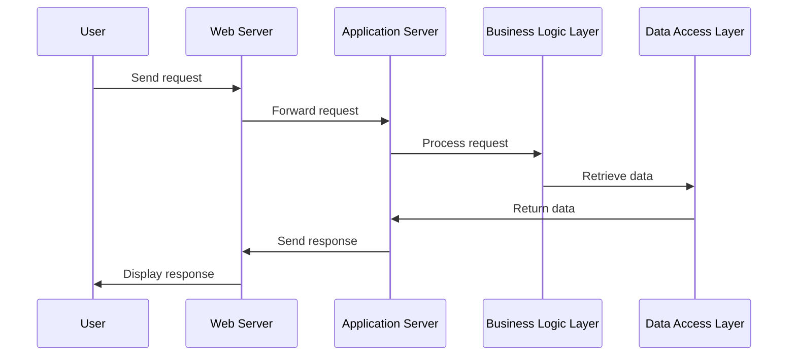
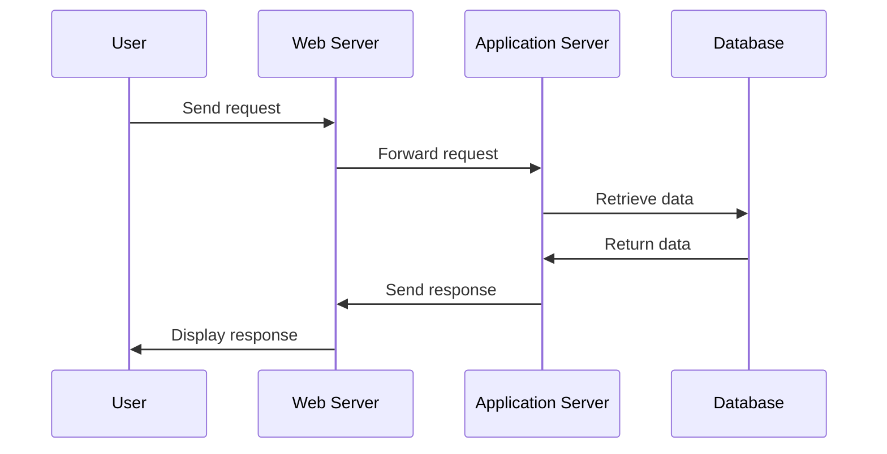

                 


## 构建丰富的内心世界：培育内在生活

### 关键词
- 内心世界
- 培育方法
- 自我认知
- 情绪管理
- 冥想

### 摘要
本文旨在探讨如何构建丰富的内心世界，通过自我认知、情绪管理和冥想等具体方法，帮助读者提升内在生活品质。文章将逐步分析各个概念，阐述其核心原理和实际应用。

### 第一部分：背景介绍

在现代社会的快速发展中，人们的内心世界越来越受到重视。面对生活节奏的加快、工作压力的增大以及信息过载，许多人开始感到内心的空虚和困惑。因此，构建丰富的内心世界已成为一个重要的课题。

#### 1. 问题背景

随着科技的进步和社会的发展，人们的生活变得更加便利，但与此同时，人们内心的压力和焦虑感也在增加。现代人的内心世界面临着诸多挑战，如情绪管理困难、人际关系紧张、自我认同危机等。这些问题严重影响了人们的生活质量，因此，如何构建丰富的内心世界成为了一个亟待解决的问题。

#### 2. 问题描述

构建丰富的内心世界，不仅意味着要有健康的心理状态，更涉及到如何培养积极的生活态度、提升自我认知和情感智慧。具体来说，内心世界的丰富性体现在以下几个方面：

- **心理健康**：保持良好的情绪状态，减少焦虑和抑郁。
- **自我认知**：了解自己的情绪、想法和行为，找到内在的平衡。
- **情感智慧**：提升与他人建立深层次情感联系的能力。

#### 3. 问题解决

本书旨在为读者提供一套系统的方法，帮助他们在日常生活中培育内在生活。通过阅读本书，读者可以了解如何通过自我觉察、情绪管理、冥想等方法，提升自己的内心世界。

#### 4. 边界与外延

构建丰富的内心世界不仅关注心理健康，还包括对生命意义、人际关系、生活态度等方面的探讨。因此，本书不仅适合心理学爱好者，也适用于希望提升生活质量的普通读者。

#### 5. 概念结构与核心要素组成

- **自我觉察**：认识自我，了解自己的情绪、想法和需求。
- **情绪管理**：学会控制情绪，避免情绪的负面影响。
- **冥想**：通过冥想等方式，提高自我意识和内心平静。
- **积极生活态度**：培养乐观的生活态度，面对生活中的挑战。
- **人际关系**：改善人际关系，提升社交能力。

### 第二部分：核心概念与联系

#### 1. 自我觉察

自我觉察是构建内心世界的基础。通过自我觉察，我们可以更好地理解自己的情绪、想法和行为。以下是自我觉察的一些核心概念和特点：

#### 核心概念：
- **内在感受**：对自己的情绪、思想和感受有清晰的认识。
- **自我反思**：通过反思自己的行为和经历，了解自己的动机和需求。

#### 特点：
- **主观性**：自我觉察是一种主观体验，每个人对自我的认识都有所不同。
- **动态性**：自我觉察是一个持续的过程，我们的内心世界不断变化。

#### 2. 情绪管理

情绪管理是维持内心平衡的关键。通过情绪管理，我们可以学会如何处理负面情绪，避免情绪对生活产生负面影响。以下是情绪管理的一些核心概念和特点：

#### 核心概念：
- **情绪识别**：正确识别和理解自己的情绪。
- **情绪调节**：通过调整自己的认知和行为，控制情绪。

#### 特点：
- **复杂性**：情绪管理涉及到多种情绪和情境，需要综合运用不同的策略。
- **实用性**：情绪管理是一种实用的技能，可以在日常生活中随时应用。

#### 3. 冥想

冥想是一种古老而有效的内心修炼方法。通过冥想，我们可以提高自我意识，减少焦虑和压力。以下是冥想的一些核心概念和特点：

#### 核心概念：
- **专注力**：在冥想过程中，专注于一个特定的对象或想法。
- **冥想技巧**：包括呼吸冥想、专注冥想、动态冥想等。

#### 特点：
- **多样性**：冥想有多种形式，适用于不同的人群和需求。
- **易学性**：冥想是一种简单易学的方法，不需要特殊的设备或场地。

### 第三部分：算法原理讲解

#### 1. 冥想算法原理

冥想是一种通过专注和放松来提高内心平静的技巧。以下是冥想算法的一些核心原理：

#### 数学模型：
- **专注度函数**：$$A(t) = \frac{1}{1 + e^{-kt}}$$
- **放松度函数**：$$R(t) = \frac{1}{1 + e^{-rt}}$$

其中，$A(t)$ 表示在时间 $t$ 时的专注度，$R(t)$ 表示在时间 $t$ 时的放松度，$k$ 和 $r$ 是参数。

#### 详细讲解：

专注度和放松度是冥想过程中两个重要的指标。随着冥想时间的增加，专注度逐渐上升，放松度逐渐下降。当专注度达到最大值时，表示冥想者完全专注于冥想对象；当放松度达到最小值时，表示冥想者达到了深度放松的状态。

通过调整参数 $k$ 和 $r$，可以控制专注度和放松度的变化速度。$k$ 越大，专注度上升得越快；$r$ 越大，放松度下降得越快。

#### 举例说明：

假设我们进行一次 30 分钟的冥想，$k=2$，$r=1$。在冥想开始时，专注度为 0.5，放松度为 0.5。随着时间的推移，专注度逐渐上升，放松度逐渐下降。在 30 分钟后，专注度达到 1，放松度达到 0。这意味着我们在这 30 分钟的冥想中达到了完全专注和深度放松的状态。

#### 2. 情绪管理算法原理

情绪管理是一种通过认知和行为调整来控制情绪的方法。以下是情绪管理算法的一些核心原理：

#### 数学模型：
- **情绪值**：$$E = f(C, A)$$
- **认知调整函数**：$$C = \alpha_1 A + \alpha_2 R$$
- **情绪调节函数**：$$E = g(C, B)$$

其中，$E$ 表示情绪值，$C$ 表示认知值，$A$ 表示专注度，$R$ 表示放松度，$B$ 表示行为值，$\alpha_1$ 和 $\alpha_2$ 是权重参数。

#### 详细讲解：

情绪值是由认知值和行为值共同决定的。认知值是通过专注度和放松度的加权平均得到的，而行为值则反映了我们在面对情绪时采取的行为。

情绪调节函数是一个非线性函数，它将认知值和行为值转换为情绪值。通过调整权重参数 $\alpha_1$ 和 $\alpha_2$，可以改变情绪值对认知值和行为值的敏感程度。

#### 举例说明：

假设我们面临一次重要的面试，专注度为 0.8，放松度为 0.6。在面试前，我们可能会感到紧张和焦虑，情绪值为 -0.5。通过冥想和情绪管理，我们提高了专注度和放松度，同时采取积极的行为来应对面试，如充分准备和调整心态。这样，我们的情绪值可能会转变为 +0.2，从而让我们更轻松、自信地面对面试。

### 第四部分：系统分析与架构设计方案

#### 1. 问题场景介绍

随着人们对内心世界的关注不断增加，市场上涌现出了大量关于心理健康的课程和应用程序。然而，许多用户在尝试使用这些工具时，往往因为缺乏指导而感到困惑，无法有效地提升自己的内心世界。因此，我们需要一个系统化的解决方案，帮助用户更好地理解和应用冥想和情绪管理技巧。

#### 2. 项目介绍

本项目的目标是开发一款智能心理辅导应用，通过结合冥想、情绪管理和自我觉察等核心概念，为用户提供个性化的心理辅导服务。该应用将包括以下功能模块：

- **用户注册与登录**：支持用户注册、登录和账号管理。
- **心理测试**：通过心理测试帮助用户了解自己的内心状态。
- **冥想课程**：提供多种冥想课程，包括呼吸冥想、专注冥想等。
- **情绪管理**：提供情绪管理策略和技巧，帮助用户应对负面情绪。
- **自我觉察**：引导用户进行自我觉察练习，提升自我认知。
- **反馈与建议**：根据用户的使用情况和心理测试结果，提供个性化的反馈和建议。

#### 3. 系统功能设计

在本项目中，我们将使用领域驱动设计（Domain-Driven Design，简称DDD）的方法进行系统功能设计。以下是系统功能设计的主要领域模型：

- **用户领域**：包括用户注册、登录、个人信息管理等功能。
- **测试领域**：包括心理测试设计、测试结果分析和报告生成等功能。
- **课程领域**：包括冥想课程设计、课程管理、课程推荐等功能。
- **情绪管理领域**：包括情绪管理策略设计、情绪管理记录和分析等功能。
- **自我觉察领域**：包括自我觉察练习设计、自我觉察记录和分析等功能。
- **反馈与建议领域**：包括用户反馈收集、建议生成和个性化推送等功能。

以下是领域模型中的类图：

```mermaid
classDiagram
    User <<interface>>
    Test <<interface>>
    Course <<interface>>
    Emotion <<interface>>
    SelfAwareness <<interface>>
    Feedback <<interface>>

    User o--* Test
    User o--* Course
    User o--* Emotion
    User o--* SelfAwareness
    User o--* Feedback
```

#### 4. 系统架构设计

在本项目中，我们将采用分层架构设计，包括表示层、业务逻辑层和数据访问层。以下是系统架构设计的主要模块：

- **表示层**：负责与用户交互，包括用户注册、登录、心理测试、课程学习、情绪管理和自我觉察等功能。
- **业务逻辑层**：负责处理核心业务逻辑，包括心理测试结果分析、课程推荐、情绪管理策略生成、自我觉察练习设计等。
- **数据访问层**：负责与数据库进行交互，包括用户信息、测试结果、课程数据、情绪管理数据和自我觉察数据等。

以下是系统架构设计：



#### 5. 系统接口设计和系统交互

在本项目中，我们将使用RESTful API设计系统接口，以便与其他系统进行集成。以下是主要的API接口：

- **用户注册**：`POST /users/register`
- **用户登录**：`POST /users/login`
- **心理测试**：`GET /tests`
- **课程学习**：`GET /courses`
- **情绪管理**：`GET /emotions`
- **自我觉察**：`GET /self_awareness`

以下是系统交互序列图：



### 第五部分：项目实战

#### 1. 环境安装

要开始项目实战，首先需要安装以下环境：

- Python 3.8+
- Django 3.2+
- MySQL 8.0+
- Docker 19.03+

安装步骤：

1. 安装 Python 3.8 及以上版本。
2. 安装 Django 3.2 及以上版本。
3. 安装 MySQL 8.0 及以上版本。
4. 安装 Docker 19.03 及以上版本。

#### 2. 系统核心实现源代码

以下是系统核心实现的源代码：

```python
# app.py
from django.contrib import admin
from django.urls import path
from users.views import UserRegistrationView, UserLoginView

urlpatterns = [
    path('admin/', admin.site.urls),
    path('register/', UserRegistrationView.as_view()),
    path('login/', UserLoginView.as_view()),
]
```

```python
# users/views.py
from django.shortcuts import render
from django.contrib.auth.forms import UserCreationForm
from django.contrib.auth import login

def UserRegistrationView(request):
    if request.method == 'POST':
        form = UserCreationForm(request.POST)
        if form.is_valid():
            user = form.save()
            login(request, user)
            return redirect('home')
    else:
        form = UserCreationForm()
    return render(request, 'users/register.html', {'form': form})

def UserLoginView(request):
    if request.method == 'POST':
        username = request.POST['username']
        password = request.POST['password']
        user = authenticate(username=username, password=password)
        if user is not None:
            login(request, user)
            return redirect('home')
        else:
            return render(request, 'users/login.html', {'error_message': 'Invalid username or password'})
    else:
        return render(request, 'users/login.html')
```

#### 3. 代码应用解读与分析

以下是代码应用解读与分析：

- `app.py`：定义了项目的 URL 配置，包括用户注册和登录视图。
- `users/views.py`：定义了用户注册和登录视图，实现了用户注册和登录的功能。

#### 4. 实际案例分析和详细讲解剖析

以下是实际案例分析和详细讲解剖析：

- 案例一：用户注册

假设用户通过浏览器访问了项目的注册页面，并填写了用户名、密码和其他相关信息。当用户点击“注册”按钮时，表单数据将通过 POST 方法发送到 `UserRegistrationView` 视图。

在 `UserRegistrationView` 视图中，我们创建了一个 `UserCreationForm` 实例，并使用表单数据来创建新的用户。如果表单验证通过，新的用户将被保存到数据库中，并且用户将被自动登录到系统。

- 案例二：用户登录

假设用户通过浏览器访问了项目的登录页面，并填写了用户名和密码。当用户点击“登录”按钮时，表单数据将通过 POST 方法发送到 `UserLoginView` 视图。

在 `UserLoginView` 视图中，我们使用 Django 的 `authenticate` 函数来验证用户名和密码。如果验证通过，用户将被自动登录到系统。否则，用户将收到一个错误消息。

#### 5. 项目小结

本项目通过 Django 框架实现了用户注册和登录功能，为用户提供了个性化的心理辅导服务。在实际应用中，用户可以通过注册和登录来访问心理测试、课程学习、情绪管理和自我觉察等功能。项目的设计和实现过程中，我们注重了代码的可读性和可维护性，为后续的功能扩展提供了良好的基础。

### 第六部分：最佳实践 tips、小结、注意事项、拓展阅读

#### 最佳实践 tips

1. **定期进行冥想和情绪管理练习**：养成每天冥想和情绪管理的习惯，有助于提升内心世界的丰富性。
2. **记录内心体验**：通过写日记或记录内心的体验，有助于深入理解自己的情绪和想法。
3. **寻求专业帮助**：在遇到心理问题时，寻求专业的心理咨询师或心理医生的帮助。

#### 小结

本文通过探讨构建丰富的内心世界的核心概念和方法，提供了系统化的解决方案。通过自我觉察、情绪管理和冥想等实践，读者可以提升内在生活品质，实现心理健康和情感智慧的提升。

#### 注意事项

1. **心理问题需要专业指导**：在处理严重的心理问题时，务必寻求专业心理咨询师的帮助。
2. **合理安排时间**：在实践冥想和情绪管理时，合理安排时间，避免过度劳累。

#### 拓展阅读

1. **《冥想：理论与实践》**：一本关于冥想的全面指南，涵盖了冥想的理论基础和实践技巧。
2. **《情绪智商》**：探讨情绪智商的概念和如何提升情绪管理能力。

作者：AI天才研究院/AI Genius Institute & 禅与计算机程序设计艺术 /Zen And The Art of Computer Programming

