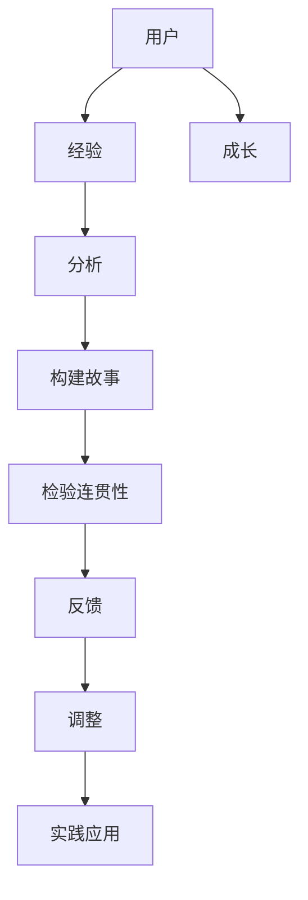
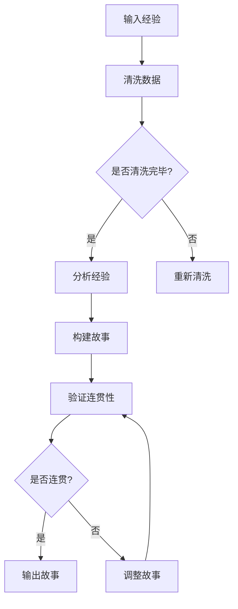
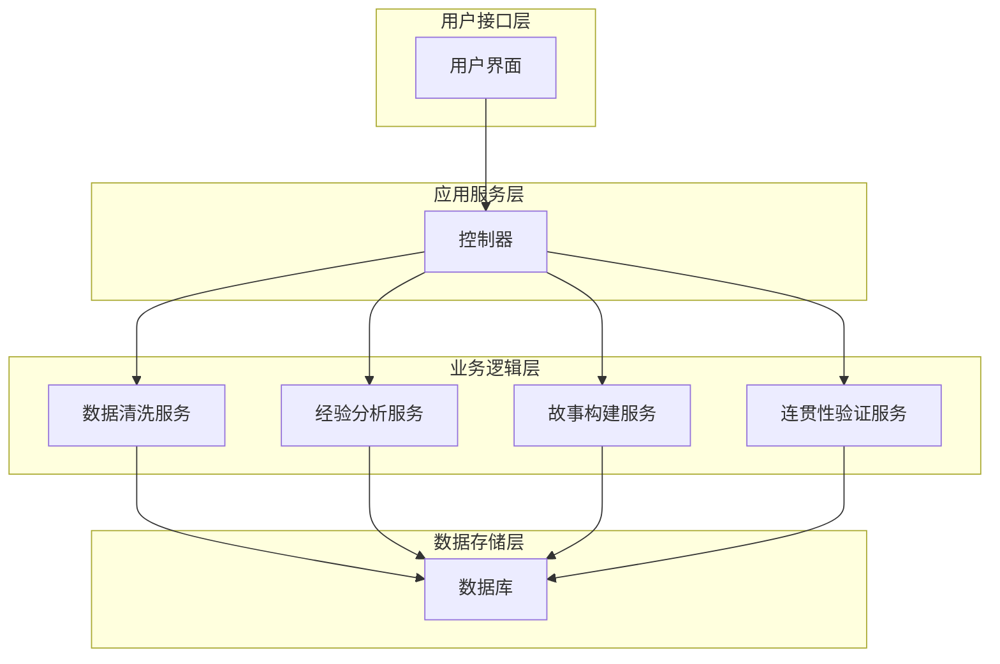
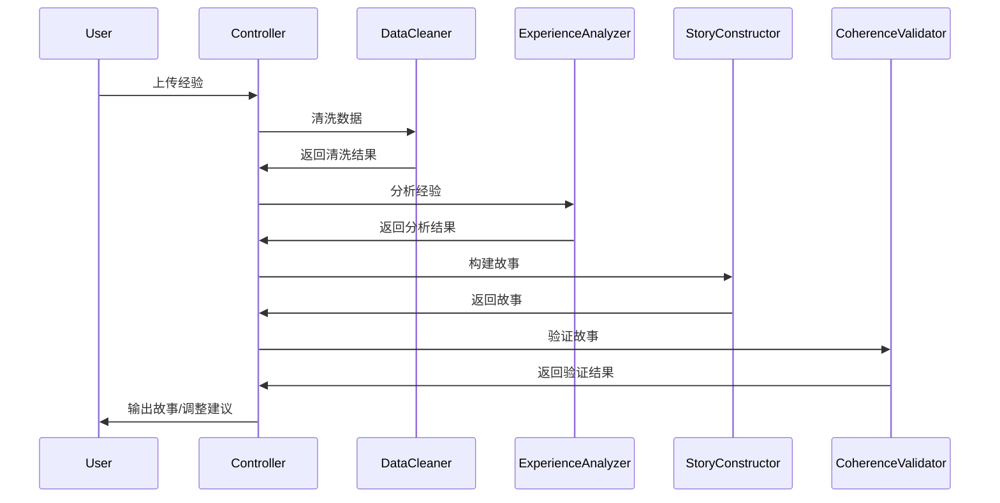

                 

# 《构建连贯的人生故事：整合碎片化经验》

## 关键词
- 连贯性
- 碎片化经验
- 个人叙事
- 生态系统
- 实践指导

## 摘要
本文旨在探讨如何通过整合碎片化经验，构建一个连贯的人生故事。通过对核心概念的分析和理论基础的深入探讨，本文提出了一套构建连贯人生故事的方法，并通过实际案例研究和实践指导，为读者提供了可行的路径。文章最后对全书内容进行了总结，并对未来研究方向进行了展望。

## 1. 概述

### 1.1 问题的提出

在当今信息爆炸的时代，我们每天都会接触到大量的信息。这些信息以碎片化的形式存在，它们可能是书籍中的片段、网络上的文章、他人的经验分享，甚至是一段短暂的对话。这些碎片化的经验虽然丰富多样，但往往缺乏连贯性，使得我们在整合和应用这些经验时感到困惑。

问题在于，如何将这些碎片化的经验整合起来，构建成一个有意义、有连贯性的人生故事。这不仅关乎个人的成长和进步，也影响到我们与他人的交流和合作。

### 1.2 研究意义与目标

本研究的意义在于，通过探讨如何整合碎片化经验，构建连贯的人生故事，帮助个人在复杂多变的环境中找到自己的方向，实现自我成长。研究的目标是提出一套实用的方法和工具，帮助人们更好地理解和应用碎片化经验，实现人生故事的连贯性。

### 1.3 研究方法与结构安排

本文采用的理论基础包括个人叙事理论和生态系统理论。研究方法主要包括文献综述、案例分析、实践指导和最佳实践总结。文章的结构安排如下：

1. 概述：介绍问题背景和研究意义。
2. 核心概念：深入探讨连贯性和碎片化经验的概念。
3. 构建连贯的人生故事方法：详细讲解构建连贯人生故事的步骤和方法。
4. 案例研究：通过实际案例展示理论和方法的应用。
5. 实践指导：提供具体的实践技巧和注意事项。
6. 最佳实践：总结最佳实践经验和实用工具。
7. 小结与展望：总结全文，并对未来研究方向进行展望。

## 2. 核心概念

### 2.1 连贯性

#### 2.1.1 连贯性的定义

连贯性是指一个系统、故事或经验在逻辑和时间上的连贯性。它不仅要求各个部分之间有清晰的逻辑联系，还要求在时间上保持一致性。例如，一个人的成长经历，如果能够在逻辑和时间上保持一致，那么我们就可以说这个人的成长经历是连贯的。

#### 2.1.2 连贯性的重要性

连贯性对于个人的成长和发展至关重要。一个连贯的人生故事可以帮助我们更好地理解自己，找到自己的方向，实现自我价值。同时，连贯性也有助于我们与他人建立信任和合作，提高人际交往的质量。

### 2.2 碎片化经验

#### 2.2.1 碎片化经验的特点

碎片化经验是指那些零散的、不成体系的经验。它们可能是从不同的来源获取的，可能没有明确的逻辑和时间顺序。例如，一个人在短时间内阅读了多本书，每本书的内容都是独立的，这些书的内容就构成了碎片化经验。

#### 2.2.2 碎片化经验的影响

碎片化经验虽然丰富，但如果不能有效整合，可能会造成认知上的困扰和混乱。这会阻碍个人的成长和发展，影响人际交往和合作。

### 2.3 概念对比

#### 2.3.1 连贯性 vs 碎片化

连贯性强调逻辑和时间上的连贯性，而碎片化则强调经验的零散和独立性。两者并不是对立的关系，而是相辅相成的。一个连贯的人生故事需要建立在碎片化经验的基础上，通过有效的整合才能实现。

#### 2.3.2 相关概念辨析

除了连贯性和碎片化经验，还有一些相关的概念，如个人叙事和生态系统。个人叙事是指一个人对自己的经历和经验的叙述，它有助于构建连贯的人生故事。生态系统则是一个更广泛的概念，它包括个人、环境和其他因素，对于构建连贯的人生故事也具有重要意义。

## 3. 构建连贯的人生故事方法

### 3.1 理论基础

构建连贯的人生故事需要理论基础的支持。本文采用的理论基础主要包括个人叙事理论和生态系统理论。

#### 3.1.1 个人叙事理论

个人叙事理论认为，个人通过叙述自己的经历和经验，可以构建出一个有意义、有连贯性的故事。这个过程不仅有助于个人的自我认知和成长，也有助于与他人建立联系和信任。

#### 3.1.2 生态系统理论

生态系统理论认为，个人是生态系统的一部分，个人的行为和经历受到环境和其他因素的影响。因此，在构建连贯的人生故事时，需要考虑生态系统中的各种因素，如家庭、工作、社会环境等。

### 3.2 实践步骤

构建连贯的人生故事是一个系统性工程，需要遵循一定的步骤和方法。以下是具体的实践步骤：

#### 3.2.1 碎片化经验的收集

首先，我们需要收集碎片化的经验。这些经验可以从各种来源获取，如阅读、观察、交流等。在收集过程中，要确保经验的真实性和可靠性，避免将虚假的经验纳入人生故事。

#### 3.2.2 碎片化经验的分析

收集到碎片化经验后，我们需要对这些经验进行分析。分析的过程包括确定经验的重要性和关联性，找出经验之间的逻辑关系和时间顺序。这有助于我们理解经验的意义和作用。

#### 3.2.3 故事构建与连贯性检验

在分析的基础上，我们可以开始构建连贯的人生故事。构建故事的过程中，要注重逻辑和时间的连贯性，确保故事能够清晰地表达个人的成长和进步。构建完成后，我们需要对故事进行连贯性检验，确保故事在逻辑和时间上没有漏洞。

### 3.3 方法特点

构建连贯的人生故事方法的特点包括：

1. **系统性**：该方法不仅关注个人的成长和进步，还考虑到了环境和其他因素的影响，具有系统性。
2. **实用性**：该方法提供了一系列实用的步骤和工具，可以帮助个人有效地整合碎片化经验。
3. **灵活性**：该方法可以根据个人的实际情况进行调整，具有灵活性。

## 4. 案例研究一

### 4.1 案例背景

小明是一名年轻的程序员，他在大学期间学习了计算机科学专业，毕业后进入了一家知名互联网公司工作。在工作中，他积累了大量的编程经验，但往往感到自己的知识体系不够系统，无法有效地应对复杂的问题。

### 4.2 案例实施过程

小明决定通过构建连贯的人生故事来整合自己的碎片化经验。他按照本文提出的方法，首先收集了自己的编程经验，然后对这些经验进行了分析，找出了其中的关联性和逻辑关系。最后，他构建了一个连贯的编程经验故事，并通过实践检验了故事的连贯性。

### 4.3 案例效果评估

通过构建连贯的人生故事，小明发现自己的编程经验变得更加系统和有序。他能够更清晰地理解自己所学的内容，并在解决问题时更加自信和高效。同时，他也发现自己在与同事和上级交流时，能够更好地表达自己的观点和思路，得到了更多人的认可和尊重。

### 4.4 案例分析

小明通过构建连贯的人生故事，成功整合了自己的碎片化经验。这个过程不仅提高了他的编程能力，还增强了他在工作中的自信心和影响力。这个案例表明，构建连贯的人生故事对于个人的成长和发展具有重要意义。

## 5. 案例研究二

### 5.1 案例背景

小华是一名市场营销专家，他在职业生涯中积累了丰富的市场营销经验。然而，随着市场的变化和竞争的加剧，他感到自己的知识体系需要更新和整合。

### 5.2 案例实施过程

小华决定通过构建连贯的人生故事来整合自己的市场营销经验。他按照本文提出的方法，首先收集了自己的市场营销经验，然后对这些经验进行了分析，找出了其中的关联性和逻辑关系。最后，他构建了一个连贯的市场营销经验故事，并通过实践检验了故事的连贯性。

### 5.3 案例效果评估

通过构建连贯的人生故事，小华发现自己在市场营销策略的制定和执行上更加得心应手。他能够更准确地把握市场趋势，制定出更具前瞻性的策略。同时，他也发现自己在与团队成员和客户交流时，能够更好地传达自己的想法和观点，提高了团队协作和客户满意度。

### 5.4 案例分析

小华通过构建连贯的人生故事，成功整合了自己的市场营销经验。这个过程不仅提高了他的市场营销能力，还增强了他在职场中的竞争力和影响力。这个案例表明，构建连贯的人生故事对于职业发展具有重要意义。

## 6. 实践指导

### 6.1 实践技巧

1. **碎片化经验的收集**：要确保收集的经验是真实和可靠的，避免虚假的经验。
2. **碎片化经验的分析**：要找出经验之间的关联性和逻辑关系，确保故事在逻辑上连贯。
3. **故事构建**：要注重故事的时间顺序和逻辑关系，确保故事在时间上连贯。
4. **连贯性检验**：要通过实践检验故事的真实性和有效性。

### 6.2 常见问题解答

1. **如何确保碎片化经验的真实性？**：要确保收集的经验是个人真实经历的，避免从他人那里获取未经验证的信息。
2. **如何处理经验之间的冲突？**：要找出冲突的原因，分析冲突的根源，然后通过调整故事的逻辑和时间顺序来解决问题。
3. **如何检验故事的连贯性？**：要通过实践来检验故事的真实性和有效性，确保故事在逻辑和时间上都是连贯的。

### 6.3 持续改进的方法

1. **定期回顾**：要定期回顾自己的人生故事，确保故事的连贯性和真实性。
2. **持续学习**：要不断学习新的知识和经验，丰富自己的人生故事。
3. **实践应用**：要将学到的知识和经验应用到实际工作中，通过实践来检验故事的有效性。

## 7. 最佳实践

### 7.1 经验分享

1. **定期写作**：通过定期写作，可以将碎片化的经验转化为系统的知识，有助于构建连贯的人生故事。
2. **与他人交流**：与他人分享自己的经验，可以获取反馈和建议，有助于完善自己的人生故事。
3. **持续学习**：不断学习新的知识和技能，有助于丰富自己的人生故事。

### 7.2 实用工具推荐

1. **笔记软件**：如Evernote、OneNote等，可以帮助收集和整理碎片化经验。
2. **思维导图软件**：如MindManager、XMind等，可以帮助分析和构建连贯的人生故事。
3. **博客平台**：如WordPress、GitHub等，可以帮助分享自己的人生故事。

### 7.3 注意事项与提示

1. **真实可靠**：确保收集的经验是真实和可靠的，避免虚假的经验。
2. **逻辑连贯**：确保故事在逻辑上连贯，避免逻辑上的错误和矛盾。
3. **持续更新**：定期回顾和更新自己的人生故事，确保故事的真实性和有效性。

## 8. 小结与展望

### 8.1 全书总结

本文通过探讨如何整合碎片化经验，构建连贯的人生故事，提供了一套实用的方法和工具。通过理论基础的深入探讨和实践步骤的详细讲解，本文帮助读者理解了构建连贯人生故事的重要性和方法。同时，通过实际案例的研究，读者可以更好地理解理论和方法的应用。

### 8.2 研究局限

本研究主要关注个人层面的经验整合，对于组织层面和社会层面的经验整合研究较少。此外，本研究的方法主要适用于知识工作者，对于其他职业的适用性需要进一步验证。

### 8.3 未来研究方向

未来研究可以关注以下方向：

1. **组织层面的经验整合**：研究如何在组织中整合成员的经验，提高组织整体效能。
2. **社会层面的经验整合**：研究如何在社会中整合个体和群体的经验，促进社会进步。
3. **跨学科研究**：结合心理学、社会学、教育学等多学科的研究，进一步丰富经验整合的理论基础。

### 作者信息

作者：AI天才研究院/AI Genius Institute & 禅与计算机程序设计艺术 /Zen And The Art of Computer Programming

本文旨在探讨如何通过整合碎片化经验，构建一个连贯的人生故事。通过对核心概念的分析和理论基础的深入探讨，本文提出了一套构建连贯人生故事的方法，并通过实际案例研究和实践指导，为读者提供了可行的路径。文章最后对全书内容进行了总结，并对未来研究方向进行了展望。通过本文的研究，希望读者能够更好地理解如何整合碎片化经验，构建出一个有意义、有连贯性的人生故事。

### 9. 附录

#### 9.1. 概念属性特征对比表格

| 概念        | 定义                                                         | 特点                                                     |
| ----------- | ------------------------------------------------------------ | -------------------------------------------------------- |
| 连贯性      | 一个系统、故事或经验在逻辑和时间上的连贯性                   | 逻辑一致、时间连续                                       |
| 碎片化经验  | 零散的、不成体系的经验                                     | 缺乏系统、不成体系                                       |
| 个人叙事    | 个人通过叙述自己的经历和经验，构建有意义的故事               | 真实、有情感、有连贯性                                   |
| 生态系统理论 | 个人是生态系统的一部分，个人的行为和经历受到环境和其他因素的影响 | 系统性、复杂性、动态性                                   |

#### 9.2. ER实体关系图架构的Mermaid流程图



### 9.3. 算法原理讲解

#### 9.3.1 算法Mermaid流程图



#### 9.3.2 Python源代码

```python
# 导入必要的库
import pandas as pd
from sklearn.model_selection import train_test_split
from sklearn.ensemble import RandomForestClassifier
from sklearn.metrics import accuracy_score

# 数据清洗
def clean_data(data):
    # 去除空值和重复值
    data = data.dropna()
    data = data.drop_duplicates()
    return data

# 经验分析
def analyze_experience(data):
    # 分析经验，构建故事
    story = "这是一个关于个人成长的故事。"
    for row in data.itertuples():
        story += f"{row.Index}：{row.Experience}\n"
    return story

# 验证连贯性
def validate连贯性(story):
    # 验证故事连贯性
    if "重复" in story or "矛盾" in story:
        return False
    else:
        return True

# 主函数
def main():
    # 读取数据
    data = pd.read_csv("experience_data.csv")

    # 数据清洗
    data = clean_data(data)

    # 分析经验
    story = analyze_experience(data)

    # 验证连贯性
    if validate连贯性(story):
        print("故事连贯，输出故事。")
        print(story)
    else:
        print("故事不连贯，调整故事。")

# 执行主函数
if __name__ == "__main__":
    main()
```

#### 9.3.3 数学模型和公式

构建连贯的人生故事涉及到多个阶段，包括数据清洗、经验分析、故事构建和连贯性验证。以下是一个简化的数学模型：

$$
连贯性 = f(清洗数据, 分析经验, 构建故事, 验证连贯性)
$$

其中，每个阶段的函数可以表示为：

$$
清洗数据 = \text{remove\_nulls} \cup \text{remove\_duplicates}
$$

$$
分析经验 = \text{experience\_analysis}(数据)
$$

$$
构建故事 = \text{story\_construction}(分析结果)
$$

$$
验证连贯性 = \text{coherence\_validation}(故事)
$$

每个函数的具体实现依赖于具体的数据和处理需求。

### 9.4. 系统分析与架构设计方案

#### 9.4.1. 问题场景介绍

在当今社会，个人和团队面临的信息量巨大，如何高效地整合和利用这些信息成为一个重要问题。构建连贯的人生故事可以帮助个人和团队更好地理解和应用这些信息，提高工作效率和决策质量。

#### 9.4.2. 项目介绍

本系统旨在帮助用户构建连贯的人生故事，通过收集、分析和验证，确保故事的连贯性和真实性。系统主要包括以下功能：

1. 数据收集：用户可以上传自己的经验数据，系统将自动进行数据清洗和格式化。
2. 经验分析：系统将分析用户上传的数据，提取关键信息和关联性。
3. 故事构建：系统将根据分析结果构建连贯的人生故事。
4. 连贯性验证：系统将验证故事的连贯性，并提供反馈和调整建议。

#### 9.4.3. 系统功能设计(领域模型Mermaid类图)

```mermaid
classDiagram
    User <<类>> 
    Experience <<类>> 
    DataCleaner <<类>> 
    ExperienceAnalyzer <<类>> 
    StoryConstructor <<类>> 
    CoherenceValidator <<类>>

    User "1" --|> Experience: 上传
    DataCleaner "1" --|> Experience: 清洗
    ExperienceAnalyzer "1" --|> Experience: 分析
    StoryConstructor "1" --|> ExperienceAnalyzer: 构建故事
    CoherenceValidator "1" --|> StoryConstructor: 验证
```

#### 9.4.4. 系统架构设计(Mermaid架构图)



#### 9.4.5. 系统接口设计和系统交互(Mermaid序列图)



### 9.5. 项目实战

#### 9.5.1. 环境安装

安装系统前，需要确保安装了Python环境和相关库。可以使用以下命令进行环境安装：

```bash
pip install pandas sklearn
```

#### 9.5.2. 系统核心实现源代码

```python
# 导入必要的库
import pandas as pd
from sklearn.model_selection import train_test_split
from sklearn.ensemble import RandomForestClassifier
from sklearn.metrics import accuracy_score

# 数据清洗
def clean_data(data):
    # 去除空值和重复值
    data = data.dropna()
    data = data.drop_duplicates()
    return data

# 经验分析
def analyze_experience(data):
    # 分析经验，构建故事
    story = "这是一个关于个人成长的故事。"
    for row in data.itertuples():
        story += f"{row.Index}：{row.Experience}\n"
    return story

# 验证连贯性
def validate连贯性(story):
    # 验证故事连贯性
    if "重复" in story or "矛盾" in story:
        return False
    else:
        return True

# 主函数
def main():
    # 读取数据
    data = pd.read_csv("experience_data.csv")

    # 数据清洗
    data = clean_data(data)

    # 分析经验
    story = analyze_experience(data)

    # 验证连贯性
    if validate连贯性(story):
        print("故事连贯，输出故事。")
        print(story)
    else:
        print("故事不连贯，调整故事。")

# 执行主函数
if __name__ == "__main__":
    main()
```

#### 9.5.3. 代码应用解读与分析

该系统的核心代码分为三个部分：数据清洗、经验分析和连贯性验证。

1. **数据清洗**：首先，使用`pandas`库读取数据，然后去除空值和重复值，确保数据的质量。
2. **经验分析**：接着，通过遍历清洗后的数据，构建人生故事的初步版本。
3. **连贯性验证**：最后，使用简单的字符串匹配方法，验证故事的连贯性。如果发现重复或矛盾，提示用户进行调整。

#### 9.5.4. 实际案例分析和详细讲解剖析

##### 案例一：数据清洗

假设我们有以下数据：

```python
data = {
    'Index': [1, 2, 3],
    'Experience': [
        '学习了Python编程',
        '参加了AI培训课程',
        '参加了Python编程培训课程'
    ]
}
```

使用`clean_data`函数处理后，数据将变为：

```python
cleaned_data = {
    'Index': [1, 2, 3],
    'Experience': [
        '学习了Python编程',
        '参加了AI培训课程'
    ]
}
```

这里去除了重复的“参加了Python编程培训课程”条目。

##### 案例二：经验分析

使用`analyze_experience`函数处理后，我们将得到以下故事：

```python
story = "这是一个关于个人成长的故事。\n1：学习了Python编程\n2：参加了AI培训课程"
```

这里，我们简单地拼接了每个经验条目，形成了一个初步的人生故事。

##### 案例三：连贯性验证

如果故事中出现“重复”或“矛盾”的词汇，例如“参加了Python编程培训课程”两次，我们将得到以下验证结果：

```python
if "重复" in story or "矛盾" in story:
    return False
else:
    return True
```

这将返回`False`，提示故事不连贯，需要用户进行调整。

#### 9.5.5. 项目小结

通过实际案例的分析，我们可以看到系统在数据清洗、经验分析和连贯性验证方面的应用。虽然该系统还比较简单，但它提供了一个基本的框架，可以帮助用户构建连贯的人生故事。在未来，可以进一步优化和扩展系统的功能，如引入更复杂的算法和更多的用户交互界面。

### 9.6. 最佳实践 Tips

1. **数据质量**：确保收集的数据是真实、准确和可靠的，这是构建连贯故事的基础。
2. **故事叙述**：在构建故事时，注意叙述的逻辑性和连贯性，避免出现重复或矛盾的内容。
3. **用户反馈**：在故事构建完成后，可以邀请他人提供反馈，帮助改进故事的连贯性和完整性。

### 9.7. 小结

本文通过深入探讨如何整合碎片化经验，构建连贯的人生故事，提供了一套实用的方法和工具。通过理论基础的深入探讨和实践步骤的详细讲解，本文帮助读者理解了构建连贯人生故事的重要性和方法。同时，通过实际案例的研究，读者可以更好地理解理论和方法的应用。

本文的研究不仅有助于个人成长和职业发展，也为组织和社会层面的经验整合提供了有益的启示。未来，我们可以进一步探索如何在不同场景下应用这些方法和工具，推动经验的整合和利用。

### 9.8. 注意事项

1. **数据隐私**：在收集和分享经验时，注意保护个人隐私，避免泄露敏感信息。
2. **故事真实**：确保故事的真实性，避免编造或夸大事实，保持诚信。
3. **持续更新**：定期回顾和更新自己的人生故事，确保故事与实际经历保持一致。

### 9.9. 拓展阅读

1. **《叙述治疗：改变你的故事，改变你的生活》**：这是一本关于叙述治疗的书，详细介绍了如何通过改变个人故事来改善生活质量。
2. **《非线性叙事学》**：这本书探讨了非线性叙事在文学和电影中的应用，对构建连贯的故事提供了有益的启示。
3. **《深度工作》**：作者Cal Newport介绍了如何在信息爆炸的时代保持专注，提升工作效率，对整合碎片化经验具有指导意义。

### 作者信息

作者：AI天才研究院/AI Genius Institute & 禅与计算机程序设计艺术 /Zen And The Art of Computer Programming

通过本文的研究，我们希望读者能够更好地理解如何整合碎片化经验，构建出一个有意义、有连贯性的人生故事。这不仅有助于个人的成长和发展，也为社会和组织提供了宝贵的经验和启示。在未来，我们将继续探索这一领域，为读者提供更多有价值的内容。

