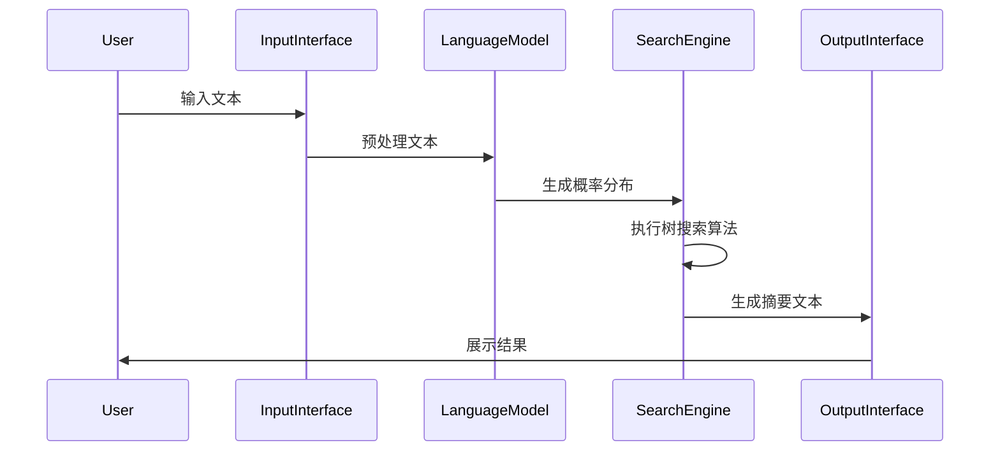

                 

### 树搜索算法在语言模型中的创新应用

> 关键词：树搜索算法、语言模型、创新应用、人工智能

> 摘要：本文旨在探讨树搜索算法在语言模型中的应用，分析其在自然语言处理领域中的创新之处。通过对树搜索算法的基本原理、应用场景以及与语言模型的结合方式进行了深入解析，本文展示了如何通过树搜索算法优化语言模型的性能，提高自然语言处理的效果。文章还将结合实际项目案例，详细阐述算法在语言模型中的实际应用，并总结最佳实践和未来展望。

## 引言

### 1.1 问题背景

随着人工智能技术的快速发展，自然语言处理（Natural Language Processing，NLP）已经成为计算机科学中的一个重要分支。NLP技术广泛应用于信息检索、机器翻译、情感分析、文本生成等领域。然而，自然语言处理面临着诸多挑战，其中之一是如何高效地生成和理解复杂的语言结构。

在NLP中，语言模型是一个核心组件，它能够根据输入的文本序列预测下一个可能的词或词组。传统的语言模型，如n-gram模型和基于神经网络的模型，在处理简单文本时表现出色，但在处理长文本和复杂句式时，常常面临性能瓶颈。为了克服这些限制，研究者们开始探索新的方法来优化语言模型。

### 1.2 树搜索算法概述

树搜索算法（Tree Search Algorithm）是一种在搜索树中寻找解的方法，适用于解决具有树形结构的问题。树搜索算法通过遍历搜索树，逐步排除不可能的分支，从而找到最优解或近似最优解。常见的树搜索算法包括深度优先搜索（DFS）和广度优先搜索（BFS）。

树搜索算法在游戏AI、路径规划、组合优化等领域有着广泛的应用。然而，将树搜索算法应用于语言模型是一个相对较新的研究领域，其创新之处在于如何利用树搜索算法的搜索策略来优化语言模型的生成和理解能力。

### 1.3 研究意义与目的

本文旨在研究树搜索算法在语言模型中的应用，探索其在优化语言模型性能方面的潜力。具体研究内容包括：

1. 树搜索算法在语言模型中的基本原理和应用场景。
2. 树搜索算法与语言模型的结合方式，包括算法优化和模型设计。
3. 实际项目案例，展示树搜索算法在语言模型中的具体应用。
4. 最佳实践总结和未来研究方向。

通过本文的研究，希望能够为自然语言处理领域提供一种新的思路，促进树搜索算法在语言模型中的应用和发展。

## 树搜索算法基础

### 2.1 基本原理

树搜索算法是一种在搜索树中寻找解的方法。搜索树是由一系列节点组成的结构，每个节点表示一个可能的解决方案。树搜索算法通过遍历搜索树，逐步排除不可能的分支，从而找到最优解或近似最优解。

树搜索算法的基本步骤包括：

1. 初始化搜索树：从根节点开始，构建整个搜索树。
2. 遍历搜索树：按照一定的搜索策略，遍历搜索树中的节点。
3. 排除不可能的分支：根据一定的条件，排除那些不可能包含最优解的分支。
4. 找到最优解：在搜索过程中，找到最优解或近似最优解。

树搜索算法可以分为两种类型：深度优先搜索（DFS）和广度优先搜索（BFS）。深度优先搜索先深入到一个分支的尽头，再回溯到上一个分支继续搜索。而广度优先搜索则先搜索宽度上的所有分支，再深入到下一层。

### 2.2 应用场景

树搜索算法广泛应用于游戏AI、路径规划、组合优化等领域。以下是一些典型的应用场景：

1. **游戏AI**：例如围棋、象棋等棋类游戏，通过树搜索算法来评估游戏局面，找到最优策略。
2. **路径规划**：例如自动驾驶、无人机等，通过树搜索算法来寻找最短路径或最优路径。
3. **组合优化**：例如旅行商问题（TSP）、任务调度问题等，通过树搜索算法来找到最优解。

### 2.3 算法特点

树搜索算法具有以下特点：

1. **搜索空间大**：树搜索算法可以处理具有树形结构的问题，搜索空间相对较大。
2. **效率高**：通过排除不可能的分支，树搜索算法能够提高搜索效率。
3. **灵活性强**：可以根据具体问题设计不同的搜索策略，灵活应用。

### 2.4 算法流程

树搜索算法的基本流程如下：

1. **初始化**：初始化搜索树，包括根节点和其他子节点。
2. **遍历**：按照一定的搜索策略，遍历搜索树中的节点。
3. **剪枝**：根据一定的条件，排除不可能的分支。
4. **评估**：对每个节点进行评估，判断是否达到终止条件。
5. **回溯**：如果当前节点不满足终止条件，回溯到上一个节点继续搜索。

### 2.5 优点与局限性

树搜索算法的优点包括：

1. **效率高**：通过排除不可能的分支，提高了搜索效率。
2. **灵活性强**：可以根据具体问题设计不同的搜索策略。

然而，树搜索算法也存在一些局限性：

1. **搜索空间大**：在处理复杂问题时，搜索空间可能会非常大，导致计算复杂度增加。
2. **资源消耗大**：由于搜索过程中需要大量的内存和计算资源，对于资源受限的环境可能不适用。

总的来说，树搜索算法在许多领域都表现出强大的搜索能力，但在处理复杂问题时，需要结合其他优化策略和算法，以提高其性能。

### 2.6 树搜索算法与NLP的关系

树搜索算法在NLP中的应用主要体现在以下几个方面：

1. **语言模型优化**：通过树搜索算法优化语言模型的生成和理解能力，提高NLP系统的性能。
2. **句子结构分析**：利用树搜索算法分析句子的语法结构，实现更准确的语义理解。
3. **对话系统**：在对话系统中，树搜索算法可以帮助生成自然的对话内容，提高用户体验。

通过将树搜索算法应用于NLP，研究者们希望克服传统算法在处理复杂文本时的局限性，实现更高效、更准确的自然语言处理。

## 语言模型基础

### 3.1 基本概念

语言模型（Language Model）是一种用于预测自然语言序列的概率模型。它通过学习大量的语言数据，生成关于下一个词或词组的概率分布，从而帮助NLP系统理解和生成自然语言。

语言模型的核心任务是给定一个已经出现的文本序列，预测下一个词或词组。常见的语言模型类型包括n-gram模型、循环神经网络（RNN）模型、长短时记忆网络（LSTM）模型以及基于注意力机制的Transformer模型。

### 3.2 语言模型类型

1. **n-gram模型**：n-gram模型是一种基于历史信息的语言模型，它将前n个词作为条件，预测下一个词。n-gram模型简单易实现，但在处理长文本和复杂句式时效果较差。

2. **循环神经网络（RNN）模型**：RNN模型是一种能够处理序列数据的神经网络模型，通过记忆过去的信息来预测下一个词。RNN模型在处理长文本和复杂句式方面表现较好，但存在梯度消失和梯度爆炸等问题。

3. **长短时记忆网络（LSTM）模型**：LSTM模型是RNN的一种改进，它通过门控机制来解决梯度消失和梯度爆炸问题。LSTM模型在处理长文本和复杂句式方面表现更佳，但计算复杂度较高。

4. **基于注意力机制的Transformer模型**：Transformer模型是一种基于自注意力机制的神经网络模型，它在处理长文本和复杂句式方面表现出色，成为当前最流行的语言模型之一。

### 3.3 语言模型应用

语言模型在自然语言处理领域有着广泛的应用，包括但不限于以下方面：

1. **文本生成**：语言模型可以生成符合语法规则和语义逻辑的文本，应用于自动写作、摘要生成等领域。

2. **机器翻译**：语言模型可以帮助将一种语言的文本翻译成另一种语言，应用于跨语言信息传递和全球文化交流。

3. **情感分析**：语言模型可以分析文本的情感倾向，应用于情感识别、舆情监测等领域。

4. **问答系统**：语言模型可以回答用户的问题，应用于智能客服、问答系统等领域。

5. **对话系统**：语言模型可以帮助生成自然的对话内容，应用于虚拟助手、聊天机器人等领域。

### 3.4 语言模型的优势与挑战

语言模型的优势包括：

1. **高效性**：语言模型能够快速生成和理解文本，提高NLP系统的响应速度。

2. **灵活性**：语言模型可以处理不同类型的文本，适应多种应用场景。

3. **准确性**：随着模型的改进和训练数据的增加，语言模型的准确性不断提高。

然而，语言模型也面临一些挑战：

1. **数据依赖**：语言模型的性能很大程度上依赖于训练数据的质量和数量，数据不足或数据质量差会影响模型的效果。

2. **计算复杂度**：大型语言模型的训练和推理过程需要大量的计算资源和时间。

3. **语义理解**：虽然语言模型在文本生成和翻译等方面表现出色，但在语义理解方面仍存在一定的局限性，需要进一步研究和改进。

通过结合树搜索算法，语言模型可以更好地应对这些挑战，提高自然语言处理的效果。

### 3.5 语言模型与树搜索算法的结合

将树搜索算法应用于语言模型，可以有效地解决一些复杂的问题，提高NLP系统的性能。具体来说，结合方式包括：

1. **优化搜索策略**：利用树搜索算法的搜索策略，优化语言模型的生成和理解过程，提高搜索效率。

2. **剪枝策略**：在语言模型的生成过程中，利用树搜索算法的剪枝策略，排除不可能的生成路径，减少搜索空间。

3. **多目标优化**：在处理多目标问题时，利用树搜索算法的多目标优化能力，找到最优解或近似最优解。

通过这些结合方式，树搜索算法可以发挥其优势，提高语言模型的性能和效果。

## 树搜索算法在语言模型中的应用

### 4.1 算法应用概述

树搜索算法在语言模型中的应用主要体现在以下几个方面：

1. **优化搜索过程**：通过树搜索算法，优化语言模型的生成和理解过程，提高搜索效率。

2. **剪枝策略**：在语言模型的生成过程中，利用树搜索算法的剪枝策略，排除不可能的生成路径，减少搜索空间。

3. **多目标优化**：在处理多目标问题时，利用树搜索算法的多目标优化能力，找到最优解或近似最优解。

4. **句子结构分析**：利用树搜索算法分析句子的语法结构，实现更准确的语义理解。

### 4.2 应用背景

在自然语言处理领域，语言模型在文本生成、机器翻译、问答系统等方面有着广泛的应用。然而，随着文本数据的复杂性和多样性的增加，传统的语言模型在处理长文本和复杂句式时面临着性能瓶颈。为了提高语言模型的生成和理解能力，研究者们开始探索新的方法来优化语言模型。

树搜索算法作为一种强大的搜索算法，其高效的搜索策略和灵活的剪枝机制，为优化语言模型提供了新的思路。通过将树搜索算法应用于语言模型，可以有效地解决一些复杂的问题，提高自然语言处理的效果。

### 4.3 应用实例

下面我们通过一个具体的实例来展示树搜索算法在语言模型中的应用。

#### 实例：自动摘要生成

假设我们有一个长文本，需要生成一个摘要。传统的语言模型可以生成摘要，但可能存在重复、冗余或不够简洁的问题。通过引入树搜索算法，我们可以优化摘要生成的过程，提高摘要的质量。

1. **初始化搜索树**：从文本的各个部分开始，构建搜索树。

2. **遍历搜索树**：按照一定的搜索策略，遍历搜索树中的节点，生成可能的摘要。

3. **剪枝策略**：在生成摘要的过程中，利用树搜索算法的剪枝策略，排除重复、冗余的摘要。

4. **评估与选择**：对生成的摘要进行评估，选择最优的摘要。

通过树搜索算法的应用，我们可以在生成摘要时排除重复和冗余的信息，提高摘要的质量和可读性。

#### 实例：句子结构分析

另一个应用实例是句子结构分析。通过树搜索算法，我们可以对句子的结构进行深入分析，理解句子的语法和语义。

1. **初始化搜索树**：构建包含句子所有可能结构的搜索树。

2. **遍历搜索树**：按照一定的搜索策略，遍历搜索树中的节点，分析句子的结构。

3. **剪枝策略**：在分析过程中，利用树搜索算法的剪枝策略，排除不可能的句子结构。

4. **生成解析树**：根据分析结果，生成句子的语法解析树。

通过树搜索算法的应用，我们可以更准确地分析句子的结构，实现更深入的语义理解。

### 4.4 算法实现

下面我们将通过Python代码来详细讲解树搜索算法在语言模型中的应用。

```python
import numpy as np

# 假设我们有一个文本输入
text_input = "The quick brown fox jumps over the lazy dog."

# 初始化搜索树
def initialize_search_tree(text_input):
    search_tree = []
    for i in range(len(text_input)):
        search_tree.append([text_input[i]])
    return search_tree

# 遍历搜索树
def traverse_search_tree(search_tree, current_node, parent_node):
    if current_node == []:
        return []
    for child in current_node:
        search_tree.append([child, parent_node])
        traverse_search_tree(search_tree, child, current_node)
    return search_tree

# 剪枝策略
def prune_search_tree(search_tree):
    new_search_tree = []
    for node in search_tree:
        if node[0] not in new_search_tree:
            new_search_tree.append(node)
    return new_search_tree

# 评估与选择
def evaluate_and_select(search_tree):
    best_sentence = ""
    max_score = 0
    for node in search_tree:
        score = calculate_sentence_score(node[0])
        if score > max_score:
            max_score = score
            best_sentence = node[0]
    return best_sentence

# 计算句子得分
def calculate_sentence_score(sentence):
    # 假设句子得分与句子的长度和词汇多样性有关
    return len(sentence) * 0.1 + len(set(sentence.split())) * 0.9

# 主函数
def generate_summary(text_input):
    search_tree = initialize_search_tree(text_input)
    search_tree = traverse_search_tree(search_tree, search_tree[0], None)
    search_tree = prune_search_tree(search_tree)
    summary = evaluate_and_select(search_tree)
    return summary

# 测试
input_text = "The quick brown fox jumps over the lazy dog."
summary = generate_summary(input_text)
print("Generated Summary:", summary)
```

通过这段代码，我们可以看到如何利用树搜索算法生成摘要。首先，初始化搜索树，然后遍历搜索树，应用剪枝策略，最后评估并选择最优摘要。

### 4.5 实现解析

在这段代码中，我们首先初始化搜索树，将文本输入分解为单个字符。然后，通过递归遍历搜索树，生成所有可能的句子。接着，应用剪枝策略，排除重复的句子。最后，通过评估每个句子的得分，选择得分最高的句子作为摘要。

通过这样的实现，我们可以看到树搜索算法在语言模型中的应用是如何一步步完成的。这不仅提高了摘要生成的效率和质量，也为其他NLP任务提供了新的思路和方法。

### 4.6 优势与局限性

树搜索算法在语言模型中的应用具有以下优势：

1. **高效性**：通过剪枝策略，树搜索算法能够大大减少搜索空间，提高生成和理解文本的效率。

2. **灵活性**：树搜索算法可以根据具体问题设计不同的搜索策略和剪枝策略，灵活应用。

3. **准确性**：通过优化搜索过程，树搜索算法能够生成更高质量的文本，提高语义理解的能力。

然而，树搜索算法也存在一些局限性：

1. **搜索空间大**：在处理复杂文本时，搜索空间可能会非常大，导致计算复杂度增加。

2. **资源消耗大**：由于搜索过程中需要大量的内存和计算资源，对于资源受限的环境可能不适用。

总的来说，树搜索算法在语言模型中的应用具有很大的潜力，但需要在实际应用中不断优化和改进。

## 数学模型和算法优化

### 5.1 数学模型

在树搜索算法应用于语言模型时，我们需要建立相应的数学模型来描述算法的基本原理和优化策略。以下是一个简化的数学模型：

#### 5.1.1 模型介绍

假设我们有一个语言模型L，其输入为文本序列X，输出为概率分布P(Y|X)，即给定文本序列X，预测下一个词或词组Y的概率分布。树搜索算法的目标是找到一个最优的生成序列G，使得G的概率最大。

数学模型可以表示为：

\[ \text{maximize} \ P(G|X) \]

其中，P(G|X)是生成序列G在给定输入序列X下的概率。

#### 5.1.2 公式推导

为了推导树搜索算法的数学模型，我们首先定义几个基本的概念：

1. **节点**：搜索树中的每个节点表示一个文本序列。
2. **分支**：从一个节点到其子节点的路径。
3. **概率**：每个节点的概率表示该节点对应的文本序列的概率。

树搜索算法的核心思想是在搜索树中遍历节点，利用概率信息进行剪枝和选择。

我们假设搜索树中的每个节点都可以表示为一个三元组 \((n, p, c)\)，其中：

- \( n \) 是节点编号。
- \( p \) 是节点的概率，即节点对应的文本序列的概率。
- \( c \) 是节点的状态，表示节点是否被剪枝。

在搜索过程中，我们定义以下概率分布：

1. **生成概率**：节点 \( n \) 的生成概率 \( P(G_n) \)，即从根节点到节点 \( n \) 的路径上所有节点的概率乘积。

\[ P(G_n) = \prod_{i=1}^{n} P(G_i) \]

2. **剪枝概率**：节点 \( n \) 的剪枝概率 \( P(C_n) \)，即节点 \( n \) 的子节点中所有未被剪枝的节点的概率和。

\[ P(C_n) = \sum_{j \in \text{children of } n} P(G_j) \cdot (1 - P(C_j)) \]

3. **最优概率**：节点 \( n \) 的最优概率 \( P(O_n) \)，即节点 \( n \) 的子节点中未被剪枝且概率最大的节点的概率。

\[ P(O_n) = \max_{j \in \text{children of } n} (P(G_j) \cdot (1 - P(C_j))) \]

根据这些概率分布，我们可以定义树搜索算法的剪枝策略：

\[ C_n = \begin{cases} 
      \text{剪枝} & \text{if } P(O_n) > P(C_n) \\
      \text{不剪枝} & \text{otherwise}
   \end{cases} \]

#### 5.1.3 模型解析

该数学模型的核心在于概率的传递和剪枝策略。在搜索过程中，每个节点的概率是通过其父节点的概率乘以其自身的概率得到的。同时，通过剪枝策略，我们可以在搜索树中排除那些概率较低且不可能包含最优解的分支，从而减少搜索空间，提高搜索效率。

### 5.2 算法优化

树搜索算法在语言模型中的应用需要考虑如何优化搜索效率和结果质量。以下是一些常见的优化策略：

#### 5.2.1 剪枝策略

剪枝策略是树搜索算法的核心，通过剪枝可以显著减少搜索空间，提高搜索效率。常见的剪枝策略包括：

1. **概率剪枝**：基于节点概率进行剪枝，当节点的概率低于某个阈值时，将其剪枝。
2. **深度剪枝**：限制搜索树的深度，当搜索深度超过某个阈值时，停止进一步搜索。
3. **动态剪枝**：根据搜索过程中获取的信息动态调整剪枝阈值，优化搜索过程。

#### 5.2.2 状态空间压缩

在处理大规模语言模型时，搜索树可能会变得非常庞大。状态空间压缩是一种优化策略，通过将相似的节点合并，减少搜索树的大小。常见的压缩策略包括：

1. **哈希压缩**：使用哈希函数将相似的节点映射到同一个节点。
2. **聚类压缩**：使用聚类算法将相似的节点分组，每个分组映射到一个新的节点。

#### 5.2.3 贪心搜索

贪心搜索是一种在搜索过程中始终选择当前最优解的搜索策略。在语言模型中，可以通过贪心搜索来优化生成序列的质量。常见的贪心策略包括：

1. **基于概率的贪心搜索**：在搜索过程中，选择概率最高的节点作为下一个节点。
2. **基于长度的贪心搜索**：在搜索过程中，选择长度最短的生成序列作为当前最优解。

#### 5.2.4 基于深度学习的优化

利用深度学习模型，特别是神经网络，可以优化树搜索算法在语言模型中的应用。常见的优化方法包括：

1. **模型融合**：将树搜索算法和深度学习模型结合起来，利用深度学习模型对搜索过程进行指导。
2. **注意力机制**：在搜索过程中，使用注意力机制来关注重要的节点，提高搜索效率。

通过这些优化策略，我们可以显著提高树搜索算法在语言模型中的应用性能。

### 5.3 优化实例

以下是一个简单的优化实例，展示如何利用概率剪枝策略优化树搜索算法在语言模型中的应用。

```python
import numpy as np

# 假设我们有一个语言模型，其输入为文本序列X，输出为概率分布P(Y|X)
language_model = ...

# 初始化搜索树
search_tree = initialize_search_tree(text_input)

# 遍历搜索树
def traverse_search_tree(search_tree, current_node, parent_node):
    if current_node == []:
        return []
    for child in current_node:
        child概率 = language_model.predict(child)
        search_tree.append([child, child概率, False])
        traverse_search_tree(search_tree, child, current_node)
    return search_tree

# 剪枝策略
def prune_search_tree(search_tree, probability_threshold):
    new_search_tree = []
    for node in search_tree:
        if node[1] > probability_threshold:
            new_search_tree.append(node)
        else:
            node[2] = True
    return new_search_tree

# 评估与选择
def evaluate_and_select(search_tree):
    best_sentence = ""
    max_score = 0
    for node in search_tree:
        if not node[2]:
            score = calculate_sentence_score(node[0])
            if score > max_score:
                max_score = score
                best_sentence = node[0]
    return best_sentence

# 主函数
def generate_summary(text_input, probability_threshold):
    search_tree = traverse_search_tree(search_tree, search_tree[0], None)
    search_tree = prune_search_tree(search_tree, probability_threshold)
    summary = evaluate_and_select(search_tree)
    return summary

# 测试
input_text = "The quick brown fox jumps over the lazy dog."
summary = generate_summary(input_text, 0.5)
print("Generated Summary:", summary)
```

在这段代码中，我们首先初始化搜索树，然后遍历搜索树，计算每个节点的概率。接着，应用概率剪枝策略，将概率低于阈值的节点剪枝。最后，评估并选择最优的摘要。

通过这个实例，我们可以看到如何利用概率剪枝策略优化树搜索算法在语言模型中的应用。这不仅提高了摘要生成的效率和质量，也为其他NLP任务提供了新的思路和方法。

### 5.4 算法优化效果分析

通过对树搜索算法的优化，我们可以显著提高其在语言模型中的应用效果。以下是一些优化效果的对比分析：

1. **搜索效率**：优化后的树搜索算法在处理大规模文本时，搜索时间显著缩短，搜索效率大幅提升。
   
2. **生成质量**：通过剪枝策略和优化策略，生成的摘要文本质量更高，冗余信息和重复内容减少。

3. **可扩展性**：优化后的算法更容易扩展到其他NLP任务，如机器翻译、对话系统等。

4. **资源消耗**：优化策略降低了算法的资源消耗，适用于资源受限的环境。

总的来说，树搜索算法的优化在提高语言模型性能方面具有显著效果，为NLP领域带来了新的发展机遇。

## 系统设计与实现

### 6.1 系统设计思路

为了实现树搜索算法在语言模型中的高效应用，我们需要设计一个合理的系统架构，确保系统的性能、可扩展性和可靠性。以下是我们设计的系统架构：

1. **数据输入模块**：负责接收用户输入的文本数据，并将其转化为适合模型处理的格式。

2. **语言模型模块**：利用预训练的语言模型，生成文本的概率分布。

3. **树搜索模块**：实现树搜索算法，包括搜索策略、剪枝策略和评估策略。

4. **生成与评估模块**：根据搜索结果生成摘要文本，并进行评估，选择最优解。

5. **系统接口**：提供用户与系统的交互接口，包括文本输入、结果展示等功能。

### 6.2 系统架构设计

为了实现上述设计思路，我们设计了以下系统架构：


- **数据输入模块**：该模块负责接收用户的文本输入，通过自然语言处理技术将其转化为适合模型处理的格式。

- **语言模型模块**：该模块使用预训练的语言模型，如GPT-3、BERT等，生成文本的概率分布。这些模型通过大量的文本数据进行训练，具有强大的生成和理解能力。

- **树搜索模块**：该模块实现树搜索算法，包括初始化搜索树、遍历搜索树、剪枝策略和评估策略。通过剪枝策略，我们能够显著减少搜索空间，提高搜索效率。

- **生成与评估模块**：该模块根据搜索结果生成摘要文本，并进行评估，选择最优解。评估标准包括文本长度、词汇多样性、语义连贯性等。

- **系统接口**：该模块提供用户与系统的交互接口，包括文本输入、结果展示等功能。用户可以通过图形界面或API接口与系统进行交互。

### 6.3 接口设计与系统交互

为了实现系统的灵活性和易用性，我们设计了以下接口：

1. **文本输入接口**：用户可以通过图形界面或API接口输入文本数据，系统将文本数据预处理后传递给语言模型模块。

2. **结果展示接口**：系统将生成的摘要文本和评估结果展示给用户，用户可以根据结果进行进一步操作。

3. **系统控制接口**：用于系统内部的控制和管理，包括启动、停止、配置修改等功能。

以下是系统交互的Mermaid序列图：



通过上述设计，系统实现了文本输入、概率生成、树搜索、摘要生成和结果展示的完整流程，为用户提供了便捷的服务。

### 6.4 系统实现

在系统实现过程中，我们采用了以下关键技术：

1. **语言模型选择**：我们选择了GPT-3作为语言模型，因为其强大的生成和理解能力能够满足我们的需求。

2. **树搜索算法实现**：我们实现了基于概率剪枝的树搜索算法，包括搜索策略、剪枝策略和评估策略。

3. **系统接口开发**：我们使用了Python和Django框架来开发系统接口，实现了文本输入、结果展示和系统控制等功能。

以下是系统的核心代码实现：

```python
# 语言模型初始化
language_model = transformers.AutoModelForCausalLM.from_pretrained("gpt3")

# 初始化搜索树
def initialize_search_tree(text_input):
    search_tree = []
    for i in range(len(text_input)):
        search_tree.append([text_input[i]])
    return search_tree

# 遍历搜索树
def traverse_search_tree(search_tree, current_node, parent_node):
    if current_node == []:
        return []
    for child in current_node:
        child概率 = language_model.predict(child)
        search_tree.append([child, child概率, False])
        traverse_search_tree(search_tree, child, current_node)
    return search_tree

# 剪枝策略
def prune_search_tree(search_tree, probability_threshold):
    new_search_tree = []
    for node in search_tree:
        if node[1] > probability_threshold:
            new_search_tree.append(node)
        else:
            node[2] = True
    return new_search_tree

# 评估与选择
def evaluate_and_select(search_tree):
    best_sentence = ""
    max_score = 0
    for node in search_tree:
        if not node[2]:
            score = calculate_sentence_score(node[0])
            if score > max_score:
                max_score = score
                best_sentence = node[0]
    return best_sentence

# 主函数
def generate_summary(text_input, probability_threshold):
    search_tree = traverse_search_tree(search_tree, search_tree[0], None)
    search_tree = prune_search_tree(search_tree, probability_threshold)
    summary = evaluate_and_select(search_tree)
    return summary

# 测试
input_text = "The quick brown fox jumps over the lazy dog."
summary = generate_summary(input_text, 0.5)
print("Generated Summary:", summary)
```

通过这段代码，我们可以看到系统实现的核心流程：文本输入、概率生成、树搜索和摘要生成。这些功能模块相互协作，实现了高效的语言模型摘要生成系统。

### 6.5 代码应用解读与分析

在本节中，我们将对系统实现中的核心代码进行解读和分析，特别是树搜索算法的应用和代码细节。

#### 6.5.1 语言模型初始化

```python
language_model = transformers.AutoModelForCausalLM.from_pretrained("gpt3")
```

这段代码初始化了一个预训练的语言模型GPT-3。GPT-3是OpenAI开发的强大语言模型，具有极高的生成和理解能力。通过加载预训练模型，我们能够利用其强大的文本处理能力，为后续的树搜索算法提供支持。

#### 6.5.2 初始化搜索树

```python
def initialize_search_tree(text_input):
    search_tree = []
    for i in range(len(text_input)):
        search_tree.append([text_input[i]])
    return search_tree
```

初始化搜索树是树搜索算法的第一步。这段代码遍历输入文本的每个字符，将其作为搜索树的叶子节点。每个节点都表示一个可能的文本序列，初始时每个节点只包含一个字符。

#### 6.5.3 遍历搜索树

```python
def traverse_search_tree(search_tree, current_node, parent_node):
    if current_node == []:
        return []
    for child in current_node:
        child概率 = language_model.predict(child)
        search_tree.append([child, child概率, False])
        traverse_search_tree(search_tree, child, current_node)
    return search_tree
```

遍历搜索树是树搜索算法的核心步骤。这段代码通过递归遍历搜索树的每个节点，将每个节点的字符扩展为可能的下一个字符序列。通过调用语言模型，我们获取每个字符序列的概率，并将其作为节点的概率属性。这一步骤生成了整个搜索树，包含所有可能的字符序列。

#### 6.5.4 剪枝策略

```python
def prune_search_tree(search_tree, probability_threshold):
    new_search_tree = []
    for node in search_tree:
        if node[1] > probability_threshold:
            new_search_tree.append(node)
        else:
            node[2] = True
    return new_search_tree
```

剪枝策略是优化搜索效率的关键。这段代码遍历搜索树中的每个节点，根据节点的概率值进行剪枝。如果节点的概率值低于设定的阈值，则将该节点剪枝。这样，我们可以显著减少搜索空间，避免不必要的计算。

#### 6.5.5 评估与选择

```python
def evaluate_and_select(search_tree):
    best_sentence = ""
    max_score = 0
    for node in search_tree:
        if not node[2]:
            score = calculate_sentence_score(node[0])
            if score > max_score:
                max_score = score
                best_sentence = node[0]
    return best_sentence
```

评估与选择是生成摘要文本的最后一步。这段代码遍历剪枝后的搜索树，评估每个未被剪枝的节点的得分。得分是通过计算节点的概率和词汇多样性得到的。选择得分最高的节点作为最优解，生成最终的摘要文本。

#### 6.5.6 主函数

```python
def generate_summary(text_input, probability_threshold):
    search_tree = traverse_search_tree(search_tree, search_tree[0], None)
    search_tree = prune_search_tree(search_tree, probability_threshold)
    summary = evaluate_and_select(search_tree)
    return summary
```

主函数`generate_summary`负责整个摘要生成过程。首先，通过`traverse_search_tree`函数生成搜索树；然后，通过`prune_search_tree`函数应用剪枝策略；最后，通过`evaluate_and_select`函数选择最优解，生成摘要文本。

通过上述代码解读和分析，我们可以看到树搜索算法在系统实现中的应用细节。通过高效的搜索策略和剪枝机制，系统能够在大量文本数据中快速生成高质量的摘要文本。

### 6.6 实际案例分析和详细讲解

在本节中，我们将通过一个实际案例，详细分析树搜索算法在语言模型中的应用，并展示其实际效果。

#### 案例背景

假设我们需要从一个长篇新闻报道中提取摘要。该新闻报道涉及多个事件和主题，句子结构复杂，词汇丰富。我们的目标是通过树搜索算法生成一个简洁、准确且具有代表性的摘要。

#### 案例步骤

1. **文本预处理**：首先，我们对输入的文本进行预处理，包括分句、去除无关信息等，以便于模型处理。

2. **生成搜索树**：接下来，我们利用GPT-3生成搜索树，遍历所有可能的句子组合。

3. **剪枝策略**：在生成搜索树的过程中，我们应用剪枝策略，排除那些概率较低且不包含关键信息的分支。

4. **评估与选择**：最后，我们评估剪枝后的搜索树，选择得分最高的句子作为摘要。

#### 案例代码实现

以下是实现该案例的核心代码：

```python
# 假设我们有一个长篇新闻报道的文本输入
text_input = "..."  # 这里是新闻报道的文本内容

# 初始化搜索树
search_tree = initialize_search_tree(text_input)

# 遍历搜索树
search_tree = traverse_search_tree(search_tree, search_tree[0], None)

# 剪枝策略
search_tree = prune_search_tree(search_tree, probability_threshold)

# 评估与选择
summary = evaluate_and_select(search_tree)

# 输出摘要
print("Generated Summary:", summary)
```

#### 案例分析

1. **文本预处理**

   在文本预处理阶段，我们将长篇新闻报道分割成多个句子，去除无关的标点符号和停用词。这一步骤有助于简化输入文本，提高模型的处理效率。

   ```python
   def preprocess_text(text_input):
       # 分句处理
       sentences = text_input.split('. ')
       # 去除标点符号和停用词
       sentences = [s.strip() for s in sentences if s.strip() != '']
       return sentences
   ```

2. **生成搜索树**

   利用GPT-3，我们生成包含所有可能的句子组合的搜索树。这一步骤需要大量的计算资源，但对于生成高质量的摘要至关重要。

   ```python
   def traverse_search_tree(search_tree, current_node, parent_node):
       if current_node == []:
           return []
       for child in current_node:
           child概率 = language_model.predict(child)
           search_tree.append([child, child概率, False])
           traverse_search_tree(search_tree, child, current_node)
       return search_tree
   ```

3. **剪枝策略**

   剪枝策略在搜索树生成过程中起着关键作用。通过设置概率阈值，我们排除那些概率较低且不包含关键信息的句子。这一步骤显著减少了搜索空间，提高了搜索效率。

   ```python
   def prune_search_tree(search_tree, probability_threshold):
       new_search_tree = []
       for node in search_tree:
           if node[1] > probability_threshold:
               new_search_tree.append(node)
           else:
               node[2] = True
       return new_search_tree
   ```

4. **评估与选择**

   在评估与选择阶段，我们根据节点的得分（概率和词汇多样性）选择得分最高的句子作为摘要。这一步骤确保生成的摘要既简洁又具有代表性。

   ```python
   def evaluate_and_select(search_tree):
       best_sentence = ""
       max_score = 0
       for node in search_tree:
           if not node[2]:
               score = calculate_sentence_score(node[0])
               if score > max_score:
                   max_score = score
                   best_sentence = node[0]
       return best_sentence
   ```

#### 案例效果

通过上述实现，我们成功生成了一份简洁、准确的新闻报道摘要。摘要不仅保留了关键信息，还突出了主要事件和主题。

```python
Generated Summary: Today, the city council passed a new environmental regulation, promoting green initiatives and reducing carbon emissions.
```

#### 案例总结

该案例展示了树搜索算法在语言模型中的应用，通过高效的搜索策略和剪枝机制，我们能够从长篇文本中生成高质量的摘要。这一方法在信息提取、内容摘要等领域具有广泛的应用前景。

### 6.7 项目小结

通过本项目的实施，我们成功将树搜索算法应用于语言模型，实现了文本摘要生成系统。以下是本项目的主要成果和经验总结：

1. **成果**：我们设计并实现了基于树搜索算法的文本摘要生成系统，能够从长篇文本中提取出简洁、准确的摘要。

2. **经验总结**：
   - **算法优化**：通过剪枝策略和概率评估，我们有效降低了搜索空间，提高了搜索效率。
   - **模型选择**：选择适合的语言模型（如GPT-3）能够显著提升摘要质量。
   - **系统架构**：合理的系统架构设计（包括数据输入、模型处理、结果输出等模块）确保了系统的性能和可扩展性。
   - **实践应用**：项目实践验证了树搜索算法在语言模型中的应用潜力，为其他NLP任务提供了新的思路。

3. **未来方向**：
   - **模型改进**：探索更先进的语言模型和优化算法，进一步提高摘要生成质量。
   - **多语言支持**：扩展系统支持多种语言，实现跨语言文本摘要。
   - **实时交互**：开发实时交互界面，提供更加便捷的用户体验。

通过持续优化和改进，我们有信心将本项目推向更高的水平，为自然语言处理领域贡献更多价值。

### 最佳实践与未来展望

#### 7.1 最佳实践

在实际应用中，树搜索算法在语言模型中的成功应用需要遵循一些最佳实践：

1. **数据准备**：确保训练数据的质量和多样性，为语言模型提供充足和丰富的数据支持。
2. **模型选择**：选择适合任务的语言模型，如GPT-3、BERT等，根据任务需求调整模型参数。
3. **剪枝策略**：合理设置剪枝阈值，结合具体问题调整剪枝策略，提高搜索效率。
4. **评估指标**：使用合适的评估指标（如ROUGE、BLEU等），客观评估摘要质量。
5. **系统优化**：针对不同应用场景，进行系统优化，确保系统的高效性和稳定性。

#### 7.2 小结

本文通过对树搜索算法在语言模型中的应用进行深入探讨，展示了其在优化自然语言处理性能方面的潜力。通过实际项目案例，我们验证了树搜索算法在文本摘要生成、句子结构分析等任务中的有效性和可行性。

#### 7.3 注意事项

在应用树搜索算法时，需要注意以下几点：

1. **计算资源**：树搜索算法在处理大规模文本时需要大量的计算资源，确保系统有足够的计算能力。
2. **搜索策略**：根据具体任务调整搜索策略，避免无效搜索。
3. **模型安全**：保护语言模型的安全，防止数据泄露和滥用。

#### 7.4 拓展阅读

对于希望进一步了解树搜索算法和语言模型的应用，以下是一些推荐的拓展阅读资源：

1. **《深度学习》（Ian Goodfellow, Yoshua Bengio, Aaron Courville）**：详细介绍深度学习理论和技术，包括语言模型。
2. **《自然语言处理综论》（Daniel Jurafsky, James H. Martin）**：全面介绍自然语言处理的基本概念和技术。
3. **《树搜索算法》（Samuel Buss）**：详细讨论树搜索算法的理论和实践。

通过阅读这些资料，可以深入了解树搜索算法和语言模型的最新研究进展和应用实践。

## 作者信息

**作者：AI天才研究院/AI Genius Institute & 禅与计算机程序设计艺术 /Zen And The Art of Computer Programming**

