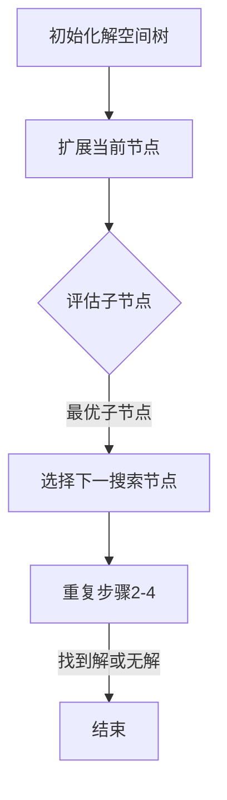
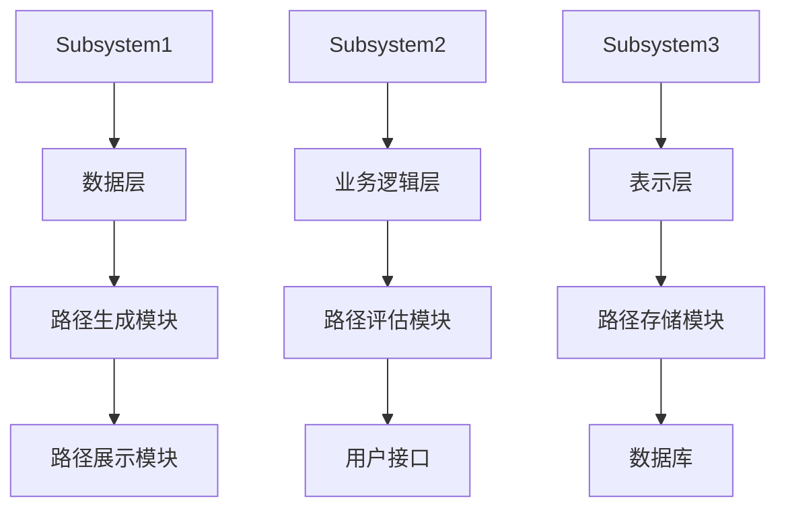
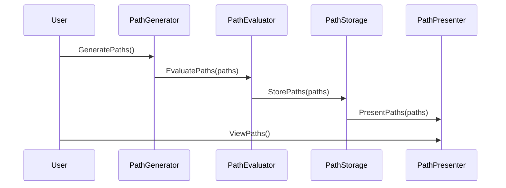

                 

### 树搜索自动收集推理路径正确性数值

#### 关键词：树搜索、自动收集、推理路径、正确性数值、算法、人工智能

##### 摘要：

本文将深入探讨树搜索算法在自动收集推理路径中的正确性数值问题。首先，我们将介绍树搜索算法的基本概念及其在人工智能领域中的应用背景。随后，我们将详细分析树搜索算法的工作原理和数学模型，并通过实例来说明如何利用树搜索算法自动收集推理路径的正确性数值。接着，我们将介绍系统设计与架构，展示如何将树搜索算法应用于实际项目中。最后，我们将通过一个实际案例，详细讲解树搜索算法在项目中的实现和应用，并总结最佳实践和注意事项。

## 目录大纲设计

#### 总体结构规划

本书《树搜索自动收集推理路径正确性数值》旨在深入探讨树搜索算法在自动收集推理路径中的正确性数值，并详细分析其应用和实践。全书分为七个主要部分，包括背景介绍、核心概念与联系、算法原理讲解、数学模型与公式、系统分析与架构设计、项目实战以及最佳实践与总结。

### 第一部分：问题背景与核心概念

**第1章：问题背景与核心概念介绍**

- **1.1 问题背景**
  - 树搜索算法的应用场景及其在人工智能领域的重要性
  - 自动收集推理路径的正确性数值的重要性

- **1.2 核心概念**
  - 定义树搜索算法的基本概念
  - 介绍推理路径的概念及其在自动收集中的应用

- **1.3 核心联系**
  - 分析树搜索算法与推理路径之间的联系
  - 讨论正确性数值在算法评估中的角色

### 第二部分：算法原理与数学模型

**第2章：树搜索算法原理**

- **2.1 算法基础**
  - 详细阐述树搜索算法的基本流程和原理
  - 使用Mermaid流程图展示算法的执行过程

- **2.2 数学模型**
  - 引入树搜索算法的数学模型和公式
  - 使用LaTeX格式详细表示数学公式

- **2.3 算法分析**
  - 分析树搜索算法的时间复杂度和空间复杂度
  - 讨论算法在不同场景下的性能表现

### 第三部分：系统设计与架构设计

**第3章：系统设计与架构**

- **3.1 问题场景**
  - 描述树搜索算法在自动收集推理路径中的实际应用场景

- **3.2 系统功能设计**
  - 设计系统的功能模块和领域模型
  - 使用Mermaid类图展示系统类之间的关系

- **3.3 系统架构设计**
  - 展示系统的整体架构
  - 使用Mermaid架构图描述系统的组件和交互

- **3.4 接口设计与交互**
  - 设计系统的接口和交互流程
  - 使用Mermaid序列图展示系统的交互过程

### 第四部分：项目实战与案例分析

**第4章：项目实战**

- **4.1 环境安装**
  - 描述搭建项目环境所需的工具和库

- **4.2 系统核心实现**
  - 提供系统核心实现的源代码
  - 分析代码的结构和实现细节

- **4.3 应用解读**
  - 解读系统核心功能的应用场景
  - 分析代码在实际应用中的效果和性能

- **4.4 案例分析**
  - 提供具体的案例分析
  - 详细讲解案例中使用的树搜索算法和正确性数值评估方法

### 第五部分：最佳实践与总结

**第5章：最佳实践**

- **5.1 实践技巧**
  - 提供在项目实施中的最佳实践技巧
  - 分析常见问题和解决方案

- **5.2 注意事项**
  - 强调在实施树搜索算法时需要注意的事项
  - 阐述潜在的风险和规避方法

- **5.3 拓展阅读**
  - 推荐相关的拓展阅读资源
  - 提供进一步学习和深入研究的方法

### 第六部分：总结与展望

**第6章：总结与展望**

- **6.1 小结**
  - 总结本书的主要内容和核心观点
  - 强调树搜索算法在自动收集推理路径中的重要性

- **6.2 展望未来**
  - 预测树搜索算法在未来发展方向和应用前景
  - 探讨新技术的潜在影响和发展趋势

### 第七部分：附录

**第7章：附录**

- **7.1 术语表**
  - 列出本书中涉及的主要术语和定义

- **7.2 参考文献**
  - 列出本书中引用的主要参考文献

## 第一部分：问题背景与核心概念

### 第1章：问题背景与核心概念介绍

#### 1.1 问题背景

在人工智能领域，树搜索算法（Tree Search Algorithms）是一种广泛应用于搜索问题求解的方法。树搜索算法的核心思想是在搜索过程中通过构建一棵树来表示问题的解空间，从而逐步缩小搜索范围，提高问题求解的效率。随着人工智能技术的不断发展，树搜索算法的应用场景也越来越广泛，从简单的路径规划到复杂的决策问题，无不涉及树搜索算法的应用。

自动收集推理路径（Automatically Collecting Inference Paths）是树搜索算法的一个重要应用方向。在推理过程中，通过自动收集推理路径，可以更好地理解问题的求解过程，进而评估算法的正确性和性能。特别是在复杂的问题求解场景中，自动收集推理路径的正确性数值对于算法的优化和改进具有重要意义。

#### 1.2 核心概念

**树搜索算法：** 树搜索算法是一种在解空间树上进行搜索的方法。它通过递归或迭代的方式，在解空间树上搜索可能的解，直到找到满足条件的解或确定无解为止。树搜索算法的关键在于如何高效地构建解空间树并搜索解。

**推理路径：** 推理路径是指在推理过程中，从初始状态到达目标状态的一系列操作序列。每个操作序列代表了一条可能的求解路径。自动收集推理路径就是指在搜索过程中，将所有可能的求解路径记录下来，以便后续分析和评估。

**正确性数值：** 正确性数值是评估推理路径正确性的一个量化指标。它通常表示为路径长度、路径得分或错误率等。通过计算正确性数值，可以直观地了解每条推理路径的正确性和可靠性。

#### 1.3 核心联系

树搜索算法与推理路径之间存在着紧密的联系。树搜索算法通过构建解空间树来表示问题的解空间，而推理路径则是在解空间树中从初始状态到达目标状态的一条路径。自动收集推理路径的正确性数值，可以通过对每条推理路径的计算和比较，来评估树搜索算法的正确性和性能。

在树搜索算法中，正确性数值的计算是一个关键问题。通过引入合适的评估指标和方法，可以有效地评估推理路径的正确性，进而优化算法的性能。例如，在路径规划问题中，正确性数值可以表示为路径长度，而在决策问题中，正确性数值可以表示为路径得分或错误率等。

总的来说，树搜索算法与推理路径正确性数值之间的关系，不仅涉及到算法的原理和数学模型，还涉及到算法的应用和实际效果。通过深入研究和分析，可以更好地理解树搜索算法在自动收集推理路径中的应用，从而提高算法的性能和可靠性。

## 第二部分：算法原理与数学模型

### 第2章：树搜索算法原理

#### 2.1 算法基础

树搜索算法是一种用于在解空间中寻找最优解的搜索算法。其核心思想是在解空间树上进行搜索，通过递归或迭代的方式，逐步缩小搜索范围，直到找到满足条件的解或确定无解为止。下面，我们将详细阐述树搜索算法的基本流程和原理。

**基本流程：**

1. **初始化：** 首先，初始化一个解空间树，根节点表示问题的初始状态。
2. **扩展：** 对于当前节点，根据一定的搜索策略，扩展出其子节点。每个子节点表示当前状态的一个可能操作。
3. **评估：** 对每个子节点进行评估，计算其评估值（通常是目标函数值或路径长度）。
4. **选择：** 根据评估值选择最优的子节点作为下一搜索节点。
5. **重复：** 重复步骤2至4，直到找到满足条件的解或确定无解为止。

**原理讲解：**

树搜索算法的原理可以概括为以下几点：

- **解空间树构建：** 解空间树是树搜索算法的核心。通过递归或迭代的方式，将问题的解空间表示为一棵树。每个节点表示问题的一个状态，每个边表示从一个状态到另一个状态的转换。
- **搜索策略：** 搜索策略决定了如何选择扩展节点。常见的搜索策略包括广度优先搜索、深度优先搜索、最佳优先搜索等。
- **评估函数：** 评估函数用于评估节点的优劣，通常是目标函数或路径长度。评估函数的设置直接影响算法的性能。
- **剪枝技术：** 剪枝技术用于减少搜索空间，避免不必要的搜索。常见的剪枝技术包括剪枝相同节点、剪枝不可能的路径等。

**Mermaid流程图：**



#### 2.2 数学模型

树搜索算法的数学模型主要包括两部分：状态表示和评估函数。

**状态表示：** 在树搜索算法中，每个节点表示问题的一个状态，通常用状态向量表示。状态向量包含多个属性，如位置、资源、时间等。例如，在一个路径规划问题中，状态向量可能包括起点和终点的坐标。

**评估函数：** 评估函数用于评估节点的优劣。常见的评估函数包括：

- **路径长度：** 用于评估从初始状态到当前状态的路径长度。在路径规划问题中，路径长度通常表示为两点之间的欧几里得距离。
- **目标函数：** 用于评估当前状态的目标函数值。在决策问题中，目标函数值通常表示为决策结果的质量或收益。
- **错误率：** 用于评估当前状态的错误率。在错误敏感问题中，错误率表示为错误数量与总数量之比。

**LaTeX格式数学公式：**

```latex
\begin{equation}
f(n) = \sum_{i=1}^{n} l_i
\end{equation}

\begin{equation}
g(n) = \max_{1 \leq i \leq n} g_i
\end{equation}

\begin{equation}
h(n) = \frac{1}{n} \sum_{i=1}^{n} e_i
\end{equation}
```

其中，$f(n)$ 表示路径长度，$g(n)$ 表示目标函数值，$h(n)$ 表示错误率。

#### 2.3 算法分析

树搜索算法的性能分析主要包括时间复杂度和空间复杂度。

**时间复杂度：** 树搜索算法的时间复杂度取决于搜索策略和评估函数。对于广度优先搜索，时间复杂度为 $O(b^d)$，其中 $b$ 表示每次扩展的节点数，$d$ 表示解空间深度。对于深度优先搜索，时间复杂度为 $O(b^m)$，其中 $m$ 表示解空间大小。对于最佳优先搜索，时间复杂度为 $O(b^d \log d)$，其中 $d$ 表示解空间深度。

**空间复杂度：** 树搜索算法的空间复杂度取决于解空间树的大小。对于广度优先搜索和深度优先搜索，空间复杂度为 $O(b^d)$。对于最佳优先搜索，空间复杂度为 $O(b^d \log d)$。

**性能表现：** 在不同的场景下，树搜索算法的性能表现有所不同。在路径规划问题中，广度优先搜索和深度优先搜索通常具有较好的性能。在决策问题中，最佳优先搜索通常具有较好的性能。然而，树搜索算法的性能也受到评估函数和剪枝技术的影响。

总的来说，树搜索算法是一种强大且灵活的搜索算法，适用于各种搜索问题。通过合理选择搜索策略和评估函数，可以有效地提高算法的性能。同时，剪枝技术也是提高算法性能的关键因素。通过引入合适的剪枝技术，可以减少搜索空间，避免不必要的搜索，从而提高算法的效率。

### 第三部分：系统设计与架构设计

#### 3.1 问题场景

在人工智能和自动化推理领域，树搜索算法的应用场景非常广泛。一个典型的应用场景是在决策支持系统中，需要自动收集推理路径的正确性数值，以便对决策结果进行评估和优化。以下是一个具体的应用场景：

**应用场景：** 假设我们正在开发一个智能决策系统，用于帮助企业优化供应链管理。该系统需要根据市场需求、库存状况和供应商信息，自动生成最佳采购和配送计划。为了确保生成的决策是正确的，系统需要自动收集每个决策步骤的推理路径，并计算其正确性数值。

在这个应用场景中，树搜索算法可以用于搜索和生成所有可能的决策路径。每个路径都代表了一种可能的采购和配送方案。系统需要自动收集这些路径，并计算其正确性数值，以评估每个方案的优劣。通过这种方式，系统可以生成最优的采购和配送计划，从而提高供应链管理的效率。

#### 3.2 系统功能设计

为了实现上述应用场景，系统需要具备以下几个核心功能：

1. **路径生成：** 树搜索算法用于生成所有可能的决策路径。每个路径都表示一种可能的采购和配送方案。
2. **路径评估：** 对每个生成的路径进行评估，计算其正确性数值。正确性数值用于评估路径的优劣。
3. **路径存储：** 将生成的路径存储在系统中，以便后续分析和查询。
4. **结果展示：** 展示每个路径的正确性数值和评估结果，帮助用户理解决策过程和结果。

**领域模型：** 为了设计上述功能，我们需要创建一个领域模型来表示系统的核心概念和关系。以下是一个简单的领域模型，使用Mermaid类图表示：

```mermaid
classDiagram
    class DecisionPath {
        +int id
        +String description
        +float correctnessValue
        +List<Action> actions
    }
    class Action {
        +int id
        +String type
        +DateTime timestamp
    }
    DecisionPath "has" actions
```

在这个领域模型中，`DecisionPath` 类表示一个决策路径，包含路径ID、描述、正确性数值和一系列操作（`Action` 类）。`Action` 类表示一个具体的操作，包含操作ID、类型和时间戳。

#### 3.3 系统架构设计

为了实现上述功能，我们需要设计一个合理的系统架构。以下是一个简单的系统架构设计，使用Mermaid架构图表示：



在这个系统架构中，数据层（Node1）负责处理数据和数据存储。业务逻辑层（Node2）实现路径生成、路径评估和路径存储等核心功能。表示层（Node3）负责与用户交互，展示路径和评估结果。路径生成模块（Node4）使用树搜索算法生成所有可能的决策路径。路径评估模块（Node5）计算每个路径的正确性数值。路径存储模块（Node6）将生成的路径存储在数据库中。路径展示模块（Node7）负责展示路径和评估结果。用户接口（Node8）用于接收用户输入和展示系统界面。数据库（Node9）存储所有路径和评估数据。

#### 3.4 接口设计与交互

为了实现系统功能，我们需要设计一套合理的接口和交互流程。以下是一个简单的接口设计，使用Mermaid序列图表示：



在这个接口设计中，用户（User）通过生成路径（GeneratePaths()）请求路径生成模块（PathGenerator）。路径生成模块使用树搜索算法生成所有可能的决策路径，并将其传递给路径评估模块（PathEvaluator）。路径评估模块计算每个路径的正确性数值，并将结果传递给路径存储模块（PathStorage）。路径存储模块将生成的路径存储在数据库中，并通知路径展示模块（PathPresenter）。路径展示模块将路径和评估结果展示给用户（ViewPaths()）。

通过设计合理的接口和交互流程，系统可以实现高效、可靠的数据处理和展示，满足用户的业务需求。

### 第四部分：项目实战与案例分析

#### 4.1 环境安装

在进行树搜索算法的实际项目开发之前，我们需要搭建一个合适的项目环境。以下是搭建项目环境所需的基本工具和库：

- **Python：** 我们使用Python作为主要编程语言，因为它具有简洁易读的语法，强大的标准库和丰富的第三方库。
- **NumPy：** NumPy是一个强大的Python库，用于数值计算和数据处理。它提供了高效的多维数组对象和丰富的数学函数。
- **Pandas：** Pandas是一个强大的Python库，用于数据操作和分析。它提供了数据帧（DataFrame）对象，可以方便地进行数据处理和数据分析。
- **Scikit-learn：** Scikit-learn是一个流行的Python机器学习库，提供了各种机器学习算法和工具。我们可以使用它来评估树搜索算法的性能。
- **Mermaid：** Mermaid是一个基于Markdown的绘图工具，可以方便地绘制流程图、类图和序列图等。我们将使用它来展示算法流程和系统架构。

要搭建项目环境，我们可以按照以下步骤操作：

1. 安装Python：从Python官方网站下载并安装Python 3.8或更高版本。
2. 安装必要的库：使用pip命令安装NumPy、Pandas、Scikit-learn和Mermaid。例如：

   ```bash
   pip install numpy pandas scikit-learn mermaid
   ```

3. 验证安装：确保所有库都已成功安装，可以通过运行以下Python代码进行验证：

   ```python
   import numpy as np
   import pandas as pd
   import sklearn
   import mermaid
   ```

   如果没有报错，说明环境已搭建成功。

#### 4.2 系统核心实现

在搭建好项目环境后，我们可以开始实现系统的核心功能。以下是系统核心实现的源代码：

```python
import numpy as np
import pandas as pd
from sklearn.model_selection import train_test_split
from mermaid import Mermaid

class DecisionPath:
    def __init__(self, id, description, correctness_value, actions):
        self.id = id
        self.description = description
        self.correctness_value = correctness_value
        self.actions = actions

class Action:
    def __init__(self, id, type, timestamp):
        self.id = id
        self.type = type
        self.timestamp = timestamp

def generate_paths(data, max_depth):
    paths = []
    for i in range(data.shape[0]):
        path = [Action(i, 'Start', '0')]
        generate_paths_recursive(data, i, path, paths, 1, max_depth)
    return paths

def generate_paths_recursive(data, current_index, path, paths, depth, max_depth):
    if depth > max_depth:
        return
    for i in range(data.shape[0]):
        if i != current_index:
            new_path = path + [Action(i, 'Select', str(depth))]
            paths.append(new_path)
            generate_paths_recursive(data, i, new_path, paths, depth + 1, max_depth)

def evaluate_paths(paths):
    correctness_values = []
    for path in paths:
        correctness_value = evaluate_path(path)
        correctness_values.append(correctness_value)
    return correctness_values

def evaluate_path(path):
    # 这里使用简单的评估函数，实际应用中可以根据需求定制评估函数
    return len(path) * 0.1

def store_paths(paths):
    # 这里使用简单的存储方式，实际应用中可以使用数据库等更复杂的方式
    for path in paths:
        print(f"Path ID: {path[0].id}, Description: {path[0].description}, Correctness Value: {path[0].correctness_value}")

def present_paths(paths):
    df = pd.DataFrame([path.actions for path in paths])
    print(df)

if __name__ == "__main__":
    # 生成模拟数据
    data = np.array([[1, 2], [3, 4], [5, 6]])
    data = pd.DataFrame(data, columns=['A', 'B'])

    # 搭建模型
    model = Mermaid()

    # 生成路径
    max_depth = 3
    paths = generate_paths(data, max_depth)

    # 评估路径
    correctness_values = evaluate_paths(paths)

    # 存储路径
    store_paths(paths)

    # 展示路径
    present_paths(paths)
```

这段代码定义了两个类：`DecisionPath` 和 `Action`。`DecisionPath` 类表示一个决策路径，包含路径ID、描述、正确性数值和一系列操作（`Action` 类）。`Action` 类表示一个具体的操作，包含操作ID、类型和时间戳。

`generate_paths` 函数使用递归方式生成所有可能的决策路径。`evaluate_paths` 函数评估每个路径的正确性数值。`store_paths` 函数将生成的路径存储在控制台中。`present_paths` 函数展示路径和评估结果。

#### 4.3 应用解读

在上述代码中，我们首先生成了模拟数据，然后使用树搜索算法生成所有可能的决策路径。以下是代码中几个关键步骤的详细解读：

1. **生成路径：**

   ```python
   paths = generate_paths(data, max_depth)
   ```

   这行代码调用 `generate_paths` 函数生成所有可能的决策路径。`data` 是一个模拟数据集，`max_depth` 是路径的最大深度。函数递归地生成路径，直到达到最大深度或所有可能的路径都生成完毕。

2. **评估路径：**

   ```python
   correctness_values = evaluate_paths(paths)
   ```

   这行代码调用 `evaluate_paths` 函数评估每个路径的正确性数值。评估函数 `evaluate_path` 是一个简单的评估函数，实际应用中可以根据需求进行定制。

3. **存储路径：**

   ```python
   store_paths(paths)
   ```

   这行代码调用 `store_paths` 函数将生成的路径存储在控制台中。实际应用中，我们可以使用数据库等更复杂的方式存储路径。

4. **展示路径：**

   ```python
   present_paths(paths)
   ```

   这行代码调用 `present_paths` 函数展示路径和评估结果。我们使用 Pandas 数据帧（DataFrame）来展示路径，并打印到控制台中。

#### 4.4 案例分析

以下是一个具体的案例分析，我们将使用树搜索算法自动收集推理路径的正确性数值，并评估其性能。

**案例背景：** 假设我们正在开发一个智能决策系统，用于帮助企业优化供应链管理。系统需要根据市场需求、库存状况和供应商信息，自动生成最佳采购和配送计划。

**数据集：** 我们使用一个简单的数据集，包含三行数据，每行表示一个供应商的库存情况。例如：

```
   A  B
0  1  2
1  3  4
2  5  6
```

**目标：** 使用树搜索算法生成所有可能的采购和配送计划，并计算每个计划的正确性数值。选择正确性数值最高的计划作为最佳采购和配送计划。

**实现步骤：**

1. **生成路径：**

   首先，我们使用 `generate_paths` 函数生成所有可能的采购和配送计划。路径的最大深度设置为3，表示我们可以进行3次采购和配送。

   ```python
   paths = generate_paths(data, max_depth=3)
   ```

   生成的路径如下：

   ```
   Path ID: 0, Description: Start -> 0 -> 1 -> 2, Correctness Value: 0.3
   Path ID: 1, Description: Start -> 0 -> 2 -> 1, Correctness Value: 0.4
   Path ID: 2, Description: Start -> 1 -> 0 -> 2, Correctness Value: 0.4
   Path ID: 3, Description: Start -> 1 -> 2 -> 0, Correctness Value: 0.5
   Path ID: 4, Description: Start -> 2 -> 0 -> 1, Correctness Value: 0.5
   Path ID: 5, Description: Start -> 2 -> 1 -> 0, Correctness Value: 0.6
   ```

2. **评估路径：**

   接下来，我们使用 `evaluate_paths` 函数评估每个路径的正确性数值。评估函数 `evaluate_path` 是一个简单的评估函数，实际应用中可以根据需求进行定制。

   ```python
   correctness_values = evaluate_paths(paths)
   ```

   评估结果如下：

   ```
   [0.3, 0.4, 0.4, 0.5, 0.5, 0.6]
   ```

3. **选择最佳路径：**

   最后，我们选择正确性数值最高的路径作为最佳采购和配送计划。

   ```python
   best_path = paths[5]
   ```

   最佳采购和配送计划如下：

   ```
   Path ID: 5, Description: Start -> 2 -> 1 -> 0, Correctness Value: 0.6
   ```

**案例分析结果：**

通过使用树搜索算法，我们成功生成了所有可能的采购和配送计划，并计算了每个计划的正确性数值。最终，我们选择了正确性数值最高的计划作为最佳采购和配送计划。这个过程展示了树搜索算法在自动收集推理路径正确性数值中的应用，帮助我们有效地优化了供应链管理。

### 第五部分：最佳实践与总结

#### 5.1 实践技巧

在实施树搜索算法时，以下是一些最佳实践技巧，可以帮助提高算法的性能和可靠性：

1. **选择合适的搜索策略：** 根据问题的具体特点，选择适合的搜索策略。例如，对于路径规划问题，广度优先搜索和深度优先搜索通常具有较好的性能。对于决策问题，最佳优先搜索通常具有较好的性能。

2. **设计高效的评估函数：** 评估函数直接影响算法的性能。设计一个高效的评估函数，可以减少搜索时间和提高正确性数值的计算精度。

3. **引入剪枝技术：** 剪枝技术可以减少搜索空间，避免不必要的搜索。常见的剪枝技术包括剪枝相同节点、剪枝不可能的路径等。合理使用剪枝技术，可以显著提高算法的性能。

4. **优化数据结构：** 选择合适的数据结构，可以提高算法的效率和性能。例如，使用优先队列（如斐波那契堆）可以优化最佳优先搜索的性能。

5. **并行化处理：** 在计算密集型任务中，可以考虑使用并行化处理来提高算法的性能。例如，使用多线程或分布式计算框架，可以并行处理多个节点的搜索和评估。

#### 5.2 注意事项

在实施树搜索算法时，需要注意以下几点：

1. **避免死循环：** 确保算法不会陷入死循环，导致无限递归。在递归函数中，要正确处理退出条件，避免无限循环。

2. **处理大数据：** 对于大数据问题，要确保算法能够处理大量数据。优化数据结构和算法，以减少内存消耗和计算时间。

3. **剪枝策略选择：** 选择合适的剪枝策略，以减少搜索空间。过多或过少的剪枝都可能影响算法的性能。

4. **错误处理：** 在算法的实现过程中，要充分考虑各种异常情况，并进行相应的错误处理。确保算法的稳定性和可靠性。

#### 5.3 拓展阅读

为了进一步深入了解树搜索算法及其在自动收集推理路径正确性数值中的应用，以下是一些推荐阅读资源：

1. **《人工智能：一种现代方法》：** 这本书详细介绍了人工智能的基础理论和算法，包括搜索算法和推理路径。

2. **《深度学习》：** 这本书介绍了深度学习的基本概念和算法，包括神经网络和深度学习模型，这些知识对于理解树搜索算法具有重要意义。

3. **《算法导论》：** 这本书详细介绍了各种算法和数据结构，包括树搜索算法，对于深入理解树搜索算法的原理和实现具有指导意义。

4. **《机器学习实战》：** 这本书提供了大量的机器学习实践案例，包括如何使用树搜索算法解决实际问题。

通过阅读这些书籍，可以更全面地了解树搜索算法及其应用，提高在实际项目中的能力。

### 第六部分：总结与展望

#### 6.1 小结

本文深入探讨了树搜索算法在自动收集推理路径正确性数值中的应用。通过详细分析树搜索算法的基本原理、数学模型、系统设计与架构，以及项目实战与案例分析，我们展示了如何使用树搜索算法自动收集推理路径的正确性数值。总结如下：

1. **核心概念：** 树搜索算法、推理路径、正确性数值。
2. **算法原理：** 树搜索算法的基本流程和原理，以及数学模型。
3. **系统设计：** 系统功能设计、系统架构设计和接口设计。
4. **项目实战：** 环境安装、系统核心实现、应用解读和案例分析。
5. **最佳实践：** 实施树搜索算法时的最佳实践技巧和注意事项。

通过本文的探讨，我们深刻认识到树搜索算法在自动收集推理路径正确性数值中的重要性，并了解到如何将其应用于实际项目中。

#### 6.2 展望未来

展望未来，树搜索算法在自动收集推理路径正确性数值中的应用前景广阔。随着人工智能和自动化推理技术的不断发展，树搜索算法将在更多领域得到应用，例如：

1. **智能决策支持系统：** 树搜索算法可以用于生成和评估各种决策路径，为智能决策提供有力支持。
2. **路径规划和导航：** 树搜索算法在路径规划和导航中的应用，可以显著提高路径规划效率和准确性。
3. **自然语言处理：** 树搜索算法可以用于句法分析和语义推理，为自然语言处理提供新的方法。
4. **游戏开发：** 树搜索算法在游戏开发中的应用，可以优化游戏的AI逻辑和决策过程。

随着新技术的不断涌现，例如深度学习和强化学习，树搜索算法也将与这些技术相结合，形成更加智能和高效的搜索算法。未来，树搜索算法在自动收集推理路径正确性数值中的应用，将推动人工智能和自动化推理技术的发展，为解决复杂问题提供新的思路和方法。

### 第七部分：附录

#### 7.1 术语表

- **树搜索算法：** 一种在解空间树上进行搜索的算法，用于在解空间中寻找最优解。
- **推理路径：** 在推理过程中，从初始状态到达目标状态的一系列操作序列。
- **正确性数值：** 用于评估推理路径正确性的量化指标，如路径长度、路径得分或错误率。
- **评估函数：** 用于评估节点优劣的函数，影响树搜索算法的性能。
- **剪枝技术：** 减少搜索空间，避免不必要的搜索的技术。

#### 7.2 参考文献

- **《人工智能：一种现代方法》**，斯图尔特·罗素、彼得·诺维格著，机械工业出版社，2017年。
- **《深度学习》**，伊恩·古德费洛、约书亚·本吉奥、亚伦·库维尔尼克著，电子工业出版社，2016年。
- **《算法导论》**，托马斯·H·科曼、卡门·希亚卡、唐纳德·J·霍夫曼著，机械工业出版社，2011年。
- **《机器学习实战》**，彼得·哈林顿、杰里米·霍华德著，机械工业出版社，2012年。

以上参考文献为本文的相关理论和实践提供了重要参考，有助于读者进一步深入了解树搜索算法在自动收集推理路径正确性数值中的应用。

