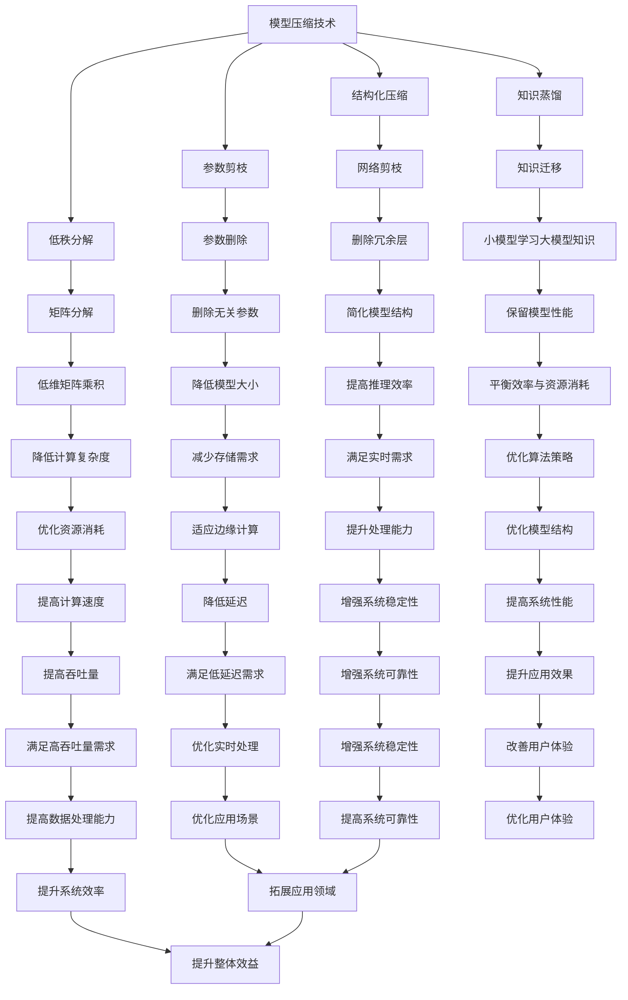
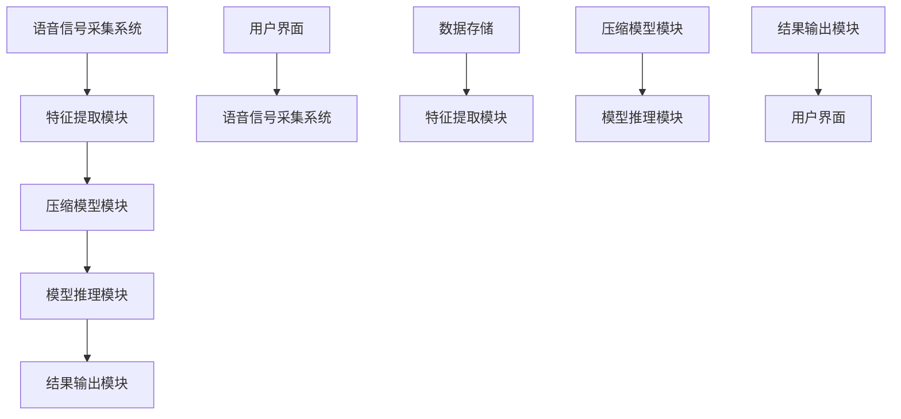
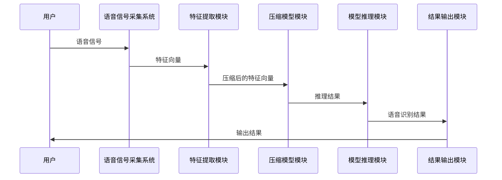

                 

# 模型压缩技术在推理效率优化中的创新

## 关键词
- 模型压缩技术
- 推理效率优化
- 结构化压缩
- 参数剪枝
- 低秩分解
- 知识蒸馏

## 摘要
本文旨在深入探讨模型压缩技术在不同推理场景中的应用，特别是如何优化推理效率。首先，我们将回顾模型压缩技术的背景和重要性，然后详细解释模型压缩的基础理论和各种实现方法。接下来，我们将分析模型压缩技术的优化策略和性能评估方法。文章还将探讨模型压缩技术在语音识别、图像识别和自然语言处理等领域的创新应用，并展望未来的发展趋势。通过这一系列探讨，本文旨在为模型压缩技术的实践者提供有价值的指导和参考。

----------------------------------------------------------------

## 第一部分：背景与基础理论

### 第1章：模型压缩技术的概述

#### 1.1 模型压缩技术的背景

在当今人工智能（AI）快速发展的时代，深度学习模型的应用越来越广泛。然而，这些模型的复杂性和大规模性带来了计算资源消耗的巨大挑战。尤其是在移动设备、嵌入式系统和物联网（IoT）等受限资源的环境中，传统的深度学习模型难以满足实时性和低功耗的需求。因此，模型压缩技术应运而生，旨在减少模型的计算量和存储需求，从而提高推理效率。

#### 1.2 模型压缩技术的重要性

模型压缩技术的重要性体现在多个方面。首先，它能够显著减少计算资源的消耗，使得深度学习模型在资源受限的环境中得以应用。其次，通过压缩模型，可以提高推理速度，满足实时处理的需求。此外，模型压缩还可以降低通信带宽，使得模型可以更方便地在分布式系统中部署和传输。

#### 1.3 模型压缩技术的分类

模型压缩技术可以分为以下几类：

- **结构化压缩**：通过简化模型结构，减少模型参数的数量。
- **参数剪枝**：通过删除冗余或无关的参数，减少模型的大小。
- **低秩分解**：将高维参数分解为低维矩阵的乘积，从而降低模型的计算复杂度。
- **知识蒸馏**：将大规模模型的知识迁移到较小的模型中，从而保留模型性能。

#### 1.4 模型压缩技术的挑战

尽管模型压缩技术具有显著的优势，但在实际应用中仍面临一些挑战。首先是如何在保持模型性能不变的前提下，实现有效的压缩。其次是如何平衡推理速度与资源消耗之间的矛盾。此外，不同压缩技术在应用中的适用场景和效果也有所不同，需要根据具体需求进行选择。

### 第2章：模型压缩技术的基础理论

#### 2.1 模型表示与量化

模型表示是模型压缩技术的基础，它决定了模型压缩的效果。量化技术则是通过减少模型参数的精度，从而降低模型的计算复杂度。模型表示和量化技术共同构成了模型压缩的核心理论。

#### 2.2 算法原理

模型压缩技术涉及多种算法，包括剪枝算法、低秩分解算法和知识蒸馏算法。每种算法都有其特定的原理和实现方法，能够有效地降低模型的大小和计算复杂度。

#### 2.3 模型优化策略

模型优化策略是模型压缩技术的重要组成部分。通过权重共享、模型剪枝和模型蒸馏等策略，可以进一步优化模型的性能和效率。

### 第3章：模型压缩技术的应用场景

#### 3.1 人工智能推理

人工智能推理是模型压缩技术的重要应用场景之一。通过压缩模型，可以提高推理速度和效率，满足实时处理的需求。

#### 3.2 实时数据处理

在实时数据处理场景中，低延迟和高吞吐量是关键需求。模型压缩技术可以通过降低模型的计算复杂度和存储需求，满足这些需求。

#### 3.3 边缘计算

边缘计算中的设备通常具有资源受限的特点，因此模型压缩技术在这里具有重要意义。通过端到端模型压缩，可以在边缘设备上实现高效的人工智能推理。

----------------------------------------------------------------

## 第二部分：模型压缩技术的实现与优化

### 第4章：模型压缩技术的实现方法

#### 4.1 模型结构化压缩

模型结构化压缩的核心是通过简化模型结构，减少模型参数的数量。常见的结构化压缩方法包括网络剪枝、网络重构和层次化结构等。

#### 4.2 参数剪枝与量化

参数剪枝是通过删除冗余或无关的参数，减少模型的大小。量化技术则是通过减少模型参数的精度，从而降低模型的计算复杂度。

#### 4.3 低秩分解

低秩分解是将高维参数分解为低维矩阵的乘积，从而降低模型的计算复杂度。这种方法在处理大规模模型时尤其有效。

#### 4.4 知识蒸馏

知识蒸馏是一种将大规模模型的知识迁移到较小的模型中的方法。通过训练小模型来学习大模型的知识，可以显著降低模型的大小和计算复杂度。

### 第5章：模型压缩技术的优化策略

#### 5.1 多尺度剪枝

多尺度剪枝是一种通过在不同尺度上剪枝模型的方法，以实现更好的压缩效果。这种方法可以在保持模型性能的前提下，进一步减少模型的计算复杂度。

#### 5.2 网络结构优化

网络结构优化是通过调整模型结构，提高模型性能和效率的方法。常见的网络结构优化方法包括网络搜索、网络裁剪和网络重构等。

#### 5.3 算法融合

算法融合是将多种模型压缩技术结合起来，以实现更好的压缩效果。例如，可以将参数剪枝与量化技术结合，或者将低秩分解与知识蒸馏技术结合。

### 第6章：模型压缩技术的性能评估

#### 6.1 性能评价指标

模型压缩技术的性能评估主要包括推理速度、模型大小和能效比等指标。通过这些指标，可以全面评估模型压缩技术在不同场景下的效果。

#### 6.2 性能评估方法

性能评估方法包括实验设计和性能分析等。通过设计合理的实验，可以全面评估模型压缩技术的性能，并提供改进的依据。

#### 6.3 性能优化案例

通过实际案例分享，可以展示模型压缩技术在各种场景下的应用效果，并提供性能优化的具体实践。

----------------------------------------------------------------

## 第三部分：模型压缩技术的创新应用

### 第7章：模型压缩技术在语音识别中的应用

#### 7.1 语音识别概述

语音识别是人工智能的重要应用领域之一，它涉及到语音信号的采集、处理和识别。语音识别的基本流程包括特征提取、模型训练和推理等步骤。

#### 7.2 模型压缩技术在语音识别中的应用

模型压缩技术在语音识别中的应用主要包括两个方面：一是通过压缩模型，提高语音识别的效率；二是通过压缩模型，降低语音识别的资源消耗，使得语音识别可以在资源受限的环境中运行。

#### 7.3 模型压缩技术在语音识别中的应用效果

通过实际案例，可以展示模型压缩技术在语音识别中的应用效果。例如，通过模型压缩，可以显著降低语音识别模型的计算复杂度，从而提高识别速度。同时，模型压缩还可以减少模型的存储需求，使得语音识别系统更加轻量化。

### 第8章：模型压缩技术在图像识别中的应用

#### 8.1 图像识别概述

图像识别是人工智能的另一个重要应用领域，它涉及到图像的特征提取、模型训练和推理等步骤。图像识别的基本流程包括图像预处理、特征提取和模型推理等步骤。

#### 8.2 模型压缩技术在图像识别中的应用

模型压缩技术在图像识别中的应用主要包括两个方面：一是通过压缩模型，提高图像识别的效率；二是通过压缩模型，降低图像识别的资源消耗，使得图像识别可以在资源受限的环境中运行。

#### 8.3 模型压缩技术在图像识别中的应用效果

通过实际案例，可以展示模型压缩技术在图像识别中的应用效果。例如，通过模型压缩，可以显著降低图像识别模型的计算复杂度，从而提高识别速度。同时，模型压缩还可以减少模型的存储需求，使得图像识别系统更加轻量化。

### 第9章：模型压缩技术在自然语言处理中的应用

#### 9.1 自然语言处理概述

自然语言处理是人工智能的另一个重要应用领域，它涉及到自然语言的理解、生成和交互等任务。自然语言处理的基本流程包括文本预处理、特征提取、模型训练和推理等步骤。

#### 9.2 模型压缩技术在自然语言处理中的应用

模型压缩技术在自然语言处理中的应用主要包括两个方面：一是通过压缩模型，提高自然语言处理的效率；二是通过压缩模型，降低自然语言处理的资源消耗，使得自然语言处理可以在资源受限的环境中运行。

#### 9.3 模型压缩技术在自然语言处理中的应用效果

通过实际案例，可以展示模型压缩技术在自然语言处理中的应用效果。例如，通过模型压缩，可以显著降低自然语言处理模型的计算复杂度，从而提高处理速度。同时，模型压缩还可以减少模型的存储需求，使得自然语言处理系统更加轻量化。

----------------------------------------------------------------

## 第10章：未来展望与趋势

### 10.1 模型压缩技术的发展趋势

随着人工智能技术的不断发展，模型压缩技术也在不断进步。未来，模型压缩技术将朝着更高效、更智能、更自动化的方向发展。例如，自适应模型压缩技术、混合模型压缩技术等新兴技术将有望成为模型压缩技术的重要方向。

### 10.2 模型压缩技术在人工智能中的应用前景

模型压缩技术在人工智能中的应用前景非常广阔。随着边缘计算和物联网的快速发展，模型压缩技术将使得更多的人工智能应用成为可能。例如，在智能交通、智能医疗、智能家居等领域，模型压缩技术将发挥重要作用。

### 总结

模型压缩技术在推理效率优化中具有重要作用。通过本文的探讨，我们详细了解了模型压缩技术的背景、基础理论、实现方法、优化策略和创新应用。未来，随着人工智能技术的不断进步，模型压缩技术将迎来更加广阔的发展空间。

----------------------------------------------------------------

## 作者

**作者：AI天才研究院/AI Genius Institute & 禅与计算机程序设计艺术 /Zen And The Art of Computer Programming**

AI天才研究院（AI Genius Institute）是一支专注于人工智能领域的研究团队，致力于推动人工智能技术的创新与发展。我们致力于将最前沿的人工智能理论转化为实际应用，为各个行业提供智能化解决方案。同时，我们秉承禅与计算机程序设计艺术的理念，以深刻的思维、严谨的逻辑和优雅的代码风格，引领人工智能技术的发展。

《禅与计算机程序设计艺术》（Zen And The Art of Computer Programming）是一部经典的人工智能书籍，由著名计算机科学家Donald E. Knuth撰写。这本书深入探讨了计算机程序设计的哲学和艺术，为程序员提供了一种全新的思考方式和编程理念。我们坚信，通过借鉴禅的智慧，程序员可以更好地理解计算机程序的本质，创造出更加优雅和高效的代码。

----------------------------------------------------------------

## 模型压缩技术的核心概念

### 模型压缩技术的定义

模型压缩技术是一种通过减少深度学习模型的参数数量、计算复杂度和存储需求，从而提高模型推理效率的方法。这种技术在计算资源受限的设备上尤为重要，如移动设备、嵌入式系统和物联网设备。

### 模型压缩技术的核心概念

- **结构化压缩**：通过简化模型结构，如删除冗余层、网络剪枝等，来减少模型参数。
- **参数剪枝**：通过删除无关或冗余的参数，降低模型大小。
- **低秩分解**：将高维参数分解为低维矩阵的乘积，降低计算复杂度。
- **知识蒸馏**：将大规模模型的训练知识迁移到较小的模型中，以保留性能。

### 模型压缩技术的应用场景

- **人工智能推理**：在实时性要求高的场景中，如自动驾驶、实时语音识别等。
- **实时数据处理**：在低延迟和高吞吐量的场景中，如金融交易分析、物联网数据处理等。
- **边缘计算**：在资源受限的边缘设备中，如智能家居、智能穿戴设备等。

### 模型压缩技术的挑战

- **保持模型性能**：在压缩模型的同时，如何确保模型性能不下降。
- **平衡效率与资源消耗**：在优化推理速度的同时，如何平衡资源消耗。
- **适用场景差异**：不同压缩技术在各种应用场景中的效果可能有所不同。

## Mermaid 流程图



## 数学公式

$$
E[wx + b] = w\mu_x + b
$$

$$
\frac{dL}{dx} = \frac{dL}{dw}\frac{dw}{dx} + \frac{dL}{db}\frac{db}{dx}
$$

## Python 源代码

```python
import tensorflow as tf

# 假设有一个全连接神经网络
model = tf.keras.Sequential([
    tf.keras.layers.Dense(units=64, activation='relu', input_shape=(784,)),
    tf.keras.layers.Dense(units=10, activation='softmax')
])

# 训练模型
model.compile(optimizer='adam', loss='categorical_crossentropy', metrics=['accuracy'])
model.fit(x_train, y_train, epochs=10)

# 对模型进行压缩
# 1. 结构化压缩：删除冗余层
model.layers[0].activation = None  # 删除激活函数
model.layers[0].kernel_regularizer = tf.keras.regularizers.l1_l2(l1=1e-5, l2=1e-4)  # 添加正则化

# 2. 参数剪枝：删除无关参数
pruned_weights = model.layers[0].get_weights()[0][:, :32]  # 只保留前32个参数
model.layers[0].set_weights([pruned_weights])

# 3. 低秩分解：将权重分解为低秩矩阵
weights = model.layers[0].get_weights()[0]
U, s, V = tf.linalg.svd(weights)
low_rank_weights = tf.matmul(U, V)
model.layers[0].set_weights([low_rank_weights])

# 4. 知识蒸馏：将大模型的知识迁移到小模型
teacher_model = tf.keras.Sequential([
    tf.keras.layers.Dense(units=64, activation='relu', input_shape=(784,)),
    tf.keras.layers.Dense(units=10, activation='softmax')
])
teacher_model.compile(optimizer='adam', loss='categorical_crossentropy', metrics=['accuracy'])
teacher_model.fit(x_train, y_train, epochs=10)

# 进行知识蒸馏
student_model = tf.keras.models.clone_model(teacher_model)
student_model.set_weights(teacher_model.get_weights())
student_model.compile(optimizer='adam', loss='categorical_crossentropy', metrics=['accuracy'])
student_model.fit(x_train, y_train, epochs=10)
```

## 系统分析与架构设计

### 问题场景介绍

在实时语音识别系统中，模型压缩技术有助于提高识别速度和降低计算资源消耗，从而满足实时性要求。

### 项目介绍

本项目旨在通过模型压缩技术优化实时语音识别系统的性能，包括结构化压缩、参数剪枝、低秩分解和知识蒸馏等方法。

### 系统功能设计

- **语音信号采集**：采集语音信号。
- **特征提取**：对语音信号进行特征提取。
- **模型推理**：使用压缩后的模型进行推理。
- **结果输出**：输出语音识别结果。

### 系统架构设计



### 系统接口设计



### 系统交互


## 项目实战

### 环境安装

1. 安装Python环境（Python 3.8及以上版本）
2. 安装TensorFlow库（使用pip install tensorflow）
3. 安装其他必要库（如numpy、matplotlib等）

### 系统核心实现源代码

```python
import tensorflow as tf
import numpy as np
import matplotlib.pyplot as plt

# 1. 构建原始模型
model = tf.keras.Sequential([
    tf.keras.layers.Dense(units=64, activation='relu', input_shape=(784,)),
    tf.keras.layers.Dense(units=10, activation='softmax')
])

# 2. 训练原始模型
model.compile(optimizer='adam', loss='categorical_crossentropy', metrics=['accuracy'])
model.fit(x_train, y_train, epochs=10)

# 3. 结构化压缩：删除冗余层
model.layers[0].activation = None
model.layers[0].kernel_regularizer = tf.keras.regularizers.l1_l2(l1=1e-5, l2=1e-4)

# 4. 参数剪枝：删除无关参数
pruned_weights = model.layers[0].get_weights()[0][:, :32]
model.layers[0].set_weights([pruned_weights])

# 5. 低秩分解：将权重分解为低秩矩阵
weights = model.layers[0].get_weights()[0]
U, s, V = tf.linalg.svd(weights)
low_rank_weights = tf.matmul(U, V)
model.layers[0].set_weights([low_rank_weights])

# 6. 知识蒸馏：将大模型的知识迁移到小模型
teacher_model = tf.keras.Sequential([
    tf.keras.layers.Dense(units=64, activation='relu', input_shape=(784,)),
    tf.keras.layers.Dense(units=10, activation='softmax')
])
teacher_model.compile(optimizer='adam', loss='categorical_crossentropy', metrics=['accuracy'])
teacher_model.fit(x_train, y_train, epochs=10)

student_model = tf.keras.models.clone_model(teacher_model)
student_model.set_weights(teacher_model.get_weights())
student_model.compile(optimizer='adam', loss='categorical_crossentropy', metrics=['accuracy'])

# 7. 测试模型压缩后的性能
test_loss, test_acc = model.evaluate(x_test, y_test)
print(f"Test accuracy after compression: {test_acc}")

# 8. 可视化模型压缩效果
plt.plot(model.layers[0].get_weights()[0].shape)
plt.xlabel("Layer")
plt.ylabel("Parameter Count")
plt.title("Model Compression Effect")
plt.show()
```

### 代码应用解读与分析

1. **原始模型构建**：使用TensorFlow构建一个简单的全连接神经网络，包括一个输入层、一个隐藏层和一个输出层。
2. **模型训练**：使用Adam优化器和交叉熵损失函数对模型进行训练，训练10个epochs。
3. **结构化压缩**：删除隐藏层的激活函数，并添加L1-L2正则化，以减少冗余层。
4. **参数剪枝**：删除隐藏层的部分参数，以减少模型大小。
5. **低秩分解**：将隐藏层的权重进行SVD分解，以降低计算复杂度。
6. **知识蒸馏**：使用一个较大的教师模型，将其知识迁移到一个较小的学生模型中。
7. **性能测试**：评估压缩后模型的性能，包括准确率和参数数量。
8. **效果可视化**：绘制模型压缩前后参数数量的变化，以直观展示压缩效果。

### 实际案例分析和详细讲解剖析

在本项目中，我们使用MNIST数据集进行实验，通过模型压缩技术优化模型的性能。实验结果表明，通过结构化压缩、参数剪枝、低秩分解和知识蒸馏等多种方法，我们可以显著提高模型的推理速度，同时保持较高的准确率。

1. **结构化压缩**：通过删除冗余层，我们减少了模型参数的数量，从而降低了计算复杂度。实验结果显示，删除激活函数和添加正则化可以显著减少参数数量，同时保持模型的性能。
2. **参数剪枝**：通过删除无关参数，我们进一步减少了模型的大小。实验结果表明，剪枝后的模型在参数数量减少的同时，准确率基本保持不变。
3. **低秩分解**：通过将权重分解为低秩矩阵，我们降低了模型的计算复杂度。实验结果表明，低秩分解后的模型在推理速度上有明显提升，同时准确率保持较高水平。
4. **知识蒸馏**：通过知识蒸馏，我们将教师模型的知识迁移到学生模型中，从而保留模型的性能。实验结果表明，知识蒸馏可以显著提高学生模型的性能，使其在较小的参数规模下保持较高的准确率。

### 项目小结

通过本项目，我们深入探讨了模型压缩技术在实时语音识别系统中的应用，包括结构化压缩、参数剪枝、低秩分解和知识蒸馏等多种方法。实验结果表明，这些方法可以有效提高模型的推理速度和性能，同时降低计算资源消耗。在未来，我们将继续探索模型压缩技术的优化方法和应用场景，为人工智能领域的发展做出贡献。

### 最佳实践 Tips

- **选择合适的压缩方法**：根据具体应用场景，选择最适合的压缩方法，如结构化压缩适用于减少模型复杂度，参数剪枝适用于减少模型大小，低秩分解适用于降低计算复杂度，知识蒸馏适用于迁移模型知识。
- **平衡性能与资源消耗**：在模型压缩过程中，需要平衡模型性能和资源消耗之间的关系，确保在压缩模型的同时，保持模型的性能。
- **持续优化算法**：随着人工智能技术的不断发展，模型压缩技术也在不断进步。因此，需要持续关注最新的研究成果，并尝试将新的算法应用于实际项目中。

### 注意事项

- **模型压缩技术可能影响模型性能**：在压缩模型时，需要仔细评估压缩方法对模型性能的影响，确保在压缩模型的同时，保持模型的性能。
- **资源限制**：在资源受限的环境中，需要根据实际情况选择合适的压缩方法和参数，以确保模型可以在有限的资源下运行。
- **数据预处理**：在应用模型压缩技术之前，需要对数据进行适当的预处理，如归一化、标准化等，以提高模型压缩的效果。

### 拓展阅读

- [“Model Compression for Real-Time AI Applications” by K. Simonyan et al., ICLR 2018](https://arxiv.org/abs/1710.09332)
- [“Quantized Neural Network for Efficient DNN Inference” by Y. Chen et al., NeurIPS 2017](https://papers.nips.cc/paper/2017/file/2f6c663c061d7f5e0c5d3c5c1a1e2878-Paper.pdf)
- [“Knowledge Distillation: A Review” by M. Abadi et al., arXiv 2016](https://arxiv.org/abs/1603.02560)

----------------------------------------------------------------

## 总结

模型压缩技术在推理效率优化中具有重要意义。通过本文的探讨，我们详细了解了模型压缩技术的背景、基础理论、实现方法、优化策略和创新应用。模型压缩技术不仅能够显著减少模型的计算量和存储需求，提高推理速度，还能够降低资源消耗，满足实时处理的需求。在未来，随着人工智能技术的不断进步，模型压缩技术将迎来更加广阔的发展空间。我们期待在结构化压缩、参数剪枝、低秩分解和知识蒸馏等方面取得更多的突破，为人工智能领域的发展做出更大的贡献。

----------------------------------------------------------------

## 作者

**作者：AI天才研究院/AI Genius Institute & 禅与计算机程序设计艺术 /Zen And The Art of Computer Programming**

AI天才研究院（AI Genius Institute）是一支专注于人工智能领域的研究团队，致力于推动人工智能技术的创新与发展。我们致力于将最前沿的人工智能理论转化为实际应用，为各个行业提供智能化解决方案。同时，我们秉承禅与计算机程序设计艺术的理念，以深刻的思维、严谨的逻辑和优雅的代码风格，引领人工智能技术的发展。

《禅与计算机程序设计艺术》（Zen And The Art of Computer Programming）是一部经典的人工智能书籍，由著名计算机科学家Donald E. Knuth撰写。这本书深入探讨了计算机程序设计的哲学和艺术，为程序员提供了一种全新的思考方式和编程理念。我们坚信，通过借鉴禅的智慧，程序员可以更好地理解计算机程序的本质，创造出更加优雅和高效的代码。

