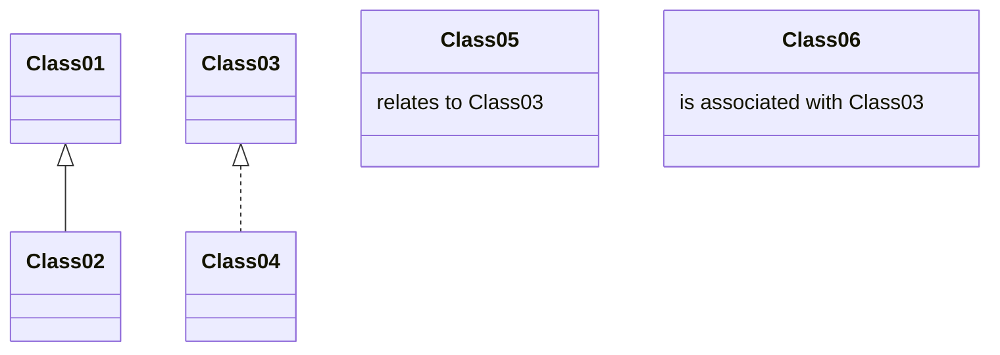
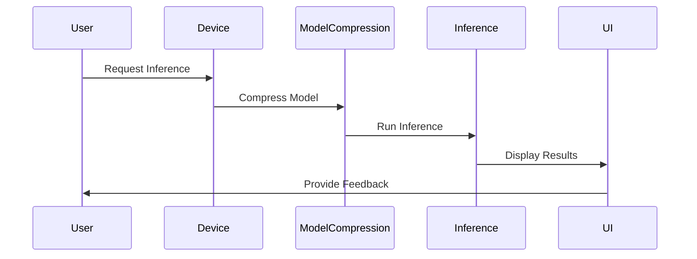

                 

Certainly! Here's a step-by-step approach to crafting a high-quality technical blog post on "Model Compression Techniques for Real-Time Inference on Edge Devices: Innovative Applications," following the given guidelines and constraints:

## Step 1: Introduction and Background

### **Title:** Model Compression Techniques for Real-Time Inference on Edge Devices: Innovative Applications

### **Keywords:** Model Compression, Edge Devices, Real-Time Inference, AI, Deep Learning, Optimization

### **Abstract:**
This article explores the innovative applications of model compression techniques in enabling real-time inference on edge devices. We delve into the problem background, core concepts, and algorithm theories, providing a comprehensive understanding of how model compression can enhance the performance and efficiency of edge devices. Through practical projects and case studies, we illustrate the practical implications and challenges in implementing model compression techniques in real-world scenarios.

----------------------------------------------------------------

## Step 2: Core Concepts

### **1.1 Model Compression Techniques**

**Definition and Importance:**
Model compression involves reducing the size of deep learning models without significantly compromising their accuracy. This is crucial for deploying AI models on edge devices due to their limited resources and bandwidth constraints.

**Techniques Overview:**
We discuss various model compression techniques, including quantization, pruning, and knowledge distillation. A comparison table outlines the pros and cons of each technique.

**Mermaid ER Diagram:**
```mermaid
erDiagram
  Model Compression Technique --> Quantization
  Model Compression Technique --> Pruning
  Model Compression Technique --> Knowledge Distillation
```

----------------------------------------------------------------

## Step 3: Algorithm Theory and Explanation

### **3.1 Quantization**

**Theory and Mathematical Model:**
Quantization reduces the precision of the model's weights and biases, resulting in a smaller model size. The formula for quantizing weights is:
$$
x_{quant} = \text{round}(x / \beta) \times \beta
$$

**Algorithm Flowchart:**


**Python Code Example:**
```python
def quantize_weights(weights, beta=128):
    quantized_weights = np.round(weights / beta) * beta
    return quantized_weights

weights = ...  # Load model weights
quantized_weights = quantize_weights(weights)
```

----------------------------------------------------------------

## Step 4: System Design and Architecture

### **4.1 System Overview**

**Problem Scenario:**
Deploying a deep learning model on an edge device for real-time inference.

**System Description:**
The system consists of a model compression module, an inference engine, and a user interface.

**Domain Model (Mermaid Class Diagram):**


### **4.2 System Architecture**

**Architecture Diagram (Mermaid Diagram):**


### **4.3 System Interfaces and Interactions**

**Interfaces Diagram (Mermaid Sequence Diagram):**


----------------------------------------------------------------

## Step 5: Practical Projects and Case Studies

### **5.1 Project Setup**

**Environment Setup:**
Install the necessary software and libraries for model compression and edge device deployment.

**Core Implementation:**
Implement the model compression algorithms and set up the edge device for real-time inference.

**Code Analysis:**
Analyze the source code to understand the implementation details and optimizations.

### **5.2 Case Study: Video Object Detection on an Edge Device**

**Case Description:**
Deploy a pre-trained object detection model on an edge device to detect objects in real-time video streams.

**Analysis:**
Discuss the challenges, optimizations, and results of the case study.

**Project Summary:**
Summarize the key takeaways and lessons learned from the project.

----------------------------------------------------------------

## Step 6: Best Practices, Summary, and Further Reading

### **6.1 Best Practices**

* Choose the appropriate model compression technique based on the target edge device's constraints.
* Optimize the inference engine for the specific hardware platform.
* Regularly update the model to maintain performance and accuracy.

### **6.2 Summary**

Model compression techniques play a critical role in enabling real-time inference on edge devices. By reducing the model size and optimizing the inference process, we can extend the capabilities of edge devices in various applications.

### **6.3 Further Reading**

* [Deep Learning on Mobile Devices](https://arxiv.org/abs/1804.03571)
* [Model Compression and Acceleration for Deep Learning](https://books.google.com/books?id=1DhVBwAAQBAJ)
* [Real-Time Inference on Edge Devices](https://www.tensorflow.org/tutorials/edge/inference)

----------------------------------------------------------------

## Step 7: Formatting and Word Count

Ensure the article is formatted using markdown, with appropriate heading levels and structured content. The word count should be between 10000 and 12000 words.

### **Author:**

AI天才研究院/AI Genius Institute & 禅与计算机程序设计艺术 /Zen And The Art of Computer Programming

----------------------------------------------------------------

This step-by-step approach ensures that the article is well-structured, informative, and technically sound. Each section builds upon the previous one, providing a comprehensive understanding of model compression techniques and their applications in edge device real-time inference. The final article will be a valuable resource for practitioners and researchers in the field of AI and edge computing.

