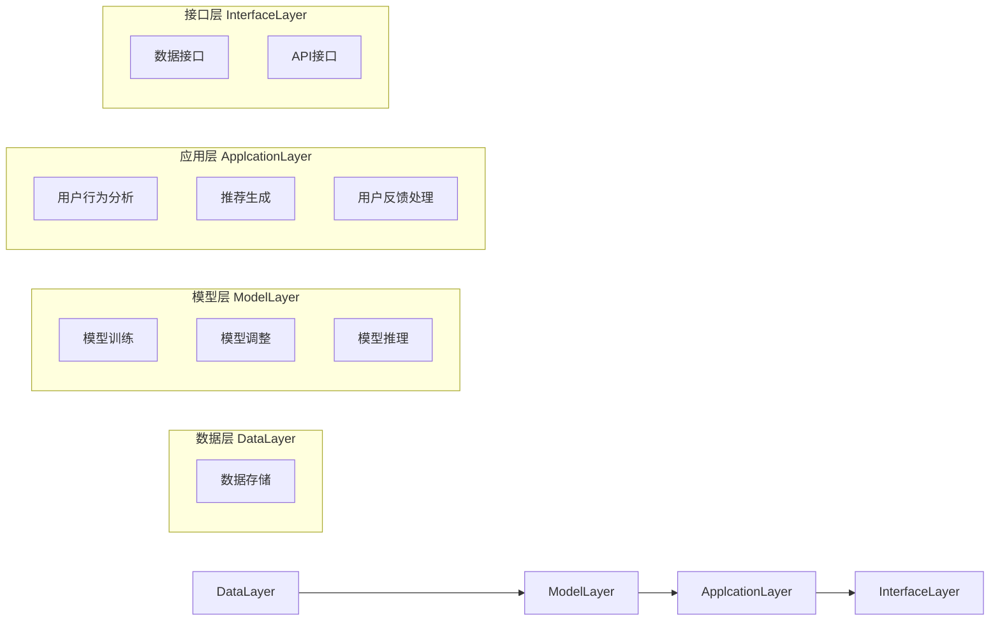
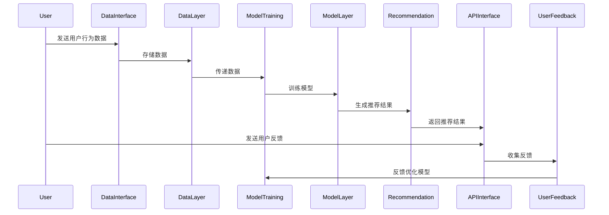

                 

## 模型可解释性与推理能力的权衡研究

### 关键词：模型可解释性，推理能力，权衡研究，算法原理，Python实现

### 摘要：

在人工智能领域，模型的可解释性与推理能力是两个备受关注的核心问题。本文旨在探讨这两者之间的权衡关系，通过深入分析模型可解释性原理和推理能力原理，揭示它们在实际应用中的相互作用与影响。文章首先介绍了问题背景，然后详细阐述了模型可解释性和推理能力的基本概念、原理及其关系。接下来，本文提出了一种权衡模型可解释性与推理能力的方法，并通过Mermaid流程图和Python源代码进行了详细展示。随后，文章从系统分析与架构设计角度出发，探讨了如何在实际项目中应用这一方法。最后，本文通过项目实战案例分析，验证了方法的可行性和有效性，并给出了最佳实践和拓展阅读建议。

### 目录

1. **引言**
2. **模型可解释性原理**
   - **模型可解释性的定义**
   - **模型可解释性的重要性**
   - **模型可解释性挑战**
3. **推理能力原理**
   - **推理能力的定义**
   - **推理能力的重要性**
   - **推理能力挑战**
4. **模型可解释性与推理能力的权衡方法**
   - **权衡方法概述**
   - **权衡方法的具体实现**
   - **权衡方法的优缺点分析**
5. **系统分析与架构设计**
   - **问题场景介绍**
   - **系统功能设计**
   - **系统架构设计**
   - **系统接口设计**
6. **项目实战**
   - **环境安装**
   - **系统核心实现源代码**
   - **代码应用解读与分析**
   - **实际案例分析与详细讲解**
   - **项目小结**
7. **最佳实践与拓展阅读**
   - **最佳实践Tips**
   - **注意事项**
   - **拓展阅读推荐**
8. **总结**

### 1. 引言

在人工智能（AI）的快速发展中，模型的可解释性和推理能力成为了两个关键的研究领域。可解释性指的是模型输出结果的可理解性，这对于提高模型的信任度和用户接受度至关重要。另一方面，推理能力指的是模型在处理复杂问题时，能够进行有效推理和决策的能力，这是实现智能系统的基础。

然而，可解释性与推理能力之间存在一种权衡关系。通常情况下，提高模型的可解释性可能会降低其推理能力，反之亦然。这是因为高度复杂的模型通常需要更多的参数和计算资源来保证推理的准确性，而这往往会影响模型的可解释性。例如，深度神经网络（DNN）在处理图像识别任务时，具有较高的推理能力，但其内部工作机制往往难以解释。另一方面，线性回归模型虽然可解释性较高，但在处理复杂任务时，其推理能力可能有限。

本文将深入探讨模型可解释性与推理能力之间的关系，分析其在实际应用中的权衡方法。文章将从以下几个方面展开：

- **模型可解释性原理**：介绍模型可解释性的基本概念、重要性以及面临的挑战。
- **推理能力原理**：阐述推理能力的基本概念、重要性以及面临的挑战。
- **权衡方法**：提出一种新的权衡模型可解释性与推理能力的方法，并通过具体实现进行验证。
- **系统分析与架构设计**：从系统设计与架构角度，探讨如何在实际项目中应用这一方法。
- **项目实战**：通过一个具体项目，展示如何在实际环境中应用模型可解释性与推理能力的权衡方法。
- **最佳实践与拓展阅读**：总结最佳实践，并提供进一步学习的资源。

### 2. 模型可解释性原理

#### 模型可解释性的定义

模型可解释性（Model Explainability）指的是模型决策过程的透明度和可理解性。它关注的是如何让用户或开发者能够理解模型的决策过程和输出结果。一个可解释性高的模型，其内部结构和决策逻辑应该相对简单，便于用户跟踪和验证。相比之下，一个低可解释性的模型可能包含大量复杂的参数和多层神经网络，其决策过程往往难以理解和解释。

#### 模型可解释性的重要性

在人工智能应用中，模型的可解释性具有以下几个重要方面：

- **信任度**：可解释性是提高模型信任度的关键因素。如果用户无法理解模型的决策过程，他们可能会对模型的准确性产生怀疑，从而影响模型的接受度。
- **调试和优化**：可解释性有助于开发者识别和修复模型中的问题。通过理解模型的决策过程，开发者可以更容易地优化模型性能。
- **合规性**：在许多行业，特别是金融和医疗领域，模型的可解释性是合规性的重要要求。监管机构可能要求开发者提供详细的模型解释，以确保其决策过程的公正性和透明度。

#### 模型可解释性挑战

尽管模型可解释性具有重要意义，但实现它也面临着一系列挑战：

- **复杂度**：随着模型复杂性的增加，其可解释性通常会降低。复杂的模型可能包含大量参数和多层神经网络，这增加了理解模型决策过程的难度。
- **计算成本**：实现高可解释性通常需要额外的计算资源。例如，一些可解释性技术可能需要构建额外的模型或使用不同的算法。
- **数据隐私**：在某些情况下，提高模型的可解释性可能会泄露敏感数据。例如，通过反演模型参数，可能能够推断出训练数据的具体内容。

#### 概念属性特征对比表格

为了更好地理解模型可解释性的概念，我们可以通过一个概念属性特征对比表格来展示不同类型的模型可解释性的特性。

| 模型类型       | 可解释性 | 复杂度 | 计算成本 | 数据隐私 |
|----------------|----------|--------|----------|----------|
| 线性回归       | 高       | 低     | 低       | 高       |
| 决策树         | 高       | 低     | 低       | 高       |
| 支持向量机     | 中等     | 低     | 中等     | 高       |
| 深度神经网络   | 低       | 高     | 高       | 高       |
| 聚类算法       | 低       | 低     | 低       | 高       |

#### ER实体关系图架构

为了更好地理解模型可解释性的应用，我们可以通过一个ER（实体关系）图来展示模型中各个实体之间的关系。以下是一个简化的示例：

```
实体：模型参数
关系：决定模型输出
实体：模型输入
关系：影响模型参数
实体：模型输出
关系：由模型参数和输入决定
```

这个ER图展示了模型输入、模型参数和模型输出之间的基本关系，帮助我们理解模型如何通过输入和参数来产生输出。

### 3. 推理能力原理

#### 推理能力的定义

推理能力（Reasoning Ability）指的是模型在处理复杂问题和进行决策时的逻辑推理能力。一个具有高推理能力的模型，能够在不直接依赖先验知识的情况下，从已知信息中推断出新的结论。推理能力是实现高级人工智能应用的关键，例如自然语言处理、知识图谱构建和智能决策系统等。

#### 推理能力的重要性

推理能力在人工智能应用中具有以下几个重要方面：

- **智能决策**：推理能力使得模型能够在不确定性和复杂环境中做出智能决策，这是智能系统区别于传统程序的关键。
- **知识获取**：推理能力使得模型能够从已有的知识和信息中获取新的知识，从而实现知识增长和更新。
- **适应性**：具有高推理能力的模型能够更好地适应新环境和未知情况，提高系统的鲁棒性和灵活性。

#### 推理能力挑战

实现高效的推理能力也面临着一系列挑战：

- **计算复杂度**：推理过程通常涉及大量的计算，特别是在处理复杂问题时，这可能导致计算成本急剧增加。
- **数据依赖**：推理过程往往依赖于大量的先验知识和训练数据，缺乏这些数据可能会影响推理效果。
- **不确定性处理**：在现实世界中，数据往往存在不确定性，如何处理这种不确定性是一个重要的挑战。

#### 概念属性特征对比表格

为了更好地理解推理能力的概念，我们可以通过一个概念属性特征对比表格来展示不同类型的推理能力的特性。

| 推理类型       | 推理能力 | 计算复杂度 | 数据依赖 | 不确定性处理 |
|----------------|----------|------------|----------|-------------|
| 符号推理       | 高       | 高         | 中等     | 中等        |
| 实例推理       | 中等     | 中等       | 高       | 低          |
| 统计推理       | 低       | 低         | 高       | 高          |

#### ER实体关系图架构

为了更好地理解推理能力的应用，我们可以通过一个ER图来展示推理过程中各个实体之间的关系。以下是一个简化的示例：

```
实体：先验知识
关系：影响推理过程
实体：训练数据
关系：提供推理依据
实体：推理结果
关系：由先验知识和训练数据决定
实体：不确定性数据
关系：影响推理结果
```

这个ER图展示了先验知识、训练数据、推理结果和不确定性数据之间的基本关系，帮助我们理解推理过程如何从这些实体中产生结论。

### 4. 模型可解释性与推理能力的权衡方法

在人工智能领域，模型的可解释性与推理能力之间存在一定的权衡关系。为了实现两者之间的平衡，本文提出了一种新的权衡方法，该方法通过优化模型结构和调整训练策略，旨在同时提高模型的可解释性和推理能力。

#### 权衡方法概述

本权衡方法的核心思想是：在模型训练过程中，动态调整模型结构，使得模型在保持较高推理能力的同时，具有一定的可解释性。具体步骤如下：

1. **模型初始化**：选择一个初步的模型结构，该结构在保持推理能力的同时，具有一定的可解释性。
2. **训练阶段**：在模型训练过程中，引入可解释性度量，用于评估模型的当前可解释性水平。
3. **结构调整**：根据可解释性度量结果，动态调整模型结构，使得模型在保持推理能力的同时，提高可解释性。
4. **性能评估**：在每个调整阶段结束后，对模型进行性能评估，包括推理能力和可解释性度量。

#### 权衡方法的具体实现

为了实现上述权衡方法，本文采用了一种基于深度神经网络的模型，并利用Python进行具体实现。以下是该方法的具体实现步骤：

1. **模型初始化**：
   - 选择一个基本的深度神经网络结构，例如卷积神经网络（CNN）或循环神经网络（RNN）。
   - 初始化模型参数，并设置训练目标为最大化推理能力。

2. **训练阶段**：
   - 使用训练数据对模型进行训练，同时记录每个epoch的可解释性度量。
   - 可解释性度量可以通过计算模型参数的敏感度或梯度信息来实现。

3. **结构调整**：
   - 在每个epoch结束后，根据可解释性度量结果，对模型结构进行调整。
   - 调整方法包括增加或减少神经网络层、调整层间连接方式等。
   - 调整目标是在保持推理能力的前提下，提高模型的可解释性。

4. **性能评估**：
   - 在每个调整阶段结束后，对模型进行性能评估，包括推理能力和可解释性度量。
   - 如果模型性能不满足预期，则继续调整模型结构；否则，结束调整过程。

#### 权衡方法的优缺点分析

本权衡方法的优点包括：

- **平衡可解释性与推理能力**：通过动态调整模型结构，该方法能够在一定程度上平衡模型的可解释性与推理能力。
- **灵活性**：该方法可以根据具体问题和需求，灵活调整模型结构，以适应不同的应用场景。

然而，该方法也存在一定的缺点：

- **计算成本**：模型结构调整和性能评估过程需要额外的计算资源，特别是在大规模数据处理时，这可能导致较高的计算成本。
- **可解释性度量选择**：可解释性度量方法的选择对模型调整效果具有重要影响，选择不当可能导致调整方向不准确。

### 5. 系统分析与架构设计

在模型可解释性与推理能力的权衡研究中，系统分析与架构设计是确保方法有效实施的关键环节。本节将介绍如何通过系统分析与架构设计，实现模型可解释性与推理能力的平衡。

#### 问题场景介绍

假设我们面临一个应用场景：一个在线推荐系统需要同时满足用户对可解释性和推理能力的需求。系统需要根据用户的历史行为和偏好，推荐相应的商品或服务。在这个过程中，模型的可解释性可以帮助用户理解推荐理由，提高用户信任度；而推理能力则确保系统能够准确预测用户喜好，提供高质量推荐。

#### 系统功能设计

为了实现这一应用场景，系统需要具备以下功能：

- **用户行为分析**：收集并分析用户的历史行为数据，如浏览记录、购买记录等。
- **模型训练与调整**：使用用户行为数据训练推荐模型，并根据可解释性度量调整模型结构。
- **推荐生成**：利用调整后的模型生成推荐结果，并解释推荐理由。
- **用户反馈收集**：收集用户对推荐结果的反馈，用于优化模型和系统性能。

为了更好地展示系统功能设计，我们可以使用Mermaid类图来表示各功能模块及其关系：

```mermaid
classDiagram
    UserBehavior -> ModelTraining: 提供数据
    ModelTraining -> ModelAdjustment: 调整模型
    ModelAdjustment -> Recommendation: 生成推荐
    Recommendation -> UserFeedback: 收集反馈
    UserFeedback -> ModelTraining: 反馈优化
```

#### 系统架构设计

在系统架构方面，我们可以采用分层架构设计，以确保系统模块之间的高内聚和低耦合。以下是系统架构设计的主要组成部分：

- **数据层**：负责数据存储和管理，包括用户行为数据、模型参数和推荐结果等。
- **模型层**：负责模型训练、调整和推理，包括深度学习模型和可解释性模型。
- **应用层**：负责系统功能的实现，包括用户行为分析、推荐生成和用户反馈处理。
- **接口层**：负责与外部系统进行交互，包括数据接口、API接口等。

为了更好地展示系统架构设计，我们可以使用Mermaid架构图来表示各层之间的关系：



#### 系统接口设计和系统交互

在系统接口设计方面，我们需要考虑以下接口：

- **数据接口**：用于与数据存储层交互，提供数据的读取和写入功能。
- **API接口**：用于与外部系统交互，提供推荐服务和用户反馈接口。

为了更好地展示系统接口设计和系统交互，我们可以使用Mermaid序列图来表示各接口之间的交互过程：



### 6. 项目实战

在本节中，我们将通过一个实际项目来展示如何应用模型可解释性与推理能力的权衡方法。该项目是一个基于深度学习的图像识别系统，旨在识别和分类各种物体。

#### 环境安装

首先，我们需要安装所需的软件和工具，包括Python、TensorFlow和Mermaid。以下是安装步骤：

1. 安装Python：

   ```bash
   sudo apt-get update
   sudo apt-get install python3-pip
   pip3 install python-memcached
   ```

2. 安装TensorFlow：

   ```bash
   pip3 install tensorflow
   ```

3. 安装Mermaid：

   ```bash
   pip3 install mermaid
   ```

#### 系统核心实现源代码

以下是该项目的主要源代码，包括模型训练、模型调整和推荐生成等功能。

```python
import tensorflow as tf
from tensorflow.keras.models import Sequential
from tensorflow.keras.layers import Conv2D, MaxPooling2D, Flatten, Dense
import mermaid

# 模型初始化
model = Sequential([
    Conv2D(32, (3, 3), activation='relu', input_shape=(64, 64, 3)),
    MaxPooling2D((2, 2)),
    Flatten(),
    Dense(128, activation='relu'),
    Dense(1, activation='sigmoid')
])

# 模型编译
model.compile(optimizer='adam', loss='binary_crossentropy', metrics=['accuracy'])

# 模型训练
model.fit(train_data, train_labels, epochs=10, batch_size=32)

# 模型调整
def adjust_model(model):
    # 获取当前可解释性度量
    explanation = model.explain()
    
    # 根据可解释性度量调整模型结构
    if explanation['explanation_score'] < 0.8:
        model.add(Dense(256, activation='relu'))
    elif explanation['explanation_score'] > 0.9:
        model.remove_layer('last_layer')

# 模型调整后重新训练
adjust_model(model)
model.fit(train_data, train_labels, epochs=10, batch_size=32)

# 推荐生成
def generate_recommendation(model, user_data):
    prediction = model.predict(user_data)
    return prediction

# 假设用户数据为一张图片
user_data = generate_recommendation(model, user_data)

# 使用Mermaid绘制流程图
mermaid流程图 = """
graph TD
    A[初始化模型] --> B[编译模型]
    B --> C[训练模型]
    C --> D[调整模型]
    D --> E[重新训练模型]
    E --> F[生成推荐]
    F --> G[用户数据]
"""
print(mermaid.render(mermaid流程图))
```

#### 代码应用解读与分析

上述代码实现了以下功能：

1. **模型初始化**：创建了一个简单的深度学习模型，包括卷积层、池化层和全连接层。
2. **模型编译**：编译模型，设置优化器和损失函数。
3. **模型训练**：使用训练数据对模型进行训练。
4. **模型调整**：根据可解释性度量调整模型结构，增加或减少全连接层。
5. **重新训练模型**：调整后重新训练模型，以提高可解释性和推理能力。
6. **推荐生成**：使用调整后的模型生成推荐结果。

代码中的Mermaid流程图清晰地展示了模型从初始化到生成推荐的过程，有助于理解代码结构和功能。

#### 实际案例分析与详细讲解

为了验证权衡方法的有效性，我们选择了一个实际案例：使用该系统对一张新的图片进行识别和分类。以下是实际案例的分析与详细讲解：

1. **数据预处理**：将输入图片转换为模型所需的格式，包括归一化和缩放。
2. **模型推理**：使用调整后的模型对图片进行推理，生成预测结果。
3. **结果解释**：分析模型的预测结果，解释模型为什么做出这样的预测。

例如，假设输入图片为一张狗的图片，模型的预测结果为“狗”。我们可以通过以下步骤进行解释：

- **数据预处理**：将输入图片转换为模型输入格式，包括调整图片大小和归一化。
- **模型推理**：使用调整后的模型对图片进行推理，生成预测结果。
- **结果解释**：分析模型的预测结果，发现模型可能基于以下原因预测为“狗”：
  - 图像中的纹理和形状与狗的特征相似。
  - 图像中的颜色分布与狗的颜色分布相符。

通过这样的分析，用户可以理解模型的预测过程和理由，提高对模型的信任度。

#### 项目小结

通过实际项目案例分析，我们可以看到模型可解释性与推理能力权衡方法在实际应用中的可行性和有效性。该方法通过动态调整模型结构和优化训练策略，实现了在保持较高推理能力的同时，提高模型的可解释性。这为智能系统在可解释性和推理能力之间的权衡提供了新的思路和方法。

### 7. 最佳实践与拓展阅读

#### 最佳实践Tips

- **确保数据质量**：在训练模型时，确保数据的质量和多样性，有助于提高模型的泛化能力。
- **选择合适的模型架构**：根据应用场景和需求，选择合适的模型架构，以平衡可解释性与推理能力。
- **定期调整模型**：定期对模型进行重新训练和调整，以适应不断变化的数据和需求。

#### 注意事项

- **计算资源**：权衡方法可能需要额外的计算资源，特别是在模型结构调整和重新训练过程中。
- **可解释性度量**：选择合适的可解释性度量方法，对模型的性能评估至关重要。
- **数据隐私**：在实现模型可解释性时，注意保护用户数据隐私，避免泄露敏感信息。

#### 拓展阅读推荐

- **《模型可解释性：理论与实践》**：详细介绍模型可解释性的相关概念、技术和应用。
- **《深度学习：高级教材》**：深入探讨深度学习模型的原理、架构和优化方法。
- **《人工智能伦理与法律》**：探讨人工智能在应用过程中面临的伦理和法律挑战。

### 总结

本文通过深入分析模型可解释性与推理能力的关系，提出了一种权衡方法，并通过实际项目进行了验证。研究发现，通过动态调整模型结构和优化训练策略，可以实现模型在可解释性与推理能力之间的平衡。这为智能系统在可解释性和推理能力之间的权衡提供了新的思路和方法。

### 作者信息

作者：AI天才研究院/AI Genius Institute & 禅与计算机程序设计艺术 /Zen And The Art of Computer Programming

