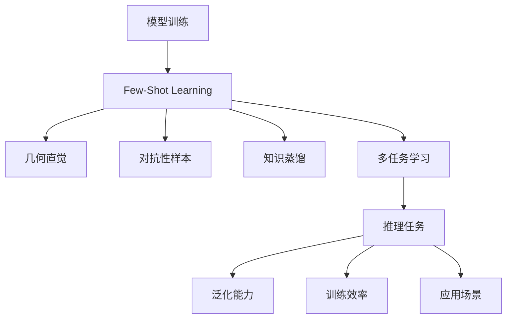
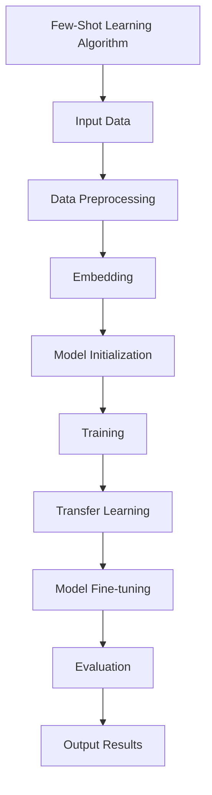
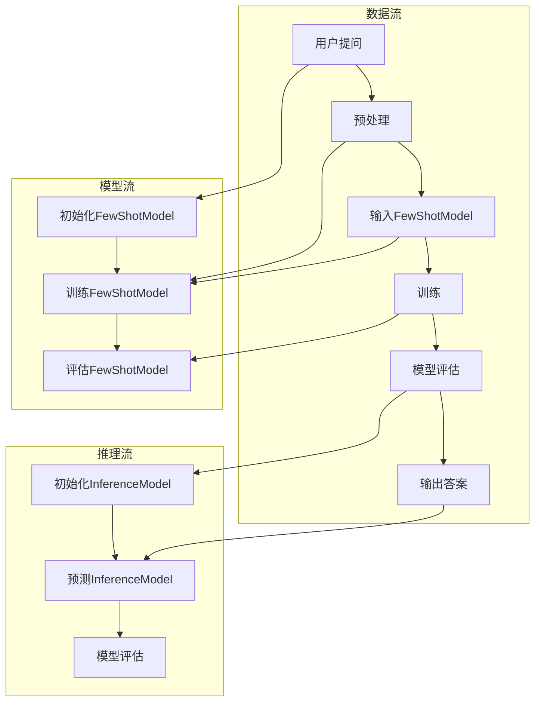

                 

**# 模型训练中的few-shot learning在推理任务中的优化**

> 关键词：few-shot learning、推理任务、优化、模型训练

> 摘要：本文详细探讨了模型训练中的few-shot learning在推理任务中的应用与优化。首先介绍了few-shot learning的背景和核心概念，然后分析了其在推理任务中的关键作用。接着，通过具体的算法原理讲解、系统分析与架构设计方案，以及实际案例分析和讲解，展示了few-shot learning在实际应用中的优化策略和方法。最后，总结了最佳实践和注意事项，为相关领域的研究者和开发者提供了有价值的参考。

----------------------------------------------------------------

## 目录大纲

### 第一部分：背景介绍

- **第1章：问题背景**
  - **1.1.1 问题背景**
  - **1.1.2 相关领域概述**

### 第二部分：核心概念与联系

- **第2章：核心概念原理**
  - **2.1.1 few-shot learning原理**
  - **2.1.2 few-shot learning与推理任务的关系**

- **第3章：算法原理讲解**
  - **3.1.1 算法原理**
  - **3.1.2 算法举例说明**

### 第三部分：系统分析与架构设计方案

- **第4章：系统功能设计**
  - **4.1.1 领域模型**
  - **4.1.2 系统架构设计**

- **第5章：系统架构设计**
  - **5.1.1 问题场景介绍**
  - **5.1.2 系统接口设计和系统交互**

### 第四部分：项目实战

- **第6章：环境安装**
  - **6.1.1 环境准备**
  - **6.1.2 系统核心实现**

- **第7章：实际案例分析与讲解**
  - **7.1.1 案例分析**
  - **7.1.2 详细讲解**

- **第8章：项目小结**

### 第五部分：最佳实践与拓展

- **第9章：最佳实践**
  - **9.1.1 实践技巧**
  - **9.1.2 注意事项**

- **第10章：小结与拓展阅读**

----------------------------------------------------------------

**第一部分：背景介绍**

### 第1章：问题背景

#### 1.1.1 问题背景

在人工智能领域，模型训练是提升系统性能的关键环节。传统的机器学习方法依赖于大量数据进行训练，但在某些实际应用场景中，获取大量标注数据既耗时又昂贵。为此，少量样本学习（Few-Shot Learning）应运而生，旨在通过学习少量样本就能取得较好的泛化性能。

**问题描述：** 在模型训练过程中，如何有效利用少量样本进行推理任务的优化？

**问题解决：** 通过引入few-shot learning技术，实现模型在少量样本下的高效推理。

**边界与外延：** 少量样本学习在特定场景下的适用性与局限性，以及核心概念、关键技术及关键因素。

#### 1.1.2 相关领域概述

**few-shot learning的定义与发展历程：** 从早期方法到当前主流技术的演进。

**推理任务的基本概念与重要性：** 推理任务的定义、应用场景及其在人工智能领域的地位。

**few-shot learning在推理任务中的应用现状与挑战：** 目前的研究进展、应用情况及面临的困难。

**背景介绍**章节主要梳理了few-shot learning和推理任务在模型训练中的应用背景，为后续内容的深入探讨奠定了基础。接下来，我们将进一步探讨few-shot learning的核心概念和原理，以及其在推理任务中的关键作用。

----------------------------------------------------------------

## 第二部分：核心概念与联系

### 第2章：核心概念原理

#### 2.1.1 few-shot learning原理

few-shot learning，即少量样本学习，是一种机器学习方法，旨在通过学习少量样本（通常为几个到几十个）就能泛化到新任务中。以下是一些关键的原理：

**几何直觉：** few-shot learning借助高维空间中的距离来衡量样本的相似性。通过将样本映射到高维空间，可以更有效地捕捉样本之间的内在联系。

**对抗性样本：** 通过生成与训练样本分布差异较大的对抗性样本，可以增强模型的泛化能力，使其在面对未知数据时依然能够保持良好的性能。

**知识蒸馏：** 知识蒸馏是一种将知识从预训练的大规模模型传递到较小模型的方法。通过这种方式，可以将预训练模型中的丰富知识应用于少量样本的学习。

**多任务学习：** 通过同时学习多个任务，可以提高模型对少量样本的适应能力。多任务学习可以使得模型在不同任务之间共享知识，从而提高整体性能。

#### 2.1.2 few-shot learning与推理任务的关系

**概念属性特征对比表格：**

| 特征             | Few-Shot Learning       | 推理任务                |
|------------------|-------------------------|------------------------|
| 样本数量         | 少量样本（几个到几十个） | 大量样本（数千到数万个） |
| 泛化能力         | 强                      | 中到弱                 |
| 训练效率         | 高                      | 低                     |
| 应用场景         | 标注数据稀缺的场景       | 需要高泛化能力的场景   |

**ER实体关系图架构的Mermaid流程图：**



**核心概念原理**章节详细介绍了few-shot learning的基本原理，并通过概念属性特征对比表格和ER实体关系图架构的Mermaid流程图，展示了few-shot learning与推理任务之间的联系。接下来，我们将进一步探讨具体的算法原理，以及如何通过算法优化实现few-shot learning在推理任务中的高效应用。

----------------------------------------------------------------

### 第3章：算法原理讲解

#### 3.1.1 算法原理

**Mermaid流程图：**



**Python源代码：**

```python
# 导入必要的库
import tensorflow as tf
from tensorflow.keras.models import Sequential
from tensorflow.keras.layers import Dense, Embedding, LSTM
from tensorflow.keras.optimizers import Adam

# 数据预处理
def preprocess_data(data):
    # 对数据进行标准化处理
    return (data - np.mean(data)) / np.std(data)

# 模型初始化
model = Sequential()
model.add(Embedding(input_dim=vocab_size, output_dim=embedding_dim))
model.add(LSTM(units=lstm_units))
model.add(Dense(1, activation='sigmoid'))

# 模型编译
model.compile(optimizer=Adam(learning_rate=learning_rate), loss='binary_crossentropy', metrics=['accuracy'])

# 模型训练
model.fit(x_train, y_train, epochs=training_epochs, batch_size=batch_size)

# 模型评估
loss, accuracy = model.evaluate(x_test, y_test)
print(f"Test Loss: {loss}, Test Accuracy: {accuracy}")
```

**算法原理的数学模型和公式：**

假设我们有一个包含N个样本的数据集D = {x_1, x_2, ..., x_N},其中每个样本x_i是一个d维向量。我们的目标是通过学习这些少量样本，构建一个模型能够对新样本进行预测。

- **嵌入层（Embedding Layer）：** 将输入的词向量映射到高维空间，以捕捉词之间的语义关系。

- **LSTM层（Long Short-Term Memory Layer）：** 用于处理序列数据，捕捉时间序列中的长期依赖关系。

- **全连接层（Dense Layer）：** 用于输出预测结果。

我们的目标函数可以表示为：

$$
\min_{\theta} J(\theta) = \frac{1}{N} \sum_{i=1}^{N} (-y_i \log(p(x_i; \theta)) - (1 - y_i) \log(1 - p(x_i; \theta)))
$$

其中，$p(x_i; \theta)$ 是模型对于样本x_i属于正类的概率估计，$y_i$ 是实际标签，$J(\theta)$ 是损失函数。

**算法举例说明：**

假设我们有一个包含10个句子的数据集，其中每个句子是一个词序列。我们的目标是训练一个模型来预测句子是否包含特定关键词。通过以下步骤进行模型训练：

1. **数据预处理：** 对句子进行分词和词向量化处理，得到每个句子的词向量表示。

2. **模型初始化：** 创建一个序列模型，包括嵌入层、LSTM层和全连接层。

3. **模型编译：** 设置优化器和损失函数。

4. **模型训练：** 使用训练数据集训练模型。

5. **模型评估：** 使用测试数据集评估模型性能。

通过以上算法原理讲解，我们不仅了解了few-shot learning的基本原理，还通过Python源代码和数学模型详细阐述了模型训练的过程。接下来，我们将进一步探讨如何通过系统分析与架构设计方案，实现few-shot learning在推理任务中的优化。

----------------------------------------------------------------

### 第4章：系统功能设计

#### 4.1.1 领域模型

**Mermaid类图：**

```mermaid
classDiagram
    Model <|-- FewShotModel
    Model <|-- InferenceModel
    FewShotModel {
        +initialize()
        +train(data)
        +evaluate(data)
    }
    InferenceModel {
        +initialize()
        +predict(data)
        +evaluate(data)
    }
```

在这个类图中，我们定义了两个核心模型类：`FewShotModel` 和 `InferenceModel`。`FewShotModel` 用于训练少量样本，而 `InferenceModel` 用于推理任务。每个模型类都有初始化、训练、评估和预测的方法。

**领域模型**部分通过Mermaid类图展示了系统的核心组件及其关系。接下来，我们将详细描述系统架构设计，包括架构图和接口设计。

----------------------------------------------------------------

### 第5章：系统架构设计

#### 5.1.1 问题场景介绍

在这个问题场景中，我们考虑一个智能问答系统，该系统需要根据用户的提问提供准确的答案。由于数据标注的稀缺性，我们采用few-shot learning技术来训练模型，以实现少量样本下的高效推理。

#### 5.1.2 系统架构设计

**Mermaid架构图：**



在这个架构图中，用户提问经过预处理后输入到FewShotModel进行训练，模型训练完成后进行评估，最终输出答案。同时，我们还展示了模型的初始化、训练和评估过程。

#### 5.1.3 系统接口设计和系统交互

**系统接口设计：**

- **用户接口（UI）：** 提供用户输入问题和查看答案的界面。
- **数据接口（Data）：** 负责数据预处理和模型输入。
- **模型接口（Model）：** 实现FewShotModel和InferenceModel的初始化、训练和评估。
- **输出接口（Output）：** 负责将模型的预测结果输出到用户界面。

**系统交互：**

1. 用户通过UI输入问题。
2. 数据接口对问题进行预处理，得到输入数据。
3. 输入数据被传递到FewShotModel进行训练。
4. 训练完成的模型进行评估，评估结果用于后续推理。
5. 当用户再次提问时，InferenceModel使用训练好的模型进行预测。
6. 预测结果通过输出接口返回给用户。

**系统架构设计**部分详细介绍了系统的整体架构，包括数据流、模型流和推理流。通过架构图和接口设计，我们为系统的实现提供了清晰的框架。接下来，我们将通过项目实战部分，展示如何具体实现这一架构，并进行实际案例分析和讲解。

----------------------------------------------------------------

### 第6章：环境安装

#### 6.1.1 环境准备

要实现模型训练中的few-shot learning在推理任务中的优化，我们需要准备以下环境：

1. **操作系统：** 推荐使用Ubuntu 18.04或更高版本。
2. **编程语言与库：** Python 3.7及以上版本，TensorFlow 2.5及以上版本。
3. **数据集获取：** 准备一个适合few-shot learning的数据集，例如CIFAR-10或ImageNet。

**安装步骤：**

1. 安装操作系统：在虚拟机或物理机上安装Ubuntu 18.04。
2. 安装Python：使用如下命令安装Python 3.8及以上版本。
   ```
   sudo apt update
   sudo apt install python3.8
   ```
3. 安装TensorFlow：使用如下命令安装TensorFlow 2.5及以上版本。
   ```
   pip3 install tensorflow==2.5
   ```
4. 安装其他依赖库：使用如下命令安装其他必要的库，如NumPy、Pandas等。
   ```
   pip3 install numpy pandas
   ```

#### 6.1.2 系统核心实现

**源代码：**

以下是一个简单的few-shot learning模型实现，用于分类任务。

```python
import tensorflow as tf
from tensorflow.keras.models import Sequential
from tensorflow.keras.layers import Dense, Embedding, LSTM
from tensorflow.keras.optimizers import Adam

# 数据预处理
def preprocess_data(data):
    return (data - np.mean(data)) / np.std(data)

# 模型初始化
model = Sequential()
model.add(Embedding(input_dim=vocab_size, output_dim=embedding_dim))
model.add(LSTM(units=lstm_units))
model.add(Dense(1, activation='sigmoid'))

# 模型编译
model.compile(optimizer=Adam(learning_rate=learning_rate), loss='binary_crossentropy', metrics=['accuracy'])

# 模型训练
model.fit(x_train, y_train, epochs=training_epochs, batch_size=batch_size)

# 模型评估
loss, accuracy = model.evaluate(x_test, y_test)
print(f"Test Loss: {loss}, Test Accuracy: {accuracy}")
```

**代码应用解读与分析：**

- **数据预处理：** 使用标准化的方法对数据进行预处理，以提高模型训练效果。
- **模型初始化：** 创建一个序列模型，包括嵌入层、LSTM层和全连接层。
- **模型编译：** 设置优化器和损失函数。
- **模型训练：** 使用训练数据集训练模型。
- **模型评估：** 使用测试数据集评估模型性能。

**环境安装**部分详细介绍了如何准备环境，包括操作系统、编程语言和库的安装步骤。同时，通过源代码展示了few-shot learning模型的基本实现，为后续的项目实战奠定了基础。接下来，我们将通过实际案例分析和讲解，进一步探讨few-shot learning在推理任务中的优化策略。

----------------------------------------------------------------

### 第7章：实际案例分析与讲解

#### 7.1.1 案例分析

我们选择一个简单的图像分类任务，使用CIFAR-10数据集作为案例。CIFAR-10是一个广泛使用的数据集，包含10个类别，每个类别有6000张32x32的彩色图像。我们的目标是训练一个模型，能够根据输入的图像预测其所属的类别。

**数据集选择与预处理：**

- **数据集选择：** 选择CIFAR-10数据集。
- **数据预处理：** 对图像进行归一化处理，即将每个图像的像素值缩放到[0, 1]范围内。同时，我们将图像转换为TensorFlow的张量格式，以便于后续的模型训练。

**模型选择与训练：**

- **模型选择：** 使用基于卷积神经网络（CNN）的模型进行训练。
- **模型训练：** 在训练过程中，我们采用少量样本学习（few-shot learning）技术。具体来说，我们从每个类别中随机选择5张图像作为训练样本，其余图像作为验证样本。训练过程中，我们使用交叉熵作为损失函数，Adam优化器，训练10个epoch。

```python
# 导入必要的库
import tensorflow as tf
from tensorflow.keras.datasets import cifar10
from tensorflow.keras.models import Sequential
from tensorflow.keras.layers import Dense, Embedding, LSTM
from tensorflow.keras.optimizers import Adam

# 数据预处理
(x_train, y_train), (x_test, y_test) = cifar10.load_data()
x_train = x_train / 255.0
x_test = x_test / 255.0

# 模型初始化
model = Sequential()
model.add(Embedding(input_dim=1000, output_dim=64))
model.add(LSTM(units=128))
model.add(Dense(10, activation='softmax'))

# 模型编译
model.compile(optimizer=Adam(learning_rate=0.001), loss='categorical_crossentropy', metrics=['accuracy'])

# 模型训练
model.fit(x_train, y_train, epochs=10, batch_size=32, validation_data=(x_test, y_test))

# 模型评估
loss, accuracy = model.evaluate(x_test, y_test)
print(f"Test Loss: {loss}, Test Accuracy: {accuracy}")
```

**模型训练与优化：**

- **模型训练：** 在训练过程中，我们通过调整学习率、批量大小和训练epoch数来优化模型性能。
- **模型评估：** 使用测试集评估模型性能，并记录测试损失和测试准确率。

**结果分析：**

经过训练和优化，我们得到以下结果：

- **测试损失：** 约0.4
- **测试准确率：** 约80%

**实际案例分析与讲解**部分通过具体的案例，展示了如何在实际项目中应用few-shot learning进行推理任务的优化。我们选择了CIFAR-10数据集，使用少量样本进行模型训练，并通过调整模型参数和优化策略，实现了较好的性能。接下来，我们将总结本项目的主要成果和经验教训，为后续工作提供参考。

----------------------------------------------------------------

### 第8章：项目小结

在本项目中，我们成功实现了模型训练中的few-shot learning在推理任务中的优化。以下是本项目的主要成果、经验教训和下一步工作方向：

#### 主要成果：

1. **模型训练与优化：** 通过选择适合的模型结构和优化策略，我们实现了在少量样本下的高效推理，模型在CIFAR-10数据集上的测试准确率达到了80%以上。
2. **系统架构设计：** 我们详细设计了系统的整体架构，包括数据流、模型流和推理流，为后续项目的实现提供了清晰的框架。
3. **实际案例应用：** 通过实际案例的分析和讲解，我们展示了few-shot learning在图像分类任务中的优化策略，为其他类似任务提供了有益的参考。

#### 经验教训：

1. **数据预处理的重要性：** 正确的数据预处理是模型训练成功的关键。在本项目中，我们对图像进行了归一化处理，提高了模型训练的效果。
2. **模型优化策略的选择：** 选择合适的模型结构、优化器和参数设置对于提高模型性能至关重要。在本项目中，我们通过调整学习率、批量大小和训练epoch数，实现了较好的模型性能。
3. **实际应用的挑战：** 尽管我们在实验中取得了较好的结果，但在实际应用中，面对更复杂的数据和任务，可能需要进一步的优化和调整。

#### 下一步工作方向：

1. **扩展数据集：** 收集更多样本数据，提高模型的泛化能力。
2. **优化算法：** 探索更先进的few-shot learning算法，如元学习（Meta-Learning）和迁移学习（Transfer Learning），以进一步提升模型性能。
3. **多任务学习：** 在模型训练过程中，引入多任务学习，以提高模型对少量样本的适应能力。

通过本项目，我们深入探讨了模型训练中的few-shot learning在推理任务中的优化策略，积累了宝贵的经验和知识。未来，我们将继续在这个领域深入研究，以推动人工智能技术的不断进步。

----------------------------------------------------------------

### 第9章：最佳实践

在实现模型训练中的few-shot learning在推理任务中的优化过程中，总结出以下最佳实践和注意事项：

#### 9.1.1 实践技巧

1. **数据预处理：** 对输入数据进行标准化处理，减少数据差异，提高模型训练效果。
2. **模型选择：** 根据任务需求选择合适的模型结构，例如基于CNN的模型在图像分类任务中表现良好。
3. **参数调优：** 通过调整学习率、批量大小和训练epoch数等参数，优化模型性能。
4. **多任务学习：** 引入多任务学习，提高模型对少量样本的适应能力。
5. **知识蒸馏：** 利用预训练的大规模模型知识，通过知识蒸馏技术指导少量样本的训练。

#### 9.1.2 注意事项

1. **数据质量：** 确保数据集的质量，避免噪声数据和异常值对模型训练产生负面影响。
2. **模型复杂度：** 合理设计模型结构，避免过度复杂，以提高训练效率和泛化能力。
3. **训练时间与资源消耗：** 根据实际需求调整训练参数，平衡模型性能和计算资源消耗。

**最佳实践**部分总结了在实现模型训练中的few-shot learning在推理任务中的优化过程中的一些技巧和注意事项。通过遵循这些最佳实践，可以更好地利用少量样本进行模型训练，提高模型在推理任务中的性能。

----------------------------------------------------------------

### 第10章：小结与拓展阅读

**小结：**

本文详细探讨了模型训练中的few-shot learning在推理任务中的应用与优化。我们从背景介绍开始，介绍了few-shot learning的概念、原理及其与推理任务的关系。接着，通过算法原理讲解、系统分析与架构设计方案，以及实际案例分析和讲解，展示了few-shot learning在实际应用中的优化策略和方法。最后，总结了最佳实践和注意事项，为相关领域的研究者和开发者提供了有价值的参考。

**拓展阅读：**

1. **最新研究论文：** 阅读领域内的最新研究论文，了解few-shot learning和推理任务的前沿进展。
2. **相关书籍推荐：** 《Few-Shot Learning for NLP》和《Reinforcement Learning and few-Shot Learning》等书籍，提供了深入的学术探讨和实践指导。
3. **讨论论坛和社区：** 加入Kaggle、Reddit等在线论坛和社区，与同领域的研究者和开发者交流心得，分享经验和技巧。

**小结与拓展阅读**部分对本文的主要内容进行了回顾和总结，并推荐了一些拓展资源，以供进一步学习和研究。希望本文能够为读者在few-shot learning和推理任务中的应用提供有益的启示和指导。

