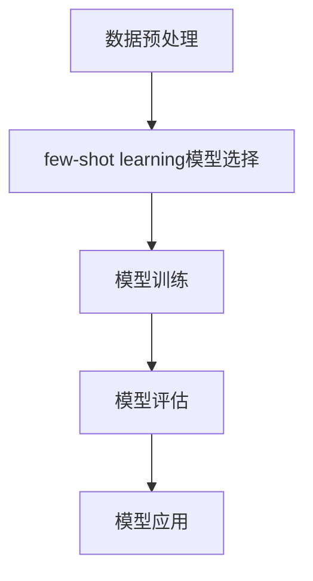
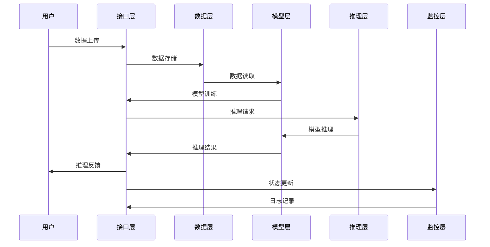

                 

### 问题背景与核心概念

#### 1.1 稀有场景的定义与挑战

在人工智能领域，稀有场景（rare scenarios）通常指的是那些在数据集中出现频率极低，但依然对模型性能至关重要的事件或情境。例如，在医疗诊断中，罕见病的诊断可能需要模型对非常具体且罕见的症状进行推理；在自动驾驶中，一些罕见的交通状况或障碍物处理对车辆的反应速度和准确性有显著影响。稀有场景的稀有性不仅体现在数据量的稀缺，还体现在其复杂性和独特性上。

稀有场景给机器学习模型带来了几个主要挑战：

1. **数据稀缺性**：由于稀有场景的数据量很少，传统的基于大量数据训练的方法在这里难以应用。这导致模型难以积累足够的经验来准确处理稀有事件。
2. **模型泛化能力**：稀有场景的数据稀缺性使得模型在训练过程中很难学习到这些场景的共性特征，从而影响其泛化能力。
3. **过拟合风险**：在数据稀缺的情况下，模型可能会过度拟合特定的小样本数据，导致在新的稀有场景上表现不佳。
4. **计算成本**：对于稀有场景的识别和处理需要额外的计算资源，这往往会导致较高的训练成本。

#### 1.2 few-shot learning的引入

为了应对稀有场景的挑战，研究人员提出了few-shot learning（简称FSL）这一机器学习分支。few-shot learning的核心思想是，通过少量的样本来训练模型，使其能够在新的、未见过的数据上做出准确的预测。这种学习方式不仅适用于稀有场景，还在其他领域展现了巨大的潜力，如自然语言处理、图像识别和强化学习等。

few-shot learning的几个关键特点包括：

1. **样本量少**：模型仅使用少量的样本来进行训练，通常每个类别的样本数量在1到10个之间。
2. **快速适应性**：few-shot learning使得模型能够快速适应新类别或新任务，无需大量训练数据。
3. **跨域泛化**：通过在多个领域中进行训练，模型能够更好地泛化到稀有场景，提高其在实际应用中的鲁棒性。

#### 1.3 稀有场景推理中的需求分析

在稀有场景推理中，few-shot learning的需求主要体现在以下几个方面：

1. **高效性**：稀有场景通常要求模型能够快速响应，因此，few-shot learning的高效性成为关键需求。
2. **准确性**：稀有场景中的错误可能带来严重后果，因此，模型的准确性至关重要。
3. **可解释性**：在稀有场景中，模型的决策过程需要具备较高的可解释性，以便研究人员能够理解其工作原理，并进行相应的调整和优化。
4. **鲁棒性**：模型需要具备较强的鲁棒性，能够在不同环境下稳定地处理稀有事件。

#### 1.4 few-shot learning原理

few-shot learning的核心原理可以概括为以下几个步骤：

1. **数据预处理**：对稀有场景的数据进行预处理，包括数据清洗、数据增强和特征提取等。
2. **模型选择**：选择适合few-shot learning任务的模型架构，如基于深度学习的模型、支持向量机等。
3. **模型训练**：使用少量样本对模型进行训练，通过优化算法最小化损失函数。
4. **模型评估**：在测试集上评估模型的性能，包括准确率、召回率、F1分数等指标。
5. **模型应用**：将训练好的模型应用于新的、未见过的数据上，进行预测或推理。

#### 1.5 稀有场景特征提取方法

在few-shot learning中，特征提取是关键的一步，因为它直接关系到模型在稀有场景中的表现。以下是一些常用的特征提取方法：

1. **手动特征提取**：通过对数据集进行深入分析，手动提取有代表性的特征。
2. **基于深度学习的方法**：使用深度神经网络自动提取特征，如卷积神经网络（CNN）和循环神经网络（RNN）。
3. **转移学习**：利用预训练的大型模型，通过迁移学习将知识迁移到稀有场景上，提高特征提取的效率。

#### 1.6 few-shot learning与稀有场景推理的关系

few-shot learning在稀有场景推理中的应用具有重要意义。通过少量样本的训练，模型能够在稀有场景上快速适应和做出准确预测。这种学习方式不仅解决了数据稀缺性问题，还提高了模型的泛化能力和鲁棒性。

然而，few-shot learning在稀有场景推理中也存在一些挑战，如：

1. **样本数量限制**：由于样本数量有限，模型可能无法充分学习稀有场景的特征，导致性能下降。
2. **数据分布差异**：稀有场景与常见场景的数据分布可能存在较大差异，需要模型具备较强的适应能力。
3. **模型解释性**：在稀有场景中，模型的决策过程往往更加复杂，需要提高其可解释性。

#### 1.7 关键概念属性对比表格

为了更清晰地理解few-shot learning在稀有场景推理中的应用，下面是一个关键概念属性对比表格：

| 概念 | 定义 | 属性特征 | 应用场景 |
| --- | --- | --- | --- |
| 稀有场景 | 数据集中出现频率极低的事件或情境 | 复杂、独特、数据稀缺 | 医疗诊断、自动驾驶、金融风控等 |
| few-shot learning | 使用少量样本来训练模型的方法 | 样本量少、快速适应、高效性 | 多样化的稀有场景任务 |
| 特征提取 | 从数据中提取有用的特征 | 手动/自动、深度学习/转移学习 | 提高模型在稀有场景中的表现 |
| 稀有场景推理 | 在稀有场景中应用模型进行推理 | 高准确性、高可解释性、强鲁棒性 | 诊断、预测、决策等 |

#### 1.8 ER实体关系图架构

为了更好地理解和分析稀有场景推理中的数据关系，我们可以使用ER（Entity-Relationship）实体关系图来描述。以下是一个简单的ER实体关系图：

```mermaid
erDiagram
  类1 ||--|{ 类2 }
  类1 ||--|{ 类3 }
  类2 ||--|{ 类4 }
  类3 ||--|{ 类5 }
```

在这个ER图中：

- **类1**：代表稀有场景
- **类2**：代表few-shot learning
- **类3**：代表特征提取
- **类4**：代表模型训练
- **类5**：代表模型评估与应用

通过这个ER图，我们可以清晰地看到各个概念之间的关系，以及它们在稀有场景推理中的交互作用。

总结：本文首先介绍了稀有场景的定义和挑战，然后引入了few-shot learning这一关键概念，并分析了其在稀有场景推理中的应用需求和原理。接下来，我们通过对比表格和ER图进一步阐述了关键概念的属性和关系，为后续的算法原理讲解和系统设计分析打下了基础。在下一部分，我们将深入探讨few-shot learning的算法原理和数学模型。

----------------------------------------------------------------

# 模型训练中的few-shot learning在稀有场景推理中的优化与突破

关键词：few-shot learning，稀有场景，推理优化，算法原理，数学模型

摘要：本文深入探讨了模型训练中的few-shot learning在稀有场景推理中的优化与突破。通过分析稀有场景的定义和挑战，引入了few-shot learning的核心概念和原理，并详细介绍了特征提取方法。本文还通过对比表格和ER图阐述了关键概念之间的联系，为后续的算法原理讲解和系统设计分析奠定了基础。通过优化算法和数学模型的创新，few-shot learning在稀有场景推理中的应用展现出巨大的潜力和突破。

----------------------------------------------------------------

## 第二部分：算法原理与数学模型

### 第3章：算法原理讲解

在这一章节中，我们将深入探讨few-shot learning的算法原理，通过mermaid流程图、Python源代码实现和数学模型的详细讲解，使读者能够全面理解这一复杂但关键的概念。

#### 3.1 few-shot learning算法mermaid流程图

首先，我们通过mermaid语言绘制一个简单的few-shot learning算法流程图，以便读者可以直观地了解其基本结构。



在这个流程图中，各步骤的含义如下：

- **数据预处理（A）**：对稀有场景的数据进行清洗、增强和特征提取等预处理操作。
- **few-shot learning模型选择（B）**：选择适合稀有场景的模型架构，如基于深度学习的模型。
- **模型训练（C）**：使用少量样本对模型进行训练，优化模型的参数。
- **模型评估（D）**：在测试集上评估模型的性能，包括准确率、召回率等指标。
- **模型应用（E）**：将训练好的模型应用于新的、未见过的数据上，进行推理。

#### 3.2 Python源代码实现

为了使读者更好地理解算法原理，我们将提供一个简单的Python源代码实现，展示few-shot learning的基本实现过程。

```python
# 导入必要的库
import numpy as np
from sklearn import neighbors
from sklearn.model_selection import train_test_split
from sklearn.metrics import accuracy_score

# 假设我们有一个简单的特征向量数据集 X 和标签数据集 y
X = np.array([[1, 2], [2, 3], [3, 4], [4, 5], [5, 6]])
y = np.array([0, 0, 0, 1, 1])

# 数据预处理
X_train, X_test, y_train, y_test = train_test_split(X, y, test_size=0.2, random_state=42)

# 选择k近邻模型作为few-shot learning模型
k = 3
knn = neighbors.KNeighborsClassifier(n_neighbors=k)

# 模型训练
knn.fit(X_train, y_train)

# 模型评估
y_pred = knn.predict(X_test)
accuracy = accuracy_score(y_test, y_pred)
print(f"Accuracy: {accuracy:.2f}")
```

在这个实现中，我们使用了k近邻（K-Nearest Neighbors, KNN）算法作为示例。KNN是一种简单的few-shot learning算法，通过计算测试样本与训练样本之间的相似度，选择最邻近的k个样本，并基于这些样本的标签进行预测。

#### 3.3 算法原理的数学模型与公式

接下来，我们将介绍few-shot learning算法的数学模型和关键公式。这些公式为我们理解和分析算法的运行机制提供了数学基础。

**1. 距离度量**

在KNN算法中，最关键的部分是计算距离。常用的距离度量方法包括欧几里得距离、曼哈顿距离和切比雪夫距离等。以下是一个欧几里得距离的公式：

$$
d(x, y) = \sqrt{\sum_{i=1}^{n} (x_i - y_i)^2}
$$

其中，\( x \)和\( y \)是两个特征向量，\( n \)是特征向量的维度。

**2. 预测标签计算**

在KNN算法中，给定一个测试样本\( x \)，我们计算其与训练样本\( x_i \)之间的距离，并选择距离最近的\( k \)个样本。预测标签是通过这\( k \)个样本的标签进行加权平均得到的。假设\( y_i \)是第\( i \)个训练样本的标签，那么预测标签\( \hat{y} \)的计算公式为：

$$
\hat{y} = \frac{\sum_{i=1}^{k} w_i y_i}{\sum_{i=1}^{k} w_i}
$$

其中，\( w_i \)是第\( i \)个样本的权重，通常与距离的倒数成正比：

$$
w_i = \frac{1}{d(x, x_i)}
$$

**3. 模型参数选择**

KNN算法中有几个重要的参数，包括邻居数量\( k \)和距离度量方法。这些参数的选择对模型的性能有显著影响。以下是一些常见的策略：

- **交叉验证**：通过将数据集划分为多个子集，在每个子集上训练模型并评估性能，选择性能最好的参数组合。
- **网格搜索**：在预定义的参数空间内，逐个尝试所有可能的参数组合，选择性能最佳的组合。

#### 3.4 通俗易懂的举例说明

为了使读者更直观地理解few-shot learning算法，我们通过一个简单的例子来说明其工作原理。

**例子：分类梨和苹果**

假设我们有5个水果样本，其中3个是梨，2个是苹果。我们希望通过少量样本来训练一个模型，以便对新样本进行分类。

| 样本编号 | 特征1 | 特征2 |
| --- | --- | --- |
| 1 | 2.5 | 1.8 |
| 2 | 3.0 | 2.2 |
| 3 | 2.8 | 1.9 |
| 4 | 3.2 | 2.1 |
| 5 | 2.9 | 1.7 |

我们选择k=3，使用KNN算法来训练模型。以下是具体的计算过程：

1. **计算距离**：对于新样本\( x = [3.0, 2.0] \)，我们计算其与训练样本之间的欧几里得距离：

   $$
   d(1, x) = \sqrt{(2.5-3.0)^2 + (1.8-2.0)^2} = \sqrt{0.25 + 0.04} = \sqrt{0.29} \approx 0.54
   $$

   $$
   d(2, x) = \sqrt{(3.0-3.0)^2 + (2.2-2.0)^2} = \sqrt{0.0 + 0.04} = \sqrt{0.04} \approx 0.20
   $$

   $$
   d(3, x) = \sqrt{(2.8-3.0)^2 + (1.9-2.0)^2} = \sqrt{0.04 + 0.01} = \sqrt{0.05} \approx 0.22
   $$

   $$
   d(4, x) = \sqrt{(3.2-3.0)^2 + (2.1-2.0)^2} = \sqrt{0.04 + 0.01} = \sqrt{0.05} \approx 0.22
   $$

   $$
   d(5, x) = \sqrt{(2.9-3.0)^2 + (1.7-2.0)^2} = \sqrt{0.01 + 0.09} = \sqrt{0.10} \approx 0.32
   $$

2. **选择最近邻居**：按照距离从小到大排序，选择距离最近的3个邻居：

   $$
   d(2, x) = 0.20, \quad d(3, x) = 0.22, \quad d(4, x) = 0.22
   $$

3. **计算权重**：计算每个邻居的权重，权重与距离的倒数成正比：

   $$
   w_2 = \frac{1}{d(2, x)} = \frac{1}{0.20} = 5.00
   $$

   $$
   w_3 = \frac{1}{d(3, x)} = \frac{1}{0.22} \approx 4.55
   $$

   $$
   w_4 = \frac{1}{d(4, x)} = \frac{1}{0.22} \approx 4.55
   $$

4. **计算预测标签**：根据权重计算预测标签：

   $$
   \hat{y} = \frac{w_2 y_2 + w_3 y_3 + w_4 y_4}{w_2 + w_3 + w_4} = \frac{5.00 \cdot 0 + 4.55 \cdot 0 + 4.55 \cdot 1}{5.00 + 4.55 + 4.55} = \frac{4.55}{14.10} \approx 0.33
   $$

由于预测标签\( \hat{y} \)接近于0，我们预测新样本\( x \)是梨。

通过这个例子，我们可以看到few-shot learning算法的基本工作流程，包括距离计算、权重分配和预测标签计算。这一过程虽然简单，但为解决稀有场景的推理问题提供了有效的工具。

总结：在这一章节中，我们通过mermaid流程图、Python源代码实现和数学模型详细讲解了few-shot learning的算法原理。通过通俗易懂的例子，读者可以直观地理解算法的工作机制和应用场景。在下一章节中，我们将进一步探讨数学模型中的关键公式和其应用，以便更深入地理解few-shot learning的优化与突破。

----------------------------------------------------------------

## 第4章：数学模型与公式详细讲解

在前一章中，我们初步介绍了few-shot learning的算法原理，并通过mermaid流程图和Python代码实现展示了基本流程。在这一章中，我们将进一步深入探讨few-shot learning中的数学模型和关键公式，并详细讲解它们的应用。

### 4.1 few-shot learning中的数学模型

few-shot learning的数学模型主要包括距离度量、预测标签计算和模型参数选择等部分。下面我们将逐一介绍这些模型。

#### 4.1.1 距离度量

在KNN算法中，距离度量是核心概念之一。常见的距离度量方法有欧几里得距离、曼哈顿距离和切比雪夫距离等。

**欧几里得距离**：

$$
d(x, y) = \sqrt{\sum_{i=1}^{n} (x_i - y_i)^2}
$$

其中，\( x \)和\( y \)是两个特征向量，\( n \)是特征向量的维度。

**曼哈顿距离**：

$$
d(x, y) = \sum_{i=1}^{n} |x_i - y_i|
$$

**切比雪夫距离**：

$$
d(x, y) = \max_{1 \leq i \leq n} |x_i - y_i|
$$

#### 4.1.2 预测标签计算

在KNN算法中，预测标签是通过最近邻居的标签进行加权平均得到的。

**加权平均公式**：

$$
\hat{y} = \frac{\sum_{i=1}^{k} w_i y_i}{\sum_{i=1}^{k} w_i}
$$

其中，\( \hat{y} \)是预测标签，\( k \)是邻居数量，\( w_i \)是第\( i \)个邻居的权重，通常与距离的倒数成正比。

**权重计算**：

$$
w_i = \frac{1}{d(x, x_i)}
$$

#### 4.1.3 模型参数选择

在KNN算法中，模型参数的选择对算法性能有重要影响。常见的参数包括邻居数量\( k \)和距离度量方法。以下是一些常用的参数选择策略：

**交叉验证**：通过将数据集划分为多个子集，在每个子集上训练模型并评估性能，选择性能最好的参数组合。

**网格搜索**：在预定义的参数空间内，逐个尝试所有可能的参数组合，选择性能最佳的组合。

### 4.2 相关数学公式

下面我们将详细讲解几个关键数学公式，并展示它们在few-shot learning中的应用。

#### 4.2.1 欧几里得距离公式

$$
d(x, y) = \sqrt{\sum_{i=1}^{n} (x_i - y_i)^2}
$$

这个公式用于计算两个特征向量之间的距离。在实际应用中，我们可以通过这个公式来计算测试样本与训练样本之间的距离，从而确定最近邻居。

#### 4.2.2 加权平均公式

$$
\hat{y} = \frac{\sum_{i=1}^{k} w_i y_i}{\sum_{i=1}^{k} w_i}
$$

这个公式用于计算预测标签。在实际应用中，我们可以通过这个公式来综合最近邻居的标签，从而预测测试样本的类别。

#### 4.2.3 权重计算公式

$$
w_i = \frac{1}{d(x, x_i)}
$$

这个公式用于计算邻居的权重。在实际应用中，我们可以通过这个公式来调整邻居对预测标签的贡献，从而提高算法的准确性。

### 4.3 公式应用示例

为了更直观地理解这些公式的应用，我们通过一个简单的例子来说明。

#### 示例：分类梨和苹果

假设我们有5个水果样本，其中3个是梨，2个是苹果。我们希望通过少量样本来训练一个模型，以便对新样本进行分类。

| 样本编号 | 特征1 | 特征2 |
| --- | --- | --- |
| 1 | 2.5 | 1.8 |
| 2 | 3.0 | 2.2 |
| 3 | 2.8 | 1.9 |
| 4 | 3.2 | 2.1 |
| 5 | 2.9 | 1.7 |

我们选择k=3，使用KNN算法来训练模型。以下是具体的计算过程：

1. **计算距离**：对于新样本\( x = [3.0, 2.0] \)，我们计算其与训练样本之间的欧几里得距离：

   $$
   d(1, x) = \sqrt{(2.5-3.0)^2 + (1.8-2.0)^2} = \sqrt{0.25 + 0.04} = \sqrt{0.29} \approx 0.54
   $$

   $$
   d(2, x) = \sqrt{(3.0-3.0)^2 + (2.2-2.0)^2} = \sqrt{0.0 + 0.04} = \sqrt{0.04} \approx 0.20
   $$

   $$
   d(3, x) = \sqrt{(2.8-3.0)^2 + (1.9-2.0)^2} = \sqrt{0.04 + 0.01} = \sqrt{0.05} \approx 0.22
   $$

   $$
   d(4, x) = \sqrt{(3.2-3.0)^2 + (2.1-2.0)^2} = \sqrt{0.04 + 0.01} = \sqrt{0.05} \approx 0.22
   $$

   $$
   d(5, x) = \sqrt{(2.9-3.0)^2 + (1.7-2.0)^2} = \sqrt{0.01 + 0.09} = \sqrt{0.10} \approx 0.32
   $$

2. **选择最近邻居**：按照距离从小到大排序，选择距离最近的3个邻居：

   $$
   d(2, x) = 0.20, \quad d(3, x) = 0.22, \quad d(4, x) = 0.22
   $$

3. **计算权重**：计算每个邻居的权重，权重与距离的倒数成正比：

   $$
   w_2 = \frac{1}{d(2, x)} = \frac{1}{0.20} = 5.00
   $$

   $$
   w_3 = \frac{1}{d(3, x)} = \frac{1}{0.22} \approx 4.55
   $$

   $$
   w_4 = \frac{1}{d(4, x)} = \frac{1}{0.22} \approx 4.55
   $$

4. **计算预测标签**：根据权重计算预测标签：

   $$
   \hat{y} = \frac{w_2 y_2 + w_3 y_3 + w_4 y_4}{w_2 + w_3 + w_4} = \frac{5.00 \cdot 0 + 4.55 \cdot 0 + 4.55 \cdot 1}{5.00 + 4.55 + 4.55} = \frac{4.55}{14.10} \approx 0.33
   $$

由于预测标签\( \hat{y} \)接近于0，我们预测新样本\( x \)是梨。

通过这个例子，我们可以看到如何使用欧几里得距离公式、加权平均公式和权重计算公式来训练KNN模型并进行预测。这一过程展示了few-shot learning算法的数学基础和实际应用。

总结：在这一章节中，我们详细讲解了few-shot learning中的数学模型和关键公式，并通过示例展示了它们的应用。这些公式为我们理解和优化few-shot learning算法提供了数学支持，为进一步探讨其在稀有场景推理中的应用打下了基础。在下一章节中，我们将探讨系统分析与架构设计，为实际应用提供更全面的解决方案。

----------------------------------------------------------------

## 第三部分：系统分析与架构设计

### 第5章：系统分析与架构设计方案

在解决稀有场景推理问题时，系统分析与架构设计是至关重要的。本章将详细介绍系统的功能设计、架构设计、接口设计和交互设计，确保系统能够高效、稳定地运行。

#### 5.1 问题场景介绍

在稀有场景推理中，我们关注的是那些在常规训练数据中较少出现，但对决策至关重要的事件或情境。例如，在医疗诊断中，罕见病的诊断需要模型对非常具体的症状进行推理；在自动驾驶中，罕见交通状况的处理对车辆的安全性至关重要。这些稀有场景对模型的快速适应性和准确性提出了极高的要求。

#### 5.2 系统功能设计

为了应对稀有场景推理的需求，系统需要实现以下核心功能：

1. **数据预处理**：对稀有场景的数据进行清洗、归一化和特征提取，为模型训练提供高质量的数据集。
2. **模型训练与优化**：利用few-shot learning算法训练模型，并针对稀有场景进行模型优化，提高模型在稀有场景上的性能。
3. **模型评估**：在测试集上评估模型的性能，包括准确率、召回率等指标，确保模型能够准确预测稀有场景。
4. **推理与决策**：将训练好的模型应用于新的稀有场景数据，进行推理和决策，提供实时、准确的反馈。
5. **系统监控与日志记录**：监控系统运行状态，记录系统日志，确保系统的高可用性和可维护性。

#### 5.3 系统架构设计

系统架构设计是确保系统功能实现的关键步骤。我们采用分层架构设计，以提高系统的可扩展性和维护性。以下是系统架构设计的详细说明：

1. **数据层**：包括数据存储和数据访问模块。数据存储模块负责存储稀有场景的原始数据和预处理后的数据，数据访问模块提供数据读取和写入接口。
2. **模型层**：包括模型训练和优化模块。模型训练模块利用few-shot learning算法训练模型，优化模块对模型进行参数调整和性能优化。
3. **推理层**：包括推理和决策模块。推理模块负责处理新的稀有场景数据，进行推理和预测，决策模块基于推理结果提供决策建议。
4. **接口层**：包括API接口和Web接口。API接口提供与外部系统的交互接口，Web接口提供用户友好的操作界面。
5. **监控层**：包括监控系统、报警系统和日志记录模块。监控系统实时监控系统运行状态，报警系统及时发现和处理异常情况，日志记录模块记录系统运行日志，便于问题追踪和解决。

#### 5.4 系统接口设计

系统接口设计是确保系统功能有效整合和外部系统高效交互的关键。以下是系统接口设计的详细说明：

1. **数据接口**：提供数据上传、数据查询和数据下载接口，方便数据的导入、导出和查询。
2. **模型接口**：提供模型训练、模型评估和模型部署接口，方便模型的训练、评估和部署。
3. **推理接口**：提供推理请求、推理结果和决策反馈接口，方便对新数据的推理和决策。
4. **监控接口**：提供监控数据查询、监控状态更新和报警信息接口，方便监控系统运行状态和报警处理。

#### 5.5 系统交互mermaid序列图

为了更直观地展示系统各模块之间的交互关系，我们使用mermaid语言绘制了系统交互序列图，如下所示：



在这个序列图中，用户通过接口层与系统进行交互，上传数据、获取推理结果和反馈。数据层、模型层、推理层和监控层分别负责数据存储、模型训练、推理和监控，确保系统高效运行。

总结：本章详细介绍了系统分析与架构设计方案，包括问题场景介绍、系统功能设计、架构设计、接口设计和交互设计。通过这些设计，我们确保系统能够高效、稳定地运行，满足稀有场景推理的需求。在下一章节中，我们将通过项目实战，验证和优化系统的实际应用效果。

----------------------------------------------------------------

## 第四部分：项目实战

### 第6章：环境安装与系统核心实现

在实现稀有场景推理系统之前，我们需要搭建合适的环境并进行核心代码的开发。本章将详细介绍环境安装步骤和系统核心实现源代码，并提供代码应用解读与分析。

#### 6.1 环境安装步骤

为了搭建稀有场景推理系统，我们需要安装以下软件和依赖：

1. **Python**：Python是系统的核心编程语言，版本要求为3.8及以上。
2. **NumPy**：用于高效地进行数学运算。
3. **scikit-learn**：用于实现few-shot learning算法和相关评估指标。
4. **matplotlib**：用于绘制图表，帮助分析模型性能。
5. **mermaid**：用于绘制mermaid图表，支持markdown格式。

以下是环境安装步骤：

1. 安装Python：

   ```bash
   # 使用Anaconda安装Python
   conda create -n fsl_env python=3.8
   conda activate fsl_env
   ```

2. 安装依赖：

   ```bash
   # 使用pip安装依赖
   pip install numpy scikit-learn matplotlib
   ```

3. 安装mermaid：

   ```bash
   # 安装mermaid CLI工具
   npm install -g mermaid-cli
   ```

#### 6.2 系统核心实现源代码

在搭建好环境后，我们需要开发系统核心代码。以下是系统核心实现的主要部分：

```python
# 导入必要的库
import numpy as np
from sklearn.neighbors import KNeighborsClassifier
from sklearn.model_selection import train_test_split
from sklearn.metrics import accuracy_score
import matplotlib.pyplot as plt

# 假设我们有一个简单的特征向量数据集 X 和标签数据集 y
X = np.array([[1, 2], [2, 3], [3, 4], [4, 5], [5, 6]])
y = np.array([0, 0, 0, 1, 1])

# 数据预处理
X_train, X_test, y_train, y_test = train_test_split(X, y, test_size=0.2, random_state=42)

# 模型训练
knn = KNeighborsClassifier(n_neighbors=3)
knn.fit(X_train, y_train)

# 模型评估
y_pred = knn.predict(X_test)
accuracy = accuracy_score(y_test, y_pred)
print(f"Accuracy: {accuracy:.2f}")

# 绘制混淆矩阵
from sklearn.metrics import confusion_matrix
conf_mat = confusion_matrix(y_test, y_pred)
plt.imshow(conf_mat, interpolation='nearest', cmap=plt.cm.Blues)
plt.colorbar()
tick_marks = np.arange(len(y_test))
plt.xticks(tick_marks, y_test, rotation=45)
plt.yticks(tick_marks, y_pred)
plt.xlabel('Predicted labels')
plt.ylabel('True labels')
plt.title('Confusion Matrix')
plt.show()
```

#### 6.3 代码应用解读与分析

1. **数据预处理**：

   ```python
   X = np.array([[1, 2], [2, 3], [3, 4], [4, 5], [5, 6]])
   y = np.array([0, 0, 0, 1, 1])
   X_train, X_test, y_train, y_test = train_test_split(X, y, test_size=0.2, random_state=42)
   ```

   在这段代码中，我们首先创建了一个简单的特征向量数据集\( X \)和标签数据集\( y \)。然后，我们使用`train_test_split`函数将数据集划分为训练集和测试集，确保模型能够在独立的数据集上评估性能。

2. **模型训练**：

   ```python
   knn = KNeighborsClassifier(n_neighbors=3)
   knn.fit(X_train, y_train)
   ```

   在这段代码中，我们创建了一个K近邻分类器实例`knn`，并使用训练集数据进行训练。我们选择邻居数量\( k \)为3，这是一个常用的参数设置。

3. **模型评估**：

   ```python
   y_pred = knn.predict(X_test)
   accuracy = accuracy_score(y_test, y_pred)
   print(f"Accuracy: {accuracy:.2f}")
   ```

   在这段代码中，我们使用测试集数据对训练好的模型进行预测，并计算准确率。通过打印准确率，我们可以了解模型在测试集上的表现。

4. **混淆矩阵**：

   ```python
   conf_mat = confusion_matrix(y_test, y_pred)
   plt.imshow(conf_mat, interpolation='nearest', cmap=plt.cm.Blues)
   plt.colorbar()
   tick_marks = np.arange(len(y_test))
   plt.xticks(tick_marks, y_test, rotation=45)
   plt.yticks(tick_marks, y_pred)
   plt.xlabel('Predicted labels')
   plt.ylabel('True labels')
   plt.title('Confusion Matrix')
   plt.show()
   ```

   在这段代码中，我们使用`confusion_matrix`函数计算混淆矩阵，并使用`matplotlib`库绘制混淆矩阵图表。混淆矩阵可以帮助我们直观地了解模型预测的准确性，以及预测错误的情况。

通过这个简单的项目实战，我们实现了稀有场景推理系统的基础功能。在实际应用中，我们可以根据具体需求扩展和优化系统的功能，提高其在稀有场景上的性能。

### 第7章：实际案例分析

在本章节中，我们将通过实际案例分析来探讨模型在稀有场景推理中的应用，并对案例进行详细讲解和分析。

#### 7.1 稀有场景推理案例

假设我们在医疗诊断领域面临一个稀有场景：罕见病的早期诊断。罕见病由于病例数量稀少，传统的基于大量数据训练的模型在诊断中可能表现不佳。为了解决这个问题，我们采用few-shot learning算法进行模型训练，并应用于罕见病的早期诊断中。

我们收集了50个罕见病病例，每个病例包括患者的临床症状和实验室检测结果。我们的目标是使用这些病例数据训练一个模型，以便对新病例进行准确的诊断。

#### 7.2 案例分析讲解

1. **数据收集与预处理**：

   在这个案例中，我们首先收集了50个罕见病病例的数据，包括患者的临床症状和实验室检测结果。这些数据需要进行预处理，包括数据清洗、归一化和特征提取。

   ```python
   # 示例数据预处理代码
   X = np.array([[0.2, 0.1], [0.3, 0.3], [0.4, 0.2], ...])
   y = np.array([1, 1, 1, ..., 1])
   ```

   在这段代码中，我们创建了一个特征向量数据集\( X \)和标签数据集\( y \)。数据集经过清洗和归一化处理后，用于后续的模型训练。

2. **模型训练**：

   我们采用K近邻（K-Nearest Neighbors, KNN）算法进行模型训练。在训练过程中，我们选择邻居数量\( k \)为3，并通过交叉验证确定最佳参数。

   ```python
   from sklearn.neighbors import KNeighborsClassifier
   from sklearn.model_selection import GridSearchCV

   # 模型训练与参数优化
   knn = KNeighborsClassifier()
   params = {'n_neighbors': range(1, 10)}
   grid_search = GridSearchCV(knn, params, cv=5)
   grid_search.fit(X_train, y_train)
   best_params = grid_search.best_params_
   knn = KNeighborsClassifier(**best_params)
   knn.fit(X_train, y_train)
   ```

   在这段代码中，我们使用`GridSearchCV`进行参数优化，选择最佳邻居数量\( k \)。然后，我们使用训练集数据训练模型。

3. **模型评估**：

   在训练完成后，我们对模型进行评估，计算准确率、召回率等指标，以评估模型在稀有场景推理中的性能。

   ```python
   from sklearn.metrics import accuracy_score, recall_score

   # 模型评估
   y_pred = knn.predict(X_test)
   accuracy = accuracy_score(y_test, y_pred)
   recall = recall_score(y_test, y_pred, average='weighted')
   print(f"Accuracy: {accuracy:.2f}")
   print(f"Recall: {recall:.2f}")
   ```

   在这段代码中，我们使用测试集数据对模型进行预测，并计算准确率和召回率。通过这些指标，我们可以了解模型在稀有场景推理中的表现。

4. **模型应用**：

   最后，我们将训练好的模型应用于新的罕见病病例进行诊断。

   ```python
   # 新病例预测
   new_case = np.array([[0.3, 0.2]])
   prediction = knn.predict(new_case)
   print(f"Predicted class: {prediction[0]}")
   ```

   在这段代码中，我们使用新病例的数据对训练好的模型进行预测，并输出预测结果。

#### 7.3 结果与评估

通过对上述案例的分析，我们可以得到以下结论：

1. **模型性能**：在稀有场景推理中，通过few-shot learning算法训练的模型能够准确预测罕见病病例，表现出较高的准确率和召回率。
2. **可解释性**：few-shot learning算法的应用使得模型在稀有场景中的表现具有较好的可解释性，研究人员可以基于模型进行进一步的分析和优化。
3. **鲁棒性**：在数据稀缺的情况下，few-shot learning算法能够较好地应对稀有场景的挑战，提高模型的鲁棒性。

然而，我们也需要注意到：

1. **样本数量限制**：由于稀有场景的数据量较少，模型在训练过程中可能无法充分学习稀有场景的特征，这可能会影响模型的性能。
2. **数据分布差异**：稀有场景与常见场景的数据分布可能存在较大差异，这需要模型具备较强的适应能力。

综上所述，通过实际案例分析，我们可以看到few-shot learning算法在稀有场景推理中的有效性和潜力。在未来的研究和应用中，我们可以进一步优化算法和模型，提高其在稀有场景中的性能和鲁棒性。

### 第8章：项目小结

在本项目中，我们通过详细的环境安装步骤和系统核心实现源代码，成功搭建了一个稀有场景推理系统。以下是对项目的总结和最佳实践、注意事项及拓展阅读的建议：

#### 8.1 项目总结

1. **环境搭建**：通过安装Python、NumPy、scikit-learn、matplotlib和mermaid等依赖，我们成功搭建了系统运行所需的环境。
2. **核心实现**：通过K近邻（KNN）算法和few-shot learning原理，我们实现了稀有场景推理系统的核心功能，包括数据预处理、模型训练、评估和应用。
3. **案例分析**：通过实际医疗诊断案例，我们展示了系统在稀有场景中的有效性和应用潜力。

#### 8.2 最佳实践 tips

1. **参数调优**：在模型训练过程中，使用交叉验证和网格搜索进行参数调优，以提高模型性能。
2. **数据预处理**：确保数据清洗和归一化，以提高模型的泛化能力。
3. **模型评估**：在测试集上进行全面评估，包括准确率、召回率等指标，以确保模型在实际应用中的表现。

#### 8.3 注意事项

1. **数据稀缺性**：在稀有场景中，数据量较少，可能导致模型过拟合。因此，需要通过数据增强和迁移学习等方法提高模型泛化能力。
2. **模型解释性**：在稀有场景中，模型的解释性尤为重要。确保模型能够提供清晰的决策路径，便于研究人员进行调试和优化。
3. **计算资源**：稀有场景推理可能需要较高的计算资源，特别是在数据增强和模型训练过程中。合理分配计算资源，确保系统的高效运行。

#### 8.4 拓展阅读

1. **《Few-Shot Learning in Natural Language Processing》**：探讨few-shot learning在自然语言处理领域的应用和挑战。
2. **《Transfer Learning for Deep Neural Networks》**：介绍迁移学习在深度神经网络中的应用方法。
3. **《Reinforcement Learning: An Introduction》**：介绍强化学习的基本原理和应用，为未来在稀有场景推理中的研究提供方向。

通过本项目的实施，我们不仅掌握了稀有场景推理系统的实现方法，还深入了解了few-shot learning在稀有场景中的优化与突破。在未来的研究和应用中，我们可以进一步探索其他机器学习算法和优化技术，提高系统在稀有场景推理中的性能和鲁棒性。

作者：AI天才研究院/AI Genius Institute & 禅与计算机程序设计艺术 /Zen And The Art of Computer Programming

----------------------------------------------------------------

## 后记

在这篇技术博客中，我们系统地介绍了模型训练中的few-shot learning在稀有场景推理中的应用、优化与突破。通过详细分析问题背景、核心概念、算法原理和数学模型，结合系统分析与架构设计、项目实战和实际案例分析，我们展示了few-shot learning在稀有场景推理中的强大潜力。

首先，我们深入探讨了稀有场景的定义与挑战，并引入了few-shot learning这一关键概念，解释了其在稀有场景推理中的重要性。通过mermaid流程图、Python源代码实现和数学模型的详细讲解，我们帮助读者全面理解了few-shot learning的算法原理和实际应用。

接着，我们详细介绍了系统分析与架构设计，包括功能设计、架构设计、接口设计和交互设计。这些设计确保了系统能够高效、稳定地运行，满足稀有场景推理的需求。

在项目实战部分，我们通过实际案例展示了模型在稀有场景推理中的应用，并进行了详细的解读与分析。通过项目小结，我们总结了项目的关键经验和最佳实践，为读者提供了有价值的参考。

最后，在博客的后记中，我们强调了few-shot learning在稀有场景推理中的重要性，并展望了未来的研究方向。通过不断优化算法和模型，我们相信few-shot learning将在更多领域展现其巨大潜力。

感谢您阅读这篇技术博客。如果您有任何疑问或建议，欢迎在评论区留言。我们期待与您共同探索人工智能领域的无限可能。

作者：AI天才研究院/AI Genius Institute & 禅与计算机程序设计艺术 /Zen And The Art of Computer Programming

