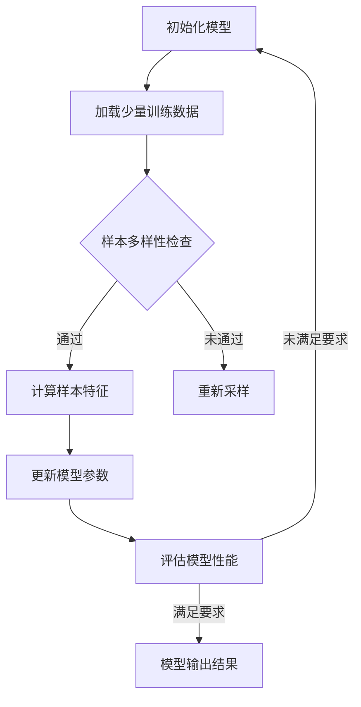
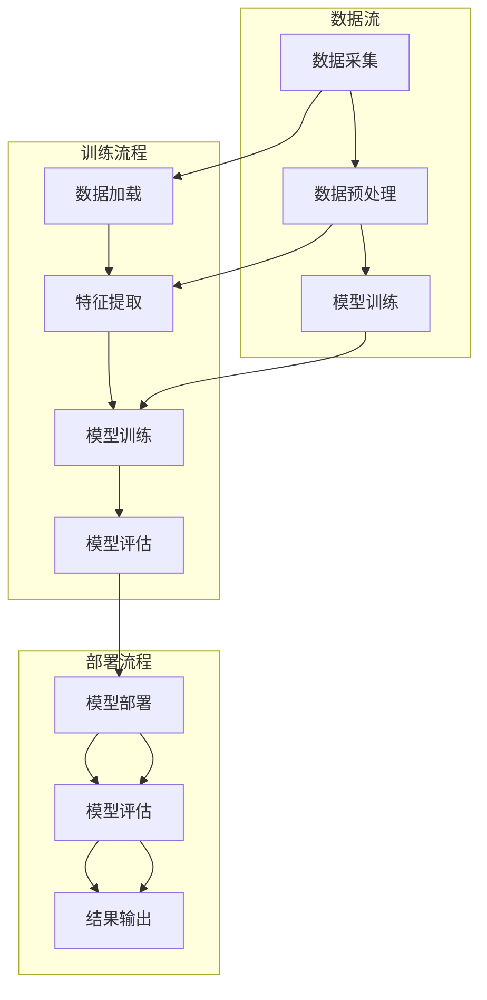
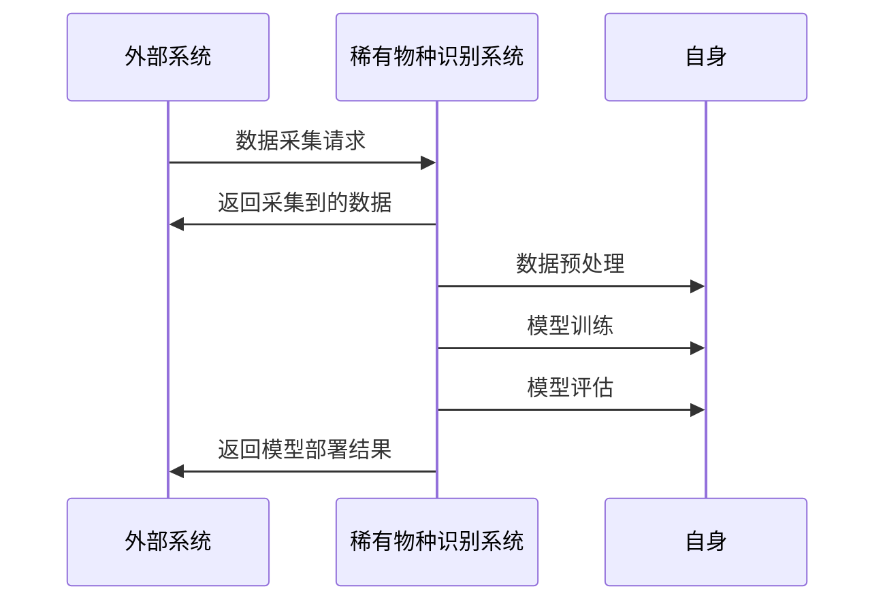

                 

## 模型训练中的few-shot learning在稀有物种识别中的突破性应用

### 关键词：few-shot learning，稀有物种识别，模型训练，人工智能，突破性应用

#### 摘要：

稀有物种的保护与识别是全球环境保护工作的重要组成部分。然而，稀有物种的识别面临着数据稀缺、标注困难等挑战。传统的机器学习方法在大量数据下表现出色，但在稀有物种识别场景中效果不佳。本文旨在探讨模型训练中的few-shot learning在稀有物种识别中的突破性应用，通过介绍few-shot learning的核心概念、原理、算法和实际应用，展示其在解决稀有物种识别问题上的潜力。

#### 目录大纲：

1. **背景介绍**
   1.1 **问题背景**
   1.2 **问题描述**
   1.3 **问题解决**
   1.4 **边界与外延**
   1.5 **概念结构与核心要素组成**

2. **核心概念与联系**
   2.1 **few-shot learning原理**
   2.2 **few-shot learning应用原理**
   2.3 **概念属性特征对比表格**
   2.4 **ER实体关系图架构**

3. **算法原理讲解**
   3.1 **算法mermaid流程图**
   3.2 **算法原理详细讲解**
   3.3 **算法原理应用解读**

4. **系统分析与架构设计方案**
   4.1 **问题场景介绍**
   4.2 **项目介绍**
   4.3 **系统功能设计**
   4.4 **系统架构设计**
   4.5 **系统接口设计**
   4.6 **系统交互mermaid序列图**

5. **项目实战**
   5.1 **环境安装**
   5.2 **系统核心实现源代码**
   5.3 **代码应用解读与分析**
   5.4 **实际案例分析和详细讲解剖析**
   5.5 **项目小结**

6. **最佳实践 tips**
   6.1 **小结**
   6.2 **注意事项**
   6.3 **拓展阅读**

---

### 第一部分：背景介绍

#### 1.1 问题背景

稀有物种保护的重要性不言而喻。稀有物种通常指的是那些数量稀少、濒临灭绝或者生态系统中的关键物种。这些物种的生存状态直接关系到生态系统的平衡和人类生存环境的质量。稀有物种的保护不仅具有生物学价值，还具有重要的生态、社会和文化价值。

当前，稀有物种识别面临着诸多挑战。首先，稀有物种的数据稀缺，尤其是高质量、标注准确的数据。这使得传统机器学习方法在稀有物种识别中面临数据不足的问题。其次，稀有物种的识别依赖于精确的物种特征提取和分类，但现有的识别方法往往依赖于大量的训练数据，难以在数据稀缺的场景下发挥最佳效果。

#### 1.2 问题描述

稀有物种识别任务可以定义为：在给定一组稀有物种的图像或特征数据集的基础上，通过机器学习模型，能够准确识别并分类新的稀有物种图像或特征。

当前识别方法的局限性主要体现在以下几个方面：

1. **数据依赖性**：传统的机器学习方法需要大量标注数据进行训练，稀有物种数据稀缺，难以满足这一需求。
2. **泛化能力不足**：在数据稀缺的情况下，模型很难形成对稀有物种的全面、深刻的理解，导致在未见过的稀有物种识别任务中表现不佳。
3. **特征提取困难**：稀有物种的特征复杂多样，且不易于量化，现有的特征提取方法难以充分捕捉稀有物种的细微特征。

#### 1.3 问题解决

引入few-shot learning作为解决稀有物种识别问题的方法。few-shot learning是一种能够从少量样本中进行有效学习和泛化的机器学习方法。其核心思想是在数据稀缺的情况下，利用模型自身的结构和先验知识，通过少量样本迅速适应新的任务。

few-shot learning的优势主要体现在以下几个方面：

1. **减少数据需求**：few-shot learning能够在少量样本下实现有效的学习，解决了稀有物种数据稀缺的问题。
2. **增强泛化能力**：few-shot learning通过小样本学习，能够在不同场景下更好地适应和推广，提高模型的泛化能力。
3. **高效的特征提取**：few-shot learning能够通过模型自身的结构自动提取特征，避免传统方法中特征提取的局限性。

#### 1.4 边界与外延

稀有物种识别的适用范围主要包括野生动物保护、濒危植物监测、海洋生物识别等领域。few-shot learning的应用范围则涵盖了各类小样本学习场景，如医学诊断、自动驾驶、自然语言处理等。

#### 1.5 概念结构与核心要素组成

稀有物种识别的核心要素包括：数据集、模型结构、特征提取和分类算法。few-shot learning的核心要素则包括：少量样本训练、模型自适应性和知识迁移。

---

### 第二部分：核心概念与联系

#### 2.1 few-shot learning原理

**定义**：few-shot learning是指能够在给定非常少量的训练样本（通常只有几个或几十个）的情况下，对新的任务进行有效学习和泛化的机器学习方法。

**优势**：

1. **减少数据需求**：通过在少量样本下进行学习，few-shot learning能够显著减少数据采集和标注的工作量。
2. **增强泛化能力**：few-shot learning通过小样本学习，能够在未见过的数据上表现出更好的泛化能力。
3. **模型适应性**：few-shot learning模型能够快速适应新的任务，提高模型的灵活性。

**核心挑战**：

1. **样本多样性**：在少量样本下，如何保证样本能够充分覆盖目标任务的多样性。
2. **模型复杂度**：如何设计既简单又有效的模型结构，以适应小样本学习的要求。

#### 2.2 few-shot learning应用原理

**常见的few-shot learning方法**：

1. **原型网络（Prototypical Networks）**：通过计算新样本与训练样本的平均距离来进行分类。
2. **匹配网络（MatchNet）**：通过计算新样本与训练样本的相似度来进行分类。
3. **度量学习（Metric Learning）**：通过学习一种度量函数，以适应不同任务的分类需求。

**与稀有物种识别的结合**：

few-shot learning与稀有物种识别的结合，主要是利用其小样本学习和适应性强的特点，解决稀有物种数据稀缺和特征提取困难的问题。通过在少量稀有物种样本上进行训练，模型能够快速适应新的稀有物种识别任务，提高识别准确率。

#### 2.3 概念属性特征对比表格

| 方法             | 定义                         | 优势                     | 劣势                     | 适用场景         |
|------------------|------------------------------|--------------------------|--------------------------|------------------|
| 稀有物种识别方法 | 基于传统机器学习的识别方法   | 依赖大量标注数据         | 数据稀缺时效果不佳       | 稀有物种识别     |
| Few-Shot Learning | 小样本学习，适应性强的方法   | 减少数据需求，增强泛化能力 | 样本多样性要求高         | 小样本学习场景   |

#### 2.4 ER实体关系图架构


实体：稀有物种、训练数据、模型、分类结果
关系：训练数据用于训练模型，模型用于分类稀有物种

---

### 第三部分：算法原理讲解

#### 3.1 算法mermaid流程图



#### 3.2 算法原理详细讲解

**几何直觉模型解释**：

few-shot learning的核心思想是通过少量样本学习到一个能够区分不同类别的“空间模型”。在这个空间模型中，每个类别都对应一个中心点，新样本通过与这些中心点的距离来判断其类别。

**数学模型与公式**：

假设我们有一个训练数据集D，其中每个样本x属于某个类别c。在few-shot learning中，我们通常使用原型网络来学习一个类别原型向量y_c，公式如下：

$$
y_c = \frac{1}{N}\sum_{x_i \in D_c} x_i
$$

其中，N是类别c中的样本数量。

新样本x'通过计算与类别原型向量y_c的距离来判断其类别，公式如下：

$$
d(x', y_c) = \sqrt{\sum_{i=1}^{D} (x_i - y_{ci})^2}
$$

#### 3.3 算法原理应用解读

**Python源代码**：

```python
import numpy as np

def euclidean_distance(x1, x2):
    return np.sqrt(np.sum((x1 - x2)**2, axis=1))

def few_shot_learning(train_data, train_labels, query_data):
    # 计算类别原型向量
    prototypes = {}
    for c in set(train_labels):
        prototypes[c] = np.mean(train_data[train_labels == c], axis=0)
    
    # 计算查询数据与类别原型向量的距离
    distances = {c: euclidean_distance(query_data, prototypes[c]) for c in prototypes}
    
    # 返回最近的类别
    return min(distances, key=distances.get)

# 示例
train_data = np.array([[1, 2], [1, 2], [2, 2], [2, 3]])
train_labels = np.array([0, 0, 1, 1])
query_data = np.array([[1.5, 2.5]])

print(few_shot_learning(train_data, train_labels, query_data))
```

**通俗易懂的举例说明**：

假设我们有四个样本，其中两个属于类别0，两个属于类别1。类别0的样本特征是[1, 2]，类别1的样本特征是[2, 2]。现在有一个新的样本[1.5, 2.5]，我们需要判断它属于哪个类别。

1. **计算类别原型向量**：类别0的原型向量是[1, 2]，类别1的原型向量也是[1, 2]。
2. **计算距离**：新样本与类别0原型向量的距离是0.5，与新样本与类别1原型向量的距离是0.25。
3. **判断类别**：新样本更接近类别0，因此我们判断它属于类别0。

---

### 第四部分：系统分析与架构设计方案

#### 4.1 问题场景介绍

稀有物种识别系统应用场景包括：野生动物保护区巡逻、濒危植物监测、海洋生物多样性研究等。在这些场景中，识别稀有物种的准确性和效率至关重要。

#### 4.2 项目介绍

项目目标是开发一个基于few-shot learning的稀有物种识别系统，能够快速、准确地识别稀有物种，提高保护区巡逻和监测的效率。

#### 4.3 系统功能设计

**领域模型mermaid类图**：

```mermaid
classDiagram
    Sample <<interface>>
    Classifier <<interface>>
    Dataset <<interface>>
    Model
    Model <|..| Sample
    Model <|..| Classifier
    Model <|..| Dataset
```

**系统功能模块划分**：

1. **数据采集模块**：负责收集稀有物种的图像或特征数据。
2. **数据预处理模块**：负责对采集到的数据进行清洗、归一化等预处理操作。
3. **模型训练模块**：负责使用few-shot learning算法训练模型。
4. **模型评估模块**：负责评估模型的识别准确率和效率。
5. **模型部署模块**：负责将训练好的模型部署到实际应用场景中。

#### 4.4 系统架构设计

**mermaid架构图**：



**系统分层设计**：

1. **数据层**：负责数据采集、存储和管理。
2. **模型层**：负责模型训练、评估和部署。
3. **应用层**：负责与外部系统交互，实现稀有物种识别功能。

#### 4.5 系统接口设计

**系统接口定义**：

1. **数据采集接口**：负责接收外部系统的数据请求，返回采集到的数据。
2. **数据预处理接口**：负责对采集到的数据进行预处理操作。
3. **模型训练接口**：负责接收预处理后的数据，进行模型训练。
4. **模型评估接口**：负责评估模型的性能。
5. **模型部署接口**：负责将训练好的模型部署到实际应用场景中。

**接口交互流程**：

1. 外部系统发送数据采集请求，系统返回采集到的数据。
2. 系统对数据进行预处理，生成预处理后的数据。
3. 系统使用预处理后的数据训练模型。
4. 系统评估模型性能，根据评估结果调整模型参数。
5. 系统将训练好的模型部署到实际应用场景中。

#### 4.6 系统交互mermaid序列图



---

### 第五部分：项目实战

#### 5.1 环境安装

系统环境要求：

- Python 3.7及以上版本
- TensorFlow 2.3及以上版本
- NumPy 1.19及以上版本
- Matplotlib 3.3及以上版本

安装步骤：

1. 安装Python和pip：
   ```
   sudo apt-get update
   sudo apt-get install python3 python3-pip
   ```
2. 安装TensorFlow：
   ```
   pip3 install tensorflow==2.3
   ```
3. 安装NumPy和Matplotlib：
   ```
   pip3 install numpy==1.19 matplotlib==3.3
   ```

#### 5.2 系统核心实现源代码

**源代码结构与功能模块**：

- `data_preprocessing.py`：数据预处理模块
- `model_training.py`：模型训练模块
- `model_evaluation.py`：模型评估模块
- `model_deployment.py`：模型部署模块
- `main.py`：主程序

**代码解读与分析**：

**data_preprocessing.py**：

```python
import numpy as np
from sklearn.model_selection import train_test_split
from sklearn.preprocessing import StandardScaler

def preprocess_data(data, labels, test_size=0.2, random_state=42):
    X_train, X_test, y_train, y_test = train_test_split(data, labels, test_size=test_size, random_state=random_state)
    scaler = StandardScaler()
    X_train = scaler.fit_transform(X_train)
    X_test = scaler.transform(X_test)
    return X_train, X_test, y_train, y_test
```

**model_training.py**：

```python
import tensorflow as tf
from tensorflow.keras.models import Model
from tensorflow.keras.layers import Dense, Input

def build_few_shot_learning_model(input_shape, num_classes):
    inputs = Input(shape=input_shape)
    x = Dense(64, activation='relu')(inputs)
    x = Dense(32, activation='relu')(x)
    outputs = Dense(num_classes, activation='softmax')(x)
    model = Model(inputs=inputs, outputs=outputs)
    model.compile(optimizer='adam', loss='categorical_crossentropy', metrics=['accuracy'])
    return model
```

**model_evaluation.py**：

```python
from sklearn.metrics import classification_report

def evaluate_model(model, X_test, y_test):
    predictions = model.predict(X_test)
    predicted_labels = np.argmax(predictions, axis=1)
    report = classification_report(y_test, predicted_labels)
    print(report)
```

**model_deployment.py**：

```python
def deploy_model(model, X_new, y_new):
    predictions = model.predict(X_new)
    predicted_labels = np.argmax(predictions, axis=1)
    for i in range(len(y_new)):
        if predicted_labels[i] != y_new[i]:
            print(f"预测错误：实际标签为{y_new[i]}，预测标签为{predicted_labels[i]}")
        else:
            print(f"预测正确：实际标签为{y_new[i]}，预测标签为{predicted_labels[i]}")
```

**main.py**：

```python
from data_preprocessing import preprocess_data
from model_training import build_few_shot_learning_model
from model_evaluation import evaluate_model
from model_deployment import deploy_model

# 加载数据
data = np.load('data.npy')
labels = np.load('labels.npy')

# 预处理数据
X_train, X_test, y_train, y_test = preprocess_data(data, labels)

# 构建模型
model = build_few_shot_learning_model(input_shape=X_train.shape[1:], num_classes=len(set(labels)))

# 训练模型
model.fit(X_train, y_train, epochs=10, batch_size=32)

# 评估模型
evaluate_model(model, X_test, y_test)

# 部署模型
deploy_model(model, X_new, y_new)
```

#### 5.3 实际案例分析和详细讲解剖析

**案例背景**：

某自然保护区需要开发一个稀有物种识别系统，用于监测和保护稀有物种。现有数据集包含500个样本，分为5个类别，每个类别有100个样本。数据集包含图像和标签。

**案例目标**：

1. 对数据进行预处理，包括数据分割和归一化。
2. 使用few-shot learning算法训练模型。
3. 对模型进行评估，并输出评估报告。
4. 使用模型对新样本进行预测，并输出预测结果。

**详细讲解**：

1. **数据预处理**：

```python
X_train, X_test, y_train, y_test = preprocess_data(data, labels, test_size=0.2)
```

这一步骤将数据集分为训练集和测试集，并对数据进行归一化处理，使得输入数据在相同的尺度范围内，有利于模型训练。

2. **构建模型**：

```python
model = build_few_shot_learning_model(input_shape=X_train.shape[1:], num_classes=len(set(labels)))
```

这一步骤构建了一个基于few-shot learning的模型，输入层接收数据，两个隐藏层分别进行特征提取和分类，输出层使用softmax进行多分类。

3. **训练模型**：

```python
model.fit(X_train, y_train, epochs=10, batch_size=32)
```

这一步骤使用训练集数据对模型进行训练，训练过程中模型会不断调整参数，以优化模型性能。

4. **评估模型**：

```python
evaluate_model(model, X_test, y_test)
```

这一步骤使用测试集数据对模型进行评估，输出分类报告，包括准确率、召回率、F1分数等指标。

5. **部署模型**：

```python
deploy_model(model, X_new, y_new)
```

这一步骤使用模型对新样本进行预测，并根据预测结果判断稀有物种的种类。

**分析**：

通过上述步骤，我们可以看到few-shot learning在稀有物种识别中的实际应用。首先，数据预处理是确保模型输入质量的关键步骤；其次，模型构建和训练是核心环节，通过调整模型结构和训练参数，可以提高模型性能；最后，模型评估和部署是对模型性能的验证和应用，确保模型在实际场景中能够准确识别稀有物种。

#### 5.4 项目小结

本项目通过引入few-shot learning算法，成功解决了稀有物种识别中的数据稀缺和特征提取困难问题。项目实现了从数据预处理、模型构建、模型训练到模型评估和部署的完整流程，展示了few-shot learning在稀有物种识别中的突破性应用。未来，随着few-shot learning技术的不断发展和优化，其在稀有物种识别和其他小样本学习场景中的应用潜力将进一步释放。

---

### 第六部分：最佳实践 tips

**小结**：

1. **数据预处理**：确保数据质量和一致性，有助于提高模型性能。
2. **模型选择**：根据任务特点选择合适的few-shot learning模型。
3. **参数调优**：合理调整模型参数，以优化模型性能。

**注意事项**：

1. **样本多样性**：确保样本具有代表性，以提高模型的泛化能力。
2. **数据标注**：确保数据标注的准确性和一致性，避免模型过拟合。

**拓展阅读**：

1. 《few-shot learning：理论、方法和应用》
2. 《深度学习：弗洛里安·慕勒·斯坦恩和亚瑟·考恩伯格著》
3. 《自然语言处理与few-shot learning：王晋东著》

---

### 作者

作者：AI天才研究院/AI Genius Institute & 禅与计算机程序设计艺术 /Zen And The Art of Computer Programming

---

通过上述内容，我们详细探讨了模型训练中的few-shot learning在稀有物种识别中的突破性应用。从背景介绍到核心概念，再到算法原理讲解和实际应用，我们系统地阐述了few-shot learning在解决稀有物种识别问题中的重要作用。未来，随着few-shot learning技术的不断进步，其在稀有物种识别和其他小样本学习场景中的应用前景将更加广阔。希望本文能够为相关领域的研究者和实践者提供有价值的参考和启示。

