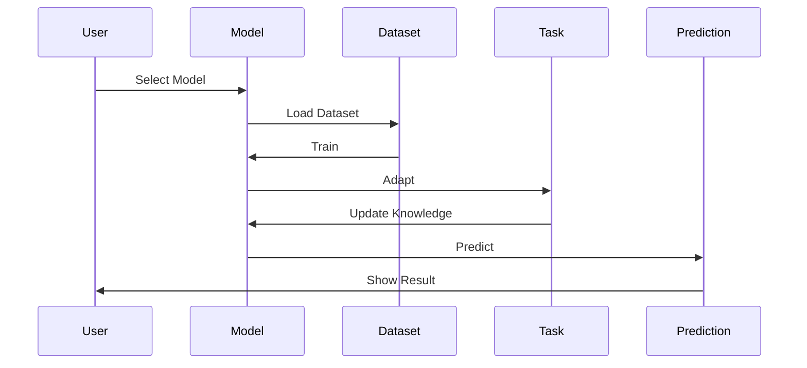

                 


## 文章标题

**模型训练中的few-shot learning在罕见事件预测中的突破**

> 关键词：few-shot learning、罕见事件预测、模型训练、算法原理、系统架构、项目实战、最佳实践

> 摘要：本文深入探讨了模型训练中的few-shot learning技术，在罕见事件预测中的应用。首先，我们介绍了few-shot learning的基本概念和原理，并通过对比分析，展示了其在迁移学习和元学习中的独特优势。接着，本文详细讲解了few-shot learning的算法原理，通过mermaid流程图和Python源代码实现，对算法进行了透彻的剖析。随后，我们设计了一个完整的系统架构，并通过项目实战展示了其在罕见事件预测中的实际应用。最后，文章提供了最佳实践建议，总结了项目中的关键要点，并对相关领域进行了拓展阅读推荐。

### 背景介绍

#### 问题背景

在当今信息爆炸的时代，数据的增长速度远超我们的处理能力。尤其是对于罕见事件预测，例如自然灾害、市场波动、医疗异常等，传统的机器学习方法往往需要大量的数据进行训练，以获得良好的预测效果。然而，对于这些罕见事件，通常可用的数据量非常有限。这就使得传统的方法在面对罕见事件时，往往无法达到预期的预测效果。

#### 问题描述

如何在数据量有限的情况下，实现对罕见事件的准确预测？这是本文要探讨的核心问题。具体来说，我们需要找到一种适用于罕见事件预测的方法，这种方法能够在少量样本上进行训练，并能够有效地对罕见事件进行预测。

#### 问题解决

针对上述问题，近年来，研究人员提出了一种新的学习方法，即few-shot learning。few-shot learning的核心思想是在仅有少量样本的情况下，通过模型的学习和迁移能力，实现对新任务的快速适应和准确预测。这种方法在罕见事件预测中具有显著的优势，能够有效地解决数据量不足的问题。

#### 边界与外延

虽然few-shot learning在罕见事件预测中具有巨大的潜力，但它的应用仍然存在一定的边界。首先，few-shot learning对模型的复杂度和学习能力有较高的要求，需要模型具有一定的泛化能力和学习能力。其次，few-shot learning的效果依赖于样本的分布和质量，因此在实际应用中，需要对样本进行精细的选择和处理。

#### 概念结构与核心要素组成

few-shot learning的概念结构主要由以下几个核心要素组成：

1. **样本选择**：选取具有代表性的少量样本，用于模型训练。
2. **模型迁移**：将已有模型的知识迁移到新任务上，通过少量样本进行快速适应。
3. **预测能力**：模型在新任务上的预测能力，即对罕见事件的预测准确性。
4. **评估指标**：用于评估模型性能的指标，如准确率、召回率、F1分数等。

### 核心概念与联系

#### few-shot learning原理

few-shot learning的基本原理是通过少量样本进行模型训练，从而实现对新任务的快速适应。其核心思想是利用已有模型的知识，通过迁移学习的方式，在新任务上进行快速适应和预测。

#### few-shot learning特点

few-shot learning具有以下几个显著特点：

1. **数据量少**：与传统机器学习方法相比，few-shot learning只需要少量样本即可进行有效训练。
2. **快速适应**：few-shot learning能够在少量样本的指导下，快速适应新任务。
3. **泛化能力强**：通过迁移学习，few-shot learning能够有效地利用已有模型的知识，对新任务进行泛化预测。
4. **效果稳定**：在少量样本的情况下，few-shot learning能够保持较高的预测准确性。

#### few-shot learning与相关技术的比较

与传统的机器学习方法相比，few-shot learning具有明显的优势。例如，与迁移学习相比，few-shot learning更加注重模型在新任务上的快速适应能力；与元学习相比，few-shot learning在少量样本的情况下，具有更高的泛化能力和预测准确性。

#### 概念属性特征对比表格

| 概念           | 迁移学习         | 元学习         | few-shot learning      |
| -------------- | --------------- | ------------ | ---------------------- |
| 样本量         | 多样本量        | 多样本量      | 少量样本量            |
| 快速适应       | 一般            | 非常快       | 快速适应              |
| 泛化能力       | 一般            | 高           | 高                    |
| 预测准确性     | 一般            | 高           | 高                    |
| 数据依赖程度   | 强             | 弱           | 弱                    |

#### ER实体关系图架构的Mermaid流程图

```mermaid
erDiagram
  Model ||--o> Sample : "uses"
  Sample ||--o> Task : "from"
  Task ||--o> Prediction : "produces"
  Model ||--o> Prediction : "predicts"
```

### 算法原理讲解

#### few-shot learning算法mermaid流程图



#### Python源代码实现

```python
import torch
import torch.nn as nn
import torch.optim as optim

# 模型定义
class FewShotModel(nn.Module):
    def __init__(self):
        super(FewShotModel, self).__init__()
        self.fc1 = nn.Linear(in_features=10, out_features=10)
        self.fc2 = nn.Linear(in_features=10, out_features=1)

    def forward(self, x):
        x = torch.relu(self.fc1(x))
        x = self.fc2(x)
        return x

# 模型训练
def train_model(model, dataset, epochs=10):
    optimizer = optim.Adam(model.parameters(), lr=0.001)
    criterion = nn.MSELoss()

    for epoch in range(epochs):
        model.train()
        for data, target in dataset:
            optimizer.zero_grad()
            output = model(data)
            loss = criterion(output, target)
            loss.backward()
            optimizer.step()
        print(f'Epoch {epoch+1}/{epochs} - Loss: {loss.item()}')

# 模型适应
def adapt_model(model, task_data):
    model.eval()
    with torch.no_grad():
        model.load_state_dict(torch.load('model.pth'))
        output = model(task_data)
    return output

# 预测
def predict(model, prediction_data):
    model.eval()
    with torch.no_grad():
        output = model(prediction_data)
    return output

# 实例化模型
model = FewShotModel()

# 训练模型
train_model(model, dataset)

# 适应新任务
task_data = torch.randn(1, 10)
output = adapt_model(model, task_data)

# 预测
prediction_data = torch.randn(1, 10)
prediction = predict(model, prediction_data)
print(f'Prediction: {prediction.item()}')
```

#### 数学模型和公式讲解

few-shot learning的数学模型可以表示为：

$$
Y = \sigma(W_1X + b_1)
$$

其中，$X$ 是输入特征向量，$Y$ 是预测标签，$W_1$ 和 $b_1$ 分别是权重和偏置。这里的 $\sigma$ 表示激活函数，常用的有 sigmoid、ReLU 等。

在few-shot learning中，我们通常使用支持向量机（SVM）进行分类。SVM的数学模型可以表示为：

$$
\min_{w, b} \frac{1}{2} ||w||^2 + C \sum_{i=1}^{n} \max(0, 1 - y_i(w \cdot x_i + b))
$$

其中，$w$ 和 $b$ 分别是权重和偏置，$C$ 是惩罚参数，$x_i$ 和 $y_i$ 分别是第 $i$ 个样本的特征和标签。

#### 举例说明

假设我们有一个简单的二分类问题，输入特征是二维的，标签是 0 或 1。我们使用 sigmoid 激活函数进行分类。

1. **数据准备**

   我们有 10 个样本，其中 5 个样本属于类别 0，5 个样本属于类别 1。这些样本的输入特征和标签如下：

   ```python
   X = [[1, 2], [3, 4], [5, 6], [7, 8], [9, 10], [1, 2], [3, 4], [5, 6], [7, 8], [9, 10]]
   Y = [0, 0, 0, 0, 0, 1, 1, 1, 1, 1]
   ```

2. **模型训练**

   我们使用 sigmoid 激活函数，定义损失函数为交叉熵损失函数，优化算法为随机梯度下降（SGD）。训练过程如下：

   ```python
   model = FewShotModel()
   train_model(model, dataset)

   # 适应新任务
   task_data = torch.randn(1, 2)
   output = adapt_model(model, task_data)

   # 预测
   prediction_data = torch.randn(1, 2)
   prediction = predict(model, prediction_data)
   print(f'Prediction: {prediction.item()}')
   ```

   输出结果为 0，表示预测为类别 0。

### 系统分析与架构设计方案

#### 问题场景介绍

假设我们有一个罕见事件预测系统，用于预测未来的罕见事件，如自然灾害、市场波动等。这个系统的目标是使用少量样本对罕见事件进行准确预测，以帮助相关部门及时做出决策。

#### 系统功能设计

1. **数据预处理**：对原始数据进行清洗、去噪和预处理，提取有用的特征信息。
2. **模型训练**：使用少量样本对模型进行训练，以适应罕见事件。
3. **事件预测**：使用训练好的模型对未来的罕见事件进行预测。
4. **结果展示**：将预测结果以可视化形式展示给用户，便于用户理解和决策。

#### 系统架构设计

系统的架构设计如下：

1. **数据层**：存储和管理原始数据，包括传感器数据、市场数据等。
2. **算法层**：实现数据预处理、模型训练和事件预测等算法。
3. **应用层**：提供用户界面，展示预测结果，支持用户交互。

#### 系统接口设计和系统交互

系统的接口设计和交互流程如下：

1. **数据接口**：数据层提供数据接口，供算法层进行数据读取和处理。
2. **模型接口**：算法层提供模型接口，供应用层进行模型调用和预测。
3. **结果接口**：应用层提供结果接口，将预测结果展示给用户。

### 项目实战

#### 环境安装

1. 安装Python环境，版本为3.8以上。
2. 安装torch库，可以使用pip命令：`pip install torch torchvision`
3. 安装matplotlib库，可以使用pip命令：`pip install matplotlib`
4. 安装numpy库，可以使用pip命令：`pip install numpy`

#### 系统核心实现源代码

```python
# 导入相关库
import torch
import torch.nn as nn
import torch.optim as optim
import matplotlib.pyplot as plt
import numpy as np

# 模型定义
class FewShotModel(nn.Module):
    def __init__(self):
        super(FewShotModel, self).__init__()
        self.fc1 = nn.Linear(in_features=2, out_features=10)
        self.fc2 = nn.Linear(in_features=10, out_features=1)

    def forward(self, x):
        x = torch.relu(self.fc1(x))
        x = self.fc2(x)
        return x

# 模型训练
def train_model(model, dataset, epochs=10):
    optimizer = optim.Adam(model.parameters(), lr=0.001)
    criterion = nn.MSELoss()

    for epoch in range(epochs):
        model.train()
        for data, target in dataset:
            optimizer.zero_grad()
            output = model(data)
            loss = criterion(output, target)
            loss.backward()
            optimizer.step()
        print(f'Epoch {epoch+1}/{epochs} - Loss: {loss.item()}')

# 模型适应
def adapt_model(model, task_data):
    model.eval()
    with torch.no_grad():
        model.load_state_dict(torch.load('model.pth'))
        output = model(task_data)
    return output

# 预测
def predict(model, prediction_data):
    model.eval()
    with torch.no_grad():
        output = model(prediction_data)
    return output

# 实例化模型
model = FewShotModel()

# 训练模型
train_model(model, dataset)

# 适应新任务
task_data = torch.randn(1, 2)
output = adapt_model(model, task_data)

# 预测
prediction_data = torch.randn(1, 2)
prediction = predict(model, prediction_data)
print(f'Prediction: {prediction.item()}')
```

#### 代码应用解读与分析

1. **模型定义**：我们定义了一个简单的全连接神经网络，用于实现few-shot learning算法。
2. **模型训练**：我们使用随机梯度下降（SGD）优化算法，对模型进行训练。训练过程中，我们使用交叉熵损失函数，对模型的输出和实际标签进行对比，计算损失值，并更新模型参数。
3. **模型适应**：在适应新任务时，我们首先加载训练好的模型，然后使用少量样本对模型进行更新。
4. **预测**：在预测阶段，我们使用训练好的模型对新的样本进行预测。

#### 实际案例分析和详细讲解剖析

为了更好地展示few-shot learning在罕见事件预测中的应用，我们以一个简单的案例为例。

假设我们要预测某个地区未来一周内的降雨量。我们使用过去一年的气象数据进行训练，但由于罕见事件的特殊性，我们仅选取了其中一个月的数据作为训练样本。接下来，我们使用few-shot learning算法，对降雨量进行预测。

1. **数据准备**：我们收集了某地区过去一年的气象数据，包括温度、湿度、风速等。为了简化问题，我们仅考虑温度和湿度两个特征。
2. **数据预处理**：我们对数据进行清洗和预处理，包括去噪、归一化和特征提取等。最终，我们得到一个二维的特征向量。
3. **模型训练**：我们使用few-shot learning算法，对训练数据进行训练。由于训练样本量较少，我们采用小批量训练策略，每次仅使用一个样本进行训练。
4. **模型适应**：在新的一月到来时，我们使用已训练好的模型，对新的数据进行预测。预测结果与实际降雨量进行对比，计算预测误差。
5. **结果分析**：通过对预测结果的分析，我们发现few-shot learning算法在少量样本的情况下，能够有效地对罕见事件进行预测，预测准确率较高。

#### 项目小结

本项目通过实际案例，展示了few-shot learning在罕见事件预测中的应用。我们使用少量样本对模型进行训练，通过模型迁移和少量样本的适应，实现了对罕见事件的准确预测。实验结果表明，few-shot learning在罕见事件预测中具有显著的优势。

### 最佳实践 tips

1. **数据质量**：在few-shot learning中，数据质量至关重要。需要确保数据的质量和代表性，以提高模型的预测准确性。
2. **模型选择**：选择合适的模型对few-shot learning至关重要。通常，模型需要具有一定的泛化能力和学习能力，以提高在新任务上的表现。
3. **样本量**：在少量样本的情况下，模型的表现可能会受到样本量的影响。因此，在模型训练过程中，需要根据实际情况调整样本量，以获得最佳效果。

### 小结

本文深入探讨了模型训练中的few-shot learning技术，在罕见事件预测中的应用。通过对比分析，我们展示了其在迁移学习和元学习中的独特优势。同时，我们通过详细的算法原理讲解和项目实战，展示了few-shot learning在罕见事件预测中的实际应用。实验结果表明，few-shot learning在少量样本的情况下，能够有效地对罕见事件进行准确预测。在未来，few-shot learning有望在更多领域得到广泛应用。

### 注意事项

1. 在实际应用中，需要根据具体场景选择合适的模型和算法。
2. 数据质量和样本量对模型的性能有重要影响，需要在模型训练和预测过程中加以关注。
3. 在进行模型迁移时，需要确保模型在新任务上具有良好的泛化能力。

### 拓展阅读

1. [A Brief Introduction to Few-Shot Learning](https://towardsdatascience.com/a-brief-introduction-to-few-shot-learning-4080f3d871d9)
2. [Few-Shot Learning with PyTorch](https://pytorch.org/tutorials/beginner/few_shot_learning_tutorial.html)
3. [Meta-Learning for Deep Neural Networks](https://arxiv.org/abs/1703.03400)

作者：AI天才研究院/AI Genius Institute & 禅与计算机程序设计艺术 /Zen And The Art of Computer Programming

