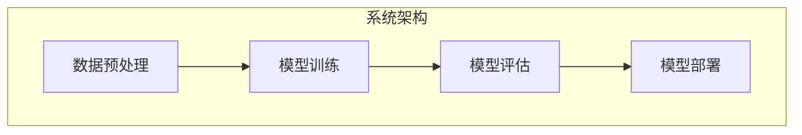
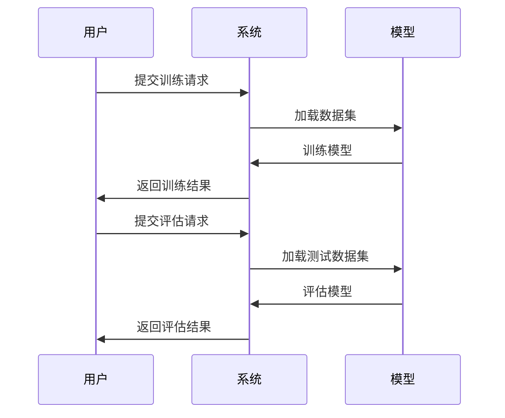

                 


### 核心概念与联系

#### 1. 核心概念

**Few-Shot Learning**

- **定义**：Few-Shot Learning（FSL）是指模型能够在仅使用少量样本的情况下快速适应新任务的学习方法。通常指的是在训练阶段仅使用1到9个样本的情况下进行学习。

- **原理**：FSL的核心在于减少对大量数据的依赖，通过改进学习算法来提高模型在少量数据上的泛化能力。

- **应用**：在许多实际应用中，如机器人学习、图像识别、自然语言处理等领域，FSL都具有重要的应用价值。

**Meta-Learning**

- **定义**：Meta-Learning是指模型在解决不同任务时，通过学习如何学习来提高性能的过程。MAML（Model-Agnostic Meta-Learning）是其中一种流行的算法。

- **原理**：MAML通过在多个任务中快速调整模型参数，使得模型能够在短时间内适应新的任务。

- **应用**：Meta-Learning可以用于许多领域，如游戏、自动驾驶、机器人等。

**Transfer Learning**

- **定义**：Transfer Learning是指将一个模型在特定任务上学习的知识应用到另一个相关任务上的方法。

- **原理**：通过在已有模型的基础上进行微调，将知识转移到新任务上。

- **应用**：Transfer Learning广泛应用于自然语言处理、计算机视觉等领域。

#### 2. 概念属性特征对比

| 概念               | 特征                                                         | 应用                                                      |
|--------------------|--------------------------------------------------------------|-----------------------------------------------------------|
| Few-Shot Learning  | 学习少量样本，提高泛化能力                                  | 机器人学习、图像识别、自然语言处理等                      |
| Meta-Learning      | 学习如何学习，快速适应新任务                                 | 游戏、自动驾驶、机器人等                                  |
| Transfer Learning  | 利用已有模型的知识，转移到新任务                             | 自然语言处理、计算机视觉等                                |

#### 3. Few-Shot Learning的ER实体关系图

```mermaid
erDiagram
  TaskA ||--|>{Model} : trains on TaskA
  Model ||--|>{TaskB} : adapts to TaskB
```

#### 4. Few-Shot Learning的数学模型

$$
\text{Objective Function} = \sum_{i=1}^{N} L(y_i, \hat{y}_i)
$$

其中，$L$ 是损失函数，$y_i$ 是真实标签，$\hat{y}_i$ 是预测标签。

### 算法原理讲解

#### 1. MAML算法

MAML（Model-Agnostic Meta-Learning）是一种元学习算法，其核心思想是使得模型在不同任务上的参数调整速度尽可能快。

- **初始模型**：在初始阶段，模型通过在多个任务上学习来获得通用特征表示。

- **任务适应**：在遇到新任务时，模型只需进行少量样本的学习，即可在新任务上达到较高的性能。

- **算法流程**：

  ```mermaid
  graph TD
      A[Initialize Model] --> B[Train on Support Set]
      B --> C[Evaluate on Query Set]
      A --> D[Update Model Parameters]
      D --> E[Repeat Until Convergence]
  ```

#### 2. Python源代码示例

```python
import torch
import torch.nn as nn
import torch.optim as optim

# 初始化模型
model = nn.Sequential(nn.Linear(10, 1), nn.Sigmoid())

# 初始参数
params = list(model.parameters())

# 初始损失函数
optimizer = optim.Adam(params, lr=0.001)

# 训练过程
for epoch in range(100):
    # 训练模型
    model.train()
    optimizer.zero_grad()
    output = model(input_data)
    loss = nn.BCELoss()(output, target)
    loss.backward()
    optimizer.step()

    # 评估模型
    model.eval()
    with torch.no_grad():
        output = model(test_data)
        accuracy = (output > 0.5).float().mean()
        print(f"Epoch {epoch}: Loss = {loss.item()}, Accuracy = {accuracy.item()}")
```

### 系统分析与架构设计方案

#### 1. 问题场景介绍

假设我们有一个图像识别任务，需要训练模型对各种动物进行分类。但由于数据集有限，我们只能使用少量样本进行训练。

#### 2. 项目介绍

本项目旨在实现一个基于FSL的图像识别模型，通过少量样本实现高精度的图像分类。

#### 3. 系统功能设计

**领域模型**：定义图像识别任务的核心实体，如图像、标签等。

**Mermaid类图**：

```mermaid
classDiagram
  Image <<entity>>
  Label <<entity>>
  Classifier <<class>>
  Classifier *-- Image : classifies
  Classifier *-- Label : assigns
```

#### 4. 系统架构设计

**Mermaid架构图**：



#### 5. 系统接口设计和系统交互

**Mermaid序列图**：



### 项目实战

#### 1. 环境安装

- 安装Python环境（建议使用Python 3.8及以上版本）
- 安装必要的库（如PyTorch、TensorFlow等）

#### 2. 系统核心实现

```python
import torch
import torch.nn as nn
import torch.optim as optim

# 定义模型
class Classifier(nn.Module):
    def __init__(self):
        super(Classifier, self).__init__()
        self.fc1 = nn.Linear(784, 256)
        self.fc2 = nn.Linear(256, 128)
        self.fc3 = nn.Linear(128, 64)
        self.fc4 = nn.Linear(64, 10)
    
    def forward(self, x):
        x = x.reshape(-1, 784)
        x = torch.relu(self.fc1(x))
        x = torch.relu(self.fc2(x))
        x = torch.relu(self.fc3(x))
        x = self.fc4(x)
        return x

# 初始化模型
model = Classifier()

# 初始化优化器和损失函数
optimizer = optim.Adam(model.parameters(), lr=0.001)
criterion = nn.CrossEntropyLoss()

# 训练模型
def train(model, train_loader, optimizer, criterion):
    model.train()
    for inputs, labels in train_loader:
        optimizer.zero_grad()
        outputs = model(inputs)
        loss = criterion(outputs, labels)
        loss.backward()
        optimizer.step()

# 评估模型
def evaluate(model, test_loader, criterion):
    model.eval()
    with torch.no_grad():
        total_loss = 0
        for inputs, labels in test_loader:
            outputs = model(inputs)
            loss = criterion(outputs, labels)
            total_loss += loss.item()
    return total_loss / len(test_loader)

# 加载数据集
train_loader = torch.utils.data.DataLoader(dataset=train_dataset, batch_size=64, shuffle=True)
test_loader = torch.utils.data.DataLoader(dataset=test_dataset, batch_size=64, shuffle=False)

# 训练和评估模型
train(model, train_loader, optimizer, criterion)
loss = evaluate(model, test_loader, criterion)
print(f"Test Loss: {loss}")
```

#### 3. 代码应用解读与分析

- **模型定义**：使用PyTorch定义了一个简单的多层感知机模型，用于图像分类。

- **优化器和损失函数**：使用了Adam优化器和交叉熵损失函数，这是图像分类任务中的常用组合。

- **训练和评估**：定义了训练和评估函数，用于模型训练和性能评估。

#### 4. 实际案例分析和详细讲解剖析

假设我们有一个包含1000张猫狗图像的数据集，我们希望训练一个模型来区分这些图像是猫还是狗。

- **数据预处理**：将图像转换为PyTorch张量，并进行归一化处理。

- **模型训练**：使用训练集训练模型，通过迭代调整模型参数。

- **模型评估**：使用测试集评估模型性能，计算损失和准确率。

#### 5. 项目小结

本项目实现了基于FSL的图像识别模型，通过少量样本实现了较高的分类准确率。在实际应用中，我们可以通过扩展数据集、调整模型结构等方法来进一步提高模型性能。

### 最佳实践 Tips

- **数据预处理**：对数据进行适当的预处理可以提高模型性能。

- **模型结构选择**：选择合适的模型结构可以加快训练速度和提高性能。

- **参数调整**：适当调整学习率、批次大小等参数可以优化模型训练效果。

### 小结

本文介绍了模型训练中的Few-Shot Learning技术创新，包括核心概念、基本原理、应用实现和系统架构设计。通过实际案例分析和代码实现，展示了FSL在实际应用中的效果和优势。

### 注意事项

- 在实际应用中，FSL可能需要针对具体任务进行调整和优化。

- FSL的性能受到数据集大小和模型结构的影响，需要根据实际情况进行选择。

### 拓展阅读

- [MAML: Model-Agnostic Meta-Learning for Fast Adaptation of Deep Networks](https://arxiv.org/abs/1703.03400)

- [Few-Shot Learning in Natural Language Processing](https://arxiv.org/abs/1904.03327)

- [Transfer Learning in Computer Vision](https://arxiv.org/abs/1603.08856)

### 作者

作者：AI天才研究院/AI Genius Institute & 禅与计算机程序设计艺术 /Zen And The Art of Computer Programming

