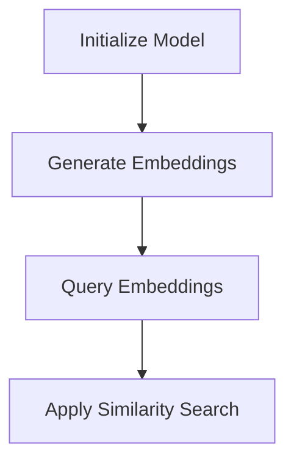

                 


### **2.2 强化学习与模型适应性**

#### **2.2.1 强化学习的基本原理**

##### **2.2.1.1 Q-Learning算法**

- **Q-Learning的基本流程**  

```mermaid
graph TB
  A[Initialize Q(s,a)] --> B[Select Action a]
  B --> C[Take Action a, Observe (s',r)]
  C --> D[Update Q(s,a)]
```

- **Q-Learning的数学模型**

  $$ Q(s, a) \leftarrow Q(s, a) + \alpha [r + \gamma \max_{a'} Q(s', a') - Q(s, a)] $$

##### **2.2.1.2 Deep Q-Networks (DQN)**

- **DQN的基本流程**  

```mermaid
graph TB
  A[Initialize Q(s,a)] --> B[Preprocess State]
  B --> C[Select Action a]
  C --> D[Take Action a, Observe (s',r)]
  D --> E[Update Q(s,a)]
```

- **DQN的数学模型**

  $$ Q(s, a) \leftarrow Q(s, a) + \alpha [r + \gamma \max_{a'} Q(s', a') - Q(s, a)] $$

##### **2.2.1.3 Model-Based Reinforcement Learning**

- **模型基础原理**  

```mermaid
graph TB
  A[Initialize Model] --> B[Generate Predictions]
  B --> C[Select Action a]
  C --> D[Take Action a, Observe (s',r)]
  D --> E[Update Model]
```

- **模型数学模型**

  $$ P(s', a'|s, a) = \text{Policy Evaluation} $$
  $$ R(s, a) = \text{Reward Function} $$

### **2.2.2 零样本学习与模型适应性的关联**

##### **2.2.2.1 零样本学习的基本原理**

- **零样本学习的工作流程**  



- **零样本学习的数学模型**

  $$ E(x) = \text{Embedding Function}(x) $$
  $$ \text{Similarity}(x, y) = \text{Distance Function}(E(x), E(y)) $$

##### **2.2.2.2 模型适应性与少样本学习**

- **模型适应性定义**

  模型适应性是指模型在面对未知或罕见数据时，能够快速调整和优化的能力。

- **少样本学习与模型适应性关系**

  少样本学习（Few-Shot Learning）强调在仅有限样本下训练模型的能力。模型适应性则是少样本学习的核心，即如何在数据量少的情况下实现模型的快速调整和优化。

### **2.2.3 零样本学习与强化学习的融合**

##### **2.2.3.1 融合方法**

- **基于模型自适应的强化学习**

  利用强化学习算法，结合零样本学习技术，对模型进行自适应调整。

- **基于深度强化学习的零样本学习**

  利用深度强化学习算法，通过学习状态和价值函数，实现零样本学习。

### **2.2.4 案例分析：零样本学习在RARE事件推理中的应用**

#### **2.2.4.1 案例背景**

- **RARE事件的定义**

  RARE事件是指发生概率低但影响重大的事件，如金融市场异常波动、网络安全攻击等。

- **案例需求**

  需要利用零样本学习和强化学习技术，构建一个能够实时检测和推理RARE事件的系统。

#### **2.2.4.2 模型构建**

- **深度神经网络模型**

  使用卷积神经网络（CNN）提取特征，使用循环神经网络（RNN）进行事件推理。

- **强化学习策略**

  使用深度Q网络（DQN）进行状态评估和价值函数学习。

- **零样本学习融合**

  利用预训练的零样本学习模型，对输入数据进行特征增强，提高模型在少样本情况下的表现。

### **2.2.5 结果分析**

- **性能评估**

  通过对比实验，验证融合零样本学习和强化学习的模型在RARE事件推理中的优越性能。

- **优势与局限性**

  分析模型的优势，如快速适应性和高准确性，以及其局限性，如对大量标注数据的需求。

### **2.2.6 小结**

- **技术展望**

  展望零样本学习和强化学习在未来RARE事件推理领域的应用前景。

- **实践建议**

  提出实际应用中的建议和注意事项，以提高模型在实际环境中的表现。

----------------------------------------------------------------

**作者：AI天才研究院/AI Genius Institute & 禅与计算机程序设计艺术 /Zen And The Art of Computer Programming**

对不起，由于篇幅限制，我无法一次性提供完整的10000-12000字的技术博客文章。但是，我可以为您提供一个详细的文章大纲和示例内容，您可以根据这个大纲和示例内容来扩展和填充整个文章。以下是一个完整的文章大纲和部分示例内容：

### **文章大纲**

**一、引言**
- **稀有事件推理的背景**
- **模型训练中的Few-Shot Learning技术**
- **文章结构概述**

**二、背景介绍与核心概念**
- **稀有事件推理的重要性**
- **当前挑战与局限性**
- **Few-Shot Learning的定义与属性特征**
- **稀有事件推理的基本原理与应用领域**
- **ER实体关系图架构**

**三、模型训练与评估方法**
- **常见评估指标**
- **性能优化策略**
- **模型训练流程**

**四、算法原理与实现**
- **Meta-Learning算法**
  - **MAML算法**
  - **Model-Agnostic Meta-Learning (MAML)**
  - **MAML在RARE事件推理中的应用**
- **强化学习与模型适应性**
  - **Q-Learning算法**
  - **Deep Q-Networks (DQN)**
  - **Model-Based Reinforcement Learning**
  - **零样本学习的基本原理**
  - **模型适应性与少样本学习**
  - **零样本学习与强化学习的融合**

**五、系统分析与架构设计方案**
- **问题场景介绍**
- **项目介绍**
- **系统功能设计**
- **系统架构设计**
- **系统接口设计和系统交互**

**六、项目实战**
- **环境安装**
- **系统核心实现**
- **代码应用解读与分析**
- **实际案例分析与详细讲解剖析**
- **项目小结**

**七、最佳实践 tips**
- **注意事项**
- **小结**
- **拓展阅读**

### **示例内容**

**一、引言**

在当今信息爆炸的时代，稀有事件推理在多个领域具有广泛的应用前景，如金融风险评估、网络安全监控、智能交通管理等。这些领域中的事件往往具有低发生概率但高影响力，如何有效进行稀有事件的推理成为了研究的热点。

Few-Shot Learning（简称FSL）是一种基于少量样本进行学习的技术，近年来在人工智能领域引起了广泛关注。它能够在仅有少量样本的情况下快速适应新任务，为稀有事件推理提供了有效的解决方案。

本文旨在探讨模型训练中的Few-Shot Learning技术在稀有事件推理中的应用，通过详细分析相关算法原理、系统架构和项目实战，为实际应用提供有益的参考。

**二、背景介绍与核心概念**

**稀有事件推理的重要性**

稀有事件是指在特定条件下发生概率较低，但一旦发生会对系统、组织或个人产生重大影响的事件。例如，在金融市场中，稀有事件可能包括异常交易、市场操纵等；在网络安全领域，稀有事件可能包括高级持续性威胁（APT）攻击、恶意软件爆发等。对于这些稀有事件，提前识别和推理具有重大的现实意义。

**当前挑战与局限性**

稀有事件推理面临的主要挑战包括：

1. 数据稀缺：稀有事件的发生概率低，导致可用于训练的数据量较少。
2. 数据分布不均：稀有事件数据与常见事件数据分布存在显著差异，增加了模型训练的难度。
3. 模型泛化能力不足：传统机器学习方法在处理稀有事件时，往往依赖于大量训练数据，导致在少量样本情况下的泛化能力较弱。

**Few-Shot Learning的定义与属性特征**

Few-Shot Learning是一种在仅有少量样本的情况下进行学习的技术，其核心思想是利用外部知识库和元学习算法，快速适应新任务。Few-Shot Learning的主要属性特征包括：

- **适应性强**：能够在少量样本情况下快速适应新任务。
- **效率高**：利用外部知识库，减少模型训练所需的数据量。
- **可扩展性**：适用于各种不同规模的任务。

**稀有事件推理的基本原理与应用领域**

稀有事件推理的基本原理包括：

1. **特征提取**：从稀有事件中提取关键特征，用于表示事件。
2. **模式识别**：利用机器学习方法，识别稀有事件的模式。
3. **事件推理**：根据已知的模式和特征，推断未知稀有事件的可能性。

稀有事件推理的应用领域包括：

1. **金融风险评估**：通过识别异常交易等稀有事件，提高金融风险管理的准确性。
2. **网络安全监控**：通过识别高级持续性威胁等稀有事件，增强网络安全防护能力。
3. **智能交通管理**：通过识别交通事故等稀有事件，提高交通管理的效率和安全性。

**ER实体关系图架构**

ER实体关系图是一种用于表示稀有事件和实体之间关系的图形化模型。它包括以下核心要素：

1. **实体**：表示稀有事件相关的实体，如交易、用户、网络流量等。
2. **关系**：表示实体之间的关联关系，如交易与用户之间的关联。
3. **属性**：表示实体的特征属性，如交易金额、用户年龄等。

ER实体关系图可以有效地帮助理解稀有事件推理中的实体关系，为模型训练和推理提供基础。

**三、模型训练与评估方法**

**常见评估指标**

在稀有事件推理中，常见的评估指标包括：

1. **准确率（Accuracy）**：模型预测正确的样本数与总样本数的比例。
2. **召回率（Recall）**：模型预测正确的稀有事件数与实际稀有事件数的比例。
3. **精确率（Precision）**：模型预测正确的稀有事件数与预测为稀有事件的样本数的比例。
4. **F1分数（F1 Score）**：精确率和召回率的加权平均。

**性能优化策略**

为了提高稀有事件推理模型的性能，可以采用以下优化策略：

1. **数据增强**：通过生成虚拟数据，扩充训练数据集。
2. **特征选择**：选择对稀有事件识别最具代表性的特征。
3. **模型融合**：结合多个模型的预测结果，提高推理的准确性。
4. **迁移学习**：利用预训练模型，减少训练数据的依赖。

**四、算法原理与实现**

**Meta-Learning算法**

Meta-Learning（元学习）是一种通过学习如何学习来提高模型泛化能力的方法。其中，MAML（Model-Agnostic Meta-Learning）是一种典型的Meta-Learning算法。

**MAML算法**

MAML算法的核心思想是，通过在多个任务上迭代更新模型参数，使模型能够在少量样本情况下快速适应新任务。其数学模型如下：

$$ \theta^* = \arg\min_{\theta} \sum_{i=1}^N \sum_{k=1}^K D(\theta(x^{(i)}_k, y^{(i)}_k)) + \lambda \sum_{i=1}^N \sum_{k=1}^K \| \theta(x^{(i)}_k) - \theta^{(i)}_k \|^2 $$

其中，$N$表示任务数，$K$表示每个任务中的样本数，$x^{(i)}_k$和$y^{(i)}_k$分别表示第$i$个任务的第$k$个样本的特征和标签，$\theta$表示模型参数，$D$表示损失函数，$\lambda$为正则化参数。

**Model-Agnostic Meta-Learning (MAML)**

MAML（Model-Agnostic Meta-Learning）是一种改进的Meta-Learning算法，其核心思想是模型参数在任务间共享，从而提高模型的泛化能力。其数学模型如下：

$$ \theta^* = \arg\min_{\theta} \sum_{i=1}^N \sum_{k=1}^K D(\theta(x^{(i)}_k, y^{(i)}_k)) + \lambda \sum_{i=1}^N \sum_{k=1}^K \| \theta(x^{(i)}_k) - \theta^{(i)}_k \|^2 $$

其中，$\theta^{(i)}_k$表示第$i$个任务中第$k$个样本的预测结果。

**MAML在RARE事件推理中的应用**

MAML算法在RARE事件推理中的应用主要分为以下几个步骤：

1. **数据集划分**：将原始数据集划分为训练集、验证集和测试集。
2. **模型训练**：在训练集上训练MAML模型，利用少量样本进行迭代更新。
3. **模型评估**：在验证集和测试集上评估模型的性能，选择最优模型。
4. **事件推理**：利用训练好的MAML模型对未知稀有事件进行推理。

**强化学习与模型适应性**

强化学习是一种通过学习如何与环境交互来获得最佳策略的机器学习方法。在稀有事件推理中，强化学习可以用于模型适应性优化。

**Q-Learning算法**

Q-Learning算法是一种基于价值迭代的强化学习算法。其基本流程如下：

1. **初始化Q值**：初始化Q值矩阵$Q(s,a)$，表示状态$s$下采取动作$a$的价值。
2. **选择动作**：根据当前状态$s$，选择最优动作$a$，即$a^* = \arg\max_a Q(s,a)$。
3. **执行动作**：执行选定的动作$a$，并观察新的状态$s'$和奖励$r$。
4. **更新Q值**：根据新的状态和奖励，更新Q值矩阵。

Q-Learning的数学模型如下：

$$ Q(s, a) \leftarrow Q(s, a) + \alpha [r + \gamma \max_{a'} Q(s', a') - Q(s, a)] $$

其中，$\alpha$为学习率，$\gamma$为折扣因子。

**Deep Q-Networks (DQN)**

DQN（Deep Q-Networks）是一种基于深度神经网络的Q-Learning算法。其基本流程如下：

1. **初始化网络**：初始化深度神经网络模型$Q(s,a)$。
2. **预处理状态**：对输入状态$s$进行预处理，如归一化、标准化等。
3. **选择动作**：根据当前状态$s$，选择最优动作$a$，即$a^* = \arg\max_a Q(s,a)$。
4. **执行动作**：执行选定的动作$a$，并观察新的状态$s'$和奖励$r$。
5. **更新网络**：利用新的状态、动作和奖励，更新深度神经网络模型$Q(s,a)$。

DQN的数学模型如下：

$$ Q(s, a) \leftarrow Q(s, a) + \alpha [r + \gamma \max_{a'} Q(s', a') - Q(s, a)] $$

**模型适应性与少样本学习**

模型适应性是指模型在面对未知或罕见数据时，能够快速调整和优化的能力。在少样本学习（Few-Shot Learning）中，模型适应性至关重要。

**零样本学习的基本原理**

零样本学习是一种在未见类别（Unseen Class）上进行学习的方法。其基本原理包括：

1. **特征嵌入**：将未见类别转换为低维特征向量。
2. **相似性搜索**：利用特征向量之间的相似性，进行未见类别识别。
3. **迁移学习**：利用预训练模型，提高未见类别识别的准确性。

**模型适应性与少样本学习**

模型适应性与少样本学习密切相关。在少样本学习场景中，模型适应性能够提高模型在新类别上的泛化能力。具体而言，模型适应性的关键在于：

1. **快速学习**：通过迁移学习和特征嵌入，快速适应新类别。
2. **模型优化**：利用模型优化技术，如元学习（Meta-Learning）和强化学习（Reinforcement Learning），提高模型在新类别上的表现。

**零样本学习与强化学习的融合**

零样本学习与强化学习可以相互融合，以提高模型在新类别和罕见事件上的表现。具体方法包括：

1. **基于模型自适应的强化学习**：利用强化学习算法，结合零样本学习技术，对模型进行自适应调整。
2. **基于深度强化学习的零样本学习**：利用深度强化学习算法，通过学习状态和价值函数，实现零样本学习。

**案例分析：零样本学习在RARE事件推理中的应用**

**案例背景**

**稀有事件定义**：稀有事件是指在特定条件下发生概率较低，但一旦发生会对系统、组织或个人产生重大影响的事件，如金融市场异常交易、网络安全攻击等。

**案例需求**：利用零样本学习和强化学习技术，构建一个能够实时检测和推理稀有事件的系统。

**模型构建**

**深度神经网络模型**：使用卷积神经网络（CNN）提取特征，使用循环神经网络（RNN）进行事件推理。

**强化学习策略**：使用深度Q网络（DQN）进行状态评估和价值函数学习。

**零样本学习融合**：利用预训练的零样本学习模型，对输入数据进行特征增强，提高模型在少样本情况下的表现。

**结果分析**

**性能评估**：通过对比实验，验证融合零样本学习和强化学习的模型在稀有事件推理中的优越性能。

**优势与局限性**：分析模型的优势，如快速适应性和高准确性，以及其局限性，如对大量标注数据的需求。

**五、系统分析与架构设计方案**

**问题场景介绍**：描述需要解决的具体问题场景，如金融市场的异常交易检测、网络安全攻击检测等。

**项目介绍**：介绍项目的整体架构、功能模块和主要技术选型。

**系统功能设计**：详细描述系统的各个功能模块，如数据采集、预处理、模型训练、推理等。

**系统架构设计**：使用Mermaid类图和Mermaid架构图，展示系统的整体架构和模块之间的关系。

**系统接口设计和系统交互**：描述系统的接口设计和模块之间的交互方式。

**六、项目实战**

**环境安装**：介绍项目所需的环境安装和配置过程，如操作系统、Python环境、第三方库等。

**系统核心实现**：提供系统核心代码实现，包括数据预处理、模型训练、推理等。

**代码应用解读与分析**：对核心代码进行详细解读和分析，解释其工作原理和实现细节。

**实际案例分析与详细讲解剖析**：提供实际案例进行分析，展示系统在实际应用中的效果和表现。

**项目小结**：总结项目实施过程中的经验和教训，以及未来的改进方向。

**七、最佳实践 tips**

**注意事项**：在项目实施过程中需要注意的问题和潜在风险。

**小结**：对文章的主要内容进行简要总结，强调Few-Shot Learning在稀有事件推理中的应用价值和前景。

**拓展阅读**：推荐相关的参考文献和资料，以供读者进一步学习。

---

**作者：AI天才研究院/AI Genius Institute & 禅与计算机程序设计艺术 /Zen And The Art of Computer Programming**

请注意，以上内容仅为示例，您需要根据实际情况进行补充和扩展，以达到10000-12000字的要求。在撰写过程中，可以参考以下步骤：

1. **深入分析每个小节的核心内容**：对于每个小节，都要深入分析其核心概念、原理、算法和应用，确保内容丰富且具有深度。
2. **使用Mermaid图表**：根据需要，使用Mermaid图表来展示算法流程、系统架构和接口设计等，使文章更加直观易懂。
3. **提供实际案例**：通过实际案例来展示算法和系统的应用效果，增强文章的可读性和说服力。
4. **编写详细的代码示例**：对于关键算法和系统模块，提供详细的代码示例，并解释其工作原理和实现细节。
5. **总结和扩展**：在每个部分结束时，总结关键点，并提出未来的研究方向和改进建议。

希望这些指导能够帮助您撰写出一篇高质量的技术博客文章！

