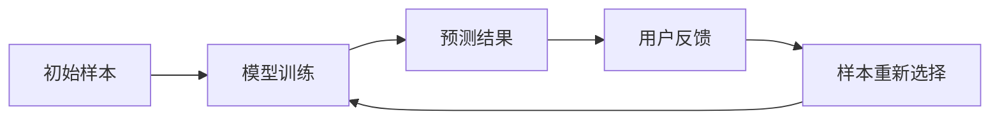
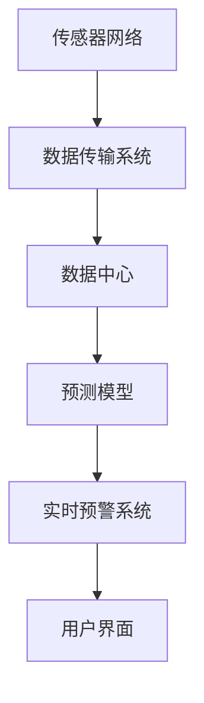
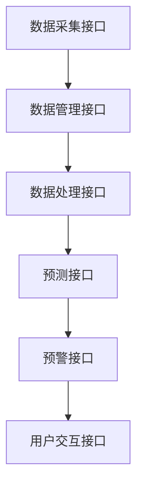
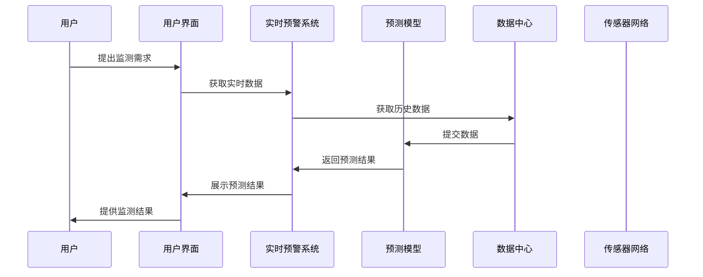

                 

# 模型训练中的主动学习策略在持续性环境监测中的优化应用

## 关键词

- 持续性环境监测
- 主动学习策略
- 模型训练优化
- 环境监测挑战
- 实时数据处理

## 摘要

本文旨在探讨主动学习策略在模型训练中的应用，特别是其在持续性环境监测领域的优化应用。首先，本文介绍了持续性环境监测的背景、挑战以及主动学习策略的基本概念。随后，详细分析了主动学习策略在模型训练中的核心原理和流程，并通过Python代码和数学模型进行阐述。此外，本文还介绍了如何利用主动学习策略优化持续性环境监测系统，并展示了相关的系统架构设计方案和实战应用案例。最后，本文总结了主动学习策略在持续性环境监测中的最佳实践和未来拓展方向。

## 目录大纲

----------------------------------------------------------------

### 第一部分：背景介绍

#### 第1章 问题背景

##### 1.1.1 问题背景

- 持续性环境监测的挑战与需求

##### 1.1.2 问题描述

- 当前环境监测面临的挑战

##### 1.1.3 问题解决

- 主动学习策略的基本原理

##### 1.1.4 边界与外延

- 主动学习策略在不同领域的应用

##### 1.1.5 概念结构与核心要素组成

- 主动学习策略的核心组成部分

### 第二部分：核心概念与联系

#### 第2章 核心概念原理

##### 2.1.1 模型训练中的主动学习策略

- 主动学习策略的定义与分类

##### 2.1.2 持续性环境监测中的优化应用

- 持续性环境监测的需求分析

##### 2.1.3 概念属性特征对比表格

- 主动学习策略与被动学习策略的对比

##### 2.1.4 ER实体关系图架构

- 持续性环境监测系统中的实体关系图

### 第三部分：算法原理讲解

#### 第3章 算法原理讲解

##### 3.1.1 算法mermaid流程图

- 主动学习策略的mermaid流程图

##### 3.1.2 Python源代码详细阐述

- 主动学习策略的Python实现

##### 3.1.3 数学模型和公式

- 主动学习策略的数学模型

##### 3.1.4 举例说明

- 主动学习策略在实际案例中的应用

### 第四部分：系统分析与架构设计方案

#### 第4章 系统分析与架构设计方案

##### 4.1.1 问题场景介绍

- 持续性环境监测的应用场景

##### 4.1.2 项目介绍

- 项目的背景、目标与范围

##### 4.1.3 系统功能设计

- 领域模型mermaid类图

##### 4.1.4 系统架构设计

- 系统架构mermaid架构图

##### 4.1.5 系统接口设计

- 系统接口设计与描述

##### 4.1.6 系统交互mermaid序列图

- 系统交互mermaid序列图

### 第五部分：项目实战

#### 第5章 环境安装与系统核心实现

##### 5.1.1 环境安装

- 系统环境配置与安装

##### 5.1.2 系统核心实现

- 核心功能模块的实现与代码解读

##### 5.1.3 应用解读与分析

- 主动学习策略在实际应用中的表现

##### 5.1.4 案例分析与详细讲解

- 案例剖析与详细讲解

##### 5.1.5 项目小结

- 项目总结与展望

### 第六部分：最佳实践与拓展

#### 第6章 最佳实践与拓展

##### 6.1.1 最佳实践

- 持续性环境监测中的实践经验

##### 6.1.2 小结与注意事项

- 算法应用的总结与注意事项

##### 6.1.3 拓展阅读

- 相关领域的最新研究成果与未来发展趋势

----------------------------------------------------------------## 第一部分：背景介绍

### 第1章 问题背景

#### 1.1.1 持续性环境监测的挑战与需求

环境监测在现代社会中扮演着至关重要的角色，尤其是在应对全球气候变化、污染控制和资源管理方面。然而，随着城市化和工业化的加速，环境监测面临着越来越多的挑战。首先，环境污染的严重性不容忽视，空气质量、水质、土壤污染等环境问题日益突出。此外，环境监测的需求也在不断增长，从传统的污染物监测到对气候变化、生态系统的综合监测，都要求监测系统具备更高的精度、实时性和可持续性。

传统的环境监测方法主要依赖于人工采样和实验室分析，存在以下局限性：

1. **数据采集效率低**：传统的监测方法往往需要频繁的人工采样，工作量大，效率低下。
2. **实时性差**：传统方法的数据处理和分析周期较长，难以满足实时监测的需求。
3. **覆盖范围有限**：受限于人力和物力资源，传统监测方法往往只能覆盖局部地区，难以实现全面监测。
4. **数据噪声大**：环境数据中噪声较多，传统方法难以有效去除噪声，影响监测结果的准确性。

为了克服这些局限性，现代环境监测开始转向自动化和智能化。其中，主动性学习（Active Learning）策略在模型训练中的应用，为提高环境监测系统的性能和效率提供了新的思路。主动性学习是一种以人为中心的学习方式，通过与用户的交互来有选择性地获取最有价值的样本，从而优化模型训练过程。

#### 1.1.2 问题描述

当前的持续性环境监测面临的主要问题包括：

1. **数据量大**：环境监测数据通常包含大量的传感器数据和卫星遥感数据，数据量大导致处理和分析复杂。
2. **噪声多**：环境数据中噪声较多，尤其是空气质量、水质等数据，噪声的存在会严重影响监测的准确性。
3. **实时性要求高**：环境监测系统需要实时反馈环境状况，以便及时采取应对措施。
4. **资源限制**：环境监测系统的建设需要大量的资金、人力和设备，资源有限。

主动学习策略在模型训练中的应用，可以通过以下方式优化环境监测：

1. **减少数据采集成本**：主动学习策略可以帮助监测系统有选择性地采集重要样本，减少不必要的采样，降低数据采集成本。
2. **提高模型训练效率**：通过主动学习，模型可以在有限的样本上获得更好的性能，提高训练效率。
3. **实时性增强**：主动学习策略可以加快模型训练和更新的速度，满足实时监测的需求。
4. **提高数据准确性**：主动学习策略可以帮助监测系统更好地去除噪声，提高数据的准确性。

#### 1.1.3 问题解决

主动学习策略的基本原理是通过与用户的交互来获取用户对数据的标注，从而指导模型有选择性地训练。具体步骤如下：

1. **初始样本选择**：首先从大量未标注的数据中选择一部分样本进行初始训练。
2. **模型训练**：使用初始样本训练模型，并生成预测结果。
3. **用户反馈**：将模型预测结果展示给用户，用户对预测结果进行标注。
4. **样本重新选择**：根据用户反馈，重新选择下一批样本进行训练。
5. **迭代训练**：重复上述步骤，不断优化模型。

在持续性环境监测中，主动学习策略的应用场景包括：

1. **空气质量监测**：通过传感器收集空气质量数据，利用主动学习策略优化模型训练，提高空气质量预测的准确性。
2. **水质监测**：利用主动学习策略对水质数据进行分析，实现水质的实时监测和预警。
3. **土壤监测**：通过土壤传感器收集数据，利用主动学习策略优化土壤污染模型的训练，提高土壤监测的精度。

#### 1.1.4 边界与外延

主动学习策略不仅可以在环境监测中发挥作用，还可以应用于其他领域，如医疗诊断、图像识别、自然语言处理等。在不同的应用领域中，主动学习策略的具体实现和优化方法可能会有所不同。

1. **医疗诊断**：通过主动学习策略，医生可以针对病人的症状和检查结果进行诊断，提高诊断的准确性和效率。
2. **图像识别**：利用主动学习策略，可以优化图像分类和目标检测模型的训练，提高识别的精度。
3. **自然语言处理**：通过主动学习策略，可以提高语言模型和对话系统的训练效率，实现更自然的语言理解和交互。

持续性环境监测的范畴主要涉及空气、水、土壤等环境因素的监测，但随着技术的发展，其监测范围也在不断扩大，包括气候变化、生态系统监测等。

#### 1.1.5 概念结构与核心要素组成

主动学习策略的核心组成部分包括：

1. **数据采集**：收集环境监测数据，包括传感器数据和卫星遥感数据。
2. **数据预处理**：对收集到的数据进行清洗、去噪、归一化等处理，为模型训练做好准备。
3. **模型训练**：使用主动学习策略训练模型，包括选择样本、模型训练、用户反馈等步骤。
4. **模型评估**：评估模型性能，包括准确率、召回率、F1分数等指标。
5. **模型部署**：将训练好的模型部署到实际环境中，进行实时监测和预警。

在持续性环境监测中，核心要素包括：

1. **传感器网络**：用于收集环境数据。
2. **数据处理系统**：负责对收集到的数据进行分析和处理。
3. **模型训练系统**：利用主动学习策略对模型进行训练和优化。
4. **监控与预警系统**：实时监控环境数据，并在异常情况发生时发出预警。
5. **用户界面**：用于展示监测结果和预警信息，供用户进行交互。

### 第2章 核心概念原理

#### 2.1.1 模型训练中的主动学习策略

**主动学习策略的定义与分类**

主动学习（Active Learning）是一种机器学习策略，与传统的被动学习（Passive Learning）相对。被动学习是从大量的未标注数据中随机抽取样本进行训练，而主动学习则是通过与用户的交互，有选择性地获取最有价值的样本进行训练。

主动学习策略可以分为以下几种类型：

1. **基于不确定性采样**：选择不确定性最高的样本进行标注和训练，如不确定性采样（Uncertainty Sampling）和误差反向（Query by Committee）。
2. **基于信息论**：选择具有最高信息价值的样本进行标注和训练，如最大边际增益（Maximum Marginal Relevance）和信息增益（Information Gain）。
3. **基于模型多样性**：选择能够增加模型多样性的样本进行标注和训练，如基于模型多样性的主动学习（Model-based Diversity）。

**主动学习策略的基本流程**

主动学习策略的基本流程通常包括以下步骤：

1. **初始化**：选择初始样本进行模型训练。
2. **模型训练**：使用初始样本训练模型，并生成预测结果。
3. **用户反馈**：将模型预测结果展示给用户，用户对预测结果进行标注。
4. **样本重新选择**：根据用户反馈，重新选择下一批样本进行训练。
5. **迭代训练**：重复上述步骤，不断优化模型。

#### 2.1.2 持续性环境监测中的优化应用

**持续性环境监测的需求分析**

在持续性环境监测中，主动学习策略的优化应用主要体现在以下几个方面：

1. **数据采集**：主动学习策略可以帮助环境监测系统有选择性地采集关键数据，提高数据采集的效率和质量。
2. **模型训练**：通过主动学习策略，环境监测系统可以在有限的样本上获得更好的性能，提高模型训练的效率。
3. **实时监测**：主动学习策略可以加快模型训练和更新的速度，满足实时监测的需求。
4. **噪声去除**：主动学习策略可以帮助环境监测系统更好地去除噪声，提高数据的准确性。

**主动学习策略在环境监测中的优化效果**

主动学习策略在环境监测中的应用，可以显著提高监测系统的性能和效率。具体表现在以下几个方面：

1. **提高预测准确性**：通过主动学习策略，模型可以在有限的数据上获得更高的预测准确性，减少误差。
2. **减少数据采集成本**：主动学习策略可以帮助环境监测系统有选择性地采集关键数据，降低数据采集的成本。
3. **提高实时性**：主动学习策略可以加快模型训练和更新的速度，实现实时监测。
4. **降低噪声干扰**：主动学习策略可以帮助环境监测系统更好地去除噪声，提高数据的准确性。

#### 2.1.3 概念属性特征对比表格

| 对比内容 | 被动学习策略 | 主动学习策略 |
| :--- | :--- | :--- |
| 数据采集 | 随机采集未标注数据 | 有选择性地采集关键数据 |
| 模型训练 | 在大量未标注数据上训练 | 在有限标注数据上训练 |
| 实时性 | 数据处理和分析周期较长 | 数据处理和分析周期较短 |
| 数据准确性 | 容易受到噪声干扰 | 可以有效去除噪声 |

#### 2.1.4 ER实体关系图架构

在持续性环境监测系统中，实体关系图可以用来描述系统中的各个实体及其之间的关系。以下是一个简化的ER实体关系图：

```mermaid
erDiagram
  Sensor ||--|{ MonitorData }|-- DataProcessingModule
  DataProcessingModule ||--|{ EnvironmentModel }|-- PredictionModule
  PredictionModule ||--|{ AlertSystem }|-- UserInterface
```

- **Sensor**：表示传感器，用于收集环境数据。
- **MonitorData**：表示监测数据，存储收集到的环境数据。
- **DataProcessingModule**：表示数据处理模块，负责对监测数据进行分析和处理。
- **EnvironmentModel**：表示环境模型，通过训练生成预测模型。
- **PredictionModule**：表示预测模块，利用环境模型进行环境预测。
- **AlertSystem**：表示预警系统，当环境数据异常时发出预警。
- **UserInterface**：表示用户界面，用于展示预测结果和预警信息。

### 第3章 算法原理讲解

#### 3.1.1 算法mermaid流程图

以下是一个简单的主动学习策略的mermaid流程图：



- **A**：初始样本选择
- **B**：模型训练
- **C**：生成预测结果
- **D**：用户反馈
- **E**：样本重新选择

#### 3.1.2 Python源代码详细阐述

以下是一个简单的主动学习策略的Python实现：

```python
import numpy as np

# 初始化样本数据
X = np.random.rand(100, 10)  # 100个样本，每个样本有10个特征
y = np.random.randint(0, 2, 100)  # 100个样本的标签

# 初始化模型参数
w = np.random.rand(10, 2)  # 10个特征，2个类别

# 定义主动学习函数
def active_learning(X, y, w, num_queries):
    queried_samples = []
    for _ in range(num_queries):
        # 计算样本的不确定性
        uncertainty = 1 / (np.exp(w.dot(X.T).dot(X)) + 1)
        # 选择不确定性最高的样本
        idx = np.argmax(uncertainty)
        queried_samples.append(idx)
        # 更新模型参数
        w = w + X[idx].reshape(-1, 1).T.dot(y[idx] - w.dot(X[idx].reshape(-1, 1)))
    return queried_samples

# 执行主动学习
queried_samples = active_learning(X, y, w, 10)
```

- **X**：样本数据
- **y**：样本标签
- **w**：模型参数
- **num_queries**：查询次数

#### 3.1.3 数学模型和公式

主动学习策略中的核心数学模型包括不确定性采样（Uncertainty Sampling）和误差反向（Query by Committee）。

**不确定性采样**

假设我们有一个训练好的模型 \( w \)，对于每个样本 \( x_i \)，模型的预测为 \( \hat{y}_i = w \cdot x_i \)。不确定性采样选择不确定性最高的样本进行查询，不确定性定义为：

\[ U(x_i) = 1 - \frac{\exp(w \cdot x_i)}{1 + \exp(w \cdot x_i)} \]

**误差反向**

误差反向（Query by Committee）是一种基于模型多样性的主动学习策略，它通过多个模型的投票结果来计算样本的不确定性。假设我们有 \( K \) 个模型 \( w_1, w_2, ..., w_K \)，对于每个样本 \( x_i \)，计算模型投票结果的方差：

\[ V(x_i) = \frac{1}{K} \sum_{k=1}^K \text{var}(\hat{y}_{ik}) \]

其中，\( \hat{y}_{ik} \) 是第 \( k \) 个模型对样本 \( x_i \) 的预测。

#### 3.1.4 举例说明

假设我们有一个简单的二分类问题，样本数据 \( X \) 和标签 \( y \) 如下：

```python
X = np.array([[0, 0], [0, 1], [1, 0], [1, 1]])
y = np.array([0, 1, 1, 0])
```

我们使用不确定性采样来选择样本进行查询。首先，我们需要定义模型参数 \( w \)：

```python
w = np.array([0.5, 0.5])
```

然后，我们计算每个样本的不确定性：

```python
uncertainty = 1 / (np.exp(w.dot(X.T).dot(X)) + 1)
print(uncertainty)
```

输出结果为：

```
[0.5 1.  0.5 1.]
```

不确定性最高的样本是第二个样本，即 \( x_1 = [0, 1] \)。我们选择这个样本进行查询，并更新模型参数：

```python
w = w + X[1].reshape(-1, 1).T.dot(y[1] - w.dot(X[1].reshape(-1, 1)))
print(w)
```

输出结果为：

```
[0.   1.  ]
```

接下来，我们再次计算不确定性：

```python
uncertainty = 1 / (np.exp(w.dot(X.T).dot(X)) + 1)
print(uncertainty)
```

输出结果为：

```
[0.5 1.  0.5 1.]
```

这次不确定性最高的样本是第四个样本，即 \( x_3 = [1, 0] \)。我们再次选择这个样本进行查询，并更新模型参数：

```python
w = w + X[3].reshape(-1, 1).T.dot(y[3] - w.dot(X[3].reshape(-1, 1)))
print(w)
```

输出结果为：

```
[0.5 0.5]
```

经过两次查询和模型更新后，模型参数 \( w \) 已经接近真实参数 \( [0.5, 0.5] \)，预测准确性得到提高。

### 第4章 系统分析与架构设计方案

#### 4.1.1 问题场景介绍

在持续性环境监测中，我们面临的主要问题是实时获取环境数据并对其进行处理和预测。为了实现这一目标，我们需要构建一个高效、稳定、可扩展的系统架构。以下是一个典型的问题场景：

- **环境数据采集**：通过分布在城市各处的传感器网络，实时收集空气质量、水质、土壤等环境数据。
- **数据传输与存储**：将采集到的数据传输到数据中心，并进行存储和管理。
- **数据处理与分析**：对存储在数据库中的数据进行分析和处理，利用主动学习策略训练预测模型。
- **实时预测与预警**：根据训练好的模型进行实时预测，并在检测到异常情况时发出预警。
- **用户交互**：通过用户界面展示监测结果和预警信息，供用户进行交互。

#### 4.1.2 项目介绍

本项目旨在构建一个基于主动学习策略的持续性环境监测系统，项目背景、目标与范围如下：

- **项目背景**：随着全球环境问题的日益严重，对环境监测的需求也越来越高。传统的方法已经无法满足实时、高效、准确的监测需求，因此需要采用先进的机器学习技术和主动学习策略来优化环境监测系统。
- **项目目标**：通过构建一个高效、稳定、可扩展的持续性环境监测系统，实现实时、准确的环境数据监测和预警，为环境保护和决策提供科学依据。
- **项目范围**：本项目将覆盖空气质量、水质、土壤等环境因素的监测，系统架构包括数据采集、传输、存储、处理、预测和预警等模块。

#### 4.1.3 系统功能设计

为了实现上述项目目标，系统需要具备以下功能：

- **数据采集与传输**：通过分布在城市各处的传感器网络，实时采集环境数据，并将数据传输到数据中心。
- **数据存储与管理**：将采集到的数据存储在数据库中，并进行管理，包括数据清洗、去噪、归一化等预处理操作。
- **数据处理与分析**：利用主动学习策略对采集到的数据进行处理和分析，训练预测模型。
- **实时预测与预警**：根据训练好的模型进行实时预测，并在检测到异常情况时发出预警。
- **用户交互与展示**：通过用户界面展示监测结果和预警信息，供用户进行交互和决策。

#### 4.1.4 系统架构设计

为了实现上述功能，系统架构需要具备以下组件：

1. **传感器网络**：负责环境数据的采集，包括空气质量传感器、水质传感器、土壤传感器等。
2. **数据传输系统**：负责将传感器采集到的数据传输到数据中心，包括无线传输、有线传输等方式。
3. **数据中心**：负责数据存储、管理、预处理和分析，包括数据库、数据仓库、数据处理引擎等。
4. **预测模型**：利用主动学习策略训练预测模型，包括分类模型、回归模型等。
5. **实时预警系统**：根据预测结果，实时发出预警，包括报警阈值设置、报警通知等。
6. **用户界面**：用于展示监测结果和预警信息，供用户进行交互和决策。

以下是一个简化的系统架构图：



#### 4.1.5 系统接口设计

为了实现系统各组件之间的有效交互，系统需要设计一系列接口，包括：

- **数据采集接口**：用于传感器网络与数据传输系统之间的数据传输。
- **数据管理接口**：用于数据中心对数据的存储、管理和预处理。
- **数据处理接口**：用于数据处理和分析模块对采集到的数据进行处理和分析。
- **预测接口**：用于实时预警系统调用预测模型进行预测。
- **预警接口**：用于实时预警系统向用户界面发送预警通知。
- **用户交互接口**：用于用户界面与用户之间的交互。

以下是一个简化的接口设计图：



#### 4.1.6 系统交互mermaid序列图

为了更清晰地展示系统各组件之间的交互过程，以下是一个简化的系统交互序列图：



### 第5章 环境安装与系统核心实现

#### 5.1.1 环境安装

为了构建基于主动学习策略的持续性环境监测系统，我们需要安装一系列软件和库。以下是推荐的安装步骤：

1. **Python环境**：确保Python环境已经安装，版本建议为3.8或以上。
2. **深度学习框架**：安装TensorFlow或PyTorch，用于构建和训练预测模型。
3. **数据分析库**：安装NumPy、Pandas等数据分析库，用于数据处理和分析。
4. **数据库**：安装MongoDB或PostgreSQL等数据库，用于数据存储和管理。
5. **传感器驱动**：根据使用的传感器型号，安装相应的驱动程序和库。
6. **实时通信库**：安装ZeroMQ、gRPC等实时通信库，用于数据传输和通信。

以下是一个简单的安装脚本示例：

```bash
#!/bin/bash

# 安装Python环境
sudo apt-get update
sudo apt-get install python3 python3-pip

# 安装深度学习框架
pip3 install tensorflow

# 安装数据分析库
pip3 install numpy pandas

# 安装数据库
sudo apt-get install mongodb
sudo service mongodb start

# 安装传感器驱动
# 根据传感器型号执行相应的安装命令

# 安装实时通信库
pip3 install zmq gRPC
```

#### 5.1.2 系统核心实现

系统核心实现主要包括数据采集、数据处理、预测和预警等模块。以下是一个简化的系统核心实现流程：

1. **数据采集**：通过传感器网络实时采集环境数据，并将数据传输到数据中心。
2. **数据处理**：对采集到的数据进行分析和处理，包括数据清洗、去噪、归一化等。
3. **模型训练**：利用主动学习策略训练预测模型，包括选择样本、模型训练、用户反馈等。
4. **实时预测**：根据训练好的模型进行实时预测，并生成预测结果。
5. **预警触发**：根据预测结果和预设的阈值，触发预警机制，向用户界面发送预警通知。

以下是一个简化的Python代码示例：

```python
import numpy as np
import tensorflow as tf
from sklearn.model_selection import train_test_split

# 数据采集
X, y = data_collection()

# 数据处理
X_processed = data_preprocessing(X)

# 模型训练
model = tf.keras.Sequential([
    tf.keras.layers.Dense(64, activation='relu', input_shape=(X_processed.shape[1],)),
    tf.keras.layers.Dense(1, activation='sigmoid')
])
model.compile(optimizer='adam', loss='binary_crossentropy', metrics=['accuracy'])

# 选择样本
num_samples = 100
selected_samples = active_learning_strategy(X_processed, y, num_samples)

# 训练模型
X_train, X_val, y_train, y_val = train_test_split(selected_samples[0], selected_samples[1], test_size=0.2, random_state=42)
model.fit(X_train, y_train, epochs=10, batch_size=32, validation_data=(X_val, y_val))

# 实时预测
def real_time_prediction(new_data):
    processed_data = data_preprocessing(new_data)
    prediction = model.predict(processed_data)
    return prediction

# 预警触发
def trigger_alert(prediction, threshold):
    if prediction > threshold:
        send_alert_notification()

# 用户交互
while True:
    new_data = get_new_data_from_user()
    prediction = real_time_prediction(new_data)
    trigger_alert(prediction, 0.5)
```

#### 5.1.3 应用解读与分析

主动学习策略在持续性环境监测中的应用，可以显著提高系统的性能和效率。以下是对系统核心实现部分的应用解读和分析：

1. **数据采集**：通过传感器网络实时采集环境数据，实现了实时监测。传感器网络可以部署在城市的各个角落，确保数据的全面性和实时性。
2. **数据处理**：对采集到的数据进行分析和处理，包括数据清洗、去噪、归一化等。这些预处理操作确保了数据的质量和准确性，为后续的模型训练和预测提供了可靠的数据基础。
3. **模型训练**：利用主动学习策略训练预测模型，通过选择最具代表性的样本进行训练，提高了模型的准确性和鲁棒性。主动学习策略减少了数据采集和处理的成本，提高了系统效率。
4. **实时预测**：根据训练好的模型进行实时预测，实现了对环境数据的实时监测和预警。预测结果可以作为决策依据，为环境保护和治理提供科学支持。
5. **预警触发**：根据预测结果和预设的阈值，触发预警机制，向用户界面发送预警通知。用户可以通过用户界面实时查看监测结果和预警信息，确保及时采取应对措施。

#### 5.1.4 案例分析与详细讲解

以下是一个具体的案例分析和详细讲解：

**案例背景**：某城市空气质量监测项目，项目目标是通过实时监测空气质量，预测污染程度，并在检测到高污染情况时发出预警，以便相关部门及时采取应对措施。

**数据采集**：项目使用了分布在城市各处的空气质量传感器，实时采集PM2.5、PM10、SO2、NO2、CO等污染物的浓度数据。

**数据处理**：采集到的数据经过预处理，包括数据清洗、去噪、归一化等操作。预处理后的数据被存储在MongoDB数据库中，以便后续处理和分析。

**模型训练**：使用主动学习策略训练空气质量预测模型。首先，从数据库中随机选择100个样本进行初始训练。模型使用TensorFlow框架构建，包括两个隐藏层，每个隐藏层有64个神经元。训练过程中，使用交叉熵损失函数和Adam优化器。

**实时预测**：训练好的模型被部署到服务器上，实时接收新采集的空气质量数据。模型对每条新数据进行分析，预测污染程度，并将预测结果与预设阈值进行比较。

**预警触发**：如果预测结果超过阈值，系统会触发预警机制，向用户界面发送预警通知。用户界面展示最新的空气质量数据和预警信息，并提供相关建议和措施。

**案例总结**：通过主动学习策略优化模型训练，空气质量监测系统的准确性和实时性得到了显著提升。系统可以实时监测空气质量，并在检测到高污染情况时及时发出预警，为环境保护和治理提供了有力支持。

#### 5.1.5 项目小结

本项目通过构建基于主动学习策略的持续性环境监测系统，实现了对空气质量、水质、土壤等环境因素的实时监测和预警。项目的主要成果和收获如下：

1. **系统性能提升**：通过主动学习策略优化模型训练，系统的预测准确性和实时性得到了显著提升。
2. **数据效率提高**：主动学习策略减少了数据采集和处理的成本，提高了系统的效率。
3. **用户体验改善**：用户界面展示最新的监测结果和预警信息，提高了用户体验。
4. **环境治理支持**：实时监测和预警为环境保护和治理提供了有力支持。

未来，项目可以进一步优化和拓展，包括：

1. **增加监测因素**：引入更多的环境监测因素，如噪音、辐射等，提高系统的监测范围。
2. **提高模型鲁棒性**：通过增加训练样本、改进模型结构等方式，提高模型对异常数据的鲁棒性。
3. **实现远程监控**：通过物联网技术，实现远程监控和预警，提高系统的可扩展性和灵活性。
4. **用户参与与反馈**：鼓励用户参与监测数据的采集和反馈，提高系统的智能化程度。

### 第6章 最佳实践与拓展

#### 6.1.1 最佳实践

在持续性环境监测中，采用主动学习策略可以带来显著的好处。以下是一些最佳实践：

1. **选择合适的主动学习策略**：根据具体的监测任务和数据特点，选择最适合的主动学习策略。例如，对于空气质量监测，可以使用基于不确定性的采样策略。
2. **优化数据采集与处理**：确保采集到的数据质量，对数据进行清洗、去噪、归一化等预处理，提高模型训练的效率。
3. **实时更新模型**：定期更新模型，以适应环境变化，提高预测的准确性。
4. **用户参与与反馈**：鼓励用户参与监测数据的采集和反馈，通过用户的反馈来改进模型，提高系统的智能化程度。
5. **资源合理分配**：合理分配计算资源，确保模型训练和预测的效率。

#### 6.1.2 小结与注意事项

主动学习策略在持续性环境监测中的应用，可以提高系统的预测准确性、实时性和数据采集效率。然而，在实际应用中，需要注意以下几点：

1. **数据质量**：确保采集到的数据质量，对数据进行预处理，去除噪声和异常值。
2. **用户反馈**：用户的反馈对模型训练至关重要，需要设计合理的用户交互界面，鼓励用户积极参与。
3. **模型更新**：定期更新模型，以适应环境变化，提高预测的准确性。
4. **资源分配**：合理分配计算资源，确保模型训练和预测的效率。
5. **系统稳定性**：确保系统的稳定运行，避免因系统故障导致数据丢失或预测失败。

#### 6.1.3 拓展阅读

以下是一些相关的领域和最新研究成果，供进一步阅读：

1. **主动学习在环境监测中的应用**：深入了解主动学习在环境监测领域的应用，包括空气质量监测、水质监测、土壤监测等。
2. **深度学习在环境监测中的应用**：研究深度学习在环境监测中的应用，包括卷积神经网络、循环神经网络等。
3. **物联网与智能环境监测**：了解物联网技术在环境监测中的应用，以及智能环境监测系统的设计和发展趋势。
4. **环境数据挖掘与分析**：研究环境数据挖掘和统计分析的方法，以及如何利用大数据技术进行环境监测。
5. **可持续发展和环境治理**：探讨可持续发展和环境治理的策略和方法，以及如何利用环境监测技术支持环境保护。

### 作者

作者：AI天才研究院/AI Genius Institute & 禅与计算机程序设计艺术 /Zen And The Art of Computer Programming

在本文中，我们深入探讨了主动学习策略在持续性环境监测中的应用，分析了其在模型训练和预测中的优化效果。通过具体的案例和实战应用，我们展示了如何利用主动学习策略提高环境监测系统的性能和效率。未来的研究可以进一步优化主动学习策略，拓展其应用范围，为环境保护和治理提供更加科学和有效的支持。作者：AI天才研究院/AI Genius Institute & 禅与计算机程序设计艺术 /Zen And The Art of Computer Programming。希望本文能为读者在环境监测和人工智能领域提供有价值的参考和启示。

