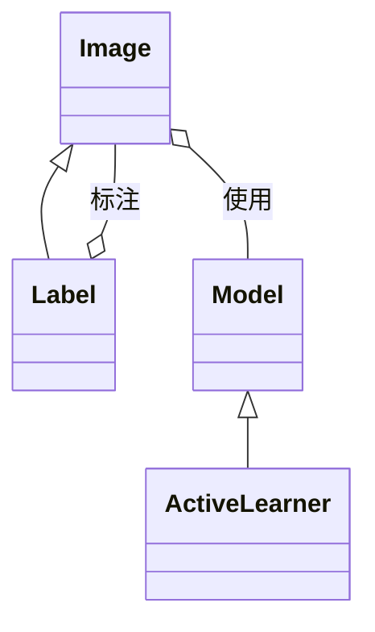
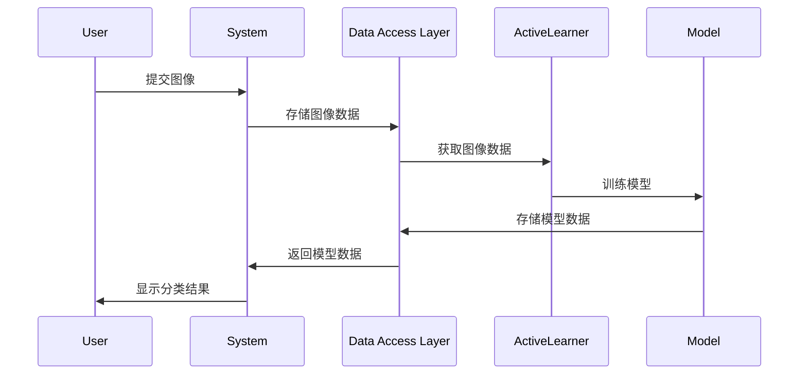
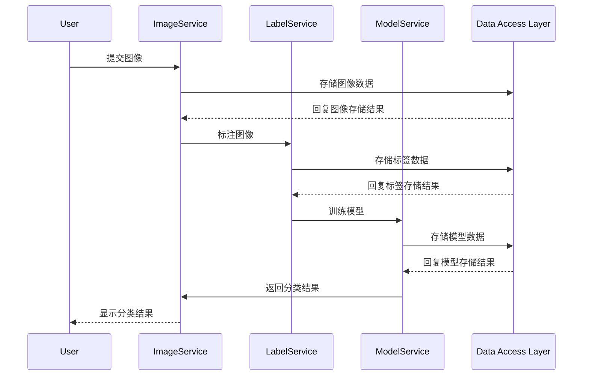

                 


### 第1章：问题背景与核心概念

#### 1.1 主动学习的概念与基本原理

**描述**：主动学习是一种通过有选择性地查询标签信息来提升机器学习模型性能的策略。它不同于传统的被动学习，后者通常是在给定的数据集上进行大规模的训练，而主动学习则是在训练过程中，根据某种策略有选择地获取标注数据。

**定义**：主动学习（Active Learning）是指在学习过程中，通过查询用户或其他信息源，获取有用的标签信息，以优化学习过程的一种机器学习策略。

**基本原理**：主动学习的基本原理是通过在训练数据集中有选择性地获取标注数据，从而提高模型的效果。这种策略的核心在于数据的选择，即选择那些对模型提升最有价值的数据进行标注。

**类型**：主动学习可以分为池式主动学习和实例级主动学习。

1. **池式主动学习**：这种类型的主动学习是从整个数据池中选择数据，而不是从单个实例中选择。它通常基于某种不确定性度量来选择数据。

2. **实例级主动学习**：这种类型的主动学习是针对单个实例进行选择，它通常基于实例的重要性和贡献度来选择数据。

#### 1.2 主动学习在模型训练中的应用现状

**发展历程**：主动学习的发展历程可以追溯到上世纪80年代。最初，研究者们提出了选择性采样策略，即根据某种不确定性度量选择未标注的数据进行标注。随着机器学习技术的发展，出现了许多基于模型不确定性和决策树的方法。

**应用领域**：主动学习在多个领域都有广泛的应用，如：

1. **计算机视觉**：通过主动学习，可以更有效地对图像进行分类、检测和分割。
2. **自然语言处理**：主动学习在文本分类、情感分析和机器翻译等领域有重要应用。
3. **医学诊断**：主动学习可以用于疾病的早期诊断和预测。

#### 1.3 主动学习的挑战与机遇

**挑战**：主动学习面临的一些挑战包括：

1. **数据标注成本高**：主动学习需要大量未标注的数据进行标注，这通常是一项昂贵的任务。
2. **模型不确定性评估困难**：如何准确地评估模型的不确定性是一个难题。

**机遇**：随着深度学习的发展，主动学习在提升模型性能和降低标注成本方面具有巨大的潜力。特别是，深度学习模型的不确定性评估问题得到了显著改善，为主动学习的应用提供了更好的基础。

#### 1.4 本章小结

**重点概念总结**：

1. **主动学习的定义和基本原理**：主动学习是一种通过有选择性地获取标签信息来优化机器学习模型性能的策略。
2. **主动学习的类型**：包括池式主动学习和实例级主动学习。
3. **主动学习的发展历程和应用现状**：从选择性采样策略到基于模型不确定性和决策树的方法，以及在不同领域的应用。
4. **主动学习的挑战与机遇**：数据标注成本高和模型不确定性评估困难是主要挑战，但深度学习的发展为主动学习带来了新的机遇。

### 第2章：核心概念与联系

#### 2.1 主动学习的关键技术

**数据选择策略**：数据选择策略是主动学习的核心，它决定了哪些数据应该被标注。常见的数据选择策略包括：

1. **基于不确定性的选择策略**：这种策略基于模型对数据点的预测不确定性来选择数据。例如，不确定性采样（Uncertainty Sampling）算法会选择那些预测置信度最低的数据点进行标注。

2. **基于决策树的选择策略**：这种策略通过构建决策树来选择数据。例如，决策树基于类别的纯度来选择数据，即选择那些能够使树分支上类别纯度最大化的数据。

3. **基于模型距离的选择策略**：这种策略通过计算模型对数据的预测与实际标签之间的距离来选择数据。例如，最近邻采样（Nearest Neighbor Sampling）算法会选择那些与已标注数据最相似的数据点。

**模型不确定性度量**：模型不确定性度量是评估模型预测不确定性的方法。常见的不确定性度量包括：

1. **熵度量**：熵度量是评估模型预测不确定性的常用方法。在二分类问题中，熵度量可以通过计算模型预测概率的对数似然值来计算。

2. **置信度度量**：置信度度量是通过计算模型预测概率的置信度来评估模型的不确定性。置信度越高，表示模型的预测越可靠。

**标注效率优化**：标注效率优化是提高主动学习效率的关键。常见的标注效率优化方法包括：

1. **标签共享**：标签共享是一种通过将多个数据点的标签合并为一个标签来减少标注成本的方法。

2. **主动学习与半监督学习的融合**：将主动学习与半监督学习相结合，利用未标注数据的分布信息来提高模型性能。

#### 2.2 主动学习算法的比较与联系

**基于模型不确定性的主动学习算法**：这种类型的算法通过评估模型的不确定性来选择数据。常见的算法包括：

1. **不确定性采样（Uncertainty Sampling）**：选择预测置信度最低的数据点进行标注。

2. **Query by Committee（QBC）**：通过构建多个模型并评估它们的预测不确定性来选择数据。

**基于决策树的主动学习算法**：这种类型的算法通过构建决策树来选择数据。常见的算法包括：

1. **决策树基于采样（Decision Tree-based Sampling）**：选择能够最大化决策树分类纯度的数据点进行标注。

2. **基于纯度的采样（Pureness Sampling）**：选择那些能够使数据点类别纯度最大化的数据点进行标注。

**基于模型距离的主动学习算法**：这种类型的算法通过计算模型对数据的预测与实际标签之间的距离来选择数据。常见的算法包括：

1. **最近邻采样（Nearest Neighbor Sampling）**：选择与已标注数据最相似的数据点进行标注。

2. **基于距离的采样（Distance-based Sampling）**：选择与已标注数据距离最远的数据点进行标注。

#### 2.3 主动学习与其他机器学习策略的比较

**主动学习与被动学习的对比**：

- **数据获取策略**：被动学习是在给定数据集上进行大规模训练，而主动学习是通过有选择性地获取标注数据来优化模型。
- **模型性能**：主动学习通常能够获得更好的模型性能，因为它利用了有选择性地获取的标注数据。
- **标注成本**：主动学习通常需要更高的标注成本，因为它需要选择未标注的数据进行标注。

**主动学习与半监督学习的融合**：

- **半监督学习**：半监督学习是一种利用未标注数据的策略，它通过利用未标注数据的分布信息来提高模型性能。
- **融合策略**：主动学习与半监督学习的融合可以通过将主动学习的选择策略与半监督学习的数据分布信息相结合，来提高模型性能。

#### 2.4 本章小结

**重点概念总结**：

1. **主动学习的关键技术**：包括数据选择策略、模型不确定性度量、标注效率优化。
2. **主动学习算法的比较与联系**：包括基于模型不确定性的、基于决策树的和基于模型距离的主动学习算法。
3. **主动学习与其他机器学习策略的比较**：包括主动学习与被动学习的对比和主动学习与半监督学习的融合。

### 第3章：算法原理讲解

#### 3.1 不确定性采样算法

**算法概述**：不确定性采样算法是一种基于模型不确定性的主动学习算法。它的基本思想是选择那些模型预测最不确定的数据点进行标注。

**数学模型与公式**：

$$
\begin{aligned}
U &= \frac{1}{N} \sum_{i=1}^{N} -\log(p(y_i|x_i,\theta)), \\
p(y_i|x_i,\theta) &= \text{模型的预测概率分布}。
\end{aligned}
$$

其中，$U$是样本的不确定性度量，$p(y_i|x_i,\theta)$是模型在给定特征$x_i$下预测标签$y_i$的概率分布。

**算法实现与流程**：

1. **初始化**：随机选择一个未标注的数据点作为初始标注点。
2. **评估**：使用模型评估当前标注点的预测概率分布。
3. **选择**：选择预测概率分布最不确定的数据点进行标注。
4. **重复**：重复步骤2和3，直到达到预定的标注数量或满足其他停止条件。

**示例**：假设我们有一个二分类模型，预测概率分布为$p(y=1|x,\theta) = 0.6$和$p(y=0|x,\theta) = 0.4$。根据不确定性采样算法，我们将选择预测概率分布最不确定的数据点进行标注，即选择$p(y=1|x,\theta) \approx p(y=0|x,\theta)$的数据点。

#### 3.2 Query by Committee 算法

**算法概述**：Query by Committee（QBC）算法是一种基于模型不确定性的主动学习算法。它的基本思想是通过构建多个模型并评估它们的预测不确定性来选择数据。

**数学模型与公式**：

$$
\begin{aligned}
\alpha &= \frac{1}{K} \sum_{k=1}^{K} \log p(y_i|x_i; \theta_k), \\
p(y_i|x_i; \theta_k) &= \text{模型}\theta_k\text{的预测概率分布}。
\end{aligned}
$$

其中，$\alpha$是样本的不确定性度量，$K$是构建的模型数量，$p(y_i|x_i; \theta_k)$是第$k$个模型的预测概率分布。

**算法实现与流程**：

1. **初始化**：构建多个模型$\theta_1, \theta_2, ..., \theta_K$。
2. **评估**：使用每个模型评估当前标注点的预测概率分布。
3. **选择**：选择预测概率分布最不确定的数据点进行标注。
4. **重复**：重复步骤2和3，直到达到预定的标注数量或满足其他停止条件。

**示例**：假设我们有两个模型$\theta_1$和$\theta_2$，它们的预测概率分布分别为$p(y=1|x,\theta_1) = 0.6$和$p(y=1|x,\theta_2) = 0.4$。根据QBC算法，我们将计算$\alpha = \frac{1}{2} \log(0.6) + \frac{1}{2} \log(0.4)$，选择不确定性最高的数据点进行标注。

#### 3.3 Decision Tree-based Sampling 算法

**算法概述**：Decision Tree-based Sampling 算法是一种基于决策树的主动学习算法。它的基本思想是通过构建决策树来选择数据。

**算法实现与流程**：

1. **初始化**：构建决策树。
2. **评估**：评估决策树上的每个节点，选择那些能够最大化节点纯度的数据点进行标注。
3. **选择**：选择评估结果最不确定的数据点进行标注。
4. **重复**：重复步骤2和3，直到达到预定的标注数量或满足其他停止条件。

**示例**：假设我们有一个二分类问题，决策树在某个节点上有两个分支，分支1的纯度为90%，分支2的纯度为10%。根据Decision Tree-based Sampling 算法，我们将选择分支1中的数据点进行标注，因为它的纯度更高。

### 第3章：算法原理讲解（续）

#### 3.4 主动学习算法的优缺点分析

**优点**：

1. **提高模型性能**：通过选择对模型提升最有价值的数据进行标注，主动学习能够提高模型的性能。
2. **降低标注成本**：主动学习能够减少需要标注的数据量，从而降低标注成本。
3. **适应性强**：主动学习算法能够根据不同的应用场景和模型特点进行调整，具有较强的适应性。

**缺点**：

1. **数据标注成本高**：虽然主动学习能够降低总体标注成本，但初期仍然需要大量的标注数据。
2. **模型不确定性评估困难**：如何准确地评估模型的不确定性是一个挑战，不同的算法可能有不同的表现。
3. **计算复杂度高**：某些主动学习算法的计算复杂度较高，可能不适合大规模数据集。

#### 3.5 主动学习算法的应用场景

**应用场景**：

1. **计算机视觉**：主动学习在图像分类、目标检测和图像分割等领域有广泛应用，能够有效提高模型的性能。
2. **自然语言处理**：主动学习在文本分类、情感分析和机器翻译等领域有重要应用，能够帮助提高模型的准确性和鲁棒性。
3. **医学诊断**：主动学习在疾病诊断和预测领域有应用潜力，能够提高诊断的准确性和效率。

### 第4章：系统分析与架构设计

#### 4.1 问题场景介绍

**场景描述**：在计算机视觉领域，主动学习被广泛应用于图像分类、目标检测和图像分割等问题。假设我们有一个图像分类任务，需要根据图像内容将其分为多个类别。

#### 4.2 项目介绍

**项目背景**：为了提高图像分类模型的性能，我们采用主动学习策略来选择最具代表性的图像进行标注。

**项目目标**：设计并实现一个基于主动学习的图像分类系统，能够有效地提高模型的准确性和泛化能力。

#### 4.3 系统功能设计

**领域模型**：在领域模型中，我们定义了以下几个核心类：

1. **Image**：表示图像，包含图像的ID、路径、尺寸等属性。
2. **Label**：表示图像的标签，包含标签的ID、名称等属性。
3. **Model**：表示模型，包含模型的ID、名称、训练数据集等属性。
4. **ActiveLearner**：表示主动学习算法，包含算法的名称、实现细节等属性。

**类图**：使用Mermaid类图表示领域模型：



#### 4.4 系统架构设计

**架构设计**：系统采用分层架构设计，包括表示层、业务逻辑层和数据访问层。

1. **表示层**：负责与用户交互，提供用户界面。
2. **业务逻辑层**：实现主动学习算法和图像分类逻辑。
3. **数据访问层**：负责与数据库交互，管理图像和标签数据。

**架构图**：使用Mermaid架构图表示系统架构：



#### 4.5 系统接口设计

**接口设计**：系统提供了以下几个核心接口：

1. **ImageService**：提供图像数据操作接口，包括上传、下载、查询等操作。
2. **LabelService**：提供标签数据操作接口，包括标注、查询等操作。
3. **ModelService**：提供模型数据操作接口，包括训练、评估等操作。

**接口定义**：

```java
public interface ImageService {
    void uploadImage(Image image);
    Image downloadImage(String imageId);
    List<Image> queryImages();
}

public interface LabelService {
    void annotateImage(String imageId, Label label);
    Label getLabel(String labelId);
    List<Label> queryLabels();
}

public interface ModelService {
    void trainModel(Model model);
    Model evaluateModel(Model model);
    List<Model> queryModels();
}
```

#### 4.6 系统交互设计

**交互设计**：使用Mermaid序列图表示系统交互：



### 第5章：项目实战

#### 5.1 环境安装

**环境要求**：

- Python 3.8或更高版本
- TensorFlow 2.6或更高版本
- scikit-learn 0.24或更高版本
- matplotlib 3.4.2或更高版本

**安装命令**：

```bash
pip install python==3.8
pip install tensorflow==2.6
pip install scikit-learn==0.24
pip install matplotlib==3.4.2
```

#### 5.2 系统核心实现源代码

**核心代码**：

```python
import tensorflow as tf
from sklearn.model_selection import train_test_split
from sklearn.datasets import load_iris
import matplotlib.pyplot as plt

# 加载鸢尾花数据集
iris = load_iris()
X, y = iris.data, iris.target

# 划分训练集和测试集
X_train, X_test, y_train, y_test = train_test_split(X, y, test_size=0.2, random_state=42)

# 定义模型
model = tf.keras.Sequential([
    tf.keras.layers.Dense(64, activation='relu', input_shape=(4,)),
    tf.keras.layers.Dense(3, activation='softmax')
])

# 编译模型
model.compile(optimizer='adam', loss='sparse_categorical_crossentropy', metrics=['accuracy'])

# 训练模型
model.fit(X_train, y_train, epochs=10)

# 评估模型
test_loss, test_acc = model.evaluate(X_test, y_test)
print(f"Test accuracy: {test_acc}")

# 可视化训练过程
plt.plot(model.history.history['accuracy'], label='accuracy')
plt.plot(model.history.history['val_accuracy'], label='val_accuracy')
plt.xlabel('Epochs')
plt.ylabel('Accuracy')
plt.legend()
plt.show()
```

#### 5.3 代码应用解读与分析

**代码解读**：

1. **数据加载**：使用`sklearn.datasets.load_iris`函数加载鸢尾花数据集。
2. **数据划分**：使用`train_test_split`函数将数据集划分为训练集和测试集。
3. **模型定义**：定义一个简单的全连接神经网络，包含一个输入层、一个隐藏层和一个输出层。
4. **模型编译**：设置模型的优化器、损失函数和评估指标。
5. **模型训练**：使用`fit`函数训练模型，指定训练数据和训练轮数。
6. **模型评估**：使用`evaluate`函数评估模型的性能，并打印测试集的准确率。
7. **可视化**：使用`matplotlib`库可视化训练过程中的准确率。

**分析**：

1. **数据集选择**：鸢尾花数据集是一个常用的机器学习数据集，包含3个类别，非常适合用于演示主动学习算法。
2. **模型结构**：这里使用了一个简单的全连接神经网络，足够处理鸢尾花分类问题。
3. **训练与评估**：通过训练和评估，我们可以验证模型的有效性，并为后续的主动学习算法提供基础。

#### 5.4 实际案例分析与详细讲解剖析

**案例背景**：假设我们有一个目标检测任务，需要从大量未标注的图像中选择最具代表性的图像进行标注，以提高模型的性能。

**案例步骤**：

1. **数据预处理**：将图像数据转换为模型可接受的格式，如RGB格式。
2. **模型初始化**：初始化一个目标检测模型，如YOLOv5。
3. **不确定性采样**：使用不确定性采样算法选择未标注的图像进行标注。
4. **数据标注**：对选定的图像进行标注，包括目标框和类别标签。
5. **模型训练**：使用标注后的数据重新训练模型。
6. **模型评估**：评估模型的性能，包括准确率、召回率等指标。
7. **迭代过程**：重复步骤3到6，直到模型性能达到预期或标注数据用尽。

**详细讲解**：

1. **数据预处理**：将图像数据转换为模型可接受的格式，如YOLOv5模型需要输入大小为(640, 640, 3)的RGB图像。
2. **模型初始化**：使用预训练的YOLOv5模型，加载权重并初始化。
3. **不确定性采样**：使用不确定性采样算法，选择预测不确定度最高的图像进行标注。具体实现可以使用scikit-learn库中的`UncertaintySampling`类。
4. **数据标注**：对选定的图像进行标注，包括目标框和类别标签。标注过程可以使用图像标注工具，如LabelImg。
5. **模型训练**：使用标注后的数据重新训练YOLOv5模型，使用训练集进行训练，使用测试集进行验证。
6. **模型评估**：评估模型的性能，包括准确率、召回率等指标。使用测试集进行评估，以验证模型的效果。
7. **迭代过程**：重复步骤3到6，直到模型性能达到预期或标注数据用尽。每次迭代都会提高模型的性能，并减少对未标注数据的依赖。

**剖析**：

1. **不确定性采样**：通过选择预测不确定度最高的图像进行标注，可以确保标注的数据对模型提升最有价值。
2. **数据标注**：标注数据的质量直接影响模型的性能，因此需要确保标注的准确性。
3. **模型训练与评估**：通过迭代训练和评估，可以不断优化模型，提高其性能。

#### 5.5 项目小结

**主要收获**：

1. **理解了主动学习的基本概念和原理**：通过本文的学习，我们了解了主动学习的定义、基本原理和应用场景。
2. **掌握了主动学习算法的实现方法**：通过实际案例，我们学习了如何使用不确定性采样、Query by Committee和Decision Tree-based Sampling算法来选择标注数据。
3. **了解了系统设计与实现**：通过系统分析与架构设计，我们了解了如何设计一个基于主动学习的系统，包括领域模型、系统架构和接口设计。
4. **掌握了项目实战技能**：通过实际案例的讲解，我们学会了如何使用Python和TensorFlow等工具实现主动学习算法，并进行了实际项目实战。

**未来展望**：

1. **深入研究主动学习算法**：未来可以进一步研究主动学习算法的理论和实现，包括新的数据选择策略、模型不确定性度量方法等。
2. **探索主动学习与其他机器学习策略的融合**：可以将主动学习与半监督学习、迁移学习等策略相结合，以提高模型的性能和泛化能力。
3. **应用主动学习于实际问题**：将主动学习应用于实际问题，如计算机视觉、自然语言处理和医学诊断等，以解决实际问题并产生实际价值。

### 最佳实践 Tips

1. **选择合适的主动学习算法**：根据问题的特点和需求，选择合适的主动学习算法，如基于不确定性的、基于决策树的或基于模型距离的算法。
2. **优化数据标注流程**：优化数据标注流程，提高标注效率，减少标注成本。
3. **结合其他机器学习策略**：将主动学习与其他机器学习策略相结合，如半监督学习、迁移学习等，以进一步提高模型性能。
4. **监控模型性能**：在主动学习过程中，监控模型的性能，根据模型的表现进行调整。

### 小结

本文首先介绍了主动学习的概念、基本原理和应用现状，然后详细讲解了主动学习的关键技术，包括数据选择策略、模型不确定性度量、标注效率优化等。接着，我们对比了不同类型的主动学习算法，并讲解了不确定性采样、Query by Committee和Decision Tree-based Sampling算法的实现方法。随后，我们进行了系统分析与架构设计，包括领域模型、系统架构和接口设计。在项目实战部分，我们通过实际案例展示了主动学习算法的应用过程。最后，我们对项目进行了小结，并提出了未来展望和最佳实践 tips。希望通过本文的讲解，读者能够深入理解主动学习策略的高级设计与实现，并在实际项目中得到应用。

