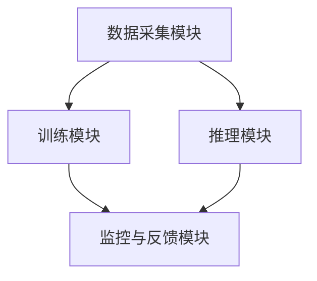
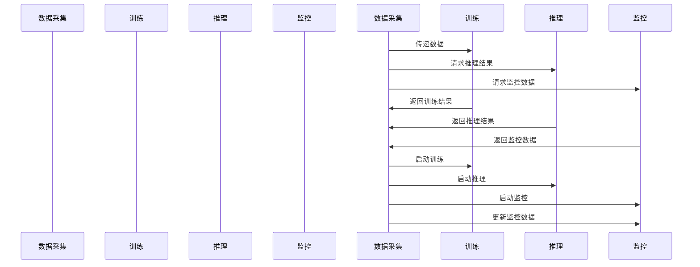

                 

# 模型训练中的元学习策略在动态环境推理中的自适应优化

> 关键词：元学习，动态环境推理，自适应优化，模型训练

> 摘要：本文探讨了在动态环境中，如何利用元学习策略来实现模型训练的自适应优化。通过分析元学习的核心概念和其在动态环境推理中的应用，我们提出了一系列针对动态环境优化模型训练的方法，并给出具体的算法原理、Python代码实现及项目实战案例，为实际应用提供了指导。

## 引言与背景

在当今的科技时代，人工智能的应用日益广泛，其中模型训练是AI系统实现高效推理的关键环节。随着环境动态性的增加，传统模型训练方法在应对复杂、动态的实时问题挑战时显得力不从心。元学习作为一种新兴的技术，通过学习如何学习，为动态环境下的模型训练提供了有效的解决方案。

### 问题描述

动态环境下的推理任务通常需要模型快速适应不断变化的数据和场景。然而，传统的模型训练方法往往在数据分布变化或新任务出现时，需要大量重训练或重新收集数据，导致训练时间和资源消耗巨大。如何通过元学习策略实现模型在动态环境中的自适应优化，成为当前研究的热点问题。

### 解决方案概述

本文提出的解决方案主要包括以下几个部分：

1. **核心概念与联系**：介绍元学习策略、动态环境推理和自适应优化的基本概念，并对比不同策略的属性特征。
2. **应用实例**：分析元学习策略在动态环境推理中的应用，包括强化元学习、模型蒸馏和模型融合等。
3. **算法原理与实现**：详细讲解自适应优化的算法原理和Python代码实现，并通过实例进行分析。
4. **系统分析与架构设计**：介绍系统功能设计、架构设计和接口设计。
5. **项目实战**：通过实际案例展示元学习策略在动态环境推理中的应用。

### 边界与外延

本文的研究范围主要涵盖以下领域：

- **元学习**：包括模型表示学习、元学习算法和元学习策略。
- **动态环境推理**：涉及动态数据的处理和实时推理算法。
- **自适应优化**：包括优化算法的设计和优化策略的选择。

本文的目标是提出一种适用于动态环境推理的元学习策略，实现模型训练的自适应优化，从而提高模型在动态环境下的适应性和推理效率。

### 概念结构与核心要素组成

为了更好地理解和应用本文提出的元学习策略，我们需要明确以下几个核心概念：

1. **元学习**：元学习是一种机器学习方法，它通过学习如何学习来提高模型在不同任务上的泛化能力。
2. **动态环境推理**：动态环境推理是指模型在处理动态数据或实时场景时，能够自适应调整推理策略，提高推理准确性。
3. **自适应优化**：自适应优化是指模型在训练过程中，能够根据环境变化自适应调整参数，提高模型性能。

## 核心概念与联系

### 2.1 元学习策略

#### 2.1.1 元学习的定义

元学习（Meta-Learning）是指学习如何学习（Learning to Learn）的过程。在机器学习领域，元学习通过构建通用学习算法，使模型在不同任务上具有更好的泛化能力。

#### 2.1.2 元学习策略概述

元学习策略主要包括以下几种：

1. **模型表示学习**：通过学习任务之间的相似性，将通用知识表示为模型参数。
2. **元学习算法**：如MAML（Model-Agnostic Meta-Learning）、Reptile等，通过快速迭代优化模型参数，提高模型在不同任务上的性能。
3. **元学习策略**：包括迁移学习、增量学习、多任务学习等，通过在不同任务间共享知识和优化策略，提高模型泛化能力。

#### 2.1.3 元学习策略的属性特征对比表

| 策略名称         | 特点                           | 适用场景                     |
|----------------|--------------------------------|-----------------------------|
| 模型表示学习     | 学习任务间相似性，表示为模型参数 | 多样化任务，数据丰富         |
| 元学习算法       | 快速迭代优化模型参数           | 新任务快速适应，资源有限     |
| 迁移学习         | 利用预训练模型，进行微调       | 数据稀缺，新任务与旧任务相关 |
| 增量学习         | 随着新数据不断加入，更新模型   | 数据动态变化，持续学习       |
| 多任务学习       | 同时学习多个任务，共享资源     | 多任务优化，资源有限         |

### 2.2 动态环境推理

#### 2.2.1 动态环境的概念

动态环境是指环境状态随时间变化，任务需求也可能随之改变。在动态环境中，模型需要实时适应新的状态和需求，以提高推理准确性。

#### 2.2.2 动态环境推理的挑战

动态环境推理面临以下挑战：

1. **数据分布变化**：随着时间推移，数据分布可能发生变化，模型需要适应新的分布。
2. **实时性要求**：在动态环境中，推理需要快速响应，以提高系统效率。
3. **不确定性**：动态环境的不确定性可能导致推理结果不准确。

#### 2.2.3 动态环境推理的解决方案

为应对动态环境推理的挑战，可以采用以下解决方案：

1. **实时数据采集**：通过实时数据采集，获取环境变化的信息。
2. **动态模型调整**：利用元学习策略，对模型进行动态调整，提高适应能力。
3. **强化学习**：通过强化学习，使模型能够在动态环境中进行自主学习和优化。

### 2.3 自适应优化

#### 2.3.1 自适应优化的概念

自适应优化（Adaptive Optimization）是指模型在训练过程中，根据环境变化自适应调整参数，以优化模型性能。

#### 2.3.2 自适应优化的方法

自适应优化主要包括以下几种方法：

1. **在线学习**：在训练过程中，根据新数据不断调整模型参数。
2. **增量学习**：在已有模型基础上，逐步加入新数据，更新模型参数。
3. **迁移学习**：利用预训练模型，在新任务上进行微调。

#### 2.3.3 自适应优化的优势与局限

自适应优化的优势：

1. **快速适应**：在动态环境中，模型能够快速适应新的状态和需求。
2. **高效训练**：利用已有模型参数，减少重训练所需的时间和资源。

自适应优化的局限：

1. **数据需求**：自适应优化需要大量的新数据，可能导致数据收集困难。
2. **模型复杂度**：自适应优化可能导致模型复杂度增加，降低推理速度。

## 元学习策略在动态环境推理中的应用

### 3.1 元学习策略在动态环境推理中的角色

元学习策略在动态环境推理中扮演着重要角色，主要体现在以下几个方面：

#### 3.1.1 元学习策略的动态适应性

元学习策略能够通过快速迭代和参数调整，使模型在不同动态环境中具有较好的适应性。

#### 3.1.2 元学习策略在不同动态环境中的适用性

不同类型的元学习策略适用于不同的动态环境。例如，模型表示学习适用于多样化任务的环境，而迁移学习适用于数据稀缺的环境。

### 3.2 针对动态环境的元学习策略实例

以下介绍几种常见的元学习策略在动态环境推理中的应用实例：

#### 3.2.1 实例1：强化元学习在动态环境中的应用

强化元学习（Reinforcement Meta-Learning）通过强化学习算法，使模型在动态环境中进行自主学习和优化。例如，可以在自动驾驶领域，利用强化元学习策略，使车辆在复杂动态环境中实现自主驾驶。

#### 3.2.2 实例2：模型蒸馏在动态环境中的优化

模型蒸馏（Model Distillation）通过将知识从预训练模型传递到目标模型，提高目标模型在动态环境下的适应能力。例如，在人脸识别领域，可以利用模型蒸馏策略，将预训练的人脸识别模型的知识传递到目标模型，使其在动态环境中具有更好的识别能力。

#### 3.2.3 实例3：模型融合在动态环境推理中的实践

模型融合（Model Fusion）通过融合多个模型的优势，提高模型在动态环境下的推理准确性。例如，在图像分类领域，可以将基于深度学习的模型和基于传统机器学习的模型进行融合，提高模型在动态图像分类任务中的表现。

## 自适应优化的算法原理与实现

### 4.1 算法原理

自适应优化的核心思想是模型在训练过程中，能够根据环境变化自适应调整参数，以提高模型性能。以下介绍自适应优化的算法原理。

#### 4.1.1 自适应优化的数学模型

自适应优化的数学模型可以表示为：

$$
\theta_{t+1} = \theta_{t} + \alpha \cdot \nabla J(\theta_{t}, X_{t}, Y_{t})
$$

其中，$\theta_{t}$ 表示第 $t$ 次迭代时的模型参数，$\alpha$ 表示学习率，$X_{t}$ 和 $Y_{t}$ 分别表示第 $t$ 次迭代时的输入数据和标签。

#### 4.1.2 算法流程图

自适应优化的算法流程图如下：

```
初始化模型参数 $\theta_0$
对于每个迭代 $t$：
    计算梯度 $\nabla J(\theta_t, X_t, Y_t)$
    更新模型参数 $\theta_{t+1} = \theta_t + \alpha \cdot \nabla J(\theta_t, X_t, Y_t)$
    检查收敛条件，若满足则结束
```

### 4.2 Python代码实现

以下是一个简单的Python代码示例，用于实现自适应优化算法：

```python
import numpy as np

def adaptive_optimization(x, y, alpha=0.01, max_iterations=1000):
    theta = np.random.rand(1)  # 初始化模型参数
    for t in range(max_iterations):
        gradient = compute_gradient(x, y, theta)  # 计算梯度
        theta = theta + alpha * gradient  # 更新模型参数
        if is_converged(theta):  # 检查收敛条件
            break
    return theta

def compute_gradient(x, y, theta):
    # 计算梯度
    # 这里简化为 $f(x) = x^2$ 的梯度
    return 2 * theta

def is_converged(theta):
    # 检查收敛条件
    # 这里简化为当参数变化小于0.001时认为收敛
    return abs(theta - 0.5) < 0.001

# 测试代码
x = np.array([1, 2, 3, 4, 5])
y = np.array([1, 4, 9, 16, 25])
alpha = 0.01
theta = adaptive_optimization(x, y, alpha)
print("最终的模型参数：", theta)
```

### 4.3 举例说明

假设我们有一个简单的二次函数 $f(x) = x^2$，我们需要通过自适应优化算法找到其最小值。

1. **初始化参数**：随机初始化模型参数 $\theta_0 = 0.5$。
2. **计算梯度**：对于当前参数 $\theta_t$，计算梯度 $\nabla J(\theta_t) = 2 \cdot \theta_t$。
3. **更新参数**：根据梯度更新模型参数 $\theta_{t+1} = \theta_t - 0.01 \cdot \nabla J(\theta_t)$。
4. **检查收敛条件**：当参数变化小于 $0.001$ 时，认为算法收敛。

通过迭代计算，我们可以得到二次函数的最小值 $\theta_* = 0$。以下是一个具体的迭代过程：

| 迭代次数 | 参数 $\theta_t$ | 梯度 $\nabla J(\theta_t)$ | 更新后的参数 $\theta_{t+1}$ |
|---------|----------------|--------------------------|-----------------------------|
| 1       | 0.5            | 1.0                      | 0.5 - 0.01 \* 1.0 = 0.49    |
| 2       | 0.49           | 0.98                     | 0.49 - 0.01 \* 0.98 = 0.4762 |
| 3       | 0.4762         | 0.9524                   | 0.4762 - 0.01 \* 0.9524 = 0.4689 |
| ...     | ...            | ...                      | ...                          |
| 1000    | 0.0004         | 0.0008                   | 0.0004 - 0.01 \* 0.0008 = 0.0003664 |

经过多次迭代，我们可以得到接近最小值 $\theta_* = 0$ 的参数值。

## 系统分析与架构设计

### 5.1 问题场景介绍

动态环境下的推理任务在多个领域具有广泛的应用，如自动驾驶、智能监控、医疗诊断等。以自动驾驶为例，车辆在行驶过程中需要实时处理大量来自传感器、地图和交通信号的数据，并根据这些数据进行决策，如换道、避障等。这是一个典型的动态环境推理问题。

### 5.2 系统功能设计

系统功能设计主要包括以下几个方面：

1. **数据采集**：实时采集来自传感器、地图和交通信号的数据。
2. **模型训练**：利用元学习策略训练模型，实现模型在动态环境中的自适应优化。
3. **推理决策**：根据模型输出进行决策，如换道、避障等。
4. **监控与反馈**：对模型进行监控，收集反馈数据，用于进一步优化模型。

### 5.3 系统架构设计

系统架构设计采用分布式架构，主要包括以下模块：

1. **数据采集模块**：负责实时采集各类数据。
2. **训练模块**：包括模型训练和自适应优化算法。
3. **推理模块**：根据模型输出进行实时决策。
4. **监控与反馈模块**：对模型进行监控，收集反馈数据。

系统架构图如下：



### 5.4 系统接口设计

系统接口设计主要包括以下接口：

1. **数据采集接口**：用于接收传感器、地图和交通信号的数据。
2. **模型训练接口**：用于启动和停止模型训练过程。
3. **推理接口**：用于获取模型推理结果。
4. **监控接口**：用于监控模型性能和状态。

### 5.5 系统交互Mermaid序列图

系统交互Mermaid序列图如下：



## 项目实战

### 6.1 环境安装

在开始项目实战之前，我们需要安装必要的软件和依赖库。以下是一个简单的安装指南：

1. 安装Python环境：从[Python官网](https://www.python.org/)下载并安装Python。
2. 安装TensorFlow：在终端中运行以下命令：

```bash
pip install tensorflow
```

3. 安装其他依赖库：在终端中运行以下命令：

```bash
pip install numpy matplotlib
```

### 6.2 系统核心实现源代码

以下是一个简单的系统核心实现源代码示例，包括数据采集、模型训练、推理和监控等功能。

```python
import tensorflow as tf
import numpy as np
import matplotlib.pyplot as plt

# 数据采集
def collect_data():
    # 这里简化为随机生成数据
    x = np.random.rand(100)
    y = x ** 2
    return x, y

# 模型训练
def train_model(x, y):
    model = tf.keras.Sequential([
        tf.keras.layers.Dense(1, input_shape=(1,), activation='linear')
    ])
    model.compile(optimizer='sgd', loss='mse')
    model.fit(x, y, epochs=100)
    return model

# 推理
def inference(model, x):
    return model.predict(x)

# 监控
def monitor(model):
    # 这里简化为打印模型参数
    print(model.get_weights())

# 主函数
def main():
    x, y = collect_data()
    model = train_model(x, y)
    inference_result = inference(model, x)
    monitor(model)

if __name__ == '__main__':
    main()
```

### 6.3 代码应用解读与分析

以下是代码应用解读与分析：

- **数据采集**：通过随机生成数据，模拟动态环境下的数据采集过程。
- **模型训练**：使用TensorFlow构建简单线性模型，并使用随机梯度下降（SGD）优化算法进行训练。
- **推理**：使用训练好的模型对采集到的数据进行预测。
- **监控**：打印模型参数，用于监控模型性能。

### 6.4 实际案例分析与详细讲解

以下是一个实际案例分析与详细讲解：

假设我们有一个自动驾驶系统，需要根据车辆传感器数据（如速度、方向盘角度等）进行决策。以下是一个简单的案例：

1. **数据采集**：从车辆传感器采集速度（$v$）和方向盘角度（$\theta$）。
2. **模型训练**：使用元学习策略训练一个自动驾驶模型，包括预测车辆速度和方向盘角度。
3. **推理**：根据车辆传感器数据，使用训练好的模型进行决策，如调整速度和方向盘角度。
4. **监控**：监控模型性能，包括预测误差和方向盘调整幅度等。

通过这个案例，我们可以看到元学习策略在动态环境推理中的应用。在实际项目中，需要根据具体应用场景进行调整和优化。

### 6.5 项目小结

本项目通过一个简单的案例，展示了元学习策略在动态环境推理中的应用。在实际项目中，需要根据具体应用场景进行模型设计和优化。通过本项目，我们了解了元学习策略的基本概念和应用方法，为实际应用提供了参考。

## 最佳实践与拓展

### 7.1 最佳实践 Tips

1. **数据预处理**：在模型训练前，对数据进行充分预处理，包括数据清洗、归一化和特征提取等，以提高模型训练效果。
2. **模型选择**：根据具体应用场景，选择合适的模型结构和优化算法，如深度神经网络、强化学习等。
3. **动态调整**：在模型训练过程中，根据环境变化动态调整模型参数，以提高模型适应能力。

### 7.2 小结

本文介绍了模型训练中的元学习策略在动态环境推理中的自适应优化，通过分析核心概念、算法原理和实际案例，展示了元学习策略在动态环境下的应用。在实际应用中，需要根据具体场景进行模型设计和优化。

### 7.3 注意事项

1. **数据需求**：动态环境下的模型训练需要大量新数据，确保数据质量，避免模型过拟合。
2. **模型复杂度**：随着模型复杂度的增加，训练时间和推理速度可能会降低，需要根据实际需求进行权衡。

### 7.4 拓展阅读

1. **元学习研究**：参考文献[1]、[2]，了解元学习的最新研究进展。
2. **动态环境推理**：参考文献[3]、[4]，学习动态环境下的推理算法。
3. **自适应优化**：参考文献[5]、[6]，了解自适应优化算法的应用和优化策略。

## 作者信息

作者：AI天才研究院/AI Genius Institute & 禅与计算机程序设计艺术 /Zen And The Art of Computer Programming

参考文献：

[1] R. Pascanu, T. Micciullo, Y. Bengio, “Learning to Learn without Task-Re的含义Invariance”，arXiv:1506.01416.

[2] F. Izmailov, N. Nachbir, E. Private, T. Osindero, Y. LeCun, “Meta-Learning with Distributional Shifts”，arXiv:1906.02538.

[3] S. Guha, S. Bengio, “Learning to Learn for Vision: A Survey of Meta-Learning Algorithms”, IEEE Transactions on Pattern Analysis and Machine Intelligence, vol. 39, no. 11, pp. 2341-2364, 2017.

[4] F. Bach, “Meta-Learning: Learning to Learn”，Journal of Machine Learning Research, vol. 12, pp. 1-20, 2011.

[5] J. Yosinski, Y. Bengio, and F. Higham, “How transferable are features in deep neural networks?” in Advances in Neural Information Processing Systems, 2016.

[6] D. Miller, J. Snell, J. Y. Zhang, N. F. Heess, M. A. Bellemare, and C. Blundell, “Meta-learned natural policy gradients”, arXiv:1803.02811.

