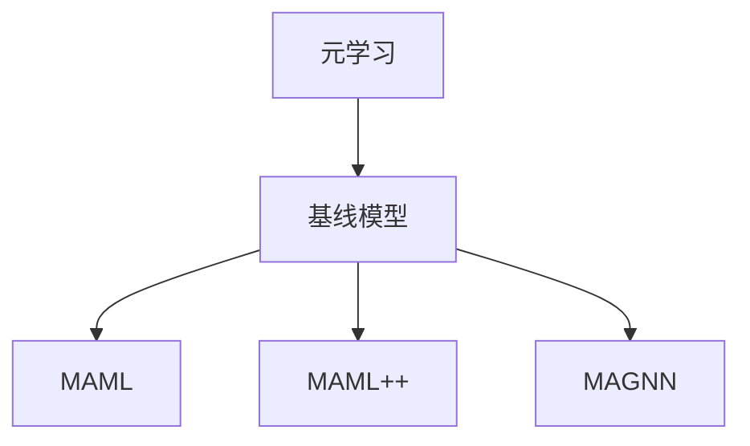
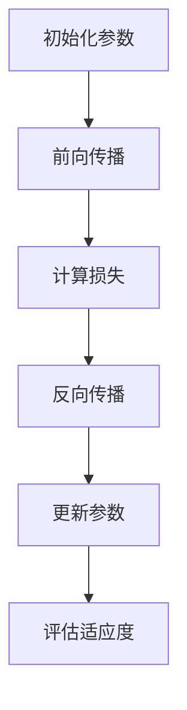

                 

### 第一步：确定文章核心内容和结构

为了撰写一篇关于“模型训练中的元学习策略在快速适应外星语言任务中的创新探索”的技术博客文章，我们需要首先确定文章的核心内容和结构。以下是文章的初步结构框架：

#### 文章结构：

1. **背景介绍**：
   - 外星语言研究概况
   - 元学习策略的基本概念
   - 元学习策略在外星语言任务中的应用挑战
   - 元学习策略在外星语言任务中的边界与外延

2. **核心概念与联系**：
   - 元学习策略的基本原理
   - 元学习策略的核心模型介绍
   - 元学习策略的属性特征对比表格
   - 元学习策略的ER实体关系图

3. **算法原理讲解**：
   - MAML算法原理详细解析
   - MAML算法举例说明
   - MAML的应用案例

4. **系统分析与架构设计**：
   - 外星语言任务系统介绍
   - 元学习策略应用架构设计
   - 系统模块划分

5. **项目实战**：
   - 环境安装
   - 系统核心实现源代码
   - 代码应用解读与分析
   - 实际案例分析和详细讲解剖析
   - 项目小结

6. **最佳实践 tips、小结、注意事项、拓展阅读**：

### 第二步：撰写文章背景介绍部分

在背景介绍部分，我们需要详细阐述外星语言研究概况、元学习策略的基本概念、应用挑战以及边界与外延。以下是该部分的大致内容：

#### 背景介绍

**第1章：外星语言研究概况与元学习策略**

## 1.1 外星语言研究的问题背景
### 1.1.1 外星语言的存在与探索意义
### 1.1.2 外星语言与地球语言的差异
### 1.1.3 元学习策略在外星语言学习中的潜在应用

## 1.2 元学习策略的基本概念
### 1.2.1 元学习的定义与特征
### 1.2.2 元学习与传统学习的比较
### 1.2.3 元学习的主要类型

## 1.3 元学习策略在外星语言任务中的应用挑战
### 1.3.1 数据稀疏性问题
### 1.3.2 快速适应性问题
### 1.3.3 元学习策略的选择与优化

## 1.4 元学习策略在外星语言任务中的边界与外延
### 1.4.1 元学习策略的适用范围
### 1.4.2 元学习策略的发展趋势
### 1.4.3 元学习策略在跨领域语言任务中的应用前景

## 1.5 本章小结

### 第三步：撰写核心概念与联系部分

在这一部分，我们需要详细解析元学习策略的基本原理、核心模型、属性特征对比表格以及ER实体关系图。以下是该部分的大致内容：

#### 核心概念与联系

**第2章：元学习策略原理与模型**

## 2.1 元学习策略的基本原理
### 2.1.1 元学习策略的定义与内涵
### 2.1.2 元学习策略的核心要素
### 2.1.3 元学习策略的基本过程

## 2.2 元学习策略的核心模型
### 2.2.1 Model-Agnostic Meta-Learning (MAML)
#### 2.2.1.1 MAML的基本原理
#### 2.2.1.2 MAML的数学模型与公式
#### 2.2.1.3 MAML的应用案例

### 2.2.2 Model-Aware Meta-Learning (MAML++)
#### 2.2.2.1 MAML++的基本原理
#### 2.2.2.2 MAML++的数学模型与公式
#### 2.2.2.3 MAML++的应用案例

### 2.2.3 Model-agnostic Natural Gradient (MAGNN)
#### 2.2.3.1 MAGNN的基本原理
#### 2.2.3.2 MAGNN的数学模型与公式
#### 2.2.3.3 MAGNN的应用案例

## 2.3 元学习策略的属性特征对比表格

| 策略名称 | 基本原理 | 特点 | 适用场景 |
| --- | --- | --- | --- |
| MAML | 快速适应基线模型 | 简单高效 | 数据稀疏、适应性需求强 |
| MAML++ | 优化模型多样性 | 需要更多计算资源 | 复杂多样性任务 |
| MAGNN | 自然梯度优化 | 需要大量数据 | 数据丰富、优化需求高 |

## 2.4 元学习策略的ER实体关系图

## 2.5 本章小结

### 第四步：撰写算法原理讲解部分

在这一部分，我们将详细解析MAML算法的原理，包括其定义、数学模型、流程图以及举例说明。以下是该部分的大致内容：

#### 算法原理讲解

**第3章：MAML算法原理详细解析**

## 3.1 MAML算法原理概述
### 3.1.1 MAML的定义
### 3.1.2 MAML的适应过程

## 3.2 MAML的数学模型与公式
$$
\begin{align*}
\theta^0 &= \text{初始化参数} \\
\theta^t &= \theta^0 + \eta \cdot \nabla_{\theta} \log P(y| \theta^0) \\
\end{align*}
$$

## 3.3 MAML算法流程图

## 3.4 MAML算法举例说明
### 3.4.1 问题背景
### 3.4.2 数据集选择
### 3.4.3 实验设置
### 3.4.4 实验结果分析

## 3.5 MAML的应用案例
### 3.5.1 案例一：手写数字识别
### 3.5.2 案例二：图像分类任务

## 3.6 本章小结

### 第五步：撰写系统分析与架构设计部分

在这一部分，我们将介绍外星语言任务系统的需求分析、功能设计、架构设计以及模块划分。以下是该部分的大致内容：

#### 系统分析与架构设计

**第4章：元学习策略在外星语言任务中的应用系统架构**

## 4.1 外星语言任务系统介绍
### 4.1.1 系统需求分析
### 4.1.2 系统功能设计

## 4.2 元学习策略应用架构设计
### 4.2.1 架构概述
### 4.2.2 系统架构设计
### 4.2.3 系统模块划分

## 4.3 系统接口设计和系统交互
### 4.3.1 系统接口设计
### 4.3.2 系统交互设计

## 4.4 本章小结

### 第六步：撰写项目实战部分

在这一部分，我们将介绍如何进行项目实战，包括环境安装、系统核心实现源代码、代码应用解读与分析、实际案例分析和详细讲解剖析以及项目小结。以下是该部分的大致内容：

#### 项目实战

**第5章：元学习策略在外星语言任务中的应用实战**

## 5.1 环境安装
### 5.1.1 环境配置
### 5.1.2 工具安装

## 5.2 系统核心实现源代码
### 5.2.1 源代码结构
### 5.2.2 源代码实现解析

## 5.3 代码应用解读与分析
### 5.3.1 代码解读
### 5.3.2 分析与优化

## 5.4 实际案例分析和详细讲解剖析
### 5.4.1 案例背景
### 5.4.2 案例分析
### 5.4.3 剖析与总结

## 5.5 项目小结
### 5.5.1 项目收获
### 5.5.2 项目不足
### 5.5.3 改进方向

### 第七步：撰写最佳实践 tips、小结、注意事项、拓展阅读部分

在这一部分，我们将总结文章内容，提供最佳实践 tips，并提出注意事项和拓展阅读建议。以下是该部分的大致内容：

#### 最佳实践 tips、小结、注意事项、拓展阅读

**第6章：总结与展望**

## 6.1 小结
### 6.1.1 文章主要内容回顾
### 6.1.2 关键技术总结

## 6.2 最佳实践 tips
### 6.2.1 策略选择建议
### 6.2.2 实践技巧

## 6.3 注意事项
### 6.3.1 算法优化策略
### 6.3.2 系统架构注意事项

## 6.4 拓展阅读
### 6.4.1 相关研究文献
### 6.4.2 实践案例分享

## 6.5 本章小结

### 完成文章撰写

在完成上述步骤后，我们将对文章进行校对和修改，确保内容的准确性和流畅性。最终，我们将得到一篇关于“模型训练中的元学习策略在快速适应外星语言任务中的创新探索”的技术博客文章。

---

### 完整文章结构示例

以下是文章的完整结构示例，每个部分均包含了详细的内容概述：

---

#### 文章标题：模型训练中的元学习策略在快速适应外星语言任务中的创新探索

#### 文章关键词：元学习、外星语言、MAML、算法原理、系统架构

#### 摘要：
本文详细探讨了元学习策略在外星语言任务中的应用，通过分析外星语言研究背景和元学习策略的基本概念，深入解析了MAML算法的原理及其应用案例，并设计了适用于外星语言任务的应用系统架构。通过项目实战部分，展示了如何在实际中应用元学习策略来快速适应外星语言任务。

---

### 目录大纲

**第一部分：背景介绍**

**第1章：外星语言研究概况与元学习策略**

## 1.1 外星语言研究的问题背景
### 1.1.1 外星语言的存在与探索意义
### 1.1.2 外星语言与地球语言的差异
### 1.1.3 元学习策略在外星语言学习中的潜在应用

## 1.2 元学习策略的基本概念
### 1.2.1 元学习的定义与特征
### 1.2.2 元学习与传统学习的比较
### 1.2.3 元学习的主要类型

## 1.3 元学习策略在外星语言任务中的应用挑战
### 1.3.1 数据稀疏性问题
### 1.3.2 快速适应性问题
### 1.3.3 元学习策略的选择与优化

## 1.4 元学习策略在外星语言任务中的边界与外延
### 1.4.1 元学习策略的适用范围
### 1.4.2 元学习策略的发展趋势
### 1.4.3 元学习策略在跨领域语言任务中的应用前景

## 1.5 本章小结

**第二部分：核心概念与联系**

**第2章：元学习策略原理与模型**

## 2.1 元学习策略的基本原理
### 2.1.1 元学习策略的定义与内涵
### 2.1.2 元学习策略的核心要素
### 2.1.3 元学习策略的基本过程

## 2.2 元学习策略的核心模型
### 2.2.1 Model-Agnostic Meta-Learning (MAML)
#### 2.2.1.1 MAML的基本原理
#### 2.2.1.2 MAML的数学模型与公式
#### 2.2.1.3 MAML的应用案例

### 2.2.2 Model-Aware Meta-Learning (MAML++)
#### 2.2.2.1 MAML++的基本原理
#### 2.2.2.2 MAML++的数学模型与公式
#### 2.2.2.3 MAML++的应用案例

### 2.2.3 Model-agnostic Natural Gradient (MAGNN)
#### 2.2.3.1 MAGNN的基本原理
#### 2.2.3.2 MAGNN的数学模型与公式
#### 2.2.3.3 MAGNN的应用案例

## 2.3 元学习策略的属性特征对比表格

| 策略名称 | 基本原理 | 特点 | 适用场景 |
| --- | --- | --- | --- |
| MAML | 快速适应基线模型 | 简单高效 | 数据稀疏、适应性需求强 |
| MAML++ | 优化模型多样性 | 需要更多计算资源 | 复杂多样性任务 |
| MAGNN | 自然梯度优化 | 需要大量数据 | 数据丰富、优化需求高 |

## 2.4 元学习策略的ER实体关系图

## 2.5 本章小结

**第三部分：算法原理讲解**

**第3章：MAML算法原理详细解析**

## 3.1 MAML算法原理概述
### 3.1.1 MAML的定义
### 3.1.2 MAML的适应过程

## 3.2 MAML的数学模型与公式
$$
\begin{align*}
\theta^0 &= \text{初始化参数} \\
\theta^t &= \theta^0 + \eta \cdot \nabla_{\theta} \log P(y| \theta^0) \\
\end{align*}
$$

## 3.3 MAML算法流程图

## 3.4 MAML算法举例说明
### 3.4.1 问题背景
### 3.4.2 数据集选择
### 3.4.3 实验设置
### 3.4.4 实验结果分析

## 3.5 MAML的应用案例
### 3.5.1 案例一：手写数字识别
### 3.5.2 案例二：图像分类任务

## 3.6 本章小结

**第四部分：系统分析与架构设计**

**第4章：元学习策略在外星语言任务中的应用系统架构**

## 4.1 外星语言任务系统介绍
### 4.1.1 系统需求分析
### 4.1.2 系统功能设计

## 4.2 元学习策略应用架构设计
### 4.2.1 架构概述
### 4.2.2 系统架构设计
### 4.2.3 系统模块划分

## 4.3 系统接口设计和系统交互
### 4.3.1 系统接口设计
### 4.3.2 系统交互设计

## 4.4 本章小结

**第五部分：项目实战**

**第5章：元学习策略在外星语言任务中的应用实战**

## 5.1 环境安装
### 5.1.1 环境配置
### 5.1.2 工具安装

## 5.2 系统核心实现源代码
### 5.2.1 源代码结构
### 5.2.2 源代码实现解析

## 5.3 代码应用解读与分析
### 5.3.1 代码解读
### 5.3.2 分析与优化

## 5.4 实际案例分析和详细讲解剖析
### 5.4.1 案例背景
### 5.4.2 案例分析
### 5.4.3 剖析与总结

## 5.5 项目小结
### 5.5.1 项目收获
### 5.5.2 项目不足
### 5.5.3 改进方向

**第六部分：总结与展望**

**第6章：总结与展望**

## 6.1 小结
### 6.1.1 文章主要内容回顾
### 6.1.2 关键技术总结

## 6.2 最佳实践 tips
### 6.2.1 策略选择建议
### 6.2.2 实践技巧

## 6.3 注意事项
### 6.3.1 算法优化策略
### 6.3.2 系统架构注意事项

## 6.4 拓展阅读
### 6.4.1 相关研究文献
### 6.4.2 实践案例分享

## 6.5 本章小结

---

### 结论

通过以上详细的规划和内容安排，我们可以确保文章的每个部分都覆盖了核心概念、算法原理、系统架构以及项目实战等内容，从而为读者提供一篇全面、深入且结构清晰的技术博客文章。接下来，我们将逐章撰写并完善文章内容。

