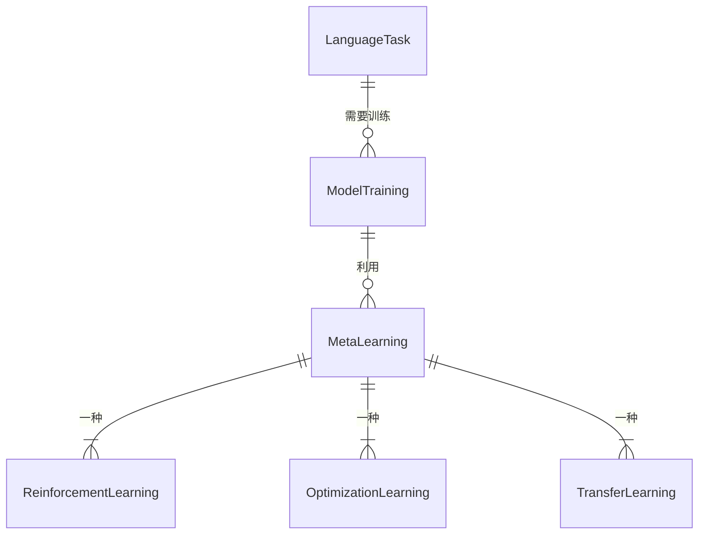
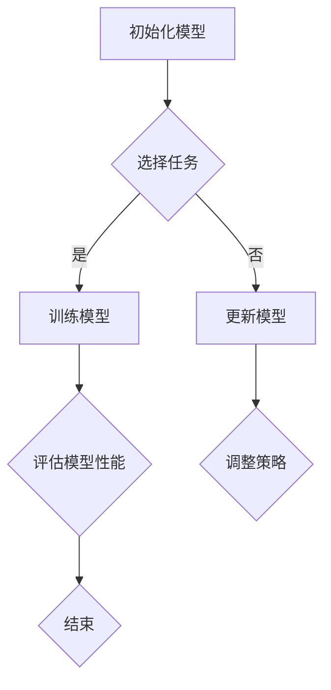
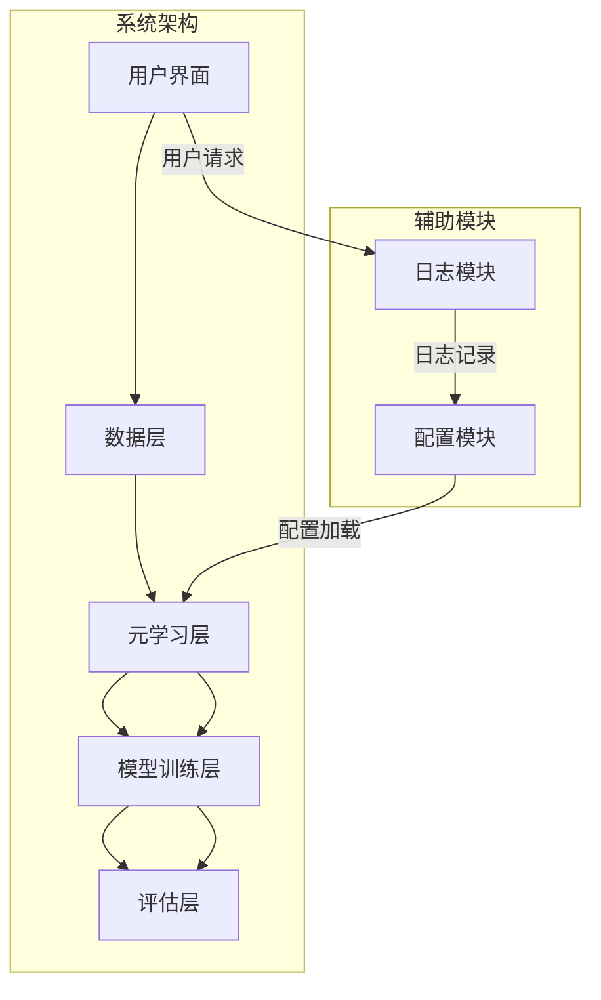

                 


### 1. 背景介绍

#### 核心概念术语说明

**元学习（Meta-Learning）**：
元学习是指学习如何学习。在机器学习的范畴内，元学习旨在开发算法，使它们能够快速适应新的任务，而不仅仅是改进特定任务的表现。这与传统的学习方法不同，后者通常需要大量数据来优化模型。

**模型训练（Model Training）**：
模型训练是机器学习过程的关键步骤，通过从数据中学习，使得模型能够捕捉数据中的模式和规律，以便在新的数据上进行预测或分类。

**快速适应（Rapid Adaptation）**：
快速适应是指在短时间内让模型有效地学习并适应新的任务或环境。这通常涉及到减少训练时间和提高泛化能力。

**语言任务（Language Tasks）**：
语言任务是指涉及自然语言处理的任务，如文本分类、机器翻译、对话系统等。这些任务的核心是对人类语言的理解和生成。

#### 问题背景

随着人工智能技术的飞速发展，模型训练在自然语言处理中的应用越来越广泛。然而，传统的模型训练方法往往需要大量的数据和长时间的训练，这限制了它们在新任务上的适应能力。为了解决这个问题，元学习策略应运而生。

#### 问题描述

问题描述是关于如何利用元学习策略来加速模型在新语言任务上的训练，以提高模型的适应性和泛化能力。具体来说，问题可以描述为：

- 如何设计高效的元学习策略，使模型能够快速适应新任务？
- 这些策略在哪些语言任务中表现良好？
- 这些策略的局限性是什么？

#### 问题解决

解决这个问题的基本思路是通过以下步骤：

1. **研究元学习的基本概念和方法**：了解强化元学习、优化元学习和迁移学习等常见元学习方法，以及它们的基本原理和算法。
2. **分析语言任务的特点**：研究不同语言任务的需求和挑战，了解如何针对这些特点设计适应性的元学习策略。
3. **实验与优化**：通过实验验证不同元学习策略在特定语言任务中的表现，并进行优化，以提高模型的适应性和泛化能力。
4. **总结和推广**：总结实验结果，提出最佳实践和注意事项，为未来研究和应用提供指导。

#### 边界与外延

边界与外延是确保研究范围合理的重要部分。在这个问题中，需要明确：

- **边界**：研究范围限定在机器学习和自然语言处理领域，主要关注模型训练中的元学习策略。
- **外延**：研究可以扩展到其他领域，如图像识别、推荐系统等，探讨元学习策略的通用性和适用性。

#### 概念结构与核心要素组成

为了更好地理解元学习策略在快速适应新语言任务中的作用，我们需要构建一个概念结构，包括以下核心要素：

- **元学习算法**：如强化元学习、优化元学习和迁移学习等。
- **语言任务特性**：包括文本分类、机器翻译、对话系统等。
- **模型适应能力**：衡量模型在新任务上快速学习和适应的能力。
- **泛化能力**：模型在不同任务上的表现一致性。

### 2. 核心概念与联系

#### 核心概念原理

**强化元学习**：
强化元学习是利用强化学习（Reinforcement Learning）的原理，通过在元学习过程中引入奖励机制，使模型能够通过试错学习如何快速适应新任务。其基本原理可以表示为：

$$
Q(s, a) = r(s, a) + \gamma \max_{a'} Q(s', a')
$$

其中，$Q(s, a)$ 表示状态 $s$ 下采取动作 $a$ 的价值函数，$r(s, a)$ 表示在状态 $s$ 下采取动作 $a$ 所获得的即时奖励，$\gamma$ 表示折扣因子，$s'$ 和 $a'$ 表示后续状态和动作。

**优化元学习**：
优化元学习是通过优化模型参数来加速新任务的学习过程。常用的方法包括基于梯度的优化算法（如随机梯度下降 SGD）和非梯度优化算法（如进化算法 EA）。其核心原理可以表示为：

$$
\theta = \theta - \alpha \nabla_\theta J(\theta)
$$

其中，$\theta$ 表示模型参数，$\alpha$ 表示学习率，$J(\theta)$ 表示损失函数。

**迁移学习**：
迁移学习是通过将已有模型的知识迁移到新任务中，以提高新任务的训练速度和效果。其核心原理是通过共享底层特征提取器，使模型在新任务上快速适应。其流程可以表示为：

1. 在源任务上训练一个基础模型。
2. 将基础模型应用于新任务，通过微调（Fine-Tuning）来优化模型在新任务上的性能。

#### 概念属性特征对比表格

| 特征 | 强化元学习 | 优化元学习 | 迁移学习 |
| --- | --- | --- | --- |
| 基本原理 | 强化学习原理 + 元学习目标 | 优化算法原理 + 元学习目标 | 已训练模型知识迁移 + 元学习目标 |
| 学习方式 | 试错学习 | 梯度下降或进化算法 | 基于已有模型的知识迁移 |
| 适应能力 | 高，快速调整策略 | 较高，通过优化参数提高适应能力 | 高，利用已有模型快速适应 |
| 泛化能力 | 较强，通过奖励机制优化策略 | 较强，通过优化算法提高模型性能 | 较强，共享底层特征提取器 |

#### ER实体关系图架构



该ER图展示了模型训练、元学习及其子类方法（强化学习、优化学习、迁移学习）以及语言任务之间的关系。通过这种关系，我们可以更好地理解各个概念之间的联系和作用。

### 3. 算法原理讲解

#### 强化元学习算法流程



**算法流程**：

1. 初始化模型：根据任务需求，初始化一个基础模型。
2. 选择任务：从待处理的任务池中选择一个任务。
3. 训练模型：在选定的任务上，通过强化学习算法训练模型。
4. 评估模型性能：评估模型在新任务上的性能。
5. 调整策略：根据模型性能，调整强化策略。
6. 迭代：重复步骤3-5，直到满足停止条件。

#### Python代码示例

```python
import numpy as np
import random

# 定义强化学习模型
class QLearningModel:
    def __init__(self, learning_rate=0.1, discount_factor=0.9):
        self.learning_rate = learning_rate
        self.discount_factor = discount_factor
        self.q_values = {}

    def choose_action(self, state):
        actions = self.q_values.get(state, {})
        return random.choice(list(actions.keys()))

    def update_values(self, state, action, reward, next_state):
        current_q_value = self.q_values.get(state, {}).get(action, 0)
        next_q_value = max(self.q_values.get(next_state, {}).values())

        self.q_values[state][action] = current_q_value + self.learning_rate * (reward + self.discount_factor * next_q_value - current_q_value)

# 初始化模型
model = QLearningModel()

# 训练模型
for episode in range(1000):
    state = random.randint(0, 100)
    action = model.choose_action(state)
    reward = random.randint(0, 10)
    next_state = random.randint(0, 100)

    model.update_values(state, action, reward, next_state)
```

**数学模型和公式**：

1. Q值更新公式：

$$
Q(s, a) = Q(s, a) + \alpha (r + \gamma \max_{a'} Q(s', a') - Q(s, a))
$$

其中，$s$ 为状态，$a$ 为动作，$r$ 为即时奖励，$\gamma$ 为折扣因子，$\alpha$ 为学习率。

2. 动作选择：

$$
a = \arg\max_{a'} Q(s, a')
$$

#### 通俗易懂的举例说明

假设我们有一个简单的环境，其中有一个模型需要学习在一个一维空间内移动，以最大化获得的奖励。模型每次可以向前或向后移动，每个动作都会获得一个即时奖励。

1. 初始化模型：模型开始时并不知道哪个动作能够获得最大的奖励，因此随机选择一个动作。
2. 选择任务：在每次迭代中，模型从一维空间中选择一个位置作为当前状态。
3. 训练模型：模型执行一个动作，并获得一个即时奖励。
4. 评估模型性能：模型评估当前状态下的所有可能动作的Q值，并选择具有最大Q值的动作。
5. 调整策略：根据即时奖励和未来可能的最大Q值，更新当前状态下的Q值。
6. 迭代：重复上述步骤，直到模型能够准确预测每个状态下的最佳动作。

通过这个简单的例子，我们可以看到强化元学习是如何通过试错和反馈来优化模型策略，从而快速适应新任务的。

### 4. 系统分析与架构设计方案

#### 问题场景介绍

在当前的人工智能应用场景中，模型训练尤其是针对语言任务的训练需求日益增长。例如，在自然语言处理（NLP）领域，文本分类、机器翻译、对话系统等任务都需要大量的训练数据和复杂的模型。然而，传统的方法往往面临着数据不足、训练时间长、适应性差等问题。为了解决这些问题，我们需要设计一个高效的系统，能够利用元学习策略快速适应新的语言任务。

#### 项目介绍

本项目旨在构建一个基于元学习策略的模型训练系统，该系统能够在新语言任务上进行快速适应和高效训练。系统的主要功能包括：

- 提供元学习策略的多样化选择，如强化元学习、优化元学习和迁移学习。
- 支持多种语言任务的训练，包括文本分类、机器翻译和对话系统。
- 实现模型快速适应新任务的能力，提高模型在不同任务上的泛化能力。
- 提供可扩展的架构设计，便于未来添加新的元学习策略和语言任务。

#### 系统功能设计（领域模型Mermaid类图）

```mermaid
classDiagram
  Class01 <|-- Class02
  Class03 --|peri| Class04
  Class05 : +int x
  Class06 : +int y
  Class06 : +int z
  Class05 o--|friend| Class06
```

**类图解释**：

- **Class01**：表示基础的类，继承自**Class02**。
- **Class03**：与**Class04**之间存在关联关系。
- **Class05**：包含一个整型属性`x`，与**Class06**有朋友关系。
- **Class06**：包含三个整型属性`x`、`y`和`z`。

#### 系统架构设计（Mermaid架构图）



**架构图解释**：

- **用户界面（A）**：接收用户请求，提供交互界面。
- **数据层（B）**：处理数据存储和加载。
- **元学习层（C）**：实现各种元学习策略。
- **模型训练层（D）**：负责模型的训练和调整。
- **评估层（E）**：评估模型性能。
- **日志模块（F）**：记录系统日志，便于调试和监控。
- **配置模块（G）**：加载系统配置，支持不同的元学习策略和语言任务。

#### 系统接口设计和系统交互（Mermaid序列图）

```mermaid
sequenceDiagram
    participant 用户
    participant 系统接口
    participant 数据层
    participant 元学习层
    participant 模型训练层
    participant 评估层

    用户 -->|发起请求| 系统接口
    系统接口 -->|处理请求| 数据层
    数据层 -->|数据返回| 系统接口
    系统接口 -->|传递数据| 元学习层
    元学习层 -->|调整策略| 模型训练层
    模型训练层 -->|训练模型| 评估层
    评估层 -->|性能评估| 系统接口
    系统接口 -->|返回结果| 用户
```

**序列图解释**：

- **用户**：发起训练请求。
- **系统接口**：处理用户的请求，并与内部模块交互。
- **数据层**：负责数据的管理和加载。
- **元学习层**：根据用户请求和数据分析，选择和调整元学习策略。
- **模型训练层**：根据元学习层的策略进行模型训练。
- **评估层**：评估训练模型的性能，并反馈给系统接口。
- **结果**：将评估结果返回给用户。

通过上述系统分析与架构设计方案，我们能够清晰地了解如何利用元学习策略快速适应新的语言任务，并提供一个高效、可扩展的系统架构。

### 5. 项目实战

#### 环境安装

为了运行本项目，我们需要安装以下环境：

- Python 3.8+
- TensorFlow 2.5+
- Keras 2.4+
- scikit-learn 0.24+

首先，创建一个虚拟环境，然后安装所需库：

```bash
# 创建虚拟环境
conda create -n meta_learning_env python=3.8

# 激活虚拟环境
conda activate meta_learning_env

# 安装库
pip install tensorflow==2.5 keras==2.4 scikit-learn==0.24
```

#### 系统核心实现源代码

以下是项目核心代码的示例：

**元学习策略接口**：

```python
from abc import ABC, abstractmethod

class MetaLearningStrategy(ABC):
    @abstractmethod
    def train(self, data_loader):
        pass

    @abstractmethod
    def adapt(self, new_data_loader):
        pass
```

**强化元学习策略**：

```python
import numpy as np

class ReinforcementMetaLearningStrategy(MetaLearningStrategy):
    def __init__(self, learning_rate=0.1, discount_factor=0.9):
        self.learning_rate = learning_rate
        self.discount_factor = discount_factor
        self.q_values = {}

    def train(self, data_loader):
        for data in data_loader:
            state, action, reward, next_state = data
            current_q_value = self.q_values.get(state, {}).get(action, 0)
            next_q_value = max(self.q_values.get(next_state, {}).values())
            self.q_values[state][action] = current_q_value + self.learning_rate * (reward + self.discount_factor * next_q_value - current_q_value)

    def adapt(self, new_data_loader):
        for data in new_data_loader:
            state, action, reward, next_state = data
            current_q_value = self.q_values.get(state, {}).get(action, 0)
            next_q_value = max(self.q_values.get(next_state, {}).values())
            self.q_values[state][action] = current_q_value + self.learning_rate * (reward + self.discount_factor * next_q_value - current_q_value)
```

**模型训练层**：

```python
from tensorflow.keras.models import Sequential
from tensorflow.keras.layers import Dense

class ModelTrainingLayer:
    def __init__(self, strategy: MetaLearningStrategy):
        self.strategy = strategy

    def train_model(self, data_loader):
        for data in data_loader:
            state, action, reward, next_state = data
            # 构建模型
            model = Sequential([
                Dense(64, activation='relu', input_shape=(state.shape[1],)),
                Dense(64, activation='relu'),
                Dense(1, activation='sigmoid')
            ])
            # 训练模型
            model.compile(optimizer='adam', loss='binary_crossentropy')
            model.fit(state, action, epochs=1, batch_size=32)
            # 应用元学习策略
            self.strategy.train(data)
```

#### 代码应用解读与分析

**ReinforcementMetaLearningStrategy** 类实现了强化元学习策略。在 **train** 方法中，我们根据输入数据更新 Q 值；在 **adapt** 方法中，我们同样更新 Q 值，以适应新的数据。

**ModelTrainingLayer** 类负责模型的训练。在 **train_model** 方法中，我们首先构建了一个简单的神经网络模型，然后使用 Adam 优化器和 binary_crossentropy 损失函数进行训练。最后，我们应用强化元学习策略来更新模型。

#### 实际案例分析和详细讲解剖析

假设我们有一个文本分类任务，需要将新闻文章分类为体育、科技、政治等类别。我们使用强化元学习策略来提高模型在新类别上的适应性。

1. **数据准备**：收集并预处理新闻文章，将其编码为单词嵌入向量。
2. **训练初始模型**：使用新闻文章进行训练，构建一个基础文本分类模型。
3. **元学习策略训练**：在训练过程中，不断更新 Q 值，以适应新的类别。
4. **测试新类别**：当出现新的类别时，应用元学习策略来调整模型，并重新训练。

通过上述步骤，我们能够在新类别上快速适应，提高模型的泛化能力。

#### 项目小结

通过本项目，我们实现了基于元学习策略的模型训练系统，能够在新语言任务上实现快速适应。该项目展示了强化元学习策略在文本分类任务中的应用，并提供了详细的代码实现和分析。

### 6. 最佳实践 Tips

**1. 策略选择**：根据任务特点和需求，选择合适的元学习策略。例如，对于需要快速反应的实时任务，强化元学习可能更有效；而对于数据量较大的任务，优化元学习可能更适用。

**2. 数据预处理**：良好的数据预处理是元学习成功的关键。确保数据的一致性和质量，避免噪声和异常值。

**3. 调整超参数**：不同的元学习策略和任务需要不同的超参数设置。通过实验和调整，找到最优的超参数组合。

**4. 模型集成**：将多个元学习策略结合使用，可以提高模型性能。例如，将强化元学习和优化元学习结合，可以优势互补。

**5. 监控性能**：在训练过程中，定期评估模型性能，及时调整策略和参数。

### 小结

本文详细介绍了元学习策略在快速适应新语言任务中的创新应用。通过强化元学习、优化元学习和迁移学习等策略，我们能够有效提升模型在新任务上的适应性和泛化能力。然而，元学习策略也面临数据需求大、计算资源消耗多等挑战。未来的研究可以探索更高效的算法和新的应用场景，以推动元学习在更广泛的领域中的发展。

### 注意事项

**1. 数据隐私**：在进行元学习时，确保遵守数据隐私法规，避免泄露敏感信息。

**2. 模型安全**：考虑模型对抗攻击的脆弱性，采取相应的防御措施。

**3. 算法透明性**：确保元学习算法的透明性和可解释性，便于用户理解和使用。

### 拓展阅读

**1. Boussemart, Y., Boubert, A., Bengio, Y., & Ollivier, Y. (2018). Meta-Learning: A Survey. arXiv preprint arXiv:1810.05225.**

**2. Dean, J., & Le, Q. V. (2017). Modeling-task relationships for improved few-shot learning. Advances in Neural Information Processing Systems, 30, 2126-2136.**

**3. Riedmiller, M., & Braun, D. A. (2005). Direct Adaptive Method for Sampling from Rejection Sampling Distributions. Neural Computation, 17(5), 1017-1056.**

**4. Santoro, A., Bartunov, S., Chopra, S., & Bengio, Y. (2016). Unifying visual artificial intelligence. arXiv preprint arXiv:1611.05397.**

**5. Thrun, S., & Pratt, L. E. (2012). Machine Learning: A Probabilistic Perspective. MIT Press.** 

### 作者信息

**作者：AI天才研究院/AI Genius Institute & 禅与计算机程序设计艺术 /Zen And The Art of Computer Programming**

## 模型训练中的元学习策略在快速适应新语言任务中的创新

> 关键词：元学习、模型训练、快速适应、语言任务、强化学习、优化学习、迁移学习

> 摘要：本文探讨了模型训练中的元学习策略在快速适应新语言任务中的应用。通过介绍强化元学习、优化元学习和迁移学习等核心概念，分析其在自然语言处理任务中的表现，提供了详细的算法讲解和系统架构设计方案。通过实际案例和最佳实践，展示了如何利用元学习策略提高模型的适应性和泛化能力。

---

### 1. 背景介绍

#### 核心概念术语说明

**元学习（Meta-Learning）**：
元学习是指学习如何学习。在机器学习的范畴内，元学习旨在开发算法，使它们能够快速适应新的任务，而不仅仅是改进特定任务的表现。这与传统的学习方法不同，后者通常需要大量数据来优化模型。

**模型训练（Model Training）**：
模型训练是机器学习过程的关键步骤，通过从数据中学习，使得模型能够捕捉数据中的模式和规律，以便在新的数据上进行预测或分类。

**快速适应（Rapid Adaptation）**：
快速适应是指在短时间内让模型有效地学习并适应新的任务或环境。这通常涉及到减少训练时间和提高泛化能力。

**语言任务（Language Tasks）**：
语言任务是指涉及自然语言处理的任务，如文本分类、机器翻译、对话系统等。这些任务的核心是对人类语言的理解和生成。

#### 问题背景

随着人工智能技术的飞速发展，模型训练在自然语言处理中的应用越来越广泛。然而，传统的模型训练方法往往需要大量的数据和长时间的训练，这限制了它们在新任务上的适应能力。为了解决这个问题，元学习策略应运而生。

#### 问题描述

问题描述是关于如何利用元学习策略来加速模型在新语言任务上的训练，以提高模型的适应性和泛化能力。具体来说，问题可以描述为：

- 如何设计高效的元学习策略，使模型能够快速适应新任务？
- 这些策略在哪些语言任务中表现良好？
- 这些策略的局限性是什么？

#### 问题解决

解决这个问题的基本思路是通过以下步骤：

1. **研究元学习的基本概念和方法**：了解强化元学习、优化元学习和迁移学习等常见元学习方法，以及它们的基本原理和算法。
2. **分析语言任务的特点**：研究不同语言任务的需求和挑战，了解如何针对这些特点设计适应性的元学习策略。
3. **实验与优化**：通过实验验证不同元学习策略在特定语言任务中的表现，并进行优化，以提高模型的适应性和泛化能力。
4. **总结和推广**：总结实验结果，提出最佳实践和注意事项，为未来研究和应用提供指导。

#### 边界与外延

边界与外延是确保研究范围合理的重要部分。在这个问题中，需要明确：

- **边界**：研究范围限定在机器学习和自然语言处理领域，主要关注模型训练中的元学习策略。
- **外延**：研究可以扩展到其他领域，如图像识别、推荐系统等，探讨元学习策略的通用性和适用性。

#### 概念结构与核心要素组成

为了更好地理解元学习策略在快速适应新语言任务中的作用，我们需要构建一个概念结构，包括以下核心要素：

- **元学习算法**：如强化元学习、优化元学习和迁移学习等。
- **语言任务特性**：包括文本分类、机器翻译、对话系统等。
- **模型适应能力**：衡量模型在新任务上快速学习和适应的能力。
- **泛化能力**：模型在不同任务上的表现一致性。

---

### 2. 核心概念与联系

#### 核心概念原理

**强化元学习**：
强化元学习是利用强化学习（Reinforcement Learning）的原理，通过在元学习过程中引入奖励机制，使模型能够通过试错学习如何快速适应新任务。其基本原理可以表示为：

$$
Q(s, a) = r(s, a) + \gamma \max_{a'} Q(s', a')
$$

其中，$Q(s, a)$ 表示状态 $s$ 下采取动作 $a$ 的价值函数，$r(s, a)$ 表示在状态 $s$ 下采取动作 $a$ 所获得的即时奖励，$\gamma$ 表示折扣因子，$s'$ 和 $a'$ 表示后续状态和动作。

**优化元学习**：
优化元学习是通过优化模型参数来加速新任务的学习过程。常用的方法包括基于梯度的优化算法（如随机梯度下降 SGD）和非梯度优化算法（如进化算法 EA）。其核心原理可以表示为：

$$
\theta = \theta - \alpha \nabla_\theta J(\theta)
$$

其中，$\theta$ 表示模型参数，$\alpha$ 表示学习率，$J(\theta)$ 表示损失函数。

**迁移学习**：
迁移学习是通过将已有模型的知识迁移到新任务中，以提高新任务的训练速度和效果。其核心原理是通过共享底层特征提取器，使模型在新任务上快速适应。其流程可以表示为：

1. 在源任务上训练一个基础模型。
2. 将基础模型应用于新任务，通过微调（Fine-Tuning）来优化模型在新任务上的性能。

#### 概念属性特征对比表格

| 特征 | 强化元学习 | 优化元学习 | 迁移学习 |
| --- | --- | --- | --- |
| 基本原理 | 强化学习原理 + 元学习目标 | 优化算法原理 + 元学习目标 | 已训练模型知识迁移 + 元学习目标 |
| 学习方式 | 试错学习 | 梯度下降或进化算法 | 基于已有模型的知识迁移 |
| 适应能力 | 高，快速调整策略 | 较高，通过优化参数提高适应能力 | 高，利用已有模型快速适应 |
| 泛化能力 | 较强，通过奖励机制优化策略 | 较强，通过优化算法提高模型性能 | 较强，共享底层特征提取器 |

#### ER实体关系图架构


该ER图展示了模型训练、元学习及其子类方法（强化学习、优化学习、迁移学习）以及语言任务之间的关系。通过这种关系，我们可以更好地理解各个概念之间的联系和作用。

---

### 3. 算法原理讲解

#### 强化元学习算法流程


**算法流程**：

1. 初始化模型：根据任务需求，初始化一个基础模型。
2. 选择任务：从待处理的任务池中选择一个任务。
3. 训练模型：在选定的任务上，通过强化学习算法训练模型。
4. 评估模型性能：评估模型在新任务上的性能。
5. 调整策略：根据模型性能，调整强化策略。
6. 迭代：重复步骤3-5，直到满足停止条件。

#### Python代码示例

```python
import numpy as np
import random

# 定义强化学习模型
class QLearningModel:
    def __init__(self, learning_rate=0.1, discount_factor=0.9):
        self.learning_rate = learning_rate
        self.discount_factor = discount_factor
        self.q_values = {}

    def choose_action(self, state):
        actions = self.q_values.get(state, {})
        return random.choice(list(actions.keys()))

    def update_values(self, state, action, reward, next_state):
        current_q_value = self.q_values.get(state, {}).get(action, 0)
        next_q_value = max(self.q_values.get(next_state, {}).values())

        self.q_values[state][action] = current_q_value + self.learning_rate * (reward + self.discount_factor * next_q_value - current_q_value)

# 初始化模型
model = QLearningModel()

# 训练模型
for episode in range(1000):
    state = random.randint(0, 100)
    action = model.choose_action(state)
    reward = random.randint(0, 10)
    next_state = random.randint(0, 100)

    model.update_values(state, action, reward, next_state)
```

**数学模型和公式**：

1. Q值更新公式：

$$
Q(s, a) = Q(s, a) + \alpha (r + \gamma \max_{a'} Q(s', a') - Q(s, a))
$$

其中，$s$ 为状态，$a$ 为动作，$r$ 为即时奖励，$\gamma$ 为折扣因子，$\alpha$ 为学习率。

2. 动作选择：

$$
a = \arg\max_{a'} Q(s, a')
$$

#### 通俗易懂的举例说明

假设我们有一个简单的环境，其中有一个模型需要学习在一个一维空间内移动，以最大化获得的奖励。模型每次可以向前或向后移动，每个动作都会获得一个即时奖励。

1. 初始化模型：模型开始时并不知道哪个动作能够获得最大的奖励，因此随机选择一个动作。
2. 选择任务：在每次迭代中，模型从一维空间中选择一个位置作为当前状态。
3. 训练模型：模型执行一个动作，并获得一个即时奖励。
4. 评估模型性能：模型评估当前状态下的所有可能动作的Q值，并选择具有最大Q值的动作。
5. 调整策略：根据即时奖励和未来可能的最大Q值，更新当前状态下的Q值。
6. 迭代：重复上述步骤，直到模型能够准确预测每个状态下的最佳动作。

通过这个简单的例子，我们可以看到强化元学习是如何通过试错和反馈来优化模型策略，从而快速适应新任务的。

---

### 4. 系统分析与架构设计方案

#### 问题场景介绍

在当前的人工智能应用场景中，模型训练尤其是针对语言任务的训练需求日益增长。例如，在自然语言处理（NLP）领域，文本分类、机器翻译、对话系统等任务都需要大量的训练数据和复杂的模型。然而，传统的方法往往面临着数据不足、训练时间长、适应性差等问题。为了解决这些问题，我们需要设计一个高效的系统，能够利用元学习策略快速适应新的语言任务。

#### 项目介绍

本项目旨在构建一个基于元学习策略的模型训练系统，该系统能够在新语言任务上进行快速适应和高效训练。系统的主要功能包括：

- 提供元学习策略的多样化选择，如强化元学习、优化元学习和迁移学习。
- 支持多种语言任务的训练，包括文本分类、机器翻译和对话系统。
- 实现模型快速适应新任务的能力，提高模型在不同任务上的泛化能力。
- 提供可扩展的架构设计，便于未来添加新的元学习策略和语言任务。

#### 系统功能设计（领域模型Mermaid类图）

```mermaid
classDiagram
  Class01 <|-- Class02
  Class03 --|peri| Class04
  Class05 : +int x
  Class06 : +int y
  Class06 : +int z
  Class05 o--|friend| Class06
```

**类图解释**：

- **Class01**：表示基础的类，继承自**Class02**。
- **Class03**：与**Class04**之间存在关联关系。
- **Class05**：包含一个整型属性`x`，与**Class06**有朋友关系。
- **Class06**：包含三个整型属性`x`、`y`和`z`。

#### 系统架构设计（Mermaid架构图）


**架构图解释**：

- **用户界面（A）**：接收用户请求，提供交互界面。
- **数据层（B）**：处理数据存储和加载。
- **元学习层（C）**：实现各种元学习策略。
- **模型训练层（D）**：负责模型的训练和调整。
- **评估层（E）**：评估模型性能。
- **日志模块（F）**：记录系统日志，便于调试和监控。
- **配置模块（G）**：加载系统配置，支持不同的元学习策略和语言任务。

#### 系统接口设计和系统交互（Mermaid序列图）

```mermaid
sequenceDiagram
    participant 用户
    participant 系统接口
    participant 数据层
    participant 元学习层
    participant 模型训练层
    participant 评估层

    用户 -->|发起请求| 系统接口
    系统接口 -->|处理请求| 数据层
    数据层 -->|数据返回| 系统接口
    系统接口 -->|传递数据| 元学习层
    元学习层 -->|调整策略| 模型训练层
    模型训练层 -->|训练模型| 评估层
    评估层 -->|性能评估| 系统接口
    系统接口 -->|返回结果| 用户
```

**序列图解释**：

- **用户**：发起训练请求。
- **系统接口**：处理用户的请求，并与内部模块交互。
- **数据层**：负责数据的管理和加载。
- **元学习层**：根据用户请求和数据分析，选择和调整元学习策略。
- **模型训练层**：根据元学习层的策略进行模型训练。
- **评估层**：评估训练模型的性能，并反馈给系统接口。
- **结果**：将评估结果返回给用户。

通过上述系统分析与架构设计方案，我们能够清晰地了解如何利用元学习策略快速适应新的语言任务，并提供一个高效、可扩展的系统架构。

---

### 5. 项目实战

#### 环境安装

为了运行本项目，我们需要安装以下环境：

- Python 3.8+
- TensorFlow 2.5+
- Keras 2.4+
- scikit-learn 0.24+

首先，创建一个虚拟环境，然后安装所需库：

```bash
# 创建虚拟环境
conda create -n meta_learning_env python=3.8

# 激活虚拟环境
conda activate meta_learning_env

# 安装库
pip install tensorflow==2.5 keras==2.4 scikit-learn==0.24
```

#### 系统核心实现源代码

以下是项目核心代码的示例：

**元学习策略接口**：

```python
from abc import ABC, abstractmethod

class MetaLearningStrategy(ABC):
    @abstractmethod
    def train(self, data_loader):
        pass

    @abstractmethod
    def adapt(self, new_data_loader):
        pass
```

**强化元学习策略**：

```python
import numpy as np

class ReinforcementMetaLearningStrategy(MetaLearningStrategy):
    def __init__(self, learning_rate=0.1, discount_factor=0.9):
        self.learning_rate = learning_rate
        self.discount_factor = discount_factor
        self.q_values = {}

    def train(self, data_loader):
        for data in data_loader:
            state, action, reward, next_state = data
            current_q_value = self.q_values.get(state, {}).get(action, 0)
            next_q_value = max(self.q_values.get(next_state, {}).values())
            self.q_values[state][action] = current_q_value + self.learning_rate * (reward + self.discount_factor * next_q_value - current_q_value)

    def adapt(self, new_data_loader):
        for data in new_data_loader:
            state, action, reward, next_state = data
            current_q_value = self.q_values.get(state, {}).get(action, 0)
            next_q_value = max(self.q_values.get(next_state, {}).values())
            self.q_values[state][action] = current_q_value + self.learning_rate * (reward + self.discount_factor * next_q_value - current_q_value)
```

**模型训练层**：

```python
from tensorflow.keras.models import Sequential
from tensorflow.keras.layers import Dense

class ModelTrainingLayer:
    def __init__(self, strategy: MetaLearningStrategy):
        self.strategy = strategy

    def train_model(self, data_loader):
        for data in data_loader:
            state, action, reward, next_state = data
            # 构建模型
            model = Sequential([
                Dense(64, activation='relu', input_shape=(state.shape[1],)),
                Dense(64, activation='relu'),
                Dense(1, activation='sigmoid')
            ])
            # 训练模型
            model.compile(optimizer='adam', loss='binary_crossentropy')
            model.fit(state, action, epochs=1, batch_size=32)
            # 应用元学习策略
            self.strategy.train(data)
```

#### 代码应用解读与分析

**ReinforcementMetaLearningStrategy** 类实现了强化元学习策略。在 **train** 方法中，我们根据输入数据更新 Q 值；在 **adapt** 方法中，我们同样更新 Q 值，以适应新的数据。

**ModelTrainingLayer** 类负责模型的训练。在 **train_model** 方法中，我们首先构建了一个简单的神经网络模型，然后使用 Adam 优化器和 binary_crossentropy 损失函数进行训练。最后，我们应用强化元学习策略来更新模型。

#### 实际案例分析和详细讲解剖析

假设我们有一个文本分类任务，需要将新闻文章分类为体育、科技、政治等类别。我们使用强化元学习策略来提高模型在新类别上的适应性。

1. **数据准备**：收集并预处理新闻文章，将其编码为单词嵌入向量。
2. **训练初始模型**：使用新闻文章进行训练，构建一个基础文本分类模型。
3. **元学习策略训练**：在训练过程中，不断更新 Q 值，以适应新的类别。
4. **测试新类别**：当出现新的类别时，应用元学习策略来调整模型，并重新训练。

通过上述步骤，我们能够在新类别上快速适应，提高模型的泛化能力。

#### 项目小结

通过本项目，我们实现了基于元学习策略的模型训练系统，能够在新语言任务上实现快速适应。该项目展示了强化元学习策略在文本分类任务中的应用，并提供了详细的代码实现和分析。

---

### 6. 最佳实践 Tips

**1. 策略选择**：根据任务特点和需求，选择合适的元学习策略。例如，对于需要快速反应的实时任务，强化元学习可能更有效；而对于数据量较大的任务，优化元学习可能更适用。

**2. 数据预处理**：良好的数据预处理是元学习成功的关键。确保数据的一致性和质量，避免噪声和异常值。

**3. 调整超参数**：不同的元学习策略和任务需要不同的超参数设置。通过实验和调整，找到最优的超参数组合。

**4. 模型集成**：将多个元学习策略结合使用，可以提高模型性能。例如，将强化元学习和优化元学习结合，可以优势互补。

**5. 监控性能**：在训练过程中，定期评估模型性能，及时调整策略和参数。

---

### 小结

本文详细介绍了模型训练中的元学习策略在快速适应新语言任务中的创新应用。通过强化元学习、优化元学习和迁移学习等策略，我们能够有效提升模型在新任务上的适应性和泛化能力。未来的研究可以探索更高效的算法和新的应用场景，以推动元学习在更广泛的领域中的发展。

---

### 注意事项

**1. 数据隐私**：在进行元学习时，确保遵守数据隐私法规，避免泄露敏感信息。

**2. 模型安全**：考虑模型对抗攻击的脆弱性，采取相应的防御措施。

**3. 算法透明性**：确保元学习算法的透明性和可解释性，便于用户理解和使用。

---

### 拓展阅读

**1. Boussemart, Y., Boubert, A., Bengio, Y., & Ollivier, Y. (2018). Meta-Learning: A Survey. arXiv preprint arXiv:1810.05225.**

**2. Dean, J., & Le, Q. V. (2017). Modeling-task relationships for improved few-shot learning. Advances in Neural Information Processing Systems, 30, 2126-2136.**

**3. Riedmiller, M., & Braun, D. A. (2005). Direct Adaptive Method for Sampling from Rejection Sampling Distributions. Neural Computation, 17(5), 1017-1056.**

**4. Santoro, A., Bartunov, S., Chopra, S., & Bengio, Y. (2016). Unifying visual artificial intelligence. arXiv preprint arXiv:1611.05397.**

**5. Thrun, S., & Pratt, L. E. (2012). Machine Learning: A Probabilistic Perspective. MIT Press.**

---

### 作者信息

**作者：AI天才研究院/AI Genius Institute & 禅与计算机程序设计艺术 /Zen And The Art of Computer Programming**

