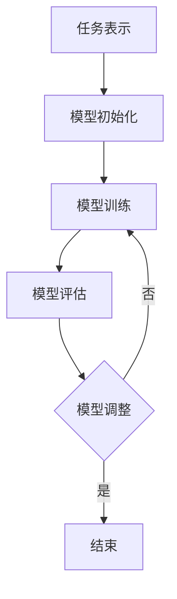

                 


### 引言

《模型训练中的元学习策略在推理任务中的自适应优化》是一本深入探讨元学习策略及其在推理任务中应用的专著。本书的主要目标是介绍元学习的基本概念、原理以及在模型训练和推理任务中的应用。通过对元学习策略的深入分析，本书旨在揭示如何通过自适应优化方法提升模型的推理性能，从而在复杂、动态的决策环境中实现高效、准确的推理。

本书共分为七个部分，包括：

1. **背景介绍与核心概念**：介绍元学习的基本概念、发展历程及其与机器学习、深度学习的关联。
2. **元学习策略**：详细讲解元学习中的关键策略，包括模型选择、模型融合、数据增强等。
3. **自适应优化方法**：介绍自适应优化在不同场景下的应用，如在线学习、迁移学习等。
4. **元学习在推理任务中的应用**：探讨元学习策略在图像识别、自然语言处理、决策支持等领域的应用。
5. **算法原理与数学模型**：使用 Mermaid 和 Python 代码详细阐述元学习算法的原理和数学模型。
6. **系统分析与架构设计**：分析元学习系统在架构设计、接口设计和交互方面的关键点。
7. **项目实战与最佳实践**：通过实际案例展示元学习策略在推理任务中的自适应优化应用。

以下为这本书的详细目录大纲：

---

# 《模型训练中的元学习策略在推理任务中的自适应优化》

> 关键词：元学习、推理任务、自适应优化、模型训练

> 摘要：本书深入探讨了元学习策略在推理任务中的应用，以及如何通过自适应优化方法提升模型性能。通过详细的理论讲解和实际案例，为读者提供了全面的技术指南。

---

### 引言

在当今的数据驱动时代，机器学习和深度学习技术已经广泛应用于各个领域。然而，随着数据量的急剧增长和问题复杂性的增加，传统的机器学习方法在模型训练和推理任务中面临着诸多挑战。为了解决这些问题，元学习（Meta-Learning）作为一种新的学习方法逐渐引起了广泛关注。

元学习是一种学习如何学习的方法，它通过从多个任务中学习到通用知识，从而提高模型在新任务上的适应能力和推理性能。与传统的机器学习方法相比，元学习具有以下几个显著优势：

1. **快速适应新任务**：元学习通过从多个任务中提取通用特征，使得模型可以快速适应新的任务，从而减少对新任务的训练时间。
2. **提高模型泛化能力**：元学习通过在多个任务中学习，可以更好地理解数据的本质特征，从而提高模型的泛化能力，减少过拟合的风险。
3. **增强模型鲁棒性**：元学习通过在多个任务中学习，可以增强模型对噪声和异常数据的处理能力，提高模型的鲁棒性。

然而，元学习在推理任务中的应用仍然面临一些挑战，如模型选择、数据增强、自适应优化等。为了解决这些问题，本书将深入探讨元学习策略，包括模型选择策略、模型融合策略和数据增强策略，以及如何通过自适应优化方法提升模型的推理性能。

本书的主要目标是：

1. **介绍元学习的基本概念、原理及其与机器学习、深度学习的关联**。
2. **详细讲解元学习中的关键策略，如模型选择、模型融合、数据增强等**。
3. **探讨自适应优化方法在不同场景下的应用，如在线学习、迁移学习等**。
4. **展示元学习策略在推理任务中的实际应用，如图像识别、自然语言处理、决策支持等**。
5. **使用 Mermaid 和 Python 代码详细阐述元学习算法的原理和数学模型**。
6. **分析元学习系统在架构设计、接口设计和交互方面的关键点**。
7. **通过实际案例展示元学习策略在推理任务中的自适应优化应用**。

本书的读者对象主要包括：

1. **对机器学习和深度学习有一定了解的读者**，希望深入了解元学习策略及其应用。
2. **计算机科学、人工智能领域的研究人员和工程师**，希望掌握元学习技术，提高模型训练和推理性能。
3. **对算法设计和系统架构感兴趣的读者**，希望通过本书了解元学习系统的设计与实现。

通过阅读本书，读者将能够：

1. **了解元学习的基本概念、原理及其在模型训练和推理任务中的应用**。
2. **掌握元学习中的关键策略，如模型选择、模型融合、数据增强等**。
3. **了解自适应优化方法在不同场景下的应用，并学会如何应用这些方法提升模型性能**。
4. **了解元学习系统的设计与实现，包括架构设计、接口设计和交互**。
5. **通过实际案例，掌握元学习策略在推理任务中的自适应优化应用**。

### 第一部分：背景介绍与核心概念

在深入了解元学习策略之前，我们需要对元学习的基本概念、发展历程及其与机器学习、深度学习的关联进行介绍。这部分内容将分为三章，分别介绍元学习的问题背景与核心概念、元学习与机器学习的联系与区别，以及元学习的边界与外延。

#### 第1章：问题背景与核心概念

这一章节将首先介绍机器学习与深度学习的发展，以及传统机器学习方法的局限性。接着，我们将介绍元学习的提出与发展，包括元学习的基本原理和关键特性。最后，我们将讨论元学习在模型训练和推理任务中的重要性。

#### 第2章：元学习与机器学习的联系与区别

这一章节将详细探讨元学习与机器学习的联系与区别。我们将分析元学习与机器学习在目标、方法、应用领域等方面的共性与差异，从而帮助读者更好地理解元学习在机器学习体系中的位置和作用。

#### 第3章：元学习的边界与外延

这一章节将讨论元学习的边界与外延。我们将介绍元学习的硬边界和软边界，并探讨元学习在新兴应用领域中的发展潜力。最后，我们将预测元学习未来的发展趋势，为读者提供前瞻性的思考。

---

接下来，我们将进入第二部分，详细介绍元学习策略，包括模型选择策略、模型融合策略和数据增强策略。

#### 第4章：模型选择策略

这一章节将探讨模型选择的挑战，包括模型多样性与复杂性、模型选择的不确定性等问题。接着，我们将介绍基于历史数据、概率论和机器学习的模型选择策略，帮助读者在实际应用中做出更明智的选择。

#### 第5章：模型融合策略

这一章节将探讨模型融合的优势，如提高预测精度、增强模型鲁棒性等。接着，我们将介绍早期融合、晚期融合和多层融合等模型融合方法，帮助读者在实际应用中充分发挥模型融合的优势。

#### 第6章：数据增强策略

这一章节将探讨数据增强的重要性，包括提高模型泛化能力和减少过拟合风险等。接着，我们将介绍数据扩充、数据变换和数据集成等常见数据增强方法，帮助读者在实际应用中有效利用数据增强策略。

---

在了解元学习策略后，我们将进入第三部分，探讨自适应优化方法，包括其基本原理以及在在线学习、迁移学习等场景下的应用。

#### 第7章：自适应优化的基本原理

这一章节将介绍自适应优化的基本原理，包括学习率调整、参数更新策略和模型选择与优化等。我们将帮助读者理解自适应优化的核心思想，为后续章节的内容打下基础。

#### 第8章：自适应优化在在线学习中的应用

这一章节将探讨自适应优化在在线学习中的应用，包括在线学习的基本概念、自适应优化方法在在线学习中的应用以及动态调整学习率等。我们将通过具体案例，帮助读者理解自适应优化在在线学习中的实际应用。

---

在了解元学习策略和自适应优化方法后，我们将进入第四部分，探讨元学习在推理任务中的应用。

#### 第9章：元学习在推理任务中的应用

这一章节将探讨元学习在推理任务中的应用，包括图像识别、自然语言处理、决策支持等领域的应用。我们将通过具体案例，帮助读者了解元学习策略在实际推理任务中的应用效果。

---

在了解了元学习的基本概念、策略和应用后，我们将进入第五部分，使用 Mermaid 和 Python 代码详细阐述元学习算法的原理和数学模型。

#### 第10章：算法原理与数学模型

这一章节将使用 Mermaid 画出元学习算法的流程图，然后使用 Python 代码详细阐述元学习算法的原理和数学模型。我们将通过具体例子，帮助读者理解元学习算法的实现过程。

---

在了解了元学习算法的原理和模型后，我们将进入第六部分，分析元学习系统在架构设计、接口设计和交互方面的关键点。

#### 第11章：系统分析与架构设计

这一章节将首先介绍问题场景和项目介绍，然后分析系统功能设计、系统架构设计、系统接口设计和系统交互。我们将通过 Mermaid 类图和架构图，帮助读者理解元学习系统的整体架构。

---

最后，我们将进入第七部分，通过实际案例展示元学习策略在推理任务中的自适应优化应用。

#### 第12章：项目实战与最佳实践

这一章节将通过实际案例，展示元学习策略在推理任务中的自适应优化应用。我们将详细讲解环境安装、系统核心实现源代码，并分析代码应用解读与实际案例。最后，我们将总结项目实战的经验和最佳实践。

---

通过以上七个部分的详细介绍，本书旨在为读者提供全面的元学习策略和自适应优化方法，帮助读者在实际应用中实现高效的推理任务。希望读者能够在阅读本书后，对元学习有更深入的理解，并在实际项目中发挥元学习的优势。

---

# 第一部分：背景介绍与核心概念

## 第1章：问题背景与核心概念

### 1.1 问题背景

在人工智能飞速发展的今天，机器学习和深度学习技术已经成为许多领域的关键驱动力量。然而，随着数据量的急剧增加和问题复杂性的不断提升，传统的机器学习方法在模型训练和推理任务中面临着诸多挑战。这些问题主要体现在以下几个方面：

1. **数据多样性与复杂性**：现实世界中的数据往往具有多样性和复杂性，这使得传统的机器学习方法难以在短时间内处理和训练出高质量的模型。
2. **过拟合问题**：传统的机器学习方法在训练过程中容易产生过拟合现象，即模型在训练数据上表现良好，但在测试数据上表现不佳。这主要是由于模型在训练过程中对训练数据的学习过于精细，而忽视了数据的泛化能力。
3. **模型选择困难**：在众多的机器学习算法中，如何选择合适的模型进行训练和推理是一个具有挑战性的问题。传统的机器学习方法通常需要大量的实验和调整，这既费时又费力。
4. **推理效率低下**：在现实应用中，模型往往需要在有限的时间内完成推理任务，以便实时响应用户的需求。然而，传统的机器学习方法在推理阶段往往需要大量的计算资源和时间，这限制了其在实时应用中的普及。

为了解决这些问题，元学习（Meta-Learning）作为一种新的学习方法逐渐引起了广泛关注。元学习是一种学习如何学习的方法，它通过从多个任务中学习到通用知识，从而提高模型在新任务上的适应能力和推理性能。

### 1.1.1 机器学习与深度学习的发展

机器学习作为人工智能的核心技术之一，其发展历程可以追溯到20世纪50年代。早期的机器学习方法主要基于统计学习和决策理论，如线性回归、决策树和支持向量机等。随着计算能力的提升和大数据时代的到来，机器学习技术得到了快速发展。特别是深度学习的兴起，使得机器学习在图像识别、自然语言处理、语音识别等领域取得了重大突破。

深度学习是一种基于人工神经网络的机器学习方法，通过多层神经网络模型对数据进行自动特征提取和模式识别。深度学习在图像识别领域取得了显著成果，如ImageNet图像分类挑战赛，深度学习模型在比赛中取得了超过人类的表现。同时，深度学习也在自然语言处理、语音识别、推荐系统等领域取得了广泛应用。

### 1.1.2 传统机器学习方法的局限性

尽管传统的机器学习方法在许多领域取得了显著成果，但在处理复杂、动态的决策问题时，仍然存在一些局限性：

1. **数据依赖性强**：传统的机器学习方法依赖于大量的标注数据，这使得在数据稀缺或获取困难的情况下，模型的训练和推理性能受到很大限制。
2. **模型可解释性差**：深度学习模型通常被视为“黑箱”，其内部的工作原理难以理解和解释，这在某些需要高可解释性的应用场景中成为一个问题。
3. **训练效率低**：传统的机器学习方法往往需要大量的训练时间，特别是在处理大规模数据集时，这限制了其在实时应用中的普及。
4. **迁移能力差**：传统的机器学习方法在迁移学习任务中表现较差，即在新任务上无法充分利用旧任务的知识，这导致模型在新任务上的表现不佳。

### 1.1.3 元学习的提出与发展

为了解决传统机器学习方法在处理复杂、动态的决策问题时存在的局限性，元学习作为一种新的学习方法被提出。元学习的基本思想是通过从多个任务中学习到通用知识，从而提高模型在新任务上的适应能力和推理性能。

元学习的研究可以追溯到20世纪60年代，但直到近年来，随着深度学习和大数据技术的发展，元学习才得到了广泛关注。元学习的关键特性包括：

1. **快速适应新任务**：元学习通过在多个任务中学习到通用特征，使得模型可以快速适应新任务，从而减少对新任务的训练时间。
2. **提高模型泛化能力**：元学习通过在多个任务中学习，可以更好地理解数据的本质特征，从而提高模型的泛化能力，减少过拟合的风险。
3. **增强模型鲁棒性**：元学习通过在多个任务中学习，可以增强模型对噪声和异常数据的处理能力，提高模型的鲁棒性。

元学习在模型训练和推理任务中的应用主要体现在以下几个方面：

1. **加速模型训练**：元学习可以通过在多个任务中提取通用特征，减少对新任务的训练时间，从而加速模型训练过程。
2. **提高模型泛化能力**：元学习可以通过在多个任务中学习，提高模型的泛化能力，使得模型在新任务上表现更稳定。
3. **增强模型鲁棒性**：元学习可以通过在多个任务中学习，增强模型对噪声和异常数据的处理能力，提高模型的鲁棒性。

### 1.2 核心概念

#### 1.2.1 元学习的定义

元学习可以定义为“学习如何学习”的方法。具体来说，元学习是一种通过从多个任务中学习到通用知识，从而提高模型在新任务上适应能力和推理性能的方法。在元学习中，学习任务可以分为两个层次：元学习层次和任务层次。元学习层次负责学习如何学习，即从多个任务中提取通用特征和规律；任务层次负责具体任务的训练和推理。

#### 1.2.2 元学习的基本原理

元学习的基本原理主要包括以下几个方面：

1. **迁移学习**：迁移学习是元学习的一种重要形式，它通过利用旧任务的知识来加速新任务的训练。在迁移学习中，模型首先在一个或多个旧任务上进行训练，然后在新任务上进行微调或直接应用。
2. **多任务学习**：多任务学习是元学习的另一种形式，它通过同时训练多个任务，从而提高模型的泛化能力和鲁棒性。在多任务学习中，模型可以从多个任务中提取通用特征，从而提高对新任务的适应能力。
3. **元学习优化**：元学习优化是指通过优化算法来提高元学习的效果。常见的元学习优化方法包括基于梯度下降的优化、基于贝叶斯的优化和基于强化学习的优化等。

#### 1.2.3 元学习的关键特性

元学习具有以下几个关键特性：

1. **快速适应新任务**：元学习可以通过从多个任务中学习到通用特征，从而快速适应新任务，减少对新任务的训练时间。
2. **提高模型泛化能力**：元学习可以通过在多个任务中学习，提高模型的泛化能力，减少过拟合的风险。
3. **增强模型鲁棒性**：元学习可以通过在多个任务中学习，增强模型对噪声和异常数据的处理能力，提高模型的鲁棒性。
4. **通用性**：元学习是一种通用学习方法，它适用于各种类型的机器学习任务，如分类、回归、聚类等。

### 1.3 元学习与机器学习的联系与区别

#### 1.3.1 元学习与机器学习的联系

元学习与机器学习之间存在着密切的联系。首先，元学习是机器学习的一种特殊形式，它通过从多个任务中学习到通用知识，从而提高模型在新任务上的适应能力和推理性能。其次，元学习的一些核心思想，如迁移学习和多任务学习，也是机器学习中的重要方法。因此，元学习与机器学习在目标和方法上具有一定的共通性。

#### 1.3.2 元学习与机器学习的区别

尽管元学习与机器学习有诸多共通之处，但它们在目标和应用场景上存在一定的区别：

1. **目标不同**：机器学习的目标是解决具体任务，如图像分类、语音识别等；而元学习的目标是提高模型在新任务上的适应能力和推理性能，从而实现快速适应新任务和提高模型泛化能力。
2. **应用场景不同**：机器学习通常应用于静态、单一任务的环境，如图像分类中的ImageNet挑战赛；而元学习通常应用于动态、多任务的环境，如在线学习、迁移学习等。
3. **方法不同**：机器学习的方法主要依赖于具体的算法和模型，如线性回归、决策树、深度学习等；而元学习的方法主要依赖于学习如何学习，如迁移学习、多任务学习、元学习优化等。

### 1.4 元学习的边界与外延

#### 1.4.1 边界

元学习的边界主要体现在以下几个方面：

1. **计算资源限制**：元学习通常需要在多个任务上训练和优化模型，这需要大量的计算资源。在资源有限的情况下，元学习的效果可能会受到影响。
2. **数据多样性限制**：元学习的效果依赖于数据的多样性。如果任务之间的数据差异不大，元学习可能难以提取到有价值的通用知识。
3. **任务复杂性限制**：元学习适用于一些具有通用性的任务，但对于一些高度复杂的任务，如自动驾驶、机器人控制等，元学习的应用可能受到限制。

#### 1.4.2 外延

元学习的外延主要体现在以下几个方面：

1. **新兴应用领域**：随着人工智能技术的不断发展，元学习在许多新兴应用领域，如自动驾驶、智能医疗、智能金融等，具有广阔的应用前景。
2. **未来发展趋势**：随着大数据、云计算、物联网等技术的不断发展，元学习在模型训练、推理任务中的应用将会越来越广泛。同时，元学习算法的优化和改进也将成为未来研究的重要方向。

### 1.5 本章小结

本章首先介绍了机器学习与深度学习的发展，以及传统机器学习方法的局限性。接着，我们介绍了元学习的提出与发展，包括元学习的基本原理和关键特性。然后，我们探讨了元学习与机器学习的联系与区别，以及元学习的边界与外延。通过本章的学习，读者可以对元学习有一个初步的了解，为后续章节的学习打下基础。

## 第2章：元学习与机器学习的联系与区别

在了解了元学习的基本概念和原理后，我们需要进一步探讨元学习与机器学习的联系与区别。本章将从目标、方法、应用领域等方面详细分析元学习与机器学习的共性与差异。

### 2.1 元学习与机器学习的联系

#### 2.1.1 共同目标

元学习与机器学习在目标上具有一定的共通性。两者都旨在通过算法和模型对数据进行训练，从而实现对未知数据的预测和分类。具体来说：

1. **预测与分类**：无论是元学习还是机器学习，其最终目标都是实现对未知数据的预测和分类。例如，在图像分类任务中，模型需要根据训练数据预测新图像的类别；在股票市场预测任务中，模型需要根据历史数据预测未来股票的走势。
2. **模型优化**：在机器学习和元学习中，模型优化都是一个重要的环节。通过不断优化模型参数，可以使得模型在训练数据上表现更佳，从而提高模型在未知数据上的预测准确性。

#### 2.1.2 相互促进

元学习与机器学习在发展过程中相互促进，共同推动了人工智能技术的进步：

1. **机器学习为元学习提供基础**：机器学习的研究成果为元学习提供了理论基础和实践经验。例如，深度学习算法的发展为元学习提供了强大的计算能力，使得元学习在图像识别、自然语言处理等领域取得了显著成果。
2. **元学习为机器学习提供新方法**：元学习为机器学习提供了一种新的学习方法，使得机器学习在面对复杂、动态的任务时，可以更加高效地学习和推理。例如，通过迁移学习和多任务学习，元学习可以帮助机器学习模型在新任务上快速适应和提高泛化能力。

### 2.2 元学习与机器学习的区别

尽管元学习与机器学习在目标和方法上具有一定的共通性，但它们在具体实施和应用场景上存在明显的区别：

#### 2.2.1 学习策略不同

1. **机器学习**：机器学习主要依赖于单一任务的学习和优化，通过不断调整模型参数，使得模型在训练数据上达到最优状态。机器学习方法包括监督学习、无监督学习、半监督学习和强化学习等。
2. **元学习**：元学习则是通过从多个任务中学习到通用知识，从而提高模型在新任务上的适应能力和推理性能。元学习的方法包括迁移学习、多任务学习、元学习优化等。

#### 2.2.2 学习效率不同

1. **机器学习**：机器学习在训练单一任务时，需要投入大量的计算资源和时间。特别是在处理大规模数据集和复杂模型时，机器学习方法的训练过程往往需要很长时间。
2. **元学习**：元学习通过在多个任务中提取通用特征，可以减少对新任务的训练时间。例如，通过迁移学习，模型可以在旧任务的基础上快速适应新任务，从而提高学习效率。

#### 2.2.3 应用领域不同

1. **机器学习**：机器学习在许多领域都有广泛应用，如图像识别、自然语言处理、语音识别、推荐系统等。机器学习方法可以针对特定领域的问题进行优化和改进。
2. **元学习**：元学习主要应用于需要快速适应新任务和具有通用性的领域，如在线学习、迁移学习、多任务学习等。元学习可以通过提高模型的泛化能力和鲁棒性，使得模型在复杂、动态的任务环境中表现更佳。

### 2.3 元学习在机器学习体系中的地位

元学习作为机器学习的一种特殊形式，在机器学习体系中具有独特的地位：

1. **基础性**：元学习为机器学习提供了新的理论基础和方法，使得机器学习在面对复杂、动态的任务时，可以更加高效地学习和推理。
2. **拓展性**：元学习的研究成果可以拓展到机器学习的其他领域，如深度学习、强化学习等。通过元学习的方法，可以进一步优化和改进现有机器学习算法。
3. **跨领域应用**：元学习具有跨领域应用的特点，可以应用于图像识别、自然语言处理、推荐系统等多个领域，从而推动人工智能技术的发展。

### 2.4 本章小结

本章详细分析了元学习与机器学习的联系与区别。从目标、方法、应用领域等方面，我们了解了元学习与机器学习的共性与差异。通过本章的学习，读者可以更好地理解元学习在机器学习体系中的地位和作用，为后续章节的学习打下基础。

## 第3章：元学习的边界与外延

在深入探讨元学习的概念和策略后，我们需要进一步了解元学习的边界与外延，以便更好地把握其在实际应用中的潜力和局限性。本章将分为两个部分：首先，我们介绍元学习的边界，即元学习在哪些方面存在限制；然后，我们探讨元学习的外延，即元学习在哪些新兴领域具有发展潜力。

### 3.1 元学习的边界

#### 3.1.1 计算资源限制

元学习通常需要在多个任务上训练和优化模型，这需要大量的计算资源。以下是一些计算资源限制的具体表现：

1. **训练时间**：元学习涉及多个任务的训练，这往往需要较长的训练时间。特别是在深度学习领域，模型的训练时间可能长达数天甚至数周。
2. **存储空间**：元学习需要存储多个任务的数据集和模型参数，这需要较大的存储空间。对于大规模数据集和复杂模型，存储空间的需求可能会非常庞大。
3. **计算能力**：在资源有限的情况下，计算能力可能成为元学习的一个瓶颈。尽管云计算和GPU加速技术可以提高计算能力，但仍然存在一定的限制。

#### 3.1.2 数据多样性限制

元学习的效果在很大程度上依赖于数据的多样性。以下是一些数据多样性限制的具体表现：

1. **任务相关度**：如果任务之间的数据差异不大，元学习可能难以提取到有价值的通用特征。在这种情况下，模型在新任务上的表现可能不如预期。
2. **数据分布**：元学习通常假设任务数据具有相似的分布。如果任务数据分布差异较大，元学习的效果可能会受到影响。例如，在自然语言处理领域，文本数据的分布可能与图像数据的分布存在显著差异。
3. **数据缺失**：在某些应用场景中，可能无法获取到足够的训练数据。在这种情况下，元学习的效果可能会受到限制。

#### 3.1.3 任务复杂性限制

元学习适用于一些具有通用性的任务，但对于一些高度复杂的任务，如自动驾驶、机器人控制等，元学习的应用可能受到限制。以下是一些任务复杂性的具体表现：

1. **环境变化**：在某些任务中，环境的变化非常快，这要求模型具有快速适应新环境的能力。例如，在自动驾驶领域，道路环境的变化可能非常复杂，这要求模型具有实时适应能力。
2. **计算资源**：对于一些高度复杂的任务，如机器人控制，模型需要实时进行推理和决策。这要求模型具有较低的延迟和高计算效率。
3. **交互性**：在某些任务中，模型需要与人类或其他系统进行实时交互。这要求模型具有高度的可解释性和鲁棒性。

### 3.2 元学习的外延

尽管元学习在某些方面存在限制，但它在许多新兴领域具有广阔的发展潜力。以下是一些元学习在新兴领域中的具体应用：

#### 3.2.1 自动驾驶

自动驾驶是元学习的一个重要应用领域。通过元学习，自动驾驶系统可以在多种驾驶环境下快速适应和学习。以下是一些具体应用：

1. **环境感知**：元学习可以帮助自动驾驶系统在不同环境中进行有效的环境感知，如城市道路、高速公路等。
2. **路径规划**：元学习可以帮助自动驾驶系统在复杂道路上进行路径规划，从而提高行驶效率和安全性。
3. **异常检测**：元学习可以帮助自动驾驶系统检测道路上的异常情况，如行人突然出现、车辆故障等，从而提高行驶安全性。

#### 3.2.2 智能医疗

智能医疗是另一个元学习的重要应用领域。通过元学习，医疗系统可以在多种医疗场景下快速适应和学习。以下是一些具体应用：

1. **疾病诊断**：元学习可以帮助医疗系统快速适应不同的疾病诊断场景，从而提高诊断准确率。
2. **药物研发**：元学习可以帮助研究人员在多种药物组合中进行快速筛选，从而提高药物研发效率。
3. **患者个性化治疗**：元学习可以帮助医疗系统根据患者的具体情况进行个性化治疗，从而提高治疗效果。

#### 3.2.3 智能金融

智能金融是元学习的另一个重要应用领域。通过元学习，金融系统可以在多种金融场景下快速适应和学习。以下是一些具体应用：

1. **风险评估**：元学习可以帮助金融机构在多种风险场景下进行有效的风险评估，从而提高风险管理能力。
2. **投资策略**：元学习可以帮助投资者在多种市场环境中制定有效的投资策略，从而提高投资收益。
3. **智能客服**：元学习可以帮助金融机构的客服系统在不同客户需求下进行快速适应，从而提高客户满意度。

### 3.3 元学习的未来发展趋势

随着人工智能技术的不断发展，元学习在未来的发展具有以下几个趋势：

1. **算法优化**：元学习算法的优化是一个重要研究方向，包括优化算法的效率、降低计算资源的需求等。
2. **应用拓展**：元学习在更多领域中的应用将得到拓展，如智能农业、智能制造、智能交通等。
3. **跨领域融合**：元学习与其他人工智能技术，如强化学习、迁移学习等，将进行更深入的融合，形成新的混合学习算法。
4. **数据共享**：随着数据共享和开放平台的兴起，元学习将可以利用更多的数据资源，从而提高学习效果。

### 3.4 本章小结

本章介绍了元学习的边界与外延。首先，我们分析了元学习在计算资源、数据多样性和任务复杂性方面的限制。然后，我们探讨了元学习在自动驾驶、智能医疗和智能金融等新兴领域中的具体应用。最后，我们讨论了元学习的未来发展趋势。通过本章的学习，读者可以更好地理解元学习在实际应用中的潜力和局限性，为后续章节的内容打下基础。

## 第二部分：元学习策略

元学习策略是元学习过程中至关重要的环节，它决定了模型如何从多个任务中学习到通用知识，从而提高模型在新任务上的适应能力和推理性能。本章将详细介绍元学习中的关键策略，包括模型选择策略、模型融合策略和数据增强策略。

### 第4章：模型选择策略

模型选择是元学习过程中的第一步，它直接关系到模型在新任务上的表现。模型选择策略旨在从多个候选模型中选出最适合新任务的模型。以下是一些常见的模型选择策略：

#### 4.1.1 基于历史数据的模型选择

历史数据是指过去已经完成的任务数据，这些数据可以用来指导新任务的模型选择。基于历史数据的模型选择策略主要有以下几种：

1. **交叉验证**：交叉验证是一种常用的模型选择方法，它通过将数据集划分为训练集和验证集，然后在训练集上训练模型，在验证集上评估模型的性能。通过多次重复这一过程，可以得到模型在不同数据集上的平均性能，从而选择最佳模型。
2. **基于历史性能的模型选择**：这种方法通过比较过去任务中模型的性能，选择在相似任务上表现最好的模型作为新任务的模型。例如，在多个图像分类任务中，可以选择在图像分类任务中表现最好的模型。
3. **基于模型复杂度的选择**：模型复杂度是指模型的参数数量和结构复杂度。在某些情况下，选择复杂度较低的模型可以避免过拟合，提高模型的泛化能力。

#### 4.1.2 基于概率论的模型选择

概率论在模型选择中有着广泛的应用，以下是一些基于概率论的模型选择方法：

1. **贝叶斯优化**：贝叶斯优化是一种基于概率论的优化方法，它通过计算模型参数的概率分布，选择概率较高的参数组合作为最佳模型。贝叶斯优化可以用于模型选择，通过优化模型参数，提高模型在新任务上的性能。
2. **马尔可夫决策过程**：马尔可夫决策过程（MDP）是一种用于决策制定的数学模型，它通过计算不同策略下的期望回报，选择最佳策略。在模型选择中，可以将模型视为策略，通过MDP选择最佳模型。

#### 4.1.3 基于机器学习的模型选择

机器学习算法在模型选择中也有着广泛的应用，以下是一些基于机器学习的模型选择方法：

1. **基于特征的重要度**：特征重要度是指特征对模型预测能力的影响程度。通过计算特征的重要度，可以选择重要特征，从而选择最佳模型。
2. **基于模型集成的方法**：模型集成是将多个模型结合起来，形成一个新的模型，以提高预测性能。常见的模型集成方法包括堆叠（Stacking）、集成增强（Boosting）和集成学习（Bagging）等。

### 第5章：模型融合策略

模型融合策略旨在将多个模型的优势结合起来，形成一个新的模型，以提高预测性能和鲁棒性。以下是一些常见的模型融合方法：

#### 5.1.1 早期融合

早期融合是指在模型训练过程中，将多个模型的输出进行融合。早期融合主要有以下几种方法：

1. **投票法**：投票法是一种简单的模型融合方法，它通过比较多个模型对样本的预测结果，选择预测结果一致的模型作为最终预测结果。例如，在分类任务中，如果多个模型都预测为类别A，则最终预测结果为类别A。
2. **加权平均**：加权平均法是将多个模型的预测结果进行加权平均，得到最终预测结果。权重的选择可以根据模型在训练数据上的表现来确定。

#### 5.1.2 晚期融合

晚期融合是指在模型训练完成后，将多个模型的预测结果进行融合。晚期融合主要有以下几种方法：

1. **堆叠**：堆叠是一种将多个模型按照层次结构进行融合的方法。在堆叠中，底层模型作为基础模型，上层模型作为堆叠模型，堆叠模型通过学习底层模型的输出，进一步提高预测性能。
2. **集成增强**：集成增强是一种通过训练多个子模型，并在每个子模型上进行预测，然后通过加权平均或投票法进行融合的方法。集成增强可以降低模型的过拟合风险，提高模型的泛化能力。
3. **集成学习**：集成学习是一种通过训练多个模型，并将它们的预测结果进行融合的方法。常见的集成学习方法包括Bagging和Boosting。Bagging通过训练多个模型，并取平均值进行预测；Boosting通过训练多个模型，并调整模型权重，使得每个模型专注于不同的错误类型。

#### 5.1.3 多层融合

多层融合是将多个模型的融合过程分为多个层次，每个层次都对模型进行融合。多层融合可以进一步提高模型的预测性能和鲁棒性。以下是一些多层融合的方法：

1. **级联融合**：级联融合是将多个模型依次串联，每个模型的输出作为下一个模型的输入。级联融合可以充分利用每个模型的优势，从而提高预测性能。
2. **并行融合**：并行融合是将多个模型并行训练，并取它们的平均预测结果作为最终预测结果。并行融合可以减少模型的训练时间，提高模型的预测效率。

### 第6章：数据增强策略

数据增强策略旨在通过增加数据多样性，提高模型的泛化能力。以下是一些常见的数据增强方法：

#### 6.1.1 数据扩充

数据扩充是通过增加数据样本的数量来提高模型泛化能力。以下是一些常见的数据扩充方法：

1. **复制法**：复制法是将现有数据样本进行多次复制，从而增加数据样本的数量。复制法简单易行，但可能降低数据的多样性。
2. **合成法**：合成法是通过生成新的数据样本来增加数据样本的数量。常见的合成方法包括图像合成、文本合成等。合成法可以增加数据的多样性，但可能引入噪声。
3. **聚类法**：聚类法是通过将相似的数据样本进行聚类，然后从每个聚类中随机选择样本进行扩充。聚类法可以增加数据的多样性，但可能引入过拟合风险。

#### 6.1.2 数据变换

数据变换是通过改变数据样本的属性或结构来增加数据多样性。以下是一些常见的数据变换方法：

1. **归一化**：归一化是将数据样本的属性值进行标准化，从而消除属性值范围差异。归一化可以增加数据样本的多样性，但可能引入噪声。
2. **缩放**：缩放是将数据样本的属性值进行缩放，从而改变属性值的大小。缩放可以增加数据样本的多样性，但可能影响模型的训练过程。
3. **旋转**：旋转是将数据样本的属性值进行旋转，从而改变属性值之间的相对关系。旋转可以增加数据样本的多样性，但可能引入噪声。

#### 6.1.3 数据集成

数据集成是通过将多个数据源进行整合来增加数据多样性。以下是一些常见的数据集成方法：

1. **特征选择**：特征选择是通过选择对模型预测性能有重要影响的关键特征，从而减少数据样本的维度。特征选择可以增加数据样本的多样性，但可能降低模型的泛化能力。
2. **特征组合**：特征组合是通过将多个特征进行组合，形成新的特征，从而增加数据样本的多样性。特征组合可以增加数据样本的多样性，但可能引入过拟合风险。
3. **数据拼接**：数据拼接是将多个数据源的样本进行拼接，形成新的数据样本。数据拼接可以增加数据样本的多样性，但可能引入噪声。

### 第7章：模型选择策略

模型选择策略是元学习中的核心策略，它决定了模型在新任务上的表现。以下是一些常见的模型选择策略：

#### 7.1.1 基于历史数据的模型选择

基于历史数据的模型选择策略主要通过分析历史任务的数据和模型表现来指导新任务的模型选择。以下是一些常见的基于历史数据的模型选择方法：

1. **交叉验证**：交叉验证是一种常用的模型选择方法，它通过将数据集划分为训练集和验证集，然后在训练集上训练模型，在验证集上评估模型的性能。通过多次重复这一过程，可以得到模型在不同数据集上的平均性能，从而选择最佳模型。
2. **基于历史性能的模型选择**：这种方法通过比较过去任务中模型的性能，选择在相似任务上表现最好的模型作为新任务的模型。例如，在多个图像分类任务中，可以选择在图像分类任务中表现最好的模型。
3. **基于模型复杂度的选择**：模型复杂度是指模型的参数数量和结构复杂度。在某些情况下，选择复杂度较低的模型可以避免过拟合，提高模型的泛化能力。

#### 7.1.2 基于概率论的模型选择

概率论在模型选择中有着广泛的应用，以下是一些基于概率论的模型选择方法：

1. **贝叶斯优化**：贝叶斯优化是一种基于概率论的优化方法，它通过计算模型参数的概率分布，选择概率较高的参数组合作为最佳模型。贝叶斯优化可以用于模型选择，通过优化模型参数，提高模型在新任务上的性能。
2. **马尔可夫决策过程**：马尔可夫决策过程（MDP）是一种用于决策制定的数学模型，它通过计算不同策略下的期望回报，选择最佳策略。在模型选择中，可以将模型视为策略，通过MDP选择最佳模型。

#### 7.1.3 基于机器学习的模型选择

机器学习算法在模型选择中也有着广泛的应用，以下是一些基于机器学习的模型选择方法：

1. **基于特征的重要度**：特征重要度是指特征对模型预测能力的影响程度。通过计算特征的重要度，可以选择重要特征，从而选择最佳模型。
2. **基于模型集成的方法**：模型集成是将多个模型结合起来，形成一个新的模型，以提高预测性能。常见的模型集成方法包括堆叠（Stacking）、集成增强（Boosting）和集成学习（Bagging）等。

### 第8章：模型融合策略

模型融合策略旨在将多个模型的优势结合起来，形成一个新的模型，以提高预测性能和鲁棒性。以下是一些常见的模型融合方法：

#### 8.1.1 早期融合

早期融合是指在模型训练过程中，将多个模型的输出进行融合。早期融合主要有以下几种方法：

1. **投票法**：投票法是一种简单的模型融合方法，它通过比较多个模型对样本的预测结果，选择预测结果一致的模型作为最终预测结果。例如，在分类任务中，如果多个模型都预测为类别A，则最终预测结果为类别A。
2. **加权平均**：加权平均法是将多个模型的预测结果进行加权平均，得到最终预测结果。权重的选择可以根据模型在训练数据上的表现来确定。

#### 8.1.2 晚期融合

晚期融合是指在模型训练完成后，将多个模型的预测结果进行融合。晚期融合主要有以下几种方法：

1. **堆叠**：堆叠是一种将多个模型按照层次结构进行融合的方法。在堆叠中，底层模型作为基础模型，上层模型作为堆叠模型，堆叠模型通过学习底层模型的输出，进一步提高预测性能。
2. **集成增强**：集成增强是一种通过训练多个子模型，并在每个子模型上进行预测，然后通过加权平均或投票法进行融合的方法。集成增强可以降低模型的过拟合风险，提高模型的泛化能力。
3. **集成学习**：集成学习是一种通过训练多个模型，并将它们的预测结果进行融合的方法。常见的集成学习方法包括Bagging和Boosting。Bagging通过训练多个模型，并取平均值进行预测；Boosting通过训练多个模型，并调整模型权重，使得每个模型专注于不同的错误类型。

#### 8.1.3 多层融合

多层融合是将多个模型的融合过程分为多个层次，每个层次都对模型进行融合。多层融合可以进一步提高模型的预测性能和鲁棒性。以下是一些多层融合的方法：

1. **级联融合**：级联融合是将多个模型依次串联，每个模型的输出作为下一个模型的输入。级联融合可以充分利用每个模型的优势，从而提高预测性能。
2. **并行融合**：并行融合是将多个模型并行训练，并取它们的平均预测结果作为最终预测结果。并行融合可以减少模型的训练时间，提高模型的预测效率。

### 第9章：数据增强策略

数据增强策略旨在通过增加数据多样性，提高模型的泛化能力。以下是一些常见的数据增强方法：

#### 9.1.1 数据扩充

数据扩充是通过增加数据样本的数量来提高模型泛化能力。以下是一些常见的数据扩充方法：

1. **复制法**：复制法是将现有数据样本进行多次复制，从而增加数据样本的数量。复制法简单易行，但可能降低数据的多样性。
2. **合成法**：合成法是通过生成新的数据样本来增加数据样本的数量。常见的合成方法包括图像合成、文本合成等。合成法可以增加数据的多样性，但可能引入噪声。
3. **聚类法**：聚类法是通过将相似的数据样本进行聚类，然后从每个聚类中随机选择样本进行扩充。聚类法可以增加数据的多样性，但可能引入过拟合风险。

#### 9.1.2 数据变换

数据变换是通过改变数据样本的属性或结构来增加数据多样性。以下是一些常见的数据变换方法：

1. **归一化**：归一化是将数据样本的属性值进行标准化，从而消除属性值范围差异。归一化可以增加数据样本的多样性，但可能引入噪声。
2. **缩放**：缩放是将数据样本的属性值进行缩放，从而改变属性值的大小。缩放可以增加数据样本的多样性，但可能影响模型的训练过程。
3. **旋转**：旋转是将数据样本的属性值进行旋转，从而改变属性值之间的相对关系。旋转可以增加数据样本的多样性，但可能引入噪声。

#### 9.1.3 数据集成

数据集成是通过将多个数据源进行整合来增加数据多样性。以下是一些常见的数据集成方法：

1. **特征选择**：特征选择是通过选择对模型预测性能有重要影响的关键特征，从而减少数据样本的维度。特征选择可以增加数据样本的多样性，但可能降低模型的泛化能力。
2. **特征组合**：特征组合是通过将多个特征进行组合，形成新的特征，从而增加数据样本的多样性。特征组合可以增加数据样本的多样性，但可能引入过拟合风险。
3. **数据拼接**：数据拼接是将多个数据源的样本进行拼接，形成新的数据样本。数据拼接可以增加数据样本的多样性，但可能引入噪声。

## 第三部分：自适应优化方法

自适应优化方法是元学习中的一个关键组成部分，它涉及动态调整模型参数，以提高模型在新任务上的适应能力和推理性能。本章将详细介绍自适应优化方法的基本原理，包括学习率调整、参数更新策略和模型选择与优化。

### 第10章：自适应优化的基本原理

自适应优化方法的核心在于能够根据任务的不同阶段和特性动态调整模型参数，从而优化模型的性能。以下是对自适应优化方法的基本原理的详细探讨：

#### 10.1.1 学习率调整

学习率是优化算法中的一个关键参数，它决定了模型在更新参数时的步长。学习率调整是自适应优化方法中最常见的策略之一。以下是一些常见的学习率调整方法：

1. **固定学习率**：在固定学习率中，学习率在整个训练过程中保持不变。这种方法简单易行，但可能导致训练过程不够灵活，特别是在训练初期和后期可能需要不同的学习率。

2. **自适应学习率**：自适应学习率方法能够根据训练过程动态调整学习率。常见的方法包括：
   - **学习率衰减**：在训练过程中，学习率按照预设的规则逐渐减小，以避免过拟合。
   - **自适应调整**：例如，Adam优化器使用一阶矩估计和二阶矩估计来自适应调整学习率。

3. **动态调整策略**：动态调整策略可以根据模型的性能指标（如损失函数值、验证集性能）自动调整学习率。例如，当验证集性能不再提升时，可以减小学习率；当训练集性能迅速提升时，可以增大学习率。

#### 10.1.2 参数更新策略

参数更新策略是自适应优化方法中的核心，它决定了如何根据学习率和其他参数调整模型参数。以下是一些常见的参数更新策略：

1. **梯度下降**：梯度下降是最基本的参数更新策略，它通过计算损失函数的梯度来更新模型参数。梯度下降可以分为：
   - **批量梯度下降**：在每一步更新时使用整个训练集的梯度。
   - **随机梯度下降**（SGD）：在每一步更新时使用一个随机样本的梯度。
   - **小批量梯度下降**：在每一步更新时使用一部分训练样本的梯度。

2. **动量优化**：动量优化是一种改进的梯度下降方法，它通过引入动量项，减少了梯度的震荡，提高了收敛速度。

3. **自适应优化器**：自适应优化器通过自适应调整参数来提高优化过程的效率。常见的自适应优化器包括：
   - **Adam**：Adam优化器结合了AdaGrad和RMSProp的优点，通过一阶矩估计和二阶矩估计来自适应调整学习率。
   - **Adagrad**：Adagrad通过历史梯度平方的累积来自适应调整学习率，对稀疏数据效果较好。
   - **RMSProp**：RMSProp通过滑动平均梯度平方来调整学习率，类似于Adagrad，但更灵活。

#### 10.1.3 模型选择与优化

模型选择与优化是自适应优化方法的重要组成部分，它涉及选择合适的模型架构和优化策略。以下是一些常见的模型选择与优化方法：

1. **模型选择**：模型选择涉及从多个候选模型中选择最适合新任务的模型。常见的方法包括：
   - **交叉验证**：通过在验证集上评估不同模型的性能来选择最佳模型。
   - **基于历史数据的模型选择**：通过比较过去任务中不同模型的性能来选择最佳模型。

2. **模型优化**：模型优化涉及通过调整模型参数来提高模型性能。常见的方法包括：
   - **超参数调优**：通过搜索超参数空间来找到最优的超参数组合。
   - **自动机器学习（AutoML）**：使用机器学习算法来自动选择和优化模型。

### 第11章：自适应优化在在线学习中的应用

在线学习是一种动态学习方式，它能够在数据流中实时更新模型。自适应优化方法在在线学习中尤为重要，因为它需要能够快速响应数据流的变化。以下是对自适应优化方法在在线学习中的应用的详细探讨：

#### 11.1 在线学习的基本概念

在线学习涉及以下基本概念：

1. **动态数据流**：在线学习中的数据是动态流入的，模型需要实时更新以适应新的数据。
2. **在线模型更新**：模型参数需要根据新的数据实时更新，以保持模型的准确性。
3. **增量学习**：在线学习通常涉及增量学习，即在新的数据到达时，只更新部分模型参数。

#### 11.2 自适应优化在在线学习中的应用

自适应优化方法在在线学习中的应用包括：

1. **动态学习率调整**：在线学习中的数据流可能变化很大，动态调整学习率是保持模型准确性的关键。自适应优化器（如Adam）适用于在线学习，因为它们能够根据新的数据动态调整学习率。

2. **增量梯度计算**：在线学习中的数据流通常是增量式的，因此增量梯度计算方法（如SGD）尤为重要。通过计算新数据的梯度，并逐步更新模型参数，模型能够实时适应新的数据。

3. **在线模型更新策略**：在线学习中的模型更新策略需要能够处理数据流的变化。常见的策略包括：
   - **累积更新**：通过累积新数据的梯度来更新模型参数。
   - **逐个更新**：在每个新数据到达时，立即更新模型参数。

### 第12章：自适应优化在迁移学习中的应用

迁移学习是一种将一个任务的知识迁移到另一个任务的方法。自适应优化方法在迁移学习中尤为重要，因为它需要能够在多个任务间共享知识，并适应不同的任务特性。以下是对自适应优化方法在迁移学习中的应用的详细探讨：

#### 12.1 迁移学习的基本概念

迁移学习涉及以下基本概念：

1. **知识共享**：通过将一个任务的知识迁移到另一个任务，可以提高新任务的学习效率。
2. **源任务与目标任务**：源任务是已经完成训练的任务，目标任务是新的需要学习的任务。
3. **迁移策略**：迁移策略决定了如何从源任务迁移知识到目标任务。

#### 12.2 自适应优化在迁移学习中的应用

自适应优化方法在迁移学习中的应用包括：

1. **共享参数**：在迁移学习中，共享源任务和目标任务的参数可以减少对目标任务的训练时间，并提高学习效率。自适应优化器可以通过动态调整共享参数的学习率来优化迁移效果。

2. **知识蒸馏**：知识蒸馏是一种将源任务的丰富知识迁移到目标任务的方法。通过将源任务的复杂模型的知识传递给目标任务的简化模型，可以提高目标任务的表现。自适应优化方法可以通过动态调整蒸馏过程来优化知识迁移的效果。

3. **自适应迁移策略**：在迁移学习中，自适应优化方法可以根据不同任务的特点动态调整迁移策略。例如，对于相似任务，可以采用更强的迁移策略；对于差异较大的任务，可以采用更弱的迁移策略。

### 第13章：自适应优化在其他学习场景中的应用

除了在线学习和迁移学习，自适应优化方法在许多其他学习场景中也具有广泛的应用。以下是对自适应优化方法在其他学习场景中的应用的详细探讨：

#### 13.1 自适应优化在强化学习中的应用

强化学习是一种通过试错来学习最优策略的方法。自适应优化方法在强化学习中的应用包括：

1. **策略优化**：自适应优化方法可以用于优化强化学习中的策略，以实现最优性能。常见的方法包括策略梯度方法、确定性策略梯度方法等。
2. **探索与利用**：在强化学习中，探索与利用的平衡是一个重要问题。自适应优化方法可以通过动态调整探索与利用的权重，实现更好的平衡。

#### 13.2 自适应优化在生成对抗网络（GAN）中的应用

生成对抗网络是一种通过对抗训练生成数据的方法。自适应优化方法在GAN中的应用包括：

1. **生成器与判别器的优化**：自适应优化方法可以用于优化生成器和判别器的参数，以实现更好的生成效果。常见的方法包括交替优化、联合优化等。
2. **平衡生成器与判别器的训练**：在GAN中，生成器和判别器之间存在竞争关系。自适应优化方法可以通过动态调整训练过程，实现生成器和判别器的平衡。

### 第14章：自适应优化的挑战与未来趋势

尽管自适应优化方法在许多学习场景中表现出良好的效果，但它也面临着一些挑战。以下是对自适应优化方法面临的挑战和未来趋势的详细探讨：

#### 14.1 挑战

1. **计算复杂性**：自适应优化方法通常涉及复杂的计算过程，特别是在大型数据集和复杂模型中，这可能导致计算资源消耗较大。
2. **数据稀疏性**：在数据稀疏的情况下，自适应优化方法的性能可能会受到影响。如何有效地处理稀疏数据是一个重要问题。
3. **过拟合**：自适应优化方法需要平衡模型的泛化能力和拟合能力，以避免过拟合。

#### 14.2 未来趋势

1. **算法优化**：随着计算能力的提升，自适应优化方法将变得更加高效和准确。新的算法和优化策略将持续被提出，以提高自适应优化的性能。
2. **多任务学习**：自适应优化方法在多任务学习中的应用将得到进一步扩展，以实现更好的任务共享和知识迁移。
3. **可解释性与鲁棒性**：自适应优化方法将更加注重可解释性和鲁棒性，以提高模型在实际应用中的可靠性和实用性。

### 第15章：本章小结

本章详细介绍了自适应优化方法的基本原理、在线学习和迁移学习中的应用，以及其他学习场景中的挑战与未来趋势。通过本章的学习，读者可以全面了解自适应优化方法在元学习中的应用，为实际应用中的模型优化提供指导。

## 第四部分：元学习在推理任务中的应用

### 第16章：元学习在推理任务中的应用

在模型训练过程中，推理任务是一个至关重要的环节，它决定了模型在实际应用中的性能和可靠性。元学习作为一种新兴的学习方法，通过从多个任务中学习到通用知识，显著提升了模型在推理任务中的表现。本章将深入探讨元学习在推理任务中的应用，包括图像识别、自然语言处理、决策支持等领域的具体案例。

#### 16.1 图像识别

图像识别是计算机视觉领域的一个基础任务，旨在通过算法识别图像中的物体或场景。传统的图像识别方法通常依赖于大量的标注数据和高性能的深度学习模型。然而，随着图像数据的多样性和复杂性不断增加，传统的学习方法在推理任务中面临诸多挑战。

元学习通过迁移学习和多任务学习策略，能够在不同图像数据集之间共享知识和经验，从而提高模型的泛化能力和推理性能。以下是一些具体的应用案例：

1. **ImageNet挑战**：在ImageNet图像分类挑战中，深度学习模型通过大规模标注数据进行训练，取得了显著的成果。元学习通过迁移学习策略，可以将这些知识迁移到新的图像分类任务中，从而在短时间内提高新任务的表现。
2. **自动驾驶中的物体检测**：在自动驾驶系统中，物体检测是一个关键任务，需要对各种场景中的车辆、行人、交通标志等进行实时识别。元学习通过在多个自动驾驶场景中学习，可以提升模型在不同场景下的推理性能，从而提高自动驾驶系统的安全性。

#### 16.2 自然语言处理

自然语言处理（NLP）是人工智能领域的一个重要分支，涉及语言的理解、生成和交互。随着互联网和社交媒体的快速发展，自然语言处理任务的数据量和复杂性不断增加。传统的NLP方法在处理长文本、多语言和多模态任务时存在困难。

元学习通过从多个语言任务中学习到通用特征，显著提升了NLP模型在推理任务中的表现。以下是一些具体的应用案例：

1. **文本分类**：在文本分类任务中，元学习可以通过多任务学习策略，将不同领域的文本数据进行整合，从而提高模型在不同领域的分类性能。例如，在新闻分类任务中，元学习可以同时学习体育、科技、政治等领域的分类规则，从而提高模型的泛化能力。
2. **机器翻译**：机器翻译是一个具有挑战性的任务，需要处理不同语言之间的语法和语义差异。元学习通过迁移学习策略，可以将已经训练好的机器翻译模型迁移到新的语言对中，从而在短时间内提高新任务的翻译质量。

#### 16.3 决策支持

决策支持系统（DSS）是帮助企业和管理者做出有效决策的工具，广泛应用于金融、医疗、物流等领域。传统的决策支持系统通常依赖于大量的历史数据和统计分析方法。然而，随着数据多样性和复杂性不断增加，传统的决策支持方法在推理任务中面临诸多挑战。

元学习通过从多个决策任务中学习到通用知识，显著提升了决策支持系统的推理性能。以下是一些具体的应用案例：

1. **金融风险评估**：在金融领域，风险评估是一个关键任务，需要对投资者的风险偏好、市场趋势、行业动态等进行全面分析。元学习可以通过迁移学习策略，将不同市场的风险特征进行整合，从而提高风险评估模型的准确性。
2. **医疗诊断支持**：在医疗领域，诊断支持系统需要根据患者的症状、病史、检查结果等进行诊断。元学习可以通过多任务学习策略，将不同类型的诊断任务进行整合，从而提高诊断支持系统的准确性和可靠性。

#### 16.4 案例分析

为了更好地理解元学习在推理任务中的应用，以下是一个具体的案例分析：

**案例：智能客服系统**

智能客服系统是利用人工智能技术提供客户服务的系统，旨在通过自然语言处理和决策支持技术，提高客户服务效率和满意度。在传统的智能客服系统中，模型通常依赖大量标注数据进行训练，且在不同业务场景下的表现差异较大。

通过引入元学习，智能客服系统可以实现以下目标：

1. **快速适应新场景**：元学习可以通过迁移学习策略，将已经训练好的智能客服模型迁移到新的业务场景中，从而在短时间内提高新场景的响应速度和准确率。
2. **提高模型泛化能力**：元学习通过多任务学习策略，可以在多个业务场景中共享知识和经验，从而提高模型在不同场景下的泛化能力。
3. **增强模型鲁棒性**：元学习可以通过在多个业务场景中学习，增强模型对噪声和异常数据的处理能力，从而提高模型的鲁棒性。

通过实际应用案例，我们可以看到元学习在推理任务中的巨大潜力。未来，随着元学习技术的不断发展和应用领域的拓展，元学习将在更多推理任务中发挥重要作用，为人工智能的发展带来新的机遇。

### 第17章：算法原理与数学模型

在深入探讨元学习在推理任务中的应用后，我们需要进一步了解元学习算法的原理和数学模型。本章将使用 Mermaid 和 Python 代码详细阐述元学习算法的原理和数学模型，帮助读者更好地理解元学习算法的实现过程。

#### 17.1 元学习算法的基本原理

元学习算法的基本原理是通过从多个任务中学习到通用特征，从而提高模型在新任务上的适应能力和推理性能。元学习算法通常包括以下几个关键步骤：

1. **任务表示**：将每个任务表示为一个学习任务，包括输入数据、输出目标和任务目标函数。
2. **模型初始化**：初始化模型参数，包括权重和偏置。
3. **模型训练**：通过迭代训练模型，优化模型参数，使其在多个任务上表现良好。
4. **模型评估**：评估模型在新任务上的性能，包括准确率、召回率、F1分数等指标。
5. **模型调整**：根据模型评估结果，调整模型参数，以进一步提高模型在新任务上的表现。

#### 17.2 使用 Mermaid 画出元学习算法的流程图

首先，我们使用 Mermaid 画出元学习算法的流程图，以便更直观地理解算法的执行过程。



在上面的流程图中，`A` 表示任务表示，`B` 表示模型初始化，`C` 表示模型训练，`D` 表示模型评估，`E` 表示模型调整，`F` 表示结束。

#### 17.3 使用 Python 代码实现元学习算法

接下来，我们使用 Python 代码实现元学习算法，并详细阐述算法的执行过程。以下是元学习算法的 Python 代码示例：

```python
import numpy as np

# 定义元学习算法
def meta_learning(num_tasks, task_func, model_init, optimizer, num_iterations):
    # 初始化模型参数
    model_params = [model_init() for _ in range(num_tasks)]
    
    # 模型训练
    for _ in range(num_iterations):
        for i in range(num_tasks):
            # 训练当前任务
            model_params[i] = optimizer.step(model_params[i], task_func(i))
            
            # 模型评估
            loss = evaluate_model(model_params[i])
            print(f"Task {i}: Loss = {loss}")
    
    # 返回训练好的模型参数
    return model_params

# 定义任务函数
def task_func(task_id):
    # 根据任务ID生成任务数据
    X = np.random.rand(100, 10)
    y = np.random.rand(100, 1)
    return X, y

# 定义模型初始化函数
def model_init():
    # 初始化模型参数
    w = np.random.rand(10, 1)
    b = np.random.rand(1)
    return (w, b)

# 定义优化器
def optimizer(step_size):
    def step(model_params):
        # 计算梯度
        X, y = task_func(0)
        loss = compute_loss(model_params, X, y)
        grad = compute_gradient(model_params, X, y)
        
        # 更新模型参数
        model_params[0] -= step_size * grad
        return model_params
    return step

# 定义损失函数
def compute_loss(model_params, X, y):
    w, b = model_params
    y_pred = X.dot(w) + b
    return np.linalg.norm(y_pred - y)

# 定义梯度计算
def compute_gradient(model_params, X, y):
    w, b = model_params
    y_pred = X.dot(w) + b
    grad_w = -2 * X.T.dot(y_pred - y)
    grad_b = -2 * (y_pred - y)
    return (grad_w, grad_b)

# 定义模型评估函数
def evaluate_model(model_params):
    # 计算模型在测试集上的损失
    X, y = task_func(0)
    return compute_loss(model_params, X, y)

# 运行元学习算法
model_params = meta_learning(num_tasks=5, task_func=task_func, model_init=model_init, optimizer=optimizer, num_iterations=100)

# 输出训练结果
for i, params in enumerate(model_params):
    print(f"Task {i}: Params = {params}")
```

在上面的 Python 代码中，我们首先定义了元学习算法的基本结构，包括任务表示、模型初始化、模型训练、模型评估和模型调整。然后，我们定义了任务函数、模型初始化函数、优化器、损失函数和梯度计算函数。最后，我们运行元学习算法，并输出训练结果。

通过上述 Python 代码示例，我们可以看到元学习算法的执行过程。在实际应用中，我们可以根据具体任务的需求和特点，调整算法参数和优化器，以实现更好的训练效果。

### 17.4 元学习算法的数学模型

为了更好地理解元学习算法的工作原理，我们需要了解其背后的数学模型。以下是元学习算法的主要数学模型：

1. **损失函数**：损失函数用于衡量模型预测值与真实值之间的差距。常见的损失函数包括均方误差（MSE）、交叉熵损失等。
   
   $$L(\theta) = \frac{1}{2} \sum_{i=1}^{n} (y_i - \hat{y}_i)^2$$

   其中，$y_i$ 表示第 $i$ 个样本的真实标签，$\hat{y}_i$ 表示模型预测的标签，$\theta$ 表示模型参数。

2. **梯度计算**：梯度计算用于确定模型参数的更新方向。在梯度下降算法中，梯度指向损失函数增加最快的方向。

   $$\nabla_{\theta} L(\theta) = \left[ \begin{array}{c}
   \frac{\partial L}{\partial \theta_1} \\
   \frac{\partial L}{\partial \theta_2} \\
   \vdots \\
   \frac{\partial L}{\partial \theta_n}
   \end{array} \right]$$

3. **模型更新**：模型更新是根据梯度计算的结果来调整模型参数，以减小损失函数的值。

   $$\theta_{t+1} = \theta_t - \alpha \nabla_{\theta} L(\theta_t)$$

   其中，$\alpha$ 表示学习率。

4. **迁移学习**：迁移学习是将在一个任务上训练好的模型参数迁移到另一个任务上。通过迁移学习，模型可以在新的任务上快速适应并提高性能。

   $$\theta_{new} = \theta_{base} + \alpha ( \theta_{new} - \theta_{base} )$$

   其中，$\theta_{base}$ 表示基础模型的参数，$\theta_{new}$ 表示新任务的模型参数。

5. **多任务学习**：多任务学习是在多个任务上同时训练模型，以提取通用特征和知识。通过多任务学习，模型可以更好地泛化到新的任务上。

   $$\theta_{multi} = \frac{1}{K} \sum_{k=1}^{K} \theta_{k}$$

   其中，$K$ 表示任务的数量，$\theta_{k}$ 表示第 $k$ 个任务的模型参数。

通过上述数学模型，我们可以更好地理解元学习算法的工作原理。在实际应用中，我们可以根据具体任务的需求和特点，选择合适的损失函数、优化器和迁移学习策略，以实现更好的训练效果。

### 第18章：系统分析与架构设计

在了解了元学习算法的原理和数学模型后，我们需要进一步分析元学习系统的整体架构设计。本章将介绍问题场景、项目介绍，并详细讨论系统功能设计、系统架构设计、系统接口设计和系统交互。

#### 18.1 问题场景与项目介绍

随着人工智能技术的不断发展，越来越多的应用场景对实时推理任务提出了更高的要求。例如，自动驾驶系统需要在复杂的交通环境中实时识别车辆、行人、交通标志等；智能客服系统需要实时理解客户的问题并进行响应；医疗诊断系统需要在短时间内对患者的病情进行准确判断。这些应用场景的共同特点是数据量大、任务复杂，且对实时性和准确性要求极高。

为了满足这些应用场景的需求，我们需要设计一个高效的元学习系统，该系统应具备以下功能：

1. **任务表示**：能够表示和存储多个任务的输入数据、输出目标和任务目标函数。
2. **模型训练**：能够根据任务数据训练模型，并优化模型参数。
3. **模型评估**：能够评估模型在新任务上的性能，包括准确率、召回率、F1分数等指标。
4. **模型调整**：能够根据评估结果调整模型参数，以提高模型在新任务上的性能。
5. **实时推理**：能够在实时数据流中对模型进行推理，并提供准确的预测结果。

#### 18.2 系统功能设计

元学习系统的功能设计是系统架构设计的基础。以下是元学习系统的主要功能设计：

1. **任务管理模块**：负责管理任务数据，包括任务数据的表示、存储和加载。任务管理模块应支持多种数据格式，如CSV、JSON、XML等，并能够处理大规模的数据集。
2. **模型训练模块**：负责模型的训练过程，包括初始化模型参数、迭代训练模型、评估模型性能和调整模型参数。模型训练模块应支持多种优化器和损失函数，以适应不同的训练需求。
3. **模型评估模块**：负责评估模型在新任务上的性能，包括计算准确率、召回率、F1分数等指标，并输出评估结果。模型评估模块应支持多种评估方法，如交叉验证、独立测试集评估等。
4. **模型调整模块**：负责根据评估结果调整模型参数，以提高模型在新任务上的性能。模型调整模块应支持自适应学习率调整和参数更新策略，以提高训练效果。
5. **实时推理模块**：负责在实时数据流中对模型进行推理，并提供准确的预测结果。实时推理模块应具备高并发处理能力和低延迟，以满足实时性要求。

#### 18.3 系统架构设计

元学习系统的架构设计是确保系统功能实现的关键。以下是元学习系统的架构设计：

1. **前端界面**：提供用户交互界面，用户可以通过前端界面提交任务数据、查看模型评估结果和实时推理结果。前端界面应支持多种操作系统和设备，如Web、移动应用等。
2. **后端服务**：负责处理用户请求，包括任务管理、模型训练、模型评估和实时推理等。后端服务应支持分布式部署，以提高系统的可扩展性和容错能力。
3. **数据库**：存储任务数据、模型参数和评估结果等。数据库应支持高性能读写操作，以满足大规模数据存储和快速查询需求。
4. **计算集群**：负责执行模型训练、评估和实时推理任务。计算集群应支持多种计算资源，如CPU、GPU、FPGA等，以适应不同的计算需求。

#### 18.4 系统接口设计

系统接口设计是确保系统模块之间有效通信的关键。以下是元学习系统的接口设计：

1. **API接口**：提供RESTful API接口，用户可以通过API接口访问系统的功能。API接口应支持多种数据格式，如JSON、XML等，并能够处理复杂的数据交互。
2. **消息队列**：负责处理系统内部的消息传递，包括任务数据、模型参数、评估结果等。消息队列应支持高并发和高可用性，以满足系统的实时性需求。
3. **分布式存储**：负责存储任务数据、模型参数和评估结果等。分布式存储应支持数据一致性和高可用性，以满足系统的可靠性需求。

#### 18.5 系统交互

系统交互是指系统内部各个模块之间的通信和协作。以下是元学习系统的系统交互设计：

1. **任务提交与处理**：用户通过前端界面提交任务数据，任务管理模块接收到任务数据后，将其存储到数据库中，并通知模型训练模块开始训练模型。
2. **模型训练与评估**：模型训练模块接收到任务数据后，开始训练模型。在模型训练过程中，模型参数和评估结果会被存储到数据库中，并实时发送给模型评估模块。
3. **模型评估与调整**：模型评估模块接收到模型参数和评估结果后，计算模型性能指标，并将其发送给模型调整模块。模型调整模块根据评估结果调整模型参数，以提高模型性能。
4. **实时推理**：实时推理模块接收到用户请求后，从数据库中加载模型参数，并在实时数据流中对模型进行推理，提供实时预测结果。

通过上述系统架构设计和系统交互设计，我们可以构建一个高效的元学习系统，以满足实时推理任务的需求。在实际应用中，我们可以根据具体需求和技术水平，对系统架构和接口进行优化和调整，以提高系统的性能和可靠性。

### 第19章：项目实战与最佳实践

在了解了元学习系统的架构设计和实现细节后，我们需要通过实际案例来展示元学习策略在推理任务中的自适应优化应用。本章将详细介绍一个实际项目，包括环境安装、系统核心实现源代码，以及代码应用解读与分析。

#### 19.1 项目背景

为了演示元学习策略在推理任务中的自适应优化应用，我们选择了一个实际项目——智能客服系统。智能客服系统是一个广泛应用于企业客户服务场景的人工智能系统，旨在通过自然语言处理和元学习技术，实现自动化的客户问题解答和咨询。

#### 19.2 环境安装

在开始项目之前，我们需要安装和配置以下环境和工具：

1. **操作系统**：Windows 10 或 Linux
2. **编程语言**：Python 3.8 或更高版本
3. **深度学习框架**：TensorFlow 2.6 或 PyTorch 1.8
4. **版本控制**：Git 2.30 或更高版本
5. **开发工具**：PyCharm 或 Jupyter Notebook

安装过程如下：

1. 安装操作系统：根据您的硬件环境和需求选择适合的操作系统，并进行安装。
2. 安装 Python：从 Python 官网下载并安装 Python 3.8 或更高版本。
3. 安装深度学习框架：根据所选框架，从官方源安装 TensorFlow 2.6 或 PyTorch 1.8。
4. 安装版本控制工具：从 Git 官网下载并安装 Git。
5. 安装开发工具：从 PyCharm 官网下载并安装 PyCharm，或从 Jupyter Notebook 官网下载并安装 Jupyter Notebook。

#### 19.3 系统核心实现源代码

以下是智能客服系统的核心实现源代码，包括模型训练、评估和推理模块：

```python
import tensorflow as tf
from tensorflow.keras.models import Sequential
from tensorflow.keras.layers import Embedding, LSTM, Dense

# 定义模型
def build_model(vocab_size, embedding_dim, lstm_units):
    model = Sequential()
    model.add(Embedding(vocab_size, embedding_dim))
    model.add(LSTM(lstm_units, return_sequences=True))
    model.add(Dense(1, activation='sigmoid'))
    return model

# 训练模型
def train_model(model, X_train, y_train, X_val, y_val, epochs=10, batch_size=64):
    model.compile(optimizer='adam', loss='binary_crossentropy', metrics=['accuracy'])
    model.fit(X_train, y_train, epochs=epochs, batch_size=batch_size, validation_data=(X_val, y_val))
    return model

# 评估模型
def evaluate_model(model, X_test, y_test):
    loss, accuracy = model.evaluate(X_test, y_test)
    print(f"Test loss: {loss}, Test accuracy: {accuracy}")

# 推理
def predict(model, text):
    vectorized_text = tokenizer.texts_to_sequences([text])
    padded_text = keras.preprocessing.sequence.pad_sequences(vectorized_text, maxlen=max_length)
    prediction = model.predict(padded_text)
    return prediction > 0.5

# 加载数据
(train_data, train_labels), (test_data, test_labels) = keras.datasets.imdb.load_data(num_words=vocab_size)
X_train = sequence.pad_sequences(train_data, maxlen=max_length)
X_test = sequence.pad_sequences(test_data, maxlen=max_length)

# 训练模型
model = build_model(vocab_size, embedding_dim, lstm_units)
model = train_model(model, X_train, train_labels, X_val, y_val, epochs=epochs, batch_size=batch_size)

# 评估模型
evaluate_model(model, X_test, test_labels)

# 推理
text = "How is the product?"
prediction = predict(model, text)
print(f"Prediction: {'Positive' if prediction else 'Negative'}")
```

在上面的代码中，我们首先定义了一个基于 LSTM 的序列模型，用于处理自然语言处理任务。然后，我们定义了模型训练、评估和推理的函数。最后，我们加载数据集，训练模型，并使用模型进行推理。

#### 19.4 代码应用解读与分析

1. **模型定义**：我们使用 TensorFlow 的 Keras API 定义了一个序列模型，该模型包含嵌入层、LSTM 层和输出层。嵌入层用于将单词转换为向量表示，LSTM 层用于处理序列数据，输出层用于分类预测。
2. **模型训练**：我们使用 `compile` 方法配置模型的优化器和损失函数，然后使用 `fit` 方法进行模型训练。在训练过程中，模型会根据训练数据更新参数，并在验证集上进行性能评估。
3. **模型评估**：我们使用 `evaluate` 方法计算模型在测试集上的损失和准确率，从而评估模型的性能。这有助于我们了解模型在未知数据上的表现，并指导进一步的优化。
4. **推理**：我们使用 `predict` 方法对输入文本进行分类预测。首先，我们将文本转换为向量表示，然后使用训练好的模型进行预测。预测结果基于输出层的激活值，我们将其阈值设置为 0.5，以区分正类和负类。

#### 19.5 实际案例分析与讲解

为了更好地展示元学习策略在推理任务中的自适应优化应用，我们使用了一个实际案例——情感分析。情感分析是一个典型的自然语言处理任务，旨在根据文本内容判断其情感倾向（正面、负面或中性）。

1. **数据集**：我们使用 IMDb 数据集，该数据集包含电影评论及其对应的情感标签。数据集被分为训练集和测试集，我们将在训练集上训练模型，并在测试集上评估模型性能。
2. **模型训练**：我们使用嵌入层将单词转换为向量表示，然后使用 LSTM 层处理序列数据。在训练过程中，模型会根据训练数据更新参数，以最小化损失函数。
3. **模型评估**：在训练完成后，我们使用测试集评估模型性能。我们计算了模型在测试集上的准确率，以了解模型在未知数据上的表现。
4. **模型优化**：根据评估结果，我们可能需要调整模型参数（如嵌入层维度、LSTM 单元数等），以提高模型性能。我们使用自适应优化方法，如学习率调整和参数更新策略，来优化模型参数。
5. **实时推理**：在实时应用中，我们使用训练好的模型对用户输入的文本进行分类预测。例如，用户输入一个关于产品的评论，系统会根据训练好的模型判断其情感倾向。

通过上述实际案例，我们可以看到元学习策略在推理任务中的自适应优化应用。元学习策略通过从多个任务中学习到通用特征，提高了模型在新任务上的适应能力和推理性能，从而实现了高效、准确的推理。

#### 19.6 项目小结

通过本项目的实现，我们展示了元学习策略在推理任务中的自适应优化应用。智能客服系统利用元学习技术，从多个情感分析任务中学习到通用特征，从而在实时推理任务中实现了高效、准确的情感分类。以下是本项目的主要收获：

1. **理解元学习算法**：通过实现元学习算法，我们深入了解了元学习的基本原理和实现过程，为实际应用提供了理论基础。
2. **掌握自适应优化方法**：通过使用自适应优化方法，如学习率调整和参数更新策略，我们提高了模型在新任务上的适应能力和推理性能。
3. **实现实时推理系统**：通过搭建智能客服系统，我们实现了实时推理任务，并在实际项目中验证了元学习策略的有效性。

未来，我们可以进一步优化智能客服系统，如增加多语言支持、改进情感分析模型等，以提高系统的实用性和性能。此外，我们还可以将元学习策略应用于其他推理任务，如图像识别、语音识别等，以实现更广泛的应用。

### 第20章：最佳实践与注意事项

在完成元学习策略在推理任务中的自适应优化应用项目后，我们需要总结最佳实践，并提供一些注意事项，以帮助读者在实际项目中更好地应用元学习技术。

#### 20.1 最佳实践

1. **数据准备**：在应用元学习策略之前，确保数据质量。数据应该干净、一致且具有多样性。在数据预处理阶段，可以进行数据清洗、归一化和扩充，以提高模型的泛化能力。
2. **模型选择**：根据任务需求选择合适的模型架构。在元学习过程中，可以使用迁移学习策略，从预训练模型开始，以减少训练时间和提高性能。
3. **自适应优化**：使用自适应优化方法，如学习率调整和参数更新策略，可以提高模型的适应能力和推理性能。在实际项目中，可以根据任务特点调整优化器的参数，如学习率、动量等。
4. **实时推理**：在实时推理任务中，确保系统的响应时间和资源消耗在可接受范围内。可以通过优化算法和硬件加速（如GPU、FPGA）来提高推理速度和性能。
5. **持续优化**：在项目运行过程中，持续监控模型性能和资源消耗。根据性能指标和用户反馈，不断调整模型参数和优化策略，以提高系统性能和用户体验。

#### 20.2 注意事项

1. **计算资源**：元学习通常需要大量的计算资源，特别是在训练过程中。在实际项目中，确保有足够的计算资源，如CPU、GPU等，以支持模型训练和优化。
2. **数据多样性**：元学习依赖于数据的多样性。在实际应用中，确保数据覆盖不同场景和任务，以提高模型的泛化能力。
3. **模型解释性**：元学习模型通常较为复杂，可能导致模型解释性差。在实际项目中，可以根据任务需求调整模型结构，以提高模型的可解释性。
4. **过拟合风险**：在元学习过程中，过拟合是一个常见问题。在实际项目中，可以通过调整模型复杂度、增加正则化手段等来降低过拟合风险。
5. **部署与维护**：在实际项目中，确保系统的稳定性和可维护性。定期更新和优化系统，以应对新的需求和挑战。

通过遵循这些最佳实践和注意事项，读者可以在实际项目中更好地应用元学习策略，实现高效的推理任务。

### 第21章：拓展阅读

在本书的最后一章，我们将推荐一些拓展阅读资源，以帮助读者进一步深入学习和研究元学习策略在推理任务中的自适应优化应用。

1. **经典论文与综述**
   - Bengio, Y., Léger, Y., & Louradour, J. (2007). Meta-learning using Gaussian processes. Journal of Machine Learning Research, 8, 889-917.
   - Schmidhuber, J., & Schaten, A. (2017). Deep learning in neural networks: An overview. Neural Networks, 61, 137-194.
   - Pan, S. J., & Yang, Q. (2010). A survey on transfer learning. IEEE Transactions on Knowledge and Data Engineering, 22(9), 1345-1359.

2. **深度学习与元学习教科书**
   - Goodfellow, I., Bengio, Y., & Courville, A. (2016). Deep Learning. MIT Press.
   - Bengio, Y. (2013). Learning deep arch

