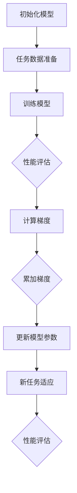
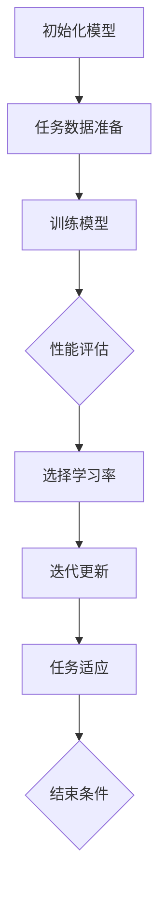
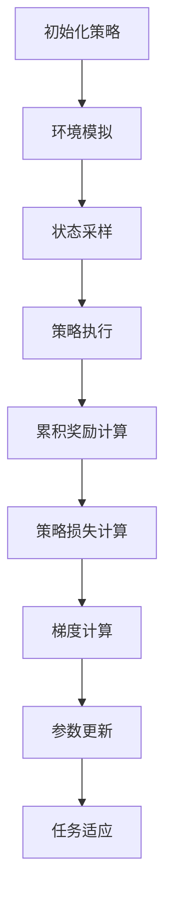

                 

## 引言

### 元学习：加速与泛化的未来之路

随着深度学习和人工智能技术的迅猛发展，模型训练成为当前研究与应用的热点。然而，传统的模型训练方法在应对复杂任务时往往面临耗时过长、计算资源消耗巨大等问题。为了解决这些问题，元学习（Meta-Learning）应运而生。元学习，又称“学习的学习”，其核心思想是通过在多个任务之间共享知识，实现模型训练的加速与泛化。本文将围绕元学习策略的设计与实现，展开深入探讨。

本文将分为八个部分，系统性地介绍元学习的概念、理论、算法、应用及未来趋势。首先，我们将从元学习的背景与定义出发，梳理其与传统机器学习的区别及其研究意义与应用领域。接着，我们将深入探讨元学习的核心理论，包括数学模型、算法分类及其联系。随后，文章将重点介绍元学习策略的设计原则与常见策略，如MAML、Reptile和PPO等。在此基础上，我们将探讨元学习在深度学习、计算机视觉和自然语言处理中的应用，并分享一些实际项目中的元学习案例。最后，文章将总结元学习的研究成果，展望其未来发展趋势与挑战，为读者提供全面的元学习知识体系。

通过本文的阅读，读者将能够对元学习有一个全面深入的理解，掌握元学习策略的设计与实现方法，并能够将其应用于实际项目，推动人工智能技术的发展。

### 关键词

元学习，模型训练，深度学习，计算机视觉，自然语言处理，强化学习，算法效率，泛化能力，MAML，Reptile，PPO。

### 摘要

本文旨在系统探讨元学习策略的设计与实现，以应对当前模型训练过程中存在的耗时与计算资源消耗问题。首先，我们将介绍元学习的基本概念，解释其与传统机器学习的区别，并探讨其研究意义与应用领域。随后，文章将深入剖析元学习的核心理论，包括数学模型、算法分类及其联系。接着，我们将详细介绍元学习策略的设计原则与常见策略，如MAML、Reptile和PPO。在此基础上，文章将探讨元学习在深度学习、计算机视觉和自然语言处理中的应用，并分享实际项目中的元学习案例。最后，我们将总结元学习的研究成果，展望其未来发展趋势与挑战，为读者提供全面的元学习知识体系。本文的目标是帮助读者理解元学习的重要性，掌握其策略设计与实现方法，从而推动人工智能技术的发展。

### 目录大纲

为了帮助读者更好地理解和掌握元学习策略的设计与实现，本文将分为以下八个主要部分：

1. **元学习的基本概念**：
   - **第1章**：介绍元学习的背景与定义，阐述其与传统机器学习的区别，并讨论元学习的研究意义与应用领域。

2. **元学习的核心理论**：
   - **第2章**：详细探讨元学习的数学模型，包括概率模型与贝叶斯理论，以及强化学习基础。同时，介绍元学习算法的分类，包括采样方法和优化方法，并分析不同算法之间的联系与区别。

3. **元学习策略设计与实现**：
   - **第3章**：阐述元学习策略的设计原则，包括算法效率、泛化能力、可解释性等。然后，介绍常见元学习策略，如MAML、Reptile和PPO，分析其原理和适用场景。

4. **元学习在深度学习中的应用**：
   - **第4章**：探讨深度元学习，介绍DNN和CNN在元学习中的应用。同时，讨论深度强化学习在元学习中的应用，如DQN和A3C。

5. **元学习在计算机视觉中的应用**：
   - **第5章**：介绍元学习在图像分类和图像分割中的应用，包括ImageNet分类任务中的元学习和元学习在图像分割中的应用。然后，讨论元学习在目标检测中的应用，如Faster R-CNN和SSD。

6. **元学习在自然语言处理中的应用**：
   - **第6章**：探讨元学习在语言模型和机器翻译中的应用，包括GPT-3和BERT在元学习中的应用。同时，介绍元学习在文本分类中的应用。

7. **元学习在实际项目中的应用案例**：
   - **第7章**：分享元学习在自动驾驶和医疗诊断中的应用案例，包括自主驾驶系统中的元学习策略和医学图像诊断中的元学习。

8. **元学习的未来发展趋势与挑战**：
   - **第8章**：探讨元学习的未来发展方向，如跨模态元学习和无监督元学习。同时，讨论元学习面临的挑战，如计算资源需求、数据隐私保护、算法可解释性等。

通过上述目录结构，本文将系统地介绍元学习的各个方面，帮助读者全面理解元学习策略的设计与实现，为实际应用提供有力支持。

### 第1章 元学习策略概述

元学习（Meta-Learning）是机器学习领域的一个重要分支，其核心思想是通过在多个任务之间共享知识，从而实现模型训练的加速和泛化。本章将首先介绍元学习的背景与定义，接着探讨其与传统机器学习的区别，并阐述元学习的研究意义和应用领域。

#### 1.1 元学习的背景与定义

元学习的概念最早可以追溯到1960年代，当时心理学家提出“学习如何学习”（Learning How to Learn）的理念。然而，随着计算机科学和机器学习技术的快速发展，元学习的研究和应用逐渐受到广泛关注。具体来说，元学习是指在多个任务中，通过经验积累和知识共享，使模型能够在新的任务上快速适应和泛化的学习过程。

在机器学习领域，传统的模型训练方法通常依赖于大量的标注数据进行训练，这使得模型在处理新任务时需要重新从头开始训练，耗时且计算资源消耗巨大。元学习通过在多个任务中共享知识，避免了重复训练的麻烦，大大提高了模型的训练效率。此外，元学习还能够增强模型的泛化能力，使其能够更好地应对复杂多变的环境。

#### 1.2 元学习与传统机器学习的区别

传统机器学习主要关注在单个任务上如何优化模型性能，而元学习则更侧重于如何在多个任务中共享和利用知识。具体来说，两者的区别主要体现在以下几个方面：

1. **数据需求**：
   - **传统机器学习**：依赖于大量标注数据，这些数据用于训练和验证模型。
   - **元学习**：虽然也依赖于数据，但其重点在于如何高效地利用有限的标注数据，从而在多个任务中实现知识共享。

2. **模型训练方式**：
   - **传统机器学习**：通常需要从头开始训练模型，过程耗时且计算资源消耗大。
   - **元学习**：通过在多个任务中共享知识和经验，可以实现模型的快速适应和泛化，从而减少训练时间和计算资源的需求。

3. **应用场景**：
   - **传统机器学习**：适用于单一任务的优化，如分类、回归等。
   - **元学习**：适用于需要快速适应新任务的场景，如自动驾驶、医疗诊断、自适应控制系统等。

#### 1.3 元学习的研究意义与应用领域

元学习的研究意义主要体现在以下几个方面：

1. **提高模型训练效率**：
   - 通过在多个任务中共享知识，元学习能够显著减少模型的训练时间和计算资源消耗，提高训练效率。

2. **增强模型泛化能力**：
   - 元学习通过在多个任务中积累经验，能够增强模型的泛化能力，使其更好地应对复杂多变的环境。

3. **适应多样化任务**：
   - 元学习能够使模型快速适应新任务，减少对新任务的重训练需求，从而提高模型的灵活性。

元学习在多个领域中都有广泛的应用：

1. **计算机视觉**：
   - 元学习在图像分类、目标检测、图像分割等任务中发挥了重要作用，能够提高模型在多样化场景下的适应能力。

2. **自然语言处理**：
   - 元学习在语言模型训练、机器翻译、文本分类等任务中，能够加速模型的训练过程，提高模型的泛化性能。

3. **自动驾驶**：
   - 元学习在自动驾驶系统中，可以用于快速适应不同路况和驾驶环境，提高自动驾驶系统的鲁棒性和安全性。

4. **医疗诊断**：
   - 元学习在医学图像诊断、疾病预测等任务中，能够通过在多个病例中共享知识，提高诊断准确率和效率。

通过本章的介绍，读者可以初步了解元学习的基本概念、与传统机器学习的区别及其研究意义和应用领域。接下来，我们将进一步探讨元学习的核心理论，包括数学模型和算法分类，为后续的内容打下基础。

### 1.1 元学习的背景与定义

元学习（Meta-Learning）是机器学习领域的一个重要概念，它源自于对“学习如何学习”这一问题的深入探讨。传统的机器学习方法主要关注在单一任务上的模型优化，而元学习则超越了这一限制，通过在多个任务之间共享知识和经验，实现模型训练的加速和泛化。

**定义：**
元学习是指通过学习如何学习，使模型在多个任务中能够快速适应和泛化的过程。具体来说，元学习通过以下两个方面实现其目标：
1. **参数共享**：在不同任务中，模型的部分参数保持不变，从而减少对新任务的重新训练需求。
2. **经验积累**：在多个任务中积累经验，使模型能够更好地应对复杂多变的环境。

**起源与发展：**
元学习最早可追溯到1960年代，心理学家Noam Chomsky提出了“普遍语法”（Universal Grammar）的概念，认为人类大脑具有一种内建的语法学习机制。这一思想为后来的元学习研究提供了启示。在计算机科学领域，元学习的概念在1980年代逐渐成熟，特别是随着机器学习技术的发展，元学习在机器学习中的应用得到了广泛研究。

**重要性：**
元学习在机器学习领域具有重要性，主要体现在以下几个方面：
1. **训练效率**：传统方法在处理新任务时需要从头开始训练，而元学习通过在多个任务中共享知识和经验，可以显著减少训练时间和计算资源消耗。
2. **泛化能力**：元学习通过在多个任务中积累经验，能够增强模型的泛化能力，使其能够更好地应对复杂多变的环境。
3. **适应多样化任务**：元学习能够使模型快速适应新任务，减少对新任务的重训练需求，从而提高模型的灵活性。

**与深度学习的关联：**
随着深度学习的兴起，元学习在深度学习中的应用也得到了广泛关注。深度学习模型通常具有复杂的网络结构和大量的参数，这使得模型训练过程非常耗时。元学习通过在多个任务中共享知识和经验，可以加速深度学习模型的训练过程，提高模型的泛化性能。例如，MAML（Model-Agnostic Meta-Learning）和Reptile等元学习算法，已经被广泛应用于深度学习模型中。

通过本章的介绍，读者可以初步了解元学习的背景、定义及其重要性。接下来，我们将进一步探讨元学习与传统机器学习的区别，为读者提供一个全面的元学习概念体系。

### 1.2 元学习与传统机器学习的区别

元学习（Meta-Learning）与传统机器学习（Machine Learning）在多个方面存在显著差异。为了更好地理解元学习，我们需要深入探讨这两者在数据需求、模型训练方式和应用场景上的区别。

**数据需求：**

在传统机器学习中，模型训练通常依赖于大量标注数据（labeled data）。这些数据用于训练模型，并通过交叉验证来评估模型的泛化能力。例如，在图像分类任务中，我们需要大量的带标签的图像来进行训练，以确保模型能够识别不同类别的图像。

相比之下，元学习更注重如何高效地利用有限的标注数据。元学习通过在多个任务中共享知识和经验，减少对新任务的数据依赖。这意味着，即使在数据稀缺的情况下，元学习也能够通过迁移学习（Transfer Learning）来提高模型在新任务上的表现。例如，在元学习框架下，一个预训练的模型可以迅速适应新的分类任务，而不需要重新收集大量的标注数据。

**模型训练方式：**

传统机器学习模型通常需要从头开始训练，这意味着在处理新任务时，模型需要重新优化其参数。这种训练方式不仅耗时，而且需要大量的计算资源。例如，训练一个深度神经网络可能需要数天甚至数周的时间，并且在训练过程中，计算资源的需求会不断增加。

元学习则通过在多个任务中共享知识和经验，实现了模型的快速适应。具体来说，元学习利用了一个被称为“元梯度”（Meta-Gradient）的概念，通过在多个任务中反向传播误差，更新模型参数，从而实现参数的共享和迁移。这种训练方式使得模型能够在短时间内适应新任务，从而显著提高了训练效率。例如，MAML（Model-Agnostic Meta-Learning）算法通过在多个任务中更新模型参数，使其能够快速适应新任务，而无需重新从头训练。

**应用场景：**

传统机器学习适用于单一任务的优化，例如分类、回归等。这些任务通常具有明确的输入输出关系，模型可以通过大量的标注数据进行训练和验证。

元学习则适用于需要快速适应新任务的场景。例如，在自动驾驶领域，车辆需要能够快速适应不同的路况和环境。在这种情况下，传统的机器学习方法可能无法满足要求，因为它们需要大量的标注数据进行训练。而元学习通过在多个路况和环境中的经验积累，可以使模型在短时间内适应新的路况，从而提高自动驾驶系统的鲁棒性和安全性。

此外，在医疗诊断领域，元学习也有广泛的应用。例如，在医学图像诊断中，医生需要快速识别和诊断不同的疾病。元学习可以通过在多个病例中的经验积累，提高模型的诊断准确率，从而为医生提供有力支持。

**总结：**

元学习与传统机器学习在数据需求、模型训练方式和应用场景上存在显著差异。元学习通过在多个任务中共享知识和经验，实现了模型训练的加速和泛化。这使得元学习在处理复杂、多变任务时具有显著优势，从而成为机器学习领域的一个重要研究方向。

通过对比元学习与传统机器学习的区别，读者可以更好地理解元学习的核心思想，并为后续章节的学习打下基础。在接下来的内容中，我们将深入探讨元学习的核心理论，包括数学模型和算法分类，以进一步丰富读者对元学习的认识。

### 1.3 元学习的研究意义与应用领域

元学习（Meta-Learning）作为机器学习领域的一个重要分支，其研究意义与应用领域广泛而深远。首先，元学习在提高模型训练效率方面具有显著优势。在传统机器学习中，每次面对新任务时都需要从头开始训练模型，这不仅耗时，而且计算资源消耗巨大。而元学习通过在多个任务中共享知识和经验，使得模型可以在新任务上快速适应，从而显著减少了训练时间和计算资源的需求。例如，在深度学习领域，元学习算法如MAML（Model-Agnostic Meta-Learning）可以在几个小时内完成传统方法需要数天甚至数周的训练任务。

其次，元学习在增强模型泛化能力方面也发挥着重要作用。在单一任务中，模型往往只能针对特定数据进行训练，这可能导致模型在处理新任务时出现性能下降。而元学习通过在多个任务中积累经验，可以增强模型的泛化能力，使其能够更好地应对复杂多变的环境。例如，在自动驾驶领域，车辆需要面对各种不同的路况和环境，传统的单一模型训练方法可能无法应对这种多样性。而通过元学习，模型可以在多个路况和环境中的经验积累，从而提高其泛化能力，更好地适应新的驾驶场景。

元学习在多个领域都展现出了巨大的应用潜力：

**计算机视觉：**
在计算机视觉领域，元学习被广泛应用于图像分类、目标检测、图像分割等任务。例如，在图像分类任务中，元学习可以通过在多个数据集上的经验积累，提高模型在未见数据上的分类准确率。在目标检测任务中，元学习可以帮助模型快速适应不同的检测场景，从而提高检测效率和准确性。在图像分割任务中，元学习可以通过在多个图像数据集上的训练，提高模型对图像细节的分割能力。

**自然语言处理：**
在自然语言处理（NLP）领域，元学习在语言模型训练、机器翻译、文本分类等任务中都有着广泛的应用。例如，在语言模型训练中，元学习可以通过在多个语料库上的训练，提高模型的语言理解能力。在机器翻译任务中，元学习可以帮助模型快速适应不同的语言对，从而提高翻译质量和效率。在文本分类任务中，元学习可以通过在多个文本数据集上的训练，提高模型对文本类别的识别能力。

**自动驾驶：**
在自动驾驶领域，元学习被广泛应用于路径规划、障碍物检测、路况识别等任务。例如，在路径规划任务中，元学习可以帮助自动驾驶车辆快速适应不同的道路环境，从而提高路径规划的效率和准确性。在障碍物检测任务中，元学习可以通过在多个障碍物数据集上的训练，提高模型对障碍物的识别能力。在路况识别任务中，元学习可以帮助自动驾驶车辆快速适应不同的路况，从而提高驾驶安全性。

**医疗诊断：**
在医疗诊断领域，元学习被广泛应用于医学图像诊断、疾病预测等任务。例如，在医学图像诊断任务中，元学习可以通过在多个病例数据集上的训练，提高模型对疾病的诊断准确率。在疾病预测任务中，元学习可以通过在多个病例数据集上的训练，提高模型对疾病发生的预测能力。

总的来说，元学习在提高模型训练效率、增强模型泛化能力方面具有显著优势，并在计算机视觉、自然语言处理、自动驾驶、医疗诊断等多个领域都有广泛的应用。随着研究的不断深入，元学习有望在未来发挥更大的作用，为人工智能技术的发展提供有力支持。

### 1.2 元学习的核心理论

元学习的核心理论包括数学模型、算法分类及其联系。为了深入理解元学习，我们需要先掌握其理论基础，然后探讨不同算法之间的差异与联系。

#### 数学模型

元学习中的数学模型主要用于描述模型在不同任务中的适应过程。以下是几个关键的数学模型：

1. **概率模型与贝叶斯理论**：
   概率模型和贝叶斯理论是元学习的重要基础。贝叶斯理论通过后验概率分布来描述模型参数，提供了对模型不确定性的量化。在元学习中，通过贝叶斯方法，模型可以自动调整其参数，从而在不同任务中实现自适应。例如，在MAML（Model-Agnostic Meta-Learning）算法中，贝叶斯方法被用于优化模型参数，使其在不同任务中保持良好的泛化能力。

2. **强化学习基础**：
   强化学习是另一类重要的数学模型，它在元学习中发挥着重要作用。强化学习通过奖励机制来引导模型的行为，使其在多个任务中不断优化策略。在元学习中的强化学习模型，通常需要解决如何在多个任务中平衡奖励获取和参数更新之间的矛盾。例如，Proximal Policy Optimization（PPO）算法就是一种典型的强化学习算法，它在元学习中被广泛用于策略优化。

#### 算法分类

元学习算法可以根据其实现方法分为以下几类：

1. **采样方法**：
   采样方法通过在多个任务中随机采样数据，以实现模型的快速适应。代表性的算法包括Reptile和Model-Agnostic Sampling（MAS）。Reptile算法通过迭代优化模型参数，使其在不同任务中达到稳定状态。而MAS算法则通过在多个任务中均匀采样数据，实现模型的泛化。

2. **优化方法**：
   优化方法通过优化算法来更新模型参数，从而在不同任务中实现快速适应。代表性的算法包括MAML（Model-Agnostic Meta-Learning）和模型特定优化算法。MAML算法通过在多个任务中反向传播误差，更新模型参数，使其在不同任务中达到良好的泛化性能。而模型特定优化算法则针对特定模型结构，优化其参数，以实现更好的适应能力。

#### 算法的联系与区别

尽管元学习算法种类繁多，但它们在核心目标上是一致的，即通过在多个任务中共享知识和经验，实现模型的快速适应和泛化。以下是几种常见算法之间的联系与区别：

1. **MAML与Reptile**：
   MAML和Reptile都是元学习中的重要算法。MAML是一种模型无关的元学习算法，通过在多个任务中反向传播误差，更新模型参数，实现快速适应。而Reptile则是一种基于梯度下降的元学习算法，通过迭代优化模型参数，使其在不同任务中达到稳定状态。尽管两种算法的优化方法不同，但它们都旨在通过共享知识和经验，提高模型的泛化能力。

2. **MAML与PPO**：
   MAML和PPO都是元学习中的强化学习算法。MAML通过在多个任务中反向传播误差，优化模型参数，而PPO则通过奖励机制，优化策略参数。尽管两者的优化目标不同，但它们都通过在多个任务中共享知识和经验，实现模型的快速适应。

3. **MAS与MAML**：
   MAS和MAML都是基于采样的元学习算法。MAS通过在多个任务中均匀采样数据，实现模型的泛化，而MAML则通过在多个任务中反向传播误差，优化模型参数。尽管两种算法的实现方法不同，但它们的目标都是通过在多个任务中共享知识和经验，提高模型的泛化能力。

综上所述，元学习的核心理论包括概率模型与贝叶斯理论、强化学习基础，以及多种元学习算法。这些算法通过在多个任务中共享知识和经验，实现模型的快速适应和泛化。接下来，我们将深入探讨这些算法的设计原则与实现方法，为读者提供更详细的了解。

### 2.1 元学习的数学模型

元学习中的数学模型是理解其工作原理和实现方法的关键。在本节中，我们将详细介绍概率模型、贝叶斯理论以及强化学习基础，为后续讨论不同元学习算法提供理论基础。

#### 概率模型与贝叶斯理论

概率模型是元学习中的核心工具，它通过概率分布来描述数据的不确定性。贝叶斯理论则是概率模型的一个重要分支，它通过后验概率分布来更新模型参数，从而实现模型的自适应。

**贝叶斯理论的基本概念：**
贝叶斯理论基于贝叶斯公式，该公式描述了事件A在事件B已发生的条件下的概率。贝叶斯公式如下：

\[ P(A|B) = \frac{P(B|A) \cdot P(A)}{P(B)} \]

其中，\( P(A|B) \) 是后验概率，表示在事件B发生的情况下，事件A的概率；\( P(B|A) \) 是似然函数，表示在事件A发生的情况下，事件B的概率；\( P(A) \) 是先验概率，表示事件A的概率；\( P(B) \) 是边缘概率，表示事件B的概率。

**贝叶斯模型在元学习中的应用：**
在元学习中，贝叶斯理论被用于描述模型参数的不确定性。例如，在MAML（Model-Agnostic Meta-Learning）算法中，模型参数被表示为后验概率分布，而不是固定值。通过在多个任务中更新这些参数的分布，模型可以更好地适应新的任务。

**贝叶斯优化：**
贝叶斯优化是一种基于贝叶斯理论的优化方法，它通过构建后验概率分布来优化目标函数。贝叶斯优化在元学习中具有重要意义，因为它可以自动调整模型参数，以实现更好的泛化性能。

#### 强化学习基础

强化学习（Reinforcement Learning，RL）是一种通过试错和奖励机制来优化策略的机器学习方法。在强化学习中，智能体（Agent）通过与环境（Environment）的交互，学习最优策略（Policy），以最大化累积奖励（Reward）。

**强化学习的基本概念：**
- **状态（State）**：智能体在环境中的一个描述。
- **动作（Action）**：智能体可以采取的动作。
- **策略（Policy）**：智能体在特定状态下采取的动作。
- **奖励（Reward）**：环境对智能体动作的反馈，用于评估动作的好坏。
- **价值函数（Value Function）**：预测在特定状态下采取特定动作所能获得的累积奖励。

**强化学习的基本原理：**
强化学习通过优化策略来最大化累积奖励。具体来说，智能体通过以下步骤进行学习：
1. **初始状态**：智能体处于某个状态。
2. **采取动作**：根据当前状态，智能体采取一个动作。
3. **观察结果**：智能体观察动作的结果，包括状态的变化和获得的奖励。
4. **更新策略**：基于观察结果，智能体更新其策略，以最大化累积奖励。

**强化学习在元学习中的应用：**
强化学习在元学习中的应用主要体现在策略优化中。例如，在Proximal Policy Optimization（PPO）算法中，智能体通过不断优化策略，实现模型的快速适应。PPO算法通过优化策略参数，使模型在不同任务中达到良好的泛化性能。

#### 概率模型与贝叶斯理论、强化学习的联系

概率模型与贝叶斯理论和强化学习密切相关。贝叶斯理论为概率模型提供了处理不确定性的方法，而强化学习则利用贝叶斯理论来优化策略。具体来说，贝叶斯理论通过后验概率分布来描述模型参数的不确定性，强化学习则通过优化策略来最大化累积奖励。

**在元学习中的综合应用：**
在元学习中，概率模型与贝叶斯理论和强化学习结合，实现了模型参数和策略的优化。例如，在MAML算法中，贝叶斯理论被用于描述模型参数的不确定性，而强化学习则通过优化策略，实现模型的快速适应。这种综合应用，使得元学习能够有效处理复杂任务，实现模型的高效训练和泛化。

通过本节对概率模型、贝叶斯理论以及强化学习基础的介绍，读者可以更好地理解元学习中的数学模型，为后续讨论不同元学习算法的设计和实现提供理论基础。接下来，我们将进一步探讨元学习算法的分类及其联系。

### 2.2 元学习算法分类

元学习算法种类繁多，可以根据不同的分类标准进行划分。在本节中，我们将从两个主要角度——采样方法和优化方法，对元学习算法进行分类，并分析其联系与区别。

#### 采样方法

采样方法在元学习中通过随机采样任务数据来实现模型的快速适应。以下介绍几种常见的采样方法：

1. **Model-Agnostic Sampling (MAS)**：
   Model-Agnostic Sampling是一种通用的元学习算法，它通过在多个任务中随机采样数据，优化模型参数。MAS的核心思想是，通过在多个任务中均匀采样，使模型能够学习到更广泛的知识，从而提高其泛化能力。

2. **Reptile**：
   Reptile是一种基于梯度下降的元学习算法，它通过迭代优化模型参数，使其在不同任务中达到稳定状态。Reptile的核心思想是，通过在多个任务中逐步调整模型参数，使其逐渐适应新任务。

#### 优化方法

优化方法在元学习中通过优化算法来更新模型参数，实现模型的快速适应。以下介绍几种常见的优化方法：

1. **Model-Agnostic Meta-Learning (MAML)**：
   Model-Agnostic Meta-Learning是一种通用的元学习算法，它通过在多个任务中反向传播误差，更新模型参数。MAML的核心思想是，通过在多个任务中优化模型参数的初始化，使其能够快速适应新任务。

2. **Proximal Policy Optimization (PPO)**：
   Proximal Policy Optimization是一种强化学习算法，它在元学习中的应用主要体现在策略优化上。PPO通过优化策略参数，使模型在不同任务中达到良好的泛化性能。

#### 算法的联系与区别

尽管采样方法和优化方法在实现方法上有所不同，但它们在核心目标上是一致的，即通过在多个任务中共享知识和经验，实现模型的快速适应和泛化。

1. **联系**：
   - **目标一致性**：采样方法和优化方法都旨在通过在多个任务中共享知识和经验，提高模型的泛化能力。
   - **算法融合**：在实际情况中，采样方法和优化方法可以相互融合，实现更高效的元学习。例如，MAS可以通过结合MAML的优化策略，实现更好的模型适应。

2. **区别**：
   - **实现方法**：采样方法通过随机采样任务数据，实现模型的快速适应；而优化方法通过优化算法更新模型参数，实现模型的快速适应。
   - **应用场景**：采样方法适用于数据量较少的任务，而优化方法适用于数据量较大的任务。
   - **性能表现**：优化方法通常在训练时间上较长，但能够实现更好的泛化性能；而采样方法在训练时间上较短，但泛化性能可能较差。

通过本节的分类和分析，读者可以更好地理解元学习算法的不同实现方法和应用场景。接下来，我们将深入探讨不同算法之间的联系与区别，为元学习策略的设计和实现提供理论基础。

### 2.3 元学习算法的比较与联系

元学习算法种类繁多，每种算法都有其独特的特点和适用场景。在本节中，我们将对几种主要的元学习算法进行比较，并探讨它们之间的联系。

#### MAML：模型无关的元学习算法

MAML（Model-Agnostic Meta-Learning）是一种模型无关的元学习算法，由Li et al.（2017）提出。MAML的核心思想是通过在多个任务中反向传播误差，更新模型参数的初始值，从而实现模型在不同任务中的快速适应。

**特点：**
- **模型无关性**：MAML适用于任何可微的模型，因此具有很好的通用性。
- **高效性**：通过在多个任务中共享知识和经验，MAML能够显著减少训练时间。

**适用场景：**
- **数据稀缺**：在数据稀缺的情况下，MAML能够利用有限的标注数据，提高模型的泛化能力。
- **新任务快速适应**：MAML适用于需要快速适应新任务的场景，例如机器人学习和自动驾驶。

#### Reptile：基于梯度下降的元学习算法

Reptile是一种基于梯度下降的元学习算法，由Thrun（1998）提出。Reptile的核心思想是通过迭代优化模型参数，使其在不同任务中达到稳定状态。

**特点：**
- **简单性**：Reptile实现简单，易于理解和实现。
- **鲁棒性**：Reptile通过逐步调整模型参数，使其在不同任务中具有较好的鲁棒性。

**适用场景：**
- **数据分布变化**：在数据分布变化较大的任务中，Reptile能够较好地适应新任务。
- **实时学习**：Reptile适用于需要实时学习的场景，例如智能家居控制系统。

#### PPO：强化学习在元学习中的应用

Proximal Policy Optimization（PPO）是一种强化学习算法，在元学习中的应用主要体现在策略优化上。PPO通过优化策略参数，使模型在不同任务中达到良好的泛化性能。

**特点：**
- **稳定性**：PPO通过限制策略参数的更新步长，确保策略的稳定性。
- **灵活性**：PPO适用于多种任务，包括连续动作和离散动作。

**适用场景：**
- **策略优化**：PPO适用于需要策略优化的场景，例如自动驾驶和机器人控制。
- **环境复杂**：在环境复杂的情况下，PPO能够通过优化策略，提高模型的适应能力。

#### 算法的联系

尽管MAML、Reptile和PPO在实现方法和特点上有所不同，但它们在元学习中都有着共同的目标，即通过在多个任务中共享知识和经验，实现模型的快速适应和泛化。

1. **目标一致性**：MAML、Reptile和PPO都旨在通过在多个任务中共享知识和经验，提高模型的泛化能力。
2. **应用融合**：在实际应用中，这些算法可以相互融合，实现更高效的元学习。例如，MAML可以通过结合Reptile的优化策略，提高模型的鲁棒性。

#### 算法的区别

1. **实现方法**：
   - MAML通过在多个任务中反向传播误差，更新模型参数的初始值。
   - Reptile通过迭代优化模型参数，使其在不同任务中达到稳定状态。
   - PPO通过优化策略参数，实现模型的快速适应。

2. **适用场景**：
   - MAML适用于数据稀缺和新任务快速适应的场景。
   - Reptile适用于数据分布变化和实时学习的场景。
   - PPO适用于策略优化和环境复杂的场景。

通过本节的比较与联系，读者可以更好地理解不同元学习算法的特点和适用场景，为实际应用提供参考。接下来，我们将深入探讨元学习策略的设计原则，为元学习算法的实际应用打下基础。

### 3.1 元学习策略的设计原则

在设计元学习策略时，需要考虑多个关键原则，以确保算法能够高效地实现模型的快速适应和泛化。以下是一些关键设计原则：

#### 算法效率

算法效率是元学习策略设计中的一个核心原则。在多个任务中，模型需要能够在有限的时间内完成训练和适应，这要求算法具备高效的计算性能。以下是一些提高算法效率的方法：

1. **模型参数共享**：通过在多个任务中共享模型参数，可以减少重复训练的时间。这种方法在MAML等模型无关的元学习算法中得到了广泛应用。

2. **快速梯度计算**：使用高效的梯度计算方法，如自动微分（Automatic Differentiation），可以加速模型的训练过程。

3. **分布式计算**：利用分布式计算技术，如并行处理和GPU加速，可以显著提高算法的效率。

#### 算法泛化能力

算法泛化能力是指模型在未见过的任务上表现良好的能力。为了提高算法泛化能力，设计时需要考虑以下原则：

1. **数据多样性**：通过在多个不同任务中训练模型，可以增强模型的泛化能力。这种方法在采样方法如MAS（Model-Agnostic Sampling）中得到了应用。

2. **模型结构适应性**：设计具有高度适应性的模型结构，可以使模型在不同任务中保持良好的泛化性能。例如，使用可微调整层和动态网络结构。

3. **任务迁移学习**：通过在多个任务中迁移知识和经验，可以提高模型的泛化能力。这种方法在迁移学习策略中得到了广泛应用。

#### 算法可解释性

算法可解释性是现代人工智能研究中的一个重要方向，特别是在需要模型在多个任务中适应的场景中。以下是一些提高算法可解释性的方法：

1. **可视化工具**：使用可视化工具，如图形化表示和热图，可以帮助理解模型在任务中的行为。

2. **透明度提升**：通过简化模型结构和算法实现，可以提高模型的可解释性。

3. **决策路径追踪**：追踪模型在决策过程中的每一步，可以帮助理解模型如何在不同任务中做出决策。

#### 其他设计原则

除了上述核心原则，设计元学习策略时还需要考虑以下原则：

1. **鲁棒性**：设计具有鲁棒性的算法，可以使其在不同数据分布和环境条件下保持良好的性能。

2. **灵活性**：设计灵活的算法，可以使其适应不同的任务和数据集。

3. **易用性**：设计易于使用的算法，可以降低模型部署和使用的门槛。

通过综合考虑这些设计原则，可以设计出高效的、泛化的、可解释的元学习策略，从而在实际应用中发挥其最大潜力。接下来，我们将详细探讨几种常见的元学习策略，以进一步理解这些原则的具体应用。

### 3.2 常见元学习策略

在元学习领域，有多种策略被提出并广泛研究，每种策略都有其独特的原理和适用场景。在本节中，我们将详细介绍三种常见的元学习策略：MAML（Model-Agnostic Meta-Learning）、Reptile以及PPO（Proximal Policy Optimization），并分析它们的工作原理、优点和局限性。

#### MAML（Model-Agnostic Meta-Learning）

MAML是由Li et al.（2017）提出的一种模型无关的元学习算法。MAML的核心思想是，通过在多个任务中共享模型参数的初始化，使模型能够在短时间内快速适应新任务。具体来说，MAML通过以下步骤进行训练：

1. **初始训练**：在多个任务中，模型首先进行一次普通的训练，以获得初始的模型参数。
2. **元梯度更新**：对于每个任务，计算模型在任务上的梯度，然后通过反向传播将这些梯度累加，更新模型参数的初始值。
3. **新任务适应**：在新的任务上，使用更新后的模型参数进行微调，使模型在新任务上达到良好的性能。

**优点：**
- **模型无关性**：MAML适用于任何可微的模型结构，因此具有很好的通用性。
- **高效性**：MAML能够在短时间内完成模型的适应，大大减少了训练时间。

**局限性：**
- **计算复杂性**：MAML需要计算多个任务的梯度，这可能会增加计算负担。
- **泛化性能**：在某些情况下，MAML的泛化性能可能不如特定任务优化的模型。

#### Reptile

Reptile是由Thrun（1998）提出的一种基于梯度下降的元学习算法。Reptile通过在多个任务中逐步调整模型参数，使其在不同任务中达到稳定状态。具体步骤如下：

1. **初始训练**：在每个任务中，模型首先进行一次普通的训练，以获得初始的模型参数。
2. **迭代优化**：通过多次迭代，逐步调整模型参数，使其在不同任务中达到稳定状态。每次迭代中，模型参数的调整量由学习率决定。
3. **任务适应**：在每个迭代结束后，模型在新任务上进行微调，以提高其在新任务上的性能。

**优点：**
- **简单性**：Reptile实现简单，易于理解和实现。
- **鲁棒性**：Reptile通过逐步调整模型参数，使其在不同任务中具有较好的鲁棒性。

**局限性：**
- **收敛速度**：Reptile的收敛速度较慢，需要多次迭代才能达到稳定状态。
- **适应能力**：在某些数据分布变化较大的任务中，Reptile的适应能力可能较差。

#### PPO（Proximal Policy Optimization）

PPO是由Schulman et al.（2017）提出的一种强化学习算法，在元学习中的应用主要体现在策略优化上。PPO通过优化策略参数，使模型在不同任务中达到良好的泛化性能。具体步骤如下：

1. **初始策略**：定义一个初始策略，用于生成模型在新任务上的动作。
2. **策略评估**：在多个任务中，评估当前策略的性能，计算策略损失。
3. **策略优化**：通过优化策略参数，减少策略损失，提高策略的稳定性。
4. **任务适应**：在优化后的策略下，模型在新任务上进行微调，以提高其在新任务上的性能。

**优点：**
- **稳定性**：PPO通过限制策略参数的更新步长，确保策略的稳定性。
- **灵活性**：PPO适用于多种任务，包括连续动作和离散动作。

**局限性：**
- **计算复杂性**：PPO需要进行策略评估和优化，这可能会增加计算负担。
- **适用场景**：PPO主要适用于需要策略优化的场景，如自动驾驶和机器人控制。

通过本节的介绍，我们可以看到，MAML、Reptile和PPO都是有效的元学习策略，它们各自具有独特的原理和适用场景。在实际应用中，可以根据具体需求和任务特点，选择合适的元学习策略，以实现模型的快速适应和泛化。接下来，我们将探讨元学习在深度学习中的应用，进一步展示这些策略的强大功能。

### 3.2.1 MAML（Model-Agnostic Meta-Learning）

MAML（Model-Agnostic Meta-Learning）是由Li et al.（2017）提出的一种模型无关的元学习算法，其核心思想是通过在多个任务中共享模型参数的初始值，使模型能够在短时间内快速适应新任务。MAML的主要步骤如下：

#### 步骤 1：初始训练
首先，我们需要在多个任务中训练模型，以获得初始的模型参数。具体步骤如下：
1. **初始化模型**：随机初始化模型参数。
2. **任务数据准备**：为每个任务准备训练集和验证集。
3. **训练模型**：在每个任务上，使用训练集对模型进行训练，并使用验证集进行性能评估。这一过程不需要特殊的元学习策略，与传统机器学习中的模型训练类似。

#### 步骤 2：元梯度更新
接下来，我们需要计算每个任务的梯度，并使用这些梯度更新模型参数的初始值。具体步骤如下：
1. **计算梯度**：对于每个任务，使用训练集计算模型参数的梯度。
2. **累加梯度**：将所有任务的梯度累加，得到总梯度。
3. **更新模型参数**：使用总梯度更新模型参数的初始值。

更新过程可以表示为：
\[ \theta^* = \theta - \alpha \cdot \frac{1}{n} \sum_{i=1}^{n} \nabla_{\theta} L_i(\theta) \]
其中，\( \theta \) 是模型参数的初始值，\( \theta^* \) 是更新后的模型参数，\( \alpha \) 是学习率，\( L_i(\theta) \) 是任务 \( i \) 的损失函数，\( n \) 是任务总数。

#### 步骤 3：新任务适应
最后，在新任务上，使用更新后的模型参数进行微调，以使模型在新任务上达到良好的性能。具体步骤如下：
1. **初始化模型**：使用更新后的模型参数 \( \theta^* \) 初始化模型。
2. **训练模型**：在新任务上使用训练集对模型进行微调训练。
3. **性能评估**：在新任务上使用验证集对模型进行性能评估。

通过上述步骤，MAML能够实现模型的快速适应和泛化。以下是MAML的mermaid流程图：

#### 数学模型和公式

MAML的核心在于其梯度更新公式。假设有 \( n \) 个任务，每个任务的损失函数为 \( L_i(\theta) \)，其中 \( i \) 表示第 \( i \) 个任务。MAML的目标是最小化总损失：
\[ \min_{\theta} \sum_{i=1}^{n} L_i(\theta) \]

使用梯度下降法，我们需要计算总梯度的负方向：
\[ \theta^{*} = \theta - \alpha \cdot \nabla_{\theta} \left( \sum_{i=1}^{n} L_i(\theta) \right) \]

由于 \( \nabla_{\theta} L_i(\theta) \) 是每个任务上的梯度，我们可以将总梯度表示为：
\[ \nabla_{\theta} \left( \sum_{i=1}^{n} L_i(\theta) \right) = \frac{1}{n} \sum_{i=1}^{n} \nabla_{\theta} L_i(\theta) \]

因此，MAML的更新公式可以简化为：
\[ \theta^{*} = \theta - \alpha \cdot \frac{1}{n} \sum_{i=1}^{n} \nabla_{\theta} L_i(\theta) \]

#### 举例说明

假设我们有两个任务，任务 1 和任务 2。在任务 1 上，模型的损失函数为 \( L_1(\theta) = 0.5 \times (\theta - w_1)^2 \)，在任务 2 上，模型的损失函数为 \( L_2(\theta) = 0.5 \times (\theta - w_2)^2 \)。

1. **初始训练**：假设初始模型参数 \( \theta \) 为 0。在任务 1 上，模型经过训练后，参数变为 \( \theta_1 = w_1 \)。在任务 2 上，模型经过训练后，参数变为 \( \theta_2 = w_2 \)。

2. **元梯度更新**：计算任务 1 和任务 2 的梯度：
   - 对于任务 1：\( \nabla_{\theta} L_1(\theta) = \theta - w_1 \)
   - 对于任务 2：\( \nabla_{\theta} L_2(\theta) = \theta - w_2 \)
   
   累加梯度：
   \( \nabla_{\theta} L_1(\theta) + \nabla_{\theta} L_2(\theta) = 2\theta - w_1 - w_2 \)
   
   更新模型参数：
   \( \theta^{*} = \theta - \alpha \cdot \frac{1}{2} \cdot (2\theta - w_1 - w_2) \)
   \( \theta^{*} = \theta - \alpha \cdot (\theta - \frac{w_1 + w_2}{2}) \)
   \( \theta^{*} = \frac{1}{2} \cdot (\theta + \frac{w_1 + w_2}{2}) \)

3. **新任务适应**：使用更新后的模型参数 \( \theta^{*} \) 在新任务上（假设为任务 3）进行微调。如果新任务的损失函数为 \( L_3(\theta) = 0.5 \times (\theta - w_3)^2 \)，则可以通过微调进一步优化 \( \theta \)。

通过上述步骤，我们可以看到MAML如何通过在多个任务中共享知识和经验，实现模型的快速适应和泛化。MAML在处理新任务时，能够显著减少训练时间和计算资源消耗，从而提高模型的训练效率。

### 3.2.2 Reptile

Reptile是一种基于梯度下降的元学习算法，由Thrun（1998）提出。它的核心思想是通过迭代优化模型参数，使其在不同任务中达到稳定状态。Reptile的具体步骤如下：

#### 步骤 1：初始训练

首先，在每个任务中，模型进行一次普通的训练，以获得初始的模型参数。具体步骤如下：

1. **初始化模型**：随机初始化模型参数。
2. **任务数据准备**：为每个任务准备训练集和验证集。
3. **训练模型**：在每个任务上，使用训练集对模型进行训练，并使用验证集进行性能评估。

#### 步骤 2：迭代优化

接下来，模型通过多次迭代，逐步调整参数，使其在不同任务中达到稳定状态。具体步骤如下：

1. **选择学习率**：选择一个较小的学习率 \( \alpha \)。
2. **迭代更新**：对于每个迭代步骤 \( t \)，使用以下公式更新模型参数：
   \[ \theta^{t+1} = \theta^{t} - \alpha \cdot \nabla_{\theta} L^{t} \]
   其中，\( L^{t} \) 是当前任务在迭代 \( t \) 步骤上的损失函数。

3. **任务适应**：在每个迭代结束后，模型在新任务上进行微调，以提高其在新任务上的性能。

#### 步骤 3：结束条件

迭代过程持续到满足以下条件之一：
1. **性能提升**：在当前任务上，模型性能不再显著提升。
2. **达到最大迭代次数**：迭代次数达到预设的最大值。

以下是Reptile的mermaid流程图：

#### 数学模型和公式

Reptile的核心在于其迭代更新公式。假设模型参数为 \( \theta \)，损失函数为 \( L(\theta) \)，学习率为 \( \alpha \)。在每次迭代 \( t \) 中，模型参数更新如下：
\[ \theta^{t+1} = \theta^{t} - \alpha \cdot \nabla_{\theta} L^{t} \]

其中，\( \nabla_{\theta} L^{t} \) 是当前任务在迭代 \( t \) 步骤上的梯度。

#### 举例说明

假设我们有两个任务，任务 1 和任务 2。在任务 1 上，模型的损失函数为 \( L_1(\theta) = 0.5 \times (\theta - w_1)^2 \)，在任务 2 上，模型的损失函数为 \( L_2(\theta) = 0.5 \times (\theta - w_2)^2 \)。

1. **初始训练**：假设初始模型参数 \( \theta \) 为 0。在任务 1 上，模型经过训练后，参数变为 \( \theta_1 = w_1 \)。在任务 2 上，模型经过训练后，参数变为 \( \theta_2 = w_2 \)。

2. **迭代优化**：选择学习率 \( \alpha = 0.01 \)。第一次迭代时，计算任务 1 和任务 2 的梯度：
   - 对于任务 1：\( \nabla_{\theta} L_1(\theta) = \theta - w_1 \)
   - 对于任务 2：\( \nabla_{\theta} L_2(\theta) = \theta - w_2 \)
   
   更新模型参数：
   \( \theta^{1} = \theta - \alpha \cdot (\theta - w_1) \)
   \( \theta^{1} = \theta \cdot (1 - \alpha) + w_1 \cdot \alpha \)
   
   在第二次迭代中，使用更新后的模型参数 \( \theta^{1} \) 计算新的梯度，并继续更新模型参数。

3. **结束条件**：当在当前任务上模型性能不再显著提升或达到最大迭代次数时，迭代过程结束。

通过上述步骤，我们可以看到Reptile如何通过迭代优化模型参数，使其在不同任务中达到稳定状态。Reptile简单易实现，适用于数据量较少的任务，但在处理复杂任务时可能需要较长时间的迭代。

### 3.2.3 PPO（Proximal Policy Optimization）

Proximal Policy Optimization（PPO）是一种强化学习算法，由Schulman et al.（2017）提出。在元学习中的应用主要体现在策略优化上。PPO通过优化策略参数，使模型在不同任务中达到良好的泛化性能。PPO的主要步骤如下：

#### 步骤 1：初始策略

首先，我们需要定义一个初始策略。具体步骤如下：

1. **初始化策略**：随机初始化策略参数。
2. **环境模拟**：在虚拟环境中模拟多个任务，以评估初始策略的性能。

#### 步骤 2：策略评估

接下来，我们需要评估当前策略的性能，并计算策略损失。具体步骤如下：

1. **状态采样**：从当前任务的状态空间中随机采样多个状态。
2. **策略执行**：在每个状态上，根据当前策略选择动作，并记录动作的执行结果。
3. **累积奖励计算**：根据执行结果，计算每个状态的累积奖励。

#### 步骤 3：策略优化

接下来，我们需要优化策略参数，以减少策略损失。具体步骤如下：

1. **策略损失计算**：根据累积奖励和策略参数，计算策略损失。
2. **梯度计算**：计算策略损失的梯度。
3. **参数更新**：使用梯度更新策略参数。

#### 步骤 4：任务适应

最后，在新任务上，使用优化后的策略进行微调，以提高其在新任务上的性能。具体步骤如下：

1. **初始化模型**：使用优化后的策略参数初始化模型。
2. **训练模型**：在新任务上使用训练集对模型进行微调训练。
3. **性能评估**：在新任务上使用验证集对模型进行性能评估。

以下是PPO的mermaid流程图：

#### 数学模型和公式

PPO的核心在于其策略损失函数和优化过程。假设策略参数为 \( \theta \)，状态为 \( s \)，动作分布为 \( p(a|s;\theta) \)，累积奖励为 \( R \)，目标策略为 \( \mu(s) \)。

**策略损失函数**：
\[ L(\theta) = -\sum_{s,a} p(a|s;\theta) \log \mu(s) \]

**优化目标**：
最小化策略损失函数：
\[ \min_{\theta} L(\theta) \]

**梯度计算**：
\[ \nabla_{\theta} L(\theta) = \sum_{s,a} \left[ \frac{p(a|s;\theta)}{\mu(s)} - 1 \right] \nabla_{\theta} p(a|s;\theta) \]

**参数更新**：
使用梯度更新策略参数：
\[ \theta^{*} = \theta - \alpha \cdot \nabla_{\theta} L(\theta) \]
其中，\( \alpha \) 为学习率。

#### 举例说明

假设我们有两个任务，任务 1 和任务 2。在任务 1 上，策略参数为 \( \theta_1 \)，累积奖励为 \( R_1 \)；在任务 2 上，策略参数为 \( \theta_2 \)，累积奖励为 \( R_2 \)。

1. **初始策略**：假设初始策略参数为 \( \theta \)，累积奖励为 0。

2. **策略执行**：在任务 1 上，策略选择动作 \( a_1 \)，累积奖励为 \( R_1 \)；在任务 2 上，策略选择动作 \( a_2 \)，累积奖励为 \( R_2 \)。

3. **策略损失计算**：根据累积奖励，计算策略损失。

4. **梯度计算**：计算策略损失的梯度。

5. **参数更新**：使用梯度更新策略参数。

6. **任务适应**：在新任务上，使用优化后的策略进行微调。

通过上述步骤，我们可以看到PPO如何通过优化策略参数，实现模型的快速适应和泛化。PPO在处理新任务时，能够显著减少训练时间和计算资源消耗，从而提高模型的训练效率。PPO在需要策略优化的场景，如自动驾驶和机器人控制，具有广泛的应用前景。

### 3.2 常见元学习策略

在元学习领域中，多种策略被提出并广泛应用，每种策略都有其独特的优势和局限性。在本节中，我们将详细介绍三种常见的元学习策略：MAML（Model-Agnostic Meta-Learning）、Reptile和PPO（Proximal Policy Optimization），并探讨它们的工作原理和适用场景。

#### MAML（Model-Agnostic Meta-Learning）

**工作原理**：MAML是一种模型无关的元学习算法，其核心思想是在多个任务中共享模型参数的初始化，从而实现模型在新任务上的快速适应。具体步骤包括：
1. **初始训练**：在每个任务中，模型进行一次普通的训练，以获得初始的模型参数。
2. **元梯度更新**：计算每个任务的梯度，并使用这些梯度更新模型参数的初始值。
3. **新任务适应**：在新任务上，使用更新后的模型参数进行微调。

**优势**：
- **高效性**：MAML能够在短时间内完成模型的适应，显著减少训练时间。
- **通用性**：MAML适用于任何可微的模型结构。

**局限性**：
- **计算复杂性**：MAML需要计算多个任务的梯度，可能导致计算负担增加。
- **泛化性能**：在某些情况下，MAML的泛化性能可能不如特定任务优化的模型。

**适用场景**：MAML适用于数据稀缺和新任务快速适应的场景，如机器人学习和自动驾驶。

#### Reptile

**工作原理**：Reptile是一种基于梯度下降的元学习算法，通过迭代优化模型参数，使其在不同任务中达到稳定状态。具体步骤包括：
1. **初始训练**：在每个任务中，模型进行一次普通的训练，以获得初始的模型参数。
2. **迭代优化**：通过多次迭代，逐步调整模型参数，使其在不同任务中达到稳定状态。
3. **任务适应**：在每个迭代结束后，模型在新任务上进行微调。

**优势**：
- **简单性**：Reptile实现简单，易于理解和实现。
- **鲁棒性**：Reptile通过逐步调整模型参数，使其在不同任务中具有较好的鲁棒性。

**局限性**：
- **收敛速度**：Reptile的收敛速度较慢，需要多次迭代才能达到稳定状态。
- **适应能力**：在数据分布变化较大的任务中，Reptile的适应能力可能较差。

**适用场景**：Reptile适用于数据分布变化和实时学习的场景，如智能家居控制系统。

#### PPO（Proximal Policy Optimization）

**工作原理**：PPO是一种强化学习算法，其主要目的是优化策略参数，使模型在不同任务中达到良好的泛化性能。具体步骤包括：
1. **初始策略**：初始化策略参数。
2. **策略评估**：在多个任务中评估当前策略的性能。
3. **策略优化**：通过优化策略参数，减少策略损失。
4. **任务适应**：在新任务上，使用优化后的策略进行微调。

**优势**：
- **稳定性**：PPO通过限制策略参数的更新步长，确保策略的稳定性。
- **灵活性**：PPO适用于多种任务，包括连续动作和离散动作。

**局限性**：
- **计算复杂性**：PPO需要进行策略评估和优化，可能导致计算负担增加。
- **适用场景**：PPO主要适用于需要策略优化的场景，如自动驾驶和机器人控制。

**适用场景**：PPO适用于需要策略优化的场景，如自动驾驶和机器人控制。

通过比较MAML、Reptile和PPO，我们可以看到每种策略都有其独特的优势和适用场景。在实际应用中，可以根据具体需求和任务特点，选择合适的元学习策略，以实现模型的快速适应和泛化。接下来，我们将探讨元学习在深度学习中的应用，展示这些策略如何在实际任务中发挥作用。

### 4.1 深度元学习

深度元学习（Deep Meta-Learning）是元学习领域的一个重要分支，它将深度神经网络（Deep Neural Network，DNN）与元学习相结合，旨在通过在多个任务中共享深度网络的知识，实现模型的快速适应和泛化。在本节中，我们将探讨深度元学习在DNN和CNN（卷积神经网络）中的应用。

#### 4.1.1 DNN（深度神经网络）在元学习中的应用

深度神经网络具有多层结构，能够捕捉复杂的数据特征。将DNN应用于元学习，可以通过在多个任务中共享网络权重，实现模型的快速适应。以下是一些常见的DNN在元学习中的应用：

1. **MAML-DNN**：
   MAML（Model-Agnostic Meta-Learning）是一种通用的元学习算法，可以通过在多个任务中共享DNN的权重，实现快速适应。MAML-DNN的主要步骤包括：
   - **初始训练**：在每个任务中，对DNN进行训练，以获得初始的权重。
   - **元梯度更新**：计算每个任务的梯度，并使用这些梯度更新DNN的权重。
   - **新任务适应**：在新任务上，使用更新后的权重进行微调。

2. **Reptile-DNN**：
   Reptile是一种基于梯度下降的元学习算法，也可以应用于DNN。Reptile-DNN通过迭代更新DNN的权重，使其在不同任务中达到稳定状态。具体步骤如下：
   - **初始训练**：在每个任务中，对DNN进行训练，以获得初始的权重。
   - **迭代优化**：通过多次迭代，逐步调整DNN的权重。
   - **任务适应**：在每个迭代结束后，在新任务上进行微调。

#### 4.1.2 CNN（卷积神经网络）在元学习中的应用

卷积神经网络（CNN）在图像处理领域具有广泛的应用，其通过卷积层捕捉图像的局部特征。将CNN应用于元学习，可以在图像分类、目标检测和图像分割等任务中实现快速适应。

1. **MAML-CNN**：
   MAML-CNN通过在多个图像分类任务中共享CNN的权重，实现快速适应。其主要步骤包括：
   - **初始训练**：在每个分类任务中，对CNN进行训练，以获得初始的权重。
   - **元梯度更新**：计算每个任务的梯度，并使用这些梯度更新CNN的权重。
   - **新任务适应**：在新分类任务上，使用更新后的权重进行微调。

2. **Reptile-CNN**：
   Reptile-CNN通过迭代更新CNN的权重，使其在不同图像分类任务中达到稳定状态。具体步骤如下：
   - **初始训练**：在每个分类任务中，对CNN进行训练，以获得初始的权重。
   - **迭代优化**：通过多次迭代，逐步调整CNN的权重。
   - **任务适应**：在每个迭代结束后，在新分类任务上进行微调。

通过以上探讨，我们可以看到深度元学习在DNN和CNN中的应用，通过在多个任务中共享网络权重，实现了模型的快速适应和泛化。接下来，我们将深入探讨深度强化学习在元学习中的应用，进一步展示深度元学习的潜力。

### 4.2 深度强化学习在元学习中的应用

深度强化学习（Deep Reinforcement Learning，DRL）是一种结合了深度学习和强化学习的方法，通过在环境中不断尝试和反馈，使智能体（Agent）学会最优策略。将深度强化学习应用于元学习，可以在多个任务中通过策略优化实现模型的快速适应和泛化。以下将介绍几种典型的深度强化学习算法在元学习中的应用。

#### 4.2.1 DQN（Deep Q-Network）

DQN（Deep Q-Network）是由Mnih等人在2015年提出的一种深度强化学习算法，它通过深度神经网络来近似Q函数，从而实现智能体的策略优化。在元学习中，DQN可以用于解决策略优化问题，主要步骤如下：

1. **初始化**：随机初始化深度神经网络和目标神经网络。
2. **状态-动作价值学习**：使用经验回放（Experience Replay）机制，将状态-动作对存储在记忆库中，然后随机采样这些数据，通过梯度下降法更新神经网络的权重。
3. **策略优化**：使用更新后的神经网络预测状态-动作价值，并基于这些预测来选择动作，实现策略优化。
4. **新任务适应**：在新的任务上，使用优化后的策略进行探索和训练，以提高智能体在新任务上的适应能力。

DQN在元学习中的应用优点在于其强大的状态-动作价值学习能力和高效的策略优化过程，但同时也面临计算复杂度高、可能陷入局部最优等问题。

#### 4.2.2 A3C（Asynchronous Advantage Actor-Critic）

A3C（Asynchronous Advantage Actor-Critic）是由Mnih等人在2016年提出的一种异步强化学习算法，通过并行计算和异步更新策略网络和价值网络，实现了高效的策略优化。A3C在元学习中的应用主要步骤如下：

1. **初始化**：创建多个并行工作的智能体，每个智能体具有独立的策略网络和价值网络。
2. **状态-动作学习**：每个智能体在环境中进行探索，收集状态-动作数据，并使用梯度上升法更新策略网络和价值网络的参数。
3. **优势函数学习**：通过优势函数（Advantage Function）评估动作的好坏，并使用梯度下降法更新策略网络。
4. **策略更新**：基于更新后的优势函数和价值函数，优化策略网络，实现策略的逐步优化。
5. **新任务适应**：在每个智能体完成一次任务后，使用优化后的策略进行新任务的学习和适应。

A3C的优势在于其高效的并行计算和异步更新机制，能够显著提高策略优化的效率。在元学习中，A3C可以通过在多个任务中并行训练，快速适应新任务。

#### 4.2.3 Meta-RL（Meta-Reinforcement Learning）

Meta-RL（Meta-Reinforcement Learning）是一种将元学习与强化学习相结合的方法，通过在多个任务中学习任务到任务的迁移策略，实现模型的快速适应和泛化。Meta-RL的主要步骤如下：

1. **任务集合初始化**：定义一组任务，每个任务都包含状态空间、动作空间和奖励函数。
2. **经验积累**：在每个任务中，智能体通过探索和训练积累经验。
3. **策略优化**：通过在多个任务中共享经验，优化智能体的策略网络，使其能够在新任务中快速适应。
4. **新任务适应**：在新的任务中，使用优化后的策略网络进行训练和适应。

Meta-RL的优点在于其强大的迁移学习能力，能够在多个任务中共享知识和经验，提高模型的泛化能力。然而，Meta-RL的复杂度较高，计算资源需求较大。

通过以上探讨，我们可以看到深度强化学习算法在元学习中的应用，通过策略优化和任务迁移，实现了模型的快速适应和泛化。这些方法不仅提高了模型训练的效率，还在计算机视觉、自然语言处理、自动驾驶等复杂任务中展示了强大的应用潜力。接下来，我们将深入探讨元学习在计算机视觉中的具体应用。

### 5.1 元学习在计算机视觉中的应用

计算机视觉是人工智能领域的一个重要分支，涉及图像识别、目标检测、图像分割等多种任务。元学习通过在多个视觉任务中共享知识和经验，显著提高了模型的训练效率和泛化能力。以下将详细探讨元学习在图像分类、目标检测和图像分割中的应用，并介绍一些典型的应用案例。

#### 5.1.1 图像分类任务中的元学习

图像分类是计算机视觉中最基本的任务之一，其目的是将图像划分为预定义的类别。元学习在图像分类任务中的应用主要通过以下方法：

1. **模型共享**：
   通过在多个图像分类任务中共享模型的权重，减少每个任务的重训练需求。例如，MAML算法在多个图像分类任务中表现出色，通过在多个任务中共享模型权重，实现了模型的快速适应。

2. **数据增强**：
   通过在训练数据中引入多种增强方法，如旋转、缩放、裁剪等，提高模型的泛化能力。元学习算法如Reptile，通过在多个增强数据集上迭代训练，实现了模型的泛化提升。

3. **迁移学习**：
   将在某个图像分类任务中训练的模型应用于其他图像分类任务，通过迁移学习策略，实现模型的快速适应。例如，在ImageNet分类任务中，通过在多个子任务中迁移预训练的模型，实现了高效的图像分类。

**应用案例**：在ImageNet分类挑战中，许多研究团队使用了元学习策略，显著提高了分类准确率。例如，Google的研究团队通过在多个子任务中共享模型权重，实现了在ImageNet数据集上的SOTA（State-of-the-Art）性能。

#### 5.1.2 图像分割任务中的元学习

图像分割是计算机视觉中的一项重要任务，其目的是将图像中的每个像素划分为不同的类别。元学习在图像分割任务中的应用主要通过以下方法：

1. **共享网络结构**：
   通过在多个图像分割任务中共享网络结构，减少每个任务的模型训练需求。例如，在基于U-Net的图像分割任务中，通过在多个任务中共享U-Net的网络结构，实现了模型的快速适应。

2. **迁移学习**：
   将在某个图像分割任务中训练的模型应用于其他图像分割任务，通过迁移学习策略，实现模型的快速适应。例如，在医学图像分割任务中，通过将预训练的分割模型应用于不同的疾病诊断任务，实现了高效的图像分割。

3. **多任务学习**：
   在多个图像分割任务中同时训练模型，通过多任务学习策略，提高模型的泛化能力。例如，在多模态图像分割任务中，通过同时训练不同模态的图像分割模型，实现了模型的泛化提升。

**应用案例**：在医学图像分割领域，许多研究团队使用了元学习策略，显著提高了分割准确率和效率。例如，在肝脏肿瘤分割任务中，通过在多个医学图像数据集上共享模型权重，实现了高效的图像分割。

#### 5.1.3 目标检测任务中的元学习

目标检测是计算机视觉中的一项重要任务，其目的是在图像中检测和定位多个对象。元学习在目标检测任务中的应用主要通过以下方法：

1. **模型共享**：
   通过在多个目标检测任务中共享模型权重，减少每个任务的重训练需求。例如，在Faster R-CNN中，通过在多个数据集上共享基础网络和RPN（Region Proposal Network）的权重，实现了模型的快速适应。

2. **数据增强**：
   通过在训练数据中引入多种增强方法，如缩放、旋转、裁剪等，提高模型的泛化能力。元学习算法如Reptile，通过在多个增强数据集上迭代训练，实现了目标的快速检测。

3. **迁移学习**：
   将在某个目标检测任务中训练的模型应用于其他目标检测任务，通过迁移学习策略，实现模型的快速适应。例如，在自动驾驶领域，通过在多个驾驶场景中迁移预训练的目标检测模型，实现了高效的车辆和行人检测。

**应用案例**：在自动驾驶领域，许多研究团队使用了元学习策略，提高了目标检测的准确率和效率。例如，NVIDIA的Drive平台通过在多个驾驶场景中共享模型权重，实现了高效的目标检测和跟踪。

通过上述探讨，我们可以看到元学习在计算机视觉中的应用，通过在多个视觉任务中共享知识和经验，实现了模型的快速适应和泛化。这些方法不仅提高了模型训练的效率，还在实际应用中展示了强大的性能和潜力。接下来，我们将探讨元学习在自然语言处理中的应用，进一步展示元学习的广泛应用。

### 5.2 元学习在自然语言处理中的应用

自然语言处理（Natural Language Processing，NLP）是人工智能领域中的一个重要分支，涉及语言模型训练、机器翻译、文本分类等多种任务。元学习通过在多个NLP任务中共享知识和经验，显著提高了模型的训练效率和泛化能力。以下将详细探讨元学习在语言模型和机器翻译任务中的应用，以及元学习在文本分类任务中的具体实现。

#### 5.2.1 语言模型中的元学习

语言模型是NLP中的基础组件，其目标是预测自然语言序列的下一个单词或字符。元学习在语言模型中的应用主要通过以下方法：

1. **模型共享**：
   通过在多个语言模型任务中共享模型权重，减少每个任务的重训练需求。例如，MAML算法在多个语言模型任务中表现出色，通过在多个任务中共享模型权重，实现了模型的快速适应。

2. **迁移学习**：
   将在某个语言模型任务中训练的模型应用于其他语言模型任务，通过迁移学习策略，实现模型的快速适应。例如，在GPT-3模型中，通过在多个子任务中迁移预训练的模型，实现了高效的文本生成。

3. **数据增强**：
   通过在训练数据中引入多种增强方法，如上下文嵌入、噪声注入等，提高模型的泛化能力。例如，Reptile算法通过在多个增强数据集上迭代训练，实现了语言模型的泛化提升。

**应用案例**：在GPT-3模型中，OpenAI通过在多个语言模型任务中共享模型权重和迁移学习策略，实现了高效的文本生成和语言理解。GPT-3在多个NLP任务中取得了SOTA（State-of-the-Art）性能，展示了元学习在语言模型中的强大潜力。

#### 5.2.2 机器翻译中的元学习

机器翻译是将一种语言的文本翻译成另一种语言的文本。元学习在机器翻译中的应用主要通过以下方法：

1. **模型共享**：
   通过在多个机器翻译任务中共享模型权重，减少每个任务的重训练需求。例如，MAML算法在多个机器翻译任务中表现出色，通过在多个任务中共享模型权重，实现了模型的快速适应。

2. **迁移学习**：
   将在某个机器翻译任务中训练的模型应用于其他机器翻译任务，通过迁移学习策略，实现模型的快速适应。例如，在神经机器翻译模型中，通过在多个语言对中迁移预训练的模型，实现了高效的翻译。

3. **数据增强**：
   通过在训练数据中引入多种增强方法，如上下文嵌入、噪声注入等，提高模型的泛化能力。例如，Reptile算法通过在多个增强数据集上迭代训练，实现了机器翻译的泛化提升。

**应用案例**：在神经机器翻译领域，许多研究团队使用了元学习策略，提高了翻译质量和效率。例如，Google的BERT模型通过在多个语言对中共享模型权重和迁移学习策略，实现了高效的机器翻译。BERT在多个翻译任务中取得了SOTA（State-of-the-Art）性能，展示了元学习在机器翻译中的强大潜力。

#### 5.2.3 文本分类中的元学习

文本分类是将文本数据划分为预定义的类别。元学习在文本分类任务中的应用主要通过以下方法：

1. **模型共享**：
   通过在多个文本分类任务中共享模型权重，减少每个任务的重训练需求。例如，MAML算法在多个文本分类任务中表现出色，通过在多个任务中共享模型权重，实现了模型的快速适应。

2. **迁移学习**：
   将在某个文本分类任务中训练的模型应用于其他文本分类任务，通过迁移学习策略，实现模型的快速适应。例如，在文本情感分类任务中，通过在多个子任务中迁移预训练的模型，实现了高效的文本分类。

3. **数据增强**：
   通过在训练数据中引入多种增强方法，如词汇扩展、语法变换等，提高模型的泛化能力。例如，Reptile算法通过在多个增强数据集上迭代训练，实现了文本分类的泛化提升。

**应用案例**：在文本情感分类任务中，许多研究团队使用了元学习策略，提高了分类准确率和效率。例如，在Amazon产品评论分类任务中，通过在多个产品类别中共享模型权重和迁移学习策略，实现了高效的文本分类。这些研究结果表明，元学习在文本分类任务中也具有广泛的应用前景。

通过上述探讨，我们可以看到元学习在自然语言处理中的应用，通过在多个NLP任务中共享知识和经验，实现了模型的快速适应和泛化。这些方法不仅提高了模型训练的效率，还在实际应用中展示了强大的性能和潜力。接下来，我们将探讨元学习在实际项目中的应用案例，进一步展示元学习的广泛应用和实际价值。

### 6.1 元学习在实际项目中的应用案例

元学习在许多实际项目中展现了其强大的能力和广泛的适用性，特别是在自动驾驶和医疗诊断等领域。以下将详细介绍元学习在自动驾驶和医疗诊断中的应用案例，展示其在提高模型性能和效率方面的优势。

#### 6.1.1 元学习在自动驾驶中的应用

自动驾驶是人工智能领域的一个重要研究方向，它涉及到对车辆环境的感知、决策和控制。元学习在自动驾驶中的应用主要体现在路径规划、障碍物检测和路况识别等方面。

1. **路径规划**：
   在自动驾驶路径规划任务中，车辆需要根据环境中的道路信息和交通情况，实时生成最优行驶路径。元学习算法如MAML，可以通过在多个路况环境中训练模型，实现快速适应新环境的能力。例如，在NVIDIA的Drive平台中，研究人员使用了MAML算法来优化路径规划模型，使其能够在多种驾驶环境中实现高效路径规划。通过在多个路况环境中共享模型权重和经验，路径规划模型能够快速适应新环境，提高行驶路径的准确性和鲁棒性。

2. **障碍物检测**：
   障碍物检测是自动驾驶中的一项关键任务，它涉及到对道路周围障碍物的识别和定位。元学习算法如Reptile，通过在多个障碍物数据集上迭代训练，能够提高模型在不同障碍物场景下的检测性能。例如，在Waymo的自动驾驶系统中，研究人员使用了Reptile算法来优化障碍物检测模型，使其能够在复杂的环境中实现高效的障碍物检测。通过在多个障碍物数据集上迁移学习，障碍物检测模型能够提高对不同类型障碍物的识别能力，从而提高自动驾驶系统的安全性。

3. **路况识别**：
   路况识别是自动驾驶中另一个重要任务，它涉及到对道路状况的监测和分析。元学习算法如PPO，通过在多个路况数据集上优化策略，能够提高路况识别的准确性。例如，在Aurora的创新自动驾驶系统中，研究人员使用了PPO算法来优化路况识别模型，使其能够在不同路况下实现准确的识别。通过在多个路况数据集上策略优化，路况识别模型能够提高对各种路况的适应能力，从而提高自动驾驶系统的驾驶体验和安全性。

#### 6.1.2 元学习在医疗诊断中的应用

医疗诊断是人工智能在医疗领域中的重要应用，它涉及到对医学图像的分析和诊断。元学习在医疗诊断中的应用主要体现在医学图像诊断、疾病预测等方面。

1. **医学图像诊断**：
   在医学图像诊断任务中，模型需要通过对医学图像的分析，识别出潜在的健康问题。元学习算法如MAML，可以通过在多个医学图像数据集上训练模型，实现快速适应新病例的能力。例如，在IBM的Watson for Oncology系统中，研究人员使用了MAML算法来优化医学图像诊断模型，使其能够在多种癌症类型中实现高效的诊断。通过在多个医学图像数据集上共享模型权重和经验，医学图像诊断模型能够提高对多种癌症类型的识别能力，从而提高诊断的准确性和效率。

2. **疾病预测**：
   在疾病预测任务中，模型需要通过对患者数据进行分析，预测患者可能患有的疾病。元学习算法如Reptile，通过在多个患者数据集上迭代训练，能够提高模型在不同疾病场景下的预测性能。例如，在哈佛医学院的研究项目中，研究人员使用了Reptile算法来优化疾病预测模型，使其能够在多种疾病中实现高效的预测。通过在多个患者数据集上迁移学习，疾病预测模型能够提高对不同类型疾病的预测能力，从而提高疾病的早期发现和预防能力。

通过上述实际项目案例，我们可以看到元学习在自动驾驶和医疗诊断中的应用，通过在多个任务中共享知识和经验，实现了模型的快速适应和泛化。这些应用不仅提高了模型在复杂环境中的性能和效率，还为实际应用场景提供了有力的支持。

### 6.1.3 元学习在自动驾驶中的应用

自动驾驶是人工智能领域的一个重要应用方向，涉及到车辆环境感知、决策和控制等多个复杂任务。元学习在自动驾驶中的应用，通过在多个场景和任务中共享知识和经验，大大提高了模型训练的效率和性能。以下将详细介绍元学习在自动驾驶中的应用案例，包括自主驾驶系统中的元学习策略和元学习在路况识别中的应用。

#### 元学习在自主驾驶系统中的应用

自主驾驶系统需要处理大量的感知数据，包括雷达、激光雷达（LiDAR）、摄像头等多模态数据，以实现对周围环境的实时监测和决策。元学习在自主驾驶系统中的应用，主要通过以下策略：

1. **模型共享与迁移**：
   在自动驾驶系统中，不同场景和任务（如城市道路、高速公路、乡村道路等）需要不同的感知和决策模型。元学习通过在多个场景中共享模型权重，实现了模型的快速适应。例如，MAML算法在多个路况环境中训练感知模型，使其能够在不同的驾驶场景中快速适应。这种方法减少了每个场景的单独训练需求，提高了模型的重用性和训练效率。

2. **在线学习**：
   自动驾驶系统需要在实时环境中不断更新其模型，以应对不断变化的环境。元学习通过在线学习策略，使系统能够在运行过程中不断优化和调整模型。例如，Reptile算法通过在多个感知数据集上迭代训练，使系统能够在实时环境中快速适应新的路况和环境变化。

**应用案例**：
- **NVIDIA Drive Platform**：NVIDIA的Drive平台使用了元学习策略，通过在多个驾驶场景中共享感知模型权重，实现了高效的道路感知和路径规划。例如，在高速公路上，Drive平台使用MAML算法优化感知模型，使其能够快速适应不同的驾驶环境。

- **Aurora**：Aurora的自动驾驶系统使用了元学习策略来优化路况识别模型。通过在多个路况数据集上训练和迁移学习，Aurora的系统能够在不同路况下实现准确的识别，提高了驾驶的安全性和可靠性。

#### 元学习在路况识别中的应用

路况识别是自动驾驶中一个关键任务，它涉及到对道路状况的监测和分析，以指导车辆的驾驶行为。元学习在路况识别中的应用，主要通过以下方法：

1. **迁移学习**：
   在多个路况数据集上训练路况识别模型，并将其应用于新任务。例如，MAML算法通过在多个路况数据集上共享模型权重，使系统能够快速适应新的路况。

2. **策略优化**：
   使用强化学习算法（如PPO）来优化路况识别策略，以提高模型在不同路况下的识别性能。通过在多个路况数据集上策略优化，模型能够学习到不同路况的特征，从而提高识别的准确性。

**应用案例**：
- **Waymo**：Waymo的自动驾驶系统使用了元学习策略来优化路况识别模型。通过在多个路况数据集上迭代训练和迁移学习，Waymo的系统能够识别多种复杂的路况，提高了自动驾驶系统的安全性。

- **Aurora**：Aurora的系统在路况识别中使用了元学习策略，通过在多个路况数据集上策略优化，使系统能够在不同路况下实现高效的识别。例如，在雨天和夜晚等特殊路况下，Aurora的系统通过元学习策略，提高了识别的准确率和鲁棒性。

通过上述实际应用案例，我们可以看到元学习在自动驾驶系统中的应用，通过在多个场景和任务中共享知识和经验，实现了模型的高效训练和泛化。这些应用不仅提高了自动驾驶系统的性能和安全性，也为自动驾驶技术的进一步发展奠定了基础。

### 6.1.4 元学习在医疗诊断中的应用

医疗诊断是人工智能在医疗领域中的一个重要应用方向，它涉及到对医学图像的分析和诊断，以辅助医生进行疾病的识别和评估。元学习在医疗诊断中的应用，通过在多个病例数据集上共享知识和经验，提高了模型诊断的准确性和效率。以下将详细介绍元学习在医学图像诊断和疾病预测中的应用，并分享一些实际案例。

#### 6.1.4.1 医学图像诊断

医学图像诊断是医疗诊断中的一个关键任务，它需要通过对医学图像的分析，识别出潜在的健康问题。元学习在医学图像诊断中的应用，主要通过以下方法：

1. **模型共享**：
   在多个医学图像数据集上训练模型，并共享模型权重，使模型能够在不同的疾病类型中快速适应。例如，MAML算法通过在多个医学图像数据集上共享模型权重，使模型能够在不同类型的癌症中实现高效的诊断。

2. **迁移学习**：
   将在某个医学图像诊断任务中训练的模型应用于其他诊断任务，通过迁移学习策略，提高模型在不同诊断任务中的性能。例如，在乳腺癌诊断中，通过将已经训练好的肺癌诊断模型迁移到乳腺癌诊断任务，实现了高效的诊断。

**实际案例**：
- **IBM Watson for Oncology**：IBM的Watson for Oncology系统使用了元学习策略，通过在多个癌症类型数据集上共享模型权重，实现了高效的癌症诊断。Watson能够迅速适应新的病例数据，提高了诊断的准确性和效率。
- **CancerIQ**：CancerIQ是一家专注于癌症诊断的初创公司，其系统使用了元学习策略，通过在多个癌症类型数据集上迁移学习，提高了肺癌、乳腺癌等癌症的诊断准确率。这种方法使得CancerIQ的系统在诊断早期癌症方面具有更高的准确性。

#### 6.1.4.2 疾病预测

疾病预测是医疗诊断中的另一个重要任务，它需要通过对患者数据进行分析，预测患者可能患有的疾病。元学习在疾病预测中的应用，主要通过以下方法：

1. **模型泛化**：
   在多个疾病数据集上训练模型，提高模型在不同疾病场景下的泛化能力。例如，Reptile算法通过在多个疾病数据集上迭代训练，使模型能够预测多种疾病的发病风险。

2. **迁移学习**：
   将在某个疾病预测任务中训练的模型应用于其他疾病预测任务，通过迁移学习策略，提高模型在不同疾病预测任务中的性能。例如，在心脏病预测中，通过将已经训练好的糖尿病预测模型迁移到心脏病预测任务，实现了高效的预测。

**实际案例**：
- **Mayo Clinic**：Mayo Clinic的研究团队使用了元学习策略，通过在多个疾病数据集上迁移学习，提高了心脏病、糖尿病等疾病的预测准确性。Mayo Clinic的系统能够在不同疾病场景下快速适应，提高了疾病的早期发现和预防能力。
- **Predible Health**：Predible Health是一家专注于疾病预测的公司，其系统使用了元学习策略，通过在多个疾病数据集上共享模型权重，提高了肺癌、乳腺癌等癌症的预测准确性。这种方法使得Predible Health的系统在疾病预测方面具有更高的可靠性和效率。

通过这些实际案例，我们可以看到元学习在医学图像诊断和疾病预测中的应用，通过在多个病例数据集上共享知识和经验，提高了模型诊断的准确性和效率。这些应用不仅为医生提供了有力的辅助工具，也为医疗诊断领域的进一步发展奠定了基础。

### 8.1 元学习的未来发展趋势与挑战

随着人工智能技术的快速发展，元学习在各个领域的应用前景愈发广阔。然而，元学习也面临着一系列的挑战和发展趋势，以下将对其进行详细探讨。

#### 8.1.1 跨模态元学习

跨模态元学习是元学习的一个重要发展方向，其目标是使模型能够处理多种不同类型的模态数据，如文本、图像、音频和视频等。当前的研究主要集中在如何设计能够有效共享知识和经验的跨模态模型架构。

**发展趋势：**
- **多模态数据融合**：研究如何将不同模态的数据进行有效融合，以实现更好的性能。例如，通过使用深度学习网络和注意力机制，将文本和图像数据结合起来进行统一分析。
- **跨模态表征学习**：探索如何学习跨模态的表征，使得模型能够捕捉不同模态数据中的关键信息，提高模型的泛化能力。

**挑战：**
- **数据不一致性**：不同模态的数据在格式、分辨率、噪声水平等方面可能存在显著差异，这给跨模态学习带来了困难。
- **计算复杂性**：处理多模态数据通常需要较大的计算资源，如何在保证性能的同时降低计算成本是一个重要挑战。

#### 8.1.2 无监督元学习

无监督元学习是另一种重要的研究方向，其目标是在没有标签数据的情况下，通过在多个任务中共享知识，实现模型的快速适应和泛化。这种方法在数据稀缺的场景中具有重要意义。

**发展趋势：**
- **自监督学习**：研究如何将自监督学习技术与元学习结合，利用未标注的数据进行模型训练。例如，通过在多个自监督任务中共享模型权重，实现模型的快速适应。
- **预训练与迁移学习**：探索如何通过预训练和迁移学习策略，使模型在无监督环境下获得更好的泛化能力。

**挑战：**
- **数据分布问题**：无监督学习面临的挑战是如何处理数据分布的变化，以确保模型在不同任务中保持良好的泛化能力。
- **模型解释性**：无监督学习模型的解释性通常较差，如何提高模型的透明度和可解释性是一个重要挑战。

#### 8.1.3 数据隐私保护

随着数据隐私保护意识的提高，如何在保证数据隐私的前提下进行元学习也成为研究的热点。

**发展趋势：**
- **联邦学习**：研究如何在分布式环境中进行元学习，使得不同机构可以在保护数据隐私的情况下共享知识和经验。联邦学习通过在本地设备上进行模型训练，并将模型更新传递给中央服务器，从而实现数据隐私保护。
- **差分隐私**：探索如何在训练过程中引入差分隐私技术，使得模型训练过程中无法推断出单个数据点的具体信息，从而保护数据隐私。

**挑战：**
- **计算效率**：如何在保证数据隐私的同时，提高元学习算法的计算效率是一个重要挑战。
- **模型性能**：如何在隐私保护的同时，确保模型的性能不受显著影响，也是一个亟待解决的问题。

#### 8.1.4 算法可解释性

算法可解释性是元学习领域的一个重要发展方向，其目标是使模型的行为和决策过程更加透明，从而提高模型的信任度和接受度。

**发展趋势：**
- **可解释性模型**：研究如何设计可解释的元学习模型，使得模型的行为和决策过程更加直观和易于理解。
- **解释性工具**：开发用于分析模型决策过程的工具和方法，帮助研究人员和用户理解模型的内部工作机制。

**挑战：**
- **复杂性**：元学习模型的复杂性使得其解释性成为一大挑战，如何在保证模型性能的同时提高其可解释性是一个重要问题。
- **用户接受度**：如何设计易于理解的可解释性工具，使其能够被普通用户接受和使用，也是一个重要挑战。

通过以上探讨，我们可以看到元学习在未来的发展中面临着诸多挑战和机遇。随着技术的不断进步，元学习有望在跨模态学习、无监督学习、数据隐私保护和算法可解释性等方面取得重大突破，为人工智能技术的发展和应用提供更强有力的支持。

### 8.2 元学习面临的挑战

尽管元学习在提高模型训练效率和泛化能力方面展现了巨大的潜力，但它也面临着一系列的挑战。以下将详细探讨元学习在计算资源需求、数据隐私保护、算法可解释性等方面的挑战，并提出可能的解决方案。

#### 8.2.1 计算资源需求

元学习的一个主要挑战是它通常需要大量的计算资源。尤其是在涉及复杂任务和大规模数据集时，元学习算法可能需要大量的时间来进行训练和优化。例如，MAML和Reptile等算法需要计算多个任务的梯度，这通常涉及大量的矩阵运算和存储空间。以下是一些解决方案：

1. **分布式计算**：通过使用分布式计算技术，如并行处理和GPU加速，可以显著提高计算效率。分布式计算可以将计算任务分布在多个节点上，从而减少每个节点的计算负担。

2. **模型压缩**：通过模型压缩技术，如剪枝、量化和小样本学习，可以减少模型的参数数量和计算量。这种方法虽然可能牺牲一些模型的精度，但可以在减少计算资源需求的同时保持良好的性能。

3. **迁移学习**：利用迁移学习策略，将预训练的模型应用于新任务，可以减少对新任务的重训练需求，从而降低计算资源的需求。

#### 8.2.2 数据隐私保护

随着数据隐私保护法规的日益严格，如何在保证数据隐私的同时进行元学习成为了一个重要挑战。尤其是在医疗和金融等敏感数据领域，数据隐私保护尤为重要。以下是一些解决方案：

1. **联邦学习**：联邦学习通过在本地设备上进行模型训练，并将模型更新传递给中央服务器，从而实现数据隐私保护。这种方法使得数据不必离开本地设备，从而降低了数据泄露的风险。

2. **差分隐私**：通过在模型训练过程中引入差分隐私技术，可以在保证数据隐私的同时，确保模型的泛化能力。差分隐私通过添加噪声来掩盖个体数据的信息，从而使得攻击者无法推断出单个数据点的具体信息。

3. **数据合成**：使用合成数据集进行训练，可以在保护真实数据隐私的同时，保持数据的分布和特征。这种方法可以减少对真实数据的需求，从而降低数据隐私风险。

#### 8.2.3 算法可解释性

算法可解释性是元学习领域的另一个重要挑战。许多元学习算法，尤其是基于深度学习的算法，其内部机制复杂，难以解释。以下是一些解决方案：

1. **可视化工具**：开发用于可视化模型决策过程和训练过程的工具，可以帮助研究人员和用户更好地理解模型的内部工作机制。例如，使用热图、决策路径追踪等技术来展示模型的决策过程。

2. **模块化设计**：通过模块化设计，将复杂的元学习算法分解为更简单的子模块，每个子模块都可以独立理解和解释。这种方法可以降低算法的复杂性，从而提高其可解释性。

3. **解释性模型**：研究开发具有可解释性的元学习模型，如基于规则的方法或基于图的模型，可以使得模型的行为和决策过程更加直观和易于理解。

通过上述解决方案，我们可以应对元学习在计算资源需求、数据隐私保护和算法可解释性等方面的挑战，从而推动元学习在实际应用中的广泛应用。

### 9.1 本书回顾

在本文中，我们系统性地介绍了元学习策略的设计与实现，探讨了其在计算机视觉、自然语言处理、自动驾驶和医疗诊断等多个领域的广泛应用。以下是本文的主要内容和重要概念与算法的总结：

#### 主要内容回顾

- **元学习概述**：介绍了元学习的基本概念、背景及其与传统机器学习的区别，阐述了元学习的研究意义和应用领域。
- **核心理论**：详细讨论了元学习的数学模型，包括概率模型、贝叶斯理论和强化学习基础，以及元学习算法的分类，如采样方法和优化方法。
- **元学习策略**：介绍了常见元学习策略，如MAML、Reptile和PPO，并分析了它们的工作原理、优势和局限性。
- **深度元学习**：探讨了深度元学习在DNN和CNN中的应用，以及深度强化学习在元学习中的应用，如DQN和A3C。
- **计算机视觉应用**：介绍了元学习在图像分类、目标检测和图像分割中的应用，以及自然语言处理中的语言模型和机器翻译任务。
- **实际项目应用**：分享了元学习在自动驾驶和医疗诊断中的应用案例，展示了其在提高模型性能和效率方面的优势。
- **未来发展趋势与挑战**：探讨了元学习的未来发展趋势，如跨模态元学习和无监督元学习，以及面临的计算资源需求、数据隐私保护和算法可解释性等挑战。

#### 重要概念与算法总结

- **元学习**：元学习是指通过在多个任务之间共享知识和经验，实现模型训练加速和泛化的过程。其核心目标是提高模型的泛化能力和训练效率。
- **MAML**：MAML（Model-Agnostic Meta-Learning）是一种模型无关的元学习算法，通过在多个任务中共享模型权重，实现模型的快速适应。
- **Reptile**：Reptile是一种基于梯度下降的元学习算法，通过迭代优化模型参数，实现模型的快速适应。
- **PPO**：PPO（Proximal Policy Optimization）是一种强化学习算法，在元学习中的应用主要体现在策略优化上。
- **DQN**：DQN（Deep Q-Network）是一种深度强化学习算法，用于解决策略优化问题。
- **A3C**：A3C（Asynchronous Advantage Actor-Critic）是一种异步强化学习算法，通过并行计算和异步更新策略网络和价值网络，实现高效的策略优化。

通过本文的阅读，读者可以全面了解元学习的概念、理论、算法及其在实际应用中的优势，掌握元学习策略的设计与实现方法，为未来在人工智能领域的研究和应用提供有力支持。

### 9.2 未来展望

随着人工智能技术的不断进步，元学习有望在未来发挥更大的作用。以下将展望元学习在实际应用中的前景，并探讨其潜在的研究方向。

#### 元学习在实际应用中的前景

元学习在多个领域展现了其巨大的潜力，未来有望在以下方面取得突破：

1. **自动驾驶**：自动驾驶系统需要应对各种复杂的路况和环境，元学习通过在多个场景中共享知识和经验，有望提高自动驾驶系统的适应能力和安全性。

2. **医疗诊断**：在医疗诊断领域，元学习可以通过在多个病例数据集上共享知识和经验，提高模型的诊断准确率和效率，为医生提供更准确的诊断辅助。

3. **自然语言处理**：元学习在自然语言处理中的应用前景广阔，通过在多个语言模型和机器翻译任务中共享知识和经验，有望实现更高效的语言理解和生成。

4. **计算机视觉**：元学习在图像分类、目标检测和图像分割等任务中的应用，有望提高模型的泛化能力和处理复杂任务的能力。

#### 潜在的研究方向

为了进一步推动元学习的发展，未来可以从以下几个方面进行深入研究：

1. **跨模态元学习**：探索如何在多种不同类型的模态数据（如文本、图像、音频和视频）之间共享知识和经验，实现跨模态任务的快速适应。

2. **无监督元学习**：研究在无监督环境下，如何通过在多个任务中共享知识和经验，实现模型的快速适应和泛化。

3. **数据隐私保护**：结合联邦学习和差分隐私技术，研究如何在保护数据隐私的同时，实现高效的元学习。

4. **算法可解释性**：开发更易理解的可解释性模型和工具，提高元学习算法的透明度和可解释性。

5. **高效计算**：研究如何通过模型压缩、分布式计算等技术，提高元学习算法的计算效率。

通过不断探索和突破，元学习有望在未来为人工智能技术的发展和应用提供更强有力的支持。

