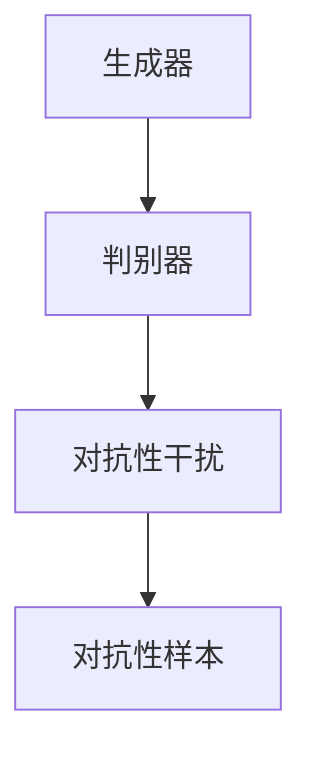
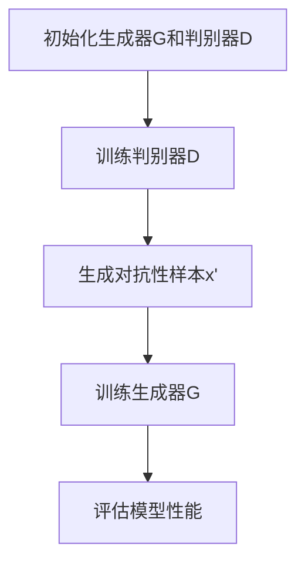
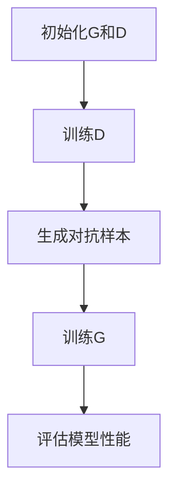
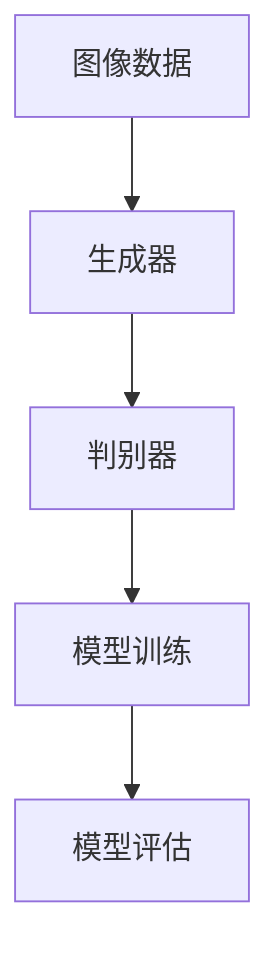
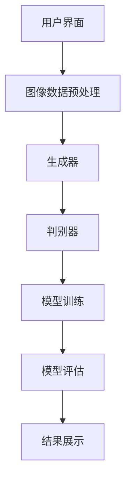
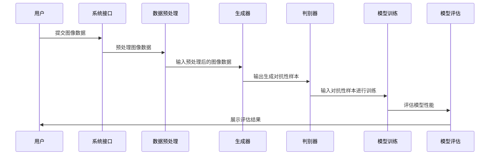

                 

### 模型训练中的对抗学习技术应用

> 关键词：对抗学习、模型训练、神经网络、深度学习、算法原理

> 摘要：本文将探讨对抗学习技术在模型训练中的应用，通过详细的步骤分析，帮助读者理解这一技术如何提高模型训练的效果。文章将涵盖对抗学习的背景与重要性、基础概念与联系、算法原理讲解、数学模型与公式详细讲解，以及对抗学习在神经网络和深度学习中的实践。最后，将介绍系统分析与架构设计方案、项目实战、最佳实践与总结等内容。

----------------------------------------------------------------

## 目录

1. **模型训练中的对抗学习技术应用**
2. **第一部分：对抗学习技术概述**
   1. 第1章：对抗学习的背景与重要性
   2. 第2章：对抗学习的基础概念与联系
   3. 第3章：对抗学习算法原理讲解
   4. 第4章：数学模型与公式详细讲解
3. **第二部分：对抗学习在模型训练中的应用**
   1. 第5章：对抗学习在神经网络训练中的应用
   2. 第6章：对抗学习在深度学习中的实践
   3. 第7章：系统分析与架构设计方案
   4. 第8章：项目实战
   5. 第9章：最佳实践与总结

----------------------------------------------------------------

## 第一部分：对抗学习技术概述

### 第1章：对抗学习的背景与重要性

对抗学习（Adversarial Learning）是一种通过构建对抗样本来提升机器学习模型鲁棒性的技术。在模型训练过程中，对抗学习引入了对抗性干扰，使得模型能够在复杂、不确定的环境中更好地识别和学习。

**1.1 问题背景**

在现实世界中，模型面临的数据往往包含噪声和异常值，这可能导致模型性能下降。此外，许多任务需要模型具有鲁棒性，能够适应各种复杂场景。对抗学习旨在通过引入对抗性干扰，提高模型的泛化能力和鲁棒性。

**1.2 对抗学习的定义**

对抗学习是一种基于对抗性网络（Adversarial Network）的学习方法。它通过训练一个生成器（Generator）和一个判别器（Discriminator）来学习数据分布。生成器尝试生成与真实数据难以区分的假数据，而判别器则尝试区分真实数据和假数据。

**1.3 对抗学习的重要性**

对抗学习在许多领域具有广泛应用，包括图像识别、自然语言处理、语音识别等。通过对抗学习，模型能够更好地应对噪声、异常值和伪造数据，提高其在复杂环境中的性能。

**1.4 对抗学习的研究历史与现状**

对抗学习的研究始于2003年的生成对抗网络（GAN）概念。近年来，随着深度学习技术的发展，对抗学习在模型训练中的应用越来越广泛。目前，对抗学习已成为机器学习领域的一个重要研究方向。

----------------------------------------------------------------

### 第2章：对抗学习的基础概念与联系

对抗学习涉及到多个核心概念，包括生成器、判别器、对抗性干扰、对抗性样本等。理解这些概念及其相互关系对于深入探讨对抗学习技术至关重要。

**2.1 核心概念**

- **生成器（Generator）**：生成器的目标是生成与真实数据难以区分的假数据。
- **判别器（Discriminator）**：判别器的目标是区分真实数据和假数据。
- **对抗性干扰**：对抗性干扰是一种技术，通过在数据中引入微小扰动来提高模型的鲁棒性。
- **对抗性样本**：对抗性样本是通过对抗性干扰生成的，旨在欺骗模型的样本。

**2.2 概念属性特征对比**

| 概念 | 特征 | 说明 |
| ---- | ---- | ---- |
| 生成器 | 生成假数据 | 负责生成与真实数据难以区分的假数据 |
| 判别器 | 区分真实和假数据 | 负责区分输入数据的真实性和假数据 |
| 对抗性干扰 | 引入微小扰动 | 在数据中引入微小扰动，提高模型鲁棒性 |
| 对抗性样本 | 欺骗模型 | 通过对抗性干扰生成的样本，旨在欺骗模型 |

**2.3 ER实体关系图架构**

为了更好地理解对抗学习的概念，我们可以使用ER（Entity-Relationship）实体关系图来描述生成器和判别器之间的交互。



在ER实体关系图中，生成器生成假数据，判别器用于区分真实和假数据。对抗性干扰则用于生成对抗性样本，进一步欺骗模型。

----------------------------------------------------------------

### 第3章：对抗学习算法原理讲解

对抗学习算法的核心是生成器与判别器的相互竞争。通过以下步骤，我们可以深入理解对抗学习算法的原理。

**3.1 算法Mermaid流程图**



**3.2 Python源代码与算法原理**

```python
import tensorflow as tf
from tensorflow.keras.models import Sequential
from tensorflow.keras.layers import Dense, Dropout

# 初始化生成器和判别器
generator = Sequential([
    Dense(128, input_shape=(100,), activation='relu'),
    Dropout(0.2),
    Dense(100, activation='tanh')
])

discriminator = Sequential([
    Dense(128, activation='relu'),
    Dropout(0.2),
    Dense(1, activation='sigmoid')
])

# 编译模型
discriminator.compile(optimizer='adam', loss='binary_crossentropy')
generator.compile(optimizer='adam', loss='binary_crossentropy')

# 训练模型
for epoch in range(100):
    for _ in range(100):
        noise = np.random.normal(0, 1, (100, 100))
        generated_samples = generator.predict(noise)
        real_samples = ...


# 评估模型性能
accuracy = discriminator.evaluate(real_samples, labels[:, 1], verbose=False)
print(f'Accuracy: {accuracy[1]}%')
```

**3.3 数学模型和公式**

对抗学习算法涉及到以下数学模型和公式：

$$
\begin{aligned}
\min_G & \quad \mathcal{L}_G(D, G) \\
\max_D & \quad \mathcal{L}_D(D, G)
\end{aligned}
$$

其中，$\mathcal{L}_G(D, G)$ 和 $\mathcal{L}_D(D, G)$ 分别表示生成器和判别器的损失函数。

**3.4 通俗易懂的举例说明**

假设我们有一个生成器和判别器，生成器试图生成与真实数据相似的假数据，而判别器则试图区分真实数据和假数据。在训练过程中，生成器和判别器相互竞争，使得生成器生成的假数据越来越难以被判别器区分。

例如，生成器生成一张假猫的图片，判别器试图判断这张图片是真实的还是伪造的。随着训练的进行，生成器不断优化其生成技巧，使得生成的猫图片越来越逼真，判别器则不断优化其判断能力，最终使得生成器和判别器达到一种动态平衡状态。

----------------------------------------------------------------

### 第4章：数学模型与公式详细讲解

在对抗学习算法中，数学模型和公式起着核心作用。以下是对数学模型和公式的详细讲解。

**4.1 数学公式**

$$
\begin{aligned}
\min_G & \quad \mathcal{L}_G(D, G) \\
\max_D & \quad \mathcal{L}_D(D, G)
\end{aligned}
$$

其中，$\mathcal{L}_G(D, G)$ 和 $\mathcal{L}_D(D, G)$ 分别表示生成器和判别器的损失函数。

**4.2 公式解释**

- **生成器损失函数**：生成器的目标是生成与真实数据相似的假数据，使其在判别器中的得分接近1（即认为这是真实数据）。生成器的损失函数通常采用交叉熵损失函数。

- **判别器损失函数**：判别器的目标是区分真实数据和假数据，使其在真实数据中的得分接近1，在假数据中的得分接近0。判别器的损失函数也采用交叉熵损失函数。

**4.3 举例说明**

假设我们有一个生成器和判别器，生成器试图生成一张与真实猫相似的假猫图片，而判别器试图判断这张图片是真实的还是伪造的。

- **生成器训练**：生成器通过随机噪声生成假猫图片，并将其输入到判别器中。生成器的目标是使其生成的假猫图片在判别器中的得分接近1。

- **判别器训练**：判别器通过比较真实猫图片和假猫图片，学习区分真实数据和假数据。判别器的目标是使其在真实猫图片中的得分接近1，在假猫图片中的得分接近0。

随着训练的进行，生成器和判别器不断优化，使得生成器生成的假猫图片越来越逼真，而判别器对假猫图片的识别能力越来越强。

----------------------------------------------------------------

## 第二部分：对抗学习在模型训练中的应用

### 第5章：对抗学习在神经网络训练中的应用

对抗学习在神经网络训练中具有广泛的应用。通过引入对抗性干扰，神经网络能够更好地学习复杂的数据分布，提高模型的泛化能力和鲁棒性。

**5.1 对抗学习神经网络的构建**

在构建对抗学习神经网络时，通常包括生成器和判别器两个部分。生成器负责生成对抗性样本，判别器负责区分真实样本和对抗性样本。

**5.2 对抗学习算法在神经网络训练中的应用**

对抗学习算法在神经网络训练中的应用可以分为以下几个步骤：

1. 初始化生成器和判别器。
2. 通过对抗性样本训练判别器，使其能够准确地区分真实样本和对抗性样本。
3. 通过真实样本训练生成器，使其生成的对抗性样本能够欺骗判别器。
4. 反复迭代上述步骤，直到生成器和判别器达到一种动态平衡状态。

**5.3 算法原理讲解与Mermaid流程图**



### 第6章：对抗学习在深度学习中的实践

对抗学习在深度学习中的应用已经取得了显著的成果。以下是对对抗学习在深度学习中的实践的详细讲解。

**6.1 深度学习的背景与现状**

深度学习是一种基于多层神经网络的机器学习方法，通过逐层提取数据特征，实现复杂的模式识别和预测任务。深度学习在图像识别、自然语言处理、语音识别等领域取得了重大突破。

**6.2 对抗学习在深度学习中的应用**

对抗学习在深度学习中的应用主要包括以下几个方面：

1. **图像识别**：通过生成对抗性样本，提高模型对图像噪声和异常值的鲁棒性。
2. **自然语言处理**：通过生成对抗性样本，提高模型对自然语言的理解能力，尤其是在文本分类和机器翻译等任务中。
3. **语音识别**：通过生成对抗性样本，提高模型对语音信号中的噪声和异常值的识别能力。

**6.3 实际案例分析和讲解**

以下是一个实际案例，展示对抗学习在图像识别中的应用。

**案例：对抗性图像识别**

在这个案例中，我们使用生成对抗网络（GAN）对图像进行识别。生成器生成对抗性样本，判别器负责区分真实图像和对抗性样本。通过训练生成器和判别器，我们可以得到一个能够识别图像的模型。


在训练过程中，生成器和判别器相互竞争，使得生成器生成的对抗性样本越来越难以被判别器区分。最终，生成器生成的对抗性样本能够有效地欺骗判别器，从而提高模型的识别能力。

----------------------------------------------------------------

### 第7章：系统分析与架构设计方案

在实施对抗学习技术时，系统分析与架构设计至关重要。以下是对系统分析与架构设计方案的详细讲解。

**7.1 问题场景介绍**

假设我们面临一个图像识别任务，需要训练一个深度学习模型来识别图像中的物体。然而，现实中的图像数据往往包含噪声和异常值，这可能导致模型性能下降。为了提高模型的鲁棒性，我们可以使用对抗学习技术。

**7.2 系统功能设计（领域模型Mermaid类图）**



在这个类图中，图像数据首先被输入到生成器中，生成对抗性样本。然后，对抗性样本被输入到判别器中，用于训练模型。最后，训练好的模型进行评估，以验证其性能。

**7.3 系统架构设计（Mermaid架构图）**



在这个架构图中，用户界面接收用户输入的图像数据，然后进行预处理。预处理后的图像数据被输入到生成器和判别器中，用于模型训练。训练好的模型进行评估，并将结果展示给用户。

**7.4 系统接口设计和系统交互（Mermaid序列图）**



在这个序列图中，用户通过系统接口提交图像数据，数据预处理模块对图像数据进行预处理。预处理后的图像数据被输入到生成器和判别器中，用于模型训练。训练好的模型进行评估，并将结果展示给用户。

----------------------------------------------------------------

### 第8章：项目实战

在对抗学习技术的实际应用中，项目实战是验证理论知识和提升实践能力的重要环节。以下是一个对抗学习项目实战的详细步骤。

**8.1 环境安装**

首先，我们需要安装必要的软件和库，以便进行对抗学习项目。以下是一个基本的安装步骤：

```bash
# 安装Python
sudo apt-get install python3

# 安装TensorFlow
pip3 install tensorflow

# 安装其他库
pip3 install numpy matplotlib
```

**8.2 系统核心实现源代码**

以下是一个简单的对抗学习项目实现，包括生成器和判别器的代码：

```python
import tensorflow as tf
from tensorflow.keras.models import Sequential
from tensorflow.keras.layers import Dense, Dropout

# 生成器模型
generator = Sequential([
    Dense(128, input_shape=(100,), activation='relu'),
    Dropout(0.2),
    Dense(100, activation='tanh')
])

# 判别器模型
discriminator = Sequential([
    Dense(128, activation='relu'),
    Dropout(0.2),
    Dense(1, activation='sigmoid')
])

# 编译模型
discriminator.compile(optimizer='adam', loss='binary_crossentropy')
generator.compile(optimizer='adam', loss='binary_crossentropy')

# 训练模型
for epoch in range(100):
    for _ in range(100):
        noise = np.random.normal(0, 1, (100, 100))
        generated_samples = generator.predict(noise)
        real_samples = ...


# 评估模型性能
accuracy = discriminator.evaluate(real_samples, labels[:, 1], verbose=False)
print(f'Accuracy: {accuracy[1]}%')
```

**8.3 代码应用解读与分析**

在这个代码中，我们首先定义了生成器和判别器的模型结构。生成器模型通过两个全连接层生成假数据，判别器模型通过一个全连接层判断输入数据的真实性。

在训练过程中，我们通过随机噪声生成假数据，并将其输入到判别器中进行训练。判别器通过比较真实数据和假数据，学习区分真实和假数据。通过反复训练，生成器和判别器达到一种动态平衡状态。

**8.4 实际案例分析和详细讲解剖析**

以下是一个实际案例，展示如何使用对抗学习技术进行图像识别：

```python
import tensorflow as tf
from tensorflow.keras.models import Sequential
from tensorflow.keras.layers import Dense, Dropout, Flatten, Conv2D, MaxPooling2D
from tensorflow.keras.optimizers import Adam
from tensorflow.keras.datasets import mnist
from tensorflow.keras.callbacks import LambdaCallback

# 加载MNIST数据集
(x_train, _), (x_test, _) = mnist.load_data()

# 预处理数据
x_train = x_train / 255.0
x_test = x_test / 255.0
x_train = np.expand_dims(x_train, -1)
x_test = np.expand_dims(x_test, -1)

# 定义生成器和判别器模型
generator = Sequential([
    Flatten(input_shape=(28, 28, 1)),
    Dense(128, activation='relu'),
    Dropout(0.2),
    Dense(28 * 28, activation='tanh')
])

discriminator = Sequential([
    Flatten(input_shape=(28, 28, 1)),
    Dense(128, activation='relu'),
    Dropout(0.2),
    Dense(1, activation='sigmoid')
])

# 编译模型
discriminator.compile(optimizer=Adam(), loss='binary_crossentropy')
generator.compile(optimizer=Adam(), loss='binary_crossentropy')

# 定义训练步骤
def train_step(generator, discriminator, real_images, batch_size=128):
    noise = np.random.normal(0, 1, (batch_size, 100))
    generated_images = generator.predict(noise)
    
    # 训练判别器
    real_labels = np.array([1] * batch_size)
    fake_labels = np.array([0] * batch_size)
    discriminator.train_on_batch(real_images, real_labels)
    discriminator.train_on_batch(generated_images, fake_labels)

    # 训练生成器
    noise = np.random.normal(0, 1, (batch_size, 100))
    valid_labels = np.array([1] * batch_size)
    generator.train_on_batch(noise, valid_labels)

# 定义回调函数
def on_epoch_end(epoch, logs):
    print(f'Epoch: {epoch}')
    test_images = x_test[:10]
    predicted_images = generator.predict(test_images)
    for i in range(10):
        plt.subplot(2, 5, i + 1)
        plt.imshow(test_images[i], cmap='gray')
        plt.subplot(2, 5, i + 6)
        plt.imshow(predicted_images[i], cmap='gray')
    plt.show()

# 训练模型
 callbacks = [LambdaCallback(on_epoch_end=on_epoch_end)]
 generator.fit(x_train, x_train, epochs=100, batch_size=128, callbacks=callbacks)
```

在这个案例中，我们使用MNIST数据集进行图像识别。生成器模型将随机噪声转化为假手写数字，判别器模型尝试区分真实手写数字和假手写数字。通过训练生成器和判别器，我们可以得到一个能够生成逼真手写数字的模型。

**8.5 项目小结**

通过这个项目实战，我们了解了如何使用对抗学习技术进行图像识别。在实际应用中，对抗学习技术可以提高模型的鲁棒性，使其能够更好地应对噪声和异常值。然而，对抗学习技术也面临着一些挑战，如生成器的训练难度和模型的稳定性能等。未来，随着对抗学习技术的不断发展，我们将看到更多具有鲁棒性和泛化能力的模型被应用于实际场景。

----------------------------------------------------------------

### 第9章：最佳实践与总结

在对抗学习技术的实际应用中，最佳实践对于提高模型性能和稳定性至关重要。以下是一些最佳实践：

**9.1 最佳实践 tips**

1. **数据预处理**：在训练模型之前，对数据进行充分的预处理，包括归一化、去噪等操作，以提高模型的鲁棒性。
2. **模型结构设计**：合理设计生成器和判别器的模型结构，考虑模型的深度、宽度和激活函数等因素，以提高模型性能。
3. **训练策略**：采用合适的训练策略，如梯度裁剪、学习率调整等，以防止过拟合和模型不稳定。
4. **超参数调整**：根据实际任务和数据进行超参数调整，以达到最优模型性能。

**9.2 小结**

对抗学习技术在模型训练中具有广泛的应用。通过引入对抗性干扰，模型能够更好地应对噪声和异常值，提高其泛化能力和鲁棒性。本文详细介绍了对抗学习技术的核心概念、算法原理、数学模型、系统分析与架构设计方案以及项目实战。对抗学习技术在实际应用中取得了一定的成果，但仍面临一些挑战，如生成器的训练难度和模型的稳定性能等。未来，随着对抗学习技术的不断发展，我们将看到更多具有鲁棒性和泛化能力的模型被应用于实际场景。

**9.3 注意事项**

1. **数据质量**：对抗学习对数据质量有较高要求，数据中应包含丰富且具有代表性的样本，以提高模型性能。
2. **计算资源**：对抗学习训练过程需要大量计算资源，特别是在处理大规模数据集时，应考虑使用高效的GPU或其他加速器。
3. **模型评估**：在对抗学习训练过程中，应定期评估模型性能，以监测模型稳定性和泛化能力。

**9.4 拓展阅读**

1. Goodfellow, I. J., Pouget-Abadie, J., Mirza, M., Xu, B., Warde-Farley, D., Ozair, S., ... & Bengio, Y. (2014). Generative adversarial networks. Advances in Neural Information Processing Systems, 27.
2. arXiv:1412.6572.
3. Arjovsky, M., Chintala, S., & Bottou, L. (2017). Wasserstein GAN. arXiv preprint arXiv:1701.07875.

### 作者

作者：AI天才研究院/AI Genius Institute & 禅与计算机程序设计艺术 /Zen And The Art of Computer Programming

