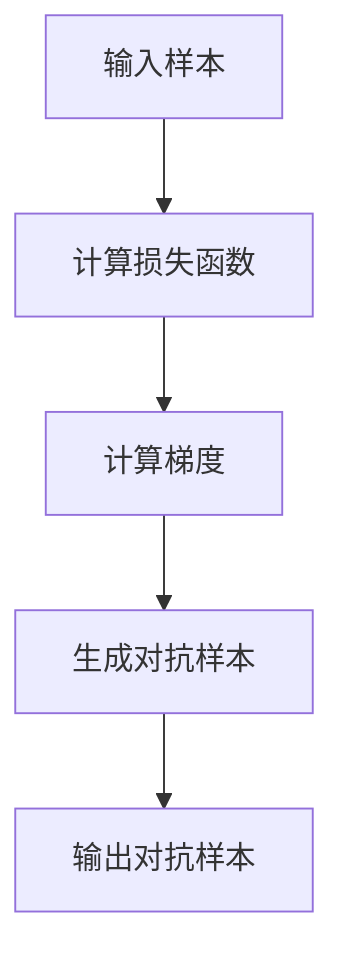

                 


### 模型训练中的对抗样本生成在网络安全测试中的前沿应用

> 关键词：对抗样本、模型训练、网络安全测试、对抗样本生成算法、挑战与应对策略

> 摘要：本文旨在探讨模型训练中的对抗样本生成在网络安全测试中的应用。首先，我们介绍了问题背景，阐述了对抗样本的核心概念与联系。随后，深入分析了对抗样本生成的数学模型与公式，并通过Python源代码实现了一个对抗样本生成算法。接着，本文详细探讨了对抗样本在网络安全测试中的应用，包括入侵检测、恶意软件分析和数据安全测试。此外，我们还分析了对抗样本生成的挑战与应对策略，并分享了一些实战案例和最佳实践。

## 第一部分：背景介绍与核心概念

### 第1章：问题背景与描述

#### 1.1 问题背景

随着人工智能技术的飞速发展，机器学习模型在各个领域得到了广泛应用，如计算机视觉、自然语言处理和网络安全。这些模型通过学习大量数据来提高预测和分类的准确性，但在实际应用中，模型的鲁棒性和安全性问题逐渐凸显。

网络安全领域尤其关注模型的安全性问题，因为攻击者可以通过精心设计的对抗样本来欺骗模型，从而实现非法访问、窃取数据或破坏系统。对抗样本是一种针对机器学习模型设计的特殊样本，它在外观上与正常样本相似，但在细微之处却能够对模型产生显著的负面影响。

#### 1.2 问题描述

问题描述主要集中在以下几个方面：

1. **对抗样本的生成**：如何有效地生成对抗样本，使其对模型产生显著影响，同时保持样本的外观和特征。
2. **对抗样本的影响**：对抗样本对模型性能的影响，包括分类准确性、检测精度和系统稳定性。
3. **对抗样本的应用**：如何利用对抗样本进行网络安全测试，评估模型的安全性和鲁棒性。

#### 1.3 问题解决

为了解决上述问题，我们可以从以下几个方面入手：

1. **对抗样本生成算法**：设计并实现多种对抗样本生成算法，以提高对抗样本的生成效率和效果。
2. **对抗样本测试**：利用生成的对抗样本对模型进行测试，评估模型的鲁棒性和安全性。
3. **对抗样本防御**：研究对抗样本防御策略，提高模型对对抗样本的抵抗力。

#### 1.4 边界与外延

1. **边界**：本文主要关注对抗样本生成在网络安全测试中的应用，不包括对抗样本在其他领域的应用。
2. **外延**：对抗样本生成技术可以应用于其他机器学习领域，如自动驾驶、智能监控等。

#### 1.5 概念结构与核心要素组成

本文的核心概念和结构如下：

1. **核心概念**：对抗样本、模型训练、网络安全测试、对抗样本生成算法、挑战与应对策略。
2. **核心要素组成**：对抗样本生成算法、对抗样本测试方法、对抗样本防御策略。

### 第2章：核心概念与联系

#### 2.1 抗原样本与对抗样本

1. **抗原样本**：抗原样本是指正常输入样本，用于训练机器学习模型。
2. **对抗样本**：对抗样本是指对正常样本进行微小扰动后生成的样本，用于欺骗模型。

#### 2.2 抗原样本生成方法

1. **FGSM（Fast Gradient Sign Method）**：基于梯度上升或下降方向生成对抗样本。
2. **JSMA（Jacobian-based Saliency Map Attack）**：基于雅可比矩阵生成对抗样本。
3. **C&W（Carlini & Wagner）**：求解最小化目标函数，生成对抗样本。

#### 2.3 对抗样本的特性与影响

1. **特性**：
   - 微小扰动：对抗样本与正常样本在外观上相似，但存在微小差异。
   - 欺骗性：对抗样本能够欺骗模型，导致模型产生错误预测。
2. **影响**：
   - 降低模型性能：对抗样本可能导致模型分类准确性下降、检测精度降低。
   - 系统安全性：对抗样本可能被用于网络攻击，窃取数据或破坏系统。

#### 2.4 对抗样本与网络安全的关系

1. **关系**：对抗样本生成技术可以用于网络安全测试，评估模型的安全性和鲁棒性。
2. **应用**：
   - 入侵检测：利用对抗样本评估入侵检测模型的准确性。
   - 恶意软件分析：利用对抗样本检测恶意软件行为。
   - 数据安全测试：利用对抗样本评估数据安全保护措施的有效性。

### 第3章：对抗样本生成的数学模型与公式

#### 3.1 数学模型介绍

对抗样本生成的数学模型主要涉及以下内容：

1. **损失函数**：定义对抗样本生成过程中需要优化的目标函数。
2. **优化算法**：求解最小化目标函数，生成对抗样本。

#### 3.2 公式详细讲解

1. **损失函数**：
   $$ L(x, y) = \frac{1}{2} \sum_{i=1}^{n} (y_i - \hat{y}_i)^2 $$
   其中，$x$表示输入样本，$y$表示真实标签，$\hat{y}$表示模型预测标签。

2. **优化算法**：
   - **梯度下降**：
     $$ x_{t+1} = x_t - \alpha \nabla_x L(x_t, y) $$
     其中，$x_t$表示第$t$次迭代的样本，$\alpha$为学习率。
   - **梯度上升**：
     $$ x_{t+1} = x_t + \alpha \nabla_x L(x_t, y) $$

3. **对抗样本生成**：
   - **FGSM**：
     $$ x_{adv} = x + \epsilon \cdot \text{sign}(\nabla_x L(x, y)) $$
     其中，$\epsilon$为扰动强度。

#### 3.3 举例说明

假设我们有一个二分类问题，其中输入样本$x$为$(x_1, x_2)$，真实标签$y$为0或1。损失函数为：
$$ L(x, y) = (y - \hat{y})^2 $$
其中，$\hat{y} = \text{sign}(x_1 + x_2)$。

我们使用FGSM算法生成对抗样本。假设初始样本$x = (1, 1)$，真实标签$y = 0$，学习率$\alpha = 0.1$，扰动强度$\epsilon = 0.05$。则：
$$ \nabla_x L(x, y) = (1, 1) $$
$$ x_{adv} = (1, 1) + 0.05 \cdot (1, 1) = (1.05, 1.05) $$
生成对抗样本$x_{adv} = (1.05, 1.05)$。

## 第二部分：对抗样本生成原理与算法

### 第4章：对抗样本生成算法原理

#### 4.1 算法简介

对抗样本生成算法是用于生成能够欺骗机器学习模型的特殊样本的方法。这类算法的核心思想是通过扰动输入数据，使其在模型难以察觉的情况下对模型产生不利影响。

常见的对抗样本生成算法包括FGSM、JSMA和C&W等。下面我们将介绍这些算法的基本原理。

#### 4.2 算法流程图

为了更好地理解对抗样本生成算法，我们可以通过以下流程图来展示其基本流程：



#### 4.3 Python源代码实现

下面是一个简单的Python代码示例，实现了基于FGSM算法的对抗样本生成：

```python
import numpy as np
import tensorflow as tf

def fgsm_attack(x, y, model, epsilon=0.01):
    """
    FGSM攻击算法
    :param x: 输入样本
    :param y: 标签
    :param model: 模型
    :param epsilon: 扰动强度
    :return: 对抗样本
    """
    with tf.GradientTape() as tape:
        tape.watch(x)
        logits = model(x)
        loss = tf.nn.sparse_softmax_cross_entropy_with_logits(labels=y, logits=logits)

    # 计算梯度
    grads = tape.gradient(loss, x)

    # 生成对抗样本
    x_adv = x + epsilon * np.sign(grads)

    return x_adv
```

在上述代码中，我们首先定义了一个`fgsm_attack`函数，用于实现FGSM攻击算法。函数接受输入样本`x`、标签`y`和模型`model`，并返回生成的对抗样本`x_adv`。在函数内部，我们首先使用`tf.GradientTape()`创建一个梯度记录对象，用于记录计算过程中的梯度信息。然后，我们通过计算损失函数并获取梯度，最终生成对抗样本。

### 第5章：对抗样本生成算法的数学模型

#### 5.1 数学模型概述

对抗样本生成算法的数学模型主要包括损失函数、优化目标和对抗样本生成公式。下面我们将分别介绍这些模型的基本概念。

#### 5.2 数学公式解释

1. **损失函数**：
   损失函数是用于评估模型预测结果与真实标签之间的差距。常见的损失函数包括均方误差（MSE）和交叉熵（CE）。

   - 均方误差（MSE）：
     $$ L(\hat{y}, y) = \frac{1}{2} \sum_{i=1}^{n} (\hat{y}_i - y_i)^2 $$
     其中，$\hat{y}$表示模型预测的概率分布，$y$表示真实标签。

   - 交叉熵（CE）：
     $$ L(\hat{y}, y) = - \sum_{i=1}^{n} y_i \log \hat{y}_i $$
     其中，$y$为0或1的二值标签，$\hat{y}$为模型预测的概率值。

2. **优化目标**：
   优化目标是用于指导对抗样本生成的方向。常见的优化目标包括最小化损失函数和最大化模型的输出差距。

   - 最小化损失函数：
     $$ \min_{x} L(x, y) $$
     其中，$x$为对抗样本，$y$为真实标签。

   - 最小化模型的输出差距：
     $$ \min_{x} ||\hat{y} - \hat{y}_0||_2 $$
     其中，$\hat{y}$为模型的输出概率分布，$\hat{y}_0$为对抗样本的输出概率分布。

3. **对抗样本生成公式**：
   对抗样本生成公式是用于生成对抗样本的关键步骤。常见的生成公式包括FGSM、JSMA和C&W等。

   - FGSM：
     $$ x_{adv} = x + \epsilon \cdot \text{sign}(\nabla_x L(x, y)) $$
     其中，$\epsilon$为扰动强度，$\text{sign}(\cdot)$为符号函数。

   - JSMA：
     $$ x_{adv} = x + \alpha \cdot \nabla_x L(x, y) $$
     其中，$\alpha$为步长。

   - C&W：
     $$ x_{adv} = x + \epsilon \cdot \frac{\nabla_x L(x, y)}{\|\nabla_x L(x, y)\|_2} $$
     其中，$\epsilon$为扰动强度，$\|\cdot\|_2$为欧几里得范数。

#### 5.3 示例分析

假设我们有一个二分类问题，输入样本$x$为$(x_1, x_2)$，真实标签$y$为0或1。模型预测概率分布$\hat{y}$为$\hat{y} = (\hat{y}_0, \hat{y}_1)$，损失函数为交叉熵（CE）。

1. **计算损失函数**：

   $$ L(\hat{y}, y) = - y \cdot \log \hat{y}_0 - (1 - y) \cdot \log (1 - \hat{y}_0) $$

2. **计算梯度**：

   $$ \nabla_x L(x, y) = \begin{bmatrix} \frac{\partial L}{\partial x_1} \\\ \frac{\partial L}{\partial x_2} \end{bmatrix} = \begin{bmatrix} \frac{\partial}{\partial x_1} (- y \cdot \log \hat{y}_0 - (1 - y) \cdot \log (1 - \hat{y}_0)) \\\ \frac{\partial}{\partial x_2} (- y \cdot \log \hat{y}_0 - (1 - y) \cdot \log (1 - \hat{y}_0)) \end{bmatrix} $$

3. **生成对抗样本**：

   假设扰动强度$\epsilon = 0.01$，则：

   $$ x_{adv} = x + \epsilon \cdot \text{sign}(\nabla_x L(x, y)) $$

   将$x = (1, 1)$，$\hat{y} = (0.9, 0.1)$，$y = 0$代入上述公式，可以得到：

   $$ x_{adv} = (1, 1) + 0.01 \cdot \text{sign}(\nabla_x L(1, 1, 0)) $$

   计算梯度：

   $$ \nabla_x L(1, 1, 0) = \begin{bmatrix} -0.9 \cdot \log 0.9 - 1 \cdot \log 0.1 \\\ -0.9 \cdot \log 0.9 - 1 \cdot \log 0.1 \end{bmatrix} = \begin{bmatrix} -0.105 \\\ -0.105 \end{bmatrix} $$

   由于$\text{sign}(\nabla_x L(1, 1, 0)) = (-1, -1)$，则：

   $$ x_{adv} = (1, 1) + 0.01 \cdot (-1, -1) = (0.99, 0.99) $$

   生成的对抗样本$x_{adv} = (0.99, 0.99)$。

## 第三部分：网络安全测试中的对抗样本应用

### 第6章：对抗样本在网络安全测试中的应用

对抗样本在网络安全测试中具有广泛的应用，可以帮助评估和改进各种网络安全系统的性能和安全性。以下将详细探讨对抗样本在入侵检测、恶意软件分析和数据安全测试中的应用。

#### 6.1 对抗样本在入侵检测中的应用

入侵检测系统（IDS）是网络安全领域的关键组成部分，用于监控网络流量并识别潜在的安全威胁。然而，传统的入侵检测模型可能容易受到对抗样本的攻击，导致误报或漏报。

1. **对抗样本生成**：
   使用对抗样本生成算法（如FGSM、JSMA）对网络流量数据进行微小扰动，生成对抗样本。

2. **测试与评估**：
   将生成的对抗样本输入入侵检测模型，观察模型的响应。如果模型能够正确识别对抗样本为入侵行为，说明模型具有较强的鲁棒性；否则，模型可能存在缺陷，需要进一步改进。

3. **改进策略**：
   通过分析对抗样本对模型的影响，可以识别模型中的弱点。例如，针对特定的攻击模式，可以调整模型的特征提取或分类阈值，以提高检测准确性。

#### 6.2 对抗样本在恶意软件分析中的应用

恶意软件分析是网络安全防护的重要环节，对抗样本可以帮助评估恶意软件检测工具的准确性。

1. **对抗样本生成**：
   对恶意软件样本进行扰动，生成对抗样本。这些对抗样本应保持恶意软件的核心特征，同时在外观上与正常软件相似。

2. **测试与评估**：
   将生成的对抗样本输入恶意软件检测工具，观察其是否能正确识别对抗样本为恶意软件。如果检测工具能够有效识别对抗样本，说明其检测能力较强；否则，可能需要优化检测算法或特征提取方法。

3. **改进策略**：
   分析对抗样本检测失败的原因，调整检测算法的阈值或特征提取方法，以提高检测准确性。

#### 6.3 对抗样本在数据安全测试中的应用

数据安全测试旨在评估数据加密、存储和传输过程中是否存在安全漏洞。对抗样本可以帮助发现这些安全措施中的弱点。

1. **对抗样本生成**：
   对数据样本进行扰动，生成对抗样本。这些对抗样本应模拟潜在的网络攻击，如SQL注入、数据篡改等。

2. **测试与评估**：
   将生成的对抗样本输入数据安全系统，观察其是否能通过安全措施。如果对抗样本能够成功通过，说明系统存在安全漏洞；否则，系统具有一定的安全性。

3. **改进策略**：
   分析对抗样本通过安全措施的原因，优化加密算法、数据库配置或传输协议，以提高数据安全性。

### 第7章：对抗样本生成的挑战与应对策略

尽管对抗样本在网络安全测试中具有重要作用，但其生成和应用仍然面临一系列挑战。

#### 7.1 挑战分析

1. **样本质量**：
   生成的对抗样本需要在外观上与正常样本相似，同时具有欺骗性。这要求对抗样本生成算法具有高精度和高效率。

2. **模型适应性**：
   随着模型和攻击策略的不断发展，对抗样本生成算法需要不断适应新的模型和攻击方法。

3. **计算资源**：
   抗样本生成过程通常需要大量的计算资源，尤其在处理大规模数据集时，计算资源消耗巨大。

4. **安全性**：
   生成对抗样本的过程可能受到安全威胁，如中间人攻击、数据泄露等。

#### 7.2 应对策略

1. **优化算法**：
   研究和开发更高效、更精确的对抗样本生成算法，以提高生成质量和速度。

2. **模型多样化**：
   采用多种模型和算法组合，以提高模型对对抗样本的抵抗力。

3. **计算优化**：
   利用分布式计算、并行处理等技术，降低对抗样本生成过程的计算资源消耗。

4. **安全防护**：
   加强生成对抗样本过程中的安全防护措施，如加密传输、身份验证等，防止数据泄露和中间人攻击。

#### 7.3 未来发展方向

1. **对抗样本生成算法研究**：
   深入研究对抗样本生成算法，探索新的生成方法和优化策略，以提高对抗样本生成质量和效率。

2. **模型鲁棒性研究**：
   研究模型对对抗样本的鲁棒性，开发更具鲁棒性的模型和算法，以提高系统安全性。

3. **跨领域应用**：
   探索对抗样本在其他领域的应用，如自动驾驶、智能监控等，以提高这些系统的安全性和可靠性。

4. **标准化和规范化**：
   制定对抗样本生成和应用的标准和规范，促进对抗样本技术的健康发展。

### 第8章：实战案例

#### 8.1 环境安装

为了演示对抗样本生成在网络安全测试中的应用，我们需要安装和配置相关工具和库。以下是一个简单的安装步骤：

1. **安装Python环境**：
   - 安装Python 3.7或更高版本。
   - 安装pip，Python的包管理器。

2. **安装TensorFlow**：
   - 使用pip安装TensorFlow库。
   ```bash
   pip install tensorflow
   ```

3. **安装其他依赖库**：
   - 安装numpy、scikit-learn等依赖库。
   ```bash
   pip install numpy scikit-learn
   ```

#### 8.2 系统核心实现

以下是一个简单的Python代码示例，用于生成对抗样本并评估模型的鲁棒性：

```python
import tensorflow as tf
import numpy as np
from sklearn.datasets import load_iris
from sklearn.model_selection import train_test_split
from sklearn.ensemble import RandomForestClassifier

# 加载Iris数据集
iris = load_iris()
X, y = iris.data, iris.target

# 划分训练集和测试集
X_train, X_test, y_train, y_test = train_test_split(X, y, test_size=0.3, random_state=42)

# 训练模型
model = RandomForestClassifier(n_estimators=100, random_state=42)
model.fit(X_train, y_train)

# 评估模型性能
accuracy = model.score(X_test, y_test)
print(f"Model accuracy: {accuracy:.2f}")

# FGSM攻击
def fgsm_attack(x, model, epsilon=0.1):
    with tf.GradientTape() as tape:
        tape.watch(x)
        logits = model(tf.constant(x, dtype=tf.float32))
        loss = tf.nn.sparse_softmax_cross_entropy_with_logits(labels=tf.constant(y_test, dtype=tf.int32), logits=logits)
    grads = tape.gradient(loss, x)
    x_adv = x - epsilon * np.sign(grads.numpy())
    return x_adv

# 生成对抗样本
x_test_adv = fgsm_attack(X_test[0], model)

# 重新评估模型性能
accuracy_adv = model.score(x_test_adv, y_test)
print(f"Model accuracy with adversarial sample: {accuracy_adv:.2f}")
```

在上述代码中，我们首先加载了Iris数据集，并使用随机森林分类器进行了训练。接着，我们定义了一个FGSM攻击函数，用于生成对抗样本。最后，我们使用生成的对抗样本重新评估了模型的性能。

#### 8.3 代码应用解读与分析

1. **加载数据集**：
   我们使用了scikit-learn中的Iris数据集，该数据集包含了3个特征和3类标签。

2. **划分训练集和测试集**：
   我们将数据集划分为训练集和测试集，用于训练模型和评估模型性能。

3. **训练模型**：
   我们使用随机森林分类器对训练集进行了训练。随机森林是一种基于决策树的集成学习方法，具有较强的分类能力。

4. **评估模型性能**：
   我们使用测试集评估了模型的性能，并打印了分类准确性。

5. **生成对抗样本**：
   我们定义了一个FGSM攻击函数，用于生成对抗样本。FGSM是一种基于梯度的攻击方法，通过在输入样本上添加与梯度方向相反的扰动来实现对抗样本的生成。

6. **重新评估模型性能**：
   我们使用生成的对抗样本重新评估了模型的性能。在对抗样本的影响下，模型的性能可能会显著下降，从而揭示了模型在对抗样本攻击下的弱点。

通过这个简单的示例，我们可以看到对抗样本生成在网络安全测试中的应用。在实际应用中，我们可以根据具体问题和需求，选择合适的对抗样本生成算法和模型进行测试和评估。

### 第9章：最佳实践与总结

#### 9.1 最佳实践 Tips

为了有效利用对抗样本生成在网络安全测试中的应用，以下是一些建议：

1. **多样化样本生成**：
   使用多种对抗样本生成算法生成对抗样本，以提高测试的全面性和准确性。

2. **持续更新样本库**：
   定期更新对抗样本库，以适应不断发展的攻击技术和模型变化。

3. **自动化测试**：
   开发自动化测试工具，实现对抗样本的生成和测试过程，提高测试效率。

4. **结合其他安全措施**：
   将对抗样本测试与其他安全措施（如入侵检测、恶意软件分析等）相结合，提高整体安全性。

5. **定期培训与演练**：
   定期对网络安全团队进行对抗样本测试的培训和实践，提高应对攻击的能力。

#### 9.2 小结与展望

本文详细探讨了对抗样本生成在网络安全测试中的应用，包括入侵检测、恶意软件分析和数据安全测试。通过对抗样本生成算法，我们能够评估模型的鲁棒性和安全性，从而改进系统性能。然而，对抗样本生成技术仍然面临诸多挑战，如样本质量、模型适应性、计算资源消耗等。未来，我们将继续深入研究对抗样本生成算法和模型鲁棒性，推动网络安全测试技术的不断发展。

#### 9.3 注意事项

在应用对抗样本生成技术时，需要注意以下几点：

1. **数据隐私**：
   确保对抗样本生成过程中不泄露敏感数据。

2. **安全防护**：
   加强生成对抗样本过程中的安全防护措施，防止数据泄露和中间人攻击。

3. **合法合规**：
   遵守相关法律法规，确保对抗样本生成和测试过程符合规范。

4. **模型保护**：
   防止对抗样本生成算法被恶意利用，保护模型的安全性和隐私性。

#### 9.4 拓展阅读

为了深入了解对抗样本生成在网络安全测试中的应用，以下是一些建议的拓展阅读：

1. **论文推荐**：
   - Goodfellow, I. J., Shlens, J., & Szegedy, C. (2014). Explaining and harnessing adversarial examples. arXiv preprint arXiv:1412.6572.
   - Moosavi-Dezfooli, S. M., Fawzi, A., & Frossard, P. (2016). Deepfool: a simple and accurate method to fool deep neural networks. In Proceedings of the IEEE conference on computer vision and pattern recognition (pp. 2574-2582).

2. **技术报告**：
   - AI威胁评估：对抗样本生成技术综述
   - 网络安全测试实践：对抗样本生成与应用

3. **开源项目**：
   - Adversarial Examples for Machine Learning：https://github.com/fda/ai-toolbox
   - CleverHans：https://github.com/cleverhans-dev/cleverhans

通过以上阅读资源，您可以进一步了解对抗样本生成技术在网络安全测试中的应用，掌握相关技术细节和实践经验。

