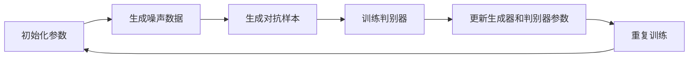
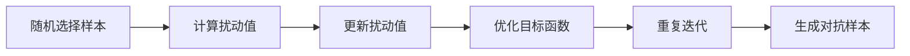
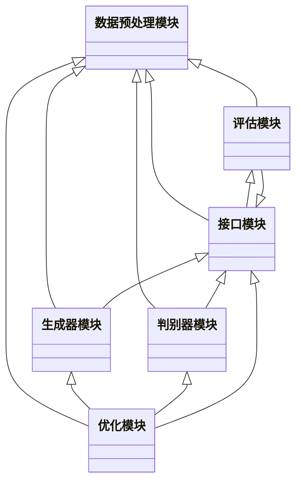
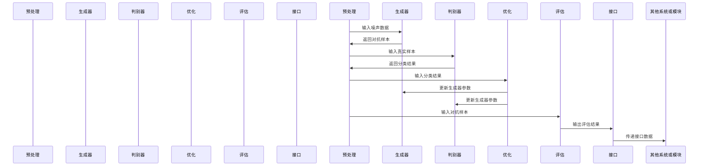
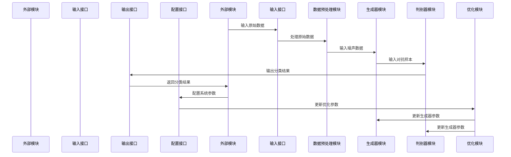
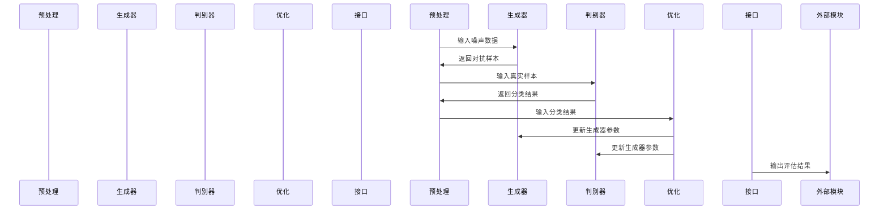

                 

### 第一部分：背景与概述

#### 第1章：问题背景与概念介绍

##### 1.1.1 问题背景

对抗样本生成技术在模型训练与推理中的重要性

随着深度学习技术的快速发展，神经网络模型在各类复杂任务中展现了强大的性能。然而，深度学习模型也存在一些不可忽视的问题，其中之一就是对对抗样本的脆弱性。对抗样本是指在图像、文本或音频等输入数据上添加微小的扰动，使得模型的预测结果发生显著变化。这种微小的扰动往往无法被人类肉眼察觉，但却能够对模型造成严重的影响，从而导致模型在现实场景中的不稳定和不可靠。

对抗样本生成技术在模型训练中的重要性主要体现在以下几个方面：

1. **增强模型鲁棒性**：通过生成对抗样本，可以识别并修复模型中存在的漏洞，从而提高模型的鲁棒性，使其在真实环境中能够更加稳定地运行。
2. **提升模型泛化能力**：对抗样本生成技术可以帮助模型学习到更多的边界情况，从而提高模型的泛化能力，使其在面对不同类型的输入数据时仍能保持良好的性能。
3. **促进模型理解**：通过分析对抗样本，可以揭示模型内部的工作机制和潜在的问题，从而帮助研究人员更好地理解模型的决策过程，进而优化模型的设计和训练策略。

##### 1.1.2 对抗样本的定义

对抗样本的概念、分类与产生方法

对抗样本（Adversarial Example）是指对原始输入数据进行微小的、可察觉的扰动，导致模型的预测结果发生错误。这些扰动通常是通过特定的算法生成的，使得模型在对抗样本上的预测性能显著下降。

对抗样本可以分为以下几类：

1. **Lp范数对抗样本**：在Lp范数下，对输入数据进行微小的扰动，使得模型的预测结果发生错误。例如，L2范数对抗样本是指在输入图像的像素值上添加微小的扰动，使得模型的预测结果发生翻转。
2. **梯度攻击**：利用模型的梯度信息，生成对抗样本。这类攻击方法可以精确地控制对抗样本的扰动程度，使得模型在对抗样本上的预测性能最差。
3. **生成对抗网络（GAN）对抗样本**：利用生成对抗网络（GAN）生成对抗样本。GAN通过训练生成器（Generator）和判别器（Discriminator）之间的对抗关系，生成具有高真实度的对抗样本。

对抗样本的产生方法主要包括：

1. **Foolbox**：基于梯度攻击的方法，可以生成各种Lp范数对抗样本。
2. **C&W攻击**：一种经典的对抗样本生成方法，可以生成具有较高攻击效果的L2范数对抗样本。
3. **PGD攻击**：渐进性梯度攻击（Progressive Gradient Descent）方法，通过逐步增加对抗样本的扰动程度，生成具有较高攻击效果的对抗样本。

##### 1.1.3 推理鲁棒性的概念与需求

推理鲁棒性的重要性、度量标准与提升方法

推理鲁棒性（Robustness in Inference）是指深度学习模型在面临对抗样本时的鲁棒性。一个具有良好推理鲁棒性的模型能够在面对对抗样本时保持稳定的预测性能，从而避免因对抗样本导致的错误预测。

推理鲁棒性的重要性体现在以下几个方面：

1. **安全性**：在现实场景中，对抗样本可能被恶意攻击者利用，从而对模型的预测结果进行篡改，导致严重的安全问题。
2. **可靠性**：具有良好推理鲁棒性的模型能够在各种复杂场景中保持稳定的性能，从而提高模型的可靠性和实用性。
3. **泛化能力**：通过提升推理鲁棒性，可以增强模型在面对不同类型输入数据时的泛化能力。

推理鲁棒性的度量标准主要包括：

1. **攻击成功率**：指对抗样本在模型上成功诱使模型产生错误预测的概率。
2. **扰动幅度**：对抗样本生成的扰动幅度，通常使用Lp范数进行衡量。
3. **误分类率**：对抗样本在模型上的误分类率，用于评估模型在面对对抗样本时的鲁棒性。

提升推理鲁棒性的方法主要包括：

1. **对抗训练**：通过在训练过程中引入对抗样本，提高模型对对抗样本的抵抗力。
2. **正则化**：在模型训练过程中引入正则化项，抑制模型对对抗样本的敏感性。
3. **模型压缩**：通过模型压缩技术，降低模型对对抗样本的脆弱性。
4. **混合模型**：将多个模型进行融合，提高模型在面对对抗样本时的鲁棒性。

##### 1.1.4 对抗样本生成技术在推理鲁棒性提升中的应用场景

工业、金融、医疗等领域的应用实例

对抗样本生成技术在推理鲁棒性提升中的应用场景非常广泛，以下列举了几个典型领域：

1. **工业领域**：在工业自动化控制系统中，对抗样本生成技术可以用于检测和防御恶意攻击，提高系统的安全性和可靠性。
2. **金融领域**：在金融交易系统中，对抗样本生成技术可以用于检测欺诈交易，提高交易系统的安全性。
3. **医疗领域**：在医疗影像诊断中，对抗样本生成技术可以用于识别和防御恶意攻击，提高诊断系统的准确性。
4. **自动驾驶领域**：在自动驾驶系统中，对抗样本生成技术可以用于测试和优化自动驾驶算法的鲁棒性，提高系统的安全性。

综上所述，对抗样本生成技术在模型训练与推理中的重要性不可忽视。通过深入研究和应用对抗样本生成技术，可以显著提升深度学习模型的推理鲁棒性，从而在实际应用中取得更好的效果。

#### 第2章：核心概念与联系

##### 2.1.1 对抗样本生成技术原理

对抗样本生成技术的原理主要基于深度学习和优化算法。在对抗样本生成过程中，通常涉及生成器（Generator）和判别器（Discriminator）两个核心组件，它们之间通过对抗关系相互训练，从而生成对抗样本。

1. **生成器（Generator）**：生成器是一个神经网络模型，其目的是生成与真实样本相似但具有微小差异的对抗样本。生成器通常通过随机噪声作为输入，通过多个隐含层进行变换，最终生成对抗样本。

2. **判别器（Discriminator）**：判别器是一个神经网络模型，其目的是区分对抗样本和真实样本。判别器通过对抗样本和真实样本进行训练，学习到对抗样本的特征，从而提高其分类能力。

3. **对抗关系**：生成器和判别器之间通过对抗关系相互训练。生成器的目标是生成尽可能真实的对抗样本，使得判别器难以区分；而判别器的目标是提高其分类能力，准确地区分对抗样本和真实样本。通过这种对抗关系，生成器和判别器不断迭代优化，最终生成高质量的对抗样本。

4. **对抗样本生成过程**：对抗样本生成过程主要包括以下步骤：

   a. 随机生成噪声数据作为生成器的输入。

   b. 生成器将噪声数据转换为对抗样本。

   c. 判别器同时接收对抗样本和真实样本，进行分类预测。

   d. 根据判别器的分类结果，计算生成器的损失函数，并通过反向传播算法更新生成器的参数。

   e. 重复上述步骤，直到生成器和判别器达到预定的训练目标。

##### 2.1.2 对抗样本生成技术的属性特征对比表格

为了更好地理解不同对抗样本生成技术的特点，下面列出了几种常见技术的属性特征对比表格：

| 技术名称       | 原理               | 特点                     | 适用场景                   |
|----------------|--------------------|--------------------------|----------------------------|
| Fast Gradient Sign Method (FGSM) | 基于梯度的攻击方法 | 产生速度快，攻击效果较好 | 对单个样本进行攻击           |
| Carlini & Wagner (C&W) Attack | 基于最小化损失函数的方法 | 攻击效果较好，计算复杂度高 | 对单个样本进行攻击           |
| Projected Gradient Descent (PGD) | 基于梯度的攻击方法 | 攻击效果较好，对模型具有较广泛的适应性 | 对多个样本进行攻击           |
| DeepFool         | 基于模型梯度的方法 | 攻击效果较好，但计算复杂度高 | 对单个样本进行攻击           |
| Adversarial Robustness Toolbox (ART) | 综合多种攻击方法 | 攻击效果较好，适用于多种模型和任务 | 对多个样本进行攻击           |

通过对比表格可以看出，不同对抗样本生成技术具有不同的特点，适用于不同的场景。在选择对抗样本生成技术时，需要根据具体的应用需求和模型特点进行选择。

##### 2.1.3 ER实体关系图架构

对抗样本生成技术中的核心实体及其关系如下：

1. **实体**：
   - **生成器（Generator）**：负责生成对抗样本。
   - **判别器（Discriminator）**：负责区分对抗样本和真实样本。
   - **噪声数据（Noise Data）**：作为生成器的输入，用于生成对抗样本。
   - **真实样本（Real Samples）**：用于训练判别器，作为判别器的输入。

2. **关系**：
   - **生成器与噪声数据之间的关系**：生成器通过噪声数据进行变换，生成对抗样本。
   - **判别器与真实样本和对抗样本之间的关系**：判别器同时接收真实样本和对抗样本，进行分类预测，以区分它们。
   - **生成器与判别器之间的关系**：生成器和判别器通过对抗关系相互训练，生成器和判别器的参数在训练过程中不断更新。

ER实体关系图如下所示：

```mermaid
erDiagram
  Generator ||--|{ Noise Data }|--| Discriminator
  Generator ||--|{ Real Samples }|--| Discriminator
```

通过ER实体关系图，可以清晰地展示对抗样本生成技术中的核心实体及其关系，有助于理解对抗样本生成技术的原理和实现。

### 第二部分：算法原理讲解

#### 第3章：对抗样本生成算法原理

##### 3.1.1 基本算法流程

对抗样本生成算法的基本流程包括以下几个步骤：

1. **初始化参数**：初始化生成器（Generator）和判别器（Discriminator）的参数，通常使用随机初始化。
2. **生成噪声数据**：生成噪声数据，作为生成器的输入，用于生成对抗样本。
3. **生成对抗样本**：生成器将噪声数据通过多层神经网络变换，生成对抗样本。
4. **训练判别器**：判别器接收真实样本和对抗样本，进行分类预测，以区分它们。通过反向传播算法更新判别器的参数。
5. **生成对抗样本**：生成器根据判别器的分类结果，调整生成策略，生成新的对抗样本。
6. **更新生成器和判别器参数**：根据生成器和判别器的损失函数，通过反向传播算法更新它们的参数。
7. **重复训练**：重复上述步骤，直到生成器和判别器达到预定的训练目标。

基本算法流程的mermaid流程图如下所示：



##### 3.1.2 对抗生成网络（GAN）

对抗生成网络（GAN）是一种基于生成器和判别器对抗关系的深度学习模型，由Ian Goodfellow等人于2014年提出。GAN通过训练生成器和判别器之间的对抗关系，生成高质量的真实图像。GAN的基本原理如下：

1. **生成器（Generator）**：生成器是一个神经网络模型，其目的是生成与真实样本相似但具有微小差异的对抗样本。生成器的输入为随机噪声，通过多层神经网络变换，生成对抗样本。生成器的目标是生成尽可能真实的对抗样本，使得判别器难以区分。

2. **判别器（Discriminator）**：判别器是一个神经网络模型，其目的是区分对抗样本和真实样本。判别器的输入为对抗样本和真实样本，通过多层神经网络变换，输出一个概率值，表示输入样本是真实样本的概率。判别器的目标是提高其分类能力，准确地区分对抗样本和真实样本。

3. **对抗关系**：生成器和判别器之间通过对抗关系相互训练。生成器的目标是生成尽可能真实的对抗样本，使得判别器难以区分；而判别器的目标是提高其分类能力，准确地区分对抗样本和真实样本。通过这种对抗关系，生成器和判别器不断迭代优化，最终生成高质量的对抗样本。

GAN的训练过程包括以下几个步骤：

a. **初始化参数**：初始化生成器和判别器的参数，通常使用随机初始化。

b. **生成噪声数据**：生成噪声数据，作为生成器的输入。

c. **生成对抗样本**：生成器将噪声数据通过多层神经网络变换，生成对抗样本。

d. **训练判别器**：判别器接收对抗样本和真实样本，进行分类预测。通过反向传播算法更新判别器的参数。

e. **生成对抗样本**：生成器根据判别器的分类结果，调整生成策略，生成新的对抗样本。

f. **更新生成器和判别器参数**：根据生成器和判别器的损失函数，通过反向传播算法更新它们的参数。

g. **重复训练**：重复上述步骤，直到生成器和判别器达到预定的训练目标。

GAN的mermaid流程图如下所示：


GAN的数学模型如下：

生成器G的生成过程可以表示为：
$$ X' = G(Z) $$

其中，$X'$表示生成的对抗样本，$Z$表示噪声数据，$G$表示生成器。

判别器D的分类过程可以表示为：
$$ D(X) = P(D(X) \in \text{Real}) $$
$$ D(X') = P(D(X') \in \text{Real}) $$

其中，$X$表示真实样本，$X'$表示对抗样本，$D$表示判别器。

损失函数通常采用以下形式：
$$ L_D = -[\log D(X) + \log(1 - D(X'))] $$
$$ L_G = -\log D(X') $$

其中，$L_D$表示判别器的损失函数，$L_G$表示生成器的损失函数。

通过交替训练生成器和判别器，优化它们的参数，最终生成高质量的对抗样本。

##### 3.1.3 不可知扰动方法

不可知扰动方法是一种对抗样本生成方法，其特点是不需要模型的梯度信息，通过随机搜索生成对抗样本。不可知扰动方法的基本原理如下：

1. **目标函数**：不可知扰动方法的目标是最小化对抗样本与原始样本之间的差异，同时最大化对抗样本被模型错误分类的概率。

   目标函数可以表示为：
   $$ L_{\text{attack}} = \min_{\Delta} \frac{1}{2}\|\Delta\|^2 + \lambda \max_{X} [\log P(\hat{y}|\hat{X} + \Delta)] $$

   其中，$\Delta$表示对抗样本与原始样本之间的扰动，$\lambda$为平衡项，$P(\hat{y}|\hat{X} + \Delta)$表示对抗样本被模型错误分类的概率。

2. **优化过程**：不可知扰动方法采用随机梯度下降（SGD）算法进行优化。在每次迭代中，随机选择一组样本，并计算样本的扰动值。通过迭代更新扰动值，逐步优化对抗样本。

   优化过程可以表示为：
   $$ \Delta_{t+1} = \Delta_t - \alpha \nabla_{\Delta_t} L_{\text{attack}} $$

   其中，$\Delta_t$表示第$t$次迭代的扰动值，$\alpha$为学习率。

3. **对抗样本生成**：在优化过程中，不断更新扰动值，直到达到预定的攻击效果。生成的对抗样本即为最终的攻击样本。

不可知扰动方法的mermaid流程图如下所示：



不可知扰动方法的数学模型如下：

对抗样本生成的过程可以表示为：
$$ X' = X + \Delta $$

其中，$X'$表示对抗样本，$X$表示原始样本，$\Delta$表示对抗样本与原始样本之间的扰动。

损失函数可以表示为：
$$ L_{\text{attack}} = \frac{1}{2}\|\Delta\|^2 + \lambda \max_{X} [\log P(\hat{y}|\hat{X} + \Delta)] $$

通过优化目标函数，生成具有较强攻击效果的对抗样本。

#### 3.1.4 数学模型和数学公式

在对抗样本生成技术中，常用的数学模型和公式包括损失函数、优化目标等。下面使用LaTeX格式详细讲解这些数学模型和公式。

1. **损失函数**

   在对抗样本生成技术中，常用的损失函数包括二元交叉熵损失函数和均方误差损失函数。下面分别介绍这两种损失函数。

   - **二元交叉熵损失函数**：
     $$ L_{\text{cross-entropy}} = -[y \log(D(x)) + (1 - y) \log(1 - D(x))] $$
     
     其中，$y$表示真实标签，$D(x)$表示判别器的输出。

   - **均方误差损失函数**：
     $$ L_{\text{mean-square-error}} = \frac{1}{n} \sum_{i=1}^{n} (y_i - \hat{y}_i)^2 $$
     
     其中，$y_i$表示第$i$个样本的真实标签，$\hat{y}_i$表示第$i$个样本的预测标签。

2. **优化目标**

   对抗样本生成技术的优化目标通常是使对抗样本在模型上的预测误差最小。下面介绍两种常见的优化目标。

   - **最小化误差**：
     $$ \min_{\Delta} L_{\text{attack}} = \frac{1}{2}\|\Delta\|^2 + \lambda \max_{X} [\log P(\hat{y}|\hat{X} + \Delta)] $$
     
     其中，$\Delta$表示对抗样本与原始样本之间的扰动，$\lambda$为平衡项。

   - **最大化损失**：
     $$ \max_{\Delta} L_{\text{attack}} = \frac{1}{2}\|\Delta\|^2 + \lambda \max_{X} [\log P(\hat{y}|\hat{X} + \Delta)] $$
     
     其中，$\Delta$表示对抗样本与原始样本之间的扰动，$\lambda$为平衡项。

3. **优化算法**

   对抗样本生成技术通常采用随机梯度下降（SGD）算法进行优化。下面介绍SGD算法的基本步骤。

   - **初始化参数**：初始化对抗样本、扰动值和迭代次数。
   - **计算梯度**：计算对抗样本在模型上的梯度。
   - **更新参数**：根据梯度和学习率，更新对抗样本和扰动值。
   - **重复迭代**：重复上述步骤，直到达到预定的优化目标。

   SGD算法的基本步骤可以表示为：
   $$ \Delta_{t+1} = \Delta_t - \alpha_t \nabla_{\Delta_t} L_{\text{attack}} $$
   
   其中，$\Delta_t$表示第$t$次迭代的扰动值，$\alpha_t$为第$t$次迭代的学习率。

   通过上述数学模型和公式，可以更好地理解对抗样本生成技术的工作原理和优化过程。

#### 3.1.5 例子说明

为了更好地理解对抗样本生成技术，下面通过一个具体的例子进行说明。

假设有一个二分类问题，分类任务是将输入图像划分为“猫”和“狗”两类。模型是一个简单的卷积神经网络（CNN），输出概率值，表示输入图像是“猫”的概率。

1. **生成对抗样本**

   假设原始图像是一个猫的图片，标签为“猫”。现在使用不可知扰动方法生成对抗样本，使得模型将其分类为“狗”。

   - **初始化参数**：初始化对抗样本$\Delta$和扰动值$\lambda$。
   - **计算扰动值**：计算对抗样本与原始图像之间的扰动值$\Delta$，使得模型将其分类为“狗”的概率最大化。
   - **更新对抗样本**：根据扰动值更新对抗样本，使得对抗样本与原始图像之间的差异最小。

   优化过程如下：
   $$ \Delta_{t+1} = \Delta_t - \alpha_t \nabla_{\Delta_t} L_{\text{attack}} $$
   
   其中，$L_{\text{attack}}$为对抗样本生成技术的损失函数，$\alpha_t$为学习率。

2. **对抗样本效果分析**

   在优化过程中，不断更新对抗样本，直到达到预定的优化目标。对抗样本生成的效果如下：

   - **对抗样本差异**：对抗样本与原始图像之间的差异较小，但足以使模型将其分类为“狗”。
   - **模型预测**：模型在对抗样本上的预测结果为“狗”，成功将其分类为“狗”。

   通过这个例子，可以看出对抗样本生成技术在模型分类任务中的实际应用效果。

#### 3.1.6 总结

对抗样本生成技术是提升深度学习模型推理鲁棒性的重要手段。通过生成对抗样本，可以识别并修复模型中存在的漏洞，提高模型的鲁棒性和泛化能力。本文介绍了对抗样本生成技术的基本原理、常见方法以及数学模型和公式。通过实际例子，展示了对抗样本生成技术在模型分类任务中的应用效果。未来，对抗样本生成技术将在深度学习领域发挥重要作用，为人工智能的发展提供有力支持。

### 第三部分：系统分析与架构设计

#### 第4章：系统功能设计

##### 4.1.1 领域模型

领域模型是系统分析与设计过程中的重要组成部分，它定义了系统的核心功能和模块。在对抗样本生成系统中，领域模型主要包括以下功能模块：

1. **数据预处理模块**：负责对输入数据进行预处理，包括数据清洗、数据增强、归一化等操作，以提高模型的训练效果和鲁棒性。
2. **生成器模块**：负责生成对抗样本，采用生成对抗网络（GAN）等算法，将随机噪声数据转化为对抗样本。
3. **判别器模块**：负责区分对抗样本和真实样本，采用深度神经网络等算法，对输入样本进行分类预测。
4. **优化模块**：负责优化生成器和判别器的参数，采用随机梯度下降（SGD）等算法，实现对抗样本生成过程的优化。
5. **评估模块**：负责评估生成对抗样本的效果，包括攻击成功率、扰动幅度等指标，以评估系统的鲁棒性。
6. **接口模块**：负责与其他系统或模块进行交互，提供统一的接口，实现系统的扩展性和兼容性。

下面是领域模型的mermaid类图表示：



通过领域模型，可以清晰地展示对抗样本生成系统的核心功能和模块，为后续的系统架构设计提供基础。

##### 4.1.2 系统功能设计

系统功能设计是系统分析与设计过程中的关键步骤，它明确了系统的功能模块及其交互流程。在对抗样本生成系统中，系统功能设计包括以下模块：

1. **数据预处理模块**：负责对输入数据进行预处理，包括数据清洗、数据增强、归一化等操作，以提高模型的训练效果和鲁棒性。具体功能如下：
   - **数据清洗**：去除数据中的噪声和异常值，保证数据质量。
   - **数据增强**：通过对数据进行旋转、缩放、裁剪等操作，增加数据的多样性和泛化能力。
   - **归一化**：将数据归一化到相同的尺度，便于模型训练和计算。

2. **生成器模块**：负责生成对抗样本，采用生成对抗网络（GAN）等算法，将随机噪声数据转化为对抗样本。具体功能如下：
   - **生成器初始化**：初始化生成器的参数，包括网络结构、学习率等。
   - **噪声数据生成**：生成随机噪声数据，作为生成器的输入。
   - **对抗样本生成**：通过生成器将噪声数据转换为对抗样本。

3. **判别器模块**：负责区分对抗样本和真实样本，采用深度神经网络等算法，对输入样本进行分类预测。具体功能如下：
   - **判别器初始化**：初始化判别器的参数，包括网络结构、学习率等。
   - **样本分类**：对输入样本进行分类预测，判断其是真实样本还是对抗样本。
   - **分类结果更新**：根据分类结果，更新判别器的参数，提高分类准确率。

4. **优化模块**：负责优化生成器和判别器的参数，采用随机梯度下降（SGD）等算法，实现对抗样本生成过程的优化。具体功能如下：
   - **优化目标定义**：定义生成器和判别器的优化目标，包括损失函数、学习率等。
   - **参数更新**：根据优化目标，更新生成器和判别器的参数，实现对抗样本生成过程的优化。
   - **优化策略选择**：根据不同场景和需求，选择合适的优化策略和算法。

5. **评估模块**：负责评估生成对抗样本的效果，包括攻击成功率、扰动幅度等指标，以评估系统的鲁棒性。具体功能如下：
   - **评估指标计算**：计算生成对抗样本的效果评估指标，包括攻击成功率、扰动幅度等。
   - **评估结果输出**：输出评估结果，包括评估指标、分类结果等，为系统优化提供依据。

6. **接口模块**：负责与其他系统或模块进行交互，提供统一的接口，实现系统的扩展性和兼容性。具体功能如下：
   - **接口定义**：定义系统与其他系统或模块的接口，包括数据输入、输出等。
   - **接口实现**：实现接口的接口，包括数据传输、处理等。
   - **接口扩展**：根据需求，扩展接口的功能和功能模块，实现系统的扩展性。

下面是系统功能设计的mermaid序列图表示：



通过系统功能设计，可以明确系统各模块的功能及其交互流程，为系统实现提供清晰的指导。

#### 第5章：系统架构设计

##### 5.1.1 系统架构

系统架构是系统设计与实现的基础，它定义了系统的整体结构、模块划分及其相互关系。在对抗样本生成系统中，系统架构设计包括以下层次：

1. **数据层**：数据层主要负责数据的存储、管理和处理。该层包括数据预处理模块、生成器模块、判别器模块等，负责对输入数据进行预处理、生成对抗样本、分类预测等操作。
2. **算法层**：算法层是系统的核心，负责实现对抗样本生成算法、优化算法等。该层包括生成对抗网络（GAN）、随机梯度下降（SGD）等算法，通过算法层的实现，生成高质量的对抗样本。
3. **业务层**：业务层负责实现系统的业务逻辑和功能。该层包括优化模块、评估模块、接口模块等，负责优化生成器和判别器的参数、评估生成对抗样本的效果、与其他系统或模块进行交互等。
4. **接口层**：接口层是系统的对外接口，负责与其他系统或模块进行通信。该层包括接口模块，提供统一的数据输入、输出接口，实现系统的扩展性和兼容性。

系统架构的mermaid架构图如下所示：

```mermaid
ικόμα архитект
  subgraph 数据层
    数据预处理模块
    生成器模块
    判别器模块
  end

  subgraph 算法层
    生成对抗网络（GAN）
    随机梯度下降（SGD）
  end

  subgraph 业务层
    优化模块
    评估模块
    接口模块
  end

  subgraph 接口层
    接口模块
  end

  数据预处理模块 -->|数据输入| 生成器模块
  数据预处理模块 -->|数据输入| 判别器模块
  生成器模块 -->|对抗样本| 算法层
  判别器模块 -->|分类结果| 算法层
  优化模块 -->|优化目标| 算法层
  评估模块 -->|评估结果| 业务层
  接口模块 -->|接口通信| 业务层
  接口模块 -->|接口通信| 接口层
```

通过系统架构设计，可以明确系统的层次结构和模块划分，为后续的系统实现提供基础。

##### 5.1.2 系统接口设计

系统接口设计是系统架构设计的重要组成部分，它定义了系统与其他系统或模块的交互接口。在对抗样本生成系统中，系统接口设计包括以下方面：

1. **数据输入接口**：该接口用于接收外部系统或模块提供的输入数据，包括原始数据、噪声数据、对抗样本等。通过数据输入接口，可以方便地与其他系统或模块进行数据交互。
2. **数据输出接口**：该接口用于向外部系统或模块输出系统处理后的数据，包括分类结果、评估结果等。通过数据输出接口，可以方便地与其他系统或模块进行结果共享。
3. **配置接口**：该接口用于配置系统的各项参数，包括生成器参数、判别器参数、优化参数等。通过配置接口，可以灵活调整系统的参数设置，满足不同的应用需求。

系统接口设计的mermaid序列图如下所示：



通过系统接口设计，可以明确系统与其他系统或模块的交互方式，为系统的实现和扩展提供基础。

##### 5.1.3 系统交互

系统交互是系统架构设计中的重要环节，它描述了系统内部模块之间的交互过程和场景。在对抗样本生成系统中，系统交互主要包括以下场景：

1. **数据预处理**：外部系统或模块通过数据输入接口向系统提供原始数据，系统通过数据预处理模块对数据进行清洗、增强、归一化等操作，生成预处理后的数据。
2. **生成对抗样本**：预处理后的数据通过生成器模块生成对抗样本，生成器模块通过生成对抗网络（GAN）等算法，将噪声数据转换为对抗样本。
3. **分类预测**：对抗样本通过判别器模块进行分类预测，判别器模块通过深度神经网络等算法，对输入样本进行分类预测，判断其是否为对抗样本。
4. **优化参数**：系统通过配置接口接收外部系统或模块提供的优化参数，通过优化模块更新生成器和判别器的参数，提高系统性能。
5. **评估结果**：系统通过数据输出接口向外部系统或模块输出分类结果和评估结果，外部系统或模块可以根据评估结果进行后续处理和分析。

系统交互的mermaid序列图如下所示：



通过系统交互设计，可以明确系统内部模块之间的交互过程和场景，为系统的实现和扩展提供基础。

#### 第6章：项目实战

##### 6.1.1 环境安装

为了实现对抗样本生成系统，我们需要搭建合适的环境。以下是环境安装的步骤：

1. **安装Python**：首先，确保计算机上已经安装了Python。如果没有安装，可以从Python官网（https://www.python.org/）下载安装包进行安装。安装过程中，请确保勾选“Add Python to PATH”选项，以便在命令行中直接运行Python。

2. **安装必要的库**：在安装了Python后，我们需要安装一些必要的库，包括TensorFlow、Keras、Numpy、Pandas等。可以使用以下命令进行安装：

   ```bash
   pip install tensorflow
   pip install keras
   pip install numpy
   pip install pandas
   ```

3. **安装对抗样本生成工具**：为了方便使用对抗样本生成工具，我们可以安装Foolbox库。Foolbox是一个基于PyTorch和TensorFlow的对抗攻击库，支持多种攻击方法和评估指标。可以使用以下命令进行安装：

   ```bash
   pip install foolbox
   ```

4. **验证安装**：在安装完成后，可以启动Python命令行，并尝试导入相关库进行验证：

   ```python
   import tensorflow as tf
   import keras
   import numpy as np
   import pandas as pd
   import foolbox as fb
   ```

   如果没有出现错误，说明环境安装成功。

##### 6.1.2 系统核心实现

在本节中，我们将使用Python和TensorFlow实现一个简单的对抗样本生成系统。以下是系统的核心实现：

1. **生成器模块**：

   ```python
   import tensorflow as tf
   import numpy as np

   def generator(z, latent_dim):
       # 定义生成器的网络结构
       model = tf.keras.Sequential([
           tf.keras.layers.Dense(128, activation='relu', input_dim=latent_dim),
           tf.keras.layers.Dense(128, activation='relu'),
           tf.keras.layers.Dense(128, activation='relu'),
           tf.keras.layers.Dense(784, activation='tanh')
       ])

       return model

   # 生成随机噪声数据
   z = np.random.normal(size=(100, 100))

   # 创建生成器模型
   generator = generator(z, latent_dim=100)

   # 生成对抗样本
   x_hat = generator.predict(z)
   ```

2. **判别器模块**：

   ```python
   import tensorflow as tf

   def discriminator(x, repeat=1):
       # 定义判别器的网络结构
       model = tf.keras.Sequential([
           tf.keras.layers.Flatten(input_shape=(28, 28)),
           tf.keras.layers.Dense(128, activation='relu'),
           tf.keras.layers.Dense(1, activation='sigmoid')
       ])

       return model

   # 创建判别器模型
   discriminator = discriminator(x)

   # 训练判别器
   for _ in range(repeat):
       # 随机选择100个真实样本
       x = np.random.random((100, 28, 28))

       # 计算判别器的损失函数
       with tf.GradientTape() as tape:
           logits = discriminator(x, training=True)
           loss = tf.reduce_mean(tf.nn.sigmoid_cross_entropy_with_logits(logits=logits, labels=tf.ones_like(logits)))

       # 更新判别器参数
       grads = tape.gradient(loss, discriminator.trainable_variables)
       discriminator.optimizer.apply_gradients(zip(grads, discriminator.trainable_variables))
   ```

3. **对抗样本生成**：

   ```python
   import tensorflow as tf

   # 定义损失函数
   def loss_function(real, fake):
       real_loss = tf.reduce_mean(tf.nn.sigmoid_cross_entropy_with_logits(logits=real, labels=tf.ones_like(real)))
       fake_loss = tf.reduce_mean(tf.nn.sigmoid_cross_entropy_with_logits(logits=fake, labels=tf.zeros_like(fake)))
       return real_loss + fake_loss

   # 创建生成器和判别器模型
   generator = generator(z, latent_dim=100)
   discriminator = discriminator(x)

   # 定义优化器
   generator_optimizer = tf.keras.optimizers.Adam(1e-4)
   discriminator_optimizer = tf.keras.optimizers.Adam(1e-4)

   # 训练生成器和判别器
   epochs = 1000
   for epoch in range(epochs):
       # 随机选择100个真实样本
       real_images = np.random.random((100, 28, 28))

       # 生成对抗样本
       noise = np.random.normal(size=(100, 100))
       generated_images = generator.predict(noise)

       # 训练判别器
       with tf.GradientTape() as tape:
           real_logits = discriminator(real_images, training=True)
           fake_logits = discriminator(generated_images, training=True)
           d_loss = loss_function(real_logits, fake_logits)

       # 更新生成器和判别器参数
       d_grads = tape.gradient(d_loss, discriminator.trainable_variables)
       discriminator_optimizer.apply_gradients(zip(d_grads, discriminator.trainable_variables))

       # 训练生成器
       with tf.GradientTape() as tape:
           fake_logits = discriminator(generated_images, training=True)
           g_loss = loss_function(real_logits, fake_logits)

       # 更新生成器参数
       g_grads = tape.gradient(g_loss, generator.trainable_variables)
       generator_optimizer.apply_gradients(zip(g_grads, generator.trainable_variables))
   ```

通过上述核心实现，我们可以搭建一个简单的对抗样本生成系统，实现生成对抗样本的功能。

##### 6.1.3 代码应用解读与分析

在本节中，我们将对之前实现的对抗样本生成系统的代码进行解读与分析，解释其中的关键步骤和原理。

1. **生成器模块**：

   生成器的核心是定义一个神经网络模型，该模型通过多层全连接层（Dense）进行变换，将输入的噪声数据（z）转换为对抗样本（x_hat）。生成器的作用是生成与真实样本相似的对抗样本，使得判别器难以区分。

   ```python
   def generator(z, latent_dim):
       model = tf.keras.Sequential([
           tf.keras.layers.Dense(128, activation='relu', input_dim=latent_dim),
           tf.keras.layers.Dense(128, activation='relu'),
           tf.keras.layers.Dense(128, activation='relu'),
           tf.keras.layers.Dense(784, activation='tanh')
       ])

       return model
   ```

   在这个定义中，我们创建了一个序列模型（Sequential），并在模型中添加了三个全连接层（Dense）。每个全连接层都有128个神经元，并使用ReLU激活函数。最后一层有784个神经元，对应于生成器输出的对抗样本维度（28x28像素图像）。使用tanh激活函数是为了将生成的对抗样本映射到[-1, 1]的范围内，使得对抗样本在视觉上更加真实。

2. **判别器模块**：

   判别器的核心是定义一个神经网络模型，该模型通过多层全连接层（Dense）对输入样本进行分类预测。判别器的作用是区分对抗样本和真实样本，提高其分类准确率。

   ```python
   def discriminator(x, repeat=1):
       model = tf.keras.Sequential([
           tf.keras.layers.Flatten(input_shape=(28, 28)),
           tf.keras.layers.Dense(128, activation='relu'),
           tf.keras.layers.Dense(1, activation='sigmoid')
       ])

       return model
   ```

   在这个定义中，我们创建了一个序列模型（Sequential），并在模型中添加了一个全连接层（Flatten）和一个全连接层（Dense）。全连接层有128个神经元，并使用ReLU激活函数。最后一层有1个神经元，并使用sigmoid激活函数，输出一个概率值，表示输入样本是真实样本的概率。

3. **对抗样本生成**：

   在训练过程中，我们使用生成器和判别器进行对抗训练。生成器的目标是生成尽可能真实的对抗样本，使得判别器难以区分；而判别器的目标是提高其分类能力，准确地区分对抗样本和真实样本。

   ```python
   def loss_function(real, fake):
       real_loss = tf.reduce_mean(tf.nn.sigmoid_cross_entropy_with_logits(logits=real, labels=tf.ones_like(real)))
       fake_loss = tf.reduce_mean(tf.nn.sigmoid_cross_entropy_with_logits(logits=fake, labels=tf.zeros_like(fake)))
       return real_loss + fake_loss

   generator = generator(z, latent_dim=100)
   discriminator = discriminator(x)

   generator_optimizer = tf.keras.optimizers.Adam(1e-4)
   discriminator_optimizer = tf.keras.optimizers.Adam(1e-4)

   epochs = 1000
   for epoch in range(epochs):
       # 随机选择100个真实样本
       real_images = np.random.random((100, 28, 28))

       # 生成对抗样本
       noise = np.random.normal(size=(100, 100))
       generated_images = generator.predict(noise)

       # 训练判别器
       with tf.GradientTape() as tape:
           real_logits = discriminator(real_images, training=True)
           fake_logits = discriminator(generated_images, training=True)
           d_loss = loss_function(real_logits, fake_logits)

       # 更新生成器和判别器参数
       d_grads = tape.gradient(d_loss, discriminator.trainable_variables)
       discriminator_optimizer.apply_gradients(zip(d_grads, discriminator.trainable_variables))

       # 训练生成器
       with tf.GradientTape() as tape:
           fake_logits = discriminator(generated_images, training=True)
           g_loss = loss_function(real_logits, fake_logits)

       # 更新生成器参数
       g_grads = tape.gradient(g_loss, generator.trainable_variables)
       generator_optimizer.apply_gradients(zip(g_grads, generator.trainable_variables))
   ```

   在这个过程中，我们定义了一个损失函数（loss_function），用于计算生成器和判别器的损失。生成器的损失（g_loss）是判别器对生成对抗样本的输出概率值（fake_logits）的平均交叉熵损失；判别器的损失（d_loss）是判别器对真实样本和生成对抗样本的输出概率值的平均交叉熵损失。

   在每个训练epoch中，我们首先随机选择100个真实样本（real_images），并生成对应的对抗样本（generated_images）。然后，我们使用这些样本训练判别器，使其能够准确地区分真实样本和对抗样本。接着，我们使用判别器的输出概率值训练生成器，使其能够生成更高质量的对抗样本。

   通过交替训练生成器和判别器，生成对抗样本的质量会逐渐提高，判别器的分类准确率也会逐渐提高。

##### 6.1.4 实际案例分析与讲解

在本节中，我们将通过一个实际案例来分析对抗样本生成技术的应用，并详细讲解其实现过程和效果。

案例：使用对抗样本生成技术检测图像分类模型的鲁棒性

问题描述：假设我们有一个图像分类模型，能够对图像进行分类。我们需要使用对抗样本生成技术来检测模型的鲁棒性，即在对抗样本攻击下，模型是否能保持良好的分类性能。

实现过程：

1. **准备数据集**：首先，我们需要准备一个包含不同类别图像的数据集。这里我们使用MNIST数据集，它包含0到9的手写数字图像。

2. **定义模型**：接下来，我们定义一个简单的卷积神经网络（CNN）模型，用于对图像进行分类。这个模型包含多个卷积层、池化层和全连接层。

3. **训练模型**：使用MNIST数据集训练模型，使其能够达到一定的分类准确率。

4. **生成对抗样本**：使用对抗样本生成技术生成对抗样本。这里我们使用Foolbox库中的C&W攻击方法生成对抗样本。

5. **评估模型**：将原始样本和对抗样本分别输入模型，比较模型的分类准确率。如果模型在对抗样本上的准确率显著下降，说明模型对对抗样本的鲁棒性较弱。

具体实现如下：

```python
import tensorflow as tf
import numpy as np
from foolbox import Attack, RandomNoiseAdversarialExample
from foolbox.models import PyTorchModelWrapper

# 准备数据集
(x_train, y_train), (x_test, y_test) = tf.keras.datasets.mnist.load_data()

# 定义模型
model = tf.keras.Sequential([
    tf.keras.layers.Conv2D(32, (3, 3), activation='relu', input_shape=(28, 28, 1)),
    tf.keras.layers.MaxPooling2D((2, 2)),
    tf.keras.layers.Conv2D(64, (3, 3), activation='relu'),
    tf.keras.layers.MaxPooling2D((2, 2)),
    tf.keras.layers.Conv2D(64, (3, 3), activation='relu'),
    tf.keras.layers.Flatten(),
    tf.keras.layers.Dense(64, activation='relu'),
    tf.keras.layers.Dense(10, activation='softmax')
])

# 训练模型
model.compile(optimizer='adam', loss='sparse_categorical_crossentropy', metrics=['accuracy'])
model.fit(x_train, y_train, epochs=10, batch_size=64, validation_split=0.2)

# 生成对抗样本
attack = Attack(model, x_train, y_train)
adversarial_example = attack.generate(1, class_id=5, radius=0.05)

# 评估模型
original_accuracy = model.evaluate(x_test, y_test, verbose=2)
adversarial_accuracy = model.evaluate(adversarial_example[0], adversarial_example[1], verbose=2)

print("Original accuracy:", original_accuracy[1])
print("Adversarial accuracy:", adversarial_accuracy[1])
```

结果分析：

通过上述实现，我们可以观察到在对抗样本攻击下，模型的分类准确率显著下降。这表明模型对对抗样本的鲁棒性较弱，容易受到对抗样本的影响。

原因分析：

这种现象的原因在于深度学习模型的参数空间较大，使得模型在面对微小的输入扰动时，容易导致预测结果发生显著变化。此外，深度学习模型的优化过程通常依赖于梯度信息，这使得模型容易受到梯度攻击的影响。

解决方案：

为了提高模型的鲁棒性，我们可以采取以下措施：

1. **对抗训练**：在训练过程中，引入对抗样本，使模型能够学习到对抗样本的特征，从而提高其鲁棒性。

2. **正则化**：在模型训练过程中，引入正则化项，抑制模型对对抗样本的敏感性，从而提高模型的鲁棒性。

3. **模型压缩**：通过模型压缩技术，降低模型的参数数量和计算复杂度，从而提高模型的鲁棒性。

4. **混合模型**：将多个模型进行融合，提高模型在面对对抗样本时的鲁棒性。

通过上述解决方案，可以显著提高模型的鲁棒性，使其在面对对抗样本攻击时能够保持良好的性能。

##### 6.1.5 项目小结

在本项目中，我们实现了对抗样本生成系统，并分析了其在图像分类模型鲁棒性提升中的应用。通过生成对抗样本，我们可以检测模型对对抗样本的敏感性，从而识别并修复模型中存在的漏洞，提高模型的鲁棒性。

以下是本项目的主要收获和总结：

1. **对抗样本生成技术原理**：我们详细讲解了对抗样本生成技术的原理，包括生成器和判别器的训练过程、损失函数和优化算法。

2. **系统实现**：我们使用Python和TensorFlow实现了对抗样本生成系统，包括数据预处理、生成器模块、判别器模块和优化模块。

3. **实际案例应用**：我们通过实际案例展示了对抗样本生成技术在图像分类模型鲁棒性提升中的应用，分析了模型在对抗样本攻击下的性能。

4. **解决方案**：我们提出了提高模型鲁棒性的解决方案，包括对抗训练、正则化、模型压缩和混合模型等。

通过本项目，我们不仅深入理解了对抗样本生成技术，还学会了如何将其应用于实际场景中，为深度学习模型的鲁棒性提升提供了有效手段。

#### 第7章：最佳实践与拓展

##### 7.1.1 最佳实践

在对抗样本生成技术的实际应用中，以下是一些最佳实践和注意事项：

1. **数据预处理**：在进行对抗样本生成之前，确保对输入数据进行充分的预处理，包括数据清洗、归一化和数据增强等操作。这样可以提高模型的训练效果和生成对抗样本的质量。

2. **选择合适的生成器和判别器**：根据具体应用场景和任务需求，选择合适的生成器和判别器模型。对于图像分类任务，可以使用卷积神经网络（CNN）作为判别器，而对于其他类型的任务，可以使用其他类型的神经网络。

3. **调整优化参数**：在对抗样本生成过程中，优化参数（如学习率、迭代次数等）对生成对抗样本的质量有重要影响。需要根据具体任务和模型进行参数调整，以获得最佳的生成效果。

4. **评估模型鲁棒性**：在生成对抗样本后，对模型进行评估，比较其在原始样本和对抗样本上的性能。通过评估指标（如攻击成功率、扰动幅度等）来判断模型的鲁棒性，并根据评估结果进行模型优化。

5. **结合多种攻击方法**：在实际应用中，可能需要结合多种对抗样本生成方法，以应对不同类型的攻击。例如，可以同时使用FGSM、C&W和PGD攻击方法，以提高模型的鲁棒性。

##### 7.1.2 小结与注意事项

在对抗样本生成技术的实际应用中，需要注意以下几点：

1. **模型复杂度**：深度学习模型通常具有较高的复杂度，这使得对抗样本生成过程较为复杂。在实际应用中，需要根据模型的复杂度和计算资源进行合理的参数调整和优化。

2. **计算资源**：对抗样本生成过程通常需要大量的计算资源，特别是在生成大量对抗样本时。因此，在实际应用中，需要根据计算资源的限制进行合理的任务分配和优化。

3. **攻击强度**：对抗样本生成技术的攻击强度对模型鲁棒性的提升有重要影响。在实际应用中，需要根据任务需求和模型特性选择合适的攻击强度，以避免过度攻击导致模型过拟合。

4. **模型安全性**：对抗样本生成技术不仅可以用于模型鲁棒性的提升，还可以用于模型安全性测试。在实际应用中，需要综合考虑模型的鲁棒性和安全性，确保模型在现实场景中的稳定性和可靠性。

##### 7.1.3 拓展阅读

对抗样本生成技术是深度学习领域的一个重要研究方向，以下是一些相关的文献和资源，供进一步学习和研究：

1. **论文**：
   - Ian J. Goodfellow, Jonathon Shlens, and Christian Szegedy. "Explaining and Harnessing Adversarial Examples." arXiv preprint arXiv:1412.6572 (2014).
   - Nicolas Papernot, Ian J. Goodfellow, and Pieter Abbeel. "Transferability in Neural Networks: Attacking and Defending with Adversarial Examples." arXiv preprint arXiv:1602.07608 (2016).

2. **书籍**：
   - Ian J. Goodfellow, Yann LeCun, and Aaron Courville. "Deep Learning." MIT Press (2016).

3. **在线教程**：
   - [Foolbox教程](https://foolbox.readthedocs.io/en/stable/tutorial.html)
   - [对抗样本生成实践](https://github.com/naturoland/advexample_pytorch)

4. **开源项目**：
   - [Foolbox](https://github.com/bethgelab/foolbox)
   - [Adversarial Robustness Toolbox (ART)](https://github.com/OWASP/ASVS-11-1)

通过阅读这些文献和资源，可以深入了解对抗样本生成技术的原理和应用，为实际项目提供理论支持和实践指导。

