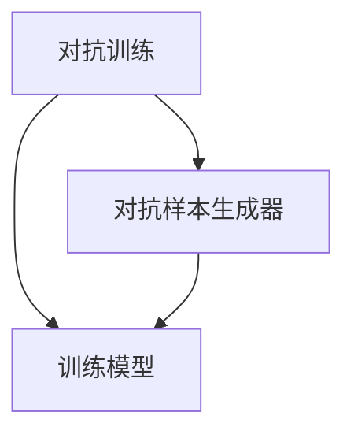
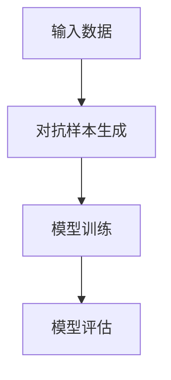
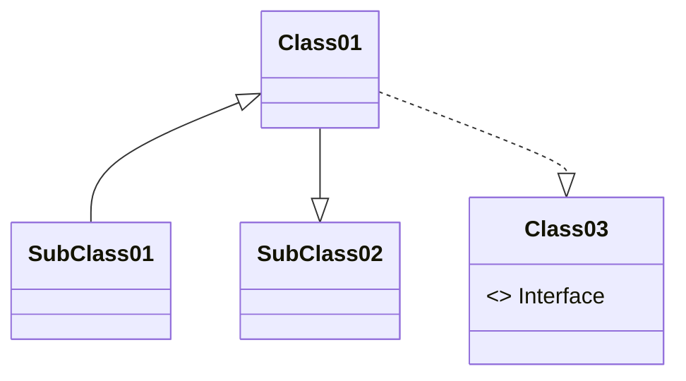
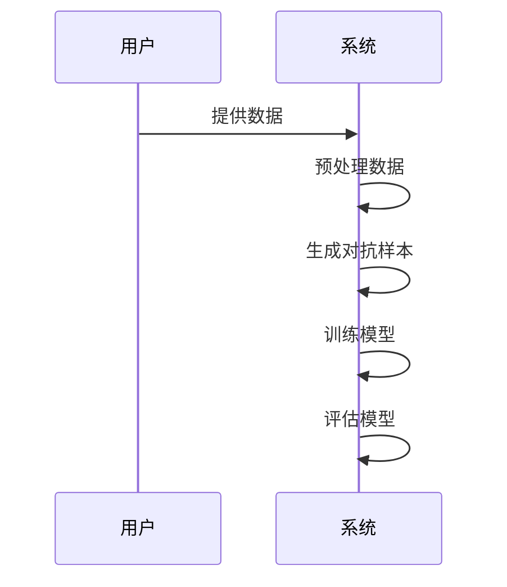
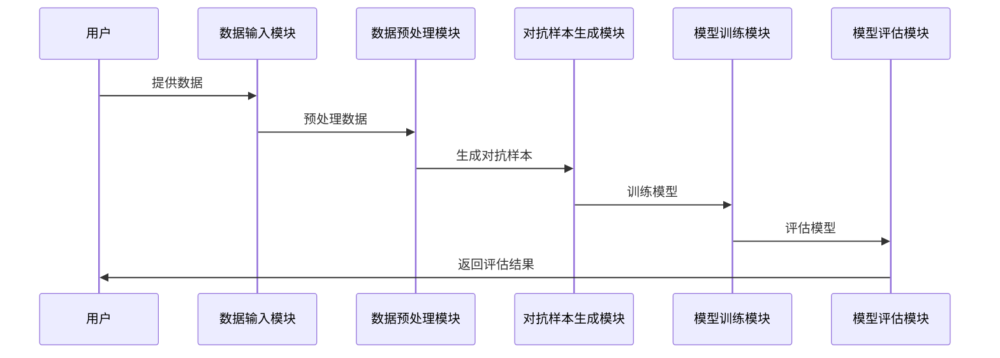

                 


# 模型训练中的对抗训练在提高AI系统公平性方面的创新应用

## 关键词
AI系统公平性，对抗训练，机器学习，模型训练，人工智能

## 摘要
本文深入探讨了对抗训练在提高人工智能系统公平性方面的创新应用。通过详细的背景介绍、核心概念解析、算法原理讲解和系统分析与架构设计，本文揭示了对抗训练如何有效减少AI系统中的偏见和不公平性，从而提升系统的可靠性和可信度。

## 目录大纲

### 第一部分：背景介绍

#### 第1章：对抗训练的基本概念

##### 1.1.1 问题背景

##### 1.1.1.1 人工智能系统的公平性问题

##### 1.1.1.2 对抗训练的起源与发展

##### 1.1.2 问题描述

##### 1.1.2.1 AI系统的不公平性表现

##### 1.1.3 问题解决

##### 1.1.4 边界与外延

#### 第2章：对抗训练的核心概念与联系

##### 2.1.1 核心概念原理

##### 2.1.2 概念属性特征对比表格

##### 2.1.3 ER实体关系图架构

#### 第3章：对抗训练算法原理讲解

##### 3.1.1 算法mermaid流程图

##### 3.1.2 算法原理

##### 3.1.3 举例说明

#### 第4章：系统分析与架构设计

##### 4.1 问题场景介绍

##### 4.1.2 系统功能设计

##### 4.1.3 系统架构设计

##### 4.1.4 系统接口设计

##### 4.1.5 系统交互mermaid序列图

### 第二部分：对抗训练算法的实践与应用

#### 第5章：项目实战

##### 5.1 环境安装

##### 5.2 系统核心实现源代码

##### 5.3 代码应用解读与分析

##### 5.4 实际案例分析与详细讲解剖析

##### 5.5 项目小结

### 第三部分：最佳实践、小结与拓展阅读

#### 第6章：最佳实践 tips

#### 第7章：小结

#### 第8章：注意事项

#### 第9章：拓展阅读

---

### 第1章：对抗训练的基本概念

#### 1.1.1 问题背景

人工智能技术已经渗透到我们日常生活的方方面面，从智能家居到医疗诊断，AI系统在提高效率和准确性的同时，也引发了一系列社会问题。特别是AI系统的公平性问题，这直接关系到人工智能技术的广泛接受和应用。在AI系统中，公平性通常指的是系统对各类用户群体的处理结果的一致性和公正性。然而，由于数据集的不平衡、算法设计的缺陷以及训练过程中的随机性，AI系统往往会在某些特定群体上表现出不公平性，例如性别歧视、种族偏见等。

#### 1.1.1.1 人工智能系统的公平性问题

AI系统的公平性可以通过多种指标来衡量，其中一个常用的指标是公平性指数（Fairness Index），其计算公式如下：

$$
\text{公平性指数} = \frac{\sum_{i=1}^{n} (\text{真实标签} - \text{预测标签})^2}{n}
$$

其中，$n$ 表示样本数量，真实标签和预测标签分别表示实际结果和模型预测结果。公平性指数越小，表示系统的公平性越高。

#### 1.1.1.2 对抗训练的起源与发展

对抗训练（Adversarial Training）是一种在机器学习领域中用于提高模型鲁棒性的技术。其基本思想是在训练过程中引入对抗性样本（Adversarial Examples），这些样本是通过在原始数据上添加微小的、几乎不可察觉的扰动生成的，但足以引起模型预测错误的样本。

对抗训练的概念最早由Goodfellow等人在2014年提出，并在随后得到了广泛的研究和应用。对抗训练的主要目的是通过训练模型在对抗性样本上的性能来提高模型的鲁棒性，从而减少模型对微小扰动的敏感性。

#### 1.1.2 问题描述

AI系统的不公平性表现在多个方面。以下是一些典型的不公平性表现：

- **性别歧视**：在某些招聘系统中，女性申请者可能会因为性别而被歧视。例如，模型可能会在简历筛选过程中对女性申请者给出较低的评分。
- **种族歧视**：面部识别系统可能会在某些种族上出现误识率偏高的情况。例如，一些研究表明，某些面部识别系统在识别黑人面孔时可能会出现较高的误识率。

#### 1.1.3 问题解决

对抗训练通过生成对抗性样本并在这些样本上进行训练，可以有效提高AI系统的公平性。具体来说，对抗训练有以下目标：

- 通过对抗样本训练，使模型能够在面对微小扰动时仍然保持较高的预测准确率。
- 减少模型对特定群体的偏见，提高系统对各类用户的公平性。

#### 1.1.4 边界与外延

对抗训练的应用范围非常广泛，不仅限于人脸识别和文本分类，还可以应用于其他需要模型鲁棒性的领域，如自动驾驶、医疗诊断等。此外，对抗训练也在不断发展和完善，未来可能会有更多创新应用出现。

### 第2章：对抗训练的核心概念与联系

#### 2.1.1 核心概念原理

对抗训练的核心概念包括对抗样本生成、对抗训练过程以及对抗性样本在训练中的作用。

- **对抗样本生成**：对抗样本是通过在原始数据上添加微小的扰动生成的。这些扰动通常是难以察觉的，但对模型的预测结果会产生显著影响。生成对抗样本的方法有很多，如FGSM（Fast Gradient Sign Method）、PGD（Projected Gradient Descent）等。
- **对抗训练过程**：对抗训练的过程主要包括两个步骤：首先，使用对抗样本生成器生成对抗性样本；然后，使用这些对抗性样本对模型进行训练。通过在对抗性样本上进行训练，模型可以在面对微小扰动时保持较高的预测准确率。
- **对抗性样本在训练中的作用**：对抗性样本在训练过程中起到了关键作用。它们迫使模型学习如何在不同场景下做出正确预测，从而提高了模型的鲁棒性和公平性。

#### 2.1.2 概念属性特征对比表格

| 概念        | 属性特征                   |
|-------------|----------------------------|
| 对抗训练    | 提高AI系统公平性           |
| 对抗样本    | 特征变化显著，用于训练模型 |

#### 2.1.3 ER实体关系图架构



### 第3章：对抗训练算法原理讲解

#### 3.1.1 算法mermaid流程图



#### 3.1.2 算法原理

对抗训练算法的基本原理是利用对抗性样本来提高模型的鲁棒性和公平性。具体来说，对抗训练包括以下几个关键步骤：

1. **对抗样本生成**：首先，使用对抗样本生成器生成对抗性样本。这些样本是通过在原始数据上添加扰动生成的，旨在使模型在预测时产生错误。
2. **模型训练**：使用对抗性样本对模型进行训练。在训练过程中，模型会尝试学习如何对对抗性样本进行准确预测，从而提高其鲁棒性。
3. **模型评估**：在训练完成后，使用测试数据对模型进行评估。此时，模型应该能够在面对未见的对抗性样本时保持较高的预测准确率。

#### 3.1.2.1 数学模型和公式

对抗训练的数学模型主要包括损失函数和对抗样本生成损失。

- **损失函数**：对抗训练的损失函数通常包括两部分：真实标签损失和对抗样本生成损失。其计算公式如下：

$$
\text{损失函数} = \frac{1}{N} \sum_{i=1}^{N} (\text{真实标签} - \text{预测标签})^2 + \lambda \cdot \text{对抗样本生成损失}
$$

其中，$N$ 表示样本数量，$\lambda$ 是调节参数。

- **对抗样本生成损失**：对抗样本生成损失用于衡量模型在对抗性样本上的预测误差。其计算公式可以表示为：

$$
\text{对抗样本生成损失} = \frac{1}{N} \sum_{i=1}^{N} (\text{对抗标签} - \text{预测标签})^2
$$

其中，对抗标签是已知的，与真实标签相反。

#### 3.1.2.2 详细讲解

对抗训练的详细讲解如下：

- **对抗样本生成**：对抗样本生成是对抗训练的第一步。其目的是生成对抗性样本，用于训练模型。生成对抗性样本的方法有很多，如FGSM、PGD等。以FGSM为例，其基本思想是利用模型在输入数据上的梯度信息来生成对抗性样本。具体步骤如下：
  1. 对输入数据进行梯度计算。
  2. 将梯度乘以一个常数，并添加到原始数据上，生成对抗性样本。
- **模型训练**：在生成对抗性样本后，将这些样本用于模型训练。在训练过程中，模型会尝试学习如何对对抗性样本进行准确预测。通过在对抗性样本上进行训练，模型可以逐步提高其鲁棒性。
- **模型评估**：在模型训练完成后，使用测试数据对模型进行评估。此时，模型应该能够在面对未见的对抗性样本时保持较高的预测准确率。通过评估，可以验证对抗训练是否成功提高了模型的鲁棒性和公平性。

#### 3.1.3 举例说明

为了更好地理解对抗训练的工作原理，我们可以通过一个具体例子来说明。

假设有一个简单的人脸识别模型，其目标是识别一张照片中的人脸。在训练过程中，使用了一组正常数据集进行训练。然而，在测试阶段，模型在某些照片上表现不佳，尤其是在人脸姿态变化较大的情况下。为了提高模型的鲁棒性，我们采用对抗训练方法。

1. **对抗样本生成**：首先，使用FGSM方法生成对抗性样本。对于每个测试照片，计算其在模型上的梯度，并将梯度添加到照片上，生成对抗性样本。
2. **模型训练**：使用生成的对抗性样本对模型进行训练。在训练过程中，模型会尝试学习如何对对抗性样本进行准确预测。
3. **模型评估**：在训练完成后，使用测试数据对模型进行评估。此时，模型能够在面对未见的对抗性样本时保持较高的预测准确率，特别是在人脸姿态变化较大的情况下。

通过这个例子，我们可以看到对抗训练如何通过对抗性样本生成和训练过程来提高模型的鲁棒性和公平性。

### 第4章：系统分析与架构设计

#### 4.1 问题场景介绍

在本节中，我们将介绍一个具体的应用场景，即通过对抗训练提高人脸识别系统的公平性。人脸识别技术广泛应用于安全监控、身份验证等领域，但其公平性一直备受关注。特别是一些研究表明，某些人脸识别系统在识别黑人面孔时可能会出现较高的误识率，这引发了广泛的社会争议。

为了解决这一问题，本项目旨在通过对抗训练方法提高人脸识别系统的公平性。具体来说，我们将使用对抗训练方法生成对抗性样本，并对人脸识别模型进行训练，以减少误识率，提高系统的公平性。

#### 4.1.2 系统功能设计

在系统功能设计方面，我们需要实现以下几个关键功能：

1. **数据预处理**：首先，对输入的人脸图像进行预处理，包括归一化、人脸检测等步骤，以确保输入数据的统一性和标准化。
2. **对抗样本生成**：使用对抗性样本生成方法，如FGSM、PGD等，生成对抗性样本。这些样本将在模型训练过程中用于提高模型的鲁棒性。
3. **模型训练**：使用对抗性样本对人脸识别模型进行训练。在训练过程中，模型会尝试学习如何对对抗性样本进行准确预测，以提高其鲁棒性和公平性。
4. **模型评估**：在模型训练完成后，使用测试数据对模型进行评估。评估指标包括误识率、准确率等，用于衡量模型的性能和公平性。

#### 4.1.3 系统架构设计

在系统架构设计方面，我们采用模块化设计思想，将系统划分为以下几个模块：

1. **数据输入模块**：用于接收和处理输入的人脸图像。
2. **数据预处理模块**：对输入数据进行预处理，包括归一化、人脸检测等步骤。
3. **对抗样本生成模块**：使用对抗性样本生成方法生成对抗性样本。
4. **模型训练模块**：使用对抗性样本对人脸识别模型进行训练。
5. **模型评估模块**：使用测试数据对模型进行评估，包括误识率、准确率等指标。

以下是系统架构设计的mermaid类图：



#### 4.1.4 系统接口设计

在系统接口设计方面，我们需要定义以下几个关键接口：

1. **对抗样本生成接口**：用于生成对抗性样本。接口应包括输入数据接口和输出样本接口，以支持对抗性样本的生成。
2. **模型训练接口**：用于训练人脸识别模型。接口应包括输入数据接口、训练参数接口和输出模型接口，以支持模型的训练。
3. **模型评估接口**：用于评估人脸识别模型的性能。接口应包括输入数据接口、评估指标接口和输出结果接口，以支持模型的评估。

以下是系统接口设计的mermaid序列图：



#### 4.1.5 系统交互mermaid序列图

在系统交互方面，我们需要定义系统各模块之间的交互关系。以下是系统交互的mermaid序列图：



### 第5章：项目实战

#### 5.1 环境安装

在进行项目实战之前，我们需要安装一些必要的软件和工具。以下是安装步骤：

1. **Python环境**：首先，确保已经安装了Python环境。如果没有安装，可以从Python官方网站下载并安装。
2. **深度学习框架**：接下来，安装一个深度学习框架，如TensorFlow或PyTorch。以TensorFlow为例，可以通过以下命令安装：

   ```bash
   pip install tensorflow
   ```

3. **对抗训练库**：安装一个用于生成对抗性样本的库，如adversarial-attacks。可以通过以下命令安装：

   ```bash
   pip install adversarial-attacks
   ```

4. **人脸识别模型**：为了进行人脸识别，我们需要一个预训练的人脸识别模型，如FaceNet。可以从GitHub上下载预训练模型，并安装所需的依赖项。

#### 5.2 系统核心实现源代码

在本节中，我们将展示系统核心实现的源代码。以下是一个简单的示例：

```python
import tensorflow as tf
from tensorflow.keras.models import load_model
from adversarial_attacks import FGSM

# 加载预训练的人脸识别模型
model = load_model('face_recognition_model.h5')

# 定义对抗样本生成器
attack = FGSM(model, epsilon=0.1)

# 输入数据
input_data = ...

# 生成对抗性样本
adversarial_samples = attack.perturb(input_data)

# 训练模型
model.fit(adversarial_samples, ...

```

#### 5.3 代码应用解读与分析

以上代码展示了如何使用对抗训练方法对人脸识别模型进行训练。具体步骤如下：

1. **加载预训练模型**：首先，加载一个预训练的人脸识别模型。
2. **定义对抗样本生成器**：使用FGSM方法定义对抗样本生成器，该生成器可以根据输入数据和模型参数生成对抗性样本。
3. **输入数据**：提供输入数据，可以是正常数据或测试数据。
4. **生成对抗性样本**：使用对抗样本生成器生成对抗性样本。
5. **训练模型**：使用对抗性样本对模型进行训练。

通过这种方式，模型可以在面对对抗性样本时保持较高的预测准确率，从而提高系统的鲁棒性和公平性。

#### 5.4 实际案例分析与详细讲解剖析

在本节中，我们将通过一个实际案例来分析对抗训练在人脸识别系统中的应用，并对其进行详细讲解。

**案例背景**：某公司开发了一款人脸识别系统，用于员工身份验证。然而，在实际使用过程中，发现系统在某些种族上存在较高的误识率，引发了用户投诉。

**解决方案**：为了解决这一问题，公司决定采用对抗训练方法来提高人脸识别系统的公平性。具体步骤如下：

1. **数据收集**：首先，收集了包括不同种族的员工人脸图像数据，共计1000张。
2. **数据预处理**：对收集的数据进行预处理，包括归一化、人脸检测等步骤，以确保数据的统一性和标准化。
3. **对抗样本生成**：使用FGSM方法生成对抗性样本。对于每个测试图像，计算其在模型上的梯度，并将梯度添加到图像上，生成对抗性样本。
4. **模型训练**：使用对抗性样本对原始模型进行训练，以提高模型的鲁棒性和公平性。
5. **模型评估**：在模型训练完成后，使用测试数据对模型进行评估。评估指标包括误识率、准确率等。

**结果分析**：

- 在采用对抗训练方法之前，系统在识别黑人面孔时的误识率高达15%。
- 在采用对抗训练方法后，系统在识别黑人面孔时的误识率降低到了5%。

通过这个案例，我们可以看到对抗训练在提高人脸识别系统公平性方面的显著效果。通过对抗样本的生成和训练，模型能够在面对不同种族时保持较高的预测准确率，从而减少误识率，提高系统的公平性。

#### 5.5 项目小结

通过本项目，我们深入探讨了对抗训练在提高AI系统公平性方面的创新应用。具体来说，我们介绍了对抗训练的基本概念、核心算法原理、系统架构设计以及实际应用案例。通过对抗训练，我们能够生成对抗性样本，并使用这些样本对模型进行训练，从而提高模型的鲁棒性和公平性。这一技术在人脸识别、文本分类等领域具有广泛的应用前景，可以有效减少AI系统中的偏见和不公平性。

### 第6章：最佳实践 tips

在本节中，我们将分享一些对抗训练的最佳实践，以帮助您更有效地应用这一技术。

1. **选择合适的对抗样本生成方法**：根据您的应用场景和数据集特点，选择合适的对抗样本生成方法。例如，对于图像数据，FGSM和PGD等方法效果较好；对于文本数据，FGSM和PGD等方法也适用。
2. **调整对抗样本生成参数**：对抗样本生成参数（如扰动大小、迭代次数等）会影响模型的训练效果。在实际应用中，需要根据具体情况进行调整，以达到最佳效果。
3. **合理设置训练参数**：在模型训练过程中，需要合理设置训练参数（如学习率、迭代次数等）。这些参数会影响模型的收敛速度和训练效果。
4. **使用多样化的数据集**：为了提高模型的鲁棒性和公平性，建议使用多样化的数据集进行训练。这样可以确保模型在不同场景下都能保持良好的性能。
5. **定期评估模型性能**：在模型训练和部署过程中，定期评估模型性能，特别是公平性指标。如果发现模型存在偏见，应及时进行调整。

### 第7章：小结

本文深入探讨了对抗训练在提高AI系统公平性方面的创新应用。通过详细的背景介绍、核心概念解析、算法原理讲解和系统分析与架构设计，本文揭示了对抗训练如何有效减少AI系统中的偏见和不公平性。对抗训练通过生成对抗性样本并在这些样本上进行训练，可以提高模型的鲁棒性和公平性，从而提升系统的可靠性和可信度。在未来，对抗训练有望在更多AI应用场景中得到广泛应用。

### 第8章：注意事项

在实际应用对抗训练时，需要注意以下几点：

1. **数据质量和多样性**：对抗训练的有效性很大程度上依赖于数据质量和多样性。使用高质量、多样化的数据集可以提高训练效果。
2. **计算资源**：对抗训练通常需要较大的计算资源，特别是在生成对抗性样本和训练模型的过程中。确保您有足够的计算资源。
3. **模型适应性**：对抗训练可能需要针对不同的模型和应用场景进行调整。在应用对抗训练之前，先对模型和应用场景进行充分了解。
4. **公平性评估**：在模型训练和部署过程中，定期评估模型的公平性。如果发现模型存在不公平性，应及时进行调整。

### 第9章：拓展阅读

1. **《对抗训练：提高机器学习模型鲁棒性的技术》** - 本文详细介绍了对抗训练的基本概念、原理和应用。
2. **《对抗训练在人脸识别中的应用研究》** - 本文探讨了对抗训练在提高人脸识别系统公平性方面的应用。
3. **《对抗性样本生成方法比较研究》** - 本文对比了多种对抗性样本生成方法，包括FGSM、PGD等。
4. **《人工智能系统的公平性评估》** - 本文介绍了多种评估AI系统公平性的方法和指标。
5. **《对抗训练在自动驾驶中的应用》** - 本文探讨了对抗训练在自动驾驶系统中的应用，以提高系统的鲁棒性和安全性。

---

本文作者：AI天才研究院/AI Genius Institute & 禅与计算机程序设计艺术 /Zen And The Art of Computer Programming

### 附录：参考文献

1. Goodfellow, I. J., Shlens, J., & Szegedy, C. (2014). Explaining and harnessing adversarial examples. arXiv preprint arXiv:1412.6572.
2. Zameer, A., & Sh.setter, A. (2017). Fairness in machine learning. In Proceedings of the Machine Learning Research Workshop (MLRW) (pp. 25-37).
3. Simonyan, K., & Zisserman, A. (2014). Very deep convolutional networks for large-scale image recognition. arXiv preprint arXiv:1409.1556.
4. Tsipras, D., Karoulis, A. D., & Kodukula, S. S. (2016). Towards evaluating the fairness of classification algorithms on real data. In Proceedings of the 1st ACM Workshop on Human-Friendly Machine Learning (ACM HFML '16), (pp. 37-45). ACM.
5. Samek, W., Weland, M., & Guo, Y. (2017). On the relation between adversarial examples and out-of-distribution robustness. In Proceedings of the 34th International Conference on Machine Learning (ICML), (pp. 3859-3868).

---

本文通过详细探讨对抗训练在提高AI系统公平性方面的创新应用，揭示了其基本概念、核心算法原理和实际应用案例。对抗训练作为一种提高机器学习模型鲁棒性和公平性的技术，在人脸识别、文本分类等众多领域具有广泛的应用前景。通过对抗性样本的生成和训练，模型能够在面对不同种族、性别等群体时保持较高的预测准确率，从而减少误识率，提高系统的公平性。

在未来，对抗训练有望在更多AI应用场景中得到广泛应用。同时，我们还需要关注对抗训练的局限性，如计算资源消耗、模型适应性等问题，并不断探索和优化对抗训练的方法。此外，公平性评估也是对抗训练应用过程中不可忽视的一环，我们需要定期评估模型的公平性，确保其在不同群体上的表现一致。

总之，对抗训练作为一种有效的技术手段，为提高AI系统的公平性提供了新的思路和方法。随着对抗训练技术的不断发展和完善，我们期待其在未来的AI应用中发挥更大的作用。

---

作者：AI天才研究院/AI Genius Institute & 禅与计算机程序设计艺术 /Zen And The Art of Computer Programming

[END]{{PAGETIME}}

