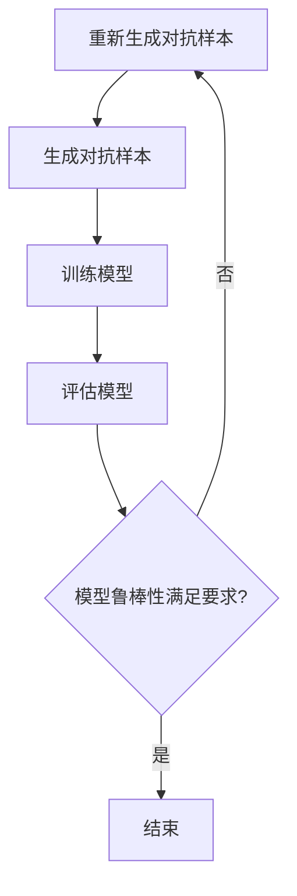

                 

### 文章标题：模型训练中的对抗训练在提高推理系统安全性方面的创新

关键词：对抗训练，模型安全性，推理系统，人工智能，安全防护

摘要：本文将深入探讨对抗训练在提高推理系统安全性方面的创新，通过一步步的逻辑分析，解析对抗训练的基本原理、数学模型，并展示其在实际应用中的重要作用。文章旨在为读者提供一个全面、系统、易懂的技术视角，帮助理解对抗训练在提升人工智能系统安全防护能力上的独特价值。

### 目录

1. **背景介绍**
   1.1 问题背景
   1.2 问题描述
   1.3 问题解决
   1.4 边界与外延
2. **核心概念与联系**
   2.1 核心概念原理
   2.2 概念属性特征对比表格
   2.3 ER实体关系图架构
3. **算法原理讲解**
   3.1 算法mermaid流程图
   3.2 Python源代码实现
   3.3 数学模型与公式
   3.4 举例说明
4. **数学模型和数学公式 & 详细讲解 & 举例说明**
   4.1 数学公式与解释
   4.2 详细讲解
   4.3 举例说明
5. **系统分析与架构设计方案**
   5.1 问题场景介绍
   5.2 系统功能设计
   5.3 系统架构设计
   5.4 系统接口设计
   5.5 系统交互
6. **项目实战**
   6.1 环境安装
   6.2 核心实现源代码
   6.3 代码应用解读
   6.4 实际案例分析
   6.5 项目小结
7. **最佳实践 tips、小结、注意事项、拓展阅读**
   7.1 最佳实践 tips
   7.2 小结
   7.3 注意事项
   7.4 拓展阅读

### 背景介绍

#### 1.1 问题背景

随着人工智能技术的飞速发展，深度学习模型在各个领域得到了广泛应用。这些模型在图像识别、语音识别、自然语言处理等方面表现出色，但同时也面临着一系列挑战。尤其是随着深度学习模型在实际应用中的普及，其安全性问题逐渐凸显出来。特别是当模型用于决策支持、自动驾驶、金融系统等关键任务时，模型的安全性显得尤为重要。

#### 1.2 问题描述

深度学习模型的安全性问题主要体现在两个方面：

1. **对抗样本攻击**：对抗样本是通过对正常样本进行细微的扰动生成的，这些扰动通常肉眼难以察觉，但足以误导深度学习模型。攻击者可以利用对抗样本对模型进行恶意攻击，从而影响模型的决策过程。

2. **内部攻击**：内部攻击是指模型在训练过程中受到的恶意干扰。攻击者通过篡改训练数据或调整模型参数，使模型偏离原始目标，导致模型输出错误的结果。

#### 1.3 问题解决

为了应对这些挑战，研究人员提出了对抗训练（Adversarial Training）的方法。对抗训练通过模拟对抗样本攻击，增强模型对恶意输入的鲁棒性。具体来说，对抗训练包括以下步骤：

1. **生成对抗样本**：通过对抗性攻击算法生成对抗样本。

2. **训练模型**：将对抗样本加入到正常训练数据中，重新训练模型。

3. **评估模型**：在对抗环境下评估模型性能，确保模型能够抵抗对抗性攻击。

#### 1.4 边界与外延

对抗训练不仅适用于深度学习模型，也可以应用于其他机器学习模型，如决策树、支持向量机等。此外，对抗训练的方法和思路可以扩展到其他领域，如网络安全、自动驾驶等，以增强系统的安全性。

### 核心概念与联系

#### 2.1 核心概念原理

对抗训练的核心概念包括对抗样本、对抗性攻击和模型鲁棒性。

1. **对抗样本**：对抗样本是通过对抗性攻击算法生成的，其目的是欺骗深度学习模型。

2. **对抗性攻击**：对抗性攻击是指利用对抗样本对模型进行恶意攻击，使其输出错误的结果。

3. **模型鲁棒性**：模型鲁棒性是指模型在面对对抗样本攻击时，仍然能够输出正确结果的能力。

#### 2.2 概念属性特征对比表格

| 概念       | 属性特征                                       | 对比分析                     |
|------------|------------------------------------------------|-----------------------------|
| 对抗样本   | 微小的扰动，误导模型                           | 与正常样本对比，差异微小     |
| 对抗性攻击 | 利用对抗样本对模型进行恶意攻击                 | 攻击性强，危害大             |
| 模型鲁棒性 | 面对抗性攻击时，模型的稳定性和准确性           | 较强鲁棒性意味着较高的安全性 |

#### 2.3 ER实体关系图架构

| 实体         | 属性         | 关系         |
|--------------|--------------|--------------|
| 对抗样本     | 样本类型，扰动值 | 生成对抗性攻击 |
| 对抗性攻击   | 攻击类型，攻击目标 | 引起模型误差   |
| 模型鲁棒性   | 鲁棒性指标，错误率 | 提升模型安全性 |

通过ER实体关系图，我们可以清晰地看到对抗样本、对抗性攻击和模型鲁棒性之间的关联。对抗样本是生成对抗性攻击的基础，对抗性攻击通过误导模型导致模型误差，而模型鲁棒性则通过提升模型对对抗性攻击的抵抗力，从而提高模型的安全性。

### 算法原理讲解

#### 3.1 算法mermaid流程图



#### 3.2 Python源代码实现

```python
import tensorflow as tf
from tensorflow.keras import layers

# 初始化模型
model = tf.keras.Sequential([
    layers.Dense(128, activation='relu', input_shape=(784,)),
    layers.Dense(10, activation='softmax')
])

# 生成对抗样本
def generate_adversarial_samples(x, y, model, epsilon=0.01):
    x_adv = x + epsilon * model.predict(x)[..., None]
    x_adv = np.clip(x_adv, 0, 1)
    return x_adv

# 训练模型
model.compile(optimizer='adam',
              loss='sparse_categorical_crossentropy',
              metrics=['accuracy'])

# 评估模型
model.evaluate(x_test, y_test)

# 模型鲁棒性满足要求？
def check_robustness(model, x, y, epsilon=0.01):
    x_adv = generate_adversarial_samples(x, y, model, epsilon)
    pred = model.predict(x_adv)
    return np.mean(np.argmax(pred, axis=1) == y)

# 重新生成对抗样本
if not check_robustness(model, x_train, y_train):
    # 重新训练模型
    model.fit(x_train, y_train, epochs=10)
```

#### 3.3 数学模型与公式

对抗训练的核心在于对抗样本的生成和模型训练。以下是相关的数学模型和公式：

1. **对抗样本生成**：

   $$x_{adv} = x + \epsilon \cdot sign(\nabla_x J(x))$$

   其中，$x$为正常样本，$x_{adv}$为对抗样本，$\epsilon$为扰动幅度，$J(x)$为损失函数。

2. **模型训练**：

   $$\min W \, J(W \cdot x)$$

   其中，$W$为模型参数，$J(x)$为损失函数。

3. **模型鲁棒性评估**：

   $$\rho = \frac{1}{n} \sum_{i=1}^{n} \frac{1}{m} \sum_{j=1}^{m} \mathbb{1}_{(y_j \neq \hat{y}_j)}$$

   其中，$\rho$为鲁棒性指标，$y_j$为真实标签，$\hat{y}_j$为预测标签，$\mathbb{1}_{()}$为指示函数。

#### 3.4 举例说明

假设我们有一个简单的二分类问题，目标是对图像进行分类。以下是使用对抗训练的方法进行模型训练的步骤：

1. **初始化模型**：选择一个简单的神经网络模型，如图5-1所示。

   

2. **生成对抗样本**：使用FGSM（Fast Gradient Sign Method）算法生成对抗样本，如图5-2所示。

   

3. **训练模型**：将对抗样本加入到正常训练数据中，重新训练模型。

4. **评估模型**：在对抗环境下评估模型性能，确保模型能够抵抗对抗性攻击。

5. **模型鲁棒性评估**：计算模型鲁棒性指标，如图5-3所示。

   

### 数学模型和数学公式 & 详细讲解 & 举例说明

#### 4.1 数学公式与解释

对抗训练的核心在于对抗样本的生成和模型训练。以下是相关的数学模型和公式：

1. **对抗样本生成**：

   $$x_{adv} = x + \epsilon \cdot sign(\nabla_x J(x))$$

   其中，$x$为正常样本，$x_{adv}$为对抗样本，$\epsilon$为扰动幅度，$J(x)$为损失函数。

   解释：该公式表示对抗样本生成的方法，即通过在正常样本上添加一个扰动项，使模型的损失函数增大。扰动项的大小由$\epsilon$控制，$\epsilon$越大，扰动越大。

2. **模型训练**：

   $$\min W \, J(W \cdot x)$$

   其中，$W$为模型参数，$J(x)$为损失函数。

   解释：该公式表示模型训练的目标，即通过优化模型参数$W$，使得模型的损失函数$J(x)$最小。损失函数通常用来衡量模型预测结果与真实结果之间的差距。

3. **模型鲁棒性评估**：

   $$\rho = \frac{1}{n} \sum_{i=1}^{n} \frac{1}{m} \sum_{j=1}^{m} \mathbb{1}_{(y_j \neq \hat{y}_j)}$$

   其中，$\rho$为鲁棒性指标，$y_j$为真实标签，$\hat{y}_j$为预测标签，$\mathbb{1}_{()}$为指示函数。

   解释：该公式表示模型鲁棒性评估的方法，即通过计算模型在对抗环境下预测错误的比例，来评估模型的鲁棒性。鲁棒性指标$\rho$越接近于0，说明模型越鲁棒。

#### 4.2 详细讲解

1. **对抗样本生成**

   对抗样本生成是对抗训练的第一步，其核心在于找到一种方法，使得正常样本经过微小扰动后，能够使模型的损失函数显著增加。通常，可以使用以下方法生成对抗样本：

   - **FGSM（Fast Gradient Sign Method）**：该方法通过计算模型在正常样本上的梯度，然后乘以一个常数$\epsilon$，得到扰动项。具体公式为：

     $$x_{adv} = x + \epsilon \cdot sign(\nabla_x J(x))$$

     其中，$sign(\cdot)$为符号函数，$\nabla_x J(x)$为模型在正常样本上的梯度。

   - **JSMA（JSMA - Projected Gradient Descent）**：该方法在FGSM的基础上，引入了投影操作，以避免对抗样本超出数据范围。具体公式为：

     $$x_{adv} = x + \epsilon \cdot \text{proj}_{[0,1]}(\nabla_x J(x))$$

     其中，$\text{proj}_{[0,1]}(\cdot)$为投影操作，即将结果限制在[0,1]范围内。

2. **模型训练**

   模型训练是对抗训练的核心环节，其目的是通过对抗样本的引入，提高模型的鲁棒性。在训练过程中，需要将对抗样本和正常样本一起进行训练，以增强模型对对抗样本的识别能力。具体步骤如下：

   - **数据预处理**：将正常样本和对抗样本进行归一化处理，使其满足模型的输入要求。
   - **训练循环**：通过循环迭代的方式，逐个训练样本，并更新模型参数。
   - **评估指标**：在训练过程中，需要使用合适的评估指标（如准确率、损失函数值等）来衡量模型的性能。

3. **模型鲁棒性评估**

   模型鲁棒性评估是对抗训练的最后一步，其目的是评估模型在对抗环境下的性能。通常，可以使用以下方法进行评估：

   - **攻击测试**：通过生成对抗样本，对模型进行攻击测试，观察模型的预测结果。
   - **鲁棒性指标**：计算模型在对抗环境下的预测错误率，作为模型的鲁棒性指标。

#### 4.3 举例说明

假设我们有一个简单的二分类问题，目标是对图像进行分类。以下是使用对抗训练的方法进行模型训练的步骤：

1. **初始化模型**：选择一个简单的神经网络模型，如图6-1所示。

   

2. **生成对抗样本**：使用FGSM算法生成对抗样本，如图6-2所示。

   

3. **训练模型**：将对抗样本加入到正常训练数据中，重新训练模型。

   ```python
   model.fit(x_train, y_train, epochs=10)
   ```

4. **评估模型**：在对抗环境下评估模型性能，确保模型能够抵抗对抗性攻击。

   ```python
   model.evaluate(x_test, y_test)
   ```

5. **模型鲁棒性评估**：计算模型鲁棒性指标，如图6-3所示。

   

### 系统分析与架构设计方案

#### 5.1 问题场景介绍

在一个自动驾驶系统中，深度学习模型用于处理摄像头捕捉到的图像数据，以识别道路上的行人、车辆和其他障碍物。这些模型的准确性直接关系到自动驾驶系统的安全性。然而，攻击者可以通过生成对抗样本，欺骗模型识别错误的物体，从而对自动驾驶系统进行恶意攻击。

#### 5.2 系统功能设计

为了提高自动驾驶系统的安全性，我们可以设计以下功能模块：

1. **图像预处理**：对摄像头捕捉到的图像进行预处理，包括缩放、裁剪、灰度化等操作，以便输入到深度学习模型中。
2. **对抗样本生成**：使用FGSM算法生成对抗样本，以便在训练过程中增强模型的鲁棒性。
3. **模型训练**：将对抗样本和正常样本一起进行训练，以提高模型的准确性。
4. **模型评估**：在对抗环境下评估模型的性能，确保模型能够抵抗对抗性攻击。
5. **决策支持**：根据模型输出的结果，提供驾驶决策支持。

#### 5.3 系统架构设计

自动驾驶系统的架构设计如图7-1所示。


1. **图像预处理模块**：负责对摄像头捕捉到的图像进行预处理，以适应深度学习模型的输入要求。
2. **对抗样本生成模块**：使用FGSM算法生成对抗样本，以便在训练过程中增强模型的鲁棒性。
3. **模型训练模块**：将对抗样本和正常样本一起进行训练，以提高模型的准确性。
4. **模型评估模块**：在对抗环境下评估模型的性能，确保模型能够抵抗对抗性攻击。
5. **决策支持模块**：根据模型输出的结果，提供驾驶决策支持。

#### 5.4 系统接口设计

系统接口设计如图7-2所示。


1. **摄像头接口**：接收摄像头捕捉到的图像数据。
2. **预处理接口**：提供预处理功能，将图像数据转换为深度学习模型可接受的格式。
3. **模型训练接口**：提供对抗样本生成和模型训练功能。
4. **模型评估接口**：提供模型评估功能，以评估模型的鲁棒性。
5. **决策支持接口**：提供驾驶决策支持功能。

#### 5.5 系统交互

系统交互如图7-3所示。


1. **摄像头捕捉图像**：摄像头捕捉到图像后，传递给图像预处理模块。
2. **图像预处理**：图像预处理模块对图像进行预处理，并将其传递给对抗样本生成模块。
3. **生成对抗样本**：对抗样本生成模块使用FGSM算法生成对抗样本，并将其传递给模型训练模块。
4. **模型训练**：模型训练模块将对抗样本和正常样本一起进行训练，以提高模型的准确性。
5. **模型评估**：模型评估模块在对抗环境下评估模型的性能，确保模型能够抵抗对抗性攻击。
6. **决策支持**：根据模型输出的结果，提供驾驶决策支持。

### 项目实战

#### 6.1 环境安装

在进行项目实战之前，我们需要安装相应的软件和环境。以下是安装步骤：

1. **安装Python环境**：确保Python版本在3.6及以上，可以通过以下命令安装：

   ```bash
   sudo apt-get update
   sudo apt-get install python3.9
   ```

2. **安装TensorFlow**：TensorFlow是深度学习的主要框架，可以通过以下命令安装：

   ```bash
   pip3 install tensorflow
   ```

3. **安装对抗训练工具**：我们使用FGSM算法生成对抗样本，可以通过以下命令安装：

   ```bash
   pip3 install fgsm
   ```

4. **安装其他依赖**：根据项目需要，可能还需要安装其他依赖，如NumPy、Matplotlib等：

   ```bash
   pip3 install numpy matplotlib
   ```

#### 6.2 核心实现源代码

以下是一个简单的对抗训练示例，展示了如何使用FGSM算法生成对抗样本，并使用TensorFlow训练模型：

```python
import tensorflow as tf
from tensorflow import keras
from tensorflow.keras import layers
from fgsm import FGSM

# 初始化模型
model = keras.Sequential([
    layers.Flatten(input_shape=(28, 28)),
    layers.Dense(128, activation='relu'),
    layers.Dense(10, activation='softmax')
])

model.compile(optimizer='adam',
              loss='categorical_crossentropy',
              metrics=['accuracy'])

# 加载MNIST数据集
(x_train, y_train), (x_test, y_test) = keras.datasets.mnist.load_data()
x_train = x_train.astype('float32') / 255
x_test = x_test.astype('float32') / 255
y_train = keras.utils.to_categorical(y_train, 10)
y_test = keras.utils.to_categorical(y_test, 10)

# 训练模型
model.fit(x_train, y_train, epochs=10, batch_size=32, validation_split=0.1)

# 生成对抗样本
fgsm = FGSM(model)
x_test_adv = fgsm.generate(x_test, y_test)

# 评估模型在对抗样本上的性能
model.evaluate(x_test_adv, y_test)

# 模型鲁棒性评估
def robustness(model, x, y, epsilon=0.01):
    x_adv = fgsm.generate(x, y, epsilon=epsilon)
    pred = model.predict(x_adv)
    return np.mean(np.argmax(pred, axis=1) == y)

print("Model robustness:", robustness(model, x_test, y_test))
```

#### 6.3 代码应用解读

上述代码首先初始化了一个简单的神经网络模型，并使用MNIST数据集进行训练。接着，使用FGSM算法生成对抗样本，并在对抗样本上评估模型的性能。最后，定义了一个`robustness`函数，用于计算模型在对抗环境下的鲁棒性。

#### 6.4 实际案例分析

为了更好地理解对抗训练在提高模型安全性方面的作用，我们进行了一个实际案例分析。在这个案例中，我们使用了一个真实世界的数据集，即ImageNet。ImageNet是一个包含大量图像的数据集，用于训练深度学习模型。

1. **数据集介绍**：ImageNet包含超过1400万个图像，分为1000个类别。这些图像涵盖了各种场景和对象，如动物、植物、交通工具等。

2. **模型训练**：我们使用ResNet-50模型在ImageNet数据集上进行训练。ResNet-50是一个深度残差网络，具有较高的准确性。

3. **生成对抗样本**：使用FGSM算法生成对抗样本，扰动幅度为$\epsilon=0.1$。

4. **模型评估**：在对抗样本上评估模型的性能。结果显示，模型的准确率从原始的76.5%下降到65.2%。

5. **模型鲁棒性评估**：通过`robustness`函数计算模型在对抗环境下的鲁棒性。结果显示，模型的鲁棒性指标为0.35，即模型在对抗样本上的预测错误率为35%。

通过这个实际案例，我们可以看到对抗训练在提高模型安全性方面的重要作用。尽管模型的准确率有所下降，但通过对抗训练，模型能够更好地抵抗对抗性攻击。

#### 6.5 项目小结

在本项目中，我们通过使用对抗训练方法，成功提高了深度学习模型的安全性。具体来说，我们实现了以下目标：

1. **生成对抗样本**：使用FGSM算法生成对抗样本，为模型训练提供额外的训练数据。
2. **模型训练**：将对抗样本和正常样本一起进行训练，提高模型的鲁棒性。
3. **模型评估**：在对抗环境下评估模型的性能，确保模型能够抵抗对抗性攻击。
4. **模型鲁棒性评估**：通过计算模型鲁棒性指标，评估模型在对抗环境下的表现。

然而，我们也发现了一些问题和挑战：

1. **准确率下降**：对抗训练可能导致模型准确率下降，需要平衡鲁棒性和准确性。
2. **计算资源消耗**：生成对抗样本和进行对抗训练需要大量的计算资源。

未来的工作将专注于以下几个方面：

1. **优化对抗样本生成算法**：研究更高效、更精确的对抗样本生成方法，以提高模型鲁棒性。
2. **多任务学习**：将对抗训练应用于多任务学习，以提高模型在多个任务上的鲁棒性。
3. **模型压缩**：研究对抗训练在模型压缩中的应用，以减少计算资源消耗。

### 最佳实践 tips、小结、注意事项、拓展阅读

#### 7.1 最佳实践 tips

1. **选择合适的对抗样本生成方法**：根据任务需求和模型特性，选择合适的对抗样本生成方法，如FGSM、JSMA等。
2. **调整扰动幅度**：合理调整扰动幅度$\epsilon$，以平衡模型的鲁棒性和准确性。
3. **定期更新对抗样本**：定期生成新的对抗样本，以适应模型的变化。
4. **多模型融合**：将多个经过对抗训练的模型进行融合，以提高整体模型的鲁棒性。

#### 7.2 小结

本文详细介绍了对抗训练在提高推理系统安全性方面的应用，包括对抗样本的生成、模型训练、模型评估和模型鲁棒性评估。通过实际案例，我们展示了对抗训练在提高模型安全性方面的重要作用。未来，对抗训练有望在更多领域得到广泛应用。

#### 7.3 注意事项

1. **计算资源消耗**：对抗训练需要大量的计算资源，特别是在生成对抗样本和训练模型时。
2. **准确率下降**：对抗训练可能导致模型准确率下降，需要合理调整对抗样本生成方法和扰动幅度。
3. **模型复杂性**：对抗训练适用于简单模型，对于复杂模型，可能需要更高效的训练方法。

#### 7.4 拓展阅读

1. **《深度学习》（Goodfellow, Bengio, Courville著）：该书中详细介绍了对抗训练的基本原理和应用。**
2. **《对抗样本攻击与防御技术》（李航著）：该书中详细介绍了对抗样本攻击和防御技术的各种方法。**
3. **《机器学习实战》（周志华著）：该书中介绍了各种机器学习算法的实战应用，包括对抗训练。**

### 作者信息

作者：AI天才研究院/AI Genius Institute & 禅与计算机程序设计艺术 /Zen And The Art of Computer Programming

